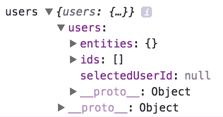
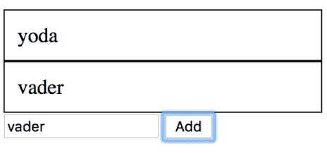
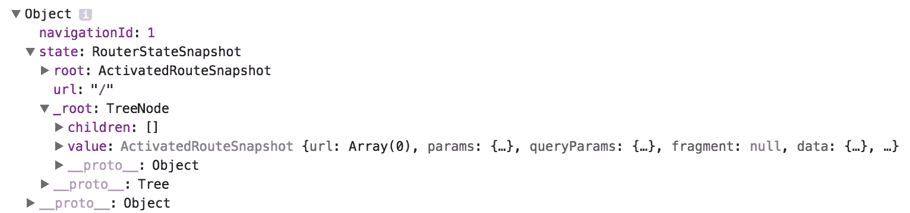
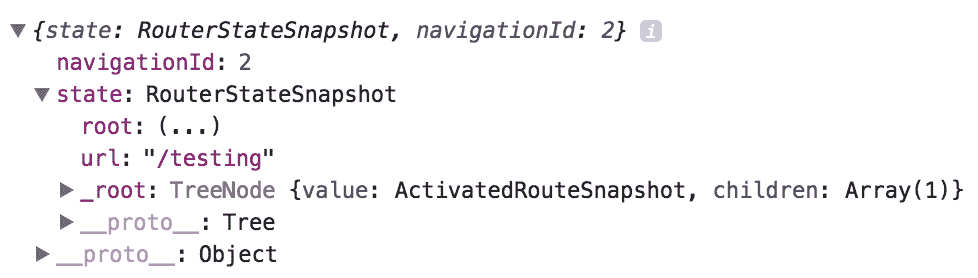
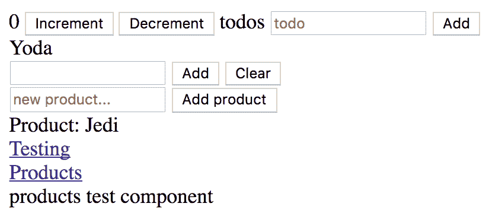
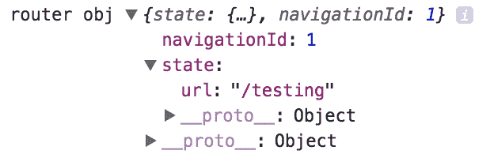
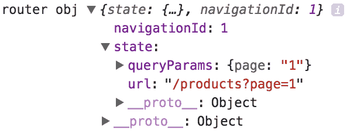
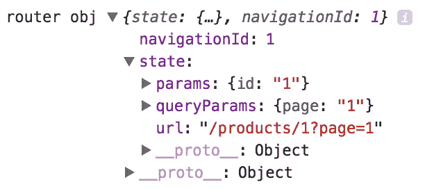

# 第十章：NgRx – 深入了解

本章将深入探讨更高级的 NgRx 主题。当您使用 NgRx 实现第一个应用程序时，您会注意到这意味着创建大量的样板代码，您可能不会感觉像不使用 NgRx 时那样快。因此，实体库存在是为了帮助减轻一些样板代码的创建——关于这一点，本章后面会详细介绍。

路由及其状态是另一个可能值得跟踪的东西。您当前所在的 URL、路由参数以及查询参数都是可能很有用的信息。如果您处于可能需要重新启动应用程序的情况，这些信息可能很有用，也称为**恢复**。

接下来，我们将深入了解如何使用 RxJS 构建您自己的 NgRx 微实现，这样您就可以了解正在发生的事情。希望这将是一个真正令人耳目一新的时刻，有助于理解使 NgRx 和 Redux 运转的底层理念。

为了结束本章和本书，我们将解释什么是 schematics 以及它将如何帮助您快速搭建您需要的各个部分，从而成为 NgRx 的真正高效用户。

在本章中，您将学习如何：

+   利用实体库以及它如何使我们的生活更轻松使用 NgRx

+   通过编写我们自己的定制代码来捕获路由状态以及自定义要保存的内容

+   构建 NgRx 的微实现

+   揭示 schematics 的神秘面纱，看看它如何使我们成为更快、更高效的 NgRx 用户。

# @ngrx/entity

本节的示例代码可以在本书的代码仓库中的`Chapter10/Entity`下找到。

实体库在这里帮助我们管理集合，基本上，这意味着到目前为止，我们在创建 reducer 和 selectors 时编写了大量的代码，当我们利用实体库的全部功能时，我们根本不需要做这些。

# 设置它

我们首先下载实体库。为此，我们需要运行以下命令：

```js
npm install @ngrx/entity
```

然后，我们需要执行以下步骤：

1.  创建一个模型。

1.  根据模型创建一个实体状态。

1.  创建一个实体适配器。

1.  创建初始状态。

1.  创建 reducer 并在`StoreModule`中设置状态。

让我们从创建我们的模型开始：

```js
// user.model.ts

export interface User {
  id: number;
  name: string;
}
```

上述代码只是一个具有`id`和`name`字段的简单模型。然后我们创建我们的实体状态，如下所示：

```js
// excerpt from app.module.ts

import { 
  EntityState, 
  createEntityAdapter, 
  EntityAdapter 
} from "@ngrx/entity";

export interface State extends EntityState<User> {
  selectedUserId: number | null;
}

```

这将是我们的 reducer 需要遵守的返回类型。类型`EntityState`看起来如下，如果您查看 NgRx 源代码的话：

```js
// from NGRX source code

export interface EntityState<T> {
  ids: string[] | number[];
  entities: Dictionary<T>;
}

```

通过扩展前面的接口`EntityState`，当我们创建类型`State`时，我们也将获得`ids`和`entities`属性。我们将在本节稍后看到这些属性是如何被填充的，一旦我们开始使用实体库提供的实用方法。

下一步是创建我们的适配器。适配器实例提供了一系列方法，使我们能够编写更少的代码。我们用以下代码创建适配器：

```js
// excerpt from app.module.ts

import { 
  EntityState, 
  createEntityAdapter, 
  EntityAdapter 
} from "@ngrx/entity";

const userAdapter: EntityAdapter<User> = createEntityAdapter<User>();
```

到目前为止，我们几乎准备好了；我们只需要从适配器获取初始状态并将其提供给我们的 reducer。

要获取初始状态，我们需要与我们的适配器交谈，如下所示：

```js
// excerpt from app.module.ts

const initialState: State = {
  ids: [],
  entities: {},
  selectedUserId: null
};

const initial = userAdapter.getInitialState(initialState);
```

这里发生的事情是我们需要创建一个表示初始状态的对象。它需要是`State`类型，因此它需要定义`ids`、`entities`和`selectedUserId`属性。然后，我们在适配器上调用`getInitialState()`来生成我们的初始状态。那么，我们需要初始状态做什么呢？我们需要将其设置为 reducer 状态的默认值。

接下来，我们创建我们的 reducer 并将其默认状态设置为之前创建的初始状态实例：

```js
// interfaces.ts

import { Action } from "@ngrx/store";

export interface ActionPayload<T> extends Action {
  payload: T;
}

// excerpt from app.module.ts

function userReducer(state = initial, action: ActionPayload<User>): State {
  switch (action.type) {
    case "ADD_USER":
      return userAdapter.addOne(action.payload, state);
    default:
      return state;
    }
 }
}
```

注意这里我们是如何调用我们的`userAdapter`并调用`addOne()`方法的；这意味着我们不需要编写像这样的代码：

```js
// example of what a reducer could look like that is NOT using @ngrx/entity

function reducer(state = [], action: ActionPayload<User>) {
  switch (action.type) {
    case "ADD_USER":
      return [
        ...state.users
        Object.assign({}, action.payload)
      ];
    default:
      return state;
    }
 }
}
```

设置一切的最后一步是将状态添加到`StoreModule`中，这样 NgRx 就会知道它：

```js
// excerpt from app.module.ts

@NgModule({
  declarations: [AppComponent, EditUserComponent],
  imports: [
    BrowserModule,
    FormsModule,
    StoreModule.forRoot({
 users: userReducer
 })
  ],
  providers: [],
  bootstrap: [AppComponent]
})
export class AppModule {}
```

这就完成了所需的设置。在接下来的几节中，我们想要采取的下一步是展示如何在组件中显示数据，以及如何执行完整的 CRUD 操作，从而充分利用`EntityAdapter`的功能。

# 选择我们的数据

到现在为止，我们已经了解到，在 NgRx 中选择数据，我们需要注入 store 服务并调用它的`select`方法，要么传递一个字符串作为参数，要么传递一个函数。让我们注入 store 服务并查看返回的状态：

```js
// app.component.ts  - a first draft

import { Component } from "@angular/core";
import { AppState } from "./app-state";
import { Store } from "@ngrx/store";

@Component({
  selector: "app-root",
  template: `
  User list view
`
})
export class AppComponent {
  title = "app";
  users$;

  constructor(private store: Store<AppState>) {
    this.users$ = this.store
      .select(state => state);

    this.users$
      .subscribe(data => console.log("users", data));
  }
}
```

前面的组件还不会以整洁的列表形式显示用户；我们稍后会解释原因。同时，我们将专注于控制台上的日志输出：



我们在这里看到的是我们商店的状态，它包含用户属性的最高级别，它有`entities`、`ids`和`selectedUserId`作为属性。到目前为止这是可以预料的。但让我们有点惊讶的是，实体字典是一个对象而不是一个列表。我们如何使用`*ngFor`以列表形式输出它呢？嗯，我们可以很容易地用`map()`操作符解决这个问题，如下所示：

```js
// app.component.ts adding more UI and selecting the correct slice of state

import { Component } from "@angular/core";
import { AppState } from "./app-state";
import { Store } from "@ngrx/store";
import { map } from "rxjs/operators";

@Component({
  selector: "app-root",
  template: `
  <div style="border: solid 1px black; padding: 10px;" 
 *ngFor="let user of users$ | async">
  {{ user.name }}
  </div>
`
})
export class AppComponent {
  title = "app";
  users$;
  constructor(private store: Store<AppState>) {
    this.users$ = this.store
      .select(state => state.users.entities)
      .pipe(
        map(this.toArray)
      );
    this.users$.subscribe(data => console.log("users", data));
  }

  toArray(obj) {
 const keys = Object.keys(obj);
    return keys.map(key => obj[key]);
  }
}
```

好的，现在我们深入到`state.users.entities`以获取我们的用户，但我们需要添加`map()`操作来将我们的实体字典转换为列表。所以，控制台现在显示`users$`的初始值为一个空数组，这是完全合理的。UI 仍然是空的，因为我们有一个空数组，因此没有东西可以显示。在下一节中，我们将介绍如何使用`EntityAdapter`添加、删除和更新状态。

# 添加完整的 CRUD

我们所说的 CRUD 是指从存储中添加、编辑、读取和删除数据的能力。使用实体库的目的就是让它做大部分繁重的工作。现在是时候回顾我们的 reducer 了：

```js
// excerpt from app.module.ts

function userReducer(
  state = initial, 
  action: ActionPayload<User>): State {

  switch (action.type) {
    case "ADD_USER":
      return userAdapter.addOne(action.payload, state);
    default:
      return state;
    }
}
```

在这里，我们使用`userAdapter`实例来执行向存储中添加一个项目的操作。尽管适配器还能为我们做更多的事情——以下是其全部功能列表：

```js
// description of the interface for EntityStateAdapter, 
// the interface our userAdapter implements

export interface EntityStateAdapter<T> {
  addOne<S extends EntityState<T>>(entity: T, state: S): S;
  addMany<S extends EntityState<T>>(entities: T[], state: S): S;
  addAll<S extends EntityState<T>>(entities: T[], state: S): S;
  removeOne<S extends EntityState<T>>(key: string, state: S): S;
  removeOne<S extends EntityState<T>>(key: number, state: S): S;
  removeMany<S extends EntityState<T>>(keys: string[], state: S): S;
  removeMany<S extends EntityState<T>>(keys: number[], state: S): S;
  removeAll<S extends EntityState<T>>(state: S): S;
  updateOne<S extends EntityState<T>>(update: Update<T>, state: S): S;
  updateMany<S extends EntityState<T>>(updates: Update<T>[], state: S): S;
}
```

# 创建用户

如我们所见，`EntityStateAdapter`提供了完整的 CRUD 方法。让我们看看如何为我们的组件添加添加用户的能力。我们需要对我们的组件做以下添加：

+   添加一个输入字段

+   使用我们的新用户作为有效负载派发`ADD_USER`动作

必要的代码更改以粗体显示，如下所示：

```js
// app.component.ts - adding the capability to add users

import { Component } from "@angular/core";
import { AppState } from "./app-state";
import { Store } from "@ngrx/store";
import { map } from "rxjs/operators";

@Component({
selector: "app-root",
template: `
  <div style="border: solid 1px black; padding: 10px;" 
       *ngFor="let user of users$ | async">
    {{ user.name }}
  </div>
  <div>
    <input [(ngModel)]="user" /> <button (click)="add()">Add</button>
  </div>
`
})
export class AppComponent {
  title = "app";
  users$;
  user;
 id = 1;

  constructor(private store: Store<AppState>) {
    this.users$ = this.store
      .select(state => state.users.entities)
      .pipe(map(this.toArray));
    this.users$.subscribe(data => console.log("users", data));
  }

  toArray(obj) {
    const keys = Object.keys(obj); 
    return keys.map(key => obj[key]);
  }

  add() {
 const newUser = { id: this.id++, name: this.user };
    this.store.dispatch({
      type: "ADD_USER",
      payload: newUser
 });
 }
}
```

这段代码演示了如何添加一个输入元素并将其通过`ngModel`连接到我们的类中的`user`字段。我们还添加了`add()`方法，该方法将用户派发到我们的 reducer。现在在 UI 中添加用户应该看起来如下所示：



# 更新用户

为了支持更新用户，我们需要做两件事：

+   添加一个支持更新的组件

+   在我们的 reducer 中添加一个 CASE 来监听动作并调用适当的`adapter`方法

让我们从我们的组件开始：

```js
// edit-user.component.ts

import { 
  Component, 
  OnInit, 
  Output, 
  Input, 
  EventEmitter 
} from "@angular/core";

@Component({
  selector: "edit-user",
  template: `
  <div>
    <input [(ngModel)]="user.name" />
    <button (click)="save.emit(user)" >Save</button>
  </div>
`
})
export class EditUserComponent implements OnInit {
  private _user;

  @Input()
 get user() {
    return this._user;
  }

  set user(val) {
    this._user = Object.assign({}, val);
  }

  @Output() save = new EventEmitter();

  constructor() {}
  ngOnInit() {}
}
```

在这里，我们有一个组件，它接受一个`user`作为输入，并能够通过输出`save`调用父组件。简而言之，这个组件允许我们编辑用户。

现在，我们需要将此组件添加到`app.module.ts`中，以便本模块内的其他组件可以使用它：

```js
// excerpt from app.module.ts

@NgModule({
  declarations: [AppComponent, EditUserComponent],
  imports: [
    BrowserModule,
    FormsModule,
    StoreModule.forRoot({
      users: userReducer
  })],
  providers: [],
  bootstrap: [AppComponent]
})
export class AppModule {}
```

现在，我们准备将组件添加到父组件的模板中，如下所示：

```js
// app.component.ts - adding EditUserComponent to the markup

import { Component } from "@angular/core";
import { AppState } from "./app-state";
import { Store } from "@ngrx/store";
import { map } from "rxjs/operators";

@Component({
  selector: "app-root",
  template: `
    <div style="border: solid 1px black; padding: 10px;" 
         *ngFor="let user of users$ | async">
      {{ user.name }}
      <edit-user [user]="user" (save)="update($event)" ></edit-user>
    </div>
    <div>
      <input [(ngModel)]="user" /> <button (click)="add()">Add</button>
    </div>
`
})
export class AppComponent {
  title = "app";
  users$;
  user;
  id = 1;

  constructor(private store: Store<AppState>) {
    this.users$ = this.store
      .select(state => state.users.entities)
      .pipe(map(this.toArray));
    this.users$.subscribe(data => console.log("users", data));
  }

  toArray(obj) {
    const keys = Object.keys(obj);
    return keys.map(key => obj[key]);
  }

  add() {
    const newUser = { id: this.id++, name: this.user };
    this.store.dispatch({
      type: "ADD_USER",
      payload: newUser
    });
  }

 update(user) {
 console.log("updating", user);
    this.store.dispatch({ type: "UPDATE_USER", payload: user });
  }
}
```

这段代码展示了我们如何将`EditUserComponent`添加到标记中，以及我们添加的`update()`方法，当调用该方法时，会触发`UPDATE_USER`动作。这将导致我们的 reducer 被调用，进而引导我们到达拼图的最后一部分，即我们需要对 reducer 所做的必要更改：

```js
// excerpt from app.module.ts

function userReducer(state = initial, action: ActionPayload<User>): State {
  switch (action.type) {
    case "ADD_USER":
      return userAdapter.addOne(action.payload, state);
 case "UPDATE_USER":
      return userAdapter.updateOne({
 id: action.payload.id,
 changes: action.payload
 },
 state
 );
    default:
      return state;
   }
}
```

我们现在支持更新用户列表。

# 删除用户

支持 CRUD 的最后一部分是能够从列表中删除用户。这种情况与其他所有情况非常相似：

+   我们需要将其添加到`app.component.ts`中

+   我们需要更新 reducer，并且 reducer 需要调用适当的适配器方法

让我们从组件开始，并在标记中添加支持，以及添加一个`remove()`方法到组件类中，如下所示：

```js
// app.component.ts - adding remove capability

import { Component } from "@angular/core";
import { AppState } from "./app-state";
import { Store } from "@ngrx/store";
import { map } from "rxjs/operators";

@Component({
  selector: "app-root",
  template: `
  <div style="border: solid 1px black; padding: 10px;" 
       *ngFor="let user of users$ | async">
    {{ user.name }}
    <button (click)="remove(user.id)" >Remove</button>
    <edit-user [user]="user" (save)="update($event)" ></edit-user>
  </div>
  <div>
    <input [(ngModel)]="user" /> <button (click)="add()">Add</button>
  </div>
`
})
export class AppComponent {
  title = "app";
  users$;
  user;
  id = 1;

  constructor(private store: Store<AppState>) {
    this.users$ = this.store
      .select(state => state.users.entities)
      .pipe(map(this.toArray));

    this.users$.subscribe(data => console.log("users", data));
  }

  toArray(obj) {
    const keys = Object.keys(obj);
    return keys.map(key => obj[key]);
  }

  add() {
    const newUser = { id: this.id++, name: this.user };
    this.store.dispatch({
      type: "ADD_USER",
      payload: newUser
    });
  }

 remove(id) {
 console.log("removing", id);
    this.store.dispatch({ type: "REMOVE_USER", payload: { id } });
  }

  update(user) {
    console.log("updating", user);
    this.store.dispatch({ type: "UPDATE_USER", payload: user });
  }
}
```

剩余的部分是更新我们的 reducer，使其如下所示：

```js
// excerpt from app.module.ts

function userReducer(state = initial, action: ActionPayload<User>): State {
  switch (action.type) {
    case "ADD_USER":
      return userAdapter.addOne(action.payload, state);
    case "REMOVE_USER":
      return userAdapter.removeOne(action.payload.id, state);
    case "UPDATE_USER":
      return userAdapter.updateOne(
       {
          id: action.payload.id,
          changes: action.payload
       },
       state
     );
    default:
      return state;\
  }
}
```

# @ngrx/router-store

我们希望能够追踪我们在应用程序中的位置——*位置*由我们的路由、路由参数以及查询参数表示。通过将我们的位置保存到我们的 store 中，我们能够轻松地将 store 的信息序列化到存储中，以便稍后检索和反序列化，这意味着我们可以不仅恢复应用程序的状态，还可以恢复我们的页面位置。

# 安装和设置

路由存储在一个 NPM 包中，因此我们可以使用以下命令来安装它：

```js
npm install @ngrx/router-store --save
```

下一步，我们需要导入正确的模块，并在根模块的`import`属性中设置它们，如下所示：

```js
import { BrowserModule } from '@angular/platform-browser';
import { NgModule, Injectable } from '@angular/core';
import { StoreModule, Action } from '@ngrx/store';
import { AppComponent } from './app.component';
import { counterReducer } from './reducer';
import { TodoModule } from './todo/todo.module';
import { todosReducer } from './todo/reducer';
import { JediModule } from './jedi/jedi.module';
import { jediListReducer } from './jedi/list.reducer';
import { productsReducer } from './products/products.reducer';
import { StoreDevtoolsModule } from '@ngrx/store-devtools';
import { ProductsModule } from './products/products.module';
import { StoreRouterConnectingModule, routerReducer } from '@ngrx/router-store';
import { RouterModule } from '@angular/router';
import { TestingComponent } from './testing.component';
import { Effect, ofType, Actions } from '@ngrx/effects';
import { Observable } from 'rxjs/Observable';
import { switchMap } from 'rxjs/operators';
import { of } from 'rxjs/observable/of';
import { EffectsModule } from '@ngrx/effects';

@NgModule({
  declarations: [AppComponent, TestingComponent],
  imports: [
    BrowserModule,
    StoreModule.forRoot({
      count: counterReducer,
      todos: todosReducer,
      jediList: jediListReducer,
      products: productsReducer,
      router: routerReducer
    }),
    EffectsModule.forRoot([]),
    RouterModule.forRoot([{ path: 'testing', component: TestingComponent }]),
 StoreRouterConnectingModule.forRoot({
 stateKey: 'router' // name of reducer key
    }),
    StoreDevtoolsModule.instrument({
      maxAge: 25 // Retains last 25 states
    }),
    TodoModule,
    JediModule,
    ProductsModule
  ],
  bootstrap: [AppComponent]
})
export class AppModule {}
```

我们在这里没有做太多。我们调用 `StoreRouterConnectingModule` 上的 `forRoot()` 方法，并且我们还添加了一个新的路由形式的 reducer 条目，指向 `routerReducer` 作为将处理 `router` 属性任何变化的 reducer。

# 调查路由状态

我们刚刚设置了路由存储。这意味着每次我们导航时，我们都会自动将 `router` 属性写入我们的存储。我们可以通过编辑 `app.component.ts` 来订阅这个状态片段来证明这一点：

```js
import { Component } from '@angular/core';
import { Store } from '@ngrx/store';
import { Observable } from 'rxjs/Observable';
import { Increment, Decrement } from './actions';
import { AppState } from './app-state';

@Component({
  selector: 'app-root',
  template: `
    {{ count$ | async }}
    <button (click)="increment()">Increment</button>
    <button (click)="decrement()">Decrement</button>
    <app-todos></app-todos>
    <jedi-list></jedi-list>
    <div>
      <a routerLink="/testing" routerLinkActive="active">Testing</a>
    </div>
    <router-outlet></router-outlet>`,
  styleUrls: ['./app.component.css']
})
export class AppComponent {
  count$: Observable<number>;

  constructor(private store: Store<AppState>) {
    this.count$ = store.select('count');
    store
 .select(state => state.router)
      .subscribe(route => console.log('router obj', route));
  }

  increment() {
    this.store.dispatch(Increment());
  }

  decrement() {
    this.store.dispatch(Decrement());
  }
}
```

在这里，我们订阅了状态路由器，因此每次路由变化时都会监听到。我们记录了所说的对象，它看起来是这样的：



这张截图显示了我们的路由状态现在包含的对象。我们可以看到 `url` 属性指向 `/`，这意味着我们的默认路由已经被加载。我们还可以看到这个对象在 `root` 属性中包含了路由参数和查询参数。所以，这里有一些有趣的信息。

让我们看看当我们路由到像 `/testing` 这样的地方时会发生什么：



我们的路由状态已经更新，我们可以看到我们的 `url` 属性指向 `/testing`。

到目前为止，我们已经订阅了路由状态，并监听了路由变化时的情况。还有第二种方式。我们可以监听特定动作的派发。用于路由的派发动作是字符串 `ROUTER_NAVIGATION`。因此，我们可以轻松地构建一个效果，以便在路由变化时执行副作用。我们可能想要执行 AJAX 请求或存储本地缓存中的内容。只有你知道你想要做什么。让我们构建这个效果。我们将返回到现有的文件 `routing.effects.ts` 并扩展它：

```js
import { Injectable } from '@angular/core';
import { Effect, Actions, ofType } from '@ngrx/effects';
import { Router } from '@angular/router';
import { map, tap, switchMap } from 'rxjs/operators';
import { Action } from '@ngrx/store';
import { PRODUCTS, RoutingAction } from './routing.constants';
import { Observable } from 'rxjs/Observable';

@Injectable()
export class RoutingEffects {
  @Effect({ dispatch: false })
  gotoProducts$ = this.actions$.ofType(PRODUCTS).pipe(
    tap(action => {
      this.router.navigate([action.payload.url]);
    })
  );

  @Effect({ dispatch: false })
  locationUpdate$: Observable<Action> = 
    this.actions$.ofType('ROUTER_NAVIGATION').pipe(
      tap((action: any) => {
        console.log('router navigation effect', action);
      })
 );

  constructor(
    private router: Router, 
    private actions$: Actions<RoutingAction>) {}
}
```

# 自定义序列化

被存储的对象有点冗长。它包含了很多信息，而我们可能只对其中的一部分感兴趣。实际上，我们可以通过构建自己的自定义序列化器来解决这个问题。为了实现这一点，我们需要做以下几步：

+   创建一个实现接口 `RouterStateSerializer` 的类，并决定我们想要返回什么

+   将路由键 `RouterStateSerializer` 替换为我们的自定义实现

让我们开始吧。我们首先创建一个类，如下所示：

```js
// my-serializer.ts

import { RouterStateSerializer } from '@ngrx/router-store';
import { RouterStateSnapshot } from '@angular/router';

interface MyState {
  url: string;
}

export class MySerializer implements RouterStateSerializer<MyState> {
  serialize(routerState: RouterStateSnapshot): MyState {
    return <MyState>{};
    // todo: implement
  }
}
```

`RouterStateSeralizer`接口强制我们指定一个`type T`，它可以是任何东西。`T`是我们从路由对象中想要返回的内容。记住我们这样做的原因是为了从路由对象中获取有趣信息的一个子集。完整的路由信息包含在我们的输入参数`routerState`中，它是一个`RouterStateSnapshot`类型的对象。不过有一个评论是，`MyState`有点贫血，因为它只包含一个属性，`url`。当然，你可以根据你应用程序的需求来扩展它。你很可能想要获取`router`和`query`参数。我们将在本节完成之前获取这些参数，但让我们先展示它是如何工作的。下一步是从`routerState`参数中获取数据。现在，我们挖掘出`url`——让我们更新代码以反映这一点：

```js
// my-serializer.ts
import { RouterStateSerializer } from '@ngrx/router-store';
import { RouterStateSnapshot } from '@angular/router';

interface MyState {
  url: string;
}

export class MySerializer implements RouterStateSerializer<MyState> {
  serialize(routerState: RouterStateSnapshot): MyState {
    const { url } = routerState;
    return { url };
  }
}
```

现在我们要告诉提供者使用我们的实现。我们需要进入`app.module.ts`文件：

```js
import { BrowserModule } from '@angular/platform-browser';
import { NgModule, Injectable } from '@angular/core';
import { StoreModule, Action } from '@ngrx/store';
import { AppComponent } from './app.component';
import { counterReducer } from './reducer';
import { TodoModule } from './todo/todo.module';
import { todosReducer } from './todo/reducer';
import { JediModule } from './jedi/jedi.module';
import { jediListReducer } from './jedi/list.reducer';
import { productsReducer } from './products/products.reducer';
import { StoreDevtoolsModule } from '@ngrx/store-devtools';
import { ProductsModule } from './products/products.module';
import { StoreRouterConnectingModule, routerReducer, RouterStateSerializer } from '@ngrx/router-store';
import { RouterModule } from '@angular/router';
import { TestingComponent } from './testing.component';
import { Effect, ofType, Actions } from '@ngrx/effects';
import { Observable } from 'rxjs/Observable';
import { switchMap } from 'rxjs/operators';
import { of } from 'rxjs/observable/of';
import { EffectsModule } from '@ngrx/effects';
import { RoutingEffects } from './routing.effects';
import { ProductsTestComponent } from './productstest.component';
import { MySerializer } from './my-serializer';

@NgModule({
  declarations: [AppComponent, TestingComponent, ProductsTestComponent],
  imports: [
    BrowserModule,
    StoreModule.forRoot({
      count: counterReducer,
      todos: todosReducer,
      jediList: jediListReducer,
      products: productsReducer,
      router: routerReducer}),
    EffectsModule.forRoot([RoutingEffects]),
    RouterModule.forRoot([
      { path: 'testing', component: TestingComponent },
      { path: 'products', component: ProductsTestComponent }
    ]),
    StoreRouterConnectingModule.forRoot({
      stateKey: 'router' // name of reducer key
    }),
    StoreDevtoolsModule.instrument({
      maxAge: 25 // Retains last 25 states
    }),
    TodoModule,
    JediModule,
    ProductsModule
  ],
  providers: [{ provide: RouterStateSerializer, useClass: MySerializer }],
  bootstrap: [AppComponent]
})
export class AppModule {}
```

我们现在已经导入了`MySerializer`类和`RouterStateSeralizer`接口，并且正在使用以下行替换提供者键：

```js
providers: [{ provide: RouterStateSerializer, useClass: MySerializer }]
```

现在是时候试一试了。所以，我们启动应用程序并看看在应用程序中导航会发生什么。这里有一个快速提醒，看看我们的应用程序现在是什么样子：



点击测试或产品链接将分别带我们到`/testing`或`/products`。让我们这样做并看看它会是什么样子。我们查看控制台，哇！我们的路由对象小得多：



我们的对象现在几乎只包含`url`属性。这是存储在我们应用程序状态中的内容。如果我们想存储比这更多的事情，我们可以很容易地扩展`MySerializer`类——建议的添加是路由和查询参数。让我们对`MySerializer`类做出以下更改：

```js
// my-serializer.ts
import { RouterStateSerializer } from '@ngrx/router-store';
import { RouterStateSnapshot } from '@angular/router';

interface MyState {
  url: string;
 queryParams;
}

export class MySerializer implements RouterStateSerializer<MyState> {
  serialize(routerState: RouterStateSnapshot): MyState {
    const { url, root: { queryParams } } = routerState;
    return { url, queryParams };
  }
}
```

导航到`http://localhost:4200/products?page=1`现在将在控制台产生以下内容：



现在的不同之处在于我们有一个`queryParams`属性，它指向一个包含内容`{ page: 1 }`的对象。这正是我们预期的。挖掘路由参数同样简单。但为了使我们一开始就有填充的路由参数，我们需要有一个带有路由参数的路由。我们不需要`/products`，而是需要像`products/:id`这样的东西。让我们首先将其添加到我们的路由列表中：

```js
// products/products.module.ts

import { NgModule } from '@angular/core';
import { BrowserModule } from '@angular/platform-browser';
import { EffectsModule } from '@ngrx/effects';
import { ProductEffects } from './products.effect';
import { HttpClientModule } from '@angular/common/http';
import { ProductsComponent } from './products.component';
import { FormsModule } from '@angular/forms';
import { ProductsHttpActions } from './products-http.actions';
import { RouterModule } from '@angular/router';
import { ProductsDetailComponent } from './products-detail.component';

@NgModule({
  imports: [
    BrowserModule,
    HttpClientModule,
    FormsModule,
    EffectsModule.forFeature([ProductEffects]),
    RouterModule.forChild([{
      path: 'products',
      component: ProductsComponent
    }, {
 path: 'products/:id',
      component: ProductsDetailComponent
 }])
  ],
  exports: [ProductsComponent],
  declarations: [ProductsComponent, ProductsDetailComponent],
  providers: [ProductsHttpActions]
})
export class ProductsModule {}
```

当然，我们还需要添加一个组件。它除了用于我们的演示目的外没有做任何特别的事情。记住，重点是理解序列化过程：

```js
// products-detail.component.ts

import { Component, OnInit } from '@angular/core';

@Component({
selector: 'app-products-detail',
  template: `
  products detail
`
})
export class ProductsDetailComponent{
  constructor() {}
}

```

到目前为止，是时候回到我们的浏览器中输入`url`，`products/1?page=1`了。现在让我们看看控制台：



在这里，我们看到我们的`params`属性是如何添加到我们的自定义对象中的。

# 通过分发进行导航

现在我们已经正确设置了路由存储库，我们实际上可以开始考虑分发动作，甚至对于路由。好吧，那是什么意思呢？嗯，想象一下我们越来越多地考虑分发动作；这使我们的世界变得更简单。当你分发一个动作时，会发生 HTTP 调用，并且在分发动作时，应用程序将你路由到你想要去的地方。

这并不是路由存储库的真正功能，而是一种你可以看待它的方式。实现这一点的办法是编写自己的效果，以响应路由动作，然后，作为结果，你调用路由服务并执行导航。让我们用项目符号列表总结我们刚才说的内容，并执行相应的步骤：

1.  设置一些路由常量。

1.  设置一些路由动作。

1.  编写一个效果，使其监听路由动作并在效果内部执行路由。

这里是第一步：

```js
// routing-constants.ts
export const PRODUCTS = 'Navigation products';
export const TODOS = 'Navigation todos';

export interface RoutingAction implements Action {
  type: string;
  payload: { url: string, query: { page: number } ;}
}
```

好的，我们的下一步是定义一组动作创建器，这样我们就可以在特定动作发生时触发某种行为：

```js
// router-actions.ts
import { PRODUCTS, TODOS } from './routing-constants';

export const gotoProducts = (pageNo) => ({ 
  type: PRODUCTS, 
  payload: { url: '/products', query: { page: pageNo } } 
});

export const gotoTodo = (pageNo) => ({
  type: TODOS,
  payload: { url: '/todos', query: { page: pageNo } }
})
```

我们的下一步是我们的效果，它现在将能够响应前面的动作：

```js
// routing-effects.ts
import { PRODUCTS, TODOS } from './routing-constants';
import { gotoProducts, gotoTodo }

export class RoutingEffects {
  @Effect({ dispatch: false }) routingProducts$ = this.actions$
  .ofType(PRODUCTS)
  .tap(action => {
    this.router.navigate('/products')  
  })

  @Effect({ dispatch: false }) routingTodos$ = this.actions$
  .ofType(TODOS)
  .tap(action => {
    this.router.navigate('/todos');
  }) 

  constructor(
    private router: Router,
    private actions$: Actions) {

  }
}
```

# 理解 NgRx – 构建我们自己的微实现

我们之前在第八章，*Redux*中做过这个实验。目的是更深入地了解幕后发生了什么。实现 Redux 和实现 NgRx 的区别在于使用一个用于发布/订阅的库，这是你选择传达给监听器发生更改的方式。在我们的第八章，*Redux*实现中，我们给了你选择在不使用库的情况下实现四人帮发布/订阅模式，或者使用`EventEmitter`来实现相同功能的机会。在 NgRx 中，该组件是 RxJS。所以，让我们开始实现。在这样做之前，让我们描述我们想要实现的内容：

+   我们的目标是实现一个存储状态

+   应该能够向该存储库分发一个动作，以便其内部状态发生变化

+   存储库的任何更改都应该通过还原器进行

+   我们将学习如何处理副作用

# 添加存储库

核心来说，存储库只是一个封装状态的类。存储库需要能够处理更改；更改应通过方法分发。以下伪代码表示存储库可能的样子：

```js
// NGRX-light/storeI.js

class Store {
  constructor() {
    this.state = {};
  }
  dispatch() {
   // calculate the new state and replace the old one
  }
}
```

在本节的开头，我们提到 NgRx 在其核心使用 RxJS。我们提到这是为了让存储库能够将其更改传达给其监听器。让我们提及可能适合先前问题描述的 RxJS 的核心概念。在 RxJS 中，我们有：

+   **可观察者**：它能够发出值，并且你可以将其订阅者附加到它上面

+   **观察者**：这是被调用的对象，以便我们最终以订阅者的形式获取值

+   **订阅者**：这是一个 Observable 和 Observer 的组合，它可以在订阅之后添加值。

仔细思考一下 store，我们意识到我们需要能够在任何时刻向其中添加值，并且我们需要能够订阅它。这似乎符合 `Subject` 的行为。让我们继续我们的 `Store` 的伪代码编写，但现在让 `Subject` 成为它的一部分：

```js
// NGRX-light/storeII.js

class Store {
  constructor() {
    this.state = {};
  }

  dispatch(newState) {
    this.state = newState;
  }
}
```

我们使用以下代码实现了 `dispatch()` 方法：

```js
this.innerSubject.next(newState);
```

现在，让我们关注实现订阅功能。让我们想象 store 将以以下方式使用：

```js
const store = new Store();
store.subscribe(data => {
  console.log('data', data);
})
```

为了实现这一点，我们可以在我们的 store 中添加 `subscribe()` 方法。如果我们自己这样做，我们必须注意一个监听器列表，并确保监听器在状态发生变化时被告知。更好的选择是让我们的 store 继承自 `Subject`。这将处理订阅部分。让我们看看它可能的样子：

```js
// NGRX-light/storeIII.js

const Rx = require('rxjs');

class Store extends Rx.Subject {
  constructor() {
    super();
    this.state = {};
    this.subscribe(data => this.state = data);
  }

  dispatch(newState) {
    this.next(newState);
  }
}

const store = new Store();
store.subscribe(data => console.log('store', data));

store.dispatch({});
store.dispatch({ user: 'chris' });

// store {}
// store { user: 'chris' }
```

前面的代码重新实现了 `dispatch()` 方法，我们还在构造函数中设置了一个订阅，以确保我们的最新状态得到更新。这里有一个需要改进的地方，那就是我们如何向我们的 store 添加状态。在 Redux 中，传入的状态变化应该被还原到旧状态，如下所示：

```js
const store = new Store();
store.subscribe(data => console.log('store', data));
// desired behavior:  store { name: 'chris' }
// desired behavior: store { name: 'chris', address: 'London' }

store.dispatch({ name : 'chris' });
store.dispatch({ address : 'London' });

```

实现这一点的方法是稍微重构我们的代码，并创建另一个 `Subject`，它将成为 dispatch 调用的目标，如下所示：

```js
// NGRX-light/storeIV.js

const Rx = require('rxjs');

class Store extends Rx.Subject {
  constructor() {
    super();
    this.dispatcher = new Rx.Subject();
    this.state = {};
    this.dispatcher.subscribe(data => {
      this.state = Object.assign({}, this.state, data);
      this.next(this.state);
    });
  }

  dispatch(newState) {
    this.dispatcher.next(newState);
  }
}

const store = new Store();
store.subscribe(data => console.log('store', data));

// store { name: 'chris' }
// store { address: 'London' }

store.dispatch({ name: 'chris' });
store.dispatch({ address: 'London' });
```

# 更好地合并状态

在前面的代码中，我们使用了 `Object.assign()` 来合并旧状态和新状态。我们可以通过在我们的 dispatcher 成员上使用 `scan()` 操作符来做得更好，如下所示：

```js
// NGRX-light/storeV.js

const Rx = require('rxjs');

class Store extends Rx.Subject {
  constructor() {
    super();
    this.dispatcher = new Rx.Subject();
    this.dispatcher
      .scan((acc, curr) => ({ ...acc, ...curr }))
      .subscribe(data => this.next(data));
  }

  dispatch(newState) {
    this.dispatcher.next(newState);
  }
}

const store = new Store();
store.subscribe(data => console.log('store', data));

store.dispatch({ name: 'chris' });
store.dispatch({ address: 'London' });
```

在前面的代码中需要注意的一个重要问题是，我们从 store 中移除了状态成员。这根本不是必需的，因为我们只关心正在发出的最新值。

# 实现一个 reducer 并将其与 store 集成

Redux 的重要概念之一是保护谁和什么可以影响你的 store。*谁* 是 reducers。通过只允许 reducers 影响你的 store，我们可以更好地控制发生的事情。一个简单的 reducer 只是一个函数，它接受状态和动作作为参数，并能够根据旧状态和现有状态产生一个新的状态，如下所示：

```js
// example reducer

function countReducer(state = 0, action) {
  switch(action.type) {
    case "INCREMENT":
      return state + 1;
    default:
      return state;
  }
}

let state = countReducer(0, { type: "INCREMENT" });
// 1
state = countReducer(state, { type: "INCREMENT" });
// 2

```

那么，在 Redux 中，reducer 是如何进入画面的呢？嗯，store 的状态由一个对象组成，如下所示：

```js
{
  counter: 1
  products : []
}
```

Store 计算下一个状态的方式是创建一个看起来像这样的函数：

```js
// calculate state
function calcState(state, action) {
  return {
    counter: counterReducer(state.counter, action),
    products: productsReducer(state.products, action)
  }
}
```

使用前面的代码，我们能够让不同的 reducer 函数处理我们状态的不同部分。让我们在我们的 store 中添加这样一个函数以及一些 reducers：

```js
// NGRX-light/storeVI.js

const Rx = require('rxjs');

function counterReducer(state = 0, action) {
  switch(action.type) {
    case "INCREMENT":
      return state + 1;
    default:
      return state;
  }
}

function productsReducer(state = [], action) {
  switch(action.type) {
    case 'ADD_PRODUCT':
      return [ ...state, Object.assign({}, action.payload) ]
    default:
      return state;
  }
}

class Store extends Rx.BehaviorSubject {
  constructor() {
    super({ counter: 0, products: [] });
    this.dispatcher = new Rx.Subject();
    this.state = {};
    this.dispatcher
      .scan((acc, curr) => ({ ...acc, ...curr }))
      .subscribe(data => this.next(data));
  }

  calcState(state, action) {
 return {
      counter: counterReducer(state.counter, action),
 products: productsReducer(state.products, action)
 }
 }

  dispatch(action) {
    const newState = this.calcState(this.value, action);
    this.dispatcher.next(newState);
  }
}

const store = new Store();
store.subscribe(data => console.log('store', data));

store.dispatch({ type: 'INCREMENT' });
store.dispatch({ type: 'INCREMENT' });
store.dispatch({ type: 'ADD_PRODUCT', payload: { id: 1, name: 'Yoda' } });

```

到目前为止，我们已经对我们的 store 做了一些修改：

+   我们添加了两个 reducers

+   现在我们从 `BehaviorSubject` 继承；这样做是为了记住旧的状态，当我们调用 `calcState()` 时，我们能够根据旧状态 + 动作生成一个新的状态

+   我们添加了 `calcState()` 方法，该方法接受旧状态和一个动作

+   现在分发器接受一个动作而不是状态

+   构造函数中的 `super()` 现在接受一个初始值

我们已经为下一步做好了充分的准备，即如何获取状态的一部分。

# 处理状态切片

只想获取部分状态的原因是，我们将在一个有许多组件只关心渲染应用程序完整状态的一小部分的上下文中使用 NgRx。例如，我们可能有一个产品列表组件、产品详情组件等。因此，我们需要实现获取状态切片的支持。由于我们的存储从 `BehaviorSubject` 继承，实现状态切片变得轻而易举：

```js
// NGRX-light/storeVII.js

const Rx = require('rxjs');

function counterReducer(state = 0, action) {
  switch(action.type) {
    case "INCREMENT":
      return state + 1;
    default:
      return state;
  }
}

function productsReducer(state = [], action) {
  switch(action.type) {
    case 'ADD_PRODUCT':
      return [ ...state, Object.assign({}, action.payload) ]
    default:
      return state;
  }
}

class Store extends Rx.BehaviorSubject {
  constructor() {
    super({ counter: 0, products: [] });
    this.dispatcher = new Rx.Subject();
    this.state = {};
    this.dispatcher
      .scan((acc, curr) => ({ ...acc, ...curr }))
      .subscribe(data => this.next(data));
  }

  calcState(state, action) {
    return {
      counter: counterReducer(state.counter, action),
      products: productsReducer(state.products, action)
    }
  } 

  dispatch(action) {
    const newState = this.calcState(this.value, action);
    this.dispatcher.next(newState);
  }

  select(slice) {
 return this.map(state => state[slice]);
  }
}

const store = new Store();
store
  .select('products')
  .subscribe(data => console.log('store using select', data));

// store using select, []
// store using select, [{ id: 1, name: 'Yoda' }]

store.subscribe(data => console.log('store', data));
store.dispatch({ type: 'INCREMENT' });
store.dispatch({ type: 'INCREMENT' });
// store 0
// store 1

store.dispatch({ type: 'ADD_PRODUCT', payload: { id: 1, name: 'Yoda' } });
```

如果我们想要一个更高级的 `select` 方法，我们可以让它接受一个函数，如下所示：

```js
// excerpt from the Store class
select(fn) {
  return this.map(fn);
}

// usage - if there were such a state as 'state.products.list'
store
  .select(state => state.products.list);

```

# 处理副作用

什么是副作用？副作用是指不属于正常代码流程的一部分，但它访问外部资源，例如文件系统或其他网络上的资源。在 Redux 的上下文中，副作用最常用于执行 AJAX 调用。一旦调用返回，我们很可能需要更新存储的状态，因为某些东西已经改变。我们如何实现这样的函数？一种方法是添加一个 `effect()` 方法，该方法接受一个函数。该函数将接受 dispatch 方法作为参数，以便参数函数在副作用运行完毕后，如果需要，可以执行 dispatch。让我们想象它将被这样使用：

```js
// pseudo code

const store = new Store();

store.effect( async(dispatch) => {
  const products = await getProducts();
  dispatch({ type: 'LOAD_PRODUCTS', payload: products });
})
```

上述代码显示了我们在副作用中想要执行 AJAX 调用并获取我们的产品的方式。一旦我们完成获取，我们希望分发获取到的产品，使它们成为存储状态的一部分。让我们尝试实现前面的 `effect()` 函数：

```js
// NGRX-light/storeVIII.js

const Rx = require('rxjs');

function counterReducer(state = 0, action) {
  switch(action.type) {
    case "INCREMENT":
      return state + 1;
    default:
      return state;
  }
}

function productsReducer(state = [], action) {
  switch(action.type) {
    case 'ADD_PRODUCT':
      return [ ...state, Object.assign({}, action.payload) ];
    case 'LOAD_PRODUCTS':
      return action.payload.map(p => Object.assign({}, p));
    default:
      return state;
  }
}

class Store extends Rx.BehaviorSubject {
  constructor() {
    super({ counter: 0, products: [] });
    this.dispatcher = new Rx.Subject();
    this.state = {};
    this.dispatcher
      .scan((acc, curr) => ({ ...acc, ...curr }))
      .subscribe(data => this.next(data));
  }

  calcState(state, action) {
    return {
      counter: counterReducer(state.counter, action),
      products: productsReducer(state.products, action)
    }
  }

  dispatch(action) {
    const newState = this.calcState(this.value, action);
    this.dispatcher.next(newState);
  }

  select(slice) {
    return this.map(state => state[slice]);
  }

  effect(fn) {
 fn(this.dispatch.bind(this));
  }
}

const store = new Store();
store
  .select('products')
  .subscribe(data => console.log('store using select', data));

store.subscribe(data => console.log('store', data));
store.dispatch({ type: 'INCREMENT' });
store.dispatch({ type: 'INCREMENT' });
store.dispatch({ type: 'ADD_PRODUCT', payload: { id: 1, name: 'Yoda' } });

const getProducts = () => {
  return new Promise(resolve => {
    setTimeout(() => {
      resolve([{ id: 1, name: "Vader" }]);
    }, 3000);
  });
}

store.effect(async(dispatch) => {
  const products = await getProducts();
  dispatch({ type: 'LOAD_PRODUCTS', payload: products });
});
```

上述代码执行以下操作：

+   将新的情况 `LOAD_PRODUCTS` 添加到 `productsReducer`

+   在 `Store` 类上实现 `effect()` 方法

+   定义一个 `getProducts()` 方法来模拟 AJAX 调用

+   通过执行对 `getProducts` 的调用来演示效果方法的使用，并将获取到的产品发送到存储中

我们现在已经完全实现了 NgRx 的存储和效果库——我们应该为此感到自豪。

# @ngrx/schematics

Schematics 依赖于所有可能的 NgRx 库；因此，在我们做其他任何事情之前安装这些库是个好主意。只需输入以下内容：

```js
npm install @ngrx/effects --save
npm install @ngrx/entity --save
npm install @ngrx/store --save
npm install @ngrx/store-devtools
```

Schematics 本身是一个库，Angular-CLI 使用它来生成 Angular 开发所需的不同结构，例如组件、服务、过滤器等等。`@ngrx/schematics` 为 schematics 提供蓝图，以便在处理 NgRx 时获取帮助生成所需的构建结构，换句话说，它使开发速度大大加快。您可以获取以下内容的帮助：

+   动作

+   容器

+   Effect

+   实体

+   功能

+   Reducer

+   Store

# 设置

`@ngrx/schematics` 是一个 NPM 库，因此可以通过输入以下命令轻松安装：

```js
npm install @ngrx/schematics --save-dev
```

就这样。这就是设置所需的所有内容。要使用它，您只需要一个终端窗口并输入适当的命令。我们将在下一节中查看。

# 生成结构

生成所需的内容就像输入以下内容一样简单：

```js
ng generate <what> <name>
```

这将在适当的位置创建文件。这是一个节省时间的方法，所以学习如何使用它。几乎所有的命令都附带了很多选项，因此值得查看官方文档中它们如何配置，官方文档可以在以下位置找到 [`github.com/ngrx/platform/tree/master/docs/schematics.`](https://github.com/ngrx/platform/tree/master/docs/schematics)

# 生成动作

通过输入以下内容来完成此操作：

```js
ng generate action jedis
```

它将为我们生成一个名为 `jedi.actions.ts` 的动作文件，内容如下：

```js
// jedis.actions.ts

import { Action } from '@ngrx/store';

export enum JedisActionTypes {
  JedisAction = '[Jedis] Action'
}

export class Jedis implements Action {
  readonly type = JediActionTypes.JediAction;
}

export type JediActions = Jedi;
```

上述代码为我们提供了带有一些默认设置的精美脚手架文件，并创建了一个可以与 reducer 和选择器一起使用的 `enum` 类型。查看上述代码，我们意识到如果我们想要像 `ADD`、`CREATE` 以及其他 CRUD 操作这样的功能，我们需要扩展 `JedisActionTypes`。

# 生成容器

这将在您的组件中注入 store 并创建组件本身——调用此方法的典型方式是输入：

```js
ng generate container jedis
```

这将创建以下文件：

+   `jedis.component.ts`

+   `jedis.component.html`

+   `jedis.component.css`

+   `jedis.component.spec.ts`

并且在 `jedis.component.ts` 中，store 将在构造函数中注入，如下所示：

```js
// jedis.component.ts

import { Component, OnInit } from '@angular/core';
@Component({
  selector: 'app-jedis',
  templateUrl: './jedis.component.html',
  styleUrls: ['./jedis.component.css']
})
export class JedisComponent implements OnInit {
  constructor(private store: Store<any>) { } }
  ngOnInit() {}
}
```

# 生成效果

您可以通过输入以下内容来生成一个效果：

```js
ng generate effect jedis
```

这将生成以下文件：

+   `jedis.effect.ts`

+   `jedis.effect.spec.ts`

`effects` 文件看起来如下：

```js
import { Injectable } from '@angular/core';
import { Actions, Effect } from '@ngrx/effects';

@Injectable()
export class JedisEffects {
  constructor(private actions$: Actions) {}
}

```

# 生成实体

这将生成一大堆可以用来处理实体的文件。要运行命令，请输入：

```js
ng generate entity product
```

生成的以下文件：

+   `product.actions.ts`

+   `product.model.ts`

+   `product.reducer.ts`

+   `product.reducer.spec.ts`

值得注意的是，`product.reducer.ts` 文件不仅生成完整的 reducer 函数，还创建并初始化了 `EntityAdapter`。这省去了您需要编写的很多样板代码。您还将获得所有动作和所有选择器——这是一个真正强大的命令。

# 生成功能

生成功能会为您生成很多文件。让我们看看命令的样子：

```js
ng generate feature category
```

这将生成以下文件：

+   `category.actions.ts`

+   `category.reducer.ts`

+   `category.reducer.spec.ts`

+   `category.effects.ts`

+   `category.effects.spec.ts`

这又是一堆您不必手动编写的文件。

# 生成还原器

这将生成一个还原器和测试文件。如果您只想有一个还原器，那么这个命令就是为您准备的。要使用它，请输入以下内容：

```js
ng generate reducer travel
```

这将生成以下文件：

+   `travel.reducer.ts`

+   `travel.reducer.spec.ts`

# 生成存储库

此命令将您完全设置为使用`@ngrx/store`。它还允许您设置功能存储库。因此，通过输入以下两个命令，您可以生成大量的文件：

```js
ng generate module country
ng generate store country
```

上述代码将生成一个模块，并添加一个功能状态。运行以下命令将添加与存储库一起工作的设置，以及设置随 NgRx 一起提供的 devtools：

```js
ng generate store State --root --module app.module.ts
```

# 摘要

在本书的最后一章，我们探讨了如何真正掌握 NgRx 及其所有辅助库。我们还通过构建自己的 NgRx 微实现来验证我们确实了解幕后发生的事情。我们通过查看实体库和图库，分别探讨了各种提高我们速度和生产力的方法。

作为读者的您，在本书的过程中经历了一段关于 Flux 和 Redux 模式的漫长旅程。此外，函数式编程、响应式编程和深入 RxJS 知识也被添加到您的工具箱中。这最终形成了两章完整的章节，涵盖了 NgRx 所能提供的一切。本书的目的是为您提供足够广泛和深入的背景知识，了解 NgRx 及其库背后的思想和范式。希望阅读本书后，您将充满信心，知道如何使用 Angular 和 NgRx 应对现有和未来的项目。

感谢您抽出时间阅读这本书，并且不要犹豫以任何方式提出疑问。
