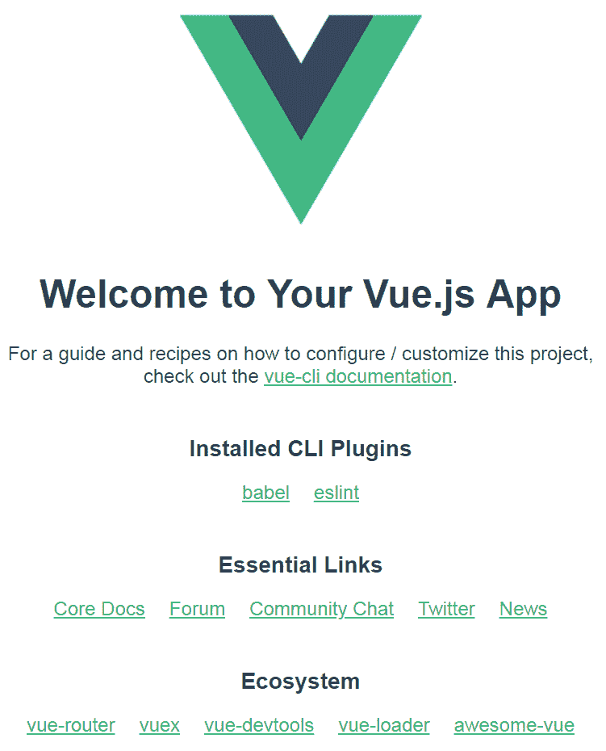
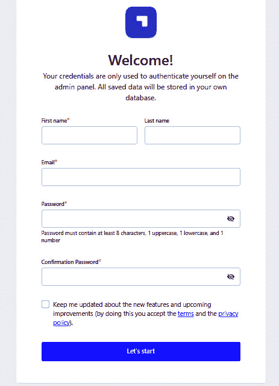

# 第一章：Vue.js 3 入门

在我们开始学习如何使用 Vue.js 3 开发企业级应用之前，你需要了解 Vue 3 以及它附带的不同特性，这些特性将帮助你导航构建可扩展的企业级应用。

在本章中，我们将介绍 Vue 3 的基本方面，这将直接影响我们如何使用 Vue.js 3 开发企业级应用。这些背景信息将使你更好地理解 Vue 3 的术语和概念，并帮助你了解如何构建和扩展企业级应用。

在本章中，我们将涵盖以下关键主题：

+   Vue.js 概述

+   介绍 Vue.js 3

+   构建你的第一个 Vue.js 3 应用

一旦你掌握了这些主题，你就可以开始构建你的第一个企业级 Vue.js 3 应用了。

# 技术要求

要开始，我们建议你具备基本的 JavaScript 知识，并在你的电脑上安装 Node.js，并且必须使用 Vue.js 构建过项目。

# Vue.js 概述

Vue.js 是一个开源的渐进式 JavaScript 前端 Web 框架，用于开发交互式前端 Web 界面。它是一个非常流行且简化的 JavaScript 框架，专注于 Web 开发的视图层。它可以轻松集成到大型和企业级 Web 开发项目中。

Vue.js 是一个框架，它为开发者打开了轻松创建和管理大型和可扩展项目的门户，因为代码结构和开发环境对开发者友好。

在下一节中，我们将向你介绍 Vue 3 和组合 API 的奇妙之处。

# 介绍 Vue.js 3

官方的 Vue.js 3 版本于 2020 年 9 月发布，提供了高度文档化、易于阅读、结构良好的资源，帮助你开始使用 Vue 3。Evan You 在他的文章《过程：制作 Vue 3》([`increment.com/frontend/making-vue-3/`](https://increment.com/frontend/making-vue-3/)) 中提到，重写的一个关键原因是利用新的语言特性，*代理*。

代理允许框架拦截对对象的操作。Vue 的一个核心特性是能够监听用户定义状态的变化，并反应性地更新 DOM。在 Vue 3 中，使用代理特性是解决 Vue 2 中反应性相关问题的关键。

最重要的是，Vue 3 完全使用 TypeScript 重新编写，并拥有使用 TypeScript 所带来的现代框架的所有优势。

在本节中，我们将探讨一些与构建企业应用相关的特性和改进，最重要的是，新的组合 API。

我们将涵盖以下主题：

+   Vue 3 性能

+   树摇支持

+   组合 API

这些主题让你对 Vue.js 3 的特性有了初步的了解，我们将在本书中从我们已熟悉的 Vue 开始。

## Vue 3 性能

Vue 3 的性能提升对企业级应用来说非常出色，因为核心框架中的任何延迟都可能导致资金损失，考虑到企业级项目的巨大规模。

与前版本相比，Vue 3 将性能提高了 55%，更新速度也快了 133%，这对于在部署前开发和测试大型企业级项目来说是非常出色的。此外，内存使用量减少了 54%，大幅降低了企业级项目的计算成本。

## 摇树优化支持

摇树优化是消除死代码、无用代码或未使用代码的过程，如果与拥有数千个文件且有时不知情地存在未使用文件的企业级应用相比，这会大幅减少应用的构建大小。

Vue 3 原生支持摇树优化，可以消除未使用的文件和代码，从而减小构建大小并提高项目的性能。

## 组合式 API

组合式 API 是一个全新的添加，也是 Vue 3 最重大的变化。它需要重新学习概念，并完全摒弃 Vue 2 中使用的 Options API。虽然组合式 API 在进步，但之前的 Options API 将继续得到支持。在这本书中，我们使用组合式 API，因为它带来了可读性和性能的提升。

### 为什么需要组合式 API？

当构建一个简单的应用时，仅凭组件式架构已被证明是开发此类应用的最佳方法，其中各个组件可以被重用以提高可维护性和灵活性。

然而，当构建具有数百个组件的企业级应用时，根据集体经验，仅凭组件式架构可能不足以满足需求，尤其是在应用规模扩大，即使在组件内部共享和重用代码也变得非常重要的情况下，因此引入了组合式 API。

### 代码示例

让我们假设我们正在构建一个具有独特功能（如过滤和搜索能力）的企业级待办事项应用。我们将使用 Options API，并采用传统的`data`、`computed`和`watch`方法来处理这个项目。

下面的代码块展示了如何使用 Vue 2 的 Options API 创建和管理 Vue 组件：

```js
// src/components/TodoRepositories.vue
export default {
  components: { RepositoriesFilters, RepositoriesSortBy,
                RepositoriesList },
  props: {
    todo: {
      type: String,
      required: true,
    },
  },
  data() {
    return {
      repositories: [], // 1
      filters: {}, // 3
      searchQuery: '', // 2
    }
  },
  computed: {
    filteredRepositories() {}, // 3
    repositoriesMatchingSearchQuery() {}, // 2
  },
  watch: {
    todo: 'getTodoRepositories', // 1
  },
  mounted() {
    this.getTodoRepositories() // 1
  },
  methods: {
    getTodoRepositories() {
      // using `this.Todo` to fetch Todo repositories
    }, // 1
    updateFilters() {}, // 3
  },
}
```

以下组件处理了许多职责，如下所述：

+   从外部 API 获取`Todo`仓库并在用户更改时刷新它

+   使用`searchQuery`字符串搜索`Todo`仓库

+   使用`filters`对象过滤`Todo`仓库

将组件的逻辑组织方式如前例所示运作得非常完美，但同时也对更大规模和企业的项目，尤其是组件逻辑更复杂的项目的可读性和可维护性提出了巨大的挑战。

如果我们能够将相关逻辑关注点的代码集中在一起，那岂不是完美？这正是组合式 API 能够让我们做到的。

让我们使用组合式 API 重新编写相同的组件，以查看使用它所获得的改进和可读性优势：

```js
<script setup>
import { fetchTodoRepositories } from '@/api/repositories'
import { ref, watch, computed } from 'vue'
const props = defineProps({
    todo: {
        type: String
        default:""
    }
})
  const repositories = ref([])
  const getTodoRepositories = async () => {
    repositories.value =
        await fetchTodoRepositories(props.todo)
  }
  getTodoRepositories()
  // set a watcher on the Reactive Reference to user todo
  // prop
  watchEffect(getTodoRepositories)
  const searchQuery = ref('')
  const repositoriesMatchingSearchQuery = computed(() => {
    return repositories.value.filter(
      repository =>
          repository.name.includes(searchQuery.value)
    )
  })
</script>
```

组合式 API 是一个很好的补充，特别是对于开发企业级应用。我们可以将 `computed`、`mounted` 和 `watch` 生命周期钩子移动到一个独立的组合函数中，并通过 `setup` 在脚本中导入它，使其易于阅读、灵活且易于维护。要了解更多关于组合式 API 的信息，请访问官方文档（[`v3.vuejs.org/guide/composition-api-introduction.html#why-composition-api`](https://v3.vuejs.org/guide/composition-api-introduction.html#why-composition-api)），它超出了本书的范围。

到目前为止，我们已经概述了 Vue 3 以及 Vue 新引入的功能，这些功能对于构建企业级和可扩展的生产级应用非常有用。我们还介绍了组合式 API 的基础知识，以帮助您理解如何使用 Vue 3 构建现代企业级应用。

在下一节中，我们将通过学习如何使用 Vite 作为构建工具来构建您的第一个 Vue 3 应用程序来测试您的知识。

根据官方文档（[`vitejs.dev/guide/`](https://vitejs.dev/guide/)），Vite 是一个旨在为现代网络项目提供更快、更精简的开发体验的构建工具。它基于 Rollup，并配置为支持大多数合理的默认设置，适用于现代 JavaScript 框架。

# 构建 Vue.js 3 的第一个应用

根据需求，Vue.js 可以以多种方式集成到项目中，因为它具有增量适应性。

我们将创建一个完全空白的新 Vue 3 项目，或者您可以使用迁移指南（[`v3.vuejs.org/guide/migration/migration-build.html#overview`](https://v3.vuejs.org/guide/migration/migration-build.html#overview)）将您的 Vue 2 项目迁移到 Vue 3 以便跟随。

在本节中，我们将介绍如何使用 Vite 的 **命令行界面**（**CLI**）构建我们的 Vue 3 应用程序。

## 使用 Vite 创建 Vue 3 应用

要创建我们的第一个 Vue 3 应用程序，我们将使用推荐的 **Vite** 网络开发工具。Vite 是一个网络开发构建工具，由于其本地的 ES 模块导入方法，它允许快速提供代码服务。

在这本书中，我们将构建一个企业级 Pinterest 克隆项目，并且该项目的所有后端数据管理都将由 **Strapi** 开发和托管。

按照这些简单的命令输入：

```js
npm init @vitejs/app pinterest-app-clone
cd pinterest-app-clone
npm install
npm run dev
// If you're having issues with spaces in username, try using:
npx create-vite-app pinterest-app-clone
```

上述命令将创建一个包含 Vue 3 并正确设置的 `pinterest-app-clone` 文件夹。完成后，打开您喜欢的浏览器并访问 `localhost:3000` 的网页。这就是网页的外观：



图 1.1 – 新安装的 Vue 3 的截图

在本节中，我们探讨了 Vue 3、Composition API 以及如何开始使用 Vue 3 构建你的第一个应用。在下一节中，我们将了解我们将用于数据和管理内容的 Strapi CMS。

## 什么是 Strapi CMS？

Strapi 是一个基于 Node.js 的开源无头 CMS，用于通过 RESTful API 和 GraphQL 开发和管理内容或数据。

使用 Strapi，我们可以更快地搭建我们的 API，并通过任何 HTTP 客户端或 GraphQL 兼容的前端来消费内容。

### 搭建 Strapi 项目

搭建新的 Strapi 项目非常简单，其工作方式与安装新的前端框架完全相同。按照以下步骤搭建新的 Strapi 项目：

1.  运行以下任一命令并在你的默认浏览器中测试它们：

    ```js
    npx create-strapi-app strapi-api --quickstart
    # OR
    yarn create strapi-app strapi-api --quickstart
    ```

上述命令将在你指定的目录中搭建一个新的 Strapi 项目。

1.  接下来，运行 `yarn build` 来构建你的应用，最后，如果项目没有自动启动，运行 `yarn develop`。

`yarn develop` 命令将打开一个新标签页，显示一个页面以注册系统的新管理员：



图 1.2 – 注册页面

1.  请继续填写表格并点击**提交**按钮以创建新的管理员。

随着我们在本书中的进展，我们将定制我们的 Strapi 后端实例以反映 Pinterest 数据建模。

# 摘要

本章从 Vue.js 的概述开始，讨论了为什么 Vue.js 可以用来开发企业级应用。我们讨论了 Vue.js 的最新版本以及它是如何通过引入开箱即用的 tree-shaking 功能来提高框架的性能方面的。然后，我们介绍了 Composition API，这是 Vue 3 的一个特性，它提高了 Vue 3 在构建和部署企业应用时的可读性、可维护性和可扩展性。我们还探讨了如何使用 Vite 创建我们的第一个 Vue 3 应用，以及使用 Vite 而不是其他可用选项的基本原因。

最后，我们介绍了 Strapi CMS，它是用于构建和建模后端应用和 API 的后端堆栈和无头 CMS。使用 Strapi，我们将专注于使用 Vue 3 构建 和扩展我们的企业级 Pinterest-clone 应用，而 Strapi CMS 将处理后端。

在下一章中，我们将更深入地探讨如何使用 Vuex、Vue Router 和 Axios 来构建一个企业级应用。你将学习如何正确地利用这些库来开发具有可维护性和可扩展性的大型应用，到本章结束时，你将学会如何使用 Strapi 设置你的后端并将其连接到 Vue 3。
