# 4

# 大型 Web 应用的架构

在上一章中，我们探讨了在 Vue 3 中构建和扩展大型应用。我们讨论了为什么我们需要 Vue.js 性能优化，导致 Vue 性能不佳的主要原因，如何检查你的 Vue.js 应用包的大小，以及使用异步/懒加载组件、WebP 图像、图像压缩和代码拆分等方法优化企业级 Vue 应用性能。

在本章中，我们将学习如何处理一个大型企业级项目，从管理更大的文件结构到使用微前端架构。我们还将学习如何处理我们 Vue.js 3 项目的国际化与本地化。

本章我们将涵盖以下关键主题：

+   文件架构和结构

+   微前端架构

+   国际化和本地化

到本章结束时，你将知道如何使用 Vue 3 构建大型 Web 应用，如何使用可预测性原则实现结构和文件架构，以及如何使用社区推荐的包来告知你的 Vue.js 3 企业级应用中的可预测性。

你还将学习如何利用微前端架构的优势，以及如何使用 Storybook 实现原子设计，以简化你的组件目录，使企业级项目更容易理解。

最后，你将学习如何将国际化正确地集成到你的 Vue 应用中，以及这将带来的好处。

# 技术要求

要开始本章的学习，我建议你阅读*第三章*，*Vue.js 3 中的性能扩展*，其中我们阐述了在 Vue 3 中构建和扩展大型应用。

本章的所有代码文件都可以在[`github.com/PacktPublishing/Architecting-Vue.js-3-Enterprise-Ready-Web-Applications/tree/chapter-4`](https://github.com/PacktPublishing/Architecting-Vue.js-3-Enterprise-Ready-Web-Applications/tree/chapter-4)找到。

# 理解文件架构和结构

项目结构完全取决于你组织的偏好以及修复错误和添加新功能时访问文件和文件夹的难易程度。

在本节中，我们将探讨不同的原则，这些原则将给你一个想法，了解你如何构建项目以融入最佳实践、标准和易于访问的文件。

什么是最有效的项目结构方式，以实现扩展并保持其可维护性和可扩展性？

这是在软件开发行业中常见的疑问，但没有一种适合所有情况的解决方案。这完全取决于可预测性的原则，正如本文所讨论的：[`vueschool.io/articles/vuejs-tutorials/how-to-structure-a-large-scale-vue-js-application/`](https://vueschool.io/articles/vuejs-tutorials/how-to-structure-a-large-scale-vue-js-application/)。

可预测性的原则简单来说就是能够在任何代码库中从 A 点到 B 点的直觉性移动，从功能请求或错误报告到代码库中可以解决该任务的地点。此外，它还指的是根据社区或流行库和工具的标准使用，快速或轻松地理解特定的代码库的能力。

为了详细说明，当一个代码库使用标准、社区同意和流行的库或工具时，它为开发者提供了极佳的开发体验，因为开发者已经熟悉这些工具。

在下一节中，我们将更深入地讨论可预测性以及如何在 Vue 3 中实现它。

## Vue 3 中的可预测性

如何在 Vue 3 中实现可预测性非常简单，如前所述；它归结为使用 Vue 3 标准和风格指南。

例如，只需想象购买一个不同尺寸的新 iPhone 13 ProMax；这将很尴尬，因为您肯定已经根据您的评论预测了尺寸将保持不变。

这种方法适用于开发者对新代码库的心态；我们期望大多数库、组件名称、文件和文件夹结构都遵循 Vue 3 社区标准和风格指南，并略作调整以适应组织的用例（如果有）。

那么，我们如何在 Vue 3 中实现可预测性呢？在接下来的小节中，我们将探讨几种在您的企业 Vue 3 应用程序中实现标准的方法。

### 可预测性的社区标准

如果您来自 Vue 2，您应该已经熟悉其中存在的标准。我们将从那里讨论添加更多 Vue 3 特定标准。

Vue 有以下页面，您可以查看社区标准：

+   首先，请查看官方 Vue.js 风格指南（[`v3.vuejs.org/style-guide/#rule-categories`](https://v3.vuejs.org/style-guide/#rule-categories)）

+   在 Vue 3 中，始终使用由 Vue **命令行界面**（**CLI**）或 Vite 生成的脚手架（[`vuejs.org/guide/quick-start.html`](https://vuejs.org/guide/quick-start.html)）

+   官方 Vue.js 库可以在 *社区* *指南* 下找到（[`vuejs.org/about/community-guide.html`](https://vuejs.org/about/community-guide.html)）

+   使用最流行的组件框架之一，如 Vuetify ([`vuetifyjs.com/en/`](https://vuetifyjs.com/en/)) 或 Quasar ([`quasar.dev/`](https://quasar.dev/))

### 官方库和组件库

使用官方库和组件库不仅为您的项目带来功能，还强制执行标准，并允许您根据 Vue 社区的标准和通常可接受的模式构建应用程序。

例如，Vuex 是一个以实现模式和库相结合而自豪的状态管理系统，因为它在构建 Vue 应用程序时强制执行遵循的标准。

另一个很好的例子是 Vue Router，它允许开发者以适应其他项目的方式构建路由系统。

所有这些的好处是，当一个使用这些库构建的开发者加入到一个新的代码库中时，使用这些工具，它变得可预测。

### 标准文件结构

项目标准的一个重要方面是文件结构。文件结构是项目标准的一个有争议的方面，因为不同的组织和项目使用不同的结构，Vue 也没有提供详细的文档来指定一个结构。

然而，当你使用官方的 Vue CLI 时，它提供了一个创建标准文件夹和文件结构的起点，这在 Vue.js 界内被广泛使用，并且对于全球的 Vue 开发者来说最为熟悉。

下面的代码块展示了如何使用官方的 Vue 3 独立 CLI（称为 Vite）创建一个新的 Vue 3 项目：

```js
npm create vite@latest
npm create vite@latest my-vue-app --template vue
```

下面的截图显示了使用 Vue 3 官方 CLI（称为 Vite）的官方项目脚手架：

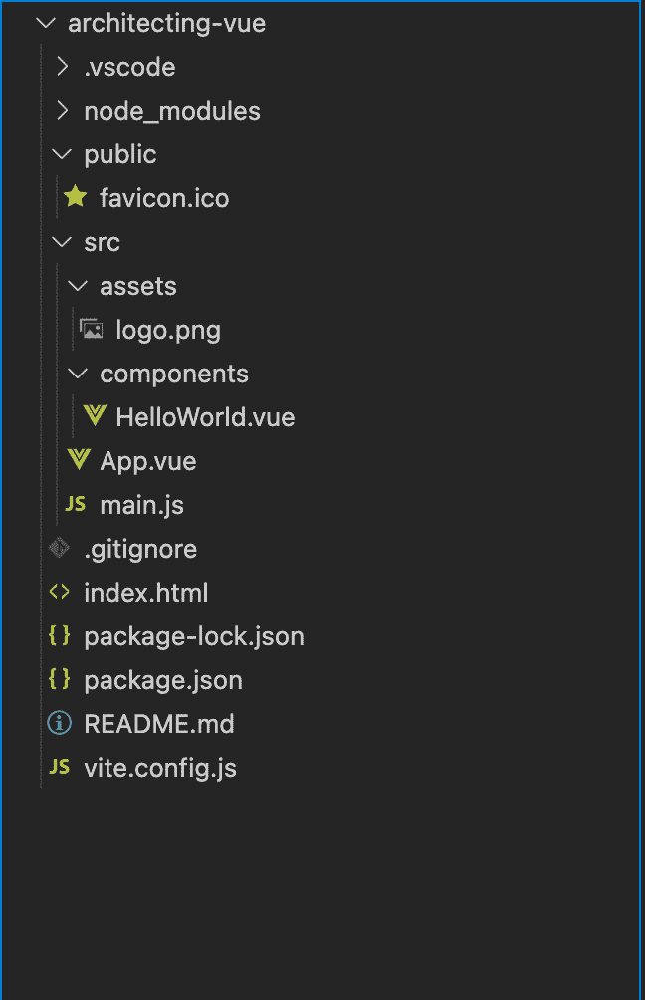

图 4.1 – 官方 Vue CLI 文件结构

在前面的截图中所使用的初始结构应该对许多开发者来说已经很熟悉了，因此使其变得可预测。始终遵循 Vue 的初始结构，在此基础上构建，并且只有出于良好的理由才进行更改。

### 推荐的组件规则

Vue 组件目录是混乱开始的地方，因为可以创建成千上万的文件和 Vue 组件，随着时间的推移，管理起来变得非常困难。

将你的代码库调整为遵循官方 Vue 3 风格指南是创建可预测代码库的起点，并且你可以从那里学习很多关于如何使你的文件夹和文件结构对开发者来说更加可预测的知识。风格指南为 Vue 生态系统提供了许多社区标准和最佳实践。

这里列出了其中一些最重要的要点：

+   首先，我们有 **单文件组件**（**SFC**）风格指南，它陈述了许多需要遵循的点，其中重要的一点是，你的组件应该以 PascalCase 命名。

+   其次，SFC（[`vuejs.org/guide/scaling-up/sfc.html`](https://vuejs.org/guide/scaling-up/sfc.html)）应始终一致地排序 `<script>`、`<template>` 和 `<style>` 标签，其中 `<style>` 在最后。这是因为 `script` 和 `template` 标签总是必要的，而 `style` 标签是可选的。

+   它还指出，在可能的情况下，每个组件都应该定义在其自己的专用文件（SFC）中。这就是 Storybook 或 Atomic Design 在这里发挥作用的地方，我们将在接下来的章节中看到。

+   此外，组件名称应始终为多词，以避免与任何现有或未来的 HTML 元素冲突。不要创建名为 `Table` 或 `Button` 的组件，因为这些名称的 HTML 标签已经存在；您可以创建多词，例如以下 `DataTable` 或 `CustomButton`。

+   最重要的是，紧密耦合的子组件应该以父组件的名称为前缀，例如在 `TodoList` 组件中的 `TodoListItem`。此方法也有助于调试，因为开发者可以轻松地识别出错误信息中的名称错误的组件。

Vue.js 在 [`vuejs.org/style-guide/`](https://vuejs.org/style-guide/) 提供了一份完整的风格指南，其中包含许多其他标准，这些标准将帮助您的项目对社区范围内的开发者更加可预测。

### 推荐的社区通用标准以提高可预测性

几年来，Vue 社区已经就 Vue 开发者应使用的、旨在提高代码库可预测性的众多不同标准进行了发展和争论。

在以下小节中，我们将讨论一些这些标准以及如何在企业项目中实施它们。

#### 平面组件目录

平面组件目录意味着为您的 Vue 组件和团队指定特定的命名约定，并在整个应用程序开发过程中坚持该约定。

您可以使用单一或嵌套的目录结构，但命名约定应保持一致。接下来的两个截图展示了实现平面组件目录的不同方式。下面的截图展示了单一平面组件目录：

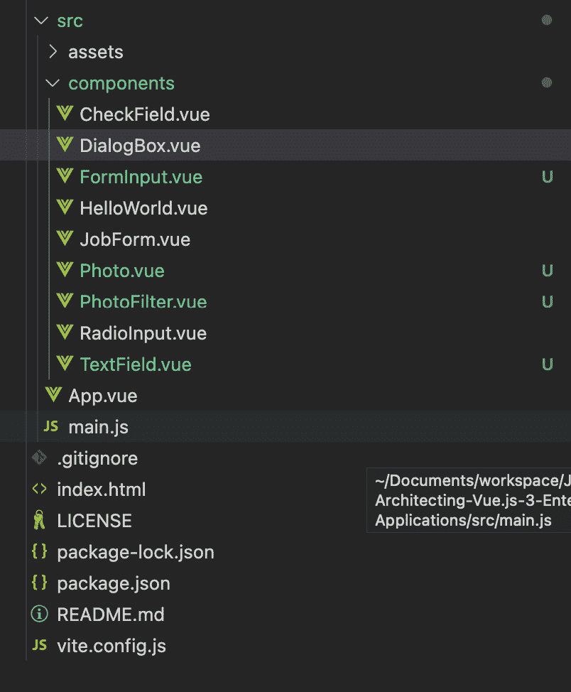

图 4.2 – 单一平面组件目录

下面的截图展示了嵌套平面组件目录：

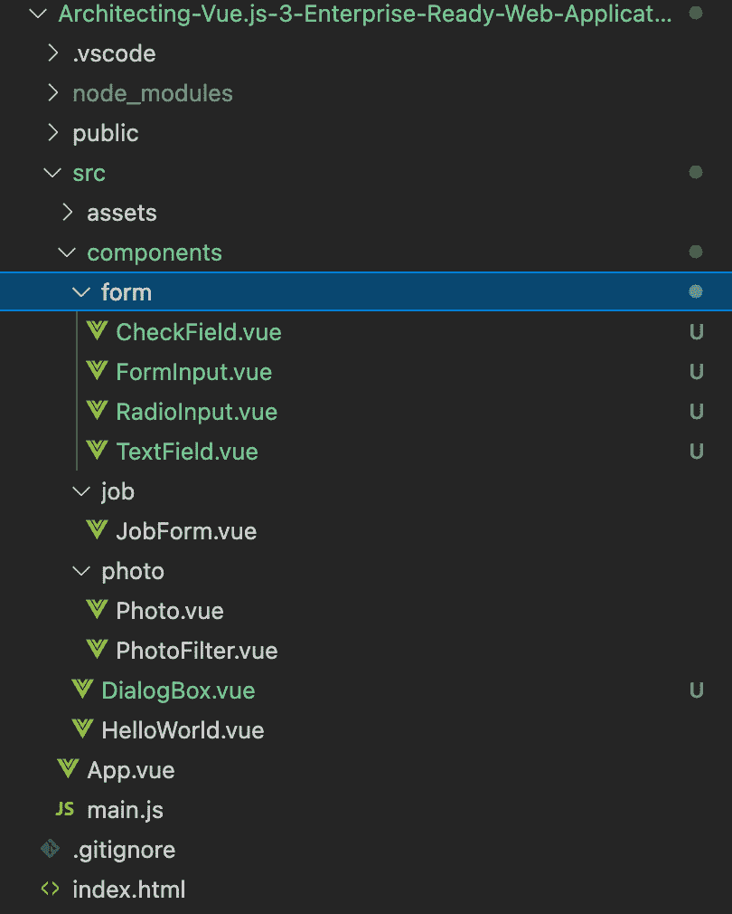

图 4.3 – 嵌套平面组件目录

#### 标准化的路由/页面命名约定

可预测性原则的另一项重要改进是在整个团队和项目中拥有适当且定义明确的路由/页面命名约定。

例如，使用 Laravel 或 AdonisJS 中使用的路由/页面命名约定，对于熟悉这些框架的开发者来说，可以轻松预测代码库。如果您定义了自己的约定并坚持使用，这也适用。它允许新成员轻松预测和理解您的代码库。

下面的截图展示了如何根据 Laravel 和 AdonisJS 的路由标准来结构化您的路由，以实现可预测性：

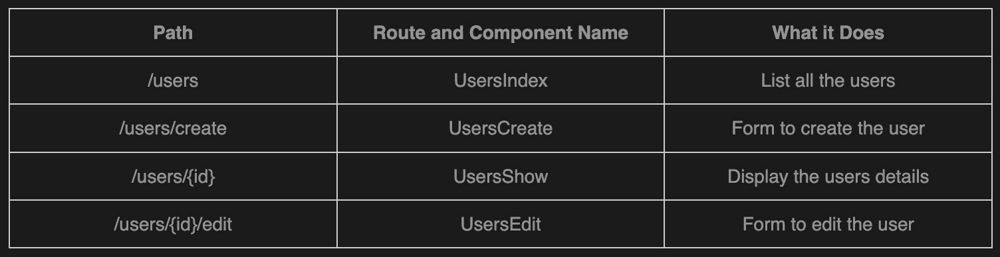

图 4.4 – 展示可采用的模式

当您在路由链接中使用路由时，应始终正确引用其名称，并在程序中使用以获得更多一致性和灵活性。

例如，参见以下内容：

```js
<router-link :to="{name: PhotosIndex}">Photos</router-link>
```

此外，请注意，并非所有路由都完全符合此模式，因为一些路由可能比其他路由更简单。如果发生这种情况，一个好的建议是继续使用 PascalCase 为你的路由名称保持一致性。

#### 更全面的文件结构

使用 Vue CLI 的基本文件结构是预测性的良好起点，并可以从那里扩展以包括其他文件和目录，从而以标准化的方式使我们的企业项目更具可预测性。

以下截图展示了如何扩展文件结构以包括其他必要的文件和目录：

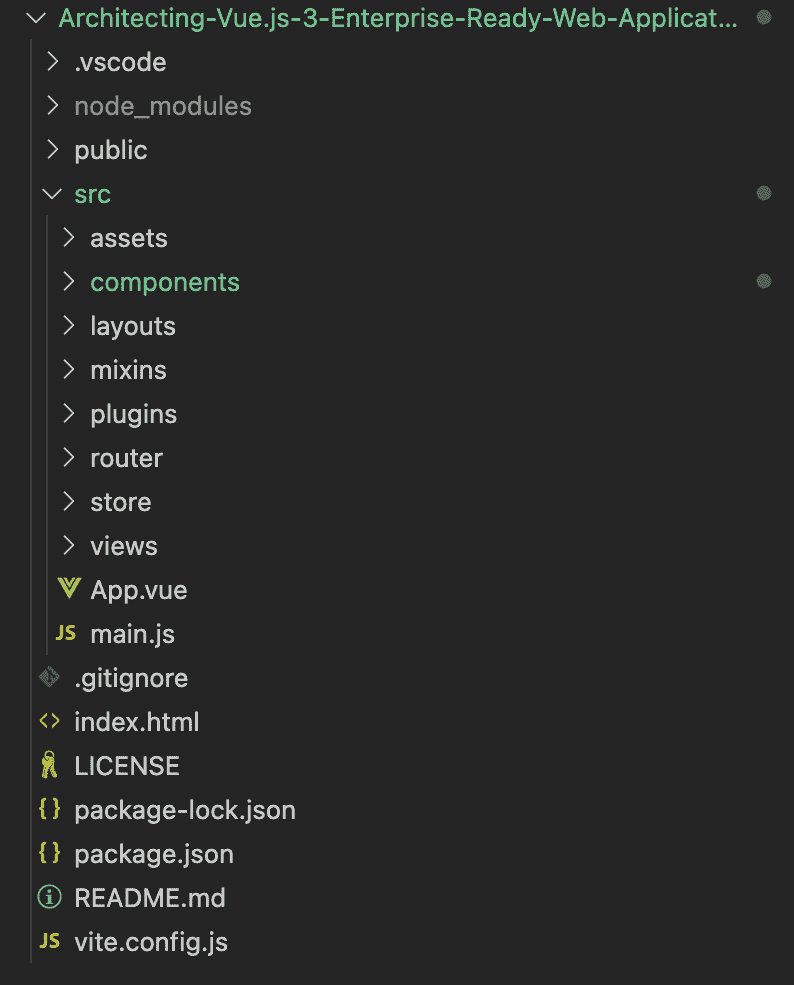

图 4.5 – 从默认 Vue CLI 结构扩展文件结构

额外的文件和文件夹将完全取决于你的团队、组织或项目，但图 4.5 中的额外文件夹是我们为正在构建的项目定义的结构，从默认 Vue CLI 结构扩展它使其更具可预测性。

此外，在标准目录的根目录中提供一个 `README.md` 文件（[`changelog.md/`](https://changelog.md/)），解释目录的目的以及应包含在其中的任何规则或如何使用目录文件，这非常有用。这对于那些不是社区标准的标准尤其有用。

尽管我们倾向于使代码库对开发者足够可预测，无论项目如何使用社区标准和 Vue 风格指南，仍有一些情况需要定义特定于我们项目或团队的通用文件和文件夹。

虽然创建一个可预测的代码库对于使用上一节中讨论的步骤和模式的大型项目和团队来说是个不错的选择，但仍有很多东西可以探索。在下一节中，我们将探讨可以用来构建更大规模企业项目的不同模式、架构和结构。

# 不同的前端架构模式

在本节中，我们将探讨我们可以用来构建我们的企业 Vue 3 应用程序的不同架构模式。

## 微前端架构

当谈到构建企业前端项目时，微前端架构是首先想到的架构。正如官方文档中所述，它将后端微服务概念扩展到前端世界。

微前端的概念源于在后台网络应用程序中用于将巨大块拆分为更小、更易于管理的代码库的流行词“微服务”（[`martinfowler.com/articles/microservices.html`](https://martinfowler.com/articles/microservices.html)）。

这种软件开发方法使团队更容易管理、维护和快速部署更大规模的企业应用程序。

这个概念已经改变了多年来后端应用的开发方式，现在以微前端的形式引入到前端项目中。

根据马丁·福勒([`martinfowler.com/articles/micro-frontends.html`](https://martinfowler.com/articles/micro-frontends.html))的说法，“*微前端是一种架构风格，其中独立交付的前端应用被组合成一个更大的整体*。”

近年来，随着最初的应用，这一概念在大型项目中得到了巨大的采用，从而将微服务的好处引入到前端项目中。

实施微前端架构带来的以下是一些关键好处：

+   它带来了更可扩展的组织，具有解耦和自治的团队

+   它带来了更小、更紧密、更易于维护的代码库

+   它提供了以更渐进的方式升级、更新或甚至重写前端部分的能力

尽管在官方文档中概述了使用这种架构在您的企业项目中带来的巨大好处，但这种模式需要陡峭的学习曲线、更多的团队外派人员以及大量的团队成员。

以下图展示了团队使用微前端为 Pinterest 示例应用构建端到端示例：

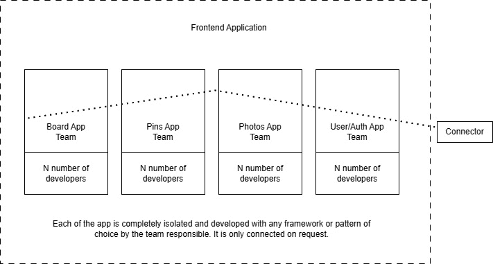

图 4.6 – 团队使用微前端的端到端示例

这里展示了一个使用微前端架构构建 Pinterest 示例应用的架构图：

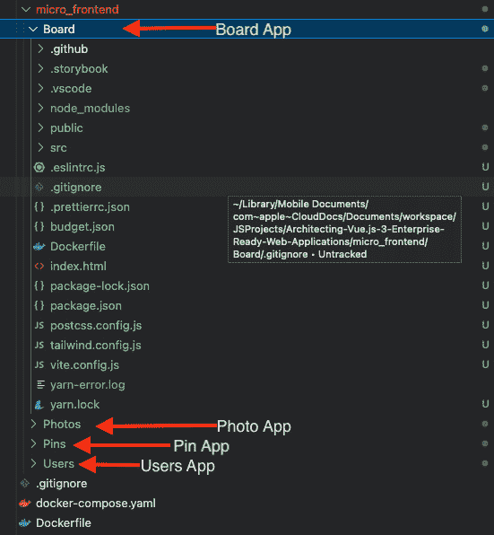

图 4.7 – 微前端在实际应用中的截图

从截图中，我们可以轻松地将每个功能分离成不同的服务，并为每个服务配备一个专门的前端工程师团队来处理。

微前端是企业应用中最佳架构模式之一，因为微前端的核心思想包括隔离的团队代码、技术无关性、所有权等。这些特性使得开发企业应用变得轻松。然而，其他模式也被广泛使用，我们将在下一节中探讨它们。

## 原子设计

原子设计([`bradfrost.com/blog/post/atomic-web-design/`](https://bradfrost.com/blog/post/atomic-web-design/))是一种构建设计系统的方法论。布拉德·弗罗斯特首先将其用于使用化学思想创建可扩展的设计系统。

从化学课中，我们知道物质由原子组成，这些原子结合形成分子，进而结合形成更复杂的生物体，最终创造出宇宙中的所有物质。

同样，我们可以将我们的组件分解成基本构建块，并从这里开始工作。这些构建块可以从化学示例中分为五个组件，如下所示：

+   原子

+   分子

+   生物体

+   模板

+   页面

这张由 Rohan Kamath 提供的图表（[`blog.kamathrohan.com/atomic-design-methodology-for-building-design-systems-f912cf714f53`](https://blog.kamathrohan.com/atomic-design-methodology-for-building-design-systems-f912cf714f53)）清楚地展示了原子设计元素：

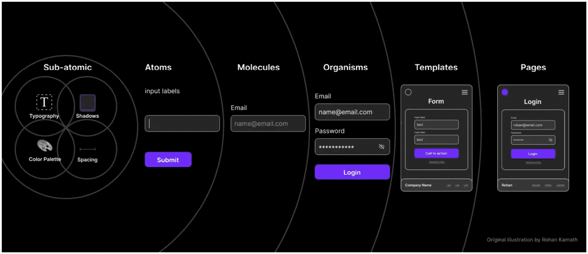

图 4.8 – 原子设计元素解释（来源：https://blog.kamathrohan.com/atomic-design-methodology-for-building-design-systems-f912cf714f53）

让我们探索这些组件中的每一个，以便理解它们。

### 原子

在科学课上，我们学习了原子是物质的基本构建块。但将它们应用于网络界面时，原子是像`input`、`label`这样的 HTML 标签。它们也可以定制，包括抽象元素，如调色板、字体或动画。

原子本身并不很有用，除非与其他元素结合形成分子。

### 分子

当我们开始组合原子时，事情开始变得有点有趣和具体。

化合物的最小单位称为分子，它由结合在一起的原子组成。在网络界面中，这些分子具有自己的属性，并成为任何设计系统的骨架。

例如，表单输入、标签或按钮作为独立的功能性并不十分有用，但结合成表单后，它们就变得非常有用，因为它们实际上可以完成某些事情。此外，通过组合原子形成有用的组件，这些组件变得可重用，也可以组合成生物体。

### 生物体

生物体是由用于形成组件相对复杂和独特部分的分子组合而成。

生物体被设计成由不同或相似类型的分子组成。例如，一个分子可以包含主要导航、社交媒体渠道列表、搜索表单和标志。

从分子构建生物体的奇妙之处在于，它鼓励创建独立、便携或可重复使用的组件。

### 模板

模板对网络开发世界来说已经非常熟悉；它们是由预定义的、拼接在一起的生物体组成的页面。在模板中，设计开始整合，页面的布局变得结构化和可见。

每个模板都包含所有相关的抽象分子、生物体和原子，在某些情况下。由于模板是可见的页面或页面的一部分，客户可以开始看到最终设计。

使用模板，你可以创建不同版本的设计，无论是高保真度、低保真度等。模板更像是 HTML 线框，也可以成为最终交付成果。

### 页面

页面是模板的具体实例；在某些情况下，一个复杂的页面可以包含多个模板组合成更大的页面。

页面提供了用户最终将看到的准确描述，它们是最高级别的保真度和最直观的。通常，大多数时间都花在这里，并且更多的审查都围绕它进行。

在 Vue.js 中，页面代表用户在导航应用程序时访问的不同路由。

使用原子设计原则使我们能够从抽象的页面或模板过渡到具体的页面。正因为如此，我们能够创建既促进一致性又具有可扩展性的系统，同时展示事物在其最终上下文中的样子。

在这本书中，我们将学习如何使用原子设计模式来构建我们的企业项目，并使用 Storybook 来设计系统。

小贴士

设计系统是一套相互关联的模式和标准，通过减少冗余，在各个页面和渠道之间创建共享语言和视觉一致性，以实现大规模的设计管理。

## Storybook

Storybook 可以与任何架构模式结合使用，例如原子设计，以更快地构建以组件驱动的**用户界面**（**UIs**）。根据官方网站 ([`storybook.js.org/`](https://storybook.js.org/))，Storybook 是一个用于独立构建 UI 组件和页面的开源工具。它简化了 UI 开发、测试和文档。

Storybook 允许我们，作为开发者，在隔离的环境中创建和测试组件。

在下一节中，我们将学习如何将 Storybook 实现到我们的项目中，并开始使用原子设计原则来创建可维护的 Vue.js 3 项目。

# 在 Vue.js 3 中实现 Storybook

访问官方文档以了解 Vue 实现 ([`storybook.js.org/docs/vue/get-started/introduction`](https://storybook.js.org/docs/vue/get-started/introduction)) 并跟随实现步骤。在 Storybook 中，一切围绕故事展开。一个故事描述了渲染组件的状态，并捕捉了组件在渲染时应该/可以执行的所有操作。

### 安装 Storybook

您可以使用 Storybook CLI 在单个命令中将其安装到现有 Vue.js 项目的根目录中。

在安装过程中，Storybook 会检查您的项目依赖项，并提供最佳的配置。

接下来，根据您的框架，首先构建您的应用程序，然后通过运行以下命令来检查一切是否正常工作：

```js
npx sb init
npm run storybook
```

以下命令将启动一个新的开发服务器，并打开一个显示欢迎界面的浏览器窗口：

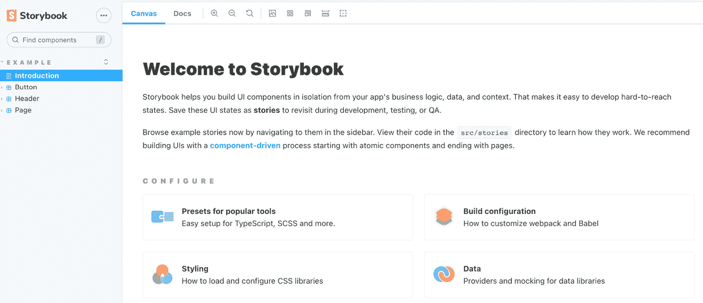

图 4.9 – 欢迎界面

创建一个故事就像告诉计算机一个特定组件将做什么，执行任务所需的属性，以及特定组件可以具有的不同设计。在下一节中，我们将探讨如何在 Storybook 中创建一个故事。

### 创建一个故事

在我们深入创建故事（组件）之前，让我们确保我们使用原子设计和 Storybook 为此项目同步文件夹结构。

以下屏幕截图显示了实现原子设计和 Storybook 的 `stories` 文件夹的完整文件夹结构：

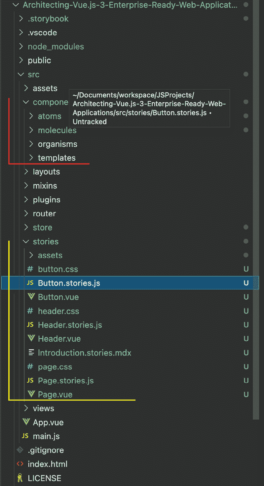

图 4.10 – 展示 Vue 3 组件和 Storybook 结构的屏幕截图

从屏幕截图示例中，我们已经重构了我们的 Vue.js 项目以使用原子设计原则和文件夹结构（红色指示器），并且 Storybook 添加了 `stories` 文件夹（黄色指示器）以帮助我们了解如何编写自己的故事。我们可以删除 `stories` 文件夹，并按照 *图 4.10* 中的模式在 `component` 文件夹内创建我们的故事。

现在，我们可以开始创建故事；请记住，一个故事必须描绘特定的动作或一系列相关的动作。

这里是我们为将在整个项目中使用的 `Button` 组件创建的故事：

```js
import MyButton from "./Button.vue";
// More on default export:  https://storybook.js.org/docs/vue/writing-stories/introduction#default-export
export default {
  title: "/Button",
  component: MyButton,
  // More on argTypes:
  // https://storybook.js.org/docs/vue/api/argtypes
  argTypes: {
    backgroundColor: { control: "color" },
    onClick: {},
    size: {
      control: { type: "select" },
      options: ["small", "medium", "large"],
    },
  },
};
// More on component templates: https://storybook.js.org/docs/vue/writing-stories/introduction#using-args
const Template = (args) => ({
  // Components used in your story `template` are defined
   // in the `components` object
  components: { MyButton },
  // The story's `args` need to be mapped into the template
  // through the `setup()` method
  setup() {
    return { args };
  },
  // And then the `args` are bound to your component with
  // `v-bind="args"`
  template: '<my-button v-bind="args" />',
});
export const Primary = Template.bind({});
// More on args: https://storybook.js.org/docs/vue/writing-
// stories/args
Primary.args = {
  primary: true,
  label: "Button",
};
export const Secondary = Template.bind({});
Secondary.args = {
  label: "Button",
};
export const Large = Template.bind({});
Large.args = {
  size: "large",
  label: "Button",
};
export const Small = Template.bind({});
Small.args = {
  size: "small",
  label: "Button",
};
```

例如，按钮将在 `atoms` 目录中创建，因为它是一个单一元素，尽管它可以有不同的属性和动作，如蓝色按钮、白色按钮、可点击按钮、禁用按钮等。它仍然是一个按钮。

从故事中，我们可以看到 `Button` 组件将有两个尺寸（`small` 和 `large`），此外，它还将有两个设计，即 `primary` 和 `secondary`，并且它还将接受两个属性，即 `primary` 和 `label`。

您可以通过官方文档了解如何编写故事来测试按钮的属性和动作（[`storybook.js.org/docs/vue/get-started/whats-a-story`](https://storybook.js.org/docs/vue/get-started/whats-a-story)）。

一旦您创建了所有组件和故事，您应该有一个如下截图所示的目录：

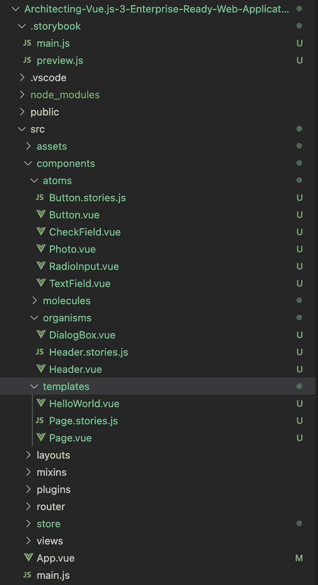

图 4.11 – 展示包括 Storybook 故事的完整目录的屏幕截图

此外，按照这样的项目结构，开发者可以轻松理解结构并快速找到组件。团队成员可以在实际项目中使用 Storybook 在使用组件之前轻松测试具有不同属性的组件。

在下一节中，我们将探讨如何在 Vue.js 3 中创建国际化应用程序，这使得您的应用程序不仅限于单一的语言和文化环境。

# 实施国际化和本地化

构建企业应用程序的本质是支持全球各地的本地市场，而要实现这一点，国际化就派上用场了。

准备软件以支持本地语言和其他地理区域的文化的过程被称为**国际化**（**I18n**）。

I18n 经常被误认为是**本地化**（**L10n**），有时甚至翻译。

虽然 Il8n 是一种产品开发方法，旨在使一个代码库能够支持全球语言和特定地区格式的格式和行为，但 L10n 使产品针对特定市场或地区（包括界面翻译和术语可能的调整等）。

在本节中，我们将首先探讨软件国际化的好处，并进一步探讨如何在 Vue 3 中实现 I18n。

## 软件国际化的好处

创建内部化软件的好处是巨大的，其中一些列在这里：

+   它创建出满足多个地区技术和文化需求的更高质量的软件

+   它提供了更高的国内客户接受度和满意度

+   它为产品的所有语言提供单一源代码

+   内部化软件减少了本地化所需的时间、成本和努力

+   内部化软件更简单，并支持产品未来迭代时更容易的维护

市场接受度是软件在发布前后没有完全内部化时出现的主要问题之一。

因此，我们将探讨如何在我们的企业 Vue 3 应用程序的开发阶段实现 I18n。

## 安装 Vue I18n

在 Vue 3 中，Vue-I18n 是一个优秀的兼容插件，用于实现 I18n，并且它能够轻松地将一些本地化功能集成到你的 Vue.js 应用中。

按照以下步骤国际化你的应用：

1.  根据官方文档（`https://vue-i18n.intlify.dev/installation.html`），有不同方式来安装该包，但我们将使用`npm`命令安装，如下所示：

    ```js
    npm install vue-i18n@9
    ```

1.  安装后，在 Vue 3 的`main.js`文件中，添加以下脚本：

    ```js
    import { createApp } from 'vue'
    import { createI18n } from 'vue-i18n'
    const i18n = createI18n({
      // something vue-i18n options here ...
    })
    const app = createApp(App)
    app.use(i18n)
    app.mount('#app')
    ```

在前面的设置中，你应该已经将内部化添加到你的 Vue 项目中，但当开发者开始添加翻译时，它将很容易变得臃肿。因此，我们建议创建一个`locales`文件夹，其中将添加所有与地区相关的配置。

1.  让我们按照如下方式在根目录下创建文件夹和文件：

    ```js
    mkdir src/locales
    touch src/locales/index.js src/locales/en.json src/locales/fr.json src/locales/de.json
    ```

1.  接下来，在每个翻译文件中，添加以下代码和其他翻译：

    ```js
    {
      "welcomeMsg": "Welcome to Your Vue.js App",
        ….
    }
    ```

1.  在`index.js`文件中，添加以下脚本以导入不同的地区：

    ```js
    import en from «./en.json»;
    import fr from "./fr.json";
    import de from «./de.json»;
    const messages = {
     en,
     fr,
     de,
    };
    export default messages;
    ```

1.  最后，将文件添加到你的`main.js`文件中的`createI18n`配置中：

    ```js
    import locales from "./locales/index.js";
    const i18n = createI18n({
     locale: "en", // set locale
     fallbackLocale: "en", // set fallback locale
     messages: locales, // set locale messages
    });
    ```

按照这种结构安排你的文件和文件夹，可以方便地采用和维护。让我们在以下屏幕截图中查看我们的项目最终结构，包括国际化：

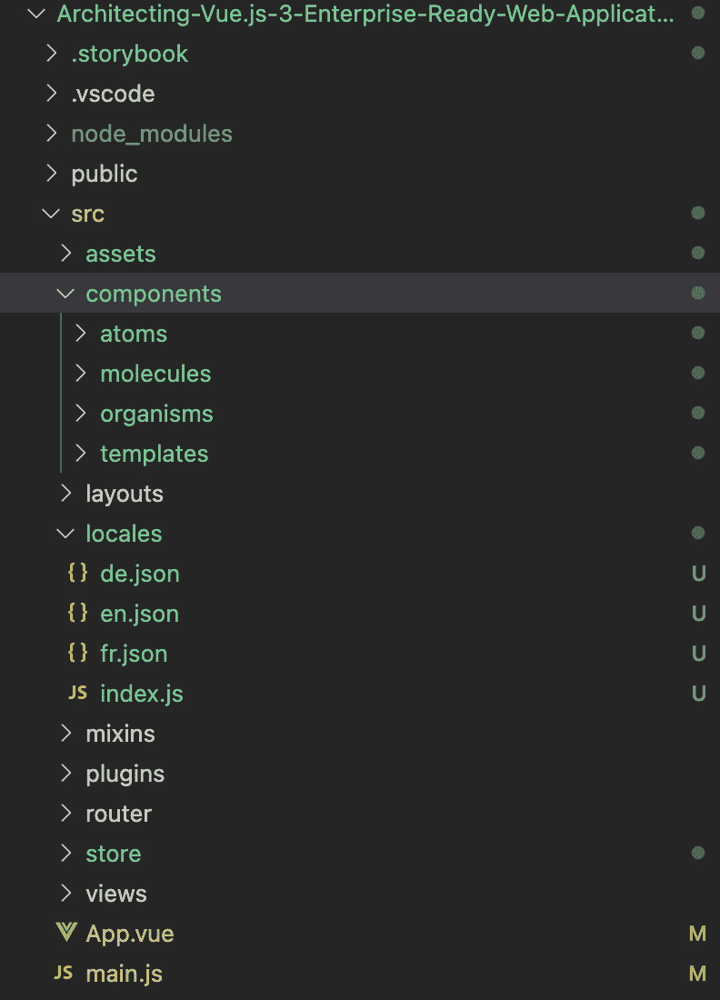

图 4.12 – Vue 3 应用程序的最终结构

# 摘要

本章更深入地回顾了使用 Vue 3 架构大型 Web 应用。我们通过深入研究可预测性法则以及如何使用社区推荐的包来提高你的 Vue.js 3 企业级应用的可预测性，讨论了结构和文件架构。

我们还详细介绍了如何利用微前端架构的优势。此外，我们还讨论了如何使用 Storybook 实现 Atomic Design，以简化你的组件目录，并使你的企业项目更容易理解。

接下来，我们讨论了如何将 I18n 添加到你的 Vue 应用中。我们还讨论了其优势和如何正确地将 I18n 集成到你的 Vue 3 应用程序中。

在下一章中，我们将探讨 GraphQL、GraphQL Apollo Server 2、查询、突变，以及如何将这些技术集成到你的 Vue.js 3 应用程序中。此外，你还将学习如何利用 GraphQL 来提供可扩展且性能高的应用程序。
