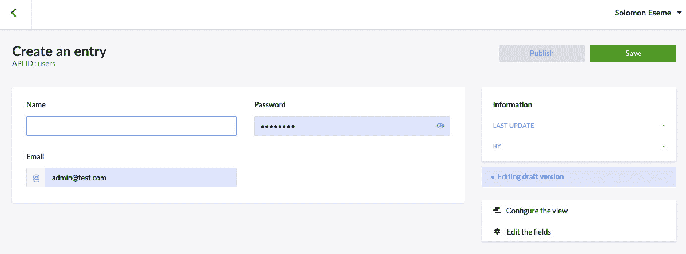

# 第六章：使用 GraphQL 构建完整的 Pinterest 克隆

在上一章中，我们探讨了 GraphQL、GraphQL Apollo Server 2、查询、变更以及如何将这些技术集成到你的 Vue.js 3 应用程序中。此外，我们还学习了如何利用 GraphQL 来提供可扩展和性能高的应用程序。本章将演示如何使用 Vue 3 和 GraphQL 构建一个完整的 Pinterest 克隆应用。你将利用你对 GraphQL 的知识来开发和交付一个如 Pinterest 这样的企业级应用程序，使用 Vue 3 和 GraphQL。此外，你将学习如何使用一个流行的无头**内容管理系统**（**CMS**）Strapi 来创建和管理你的后端 API。

本章我们将涵盖以下关键主题：

+   Strapi 简介

+   搭建 Strapi 项目

+   构建集合

+   构建 Vue 3 Pinterest 应用

+   连接前端和后端

+   测试应用

到本章结束时，你将学会如何使用 GraphQL 创建一个可扩展和性能高的 Pinterest 克隆应用程序。

# 技术要求

首先，我建议你阅读第*5 章*，《GraphQL、查询、变更和 RESTful API 简介》，在那里我们探讨了 GraphQL、GraphQL Apollo Server 2、查询、变更以及如何将这些技术集成到你的 Vue.js 3 应用程序中。

本章所需的所有代码文件都可以在[`github.com/PacktPublishing/Architecting-Vue.js-3-Enterprise-Ready-Web-Applications/tree/chapter-6`](https://github.com/PacktPublishing/Architecting-Vue.js-3-Enterprise-Ready-Web-Applications/tree/chapter-6)找到。

# Strapi 简介

Strapi 是一个基于 Node.js 的开源无头 CMS，用于通过 RESTful API 和 GraphQL 创建和管理不同形式的内容。

此外，Strapi 使开发、部署和维护 API 更快，并且可以配置为通过任何 HTTP 客户端或 GraphQL 启用的前端使用 API 来消费内容。

这些优势是我们选择使用 Strapi 来创建 Pinterest 克隆应用程序后端的原因，这样我们就可以更多地关注前端，而不必过多关注后端的扩展。

在下一节中，我们将通过搭建 Strapi 项目，构建我们项目中需要的所有集合，并使用模拟数据初始化 Strapi 账户。

# 搭建 Strapi 项目

开始一个新的 Strapi 后端项目非常简单，就像使用 CLI 工具安装一个新的框架一样。

我们可以通过运行以下任何简单命令来搭建一个完整的后端应用程序，并在我们的默认浏览器中测试它：

```js
  ```bash

npx create-Strapi-app strapi-pinterest-api --quickstart

# OR

yarn create straps-app strapi-pinterest-api --quickstart

```js
```

之前的命令在指定的文件夹中搭建了一个新的 Strapi API。接下来，运行以下命令来使用 Strapi 构建和部署你新创建的后端 API：

```js
```bash

npm run build

npm run deploy

```js
```

前两个命令应该会构建并部署您的应用，这样您就可以通过在默认浏览器中输入以下 URL（`localhost:`）来轻松测试它，如果它没有自动打开。

最重要的是，最后一个命令还会打开一个新标签页，显示一个页面，用于注册系统的新管理员用户。请继续填写表格并点击**开始**按钮来创建一个新的管理员用户。

页面看起来如下：


图 6.1 – Strapi 注册页面

在作为平台管理员注册后，您将拥有创建不同收藏夹以及为您的 API 设置不同用户和权限级别的管理员访问权限。

在下一节中，我们将探讨如何创建不同的收藏夹，这些收藏夹将对应于我们的 Pinterest API 资源。我们还将设置不同的权限级别，以限制我们 Pinterest 应用程序中的每个用户可以访问的内容。

# 构建收藏夹

Strapi 使用收藏夹来表示资源；例如，如果您的应用程序是一个新闻应用程序，并且您想要创建一个后端来处理帖子、评论等，您将在 Strapi 中创建为帖子、评论收藏夹。

然而，由于我们正在构建一个 Pinterest 克隆版，我们将创建以下收藏夹：**照片**（**图钉**）、**版块**和**用户**，并且每个收藏夹都将包含它们各自的字段，如下面的步骤所示。

为了演示，我们将创建一个简单的照片（图钉）收藏夹，用于存储我们应用中特定照片的详细信息。在 Pinterest 中，它被称为**PIN**，但我们将更喜欢称之为**PHOTO**，因为我们从上一章开始就是这样称呼的。

现在为了存储我们照片的详细信息，我们将在 Strapi 仪表板中创建一个新的`photos`。

`photos`收藏夹将包含以下字段：**标题**、**url**、**user_id**和**描述**。这些字段是富有想象力的，并且在我们将其处理成书籍的过程中可能会发生变化：

1.  要创建我们的第一个`photos`作为显示名称。


图 6.2 – Strapi 收藏夹仪表板

1.  接下来，选择您字段的类型，如下面的屏幕截图所示：


图 6.3 – Strapi 照片收藏夹

1.  接下来，输入您的**照片**收藏夹的字段名称，然后点击**+ 添加另一个字段**来输入另一个字段：


图 6.4 – Strapi | 添加新的文本字段

1.  重复此过程，直到耗尽您收藏夹的字段列表，然后点击**完成**。


图 6.5 – Strapi 照片仪表板

1.  最后，点击**保存**，并重复为**用户**、**版块**和其他你可能想要添加的集合执行此过程。你应该会看到所有集合都列在这里，如图所示：


图 6.6 – Strapi | 用户字段

重要提示

你可以在这里了解更多关于 Strapi 集合的信息 – [`docs.strapi.io/user-docs/latest/content-types-builder/introduction-to-content-types-builder.html`](https://docs.strapi.io/user-docs/latest/content-types-builder/introduction-to-content-types-builder.html) – 或者观看这个视频 – [`www.youtube.com/watch?v=bStlyMB0NEw`](https://www.youtube.com/watch?v=bStlyMB0NEw) – 了解我们如何创建项目中将要使用的所有集合。

在下一节中，我们将探讨如何将假数据填充到 Strapi 集合中，以便我们在开始添加新照片之前显示一些照片。

## 添加数据

在成功创建集合后，我们将填充一些数据，以便我们有足够的照片、版块和用户来工作。

执行以下步骤将一些数据填充到我们创建的集合中。首先，我们将填充一些照片信息，包括照片，并创建一个将存放一些这些照片和执行这些动作的用户：

1.  要为我们的 Pinterest 项目添加虚拟数据，我们将点击我们创建的每个集合，并点击**+ 添加新用户**，如图所示：


图 6.7 – Strapi | 添加新用户

1.  接下来，填写创建 Pinterest 应用单个用户所需的信息，并点击**保存**，如图所示：



图 6.8 – Strapi | 创建条目

1.  点击**发布**，你应该会看到你的新用户已添加到**用户**集合中，如图所示：


图 6.9 – 列出所有用户

通过重复对所有其他集合（如**照片**和**用户**）进行相同的过程来创建更多虚拟数据，以进行测试。在下一节的后面，我们将学习如何在 Strapi 集合中编程创建数据，并使用 Vue 3 构建我们的 Pinterest 克隆应用。

# 构建 Vue 3 Pinterest 应用

在上一节中，我们探讨了使用 Strapi 创建 Pinterest 应用的后端。在本节中，我们将使用 Vue 3 创建前端。

然而，需要注意的是，由于这是一个演示，我们只会抽象出 Pinterest 的极小部分来表示应用。开发完整的 Pinterest 应用需要努力、团队和资源。

我们将继续使用为本书创建的官方项目。在前面的章节中，我们添加了国际化、结构化项目并构建了登录表单，我们将继续添加其他必要的文件，以形成一个完整的 Pinterest 克隆应用。

最重要的是，我将使用 Tailwind CSS 作为这个项目的 CSS 框架，由于它超出了本书的范围，您可以访问官方文档以使用 Vue 3 进行设置。

您可以从这个仓库克隆项目 – [`github.com/PacktPublishing/Architecting-Vue.js-3-Enterprise-Ready-Web-Applications`](https://github.com/PacktPublishing/Architecting-Vue.js-3-Enterprise-Ready-Web-Applications) – 直接开始。

下面是我们正在构建的演示：


图 6.10 – Pinterest 预览

我们已经将所有内容正确地分离并按可扩展的格式进行了结构化，以适应我们的应用程序。以下展示了我们如何结构化代表主页的 `HomeOverview` 组件：

```js
<template>
 <main>
   <Header></Header>
   <section style="mt-20">
     <Cards />
   </section>
 </main>
</template>
<script setup>
import Header from '../organisms/Header.vue'
import Cards from '../organisms/Cards.vue'
</script>
```

它包含 `Header` 和 `Cards` 组件。我们可以使用 `alias` 来导入这些组件，使导入的 URL 更短，但我更喜欢向您展示相对路径。

在下一节中，我们将通过创建 `Cards` 组件并实现显示我们之前创建的所有照片的逻辑来开始构建前端项目。

## 生成 Cards 组件

让我们先看看 `Cards` 组件，以探索其中的内容。`Cards` 组件包含了在我们 Strapi 实例中创建和存储的图片显示逻辑，您可以在下面的代码片段中看到这一点：

```js
<template>
 <div class="pin_container sm:justify-center">
   <div class="card card_small h-[16.25rem] relative">
     <!-- // Medium -->
     <Card />
   </div>
   <div class="card card_medium h-[20.625rem] relative">
     <!-- // Small -->
     <Card />
   </div>
   <div class="card card_large h-[28.125rem] relative">
     <!-- // Smaller -->
     <Card />
   </div>
   <div class="card card_smaller h-[11.063rem] relative">
     <!-- // Medium -->
     <Card />
   </div>
   <div class="card card_small h-[16.25rem] relative">
     <!-- // Large -->
     <Card />
   </div>
 </div>
</template>
<script setup>
import Card from '../molecules/Card.vue';
</script>
```

`Cards` 组件是魔法发生的地方，因为它代表了应用中每个照片（Pin）的集合。

下面是代码的预览：


图 6.11 – 卡片预览

首先，我们根据卡片的大小（小、小、中、大）来显示卡片。这有助于我们获得与 Pinterest 相同的预览效果。

您可以从这个仓库的 `第六章` 分支克隆完整的 frontend 代码和 Strapi 后端 – [`github.com/PacktPublishing/Architecting-Vue.js-3-Enterprise-Ready-Web-Applications/tree/chapter-6`](https://github.com/PacktPublishing/Architecting-Vue.js-3-Enterprise-Ready-Web-Applications/tree/chapter-6)。

在上一节中，我们展示了如何通过创建不同的 `Card` 组件来代表 Pin 信息，从而构建一个简单的 Pinterest 复制品。在下一节中，我们将学习如何将我们的 Strapi 后端连接到我们使用 Vue 3 创建的 Pinterest 前端。

# 连接前端和后端

最有趣的部分是我们如何结构化我们的 API 请求，以适应可维护性和易于适应性，遵循我们从上一章中学到的最佳实践。

以下截图显示了我们的文件夹结构，其中包含根据我们当前在应用程序和为该项目开发的 Strapi 后端中拥有的功能构建的 GraphQL 端点：


图 6.12 – 带有 GraphQL 和 Strapi 的新文件夹结构的截图

在 `graphql` 文件夹中，我们定义了三个文件夹，即 `auth`、`photos` 和 `users`，它们代表我们当前项目将拥有的功能。让我们看看这些文件夹包含什么。

## `auth` 文件夹

`auth` 文件夹只包含一个突变，它将处理所有身份验证和授权功能。它将包含诸如 `register`、`login`、`forgotPassword`、`sendForgotPasswordEmail` 等突变。

## `photos` 文件夹

`photos` 文件夹是最复杂的，因为它包含 Pinterest 应用程序演示中所有功能。它包含突变和查询，这就是为什么我们为它创建了不同的文件。

在此文件中找到的一些突变包括 `createPin`、`createBoard`、`updatePin`、`updateBoard`、`deletePin` 等。这些突变将不同的操作发送到我们的 Strapi 后端服务器以执行不同的操作。

此外，我们还有一个 `queries.js` 文件，它包含从我们的 Strapi 后端服务器检索不同类型数据的所有查询。

在此文件中找到的一些查询包括 `getPin`、`getBoard`、`getBoards`、`getPins`、`getUserPins`、`getUserBoards` 等。

## 用户文件夹

`users` 文件夹包含 Pinterest 应用程序演示中所有与用户相关的功能。它包含突变和查询。

一些突变包括 `createUser`、`updateUser`、`deleteUser` 等。这些突变将不同的操作发送到我们的 Strapi 后端服务器以执行不同的用户相关操作。

此外，我们还有一个 `queries.js` 文件，它包含从我们的 Strapi 后端服务器检索不同类型用户相关信息的所有查询。

在此文件中找到的一些查询包括 `getUser`、`getUsers` 等。

### 使用 GraphQL 实现登录示例

每个突变和查询中每个方法的相关代码片段可以在相应章节的官方 GitHub 仓库中找到。

然而，以下是如何使用我们定义在 `auth` 文件夹内的 GraphQL 突变登录我们应用程序的示例。

首先，我们导入任何组件或页面中想要使用的相应突变，如下所示：

```js
```js

import { LOGIN_USER } from '../../graphql';

```js

Because of the `index.js` file inside the `graphql` folder, the folder location is shortened a little; you can reduce it more depending on your use case.

This is why it is important to always add an export inside the `index.js` file for any GraphQL mutation or query created.

The following steps show you how to implement logging authentication with GraphQL in our Pinterest clone application example.

**Step 1**

When a user tries to log in, we execute the `loginUser` function to retrieve some user-specific data:

```

const login = () => {

const user = loginUser();

if (user) {

// 保存状态并重定向到仪表板

logged.value = true;

}

};

```js

**Step 2**

The `loginUser` function executes the `LOGIN_USER` mutation we imported using the `useMutation` hook imported from the Apollo Composable library as follows:

```

import { useMutation } from '@vue/apollo-composable';

const { mutate: loginUser } = useMutation(LOGIN_USER, () => ({

变量：{

邮箱：邮箱，

密码：密码，

remember,

},

}));

```js

**Code walkthrough**

If you haven’t used GraphQL with Vue.js before, here is a quick walkthrough.

`useMutation` executes any mutation using the information passed in the `variables` object:

```

变量：{

邮箱：邮箱，

密码：密码，

remember,

},

```js

Every `useMutation` execution returns the `mutate` function, which we rename to the name of the executed mutation called when our users try to log in. The `loginUser` function executes the `LOGIN_USER` mutation and returns the data.

This example demonstrates how we execute a single mutation; we will use this approach throughout the project to execute all the mutations.

### Implementing queries with a Photo example

Next, we are going to learn how to implement a query operation, and we will look at how to handle GraphQL queries in Vue 3\. To do this, follow these steps:

1.  First, let’s define the `GET_PINS` query inside the `/graphql/photos/queries.js` file to retrieve all the pins for a particular board:

    ```

    export const GET_PINS = gql`

    mutation getPins($size: Int, $skip: Int, $filters:

    PinFiltersInput) {

    getPins(size: $size, skip: $skip,

    filters: $filters) {

    id

    标题

    url

    }

    }

    `;

    ```js

2.  Next, we will use the `useQuery` hook to execute this GraphQL query and return the data to a variable. As usual, we imported the `GET_PINS` query and the `useQuery` hook from their respective locations:

    ```

    <script setup>

    import { useQuery } from '@vue/apollo-composable';

    import { GET_PINS } from '../../graphql/photos/queries';

    ```js

3.  Next, we created a user-facing function called `getBoardPins`, which executes our query to retrieve and return the respective queries:

    ```

    const getBoardPins = () => {

    return getPins();

    };

    ```js

4.  Lastly, the `getPins` function executes the GraphQL query with the required variables and returns the result, as shown in the following snippet:

    ```

    const { query: getPins } = useQuery(GET_PINS, () => ({

    variables: {

    size: 20,

    skip: 0,

    filters: {

    boardId: board.id,

    },

    },

    }));

    ```

这是我们如何在 Pinterest 示例应用程序的代码库中实现 GraphQL 查询的典型示例。

如果您跟随着每一章的内容，您将已经从上一节提供的 URL 中克隆了仓库，并在本地设置了它，并将一些数据种入 Strapi 后端服务器。

您应该会看到一个类似 Pinterest 的演示应用程序，如下所示：


图 6.13 – 最终 Pinterest 预览

重要提示

图像可能会根据您种入 Strapi 后端数据库中的数据而有所不同。然而，仓库中包含了获取虚拟数据并将其种入您的 Strapi 后端的方法说明。

您可以在官方 GitHub 仓库中查看完整的实现[方案：https://github.com/PacktPublishing/Architecting-Vue.js-3-Enterprise-Ready-Web-Applications/tree/chapter-6](https://github.com/PacktPublishing/Architecting-Vue.js-3-Enterprise-Ready-Web-Applications/tree/chapter-6)。此外，您还可以在此仓库中学习如何使用仓库模式通过 RESTful API 实现相同的 API 模式：[`medium.com/backenders-club/consuming-apis-using-the-repository-pattern-in-vue-js-e64671b27b09`](https://medium.com/backenders-club/consuming-apis-using-the-repository-pattern-in-vue-js-e64671b27b09)。

总之，我们使用 Vue 3 和 Composition API 创建了 Pinterest 克隆的前端；我们还使用一个非常流行的无头 CMS（Strapi）来存储我们的数据，并使用它构建了后端。最后，我们使用 GraphQL 将其集成到一个单一的企业应用程序中。

# 摘要

本章深入探讨了如何利用 GraphQL 提供可扩展和高性能的应用程序，以及如何使用 Vue 3 和 GraphQL 构建一个完整的 Pinterest 克隆。此外，我们还利用 GraphQL 的知识开发并交付了如 Pinterest 这样的企业应用程序。

我们探讨了 Strapi – 管理我们后端 API 和数据的无头 CMS，我们还搭建了一个新的 Strapi 项目，学习了如何创建 Strapi 集合，并也种入了一些虚拟数据以简化开发过程。

我们还详细介绍了如何集成 Strapi CMS，并使用 GraphQL 在 Vue 3 中轻松启动我们的 Pinterest 示例应用程序的后端服务器。

在下一章中，您将学习如何将您的 Vue 3 项目 docker 化的细节。此外，您还将了解 docker 化和部署企业级 Vue.js 3 网络应用程序的最佳实践和行业标准。

本章还将通过将全栈 Web 应用 Docker 化并在使用 Docker Compose 的云平台上部署容器来更加实用。最后，你将学习如何使用 Docker Compose 处理更大的项目。

# 第三部分：Vue.js 3 企业工具

在本部分，你将学习 DevOps 和 Docker。你将使用 CLI 工具将你的 Web 应用容器化，并将容器部署到 Google Cloud Run。然后，你将利用高级 CI 技术构建基于容器的 CI 环境，利用多阶段 Dockerfile。

本部分还将探讨 GraphQL 以及它是如何实现并与 Vue.js 3 集成，以提供企业级 Web 应用。此外，我们将构建一个企业级 Pinterest 克隆来展示我们在企业级 GraphQL 知识方面的理解。

本部分包括以下章节：

+   *第五章*, *《GraphQL、查询、突变和 RESTful API 入门》*([`epic.packtpub.services/index.php?module=oss_Chapters&action=DetailView&record=77e2136f-e753-5cdf-9030-61d6c9075a4b`](https://epic.packtpub.services/index.php?module=oss_Chapters&action=DetailView&record=77e2136f-e753-5cdf-9030-61d6c9075a4b))

+   *第六章*, *使用 GraphQL 构建完整的 Pinterest 克隆*

+   *第七章*, *将 Vue 3 应用 Docker 化*
