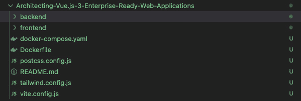

# 第七章：将 Vue 3 应用程序 Docker 化

在上一章中，我们展示了如何使用 Vue.js 3、GraphQL 和 Strapi 后端构建一个完整的 Pinterest 克隆。你还利用了你对 GraphQL 的知识来开发一个企业级 Pinterest 克隆应用程序。在本章中，你将学习 Docker 化你的 Vue.js 3 项目所涉及的步骤的细节。此外，你还将了解 Docker 化和部署企业级 Vue.js 3 网络应用程序的最佳实践和行业标准。本章还将通过介绍如何 Docker 化全栈网络应用程序并将其部署到云平台（使用 Docker Compose）采取更实际的方法。

在本章中，我们将涵盖以下关键主题：

+   Docker 概述

+   Docker 化应用程序

+   在 Docker 上运行应用程序

+   使用 Docker Compose Docker 化 Vue.js 3 和 Node.js

+   在 Docker Compose 上运行应用程序

到本章结束时，你将了解将企业级 Vue.js 3 网络应用程序 Docker 化和部署的最佳实践和行业标准。你还将通过将全栈网络应用程序 Docker 化并将其部署到云平台（使用 Docker Compose）获得实践经验。

# 技术要求

要开始本章，我建议你首先阅读 *第六章**，使用 GraphQL 构建 Pinterest 完整克隆*，在那里我们使用 Vue.js 3、GraphQL 和 Strapi CRM 后端构建了一个完整的 Pinterest 克隆。我们将在本章中大量使用该应用程序来学习 Docker 和 Docker Compose。

本章的所有代码文件可以在 [`github.com/PacktPublishing/Architecting-Vue.js-3-Enterprise-Ready-Web-Applications/tree/chapter-7`](https://github.com/PacktPublishing/Architecting-Vue.js-3-Enterprise-Ready-Web-Applications/tree/chapter-7) 找到。

# Docker 概述

Docker 几年来一直在发展，了解如何使用它已经成为对 DevOps 感兴趣的任何人最关键和最受欢迎的技能之一。因此，无论你是经验丰富的 DevOps 工程师还是初学者，你绝对需要将 Docker 添加到你的技能集合中。

Docker 是 DevOps 和容器编排行业的新热门词汇。它于 2013 年创建，并由其母公司 Docker, Inc. 开发。

Docker 可以将应用程序及其依赖项打包在一个虚拟容器中，该容器可以在任何 Linux、Windows 或 macOS 计算机上运行。容器是指一个隔离或捆绑的应用程序，其中包含执行应用程序所需的工具、库和配置文件。

Docker 的一个好处是它是一个工具包，使开发者能够通过单个 API 在不同的操作系统和平台上使用简单的命令和工作节省的自动化来构建、部署、运行、更新和停止容器。

本章探讨了您需要了解的所有关于 Docker 的知识，Docker 的不同独特功能，以及为什么您应该考虑将应用程序 docker 化。我们还将通过创建和设置您的第一个 Docker 应用程序来操作。

在下一节中，我们将探讨 Docker 及其优势，以了解为什么我们需要在开发流程中使用它。

## 什么是 Docker？

Docker 是一个开源平台，允许开发者快速构建、测试和部署应用程序。Docker 通过将您的应用程序打包成标准化的单元（容器）来实现这一点。这些容器包含软件运行所需的一切，包括库、系统工具、代码和运行时环境。它还虚拟化了安装和运行的计算机的操作系统。

为了进一步解释这一点，让我们假设我们已开发了两个不同的应用程序实例，即前端和后端。

后端使用 Node.js 堆栈开发，包括 PostgreSQL 数据库和其他使 Node.js 后端在本地服务器上正确执行的工具。

接下来，您的前端使用 Vue.js 3 以及使 Vue.js 3 应用程序顺利运行的必要工具和配置创建。

如果您在团队中或个人工作时不使用 Docker，可能会出现以下问题：

+   如果新团队成员加入，由于成员需要安装和配置项目的正确版本以及下载所需文件的精确版本，因此将成员引入代码库可能会很繁琐。

+   在部署应用程序时，为应用程序使用的所有服务配置不同的服务器将是一项大量工作。例如，您将不得不为数据库、前端和后端配置不同的服务器。您可能还需要为不同的环境（如测试、测试和生产）配置不同的服务器，或者每次使用一个配置繁多的服务器。

使用 Docker，您可以通过配置、提供和打包所有这些服务，使用一个简单的配置文件（Dockerfile 或 YAML 文件）来定义和运行多容器 Docker 应用程序，从而解决这些问题。

要了解 Docker 如何解决这些问题，请查看以下截图：

![图 7.1 – Docker 主机和层的截图（来源：freeCodeCamp [freecodecamp.org/news/docker-simplified-96639a35ff36/])](img/Figure_7.01_B17237.jpg)

图 7.1 – Docker 主机和层的截图（来源：freeCodeCamp [freecodecamp.org/news/docker-simplified-96639a35ff36/])

前面的截图显示了 Docker 的内部层和结构，其中您的应用程序被打包进容器中，并包含所有运行所需的资源，以确保顺利运行。此外，每个容器都使用您共享的系统资源。

这使得每个容器都可以与同一主机上存在的其他容器隔离。因此，只要它们具有相同的操作系统要求，就可以在同一主机上运行具有不同应用需求和依赖关系的多个容器。

因此，使用 Docker，您可以以容器形式运行多个应用程序，并使用命令和单个配置文件来控制一切。在下一节中，我们将仔细检查 Docker 对我们开发流程的好处。

### Docker 的好处

使用 Docker 的一些关键好处如下：

+   **优化的存储系统**：容器通常只有几兆字节大小，消耗的磁盘空间非常少。因此，可以在同一主机上托管大量应用程序。

+   **经济高效**：在运行 Docker 所需的硬件方面，Docker 的要求较低。因此，它大大降低了获取不同配置的昂贵硬件的成本。

+   **健壮性**：与虚拟机相比，Docker 由于没有安装操作系统，因此消耗的内存非常少，具有更快的启动时间。

+   **多个容器**：Docker 支持具有相同操作要求的不同应用程序，这些应用程序具有不同的应用需求和依赖关系，可以在同一主机上共同托管。

这些是使用 Docker 管理和运输企业应用程序的好处。接下来，我们将探讨为什么你应该在企业级应用程序中使用 Docker。

### 为什么使用 Docker

Docker 使您能够快速高效地发布代码。它标准化了应用程序的操作，允许您无缝地移动代码，并通过提高资源利用率来节省收入。

在可扩展的企业应用程序中开始使用 Docker 的一些原因如下：

+   **快速运输更多软件**：根据亚马逊([`aws.amazon.com/docker/`](https://aws.amazon.com/docker/))的数据，Docker 用户的产品运输速度是非 Docker 用户的 7 倍。Docker 使您能够根据需要频繁地运输隔离的服务。在构建企业级和可扩展的应用程序时，功能和错误修复可以在数小时甚至数分钟内完成。因此，紧急构建、测试和部署是必需的，而 Docker 在这一领域非常有用。

+   **标准化操作**：Docker 遵循行业标准的应用程序开发实践。被称为容器的隔离标准化单元使得部署、识别问题以及进行修复变得容易。

+   **无缝迁移**：开发者可以在不同的环境和系统之间迁移应用程序，无需担心安装任何库或缺少配置文件。基于 Docker 的应用程序可以无缝地从本地开发迁移到生产环境。

+   **节省资金**：基于 Docker 的应用程序具有成本效益，因为您可以在一个服务器上以容器形式运行多个应用程序。Docker 容器使您在每个服务器上运行更多代码变得更容易，从而提高 CPU 资源的利用率并节省资金。

现在您知道了为什么应该在您的企业应用程序中使用 Docker 以及您可以从使用 Docker 中获得的好处。有了 Docker，您可以更快、更有效地交付产品。当与其他行业标准工具结合使用时，您可以通过采用自动化部署而不是手动部署来完全消除手动部署的麻烦。在下一节中，我们将探讨如何 Docker 化您的第一个应用程序。

# 使用 Vue.js 3 实现 Docker

Docker 是一个企业级容器平台，它使组织能够无缝地构建、共享和运行任何应用程序，无论在何处。几乎所有的企业级公司都将他们的应用程序容器化，以便更快地处理生产负载，这样他们就可以随时部署，有时一天内可以部署几次。

构建企业级应用程序的一种方法是从一开始就 Docker 化项目。因此，我们将使用我们在 *第六章**，使用 GraphQL 构建完整的 Pinterest 模拟* 中开发的 Strapi 后端来 Docker 化 Pinterest Vue.js 3 应用程序，并创建一个 Docker 镜像，以便我们可以在任何时间或有时一天内多次部署该镜像。

## 前提条件

最重要的是，您必须在本地开发系统中下载并安装 Docker 以进行本地测试。您可以通过此链接在不同操作系统上下载和安装它：[`docs.docker.com/install/`](https://docs.docker.com/install/).

## 示例项目

在 *第六章**，使用 GraphQL 构建完整的 Pinterest 模拟* 中，我们使用 Vue.js 3 和 Strapi 作为后端开发了一个 Pinterest 模拟。在本节中，我们将学习如何从头开始 Docker 化项目。以下是应用程序的演示：


图 7.2 – Pinterest 模拟演示的截图

该应用程序根据我们存储在 Strapi 数据库中的图片数量，以马赛克网格布局显示图片。

Strapi 后端允许您管理并控制应用程序的整个后端，从添加图钉和看板到创建新用户。

我们将使用单独的 Dockerfile 和多阶段构建来 Docker 化 Vue.js 3 Pinterest 应用程序和 Strapi 后端，以创建高效的 Docker 镜像。

### Docker 化 Pinterest 应用

我们将首先将 Pinterest Vue.js 3 应用程序进行 Docker 化。在这个多阶段构建中，构建 Vue.js 3 项目并将那些静态资产放入 `dist` 文件夹是第一步。因此，让我们创建一个 Dockerfile 并配置我们的 Vue.js 3 应用程序。

在您的 Pinterest 克隆 Vue.js 3 应用程序的根目录中创建一个 Dockerfile。如果从 `第六章` 仓库 ([`github.com/PacktPublishing/Architecting-Vue.js-3-Enterprise-Ready-Web-Applications/tree/chapter-6`](https://github.com/PacktPublishing/Architecting-Vue.js-3-Enterprise-Ready-Web-Applications/tree/chapter-6)) 克隆时 Strapi 后端仍然位于前端文件夹中，您可以在前端文件夹旁边创建一个父文件夹，并将 Strapi 后端文件夹移动到那里，如下面的截图所示：


图 7.3 – 当前文件夹结构的截图

此外，您还可以从以下链接克隆完成的 `第七章` ([`github.com/PacktPublishing/Architecting-Vue.js-3-Enterprise-Ready-Web-Applications/tree/chapter-7`](https://github.com/PacktPublishing/Architecting-Vue.js-3-Enterprise-Ready-Web-Applications/tree/chapter-7)) 仓库，其中包含完整的代码库。

最后，让我们探索配置文件以将 Vue.js 3 企业应用程序 docker 化。打开您的 Dockerfile 并添加以下代码：

```js
# Use the official Node.js 14 Alpine image from https://hub.docker.com/_/node.
# Using an image with specific version tags allows deterministic builds.
FROM node:16.17.0-alpine
# Create and change to the app directory.
WORKDIR /usr/src/frontend
# Copy important root files to the builder image.
COPY package*.json ./
# Install production dependencies.
RUN npm install
# Copy the Vue 3 source to the container image.
COPY . .
# Expose container port
EXPOSE 3000
# Run the Vue service on container startup.
CMD ["npm", "run", "dev"]
```

代码片段自解释，注释解释了我们使用 Dockerfile 中的每个命令。

使用以下命令构建镜像：

```js
// build the image
docker build -t pinterest-vue-frontend .
// check the images
docker images
```

```js

In summary, we have successfully dockerized our Vue.js 3 Pinterest application. In the next section, we will dockerize the Strapi backend application separately.

### Dockerizing the Strapi backend app

In this section, we will follow the same approach used in dockerizing the Vue.js 3 frontend project to create a Docker instance for the Strapi backend.

Therefore, create a Dockerfile inside the Strapi backend folder of your project and add the following configuration code:

```

# 使用来自 https://hub.docker.com/_/node 的官方 Node.js 14 Alpine 镜像。

# 使用具有特定版本标签的镜像允许确定性构建。

FROM node:14.16.1 AS builder

# 创建并切换到应用程序目录。

WORKDIR /usr/src/backend

# 将重要的根文件复制到构建镜像中。

COPY package*.json ./

# 安装生产依赖项。

RUN npm install

# 将后端源代码复制到容器镜像中。

COPY . .

# build app for production with minification

RUN npm run build

EXPOSE 1337

# 初始化最终镜像生成。

FROM node:14.16.1

# 在容器启动时运行 Strapi 服务。

CMD ["npm", "start"]

```js

We copied the previous configuration and changed the building process for the backend app. The code snippet is self-explanatory with comments explaining every command we used in the Dockerfile. In the next section, we are going to run the applications on Docker and test them separately.

### Running the images on Docker

After building the Docker image, next, we need to run the image on Docker using the following command:

```

```jsbash
// run the Frontend image
docker run -d -p  3000:3001 --name pinterest-frontend pinterest-vue-frontend
// run the Strapi Backend Image
docker run -d -p  1337:3002 --name pinterest-backend pinterest-strapi-backend
// check the container
docker ps
```

```js

The `ps` command checks the container for the list of images currently running in your Docker engine. You should see two images with the names specified in the preceding Docker `run` command.

If the `run` command is successful, you can access the frontend application on the web at the address `http://localhost:3001` and the backend instance at port `3002`. This port change is possible because the `-p` option exposes our internal frontend Vue.js 3 server port `3000` to the external port `3001`, which makes it possible to access our internal Docker application in our browser.

At this point, if everything is successful, you should be greeted with your demo Vue.js 3 application. However, following this approach poses a problem. Developers need to build, test, and deploy applications in isolation, which can be avoided with Docker Compose.

In this section, we explored how to dockerize the Pinterest clone application we have developed in this book. We learned how to create, build, and run the Dockerfile we used in dockerizing the project using different Docker commands. In the next section, we will explore how to use Docker Compose to build, test, and deploy multiple applications at once.

# Dockerizing Vue.js and Node.js with Docker Compose

In the previous section, we explored how to dockerize Vue.js 3 applications and how to dockerize a Node.js application using Strapi, which was done separately. In this section, we are going to explore how to build, test, and deploy bundled applications. Furthermore, we are going to build and dockerize both applications as a single unit.

## Overview of Docker Compose

Docker Compose is a tool designed to enable users to easily define and share multi-container applications. By creating a YAML file, Compose allows us to quickly launch or shut down all services with a single command.

With Docker Compose, developers can build, test, and deploy multiple containers and images bundled together to form a single application.

In the next section, we are going to explore how to bundle the frontend and backend applications that we demonstrated in the previous section.

### Dockerizing the Pinterest clone app

To bundle a deployable application, we are going to start by creating a central Dockerfile and Docker Compose YAML file inside the root directory that contains the different configurations to bundle our application with Docker Compose.

Before you start, rename your `strapi-pinterest-api` folder to `backend`. The following screenshot shows the current folder structure:



Figure 7.4 – A screenshot of the current folder structure with Docker and Docker Compose files

Next, create a Dockerfile inside the root directory and add the following script:

```

FROM node:14.15.0

ARG PACKAGE_PATH=

ARG WORKING_DIR=

WORKDIR ${WORKING_DIR}

COPY ${PACKAGE_PATH}/package*.json ${WORKING_DIR}

RUN npm install --silent

COPY ${PACKAGE_PATH} ${WORKING_DIR}

VOLUME $WORKING_DIR/node_modules

CMD [ "npm", "start" ]

```js

#### Code walk-through

Let’s walk through the code together and understand the nitty-gritty of it.

**Step 1:** **Import Node.js**

The first step in every Dockerfile is to specify the build image. In this case, we specify Node.js as our image.

This will install Node.js with the specified version number and set up the environment to run Node.js properly.

**Step 2: Create the** **required arguments**

The second step is to create the arguments required by Docker Compose when building individual images of our frontend and backend applications:

```

ARG PACKAGE_PATH=

ARG WORKING_DIR=

WORKDIR ${WORKING_DIR}

```js

Additionally, we create a working directory specifying the argument we created earlier. This will auto-inject the specified working directory in the Docker Compose YAML file.

**Step 3: Copy, install, and** **run commands**

Lastly, we copy files from the specified working directory into the Docker virtual working directory. We start by copying `package*.json` files, running the `install` command, and copying the remaining files later. This approach utilizes the Docker caching system:

```

COPY ${PACKAGE_PATH}/package*.json ${WORKING_DIR}

RUN npm install --silent

COPY ${PACKAGE_PATH} ${WORKING_DIR}

VOLUME $WORKING_DIR/node_modules

CMD [ "npm", "start" ]

```js

Furthermore, after mounting the `node_modules` folder of the specified working directory, Docker will execute the `npm start` command to start the application.

Now that we have created a central Dockerfile for both the frontend and backend, let’s continue by creating a YAML Docker Compose file to bundle our separate applications together.

Create a `docker-compose.yaml` file inside the root directory and add the following script:

```

版本： "3.5"

- 服务：

api:

build:

context: .

dockerfile: Dockerfile

args:

PACKAGE_PATH: backend

WORKING_DIR: /usr/src/

expose:

- 1337

端口：

- 1337:1337

environment:

- NODE_ENV=development

- HOST=0.0.0.0

- PORT=1337

- BASE_URL=http://api:1337

env_file:

- ./.env

卷：

- ./backend:/usr/src

command: >

sh -c "npm install"

frontend:

build:

context: .

dockerfile: Dockerfile

args:

PACKAGE_PATH: frontend

WORKING_DIR: /usr/src/

expose:

- 3000

端口：

- 3000:3000

环境：

- APP_ENV=production

- APP_BACKEND=http://0.0.0.0:1337/api

- NODE_PATH=/usr/src/

- APP_TOKEN=eyJhbGciOiJIUzI1NiJ9.c29sb[STRAPI_TOKEN]

env_file:

- ./common.env

volumes:

- ./frontend:/usr/src

depends_on:

- api

command: ["npm", "start"]

```js

#### Code walk-through

Let’s walk through the code together and understand the nitty-gritty of it.

**Step 1: Versioning** **and services**

Every Docker Compose file always starts with a version number of the version of Docker Compose you intend to use when building and bundling the application. In this demo, we specify version 3.5.

Furthermore, every Docker Compose YAML is always split into different services. You can add as many services as required that each application depends on. For instance, if the backend of your project depends on a database (PostgreSQL), you can specify that as a service.

In this demo, we have specified only two services, namely the following:

*   Backend
*   Frontend

Each of the services contains configurations that enable them to run smoothly. Let’s explore the configurations we have added to the frontend service.

**Step 2: The** **build section**

The `build` section includes configurations that help in building the application. It contains commands such as the context, working directory, and defined arguments:

```

build:

context: .

dockerfile: Dockerfile

args:

PACKAGE_PATH: frontend

WORKING_DIR: /usr/src/

```js

The `context` command specifies the part of the directory where the Dockerfile we created earlier is stored. In our case, it was stored in the root directory.

Next, we call the Dockerfile with the `dockerfile` command and specify the required parameters with the `args` command. Lastly, we specify the `PACKAGE_PATH` and `WORKING_DIR` values.

**Step 3: Exposing** **the port**

In this step, we exposed the internal Docker port used to run the application to the outside world:

```

expose:

- 3000

ports:

- 3000:3000

```js

**Step 4: Creating** **environment variables**

In this step, we use the `environment` command to add the required environment variables, such as `APP_BACKEND` and `APP_ENV`:

```

environment:

- APP_ENV=production

- APP_BACKEND=http://0.0.0.0:1337/api

- NODE_PATH=/usr/src/

- APP_TOKEN=eyJhbGciOiJIUzI1NiJ9.c29sb[STRAPI_TOKEN]

env_file:

- ./.env

```js

Then, we create an `env` file in the root directory using the `env_file` command to store the details we specified previously.

**Step 5: Running** **the app**

Lastly, we mount the `frontend` directory and specify that the frontend project depends on our backend API service, which is our Strapi backend. This allows Docker to execute the project in sequence from the backend first before the frontend:

```

volumes:

- ./frontend:/usr/src

depends_on:

- api

command: ["npm", "start"]

```

最后，我们调用命令来执行项目。同样的方法也适用于后端服务。在下一节中，我们将学习如何使用 Docker Compose 运行项目。

## 在 Docker Compose 上运行应用程序

在成功创建 Docker Compose YAML 配置文件后，让我们使用 Docker Compose 运行我们的 Pinterest 模拟项目。

在开始运行项目之前，请确保设置并安装 Docker 和 Docker Compose。接下来，在终端根目录中输入 `docker compose up` 以部署项目。或者，直接输入 `docker-compose up`。应用程序将在 `http://localhost:3000/` 上提供服务。

如果一切配置正确，你应该会看到一个全栈 Pinterest 应用程序，如下面的截图所示：


图 7.5 – Pinterest 应用程序演示预览

如果你对任何内容不确定，请参考本章代码库（[`github.com/PacktPublishing/Architecting-Vue.js-3-Enterprise-Ready-Web-Applications/tree/chapter-7`](https://github.com/PacktPublishing/Architecting-Vue.js-3-Enterprise-Ready-Web-Applications/tree/chapter-7)）以查看工作状态和完整的项目设置。

在本节中，我们探讨了如何使用 Docker Compose 创建和管理许多服务，这些服务是我们上一节中创建的 Dockerfile。我们还学习了如何使用 Docker Compose 打包我们的全栈应用程序，包括前端、后端和数据库。

# 摘要

本章深入探讨了将 Vue.js 3 项目 docker 化所涉及的繁琐步骤。此外，我们还探讨了 docker 化和部署企业级 Vue.js 3 网络应用程序的最佳实践和行业标准。我们还学习了如何使用 Docker Compose docker 化一个全栈网络应用程序。

通过 Dockerfile，我们能够将我们的 Pinterest 模拟演示应用程序 docker 化，使其可以轻松地由其他团队成员或任何云服务提供商部署和管理。此外，我们还学习了如何使用 Docker Compose 打包和管理一个包含后端、前端、数据库服务以及更多功能的全栈应用程序，所有这些都在一个文件中。

在下一章中，你将探索测试的概念。你将学习从一系列可用的组件和方法中测试什么。此外，你还将了解与测试库相关的最佳实践和行业标准，以及如何将它们与 Vue.js 3 集成。

# 第四部分：测试企业级 Vue.js 3 应用

测试企业级项目可能会令人感到 daunting 和不必要地复杂。这部分将探讨与企业测试相关的一切，以及精确测试哪些内容以消除在测试错误代码上浪费的时间。

本部分包括以下章节：

+   *第八章*, [*在 Vue.js 3 中测试和要测试的内容*](https://epic.packtpub.services/index.php?module=oss_Chapters&action=DetailView&record=b958045c-cbca-b3c1-9404-61d6c95961a4)

+   *第九章*, [*单元测试的最佳实践*](https://epic.packtpub.services/index.php?module=oss_Chapters&action=DetailView&record=b5bd1ffc-0280-c217-aa63-61d6c9ee0198)

+   *第十章*, [*Vue.js 3 中的集成测试*](https://epic.packtpub.services/index.php?module=oss_Chapters&action=DetailView&record=907b43f6-1d49-47b3-a4ac-63835de51e8f)

+   *第十一章*, *行业标准的端到端测试*
