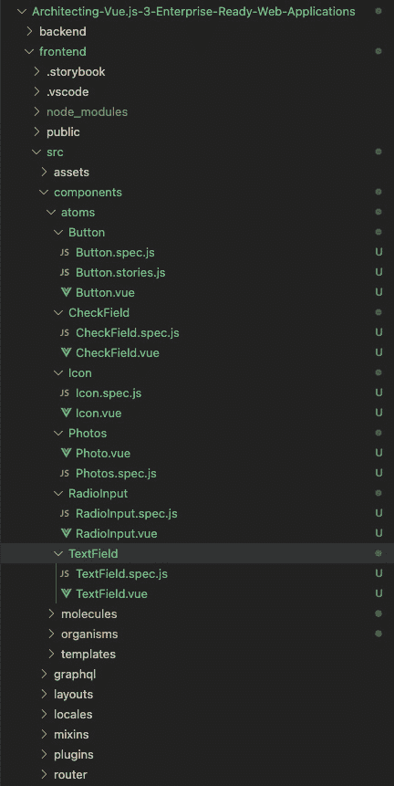
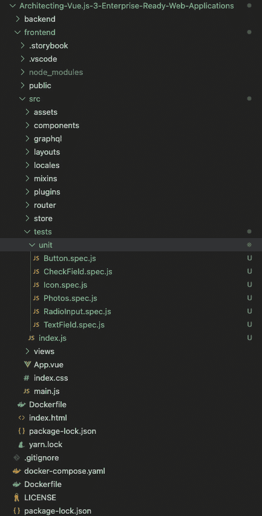
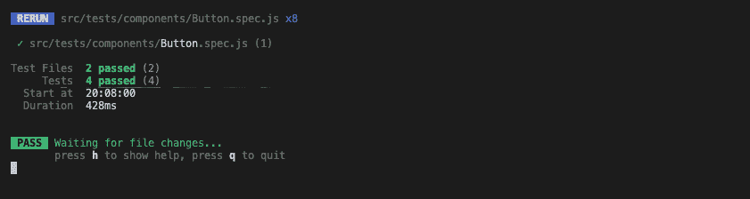

# 第八章：Vue.js 3 中的测试及其测试内容

在上一章中，你学习了将你的 Vue.js 3 项目 docker 化的详细步骤。此外，你还学习了将企业级 Vue.js 3 网络应用程序 docker 化的最佳实践和行业标准。

在本章中，你将探索软件测试的概念。你将学习从一系列可用的组件和方法中要测试什么。此外，你还将了解与测试库相关的最佳实践和行业标准，以及如何将它们与 Vue.js 3 集成。

在本章中，我们将涵盖以下关键主题：

+   测试概述

+   软件工程中的测试

+   要测试什么

+   测试基本的 Vue.js 3 应用程序

+   Vue.js 3 的组件测试

# 技术要求

要开始本章的学习，我建议你首先阅读 *第七章*，*Dockerizing a Vue 3 App*，在那里我们通过使用 Docker Compose docker 化了一个全栈网络应用程序，采取了一种更实际的方法。在本章中，我们将大量使用该应用程序来学习 Vue.js 3 企业级测试。

本章的所有代码文件可以在 [`github.com/PacktPublishing/Architecting-Vue.js-3-Enterprise-Ready-Web-Applications/tree/chapter-8`](https://github.com/PacktPublishing/Architecting-Vue.js-3-Enterprise-Ready-Web-Applications/tree/chapter-8) 找到。

# 测试概述

任何学习过计算机科学的人都应该熟悉 SDLC 的概念。如果你不知道，**SDLC** 代表 **软件开发生命周期**。

Synopsys ([`www.synopsys.com/glossary/what-is-sdlc.html`](https://www.synopsys.com/glossary/what-is-sdlc.html)) 提供以下定义：

软件开发生命周期（SDLC）是一个结构化的过程，它能够在尽可能短的生产时间内生产出高质量、低成本软件。SDLC 的目标是生产出满足并超越所有客户期望和需求的优秀软件。

如果你进一步探索 SDLC，你会发现它定义并概述了八个详细计划，包括阶段或阶段，这些阶段或阶段是质量和企业级软件必须通过的，以生产出满足并超越所有客户期望和需求的软件。

每个阶段都至关重要，包括规划、编码、构建和测试。然而，测试阶段尤为重要，尤其是在你需要构建一个无错误或缺陷的企业级应用程序时。

为了进一步阐述，测试阶段评估创建的软件与任何错误、任何潜在错误以及从规划阶段开始的软件需求。

接下来，我们将了解我们所说的软件测试是什么意思。

## 什么是软件测试？

软件测试是检查生产中的软件是否符合预期需求的方法，最重要的是，它是否无缺陷。执行软件测试所使用的方法因组织而异。然而，方法被分为手动和自动化过程。

个人和组织对软件测试有不同的称呼。它也可以被归类为白盒测试或黑盒测试。然而，任何方法的最终结果总是相同的，即识别与实际需求相比的错误、差距或缺失的需求。

黑盒测试涉及在不了解系统内部工作原理的情况下测试系统，而白盒测试是一种允许测试人员检查和验证系统内部工作原理的测试方法。

无论在提及软件测试时使用什么名称、术语或类别，简单来说，软件测试就是验证**被测试的应用程序**（**AUT**），这是生产高质量企业级软件的关键和关键阶段。

在下一节中，我们将讨论软件测试的重要性。

## 为什么软件测试很重要

将软件测试纳入您的应用程序开发流程中的必要性不容忽视。它和 SDLC（软件开发生命周期）中的规划和开发阶段一样重要。实际上，如果没有适当的软件测试策略，开发中的软件最终产品很可能充满缺陷、错误和未满足的软件需求。

软件测试之所以重要，是因为软件缺陷可能代价高昂，对企业和整个组织来说也非常危险。多年来，有许多潜在的软件缺陷和货币损失的事例。

例如，2015 年 4 月，伦敦的彭博终端因软件故障而崩溃，影响了超过 30 万金融市场交易员。据《卫报》([`www.theguardian.com/business/2015/apr/17/uk-halts-bond-sale-bloomberg-terminals-crash-worldwide`](https://www.theguardian.com/business/2015/apr/17/uk-halts-bond-sale-bloomberg-terminals-crash-worldwide))报道，这迫使英国政府推迟了 30 亿英镑的债务销售。

此外，根据 Windows 报告([`windowsreport.com/windows-10-vulnerability/`](https://windowsreport.com/windows-10-vulnerability/))，Windows 10 存在一个漏洞，允许用户通过 win32k 系统中的漏洞逃离安全沙箱。

已有许多关于不同恶意攻击商业活动导致收入或货币价值受损的漏洞报告，其中一些可以通过适当的软件测试避免。这表明软件测试是 SDLC（软件开发生命周期）中非常重要的一个阶段。

虽然软件测试需要资金，但我相信您会同意我的观点，与如果没有良好的测试技术和 QA 流程，开发和支持公司每年要花费的数百万美元相比，这个成本微不足道。

此外，在产品上市之前进行早期软件测试可以揭示问题。早期测试还可以揭示不同的缺陷，包括但不限于以下内容：

+   架构缺陷

+   设计决策不当

+   无效或不正确的功能

+   安全漏洞

+   可扩展性问题

在软件开发流程中实施适当的测试流程可以提高软件可靠性，意味着高质量的应用程序在错误很少的情况下交付。在下一节中，我们将进一步探讨软件测试的好处。

## 软件测试的好处

在上一节中，我们解释了为什么企业应用需要在他们的开发流程中包含测试。在本节中，我们将探讨拥有适当的软件测试流程的好处。我们将详细讨论以下点：

+   帮助节省资金

+   满足客户需求

+   增强开发流程

+   产品质量

+   安全性

### 帮助节省资金

将有缺陷的软件推向市场可能比创建整个软件更昂贵。如前所述，由于软件缺陷和易出错的软件，许多公司的货币价值已经减少。

如果在开发流程中构建适当的软件测试过程来检测和纠正这些错误，那么这个问题可以在一定程度上得到缓解。

### 满足客户需求

为了让您的企业应用用户满意，软件必须正常工作，并符合要求。

因此，在将软件推向市场之前，必须进行验收测试，以确保产品符合要求，并了解用户将如何日常访问和使用产品。

在测试阶段，如果发现任何问题或错误，测试中的软件可以轻松地退回到开发阶段，而不是在生产阶段发现问题，那时真实用户正在与应用程序交互。

### 增强开发流程

将软件测试纳入开发流程可以创建一个增强的开发流程。此外，将软件测试纳入流程是行业标准做法。另外，开发者修复开发阶段的错误比在生产阶段修复要简单。

因此，将软件测试过程纳入开发流程可以降低将存在缺陷的软件推向市场的风险，并增强开发流程。

### 产品质量

当产品质量下降时，公司可能会失去客户，从而导致收入损失。然而，低质量软件的一个属性是未经测试且易于出现错误的软件应用程序。

此外，如果将适当的软件测试流程集成到开发管道中，大多数错误、缺陷和缺陷将在生产前被发现和修复，从而生产出高质量的软件。

### 安全性

根据 OWASP（[`owasp.org/www-project-top-ten/`](https://owasp.org/www-project-top-ten/)），安全性应该是每个软件的组成部分。不考虑它可能会导致企业货币价值的降低。

软件测试是检测安全漏洞并在开发阶段修复它们的一种方法。如果一个产品经过测试，用户可以确信他们正在接收一个可靠的产品。他们可以确信他们的个人信息是安全的。借助软件测试，用户可以接收到更可能没有漏洞的产品。

在本小节中，我们介绍了一些您可以从将软件测试实施到构建企业级应用程序的管道中获得的益处。

在下一节中，我们将探讨不同的测试类型以及您可以集成到您的开发管道中的不同策略。

# 软件工程中的测试

如前所述，软件测试是 SDLC（软件开发生命周期）的一个组成部分，因此，根据 ANSI/IEEE 1059，软件工程中的测试是评估待测试软件以确定其是否满足要求，以及是否没有错误、缺陷和缺陷的方法。

该过程涉及评估待测试软件的功能，以检查任何缺失的需求、错误或错误、安全性、可靠性和性能。

在本节中，我们探讨了测试的好处以及为什么软件测试很重要，在下一节中，我们将了解不同类型的软件测试。我们将探讨要测试什么以及如何编写基本的单元和集成测试。

## 软件测试类型

软件测试有不同的名称。根据 Guru99，有超过 150 种软件测试类型（[`www.guru99.com/types-of-software-testing.html`](https://www.guru99.com/types-of-software-testing.html)）。

然而，我们将软件测试分为两大类，然后探索每一类及其中的不同类型。以下两大类是：

+   功能性软件测试

+   性能软件测试（非功能性）

下图显示了软件测试类型的高级分类：


图 8.1 – 软件测试的高级分类（来源：softwaretestinghelp）

您可以在 YouTube 上了解更多关于不同软件测试类别的信息。然而，我们将只关注以下三个主要的功能软件测试类别：

+   单元测试

+   集成测试

+   端到端测试

### 单元测试

这种基本的软件测试方法由程序员执行，以测试程序的单位或最小部分。这有助于开发者了解单个代码单元是否正常工作。

### 集成测试

这种类型的测试侧重于软件的构建和设计。您需要查看集成单元是否在没有错误的情况下工作。

### 端到端测试

端到端测试是一种评估复杂产品从开始到结束的工作顺序的方法论。

在接下来的章节中，我们将专注于单独探索这些不同类型的测试。然而，您可以从 Guru99（[`www.guru99.com/types-of-software-testing.html`](https://www.guru99.com/types-of-software-testing.html)）探索超过 150 种不同的软件测试类型。

总结来说，既然我们知道软件测试的重要性以及不同的软件测试类型，我们如何知道在一个大型企业应用程序中要测试什么？在下一节中，我们将探讨要测试什么以及如何将测试管道集成到开发工作流程中。

# 要测试什么

在软件团队中，一个常见的问题是*我们应该测试什么，不应该测试什么？*在本节中，我们将探讨在考虑软件测试时，您应该测试和不应该测试的不同事项。

我们将首先探讨在将软件测试集成到您的开发工作流程时可以采用的不同测试策略。

## 测试策略

在您的企业应用程序中实施的最佳测试策略是正常（手动）测试和自动化测试的结合。此外，正常测试应由**质量保证**（**QA**）团队更广泛地进行。

为了进一步解释，当自动化测试被成功编写和实施时，我们通常编程它来查找基本错误和边缘情况，这些错误和边缘情况可能没有正确地吸收真实客户如何与应用程序交互。

## 您应该测试的内容

软件测试对于企业级应用程序的效率至关重要，了解要测试什么至关重要，这样开发者就不会浪费时间测试错误的事情。

以下是在测试您的企业项目以查找错误、缺陷和缺陷时可以查找的一些事项列表：

+   **传递的参数**：确保方法或函数没有改变而传递的参数或参数集合。在某些情况下，参数的数据类型保持不变。

+   **算法引擎**：每个方法都有一个目的，这个目的是通过逻辑或算法实现的。你的测试用例应该测试算法，以确保它是正确的，并且根据方法输入产生正确的输出。

+   **简单的数据库查询检查谓词**：如果你的工作作为开发者与查询和操作数据库相关，你真的需要测试你的数据库查询以确保它执行正确的操作和查询。

+   **实用方法**：实用方法是项目中的辅助工具，为特定任务创建。它们通常在你需要执行不需要类实例的任务时使用。这一组方法需要得到适当的测试，以确保在使用时产生正确的输出。

+   **测试不那么关键的代码**：测试一些你认为可能存在错误的异常复杂代码的边缘情况。此外，当有人有时间时，对不那么关键的代码进行边缘情况测试。

上述是一些你可以考虑用于测试用例的内容。然而，重要的是要注意，编写测试和拥有 100%的代码覆盖率并不一定意味着你的代码没有错误。在下一节中，我们将探讨在你的项目中不应该测试的内容。

## 你不应该测试的内容

以下是在你的项目中不应该测试的内容：

+   构造函数或属性（如果它们只是返回变量）。只有当它们包含验证时才测试它们。

+   调用另一个公共方法的函数。

+   如果代码需要与其他已部署的系统交互，则应使用集成测试。

+   如常量、只读字段、配置和枚举之类的配置。

+   你不应该测试 POJO 类或模型；相反，你可以测试类中的每个方法。

总结来说，我们已经探讨了软件测试策略，测试什么，以及你不应该测试什么，以帮助你理解软件测试在你企业应用中的相关性。在下一节中，我们将探讨如何测试一个基本的 Vue.js 应用。

# 测试基本的 Vue.js 3 应用

在上一章中，我们使用 Strapi 作为后端和 Vue.js 3 作为前端创建了一个 Pinterest 应用程序。

之前，我们添加了国际化，结构化了项目，并构建了一个完整的 Pinterest 克隆。在本节中，我们将继续使用为本书创建的官方项目来设置软件测试，从而得到一个完整的、企业级就绪的 Pinterest 克隆应用程序。

你可以从这个仓库克隆项目，[`github.com/PacktPublishing/Architecting-Vue.js-3-Enterprise-Ready-Web-Applications`](https://github.com/PacktPublishing/Architecting-Vue.js-3-Enterprise-Ready-Web-Applications)，直接开始。

## 创建测试文件夹

当涉及到创建企业应用程序时，知道在哪里添加你的测试文件和文件夹总是令人困惑。根据你在企业项目中使用的方法，有两种结构测试文件的方法。

### 方法 1 – 在每个组件内添加测试文件

首先，你可以在每个 `component` 文件夹内创建一个特定的测试文件。例如，在我们的 Vue.js 3 项目中，我们将在每个组件文件夹内创建一个文件夹，并将每个组件的文件移动到该文件夹中，包括每个组件的测试文件。

下图显示了我们可以如何安排我们的组件文件夹以容纳我们的测试文件和其他与特定组件相关的文件：



图 8.2 – 展示我们的组件结构的屏幕截图

在前面的图中，你可以看到如何添加与任何组件相关的任何文件。例如，如果你想为每个组件添加端到端测试或集成测试文件，你只需在每个特定的组件文件夹内创建该文件即可。

此外，由于我们的实践项目结构和原子模式的引入，我们可以轻松地看到每个组件将创建多少文件。同样，这也适用于项目中的不同测试区域。

然而，我们可以使用下一个方法来将所有与测试相关的内容安排在单独的文件夹中，并在特定的 `tests` 文件夹内创建所有文件和文件夹。

### 方法 2 – 创建测试文件夹

在本节中，我们将在 `src` 文件夹内创建一个名为 `tests` 的文件夹，该文件夹将包含所有与测试和测试配置相关的文件和文件夹。

下图显示了使用此方法实现测试的文件夹结构：



图 8.3 – 实现测试的文件夹结构屏幕截图

此方法有一个包含所有与测试相关的文件和文件夹（包括所有配置）的单个文件夹。它是所有软件测试文件和文件夹的中心位置和单一事实来源。你可以根据你的用例以不同的结构安排此文件夹。

此外，你的测试文件夹或与测试相关的文件和文件夹的结构方法并不重要。最重要的是正确实施软件测试，并确切知道要测试什么，以避免生产中的错误和故障。

在这个演示中，我们将使用第二种方法来编写一些基本的单元测试以进行演示。这是因为我们不希望测试文件分散在不同的文件夹中，因为我们正在使用原子模式。

## 编写基本的单元测试

首先，我们将开始安装 Vue.js 3 的新测试库。由于我们在项目中使用 Vite，我们还将安装 Vitest 库作为我们的测试运行器。你可以在 [`vitest.dev/guide/`](https://vitest.dev/guide/) 上了解更多关于新 Vue.js 3 测试库的信息。

### 安装测试库

Vitest 是由 Vite 驱动的闪电般的单元测试框架。使用以下任何命令安装库：

```js
```bash

# 使用 npm

npm install -D vitest

# 或者使用 yarn

yarn add -D vitest

# 或者使用 pnpm

pnpm add -D vitest

```js
```

现在我们已经设置了测试库，让我们创建一个简单的辅助文件来测试我们的配置。

### 创建辅助文件

在我们的演示中，我们将在 `src/helpers` 文件夹内创建一个辅助文件，并添加一个简单的增加值的函数。以下代码片段显示了添加到新创建的文件中的代码示例：

```js
// src/helpers/index.js
export function increment(current, max = 10) {
 if (current < max) {
   return current + 1;
 }
 return current;
}
```

之前编写的增量函数通过增加 `1` 来增加一个值，直到达到最大值。如果达到最大值，它将简单地返回当前值。接下来，让我们为它编写一个基本的单元测试。

### 编写基本测试

在本节中，我们将为这个函数编写一个简单的单元测试。你可以在此基础上为你的企业项目中的所有函数和方法编写单元测试：

```js
import { describe, it, expect } from 'vitest';
import { increment } from '../../helpers';
describe('increment', () => {
 it('increments the current number by 1', () => {
   expect(increment(0, 10)).toBe(1);
 });
 it('does not increment the current number over the max', () => {
   expect(increment(10, 10)).toBe(10);
 });
 it('has a default max of 10', () => {
   expect(increment(10)).toBe(10);
 });
});
```

我们将在下一章深入探讨单元测试。

让我们一起来分析前面的代码，并理解它的细节：

+   **步骤 1：添加** **所需的包**

首先，我们需要 `vitest` 包和 `helper` 文件来测试。接下来，我们使用导出的函数创建一个 `describe` 块，等等：

```js
import { describe, it, expect } from 'vitest';
import { increment } from '../../helpers';
describe('increment', () => {
….
});
```

`describe` 块用于将相关的测试案例分组，如前一个代码片段所示。

+   **步骤 2：使用** **it 函数**

接下来，我们使用 `it` 函数来测试我们函数的特定用例。例如，我们测试确保每次调用函数时数字实际上增加 `1`：

```js
 it('increments the current number by 1', () => {
   expect(increment(0, 10)).toBe(1);
 });
```

+   **步骤 3：使用** **except 函数**

最后，`expect` 函数用于测试用例。你传入一个值并期望该值等于另一个值，如示例所示。

除了 `toBe()` 函数外，你还可以从 `expect` 对象访问不同的方法（[`vitest.dev/api/#expect`](https://vitest.dev/api/#expect)）。

在下一节中，我们将介绍使用 Vitest 运行测试以及创建你的第一个组件/集成测试示例的过程。

### 使用 Vitest 运行测试

现在，我们将运行测试以查看它是否通过。在你的根终端中输入以下命令：

```js
yarn test
```

如果你的测试成功，你应该会看到三个案例都通过了，如下面的图所示：


图 8.4 – 显示测试结果的截图

在本节中，我们展示了如何使用 Vue.js 3 的最新 Vitest 测试库配置和构建软件测试。我们还学习了如何编写基本的单元测试。在下一节中，我们将学习如何创建基于组件的基本测试。

# Vue.js 3 中的组件测试

在 Vue.js 中，组件是 UI 的主要构建块，指的是应用中可共享、可测试和可重用的单个单元。因此，组件测试位于单元测试和端到端测试之间。它也可以被称为集成测试。

在之前的章节中，我们使用 Storybook 集成原子模式时，我们讨论了创建组件故事以及如何创建它们。如果您为所有组件创建了故事，并配置它们按演示正常工作，那么您已经使用 Storybook 故事实现了组件测试。

然而，第十章，“在 Vue.js 3 中集成测试”专门探讨了组件测试。尽管如此，我们将在本章中简要说明如何实现简单的基于组件的测试，以帮助我们理解下一章。

## 编写基本的组件测试

我们将首先安装 Vue.js 3 的新测试库。由于我们在项目中使用 Vite，我们还将安装 Vitest 库作为我们的测试运行器。您可以阅读更多关于新 Vue.js 3 测试库的信息（[`vuejs.org/guide/scaling-up/testing.html`](https://vuejs.org/guide/scaling-up/testing.html)）。

### 安装测试库

截至撰写本文时，`@testing-library/vue` ([`github.com/testing-library/vue-testing-library`](https://github.com/testing-library/vue-testing-library)) 被推荐用于组件测试，我们将在示例中安装它。运行以下命令来安装它：

```js
```bash

npm install -D vitest happy-dom @testing-library/vue

```js
```

接下来，打开 `vite.config.js` 文件并添加以下配置：

```js
import { defineConfig } from 'vite';
import vue from '@vitejs/plugin-vue';
// https://vitejs.dev/config/
export default defineConfig({
 plugins: [vue()],
 test: {
   environment: 'happy-dom',
   globals: true,
 },
});
```

此配置应允许我们同时运行单元测试和组件测试。接下来，让我们创建一个简单的组件测试。

### 创建基本的组件测试

这里有一个简单的组件测试代码片段，用于演示过程：

```js
import { render } from '@testing-library/vue';
import Button from '../../components/atoms/Button.vue';
test('mounted a button with custom label', async () => {
 // The render method returns a collection of utilities to
 // query your component.
 const { getByText } = render(Button, {
   props: {
     label: 'Test',
   },
 });
 // getByText returns the first matching node for the
 // provided text, and Check if button is render with Label
 // from props
 const button = getByText('Test');
});
```

测试简单地渲染带有自定义标签值的 `Button`，并检查我们是否可以在渲染过程中检索到添加的自定义标签。

### 运行测试

运行测试将导致四个通过测试案例，包括我们之前创建的单元测试：



图 8.5 – 一个显示集成测试最终测试结果的截图

在本节中，我们展示了如何使用最新的 Vitest 测试库配置和构建 Vue.js 3 的组件测试，也称为集成测试。我们还编写了基本的组件测试，以帮助我们理解这个过程。在接下来的章节中，我们将深入探讨在构建 Vue.js 3 企业项目时可以执行的不同类型的测试。

您可以在此处克隆本章的最新仓库：[`github.com/PacktPublishing/Architecting-Vue.js-3-Enterprise-Ready-Web-Applications/tree/chapter-8`](https://github.com/PacktPublishing/Architecting-Vue.js-3-Enterprise-Ready-Web-Applications/tree/chapter-8)。

# 摘要

本章深入探讨了软件测试的概念，以交付可扩展、高性能且无错误的软件应用。我们还探讨了从一系列可用组件和方法中应该测试什么。此外，我们还利用我们对软件测试的知识，在 Vue.js 3 中使用 Vitest 创建基本的单元和组件测试用例。

在下一章中，我们将探讨与单元测试相关的所有内容。我们将学习如何对 Vue.js 3 组件及其页面方法进行单元测试。我们还将了解单元测试工具，如 Vitest，并使用它们有效地对企业项目进行单元测试。
