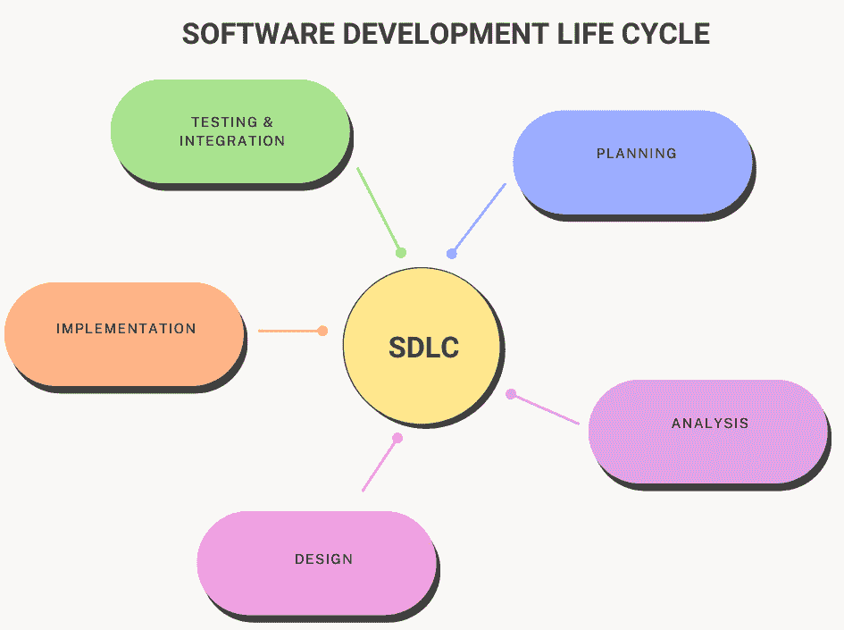
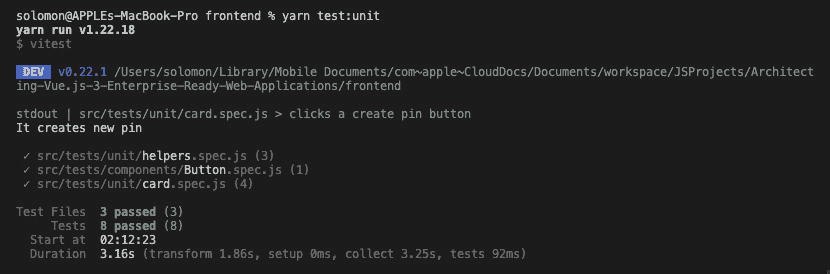

# 9

# 单元测试的最佳实践

在上一章中，我们学习了软件测试的概念。我们学习了从一系列可用的组件和方法中测试什么。此外，我们还学习了最佳实践和行业标准测试库，以及如何将它们与 Vue.js 3 集成。

在本章中，我们将探讨与单元测试相关的所有内容。我们将学习如何对 Vue.js 3 组件和组件及页面方法进行单元测试。我们还将了解单元测试工具，如 Jest 和 Mocha，以及如何使用它们有效地对企业项目进行单元测试。

在本章中，我们将涵盖以下关键主题：

+   单元测试简介

+   什么是单元测试？

+   单元测试的重要性

+   单元测试的好处

+   单元测试的最佳实践

+   JavaScript 单元测试

+   测试基本的 Vue.js 应用程序

# 技术要求

要开始本章的学习，我建议您首先阅读*第八章*，*Vue.js 3 中的测试和要测试的内容*，在那里我们探讨了软件测试的概念以及从一系列可用的组件和方法中测试什么。在本章学习 Vue.js 3 企业级单元测试时，我们将大量依赖该章节的知识。

本章的所有代码文件都可以在[`github.com/PacktPublishing/Architecting-Vue.js-3-Enterprise-Ready-Web-Applications/tree/chapter-9`](https://github.com/PacktPublishing/Architecting-Vue.js-3-Enterprise-Ready-Web-Applications/tree/chapter-9)找到。

# 单元测试简介

如果正确执行，单元测试是开发阶段的一个重要步骤，因为它有助于在开发阶段发现错误和缺陷。

单元测试是一种软件测试方法，其中被测试软件的最小可测试部分，称为单元，被单独或独立地测试以确保其正确操作，并确保输出与所需输出相符。

单元可以被认为是软件中被测试的个体函数、对象、方法、过程或模块。

这种软件测试方法是由软件工程师开发的，用于测试程序的单元。它帮助软件工程师了解代码的各个单元是否正常工作。

在本节中，我们将探讨单元测试的定义，并探讨开发人员如何在他们的企业级 Vue.js 3 应用程序中创建和管理单元测试。

## 什么是单元测试？

单元测试是一种验证可测试代码最小部分是否符合其目的或要求的方法。这种方法确保了代码库中最小的部分被测试，并使其符合要求。

在开发阶段发现和修复错误非常重要。单元测试是开发人员的责任，因为它是开发阶段由开发人员执行的，并且是开发人员为他们的生产代码创建单元测试。

软件开发者可以通过两种不同的方式来处理单元测试，要么在编写单元测试之前编写代码，要么在编写实际代码之前，开发者首先创建一个失败的单元测试。第二种方法被称为**测试驱动开发**（**TDD**）。

在探索软件工程和开发的**软件开发生命周期**（**SDLC**）时，单元测试属于开发阶段，因为它是开发者的责任，并作为基础和第一层测试，以确保软件无错误和无缺陷。



图 9.1 – SDLC

在下一节中，我们将探讨创建和管理单元测试的不同最佳实践。

## 单元测试的重要性和好处

在开发流程中实施单元测试的重要性不容忽视。它已被证明具有巨大的好处。它还帮助在开发阶段早期发现错误。在本节中，我们将探讨单元测试的一些主要好处及其重要性。

单元测试用于设计稳健且企业级软件组件，有助于维护代码并消除代码单元中的问题。与在生产中发现错误相比，在开发过程中发现和修复错误更重要。单元测试有助于在开发阶段早期修复这些错误。

它是敏捷软件开发过程的一个基本组成部分。在构建过程和部署期间，单元测试套件被自动化以运行并生成报告。如果任何单元测试失败，那么 QA 团队不应接受该构建进行验证，而应将其退回给开发团队进行更多检查和验证。

单元测试为 QA 和软件测试团队节省了大量时间。如果企业应用程序有一个适当的标准和配置良好的自动化软件测试流程，错误和缺陷将在开发过程中自动被发现。

由于时间限制和紧迫的截止日期，开发者可能会避免编写单元测试。在大多数情况下，他们可能会选择编写质量较差的单元测试，只是为了达到 100%的通过率。这是一种非常不好的做法；与其编写质量差的单元测试以通过，不如完全不编写测试。

下面是编写良好的单元测试用例的一些好处：

+   **提高代码质量**：如果单元测试被严格地实施到开发流程中，并且做得正确，那么交付到生产环境的代码质量将自动提高。单元测试是测试的最早形式；因此，在此测试期间发现的任何错误都将在它们被发送到集成测试阶段之前得到修复。这种方法的成果是稳健的设计和开发，因为开发者首先通过理解规格和手头的任务来编写测试用例。

+   **早期检测错误**：单元测试是软件开发中的第一级测试。因此，它有助于早期识别和修复错误。这包括软件需求规格说明中的缺陷、缺失部分或开发者实现中的错误。

+   **节省开发时间**：代码补全需要时间，尤其是在使用适当的软件开发实践时。因此，当系统中的错误和缺陷由于单元测试的有效性而减少时，整体开发时间就会减少。

+   **易于调试过程**：单元测试有助于简化企业级应用程序的测试和调试过程，因为如果在任何阶段测试失败，则需要调试代码；否则，过程可以继续而没有任何障碍。

+   **降低成本**：当在开发过程中而不是在生产过程中检测和解决错误时，包括开发时间在内的开发成本会大幅降低。如果没有这种测试，如果在代码集成后较晚的阶段检测到相同的错误，它们就变得更加难以追踪和解决，从而使开发更加昂贵并延长开发时间。

单元测试的好处和重要性是无穷无尽的。因此，将单元测试纳入您企业级 Vue.js 3 应用程序开发流程中并实施它是良好的实践。在下一节中，我们将探讨创建单元测试用例的最佳实践。

# 单元测试创建的最佳实践

在创建单元测试用例时，您应遵循最佳实践，以产生一致的单元测试用例，正确地测试每个可能的案例。考虑以下要点来创建良好的测试用例：

+   **安排、行动和断言**（**AAA**）

+   编写确定性测试

+   编写好的测试名称和描述

+   在开发前或开发过程中编写测试（TDD）

+   利用自动化测试

+   使用模拟和存根

让我们在下一小节中更详细地理解这些要点。

## 安排、行动和断言

当为面向企业的应用程序构建单元测试套件时，建议遵循 AAA 方法以提高可读性和单元测试套件的易于理解。它通过提供逻辑流程来提高测试的可读性。它也可以被称为 **给定/当/然后**（**GWT**）策略。

GWT 是一种半结构化的编写测试用例的方式。这些测试用例可以是手动测试，也可以使用 LambdaTest 自动化测试（[`www.lambdatest.com/automation-testing?fp_ref=solomon26`](https://www.lambdatest.com/automation-testing?fp_ref=solomon26)）。

您可以使用以下步骤使用 AAA 协议来结构化您的单元测试用例：

1.  **安排**：为测试安排设置和初始化。

1.  **行动**：对给定测试的单元进行操作。

1.  **断言**：断言或验证结果。

以下代码片段展示了使用 AAA 风格创建简单单元测试用例的基本示例：

```js
it('test for positive number', async () => {
   // Arrange
   const positive = 6;
   // Act
   const answer = Math.abs(positive);
   // Assert
   assert.equal(answer, positive);
 });
```

前面的代码片段显示了初始化变量和为给定测试创建初始设置的位置，然后是我们对给定测试采取行动的位置，最后是我们断言所采取行动的测试的结果。

## 编写确定性测试

单元测试应该在任何时间和任何地点都有一致的输出，以验证期望的功能。确定性测试应该在测试代码没有更改的情况下，每次运行测试时都有一致的行为。

测试中的不一致性可以称为测试的“不可靠性”。如果你的测试在开发中工作或通过，但在持续集成或 QA 测试期间失败，这会阻碍开发并减缓进度。

如果编写了确定性的测试用例，可以避免测试中的“不可靠性”，因为它有助于快速理解每个测试用例的输出，并减少新团队成员的调试时间。

## 编写好的测试名称和描述

在软件工程中，编写清晰代码的最佳实践之一是始终具备良好的命名能力。作为一名开发者，你的变量、函数、方法或类应该有良好且描述性的名称。

这种最佳实践也扩展到编写测试用例名称。拥有一个清晰且明确的测试用例描述对于准确捕捉测试应该实施的时间和期望的输出非常重要。

例如，你的测试用例名称应该描述测试用例的目的，如下面的示例所示：

```js
describe("Test Names", () => {
 it("is a Vue instance", () => {});
 it("initializes with correct elements", () => {});
 it("test for positive number", async () => {});
 it('has a default message', async () => {});
 it('can change message', async () => {});
)};
```

## 在开发前或开发过程中编写测试（TDD）

作为一名专业开发者，你需要将 TDD 的概念嵌入到你的开发过程和工作流程中。

TDD 是一种软件开发过程，它并行增强我们的测试用例和软件代码。

TDD 的概念与传统开发过程相矛盾，因为在 TDD 中，开发者必须首先编写测试代码，然后编写实际的软件代码以通过所编写的测试用例。这种方法确保了当编写生产代码时，它始终与测试代码相辅相成。

此外，**行为驱动开发**（BDD）是另一种流行的测试方法。这种方法在快速开发环境中效果良好，并鼓励更多的团队合作，以共同理解问题。

无论你决定在项目中采用哪种方法，你仍然可以将持续集成集成到你的开发流程中，以自动化你的软件测试过程。

## 使用模拟和存根

在创建测试用例时，你可能会有在真实代码上执行操作的冲动。例如，如果你对一个外部 API 进行了 API 调用，你可能希望在测试期间进行这样的调用，以确保一切按计划进行。但这并不被认为是最佳实践。你可以做的是使用任何测试框架的模拟和存根功能。

模拟（stub）是一段虚拟的代码，允许测试运行而不必担心它会发生什么，而存根（mock）是一段虚拟的代码，你验证它在测试中是否被正确调用。简而言之，它们是真实工作代码的替代品。

这种方法的优点在于，您可以设置并使用它们来测试和验证您的实际代码是否正常工作，而无需进行昂贵的 API 调用或执行数据库操作。

## 利用自动化测试

作为开发者，将自动化测试集成到您的开发流程中，与每次部署前手动执行测试用例相比，可以节省大量时间。

您可以使用不同的自动化测试框架来设置它，但在本章中，我们将了解如何使用 Selenium Cloud Grid 自动化单元测试（[`www.lambdatest.com/selenium-grid-online?fp_ref=solomon26`](https://www.lambdatest.com/selenium-grid-online?fp_ref=solomon26)）。

在我们深入自动化测试用例之前，让我们探索如何使用 JavaScript 编写干净且合适的单元测试。

# JavaScript 单元测试

作为开发者，为您的任务编写单元测试是你的责任。它应该成为您日常编码活动的一部分。在 JavaScript 中，您可以使用不同的测试库以与编写真实代码相同的方式编写单元测试。

使用这些测试库，测试您项目的功能性和特性变得非常容易，因为这些库包含了不同的断言方法来执行您的检查。

让我们探索一些最流行的 JavaScript 测试框架，您可以使用它们编写单元测试、集成测试，甚至是端到端测试。

## 流行的 JavaScript 测试框架

不同的框架对 JavaScript 的单元测试很有帮助。具体如下：

+   Jest

+   Mocha

+   Jasmine

+   Cypress

+   Vitest.js

让我们在下一小节中更详细地探索这些框架。

### Jest

Jest 是最受欢迎的 JavaScript 测试框架之一。它被设计主要用于与 React 和 React Native 应用程序一起工作。它是开源的，易于上手。Jest 减少了在 JavaScript 前端进行软件测试所需的大量耗时配置。

它是一个在 Node.js 和浏览器上运行的 JavaScript 断言库。Jest 可以配置与任何测试运行器和单元测试框架一起工作，例如 Mocha 或 Jasmine。

根据 GitHub 的数据，截至撰写本文时，Jest 库的增长统计包括超过**40k GitHub stars**和大约**6.3 百万 GitHub 使用量**，累计达到**6.4 百万**积分，使 Jest 成为最受欢迎的测试框架之一。

### Mocha

Mocha 是一个用于 JavaScript 和 Node.js 的服务器端和客户端测试框架。Mocha 的关键特性是简单性、灵活性和趣味性。它使得 JavaScript 中的异步测试变得简单且有趣。Mocha 被设计为串行运行，允许灵活且精确的测试报告和覆盖率。

根据 GitHub 的数据，截至编写本文时，Mocha 库的增长统计包括超过 **21.6k GitHub 星标** 和大约 **160 万 GitHub 使用量**，累计达到 **166 万** 点，使 Mocha 成为非常受欢迎的测试框架。

### Jasmine

Jasmine 是一个流行的 JavaScript BDD 框架，用于单元测试 JavaScript 应用程序。它结合了速度和 Node.js 以及浏览器的支持，成为 BDD 的强大测试框架。

根据 GitHub 的数据，截至编写本文时，Jasmine 库的增长统计包括超过 **15.4k GitHub 星标** 和大约 **240 万 GitHub 使用量**，累计达到 **250 万** 点，使 Jasmine 成为最受欢迎的测试框架之一。

### Cypress

Cypress 是一个基于 JavaScript 的端到端测试框架，它改变了开发者对待软件测试的方式。它建立在 Mocha 之上，使得异步测试变得简单方便。在 Cypress 中，单元测试可以配置为执行，甚至无需运行 web 服务器。

这个特性使 Cypress 成为测试旨在在浏览器中使用的 JavaScript/TypeScript 库的理想工具，并在企业项目中设置自动化测试变得轻而易举。

根据 GitHub 的数据，截至编写本文时，Cypress 库的增长统计包括超过 **40.2k GitHub 星标** 和大约 **535k GitHub 使用量**，累计达到 **575k** 点，使 Cypress 成为最受欢迎的测试框架之一。

### Vitest

Vitest 是一个由 Vite 驱动的闪电般的单元测试框架。它是一个原生 Vite 单元测试框架，包括 Vite 可重用的配置、转换器、解析器和插件。它还与 Jest 兼容，并默认使用 ESM、TypeScript 和 JSX。

它相对较新，在 Vue.js 和 Vite CLI 的开发者中获得了人气。根据 GitHub 的数据，截至编写本文时，Vitest 库的增长统计包括超过 **6.4k GitHub 星标** 和大约 **24.3k GitHub 使用量**，累计达到 **30.7k** 点。

在下一节中，我们将探讨如何使用 JavaScript 编写单元测试，以及如何手动运行测试。此外，我们还将探讨如何在部署管道中自动化测试套件。

# 单元测试 Vue.js 3 应用

在上一章中，我们使用 Strapi 作为后端和 Vue.js 3 作为前端创建了一个 Pinterest 应用程序。

之前，我们添加了国际化，整理了项目结构，并构建了一个完整的 Pinterest 克隆应用。在本节中，我们将继续使用为本书创建的官方项目来设置单元测试，从而得到一个完全的企业级 Pinterest 克隆应用。

您可以从这个仓库克隆项目，[`github.com/PacktPublishing/Architecting-Vue.js-3-Enterprise-Ready-Web-Applications`](https://github.com/PacktPublishing/Architecting-Vue.js-3-Enterprise-Ready-Web-Applications)，直接开始。

在上一章中，我们使用 Vitest 设置了基本的单元测试，并演示了如何使用辅助文件实现基本的单元测试。

在本章中，我们将探讨测试我们作为本书示例使用的 Pinterest 克隆应用程序单元的更高级方法。

## 要测试的内容

在上一章中，我们详细探讨了在设置测试套件时应该测试什么。在本节中，我们将检查我们的测试软件示例，并指定应该进行单元测试的内容。

通常，在 Vue.js 组件中，我们可以测试以下两个方面：表现（presentation）和（可选）行为。

### 表现

当使用 Apollo Client 获取数据时，组件可能处于`loading`、`success`或`error`状态之一。对于这些状态中的每一个，测试表现是否符合预期都是一个不错的想法。

例如，考虑有一个组件，它展示有关特定照片的详细信息（执行`GET_PIN`查询）来自我们的 Pinterest 克隆应用程序。

我们可以有一个简单的组件，如下所示：

```js
<template>
 <div v-if="status === 'loading'">Loading photo...</div>
 <div v-else-if="status === 'error'">An error occurred
 </div>
 <div v-else>
   
 </div>
</template>
<script setup>
import Button from '../atoms/Button.vue';
defineProps({
 photo: { type: Object, default: () => { } },
 status: { type: String, default: "Loading" }
});
</script>
```

在此场景中，我们可能希望测试以下内容：

+   **加载**：组件在获取引脚（照片）时的渲染方式

+   **成功**：组件在成功获取引脚（照片）后的渲染方式

+   **错误**：如果组件无法获取引脚（照片），其渲染方式如何

为了演示这一点，让我们针对前面提到的每个状态实现单元测试。我们将使用`Pin(Photo)`组件：

```js
import { render } from '@testing-library/vue';
import Card from '../../components/molecules/Card.vue';
test('displays a card with success status', async () => {
 const { getByTestId } = render(Card, {
   props: {
     status: 'success',
   },
 });
 const card = getByTestId('pin');
 expect(card).toBeDefined();
});
test('displays a card with error status', async () => {
 const { getByText } = render(Card, {
   props: {
     status: 'error',
   },
 });
 const card = getByText('An error occurred');
 expect(card.textContent).toEqual('An error occurred');
});
test('displays a card with loading status', async () => {
 const { getByText } = render(Card, {
   props: {
     status: 'loading',
   },
 });
 const card = getByText('Loading photo...');
 expect(card.textContent).toEqual('Loading photo...');
});
```

### 行为（可选）

我们还可以选择在我们的 Vue.js 组件中放置行为。在客户端架构中，我们称之为交互逻辑——一种在用户以某种方式与页面交互后执行的决策逻辑——例如按键或按钮点击。

您还可以通过测试对组件执行的不同操作以及确保组件相应地做出反应来对单个组件的行为进行单元测试。

让我们测试这个`Photo`组件的`click`事件，以确保它对适当的操作做出响应：

```js
test('clicks a create pin button', async () => {
 const { getByTestId, emitted } = render(Card);
 await fireEvent.click(getByTestId('create_pin'));
 expect(emitted()).toHaveProperty('click');
});
```

您可以根据前面的示例代码片段编写对您在 Vue.js 3 企业级应用程序中创建的所有组件的单元测试。

在本章的存储库（[`github.com/PacktPublishing/Architecting-Vue.js-3-Enterprise-Ready-Web-Applications/tree/chapter-9`](https://github.com/PacktPublishing/Architecting-Vue.js-3-Enterprise-Ready-Web-Applications/tree/chapter-9)）中，我们创建了不同的组件，并为它们编写了单元测试。您可以通过克隆存储库来获取这些内容。

在下一节中，我们将手动运行单元测试，并展示如何使用 LambdaTest Cloud Grid 自动化此过程。（[`www.lambdatest.com/automation-testing/?fp_ref=solomon26`](https://www.lambdatest.com/automation-testing/?fp_ref=solomon26)）

## 手动运行单元测试

要运行您的测试，请在您的根终端中输入以下命令：

```js
npm run test:unit
// or
yarn test:unit
```

在测试成功运行后，你应该会看到绿色的通过标志，就像以下截图所示：



图 9.2 – 单元测试通过示例

在本节中，我们探讨了单元测试 Vue.js 3 组件的最佳实践。我们讨论了最重要的内容，即要测试什么以及如何在 Vue.js 3 中实现单元测试。我们演示了如何使用 Vitest ([`vitest.dev/`](https://vitest.dev/)) 和 Vue.js 测试库对 Vue.js 应用进行单元测试。([`github.com/testing-library/vue-testing-library`](https://github.com/testing-library/vue-testing-library))

# 摘要

本章探讨了与单元测试相关的所有内容，包括如何对 Vue.js 3 组件和组件及页面方法进行单元测试。我们还了解了单元测试工具，如 Jest、Mocha 和 Vitest，以及如何使用它们有效地对企业的项目进行单元测试。

在本章中，我们探讨了编写和执行有效的单元测试策略的好处、重要性和最佳实践。我们还学习了如何根据被测试软件的不同单元的展示和行为来编写单元测试用例。

本章向您展示了如何在构建和部署过程中手动创建、实现和运行您的单元测试用例。

在下一章中，我们将探讨与集成测试相关的所有内容。我们将深入介绍如何在 Vue.js 3 组件和页面上执行集成测试。我们还将了解集成测试工具，如 Vue.js Testing Library，以及如何有效地使用它们来测试企业项目。
