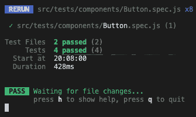
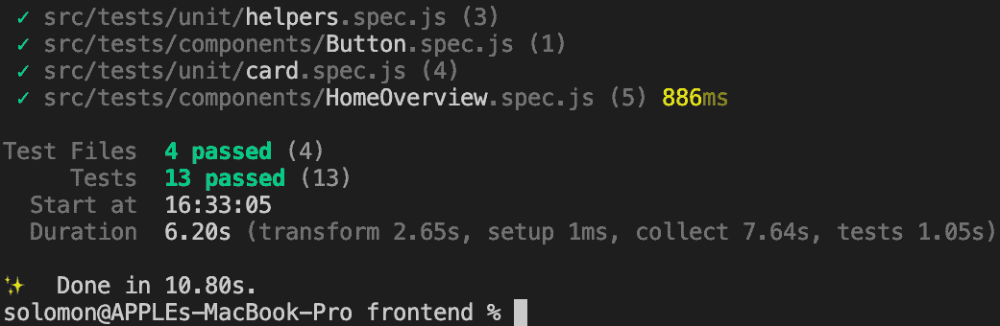

# 10

# Vue.js 3 中的集成测试

在上一章中，我们学习了与单元测试相关的所有内容。我们学习了如何对 Vue.js 3 组件及其组件和页面的方法进行单元测试。我们还学习了单元测试工具，如 Jest 和 Mocha，并使用它们有效地对企业的项目进行单元测试。

在本章中，我们将探讨与集成测试相关的所有内容。我们将深入了解如何在 Vue.js 3 组件和页面上执行集成测试。我们还将了解集成测试工具，如 Vue Test Library ([`github.com/testing-library/vue-testing-library`](https://github.com/testing-library/vue-testing-library))，以及如何有效地使用它们来测试企业项目。

在本章中，我们将涵盖以下关键主题：

+   集成测试简介

+   什么是集成测试？

+   集成测试的重要性

+   集成测试的好处

+   创建集成测试的最佳实践

+   JavaScript 集成测试

+   测试基本的 Vue 应用

# 技术要求

要开始本章的学习，我建议您阅读*第九章*，*单元测试的最佳实践*，其中我们探讨了编写和执行有效的单元测试策略的好处、重要性和最佳实践。我们将在这个章节中大量依赖从那一章中获得的知识，来学习 Vue 3 企业集成测试。

本章的所有代码文件都可以在[`github.com/PacktPublishing/Architecting-Vue.js-3-Enterprise-Ready-Web-Applications/tree/chapter-10`](https://github.com/PacktPublishing/Architecting-Vue.js-3-Enterprise-Ready-Web-Applications/tree/chapter-10)找到。

# 集成测试简介

团队中的工程师在开发过程中独立开发应用程序，并在开发过程中对每个单元进行开发和单元测试后，软件测试阶段的下一阶段是集成测试。这种测试形式涉及在模块/组件组合/集成时测试它们，以确保它们符合要求。

它是一种测试类型，其中软件模块的单元逻辑上集成并作为一个整体进行完全测试。

在本节中，我们将检查集成测试的定义，并探讨开发者在他们的企业级 Vue 3 应用程序中如何创建和管理集成测试用例。

## 什么是集成测试？

集成测试是一种测试类型，其中被测试软件（**SUT**）的不同单元、模块或组件被组合并作为一个单一实体进行测试。此外，这些模块或单元独立于开发人员或团队，可以由不同的程序员编写。

它也被称为组件测试或**集成与测试**（**I&T**）。

集成测试是将单个模块组合成组件或组合实体的第一阶段，其目的是测试模块之间的接口，以暴露在组件集成和交互时可能出现的任何缺陷。

在下一节中，我们将探讨集成测试对敏捷和企业管理团队的重要性及好处。

## 集成测试的重要性

集成测试是软件测试过程中的一个关键阶段。它是测试系统不同组件或模块之间交互和接口的过程。它有几个重要原因：

+   它有助于确保不同的系统组件能够无缝且按预期协同工作

+   它有助于识别和解决不同系统组件之间的冲突

+   它有助于识别和解决在单元测试中可能未发现的错误

+   它有助于识别和解决在单元测试中可能未被发现的表现瓶颈

+   它有助于确保系统可以处理预期的负载和使用模式

+   它有助于确保系统安全并能保护敏感数据

+   它有助于确保系统可以与其他系统或外部组件集成

+   它有助于确保系统满足设计阶段定义的要求和规范

+   它有助于识别和解决不同系统组件之间数据流和数据完整性的问题

+   它可以帮助识别和解决不同系统组件之间**用户界面**（**UIs**）和用户交互的问题

+   它可以帮助识别和解决系统可能需要交互的第三方 API 和服务的问题

+   它可以帮助确保系统可以处理不同的环境和配置，例如不同的操作系统或不同的硬件配置

+   它可以帮助确保系统与其可能需要交互的其他系统兼容，例如数据库或外部服务

总体而言，集成测试是软件开发过程中的一个关键步骤，有助于确保最终产品的质量和可靠性。在开发早期进行集成测试很重要，以便尽快识别和解决问题。

还需要注意的是，集成测试不仅限于测试系统不同组件之间的交互。它还包括测试系统作为一个整体与其他将与之集成的外部系统。在将系统投入生产之前测试其与其他系统的集成是一个好的实践。

在下一节中，我们将探讨集成测试的一些好处。

## 集成测试的好处

集成测试对于企业软件系统尤为重要，因为它们通常是复杂、多方面的系统，需要与其他系统集成并处理大量数据和交易。集成测试对企业软件的一些益处包括以下内容。

### 提高系统可靠性

通过测试系统不同组件之间的交互和接口，集成测试有助于确保系统可靠，并能处理预期的负载和使用模式。这有助于减少停机时间并提高系统的整体性能。

### 降低数据丢失风险

企业系统通常处理大量敏感数据，集成测试有助于确保数据得到适当保护，并在不同系统组件之间保持数据完整性。

### 提高可扩展性

集成测试有助于识别和解决单元测试期间可能未被发现的表现瓶颈，使得根据需要扩展系统变得更加容易。

### 提高安全性

集成测试有助于确保系统安全并能保护敏感数据，降低数据泄露和其他安全事件的风险。

### 更好地与其他系统集成

在系统发布到生产之前对其进行与其他系统的集成测试，可以帮助确保系统兼容，并能与其他系统进行通信，这些系统可能是它需要交互的。

### 更好的合规性

通过进行集成测试，你可以确保系统满足设计阶段定义的要求和规范，这有助于确保符合行业标准法规。

### 更好的客户满意度和 ROI

通过确保系统可靠、安全且易于使用，集成测试有助于提高客户满意度和增加系统采用率。确保所有系统组件无缝且无错误地工作，有助于降低开发成本，提高系统性能，并增加系统的整体**投资回报率**（ROI）。

### 提高测试效率

集成测试可以在开发早期阶段识别问题，这有助于减少测试的整体时间和成本。

### 提高软件质量

通过彻底测试系统不同组件之间的交互和接口，集成测试有助于确保软件质量高且无缺陷。

### 提高团队协作

集成测试通常涉及不同团队之间的协作，如开发、测试和运维团队。这有助于改善团队间的沟通和协作，并确保系统开发和测试满足所有利益相关者的需求。

### 提高文档质量

集成测试过程可以导致更好的测试用例和测试结果记录，这些记录可用于改进系统并供未来参考。

### 改进业务连续性

通过确保系统可靠并能处理预期的负载和用法模式，集成测试可以帮助确保系统在意外事件（如硬件故障或停电）发生时能够继续运行，这有助于提高业务连续性和最小化中断。

### 改进数据治理

通过彻底测试不同系统组件之间的交互和接口，集成测试可以帮助确保数据得到适当保护，并在系统的不同组件之间保持数据完整性，这有助于提高数据治理和符合数据保护法规。

在本节中，我们探讨了集成测试对企业项目的益处以及它是如何改善开发团队工作流程的。在下一节中，我们将了解在集成测试期间应实施的一些最佳实践。

## 创建集成测试的最佳实践

现在让我们看看创建有效集成测试的一些最佳实践。

### 早期开始

集成测试应尽可能早地在开发过程中开始，理想情况下在设计阶段。这将有助于尽早识别和解决问题，并确保系统开发和测试满足所有利益相关者的需求。

### 明确定义目标

在开始集成测试之前，明确测试目标是至关重要的。这包括确定系统应该做什么，系统的接口和交互，以及预期的结果。

### 制定测试计划

制定一个测试计划，概述测试范围、要执行的测试用例以及所需资源和工具。测试计划还应包括测试时间表，包括何时完成测试以及何时审查结果。

### 采用模块化方法

将系统划分为更小、更易于管理的模块，并分别进行测试。这将有助于更快、更有效地识别和解决问题。

### 使用自动化测试

自动化测试可以帮助提高测试效率，并减少测试的时间和成本。自动化测试还可以用于在不同条件下测试系统，如不同的环境和配置。

### 对整个系统进行测试

将系统作为一个整体与其他将与之集成的外部系统进行测试；这将确保系统兼容，并能与其他可能需要交互的系统进行通信。

### 测试安全漏洞

测试系统是否存在安全漏洞，如 SQL 注入或跨站脚本攻击。这将有助于确保系统安全并保护敏感数据。

### 测试性能瓶颈

测试系统以发现性能瓶颈，并识别和解决可能出现的任何问题。这将有助于确保系统可以处理预期的负载和用法模式。

### 记录和审查结果

记录测试结果，包括识别出的问题及其解决方法。审查结果并利用它们来改进系统和测试过程。

### 持续测试和监控

在系统发布到生产后，持续测试和监控系统；这将有助于确保系统的可靠性，并快速识别和解决任何问题。

在本节中，我们探讨了在企业中使用集成测试时应实施的最佳实践。在下一节中，我们将学习如何在演示项目中使用 JavaScript 实现集成测试。

## JavaScript 集成测试

有几种工具可以用于在 JavaScript 中执行集成测试。以下是一些流行的选择。

### Mocha

Mocha 是一个广泛使用的 JavaScript 测试框架，非常适合集成测试。它高度可定制，可以与其他库一起使用，例如 Chai 和 Sinon，以执行各种类型的测试。

### Cypress

Cypress 是一个基于 JavaScript 的端到端测试框架，可用于集成测试。它允许开发者从用户的角度测试应用程序的整个流程，并具有内置的实时调试、自动等待和时间旅行支持。

### TestCafe

TestCafe 是一个运行在 Node.js 之上的端到端测试工具。它允许您在真实浏览器中运行测试，易于设置和使用。它还提供了测试应用程序 UI 的能力，这在集成测试中非常有用。

### Selenium

Selenium 是一个浏览器自动化工具，可用于 Web 应用程序的集成测试。Selenium WebDriver 允许您与网络浏览器交互并执行诸如点击按钮、填写表单和浏览页面等任务。

### Vue Test Utils

Vue Test Utils 是 Vue.js 团队提供的官方测试库。它是一个轻量级的库，提供了一组用于测试 Vue 组件的实用工具。它可以与其他测试框架一起使用，例如 Jest 或 Mocha，以执行集成测试。

### Avoriaz

Avoriaz 是一个专门为 Vue.js 组件设计的测试库。它提供了一套用于测试 Vue 组件的工具，并允许您在测试环境中轻松挂载和交互您的组件。

### Vue Testing Library

这是一个为测试 Vue 3 应用程序而构建的库。它提供了一套用于测试 Vue 3 组件的实用工具，并允许您在测试环境中轻松挂载和交互您的组件。

### Nightwatch

Nightwatch 是一个用于 Web 应用程序和网站的自动化测试框架。它可以用于 Vue 3 应用程序的集成测试，并允许您编写模拟用户与应用程序交互的集成测试。

与任何其他工具一样，您可以选择最适合您需求和应用程序结构的工具。请记住，某些工具可能更适合某些类型的测试或某些类型的应用程序。

这些是一些最受欢迎的工具；您可以根据您的需求和要测试的内容选择使用任何一种。

还需要注意的是，这些工具中的大多数都可以与其他库和框架集成，以扩展其功能。

在下一节中，我们将探讨如何使用 JavaScript 编写集成测试，以及如何手动运行测试。我们还将探讨如何在部署管道中自动化测试套件。

# 测试基本的 Vue 应用

在上一章中，我们使用 Strapi 作为后端和 Vue 3 作为前端创建了一个 Pinterest 应用程序。

此外，我们还添加了国际化，结构化了项目，实现了单元和集成测试，并构建了一个完整的 Pinterest 克隆。在本节中，我们将继续使用为本书创建的官方项目来设置集成测试，以构建一个完整的、企业级就绪的 Pinterest 克隆应用程序。

您可以从*技术要求*部分提到的 GitHub 链接克隆项目。

在本章中，我们将探讨在本书中使用的 Pinterest 克隆应用程序中实现集成测试的更高级方法。

## 编写基本集成测试

首先，我们将开始安装新的 Vue 3 测试库。由于我们在项目中使用 Vite，我们还将安装 Vitest 库作为我们的测试运行器。您可以在[`vitest.dev/guide/`](https://vitest.dev/guide/)上了解更多关于新 Vue 3 测试库的信息。

### 安装测试库

到本文写作时，`@testing-library/vue` ([`github.com/testing-library/vue-testing-library`](https://github.com/testing-library/vue-testing-library)) 和 `vitest` ([`vitest.dev/guide/`](https://vitest.dev/guide/)) 被推荐用于集成测试，我们将使用以下命令安装测试库：

```js
npm install -D vitest happy-dom @testing-library/vue
```

接下来，打开您的 `vite.config.js` 文件并添加以下配置。请注意，`happy-dom` 是一个没有图形 UI 的 Web 浏览器的 JavaScript 实现：

```js
import { defineConfig } from 'vite';
import vue from '@vitejs/plugin-vue';
// https://vitejs.dev/config/
export default defineConfig({
 plugins: [vue()],
 test: {
   environment: 'happy-dom',
   globals: true,
 },
});
```

在前面的代码中，我们配置了测试库以适应使用 Vite 库进行的单元和集成测试。这意味着如果我们想运行单元和集成测试，我们只需要使用一个命令，就像运行测试时所示。

接下来，让我们创建一个简单的集成测试。

### 创建基本组件测试

这里有一个简单的集成测试代码片段来演示。这是一个通用的集成测试示例，用于测试 Pinterest 演示应用内部的`Button`组件：

```js
import { render } from '@testing-library/vue';
import Button from '../../components/atoms/Button.vue';
test('mounted a button with custom label', async () => {
 // The render method returns a collection of utilities to
 // query your component.
 const { getByText } = render(Button, {
   props: {
     label: 'Test',
   },
 });
 // getByText returns the first matching node for the
 // provided text, and  if button is rendered with Label from
 // props
 const button = getByText('Test');
});
```

测试简单地渲染带有自定义标签值的`Button`，并检查我们是否可以在渲染过程中检索添加的自定义标签。

### 运行测试

运行测试将导致四个通过测试案例，包括我们之前创建的单元测试。以下是运行此测试样本的命令：

```js
```bash

yarn test

```js
```



图 10.1 – 一般测试结果的截图

在本节中，我们展示了如何使用 Vue 3 和最新的 Vitest 测试库配置和构建集成测试，也称为组件测试。我们还编写了基本的组件测试，以帮助我们理解编写集成测试的过程。在下一节中，我们将探索使用 Vue 3 和 Vitest 测试集成组件。

# 测试集成组件

在前面的示例中，我们测试了一个简单的`Button`组件，以确保它以所需的属性正确渲染。在本节中，我们将测试一个完全集成的组件，该组件结合了不同的单个组件。让我们按照以下步骤开始：

1.  在`tests/components`目录下创建一个名为`HomeOverivew.vue`的文件，因为我们想测试主页的集成。

1.  打开文件并添加以下测试代码，或者使用*技术要求*部分中提到的 GitHub 链接克隆仓库：

    ```js
    import { fireEvent, render } from "@testing-library/vue";
    import { describe, expect, it } from "vitest";
    import HomeOverview from "../../components/templates/HomeOverview.vue";
    describe("HomeOverview.vue", () => {
     it("renders component", async () => {
       const { getByText } = render(HomeOverview);
       getByText("Home");
     });
     it("creates pin on button click", async () => {
       const { getByTestId, emitted } =
         render(HomeOverview);
          await fireEvent.click(getByTestId("create"));
          // Fireevent is from "@testing-library/vue" for
          // calling different events such as click
       expect(emitted()).toHaveProperty("click");
     });
     it("dismisses notification", async () => {
       const { getByTestId, emitted } =
         render(HomeOverview);
       await fireEvent.click(getByTestId("dismissed"));
       expect(emitted()).toHaveProperty("click");
     });
     it("displays first 14 pins", async () => {
       const { getAllByText } = render(HomeOverview);
       const card = getAllByText("Quick save and organize
                                  later");
       expect(card.length).toBe(14);
     });
     it("renders Search component", async () => {
       const { getByTestId } = render(HomeOverview);
       getByTestId("search");
     });
    });
    ```

在每个测试案例中，我们正在测试添加到`HomeOverview`组件中的组件，以展示我们如何使用集成测试来测试集成组件作为一个整体。

1.  接下来，确保在测试其他测试案例之前，`HomeOverivew`页面已经正确渲染：

    ```js
    it("renders component", async () => {
       const { getByText } = render(HomeOverview);
       getByText("Home");
     });
    ```

1.  接下来，测试`Button`组件是否正确渲染，并检查我们是否可以对其进行一些操作。例如，当按钮被点击时，应用应该创建一个新的带有照片的 pin。我们将测试确保即使在集成之后，此功能也正确实现：

    ```js
     it("creates pin on button click", async () => {
       const { getByTestId, emitted } =
         render(HomeOverview);
       await fireEvent.click(getByTestId("create"));
       expect(emitted()).toHaveProperty("click");
     });
    ```

1.  接下来，测试`Header`组件内部的`通知显示`组件。我们正在测试它以确保用户可以取消通知，并且它也在`Header`组件和`HomeOverview`组件内部正确渲染：

    ```js
    it("dismisses notification", async () => {
       const { getByTestId, emitted } =
         render(HomeOverview);
       await fireEvent.click(getByTestId("dismissed"));
       expect(emitted()).toHaveProperty("click");
     });
    ```

1.  接下来，也测试`Card`组件以确保它在主页上显示 pin 的总数，并且正确渲染组件：

    ```js
    it("displays first 14 pins", async () => {
       const { getAllByText } = render(HomeOverview);
       const card = getAllByText("Quick save and organize
                                  later");
       expect(card.length).toBe(14);
     });
    ```

1.  最后，我们将测试`Search`组件以确保它已正确渲染供用户使用，并且用户可以使用它来搜索 pins：

    ```js
    it("renders Search component", async () => {
       const { getByTestId } = render(HomeOverview);
       getByTestId("search");
     });
    ```

1.  现在，让我们在根终端中运行以下命令来运行测试：

    ```js
    ```bash

    yarn test:component

    ```js
    ```

在成功运行测试后，你应该会看到绿色的通过测试结果，如下面的截图所示：



图 10.2 – 集成测试结果的截图

所有这些测试用例都成功后，我们可以轻松地看到集成测试如何帮助开发者测试集成和组合的组件，而不是单独测试这些组件。

# 摘要

本章探讨了与集成测试相关的所有内容。你还学习了集成测试工具，如 Cypress、Mocha 和 Vue Testing Library，并使用 Vue Testing Library 有效地测试了企业项目。

在本章中，我们探讨了编写和执行有效的集成测试策略的好处、重要性和最佳实践。此外，你还学习了如何编写集成测试用例。

在下一章中，你将了解与端到端测试相关的所有内容。你将深入了解如何在 Vue.js 3 组件和页面上执行端到端测试。此外，你还将了解端到端测试工具，如 Cypress 和 Puppeteer，以及如何使用它们从端到端有效地测试企业项目。
