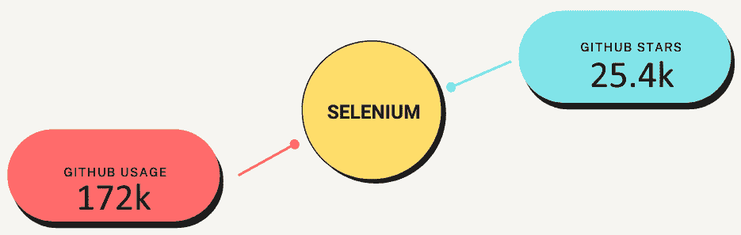
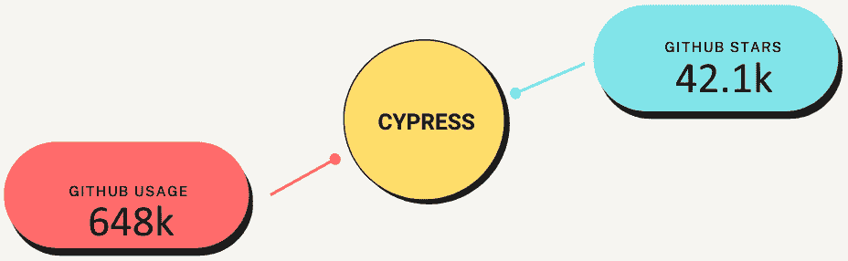
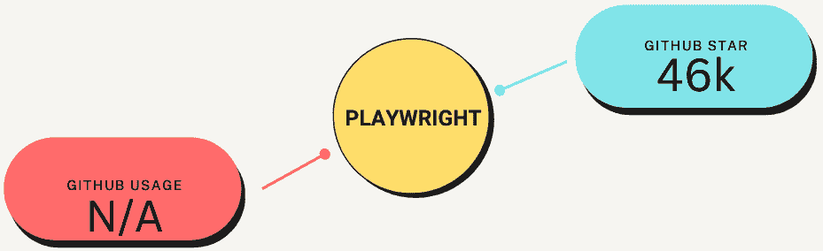
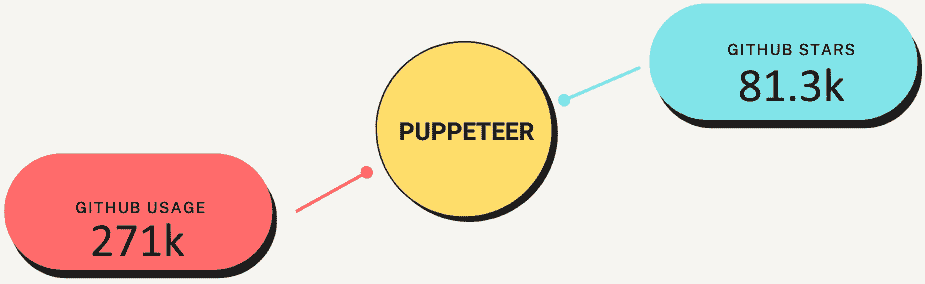
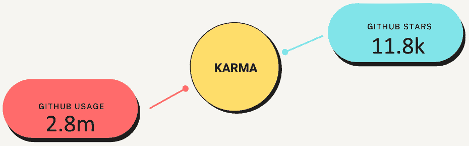
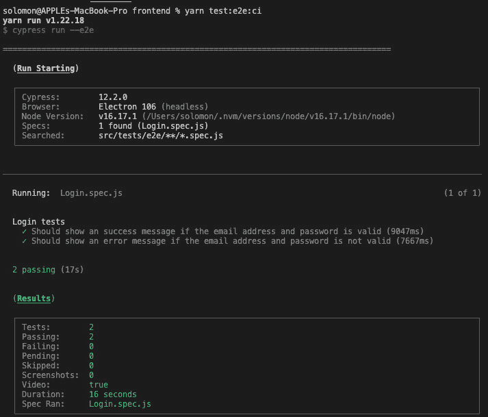

# 11

# 行业标准的端到端测试

在上一章中，我们学习了与**集成测试**相关的所有内容。我们深入了解了如何在 Vue.js 3 组件和页面上执行集成测试。此外，我们还学习了集成测试工具，如 Vue Test Library，以及如何有效地使用它们来测试企业级项目。

本章我们将探讨与**端到端测试**（**E2E**）相关的所有内容。我们将学习如何在 Vue.js 3 组件和页面上执行 E2E 测试。此外，我们还将学习 E2E 测试工具，如 Cypress 和 Puppeteer，以及如何有效地使用它们在企业项目中执行 E2E 测试。

本章我们将涵盖以下关键主题：

+   E2E 测试简介

+   什么是 E2E 测试？

+   E2E 测试的重要性

+   E2E 测试的好处

+   创建 E2E 测试的最佳实践

+   JavaScript E2E 测试

+   对 Vue 应用进行 E2E 测试

# 技术要求

要开始本章的学习，我建议您阅读*第十章*，*Vue.js 3 中的集成测试*，其中我们探讨了与集成测试相关的所有内容。我们还深入了解了如何在 Vue.js 3 组件和页面上执行集成测试。在本章中，我们将大量依赖该章节的知识来学习 Vue.js 3 企业级 E2E 测试。

本章所有代码文件均可在[`github.com/PacktPublishing/Architecting-Vue.js-3-Enterprise-Ready-Web-Applications/tree/chapter-11`](https://github.com/PacktPublishing/Architecting-Vue.js-3-Enterprise-Ready-Web-Applications/tree/chapter-11)找到。

# E2E 测试简介

E2E 是一个从开始到结束评估复杂应用程序工作顺序的复杂测试过程。此外，您可以使用 E2E 测试来按照您希望最终用户使用产品的确切方式工作，并在将代码推送到真实用户之前发现任何错误。

在大多数组织中，E2E 测试是在与团队中不同开发者独立开发后，用于访问应用程序完整功能的标准。

通过拥有一个用于构建和组合代码库的中心存储库系统，在大团队中进行 E2E 测试是可能的。接下来，E2E 测试将运行通过完成的功能，确保它们按预期工作，然后在批准并推送到生产阶段之前。

在本节中，我们将探讨 E2E 测试的定义，并探讨开发者在企业级 Vue.js 3 应用程序中如何创建和管理 E2E 测试用例。

# 什么是 E2E 测试？

E2E 测试是一种评估复杂产品从开始到结束的工作顺序的方法。它确保应用程序按预期行为，并且数据在每个任务和过程中都保持并按照预期方向流动。

这种测试旨在复制真实用户场景，以验证系统的集成和数据完整性。测试将遍历应用程序可以执行的所有操作，包括与外部设备的通信，以确保最终用户的行为得到复制和测试。

在下一节中，我们将探讨 E2E 测试对敏捷和企业管理团队的重要性和好处。

## E2E 测试的重要性

E2E 测试使得在软件发布给最终用户之前捕捉问题变得更加简单。此外，它通过确定工作流程对最终用户的重要性，帮助管理者优先处理开发待办事项。

此外，对于企业级应用程序，E2E 测试通过提高多个应用程序接口（如 Web、桌面和移动应用）的用户体验，因为用户期望是测试用例的基础。

E2E 测试已被广泛采用，因为它通过减少测试软件所需的时间来帮助降低构建和维护软件的整体成本。

它通过添加比单元测试和功能测试等其他测试方法更详细的测试用例，帮助团队扩展其测试覆盖率。

它通过基于最终用户行为的测试用例运行，确保应用程序能够正确执行。

## E2E 测试的好处

E2E 测试是一种非常复杂的测试形式，因为它测试了最终用户的行为。因此，遵循以下小节中概述的实践至关重要，以确保测试顺利。

### 降低风险

E2E 测试过程确保在每个迭代结束时对测试软件进行严格的测试，从而降低了生产中未来失败的风险。

### 一致的用户体验

E2E 测试涉及前端测试。它确保测试软件在多个设备、平台和环境上提供一致的用户体验。

### 降低成本和时间

通过自动化 E2E 测试，可以减少测试企业应用程序的成本和时间，从而减少维护和改进应用程序所需的时间和金钱。

### 增加信心

E2E 测试不仅确保应用程序正确运行，而且因为它在多个设备和平台上进行了测试，所以增加了对其性能的信心。

### 减少重复工作

它减少了频繁故障的可能性，并最终由于更彻底和严格的 E2E 测试，减少了重复测试的努力。

### 确保应用程序的正确性

E2E 是一种基本的软件测试方法，因为它在所有层——数据、业务规则、集成和展示——上验证应用程序。因此，它有助于确保应用程序的正确性和健康。

在本节中，我们讨论了 E2E 测试的重要性和好处，说明了为什么公司需要将其集成到他们的开发流程中。在下一节中，我们将探索创建 E2E 测试的最佳实践。

## E2E 测试的最佳实践

E2E 测试模仿了真实用户使用应用程序的动作、活动和体验。在创建 E2E 测试用例时，你应该遵循以下最佳实践，以产生一致的 E2E 测试用例，正确测试每个可能的案例。考虑以下要点来创建良好的测试用例。

### 优先考虑最终用户

在创建测试用例时，要像用户一样测试，并进入一个首次使用该应用的心态。此外，询问并回答一些用户的问题，例如*是否容易找到所有选项？功能是否已标记？用户能否在* *更少的步骤中获取他们想要的东西？*

### 优先考虑正确的方面

优先考虑你要测试的内容非常重要，因为这很容易变得繁琐和复杂。因此，在处理其他不那么重要的边缘情况之前，优先考虑受业务影响的特性是很重要的。

### 使测试更真实

有时，你希望使 E2E 测试更加真实。在大多数情况下，真实用户会停下来查看图片，或者暂停并观看一些视频，然后再继续他们的动作。E2E 测试应尽可能多地反映现实生活中的交互。

### 测试重复的用户场景

E2E 测试非常复杂，需要时间来完全测试所有可能的边缘情况。避免测试所有可能的边缘情况，只关注最常见和重要的场景。

### 错误监控

E2E 测试是一个非常复杂的过程，因为它涵盖了整个应用程序的遍历，有时只是新添加的功能。然而，通过确保在 E2E 测试之前解决许多错误，可以减少复杂性。

### 优化测试环境

你可以通过创建一个最佳测试环境来简化测试过程。创建最佳测试环境可以在测试时减少设置，并在进行下一次测试之前清理数据。

我们已经探讨了实施 E2E 测试的最佳实践，并讨论了在构建 E2E 测试解决方案时必须考虑的一些要点。在下一节中，我们将了解有关不同的 JavaScript E2E 测试库的更多信息。

# JavaScript E2E 测试

以下是一些有助于 JavaScript 单元测试的框架：

+   Selenium WebDriver

+   Cypress

+   Playwright

+   Puppeteer

+   Karma

接下来，我们将探索每个库，讨论它们的流行度、相似之处和不同之处，并探讨为什么你应该选择这些库中的任何一个来作为你的 E2E 测试解决方案。

## Selenium WebDriver

Selenium WebDriver 是最受欢迎的端到端测试软件。它是一个允许你通过自动化基于 Web 的应用程序测试来执行跨浏览器测试的 Web 框架，以验证其是否按预期执行：



图 11.1 – 展示 Selenium 统计的图表

根据 GitHub（[`github.com/seleniumhq/selenium`](https://github.com/seleniumhq/selenium)）在编写时的数据，Selenium 库的一些增长统计数据包括超过 **25.4k GitHub Stars** 和大约 **172k GitHub 使用量**，使 Selenium 成为最受欢迎的测试框架之一。

## Cypress

Cypress 是一个基于 JavaScript 的端到端测试框架，它改变了开发者对待软件测试的方式。它是一个不使用 Selenium 或 WebDriver 的测试框架，这使得它在企业级测试中更快且易于设置。

这个特性使 Cypress 成为测试旨在在浏览器中使用的 JavaScript/TypeScript 库的理想工具，并在你的企业项目中使用它设置自动化测试变得轻而易举：



图 11.2 – 展示 Cypress 统计的图表

根据 GitHub（[`github.com/cypress-io/cypress`](https://github.com/cypress-io/cypress)）在编写时的数据，Cypress 库的一些增长统计数据包括超过 **42.1k GitHub Stars** 和大约 **648k GitHub 使用量**，使 Cypress 成为最受欢迎的测试框架之一。

## Playwright

Playwright 允许现代 Web 应用进行可靠的端到端测试。它支持所有现代渲染引擎，包括 Chromium、Webkit 和 Firefox。此外，它支持 Windows、Linux 和 macOS 的跨平台测试，包括本地、CI、无头或带头的测试。最重要的是，你可以使用移动网页和不同的编程语言进行测试：



图 11.3 – 展示 Playwright 统计的图表

根据 GitHub（[`github.com/microsoft/playwright`](https://github.com/microsoft/playwright)）在编写时的数据，Playwright 库的一些增长统计数据包括超过 **46k GitHub Stars**，使 Playwright 成为最受欢迎的测试框架之一。

## Puppeteer

Puppeteer 是由 Google 开发的 Node.js 库，允许你通过编程方式控制无头 Chrome。你可以自动化你的 Web 应用程序的测试，在浏览器中运行测试，并在你的终端会话中实时查看结果：



图 11.4 – 展示 Puppeteer 统计的图表

根据 GitHub（[`github.com/puppeteer/puppeteer`](https://github.com/puppeteer/puppeteer)）在编写时的数据，Puppeteer 库的一些增长统计数据包括超过 **81.3k GitHub Stars** 和大约 **271k GitHub 使用量**，使 Puppeteer 成为最受欢迎的测试框架之一。

## Karma

Karma 是一个端到端测试框架，它为每个连接的浏览器启动一个 Web 服务器，执行针对测试代码的源代码。结果将显示给开发者，以便查看测试用例是否失败或通过。

Angular 团队创建了 Karma 测试库，以满足他们不断变化的测试需求，使生活更加轻松：



图 11.5 – 显示 Karma 统计的图表

根据 GitHub（[`github.com/karma-runner/karma`](https://github.com/karma-runner/karma)）在撰写本文时的增长统计数据，Karma 库包括超过**11.8k GitHub Stars**和大约**2.8m GitHub Usage**，使 Karma 成为最受欢迎的测试框架之一。

在下一节中，我们将探讨如何使用 JavaScript 编写端到端测试以及如何手动运行测试。此外，我们还将探讨如何在部署管道中自动化测试套件。

# 端到端测试 Vue.js 3 应用

在上一章中，我们使用 Strapi 作为后端和 Vue.js 3 作为前端创建了一个 Pinterest 应用。

在前面的章节中，我们添加了国际化，对项目进行了结构化，实现了单元和集成测试，并构建了一个完整的 Pinterest 克隆应用。在本节中，我们将继续使用为本书创建的官方项目来设置端到端测试，以构建一个完整的、企业级就绪的 Pinterest 克隆应用。

您可以从[`github.com/PacktPublishing/Architecting-Vue.js-3-Enterprise-Ready-Web-Applications`](https://github.com/PacktPublishing/Architecting-Vue.js-3-Enterprise-Ready-Web-Applications)克隆项目并立即开始。

在上一章中，我们使用 Vitest 设置了基本的单元测试，并演示了如何使用辅助文件实现基本的单元测试。

在本节中，我们将探讨在本书中使用的 Pinterest 克隆应用上实现端到端测试的更高级方法。我们将使用 Cypress 进行端到端测试。

## 设置 Cypress

使用之前列出的某些流行测试框架，编写端到端测试比您想象的要简单。在本节 JavaScript 端到端测试教程中，我们将使用 Cypress 框架编写端到端测试用例。

我们将编写一些端到端测试用例，以记录用户登录到我们的 Pinterest 克隆应用，并检查用户详情是否正确，但在那之前，让我们安装和配置 Cypress。

### 安装和配置 Cypress

您可以通过遵循本章内容来设置一个新项目并安装和配置 Cypress。然而，您也可以从官方仓库克隆`第十一章`文件夹来跟随操作。在撰写本文时，以下库需要安装：

```js
```bash

yarn add cypress @cypress/vue @cypress/webpack-dev-server

```js
```

接下来，将以下脚本添加到您的`package.json`文件中：

```js
```bash

"test:e2e": "cypress open --e2e",

"test:e2e:ci": "cypress run --e2e"

```js
```

新的脚本将允许你仅运行端到端测试并查看输出，而无需运行其他测试用例。

最后，在你的项目根目录中创建一个`cypress.config.js`文件，并添加以下配置：

```js
const { defineConfig } = require("cypress");
module.exports = defineConfig({
 component: {},
 env: {
   // HINT: here we read these keys from the .env file,
   // feel free to remove the items that you don't need
   baseUrl: "http://localhost:3000",
   apiUrl: "http://localhost:1337",
   email: "admin@test.com",
   password: "Admin111",
 },
 e2e: {
   supportFolder: false,
   supportFile: false,
   specPattern: "src/tests/e2e/**/*.spec.js",
   // eslint-disable-next-line no-unused-vars
   setupNodeEvents(on, config) {
     // implement node event listeners here
   },
   baseUrl: "http://localhost:3000",
 },
});
```

`env`内部的变量是可选的，并且只包含特定于我的环境变量的变量；你应该更新它以反映你的环境变量。

接下来，我们将配置我们的 E2E 实例以读取特定模式的文件，并将`supportFolder`和`supportFile`设置为`false`，因为我们不希望在这个演示中包含任何支持文件或文件夹。

在下一节中，我们将创建第一个`e2e`测试文件，并使用端到端测试测试我们的登录功能。

## 创建测试文件

要创建测试文件，请在`e2e`测试文件夹内打开或创建一个`Login.spec.js`文件，并添加以下代码：

```js
/* eslint-disable no-under */
const loginFunction = () => {
 cy.visit(`${Cypress.env("baseUrl")}/login`);
};
describe("Login tests", () => {
 beforeEach(() => {
   loginFunction();
   cy.wait(5000);
 });
 it("Should show an success message if the email address
     and password is valid", () => {
   cy.get("#passwordField").type(`${Cypress.env("password")}`);
   cy.get("#emailField").type(`${Cypress.env("email")}`);
   cy.get("#loginForm").then(() => {
     cy.get("#submitButton").click();
     cy.wait(1000);
     cy.get("#loggedIn").should("be.visible");
   });
 });
 it("Should show an error message if the email address and
     password is not valid", () => {
   cy.get("#emailField").type("test@test.com");
   cy.get("#passwordField").type("test");
   cy.get("#loginForm").then(() => {
     cy.get("#submitButton").click();
     cy.wait(1000);
     cy.get("#failed").should("be.visible");
   });
 });
});
```

**代码分析**：

让我们一起来逐步分析代码，理解其细节：

+   *步骤 1*：在`beforeEach`中加载登录页面：

首先，我们创建一个函数，使用 Cypress 的`visit()`方法在`beforeEach`钩子内部访问我们的登录页面：

```js
const loginFunction = () => {
 cy.visit(`${Cypress.env("baseUrl")}/login`);
};
```

+   *步骤 2*：创建`beforeEach`块：

在`beforeEach`块内部，我们执行`loginFunction`以为每个测试用例打开登录页面：

```js
describe("Login tests", () => {
  beforeEach(() => {
    afterLoginFunction();
    cy.wait(5000);
  });
```

+   *步骤 3*：编写每个测试用例：

最后，我们开始编写每个测试用例，并定义我们期望测试的内容。以下是一个使用端到端测试提交登录表单中的按钮的示例，以模拟用户如何与登录表单交互：

```js
it("Should show a success message if the email address
    and password is valid", () => {
   cy.get("#passwordField").type(`${Cypress.env("password")}`);
   cy.get("#emailField").type(`${Cypress.env("email")}`);
   cy.get("#loginForm").then(() => {
     cy.get("#submitButton").click();
     cy.wait(1000);
     cy.get("#loggedIn").should("be.visible");
   });
 });
```

在编写完所有测试用例后，你可以执行测试。在你运行测试之前，请确保你的开发服务器正在运行。

## 运行测试

要运行测试，请在你的根终端会话中输入以下命令：

```js
```bash

yarn test:e2e

yarn test:e2e:ci

```js
```

第一个命令将使用无头浏览器展示用户如何与你的应用程序交互，而最后一个命令将只显示测试结果，如单元测试。

在测试成功运行后，你应该会看到绿色的通过标志，如下面的截图所示：



图 11.6 – 端到端测试结果的截图

# 概述

本章探讨了与端到端测试（E2E testing）相关的所有内容。我们学习了端到端测试工具，如 Cypress、Karma 和 Selenium，并使用 Cypress 有效地测试了一个企业级项目。

此外，我们还探讨了编写和执行有效的端到端测试策略的好处、重要性和最佳实践。我们还学习了如何编写端到端测试用例。

在下一章中，我们将学习如何将 Vue.js 3 项目部署到 AWS 云。我们将学习部署到 AWS 的最佳实践。此外，我们还将了解企业公司如何部署他们的企业级 Vue 应用程序。

此外，我们还将了解并探索不同的部署选项，并掌握将您的 Vue.js 3 项目部署到各种云提供商的最佳实践。我们将学习如何部署到 AWS 和 Azure。

# 第五部分：部署企业级 Vue.js 3

在本部分，您将学习和探索不同的部署选项，并掌握将您的 Vue.js 3 项目部署到各种云提供商的最佳实践。您将学习如何部署到 AWS 和 Azure。

我们将探索 Nuxt.JS 来构建和交付企业级、服务器端渲染的 Vue.js 3 网络应用程序。我们还将探索 Gridsome 来构建和部署高性能、客户端渲染的 Vue.js 3 应用程序。

在本部分，我们将涵盖以下章节：

+   *第十二章*, [*将 Vue.js 3 部署到云端*](https://epic.packtpub.services/index.php?module=oss_Chapters&action=DetailView&record=88eb0800-c67f-3335-0e01-61d6c97f9301)

+   *第十三章*, [*高级 Vue.js 框架*](https://epic.packtpub.services/index.php?module=oss_Chapters&action=DetailView&record=451c03c4-2abc-f5b6-26ae-61d6c928e87d)
