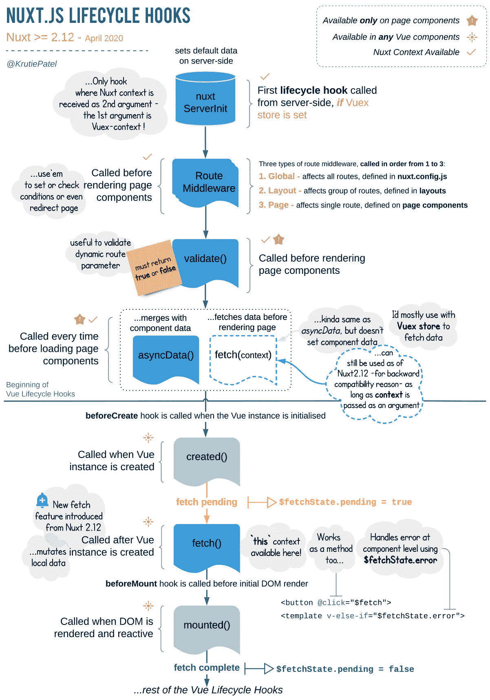
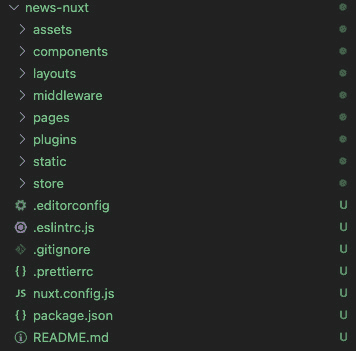
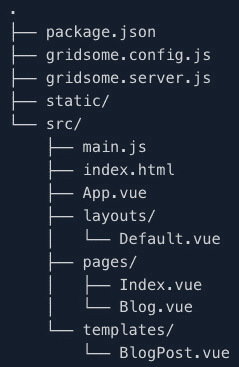

# 第十三章：高级 Vue.js 框架

在上一章中，我们探讨了如何将 Vue.js 3 项目部署到 AWS 云。我们学习了部署到 AWS 的最佳实践。此外，我们还学习了企业公司如何部署他们的企业级 Vue 应用程序。

本章将探讨 Nuxt.js 的 definitive guide。我们将学习 Nuxt.js 的细节以及如何使用 Vue.js 3 构建和交付企业级 SSR 项目。此外，我们还将探索 Gridsome 的 definitive guide，你将学习 Gridsome 的细节以及如何使用 Vue.js 3 构建和交付企业级 CSR 项目。

在本章中，我们将涵盖以下关键主题：

+   Vue 框架简介

+   顶级 Vue 框架

+   理解 Nuxt.js 及其工作原理

+   Nuxt.js 的优势

+   创建 Nuxt.js 应用

+   什么是 Gridsome？

+   Gridsome 用途是什么？

+   Gridsome 是如何工作的？

+   Gridsome 的优势

+   创建 Gridsome 应用

# 技术要求

要开始本章的学习，你应该阅读*第十二章*，*部署企业级 Vue.js 3*，在那里我们学习了如何将 Vue.js 3 项目部署到 AWS 云以及部署到 AWS 的一些最佳实践。此外，我们还探讨了不同的部署选项，并掌握了将我们的 Vue.js 3 项目部署到 AWS 的最佳实践。在本章中，我们将大量依赖该章节的知识来学习更高级的 Vue 框架。

# Vue 框架简介

单个框架不能解决前端工程的所有问题，因为它将变得臃肿且非常难以加载。Vue.js 也不例外；有一些问题并不是完全现成的 Vue.js。此外，它将需要更复杂的配置，并且可能导致将一些功能直接实现到 Vue.js 中会浪费开发时间。

开发者的迫切需求使 Vue.js 成为所有框架的框架。在近年来，Vue.js 框架发布后，我们注意到有相当数量的其他框架是基于 Vue.js 创建的。

这些框架提供不同的选项以满足开发需求，如**服务器端渲染**（**SSR**）、**静态站点生成器**（**SSGs**）、**渐进式网页应用**（**PWAs**）等。

根据其目的和能力，框架可以分为四个不同的组。以下包括以下内容：

+   **Vue.js UI 框架**：这些提供工具来创建现代、响应式的网站

+   **移动框架**：这些有助于构建混合移动网页应用

+   **静态站点框架**：这些生成静态网站

+   **SSR 框架**：这些用于创建 SSR 应用

在本节中，我们将探讨最顶级的 Vue.js 框架，并在本章的后面部分，我们将更详细地探讨前两个框架。

## 顶级 Vue 框架

当开发者创建通用 Vue 应用时，有各种 Vue.js 框架可供利用。让我们在以下小节中探索其中的一些。

### Vue UI 框架

创建一个吸引人且用户友好的 UI 是前端开发的关键部分。如果界面的设计不吸引人或者不易使用，将很难保持一个稳定的用户基础。

在为大型企业产品设计 UI 时，利用提供预制 Vue 组件和元素的 Vue UI 框架是有益的。

Vue 的顶级 UI 组件框架如下：

+   Bootstrap Vue

+   Vuetify

+   Quasar Framework

+   Vue Material

您可以使用此*npm 趋势*链接比较每个框架的流行度：[`npmtrends.com/bootstrap-vue-vs-quasar-vs-vue-material-vs-vuetify`](https://npmtrends.com/bootstrap-vue-vs-quasar-vs-vue-material-vs-vuetify)。

### 移动框架

根据 Monocubed 的说法（[`www.monocubed.com/blog/why-vuejs-gaining-popularity/`](https://www.monocubed.com/blog/why-vuejs-gaining-popularity/)），多年来，Vue.js 在混合和健壮的 Web 应用开发中，包括混合移动开发方面获得了人气。

然而，使用这里列出的某些移动框架以及其他的移动开发库和框架，也可以使用 Vue.js 实现混合和原生移动开发：

+   Vue Native

+   Vux

+   Mint UI

您可以使用此*npm 趋势*链接比较每个框架的流行度：[`npmtrends.com/mint-ui-vs-vue-native-core-vs-vux`](https://npmtrends.com/mint-ui-vs-vue-native-core-vs-vux)。

### 静态网站框架

一个 SSG 使用模板和原始数据来创建静态 HTML 页面。这种方法的优点是网站每次加载的方式相同，内容不会动态变化，这意味着网页不需要分别编码。

以下是一个用于生成静态网站的 Vue 框架列表：

+   Vue Press

+   Gridsome

+   Nuxt.js

此外，值得注意的是，Nuxt.js 可以用来生成静态网站。然而，这并不是 Nuxt.js 的主要焦点。

您可以使用此*npm 趋势*链接比较每个框架的流行度：[`npmtrends.com/gridsome-vs-nuxt-vs-vuepress`](https://npmtrends.com/gridsome-vs-nuxt-vs-vuepress)。

### SSR 框架

根据官方文档（[`vuejs.org/guide/scaling-up/ssr.html#why-ssr`](https://vuejs.org/guide/scaling-up/ssr.html#why-ssr)），SSR 应用具有更好的内容转换速度，更好的 SEO，以及相同的统一语言和声明式组件导向的金属模型，用于开发整个应用程序。

一个在服务器端渲染的 Vye.js 应用程序允许你的应用程序代码在服务器端和客户端上运行，这与仅运行在客户端的 SSGs 形成对比。

以下是一个用于实现 SSRs 的 Vue 框架列表：

+   Nuxt.js

+   Quasar

+   Vite SSR

你可以通过这个 *npm 趋势* 链接比较每个框架的流行度：[`npmtrends.com/nuxt-vs-quasar-vs-vite-ssr`](https://npmtrends.com/nuxt-vs-quasar-vs-vite-ssr)。

在本节中，我们探讨了最顶级的 Vue.js 框架及其不同类别。在下一节中，我们将深入探讨 Nuxt.js 并了解其工作原理。

# 理解 Nuxt.js 及其工作原理

Nuxt.js 是一个基于 Vue.js 的开源框架，为开发者提供了创建前端项目的工具。它旨在使网页开发更加简单和强大，同时也提供了服务器端渲染功能，帮助开发者管理异步数据、中间件和路由的复杂配置：


图 13.1 – 官方 Nuxt.js 标志

Vue.js 应用可以通过一个众所周知的架构来组织，该架构可以用来创建基本或复杂的应用。此外，这种结构有助于提高 Vue.js 应用的开发。

在本节中，我们将了解 Nuxt.js 的不同用例以及为什么你应该考虑切换到 Nuxt.js。

## Nuxt.js 的用途

使用 Nuxt.js，你可以在构建应用类型上无拘无束，Nuxt.js 已被用于开发高性能和 SEO 优化的网站。在接下来的子节中，我们将探讨你可以使用 Nuxt.js 构建的最流行的网站类型。

### 静态生成页面

静态生成页面是不需要任何外部数据源的网站，因为内容已经包含在 HTML 中。Nuxt.js 可以用来创建静态生成页面，如作品集、演示网站或教程页面。

### 单页应用（SPAs）

**单页应用**（SPA）是一种前端开发类型，它从外部源检索数据并在用户的设备上显示。许多流行的 JavaScript 框架，如 React.js、Vue.js 和 Angular，都是 SPA 框架，这并不奇怪。

HTML 5 历史应用程序编程接口（API）和位置哈希被用来创建 SPA 路由系统。这种能力允许开发者在不重新加载整个页面的情况下更改网站的 URL。

### 通用应用

这部分 Nuxt.js 是我最喜欢的，因为我用 Nuxt.js 开发的几乎所有应用都是通用应用。

一个通用应用是一种利用 SSR 在客户端浏览器完全显示页面之前在服务器上获取客户端数据的技巧。

SSR（服务器端渲染）是 Nuxt.js 内置的功能，无需进行繁琐的配置即可激活和启用 Vue.js 中的 SSR。

Nuxt.js 可以解决 Vue.js 中现有的 SSR 问题，这对 SEO 有益，甚至可以扩展以创建一个通用应用程序，允许使用单个代码库为单体应用程序的前端和后端服务。

这些只是你可以使用 Nuxt.js 构建的一些应用程序类别。在下一节中，我们将探讨 Nuxt.js 实际上是如何工作的。

## Nuxt.js 是如何工作的？

根据你的设置，Nuxt.js 可以以两种不同的方式运行。如果你启用了 SSR 或使用通用模式，它将以与服务器端框架相同的方式运行。这意味着每次用户访问你的网站时，请求都会在服务器上处理，并且需要一个服务器来渲染和交付页面。

然而，如果启用了客户端渲染或未激活通用模式，内容和页面将使用 JavaScript 在浏览器中渲染。这种方法具有最快的加载时间，在速度和页面性能方面表现良好。

Nuxt.js 的生命周期提供了框架不同部分的概述，它们的执行顺序以及它们是如何协同工作的。此外，它还描述了构建阶段之后发生的事情，即你的应用程序被打包、分割和压缩。

在 Nuxt.js 中，根据是否启用了 SSR（服务器端渲染），主要使用三种动作和方法：

+   `nuxtServerInit`动作是在服务器端执行的首个钩子，如果启用了 Vuex 存储。它用于填充存储，并且只有在存储已启用时才会被调用。此外，此钩子还可以用于在服务器上的 Vuex 存储中分派其他动作。

+   `validate()`是一个用于验证页面组件动态参数的函数。它在渲染页面组件之前被调用。

+   `AsyncData`和`Fetch`是用于获取数据并在服务器端（`AsyncData`）显示，或者获取数据并在渲染页面之前填充 Vuex 存储的函数（`Fetch`）。

这里是一个快速总结，当你访问 Nuxt.js 网站时你的请求是如何处理的。当 Nuxt.js 收到初始页面访问时，它会调用`nuxtServerInit`动作来更新存储或分派必要的动作，如果你的存储已启用；否则，Nuxt.js 将忽略`nuxtServerInit`并进入下一阶段。

接下来，Nuxt.js 将查找你的`nuxt.config.js`文件以查找任何全局中间件并相应地执行它。执行后，它将移动到布局页面并检查任何中间件以执行，最后，它将执行页面的中间件包括页面子组件。

在按顺序执行中间件之后，它将检查路由并使用`validate()`函数对参数、查询等进行验证。

如果之前已启用，`asyncData`方法随后被用来在服务器端获取和显示数据。之后，使用`fetch`方法在客户端填充 Vuex。

到目前为止，页面应该已经包含了显示适当网页所需的所有数据。以下流程图展示了渲染单个页面所需的所有步骤：



图 13.2 – Nuxt.js 生命周期钩子的概述（来源：https://nuxtjs.org/docs/concepts/nuxt-lifecycle/）

官方 Nuxt.js 生命周期([`nuxtjs.org/docs/concepts/nuxt-lifecycle`](https://nuxtjs.org/docs/concepts/nuxt-lifecycle))页面提供了对 Nuxt.js 如何渲染和处理您的页面（无论是服务器端还是客户端）的更详细概述。

经过对 Nuxt.js 内部运作的了解，现在应该很容易理解。在下一节中，让我们调查一下使用 Nuxt.js 为您即将到来的项目带来的优势。

## Nuxt.js 的优势

Nuxt.js 的优势不容小觑；您可以通过 SSR 的引入和企业级项目的项目结构来轻松发现其中的一些。

然而，在以下小节中，我们将了解 Nuxt.js 框架的一些优势以及为什么它正变得越来越受欢迎，用于构建启用 SSR 的 Vue 项目。

### 轻松创建通用应用

使用 Nuxt.js，您可以非常容易地创建 SSR 应用，无需经历配置 Vue 以支持 SSR 的痛苦过程。SSR 功能已经内置在 Nuxt.js 中，并且非常易于使用。

Nuxt.js 提供了两个重要的属性，称为 `isServer` 和 `isClient`，以确定框架在运行时的状态。当检查您的组件是否应在服务器端或客户端渲染时，这可能很有用。

### 使用静态渲染为您的 Vue 应用带来通用优势

静态生成的网站正日益受到不同框架的青睐，这些框架专注于它们。然而，您可以使用 Nuxt.js 轻松生成静态网站，而无需安装任何额外的框架或工具。

您可以通过使用 `nuxt` `generate` 命令快速创建网站的静态版本，包括 HTML 和路由。

Nuxt.js 允许创建一个强大的通用应用，无需服务器即可利用 SSR 功能，类似于构建静态生成的网站。

### 自动代码拆分

关注速度和性能的前端开发已成为企业软件的基本部分，Nuxt.js 由于其代码拆分功能而以其卓越的性能脱颖而出。

此功能允许为每个路由分配其自己的 JavaScript 文件，该文件仅包含运行该路由所需的代码。这种构建应用程序的方法有助于减少渲染单个页面时需要加载的代码量，从而减少加载时间。

Webpack 内置的配置在为您的网站创建静态网页时启用代码拆分。

### ES6/7 编译

Nuxt.js 默认启用 ES6 和 7，因为 Webpack 和 Babel 已经预构建到其中，用于将最新版本的 JavaScript 转换为旧浏览器可以执行的版本。

Babel 已经配置为将所有的 `.vue` 文件和脚本标签内的 ES6 代码转换为与所有浏览器兼容的 JavaScript。此功能消除了从开始手动设置和配置浏览器兼容性的需求。

在下一节中，我们将探讨如何创建我们的第一个 Nuxt.js 应用程序，以及使用 Nuxt.js 开发企业级应用程序的实用方法。

## 创建 Nuxt.js 应用

本节将向您介绍使用 Nuxt.js 开发应用程序的实用方法。在我们深入之前，让我们探讨一些使用 Nuxt.js 开发企业级应用程序时的一些关键概念。

### 创建 Nuxt 应用

您可以通过不同的方式轻松创建 Nuxt.js 应用程序，但推荐的方式是使用以下任一命令：

```js
Yarn create nuxt-app <project-name>
Or
npm init nuxt-app <project-name>
Or
npx create-nuxt-app <project-name>
```

接下来，进入创建的项目文件夹，使用以下命令提供您新创建的 Nuxt.js 项目：

```js
cd <project-name>
npm run dev
Or
yarn dev
```

重要的是您需要将 `<project-name>` 替换为实际的项目名称。

现在我们已经生成了我们的新 Nuxt.js 项目，让我们探索项目附带的不同文件夹和文件。

### 理解 Nuxt.js 文件夹结构

当您使用前面提到的任何命令创建新项目时，由于包含的文件夹和文件数量众多，可能会感到有些令人畏惧。在本节中，我们将查看一些属于 Nuxt.js 项目的关键文件夹和文件。此外，这些文件和文件夹是必不可少的，并且必须保持不变，无需任何额外配置。以下图显示了 Nuxt.js 的文件夹结构：



图 13.3 – Nuxt.js 文件夹结构的截图

让我们在以下小节中回顾这个文件夹结构。

#### .nuxt

当您启动开发服务器时，`.nuxt` 文件夹将自动创建，并且不可见。这个文件夹也被称为构建目录，包括用于在开发期间提供项目的生成文件和工件。

#### assets

`assets` 目录包含所有原始材料，如图片、CSS、SASS 文档、字体等。Webpack 将在页面创建时编译此文件夹中包含的任何文件。

#### components

这个文件夹类似于 Vue 中的 `components` 文件夹。它是您所有 Vue 组件的仓库。组件是构成您页面各种组件的文件，可以重用并导入到任何页面、布局或组件中。

#### layouts

`layouts` 文件夹是组织应用程序不同页面布局的好地方。它可以用来区分仪表板页面结构和未登录用户的页面结构。这有助于保持应用程序不同部分的有序。

你可以创建不同的结构来对应你应用程序的不同结构，例如不同的侧边栏、菜单、页眉、页脚等。你可以通过 Nuxt.js 布局实现所有这些分离。

#### middleware

中间件可以定义为在页面或一组页面（布局）渲染之前或之后触发的自定义函数。这些中间件函数可以存储在 Nuxt.js 的 `middleware` 文件夹中。

中间件在创建仅限会员或启用身份验证的应用程序时非常重要且方便。你可以用它来限制用户访问某些受保护的页面。

#### plugins

`plugins` 目录是存储所有在初始化根 Vue 应用程序之前想要运行的 JavaScript 代码的地方。这是添加 Vue 插件和注入函数或常量的地方。

你将大量使用这个文件夹来包含 Nuxt.js 作为模块未包含的不同 Vue 插件。

它的工作原理是在 `plugins` 文件夹中创建一个 JavaScript 文件，使用 `Vue.use()` 函数将插件添加到 Vue 实例中，最后将文件添加到 `nuxt.config.js` 文件中的 `plugins` 数组中。

#### static

`static` 目录是一个特殊的目录，包含了你应用程序中所有不太可能被更改或将被 Nuxt.js 或 Webpack 进一步处理显示的静态文件。

位于 `static` 文件夹中的任何文件都将由 Nuxt.js 提供，并且可以通过项目的根 URL 访问。这包括 `favicon`、`robot.txt` 等项目。

#### store

`store` 文件夹包含了你所有的 Vuex store 文档，并且它被自动划分为模块。Vuex store 包含在包中，但必须在 `store` 文件夹中创建一个 `index.js` 文件才能启用并使用。

Nuxt.js 是为了帮助企业级应用程序的开发而设计的，它预装了 Vuex 用于状态管理。这使得创建和管理此类规模的应用程序变得更加容易。

#### pages

`pages` 文件夹非常重要，因为它是 Nuxt.js 路由系统的基石。因此，在更新 Nuxt.js 配置之前，它不能被重命名。Nuxt.js 会自动读取 `pages` 目录下所有的 `.vue` 文件，并为每个页面创建相应的路由。

`pages` 目录包含了你应用程序的所有视图和路由，每个页面组件都是一个常规的 Vue 组件，Nuxt.js 会通过添加特殊属性和函数自动将其转换为路由，以使应用程序的开发变得顺畅和直接。

在下一节中，我们将探讨 Nuxt.js 如何自动将`pages`文件夹中的`.vue`文件转换为路由。

## Nuxt.js 页面和路由系统

Nuxt.js 通过允许用户在`pages`文件夹中创建目录和文件来简化路由过程，这将根据目录结构自动生成一个路由器文件。

例如，如果你在目录中有`posts.vue`文件，它将自动转换为路由，然后你可以在浏览器中访问该路由以查看`Posts`页面的内容。

这种路由系统允许你通过创建文件和文件夹来简单地建立三个不同的路由。让我们更详细地看看这些路由类型。

我们将探讨 Nuxt.js 支持的不同的路由类型，并查看每种路由类型在 Nuxt.js 中的使用方式。

### 基本路由

路由是一个将请求路由或定向到处理它们的代码的过程。这些请求可以以 URL 的形式出现，并被重定向到适当的处理器。这可能是一个简单的过程，因为它不需要额外的配置即可运行。例如，`/about`、`/contact`、`/posts`等。要设置基本路由系统，`pages`目录应按以下方式组织：

```js
pages/
 —| about.vue
 —| contact.vue
 —| posts.vue
```

Nuxt 将自动生成一个类似于以下的路由器文件：

```js
router: {
  routes: [
    {
      name: 'posts',
      path: '/posts',
      component: 'pages/posts.vue'
    },
    {
      name: 'about',
      path: '/about',
      component: 'pages/about'
    },
    {
      name: 'contact',
      path: '/contact',
      component: 'pages/contact'
    },
  ]
}
```

之前的代码片段是由 Nuxt.js 自动生成的，不可编辑，因为所有内容都已根据`pages`目录中的文件夹结构正确路由。

### 嵌套路由

嵌套路由是嵌套在父路由中的路由。这种类型的路由用于创建更详细的多级路由。

使用 Nuxt.js，你可以通过创建父文件夹并将所有路由文件放置在该文件夹中来轻松创建嵌套路由。请看以下文件夹结构：

```js
pages/
 --| dashboard/
 -----| portfolios.vue
 -----| settings.vue
 --| dashboard.vue
 --| posts.vue
 --| contact.vue
 --| index.vue
```

在前面的代码中，我们在之前显示的目录结构中创建了一个与仪表板同名的新的文件和文件夹。之后，我们将`portfolios.vue`和`settings.vue`文件作为子项放置在仪表板文件夹中。

这种简单的文件夹组织结构将创建一个具有以下路由的路由器：

```js
router: {
  routes: [
    {
      name: 'index',
      path: '/',
      component: 'pages/index.vue'
    },
    {
      name: 'posts',
      path: '/posts',
      component: 'pages/posts'
    },
    {
      name: 'contact',
      path: '/contact',
      component: 'pages/contact'
    },
    {
      name: 'dashboard',
      path: '/dashboard',
      component: 'pages/dashboard.vue',
      children: [
        {
          name: 'dashboard-portfolios',
          path: '/dashboard/portfolios',
          component: 'pages/dashboard/portfolios.vue'
        },
        {
          name: 'dashboard-settings',
          path: '/dashboard/settings',
          component: 'pages/dashboard/settings.vue'
        }
      ]
    }
  ]
}
```

在 Vue.js 中，嵌套路由是手动创建的，并在`index.js`路由文件内部注册，当为企业应用程序创建许多路由时，这很容易变得复杂，但使用 Nuxt.js，它变得非常简单且易于创建文件和嵌套文件夹。

### 动态路由

动态路由可以通过未定义的路由名称生成，这可能是由于 API 调用，或者因为你不想不断创建相同的页面。这些路由是从应用程序中的数据中获取的变量（如名称或 ID）生成的。

为了使路由动态化，你必须在 `.vue` 文件或目录名的末尾添加一个下划线。你可以命名文件或目录，但必须包含一个下划线，以便使其动态化。

例如，如果你在 `pages` 目录中定义了一个 `_slug.vue` 文件，你可以使用 `params.slug` 对象访问其值。

在构建博客应用时使用动态路由是有优势的；例如，当用户要选择的阅读的帖子 ID 或 slug 未知时。然而，使用动态路由，可以获取帖子的 ID/slug 并显示相应的帖子。

通过一个示例，我们将演示如何创建一个动态路由：

```js
pages/
--| posts/
-----| _slug.vue
-----| index.vue
--| services.vue
--| contact.vue
--| index.vue
```

在这里，我们在 `slug` 中添加一个下划线，以创建页面的动态路由，以及一个带有字符串参数的父路由及其相应的子路由。这种页面结构将在文件中生成以下路由：

```js
    {
      name: 'index',
      path: '/,
      component: 'pages/index.vue'
    },
    {
      name: 'contact',
      path: '/contact',
      component: 'pages/contact.vue'
    },
    {
      name: 'services',
      path: '/services',
      component: 'pages/services.vue'
    },
    {
      name: 'posts',
      path: '/posts',
      component: 'pages/posts/index.vue',
      children: [
        {
          name: 'posts-slug,
          path: '/posts/:slug,
          component: 'pages/posts/_slug.vue'
        }
      ]
    }
  ]
}
```

现在我们已经探讨了 Nuxt.js 框架内置的不同路由系统，你对 Nuxt.js 的工作原理有了扎实的了解，并可以使用它开始构建企业级通用应用程序。

在下一节中，我们将探索 Gridsome，了解 Gridsome 的细节以及如何使用 Vue.js 3 构建和交付企业级 CSR 项目。

# Gridsome 是什么？

Gridsome 是一个强大的静态网站生成器。它由 Vue.js 驱动，用于构建默认快速生成的网站和应用。它也是一个用于构建网站和应用的 Jamstack 框架，能够提供更好的性能、更高的安全性和更低的扩展成本。

Gridsome 致力于通过预渲染文件并直接从 CDN 提供服务来实现 Jamstack 方法，以构建快速和安全的网站和应用——从而提高应用程序的速度，并消除管理或运行 Web 服务器的需求。

Jamstack 是一种将 Web 体验层从数据和业务逻辑中分离出来的架构方法，提高了灵活性、可伸缩性、性能和可维护性。

## Gridsome 用作什么？

目前，Gridsome 不支持 SSR，但专注于创建更快的网站和应用。在接下来的小节中，我们将探讨你可以使用 Gridsome 构建的最流行的网站类型。

### 静态生成的页面

这些类型的网站不需要任何外部数据源——内容已经嵌入到 HTML 中。你可以使用 Gridsome 创建静态生成的页面，例如作品集、演示网站或教程页面，这些页面可以包含不同的数据源和更高的性能。

### 单页应用（SPAs）

利用外部 API 的动态数据并在客户端显示的开发方法被称为创建单页应用（SPA）。JavaScript 框架的大多数，如 React.js、Vue.js 和 Angular，都是 SPA 框架，这并不令人意外。

HTML 5 历史 API 和位置哈希被用来创建 SPA 路由系统。这种能力允许开发者在不重新加载整个页面的情况下更改网站的 URL。

在下一节中，我们将探讨 Gridsome 的工作原理以及如何使用它来创建一个静态渲染的网站。

## Gridsome 是如何工作的？

Gridsome 是一个 Jamstack 框架；因此，它使用基于客户端 JavaScript、可重用 API 和预构建标记的现代 Web 开发架构。

它通过生成静态、SEO 优化的 HTML 标记来实现，这些标记在浏览器加载后会被转换为动态 DOM。这个简单功能使得 Gridsome 成为构建静态和动态网站的首选 Jamstack 框架。

内部，Gridsome 为你创建的每个页面构建一个 `.html` 文件和一个 `.json` 文件，并在首次页面加载后加载 `.json` 文件以预取和加载下一页的数据。此外，它还为每个页面构建一个 `.js` 包以利用代码拆分。

此外，源插件可以从本地文件或外部 **API** 获取数据，并将其存储在本地数据库中。统一的 GraphQL 数据层允许你从数据库中访问所需的数据，并在你的 Vue 组件中使用它。

以下图表解释了 Gridsome 的内部工作原理以及数据是如何传递和处理的，直到它到达你的 Vue 组件：


图 13.4 – Gridsome 的工作概述（来源：https://gridsome.org/docs/how-it-works/）

运行 Gridsome 有两种方式：

+   `gridsome develop`：此命令启动本地开发服务器并监视更改

+   `gridsome build`：此命令生成生产就绪的静态文件

你可以从官方文档 [`gridsome.org/docs/how-it-works/`](https://gridsome.org/docs/how-it-works/) 中了解更多关于每个命令的工作原理以及它们如何生成这些静态页面。

接下来，让我们看看使用 Gridsome 的一些好处。

## Gridsome 的好处

使用 Gridsome 的好处非常多，这取决于你打算构建的网站和应用类型。对于静态生成的网站，Gridsome 默认注重速度，并且拥有良好的项目结构，适用于构建企业级静态网站和应用。

以下小节描述了使用 Gridsome 的一些好处。

### 无服务器和静态生成

Gridsome 采用 Jamstack 方法构建网站，这提供了更好的性能和更高的安全性，并减少了你的开发栈中的成本和复杂性。Gridsome 使用 Jamstack 哲学生成静态页面和网站，最终产品是一个包含静态 HTML 文件的文件夹，这些文件可以部署到任何地方。

### 易于安装和使用

Gridsome 非常容易安装，并且使用起来简单。它附带了一个 CLI（命令行工具），它可以帮助你轻松创建 Gridsome 项目。

你可以通过运行以下命令来安装 Gridsome：

```js
npm install –global @gridsome/cli
```

一旦 CLI 被安装，你就可以使用它来创建你想要的任意数量的 Gridsome 项目。

### 有序的项目结构

企业项目的一个挑战是项目结构，如前几章所述。Gridsome 通过帮助你使用预测性项目结构来解决这个问题。

我们将在*理解 Gridsome 文件夹结构*部分中介绍构成 Gridsome 项目的关键文件和文件夹。

### 自动路由

自动路由是前端开发行业中的一个非常重要的特性，从 Nuxt 开始，当你向`pages`文件夹添加文件和文件夹时，路由会自动生成。

Gridsome 也通过自动路由功能使得创建路由变得非常简单。每当在`src/pages`文件夹中有新文件或新文件夹时，路由会自动生成。这与之前讨论的 Nuxt 的工作方式类似。

### 代码拆分/预取

通过在 Gridsome 中集成代码拆分和预取，Gridsome 网站的导航变得超级快，因为你在点击之前，任何链接都已经预先获取。

此外，代码拆分功能有助于提高 Gridsome 网站的性能和加载速度，因为它允许用户只加载请求页面上需要的 JavaScript，其他内容按需加载。

### 支持 Markdown 文件

在 Gridsome 中使用 Markdown 是最容易实现内容自动管理的方式。你可以以博客文章、文章或其他任何形式创建内容，这些内容以自己的`.md`（Markdown 扩展名）文件描述。这些 Markdown 文件将被分组并由 Gridsome 消费以生成单独的 HTML 文件。

现在我们已经看到了使用 Gridsome 的好处，接下来我们将看到如何在下一节中创建一个 Gridsome 应用。

## 创建 Gridsome 应用

本节将介绍使用 Gridsome 开发应用程序的实用方法。在我们深入之前，让我们探索一些使用 Gridsome 开发企业级应用程序的关键概念。

### 创建 Gridsome 应用

你可以通过多种方式轻松创建 Gridsome 应用，但推荐的方式是使用以下任意一条命令：

```js
Yarn global add @gridsome/cli
Or
npm install - -global @gridsome/cli
```

接下来，进入创建的 Gridsome 项目，使用以下命令来运行你新创建的 Gridsome 项目：

```js
gridsome create <project-name>
cd <project-name>
gridsome develop
```

重要的是，你需要将`<project-name>`替换为实际的项目名称。

现在我们已经为我们生成了新的 Gridsome 项目，让我们探索项目附带的不同文件夹和文件。

### 理解 Gridsome 文件夹结构

当您使用任何前面的命令创建新项目时，它将附带许多令人眼花缭乱的文件夹和文件。但在这个部分，我们将探索新创建的 Gridsome 项目中的重要文件夹和文件。

此外，一些这些文件和文件夹至关重要，需要某些文件夹名称和文件名保持不变，无需额外配置。以下是 Gridsome 文件夹结构的样子：



图 13.5 – Gridsome 文件夹结构

让我们在以下小节中回顾一些重要的文件夹。

#### pages

`pages`文件夹是 Gridsome 中最重要的文件夹之一，因为它负责自动路由，并且与 Nuxt 的工作方式完全相同，除了每个页面都将生成静态的，并且有自己的`index.html`文件和标记。

在 Gridsome 中创建页面有两种选项：

+   **基于文件的页面**：

当您使用单个文件组件（单个`.vue`文件）创建页面时，您应该使用文件系统。`src/pages`目录中找到的任何单个文件组件都将自动转换为它自己的路由或 URL。文件位置用于生成 URL，您可以在以下示例中看到它：

```js
pages/
 —| about.vue
 —| contact.vue
 —| posts.vue
```

上述页面结构将被转换为以下结构：

```js
`pages/about.vue` becomes `/about`
`pages/contact.vue` becomes `/contact`
`pages/posts.vue` becomes `/posts`
```

接下来，让我们探索 Gridsome 中创建页面的第二种选项，即程序化页面。

+   **程序化页面**：

位于`gridsome.server.js`文件中的`createPages`钩子可以用于生成程序化页面。如果您需要手动从外部 API 创建页面而不使用 Gridsome 内置的 GraphQL 数据层，这将非常有用。

您可以通过实现`createPages`钩子来程序化创建一个页面，如下面的代码块所示：

```js
module.exports = function (api) {
  api.createPages(({ createPage }) => {
    createPage({
      path: '/my-new-page',
      component: './src/templates/MyNewPage.vue'
    })
  })
}
```

您也可以使用之前展示的相同`createPages`钩子来创建动态页面。

#### 模板

Gridsome 使用模板来显示节点或集合的单个页面。当您创建一个模板文件时，Gridsome 会尝试定位一个与集合同名的文件，如果模板配置中没有指定。通常，模板会被映射到集合以显示信息。

下面是一个使用模板从 GraphQL 查询中显示帖子标题的示例：

```js
<!-- src/templates/Post.vue -->
<template>
  <Layout>
    <h1 v-html="$page.post.title" />
  </Layout>
</template>
<page-query>
query ($id: ID!) {
  post(id: $id) {
    title
  }
}
</page-query>
```

模板在 Gridsome 中非常重要，因为它们是数据页面在其自己的 URL 中展示的方式。您可以从[`gridsome.org/docs/templates/`](https://gridsome.org/docs/templates/)的文档中了解更多高级模板用法。

#### 布局

布局是 Vue 组件，用于在页面和模板中包裹内容。您可以使用布局为您的网站创建不同的结构。它的工作方式与 Nuxt.js 中的布局完全相同。

通常，布局在页面中的使用方式如下：

```js
<template>
  <Layout>
    <h1>About us</h1>
  </Layout>
</template>
<script>
import Layout from '~/layouts/Default.vue'
export default {
  components: {
    Layout
  }
}
</script>
```

在 Gridsome 中，布局文件是全局的，在使用之前不需要导入。Gridsome 项目附带更多重要的文件和文件夹，随着你的项目增长，你将很快发现你添加了更多的文件和文件夹。

然而，之前提到的文件夹是重要的文件夹，当你在项目中添加更多文件和文件夹时，它们的名称不应更改。

# 摘要

在本章中，我们探讨了关于 Nuxt.js 的每一个重要细节。你学习了 Nuxt.js 的细节以及如何使用 Vue.js 3 构建和交付企业级 SSR 项目。此外，我们还探讨了 Gridsome，这是一个用于构建静态生成网站的超级快速 Jamstack 框架。

我们还介绍了使用 Nuxt 和 Gridsome 的好处。然后，我们看到了如何使用这两个框架创建一个应用。最后，我们探讨了 Nuxt 和 Gridsome 的文件夹结构。
