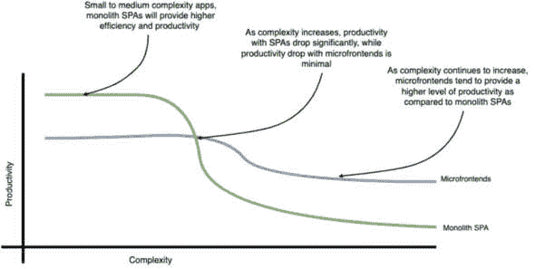
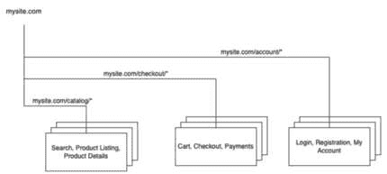
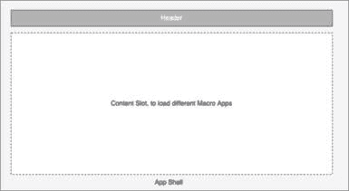
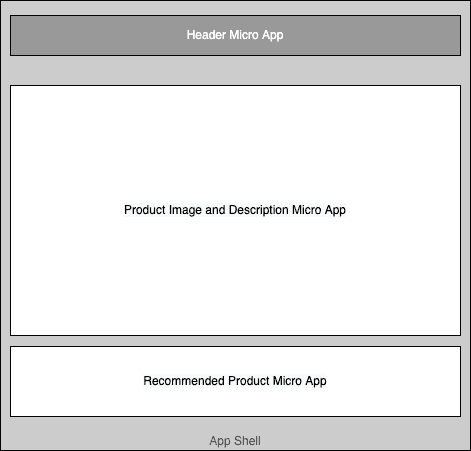

# 1

# 微前端介绍

我们在微前端上又回到了起点！在 Web 1.0 时代，网站主要由 ASP、JSP 或 PHP 构建的单页组成，我们可以对每个单独的页面进行更改，并通过 FTP 上传到服务器，然后立即对消费者可用。然后是 Web 2.0 时代和 Web 应用以及**单页应用**（**SPAs**）的概念，我们编译、转译和部署大型单体应用。现在，我们似乎又回到了处理更小应用和页面的工作方式。

2000 年代初迎来了 Web 2.0 时代和 Web 应用的概念。几年后，JavaScript 框架允许你构建即时更新且每次用户点击链接或按钮时不会重新加载新页面的单页应用（SPAs）。对于小型到中型应用，SPAs 确实很快，但随着团队全力以赴构建大规模的 SPAs，以及应用和团队的成长，开发速度和速度显著下降。由于集中管理的库等原因，团队似乎在争论文件夹结构、状态管理和破坏彼此的代码。这些大型 SPAs 也因为这些应用的大包体积而开始变得性能不佳。更重要的是，解析这些 JavaScript 包所需的高执行时间使得低端设备和手机上的应用更加缓慢。正是在这个时候，开发人员和架构师开始寻找解决这些问题的方案。幸运的是，他们不需要走得太远。

你看，后端团队在几十年前就遇到了与大型后端单体相同的问题，并转向微服务架构模式来解决它们的性能和扩展挑战。现在，前端团队正试图将微服务的相同原则应用于他们的前端应用，这些应用被称为**微前端**。

后端团队走向微服务的过程非常漫长，跨越了多个十年，许多团队仍在为此而努力。然而，得益于许多辩论、讨论、思考、领导和从各种微服务实现中学习到的经验，微服务架构已经达到了一个整体成熟度和共识。

前端团队刚刚开始意识到微前端的概念，关于什么是微前端，存在多种观点，包括实际上微前端是否是一件好事。可能需要几年甚至十年，才能在微前端上达成一些共识。然而，好事是，我们可以从微服务的发展历程中学到很多东西，因为许多微服务的原则和架构模式也适用于微前端。

在本章中，我们将首先了解微前端的需求。我们将涵盖微前端的定义，然后讨论微前端的不同模式。我们还将探讨有助于我们选择设计应用时采用哪种模式的参数。最后，我们将创建我们自己的第一个微前端。

在本章中，我们将涵盖以下主题：

+   定义微前端

+   理解微前端模式

+   选择合适的模式

+   使用微前端实现 Hello World

到本章结束时，您将更好地理解构建微前端最常用的两种模式，以及帮助您决定哪种模式最适合您的指南。

在本章的结尾，我们将构建一个简单的多 SPA 微前端示例，并了解如何在不同的 SPA 之间导航。

# 技术要求

在您浏览本章的代码示例时，您需要以下内容：

+   至少 8 GB RAM 的 PC、Mac 或 Linux 桌面/笔记本电脑（16 GB 更佳）

+   英特尔 i5+芯片组、AMD 或苹果 M1+芯片组

+   至少 256 GB 的空闲硬盘存储空间

您还需要在您的计算机上安装以下软件：

+   Node.js 版本 16+（如果您必须管理不同版本的 Node.js，请使用**nvm**）。

+   终端：一个现代的 shell，例如**zsh**，Mac 上的 iTerm2 配合**oh-my-zsh**（您稍后会感谢我的），或者 Windows 上的 Hyper（[`hyper.is/`](https://hyper.is/)）。

+   集成开发环境（IDE）：我们推荐 VS Code。

+   **npm**、**yarn**或**pnpm**。我们推荐 PNPM，因为它速度快且存储效率高。

+   浏览器：Chrome/Microsoft Edge、Brave 或 Firefox（我使用 Firefox）。

本章的代码文件可以在以下位置找到：[`github.com/PacktPublishing/Building-Micro-Frontends-with-React`](https://github.com/PacktPublishing/Building-Micro-Frontends-with-React)。

# 定义微前端

在本节中，我们将专注于定义微前端及其关键优势，并了解设置微前端所涉及的相关初始投资。

当前接受的微前端定义如下。

“微前端是由可以**独立部署**的微应用组成的，由**独立团队**拥有，这些团队负责交付整个应用中某个特定领域的业务价值”。

这个定义中的关键词是独立部署的，并且由独立团队负责。如果您或您的团队中至少有一个这些术语不适用，那么您可能不需要微前端。一个常规的单页应用（SPA）会更有效率且更富有生产力。正如我们稍后将要看到的，微前端带来了一些初始的复杂性，除非您有一个大型应用，其中应用的部分由个别团队管理，否则可能不值得。

我们注意到，一些正在实施微前端的团队误解了微前端中的“微”部分，并认为除非应用程序被分解到最小级别，否则它不遵循微前端架构。他们将应用程序分解成非常小的应用程序，这增加了许多不必要的复杂性。实际上，这抵消了微前端本应带来的所有优势。

在我们看来，实际上情况正好相反。当将应用程序分解为微应用时，团队应理想地寻找识别最大的可能微应用或微应用，这些微应用可以由敏捷团队独立管理并部署到生产环境中，而不会影响其他微应用。

从这个要点中，关键不是被“微”这个术语所左右，而是要确定可以由单个敏捷团队独立部署的最大应用程序。

在我们深入探讨微前端奇妙世界之前，重要的是要记住，并非每个应用程序都需要是微前端。让我们在下一节中了解更多。

## 理解微前端溢价

*马丁·福勒* 讨论了微服务溢价。这指的是微服务带来了一些开销和复杂性，主要是在初始设置和服务之间的通信渠道方面。马丁接着说，微服务架构的优势只有在规模和复杂性提升器启动时才开始显现。为了理解这一点，让我们看看以下图表：



图 1.1 – 微服务溢价图（来源：[`martinfowler.com/bliki/MicroservicePremium.html`](https://martinfowler.com/bliki/MicroservicePremium.html))

上述图表是应用程序生产力和复杂性的图表，描述了随着复杂性的增长，单体 SPA 和微前端生产力的下降。

对于微前端架构来说，也是如此。将组件的各个部分、路由和模板解耦并将它们委托给不同的系统，对于小型或中型应用程序来说，整个过程可能成为不必要的开销。

微前端的优势只有在项目开始达到*图 1.1*中所示的大小和复杂性阈值时才会显现。

## 探索微前端的优势

微前端架构的所有优势都与规模和范围相关。话虽如此，以下微前端的优势仅适用于由超过 15 人团队构建和支持的应用程序。

在接下来的章节中，我们将了解团队在实施微前端架构时可以期待的好处，所有这些好处都与提高生产力和改善团队成员的开发体验直接相关。

### 更快的开发和部署

单体应用的主要缺点之一是，随着应用和团队规模的扩大，功能开发和部署速度会变得非常缓慢。我们注意到团队花费了更多的时间在一个团队等待另一个团队完成某些工作，然后才能部署应用。在微前端架构中，每个敏捷团队独立工作于他们的微应用，构建和发布功能，无需过多担心其他团队正在做什么。

### 随着应用的增长更容易扩展

微前端架构完全是关于组合更小的微应用，因此随着应用规模的扩大，这只是添加额外的微应用并由敏捷团队负责的问题。

现在，由于每个团队处理的是更小的微应用，团队成员需要花费更少的时间来理解代码库，并且不应该因为担心他们的代码更改会影响其他团队而感到不知所措或担忧。

微前端允许快速扩展，一旦设置了基本微前端框架，敏捷团队就可以并行工作。

### 改进的开发者体验

使用隔离的、独立的微应用，每个团队编译、构建和运行自动化单元测试所需的时间大大减少。这使得团队能够更快地构建和交付功能。

*虽然团队更频繁地为他们的微应用运行隔离的单元和自动化测试，但我们建议在需要时或在提交代码到 Git 之前运行完整的回归测试套件* *进行端到端测试*。

### 渐进式升级

前端生态系统是发展最快的生态系统。每隔几个月，就会出现一个比之前更好的新框架或库。话虽如此，总是有一种冲动想要使用最新的框架重写现有的应用。

对于大型应用来说，没有重写整个应用就难以轻松升级或引入新框架。重写应用的成本以及由于重写而引入错误的关联风险都太高了。团队不断推迟升级，几年后，他们发现自己正在使用过时的框架。

使用微前端，更容易选择一个小型微应用进行升级或重写，然后逐步将其推广到其他微应用。这也使得团队能够体验新变化的好处，并在迁移新框架到其他微应用时学习和纠正方向。

在我们进入下一节之前，让我们快速回顾一下我们迄今为止学到的关键点：

+   微前端适合构建大型应用，其中团队被设置为全栈团队，后端开发者、前端开发者、产品负责人等都在同一个敏捷团队中。

+   微前端有许多好处，如团队独立性、以改进的速度发布的功能和更好的开发者体验。然而，一旦你克服了与“微前端溢价”相关的复杂性的初始阶段，这些好处才会开始显现。

# 理解微前端模式

当谈到微前端时，有太多的解释。微前端还处于早期阶段，没有正确或错误构建它们的方法。对任何技术/架构问题的答案是“这取决于……”。在本节中，我们将关注团队在构建微前端时采用的最常见的两种模式。我们将探讨在决定哪种模式可能适合您时需要考虑的关键因素。我们将通过构建一个真正基本的微前端来结束本节，以推动进展。

在非常高的层面上，微前端有两种主要模式。这两种模式都可以应用于你是在构建**服务器端渲染**（**SSR**）应用还是**客户端渲染**（**CSR**）应用。为了更好地说明这些模式，我们将以亚马逊这样的电子商务应用为例。

在接下来的子节中，我们将探讨这两种模式以及它们之间的区别。

## 多 SPA 模式

我们将要讨论的第一个模式是**多 SPA**模式。正如其名所示，该应用由多个 SPA 构建而成。在这里，应用被分解为 2-3 个独立的 SPA，并且每个应用都在其自己的 URL 上渲染。当用户从一个 SPA 导航到另一个 SPA 时，他们会通过浏览器刷新进行重定向。在电子商务应用的情况下，我们可以将搜索、产品列表和产品详情视为一个 SPA，而购物车和结账作为另一个 SPA。同样，**我的账户**部分，包括登录、注册和资料信息，将形成第三个 SPA。

下图展示了电子商务应用的多 SPA 模式微前端的示意图：



图 1.2 – 电子商务应用的**多 SPA**模式微前端

如前图所示，我们的电子商务应用由三个 SPA 组成：目录 SPA、结账 SPA 和账户 SPA。

在这种模式的简单形式中，每个应用都表现得像一个独立的 SPA，位于其独特的全局 URL 中。

每个 SPA 都部署在独特的全局路由上。例如，目录应用将被部署在类似`mysite.com/catalog/*`的 URL 上，而目录应用内的所有后续二级路由都将作为 SPA 加载到`/catalog/*`路由中。

同样，账户应用将位于全局路由`mysite.com/accounts/`，而账户应用内的不同页面，如登录、注册和资料，将在如下 URL 中可用：`mysite.com/accounts/login`或`mysite.com/accounts/register`。

如前所述，当用户从一个宏应用移动到另一个宏应用时，浏览器中的页面将重新加载。这是因为我们通常使用 HTML `href`标签在应用之间导航。这种浏览器刷新是完全可以接受的。我看到一些团队为了实现单页体验，不遗余力地复杂化他们的架构。然而，事实是用户并不真的关心你的应用是 SPA 还是**多页应用（MPA**）。只要体验快速且流畅，他们就会满意。

有时，浏览器重新加载可能会对你有利，因为它可以减少由于内存泄漏或数据存储中放入过多数据而导致的内存膨胀风险。

然而，如果你真的想实现那种 SPA 体验，那么你可以始终创建一个薄应用壳，它托管全局路由和数据存储，这样每个应用都在这个应用壳内调用。*我们将在接下来的章节中详细介绍这种模式。*

在这种模式中，路由通常分为两部分，全局或主要路由，位于应用壳内，以及次要路由，位于相应的应用内。

下图显示了带有应用壳的多-SPA 模式的示例：



图 1.3 – 带有应用壳的多-SPA 模式以提供 SPA 体验

在这里，你会注意到我们引入了应用壳的概念，它包含了头部组件，不同的单页应用（SPA）在内容槽中加载。这种模式提供了真正的 SPA 体验，因为当从一个 SPA 切换到另一个 SPA 时，头部组件不会刷新。

## 微应用模式

构建微前端的其他模式是我们所说的**微应用模式**。我们之所以称之为微应用模式，是因为这是一种对应用程序更细粒度的分解。

如*图 1**.4*所示，网页由不同的组件组成，每个组件都是一个独立的微应用，它可以独立存在，并且可以作为同一页面的组成部分与其他微应用协同工作。



图 1.4 – 产品图像和推荐产品作为不同微应用共存的微应用架构

你会注意到前面的图是*图 1**.3*的一个更细粒度的版本，其中我们将中央内容槽进一步分解为更小的微应用。注意中央内容区域现在由两个微应用组成，即产品详情和推荐产品微应用。

微应用模式比多-SPA 模式复杂得多，主要推荐用于非常大的 Web 应用，其中多个团队拥有单页上的不同元素。

在*图 1*.4 中，我们假设有一个专门负责管理页面产品描述组件的团队，另一个团队负责管理同一页面的产品推荐组件。

我们还假设这些组件更新以增强功能的频率会有所不同；例如，推荐微应用会不断进行 A/B 测试，因此需要比产品图片和描述微应用更频繁地部署，后者可能不会那么频繁地发生变化。

在这种模式中，所有路由，无论是主要还是次要的，都由应用程序外壳管理。在这里，除了管理路由和全局状态外，应用程序外壳还需要存储/检索每个路由和每个页面中需要加载的不同微应用的页面布局信息。

在大多数情况下，这样的大型应用程序通常已经有一个**内容管理系统**（**CMS**）或模板引擎，其中存储和提供布局和组件树。

总结来说，随着本节的结束，我们看到了构建微前端的两种主要模式：多 SPA 模式和微应用模式。这些模式主要区别在于你分解应用程序的粒度级别，以及如何在微前端架构中管理路由。

在下一节中，我们将探讨有助于您选择正确模式的指南。

# 选择合适的模式

现在我们对微前端这两种模式有了广泛的理解，让我们花些时间来探讨一些关键考虑因素，这将帮助您决定选择哪种模式。

虽然可能存在许多关于什么是正确的、考虑多远未来以及如何使应用程序和架构具有前瞻性的观点，但我们认为有两个主要因素将帮助您决定为您的微前端架构选择哪种模式。让我们在接下来的章节中详细探讨它们。

## 团队构成

对于在微服务和微前端上构建应用程序的团队来说，根据业务功能进行垂直切分是一种常见的做法。在电子商务的例子中，我们可能有一个专注于浏览旅程的团队，另一个专注于结账旅程的团队。如果有一个敏捷团队负责整个浏览器旅程，而另一个敏捷团队负责整个结账旅程，那么建议您采用多 SPA 模式。然而，如果您有多个小型团队，分别拥有业务领域的不同实体，例如，搜索、产品推荐和促销，那么采用微应用模式将是明智的选择。如前所述，一个经验法则是每个敏捷团队理想情况下拥有一个单独的微应用。

## 部署频率

在决定如何拆分你的微前端时，另一个需要考虑的因素是部署的频率。如果应用中有一些部分比其他部分变化更频繁，那么这些部分可以分离成自己的微前端，可以单独部署而不影响应用的其它部分。这减少了需要进行的测试量，因为现在我们只需要测试正在更改的微应用，而不是整个应用。

如我们所见，是否选择多 SPA 模式或微应用模式的决定归结为两个关键因素：团队组成和部署频率，这与微前端定义中的两个关键词直接相关，即独立团队和独立部署。

# 使用微前端技术的 Hello World

好的，现在是时候动手编写一些代码了。我们将从构建一个基本的多个 SPA 模式应用开始。在这个例子中，我们将使用 Next.js，这是目前构建高性能 React 应用最受欢迎的工具。按照以下步骤操作：

注意

在本章的剩余部分，我们假设你正在使用**pnpm**作为包管理器。如果不是，请在相应的命令中将**pnpm**替换为**npm**。

1.  让我们首先为我们的应用创建一个根文件夹。我们将它命名为**my-store**。在你的终端中运行以下命令：

    ```js
    mkdir my-store
    ```

1.  现在，让我们**cd**到**my-store**，并在我们的终端中通过输入以下命令创建我们的两个 Next.js 应用，即**home**和**catalog**：

    ```js
    cd my-storepnpm create-next-app@12
    ```

    或者，我们可以输入以下内容：

    ```js
    cd my-storenpx create-next-app@12
    ```

1.  当提示你添加项目名称时，将其命名为**home**。然后它会经过各种步骤并完成安装。

    create-next-app 的有趣之处在于，即使你定义的版本为@12，它仍然会拉取 Next.js 的最新版本，因此为了确保与本章的其余部分保持一致性，我们将更新 package.json 中 next 的版本如下：

    ```js
     "dependencies": {    "next": "12",
        "react": "18.2.0",
        "react-dom": "18.2.0"
    ```

1.  现在删除**node_modules**文件夹和包锁定文件，并运行 pnpm i 命令

重要提示

虽然你可以始终使用**yarn**或**npx**来运行 CLI，但我们推荐使用**pnpm**，因为它比**npm**或**yarn**快 2-3 倍。

1.  设置完成后，继续创建另一个应用，重复步骤 2-5。让我们把这个项目命名为**catalog**。

    完成后，你的文件夹结构将如下所示：

    ```js
    └── my-store/    ├── home
        └── catalog
    ```

1.  现在，让我们通过输入以下命令来运行**home**应用：

    ```js
    cd homepnpm run dev
    ```

1.  你的应用现在应该在端口**3000**上提供服务。通过在浏览器中访问**http://localhost:3000**来验证。

1.  让我们去掉样板代码并添加简单的导航。找到并打开位于**home/pages/index.js**的文件，并将**<main></main>**标签内的所有内容替换为以下内容：

    ```js
         <main className={styles.main}>       <nav><a href="/">Home</a> | <a href="/catalog">Catalog</a> </nav>
            <h1 className={styles.title}>
              Home:Hello World! 
              </h1>
              <h2>Welcome to my store</h2>
            </main>
    ```

    注意，我们已经添加了基本的导航来在主页和目录页之间导航。现在运行在`localthost:3000`上的你的主页应用应该看起来如下：


图 1.5 – 屏幕截图：带有“主页”和“目录”两个导航链接的主应用

1.  现在，让我们继续讨论目录应用。导航到位于 **/catalog/pages/index.js** 的索引页面，再次，让我们移除样板代码，并将 **<main>** 标签内的内容替换为以下代码：

    ```js
          <main className={styles.main}>        <nav><a href="/">Home</a> | <a href="/catalog">Catalog</a> </nav>
            <h1 className={styles.title}>
                Catalog:Hello World! 
          </h1>
           <h2>List of Products</h2>
          </main>
    ```

    现在，由于我们已经在端口 `3000` 上提供了主页，我们将我们的目录应用运行在端口 `3001` 上。

1.  我们通过在 **catalog/package.json** 文件的 **scripts** 部分中为 **dev** 命令添加端口标志来完成此操作，如下所示：

    ```js
    "scripts": {    "dev": "next dev -p 3001
    …
    }
    ```

1.  现在，在目录应用内部运行 **pnpm run dev** 命令应该会在 **http://localhost:3001** 上运行目录应用。您可以在下面的屏幕截图中看到这一点：


图 1.6 – 在端口 3001 上运行的目录应用屏幕截图

下一步是将这些连接起来，以便当用户访问 `localhost:3000` 时，它将用户导向主页应用，而当用户访问 `localhost:3000/catalog` 时，他们将重定向到目录应用。这是为了确保两个应用都感觉像是同一应用的一部分，尽管它们运行在不同的端口上。

1.  我们通过在 **home/next.config.js** 文件中设置 **rewrites** 规则来完成这项操作，如下所示：

    ```js
    const nextConfig = {  reactStrictMode: true,
      swcMinify: true,
      async rewrites() {
        return [
          {
            source: '/:path*',
            destination: `/:path*`,
          },
          {
            source: '/catalog',
            destination: `http://localhost:3001/catalog`,
          },
          {
            source: '/catalog/:path*',
            destination: `http://localhost:3001/catalog/:path*`,
          },
        ]
      },
    }
    module.exports = nextConfig
    ```

    如前述代码所示，我们只是告诉 Next.js，如果源 URL 是 `/catalog`，则从 `localhost:3001/catalog` 加载应用。

1.  在我们测试之前，需要对目录应用进行另一个小的修改。如您所见，目录应用将在端口 **3001** 的根目录上提供服务，但我们的目标是让它服务在 **:3000/catalog**。这是因为我们之前所做的重写，Next.js 预期目录应用及其资产将在 **/catalog/** 下可用。我们可以通过在 **catalog/next.config.js** 文件中设置 **basePath** 变量来实现这一点，如下所示：

    ```js
    const nextConfig = {  reactStrictMode: true,
      swcMinify: true,
      basePath:'/catalog'
    }
    ```

1.  现在，为了测试这一点是否正常工作，我们将通过导航到主页和目录应用并在两个不同的终端窗口中运行 **pnpm run dev** 命令来启动这两个应用。

1.  在您的浏览器中打开 **http://localhost:3000** 并验证主页应用是否已加载。点击 **目录** 链接并验证目录页面是否在 **http://localhost:3000/catalog** 上加载。请注意，运行在端口 **3001** 上的独立应用目录以一种类似于“代理”的方式加载到父应用/主应用的唯一 URL 中。这是微前端的关键原则之一，其中运行在不同端口和不同位置的应用被“缝合”在一起，使其看起来像是同一应用的一部分。

有了这些，我们就完成了使用多-SPA 模式创建我们的第一个微前端。在接下来的章节中，我们将更详细地探讨微应用模式。这种模式符合构建微前端的大多数用例，并符合微前端的所有关键原则，这些原则我们将在下一章中看到。

# 摘要

本章到此结束。我们首先学习了微前端（当执行正确时）如何帮助团队在应用规模和复杂性增长的同时，以一致的速度继续发布新功能。然后，我们了解到有两种主要的微前端实现模式，即多-SPA 模式和微应用模式。我们看到多-SPA 模式更容易实现，将适合大多数用例。当给定页面的不同元素由不同的敏捷团队拥有时，微应用模式将更为合适。最后，我们学习了如何构建我们自己的微前端应用程序，并看到了我们如何在两个应用程序之间导航，同时仍然给用户一种它们都是单个应用程序一部分的错觉。

在下一章中，我们将探讨在设计微前端架构时必须严格遵守的一些关键原则。我们还将探讨微前端的一些关键组件以及它们可以实现的多种方式。
