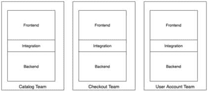

# 2

# 微前端的关键原则和组件

微前端是一把双刃剑。如果做得正确，它们可以为团队带来巨大的快乐和生产力；然而，如果实施不当，它们可能会使事情变得更糟。

话虽如此，在构建微前端架构时，我们需要牢记一些关键原则和考虑因素。

在本章中，我们将探讨微前端架构的关键设计原则以及为什么将它们视为神圣不可侵犯的重要性。我们强调这些原则的原因是，它们为微前端架构奠定了基础。如果团队选择忽视这些原则，他们可能无法从微前端模式中提取所有好处。然后，我们将探讨对任何微前端架构至关重要的关键组件。

在本章中，我们将涵盖以下主题：

+   理解关键原则

+   微前端架构的关键组件

到本章结束时，你将更好地理解团队在设计微前端架构时需要牢记的指导原则和关键考虑因素。

# 理解关键原则

对于所有软件团队来说，制定一套规则和指导原则，让所有团队成员和他们编写的代码都遵守，这一点非常重要。这确保了当团队讨论某些技术方法时，他们可以将其与这些指南进行验证。这反过来又确保了团队可以通过将这些关键指南与结果进行映射来专注于结果，而不是过于沉迷于过程的细微差别。这有助于团队更快地做出决策。

在接下来的章节中，我们将探讨团队在遵循微前端模式时必须遵守的关键原则。

## 领域驱动团队

Meta 的 React 项目负责人 Dan Abramov 曾发推文提问：“*微前端是在解决技术问题还是组织问题？*”

当你这么想的时候，我们今天在软件开发中看到的大部分问题确实源于团队的组织方式。

领域驱动设计（Domain Driven Design）是微服务世界中一个成熟的概念。后端微服务团队通常围绕这些领域模型组织。随着微前端的出现，我们将同样的思维方式扩展到前端世界，通过在这些领域模型内重新组织前端团队，我们现在能够创建垂直切分的团队，其中领域驱动团队能够从端到端拥有业务功能的责任，并且能够独立工作。

为了在微前端方面取得成功，至关重要的是，微应用及其所属团队必须与这些领域模型以及他们旨在提供的业务价值相映射。

让我们快速了解一下领域驱动团队可能的样子：

图 2.1 – 领域驱动团队

上述图示显示了电子商务应用程序的三个领域驱动团队，即**目录团队**、**结账团队**和**用户账户团队**。在每一个团队中，你会看到他们有专门负责前端、后端和集成工程师的团队成员。

## 隔离故障

微前端天生就是“去中心化”设计的。其众多好处之一就是隔离故障，并减少错误的影响范围。单体**单页应用**（**SPAs**）的一个常见问题是，任何一个模块中的一行错误都会阻止整个应用程序编译，或者运行时错误会导致整个页面出错。

当设计微前端架构时，你需要确保如果有一个或多个微前端失败，系统可以优雅地降级服务。

如果一个微前端依赖于另一个微前端来运行，那么我们就违反了微前端的一个关键原则，这个原则应该不惜一切代价避免。

## 独立部署

微前端架构的另一个关键原则是能够独立部署每个应用程序，而无需重新部署其他应用程序。

当部署新应用程序时，它应立即对用户可用，并且不需要重启主机应用程序或服务器以使更改生效。

当不同团队在微前端上工作时，一个有趣的观察是，从架构角度来看，这些微应用可以独立更新，但部署这些微前端的 DevOps 管道被设计为同时部署所有应用程序，从而抵消了独立部署的好处。

确保 DevOps 管道也设计得如此，即当任何应用程序准备好部署时，只有相关的管道运行并部署该应用程序，而不会影响其他应用程序。

这种 DevOps 管道配置错误主要源于存在负责构建管道和生产部署的独立 DevOps 团队的问题。

解决这个问题的最好方法是确保我们有“全生命周期团队”，这些团队负责构建应用程序，同时也负责将其部署到生产环境中。这些团队与 DevOps 团队紧密合作，构建 CI 和 CD 管道，然后接管管理和运行这些管道的控制权。

## 优先考虑运行时集成

在微前端背景下，一个常见的讨论是构建时集成与运行时集成。在构建时集成中，不同的团队将他们的微应用构建并发布到版本控制系统或工件存储库，例如 NPM 或 Nexus。

然后，在构建时间，所有这些微应用被汇集在一起构建一个单一的应用程序包，然后部署到生产环境中。我们强烈反对这种构建时集成的模式，因为它破坏了上述独立部署的原则。这种模式可能适用于你有一个计划发布的版本，每个月发生一次或两次。然而，在这种情况下，你可能更适合使用单体单页应用程序，并且真的不需要处理微前端架构的所有复杂性。

设计微前端架构时，始终优先考虑运行时集成。

您的微应用应该在部署后立即可用，这确保了每个团队可以持续地将他们的微应用部署到生产环境中，而不依赖于其他团队来使他们的应用可用。

在大多数微前端模式中，我们可以利用一个宿主应用程序或外壳应用程序，它跟踪在其中加载的不同微应用，但必须注意确保这个宿主/应用程序外壳是以可扩展性为前提构建的。如果检查微应用新版本的过程消耗了大量的 CPU 或内存资源，那么当你的应用程序扩展时，它将有很大的风险成为单点故障，无论是从微应用还是从它接收到的流量来看。

## 避免陷入“分布式单体”的陷阱

**不要重复自己**（DRY）在微服务/微前端的世界中有稍有不同的含义。大多数开发者将 DRY 与代码重用性联系起来。当与微前端一起工作时，团队可能会过度创建库和实用工具，这些库和实用工具最终被导入并用于每个微应用中。现在，随着每个团队需求的增长，他们开始向这些通用库和实用工具添加功能，希望这对其他团队有益。然而，它造成的问题是现在额外的未使用代码被导入到其他微应用中（虽然摇树优化可以解决这个问题，但在大多数情况下，主要是由于糟糕的编码实践，摇树优化工作得不好，我们最终会在应用程序中导入不必要的代码）。这些共享库的另一个问题是，引入破坏性变化的风险要高得多，一个微应用所做的更改现在会破坏其他微应用。通过过度追求代码重用性，我们最终得到一个通常被称为“分布式单体”的东西，这实际上是两者的最坏之处。

有一些共享库或，如果使用 TypeScript，一个共享的类型/接口文件是可以的，但我们必须避免创建大型通用库。

在微服务/微前端的世界里，DRY（Don’t Repeat Yourself）本质上是指自动化任务，这样你就不必为每个微服务或微应用手动重复步骤。这些可能包括自动化质量门、性能和安全检查作为开发者管道的一部分。

## 技术中立

微前端架构的另一个原则是它应该是技术中立的，这意味着每个微应用“理论上”可以使用不同的框架/语言构建。然而，尽管这是可能的，但这并不意味着团队应该全力以赴，使用 Vue、Angular 或 React 来构建不同的微应用。

有多个原因应该避免这样做：

+   使用多个库/框架意味着向用户设备发送额外的数据负载

+   这使得轮换团队成员变得困难，从一个团队转移到另一个团队意味着需要适应新的框架/库

这一原则的主要目的是允许增量升级，无论是从旧版本到同一库的新版本，还是探索新框架的好处。

## 细粒度扩展

在规划微前端的部署策略时，您必须确保它支持细粒度扩展。通过细粒度扩展，我们的意思是，如果某些页面因营销活动或其他类似原因而获得大量流量，那么仅应扩展服务这些页面的服务器，而其他为微前端其他部分服务的 Pod 可以保持其常规水平。这确保了最佳的云和托管成本。

## 自动化和 DevOps 文化

强大的自动化和 DevOps 文化对于微前端架构的长期成功至关重要。

如您所想象，在微前端中，由于我们将单个应用拆分成更小的应用，与编译应用和运行质量、性能和安全检查等任务相关的所有活动现在都需要为每个应用多次执行。如果我们没有上述所有项目的自动化流程，那么这些应用的总体开发和发布将比单体应用所需的时间长得多。

因此，投入时间和精力构建这些自动化流程非常重要，这些流程通常作为 DevOps 管道的一部分完成。

团队还可以投资于工具和构建代码生成器和微应用模板，这有助于加快新微应用的创建速度。他们还可以在 DevOps 管道中自动运行 linters、安全和其他质量检查。

因此，我们来到了本节的结尾，其中我们看到了团队在设计微前端架构时必须牢记的一些重要原则。

我们看到了诸如领域驱动团队、独立部署和细粒度扩展等原则如何使团队能够持续快速地移动。我们看到了团队应避免陷入分布式单体陷阱，并构建一个使用构建时集成的模式，最后，我们看到了保持架构技术中立并专注于自动化如何帮助架构轻松演进并成为未来证明。

在下一节中，我们将探讨微前端架构的一些重要组件。

# 微前端架构的关键组件

在花时间研究微前端的原则之后，现在让我们来看看微前端架构的一些关键组件。

在本节中，我们将探讨任何微前端架构都需要具备的基本组件，并探讨与它们相关的细微差别。

完成本节后，你将了解构成任何微前端架构的四个基本组件。

## 路由引擎

正如我们在上一章中看到的，根据你打算构建的微前端模式类型，你的应用的路由引擎将与你的应用部分或完全解耦。

我们可以采取多种方法。我们可以使用 NGINX 作为反向代理，并有一个所有主要路由映射到多 SPA 模式中相应应用的列表。如果应用部署在 Kubernetes 集群中，我们可以使用入口路由将主要路由映射到相应应用。我们将在*第八章*“将微前端部署到 Kubernetes”中更详细地介绍这一点，我们将探讨在云中部署这些微前端。

## 全局状态和通信通道

除了路由之外，在设计微前端架构时，还需要很好地设计不同应用之间的通信通道以及全局状态的概念，这些状态可以在不同应用之间共享。

对于单体 SPA，最常用的做法是使用单个全局存储库，如 Redux 或 MobX，其中所有内容都写入该存储库并从中读取。对于微前端，建议避免使用此类全局客户端存储库，而是让每个微应用从后端 API 获取其数据，因为这才是真正的真相来源。

然而，为了避免对后端进行不必要的调用，例如获取`user_id`或购物车数量，确实需要客户端状态管理。对于这些事情，我们可以在应用外壳中使用一个非常薄的全球存储库，或者甚至可以考虑使用`localStorage`或`IndexedDB`来存储需要用于 API 调用的值。

使用微前端模式，建立不同应用之间使用的通用通信通道也变得非常重要。一个典型的用例是在产品页面上点击**添加到购物车**按钮时，页眉中显示的迷你购物车会自动增加。在这种情况下，事件驱动的通信通道效果最佳。

## 源代码版本控制

团队需要达成共识的另一个重要事项是他们计划如何组织他们的 Git 仓库。这里有两种主要的观点——在多仓库或单仓库中组织应用。让我们看看它们的细微差别。

### 多仓库

多代码库（Polyrepos）是指每个多 SPA 或微应用都管理在自己的独立 Git 仓库中。这些仓库最容易开始使用，并且提供了完整的团队独立性。从 DevOps 的角度来看，它们也更容易管理。然而，这种方法有几个缺点。团队之间可能会出现孤岛化，协作减少。另一个缺点是工具（如 DevOps 管道和自动化脚本）的重复和更高的维护成本，这些工具需要在每个仓库中重复和更新。

### 单一代码库

在单一代码库结构中，所有多 SPA 或微应用都位于单个 Git 仓库中，每个应用位于其自己的单独文件夹中。

单一代码库（Monorepos）正开始成为许多前端团队管理代码库的事实上的方法。单一代码库的主要优势是增强了团队协作，因为每个人都能看到其他团队的代码并提供有价值的反馈。工具和自动化脚本可以集中管理，这样一支团队所做的优化可以立即供其他团队跟进。单一代码库的一些缺点包括 DevOps 设置稍微复杂一些。团队还需要设置细粒度的文件夹级权限，以防止团队之间相互覆盖代码。从大局来看，单一代码库提供了更多优势，因此是管理微前端源代码的首选方法。

## 组件库

当构建微前端时，确保用户在浏览不同应用时保持一致的视觉和触感体验至关重要。我们实现这一目标的方式是确保所有应用都使用一个通用的设计系统和组件库。还建议所有团队使用一个通用的主题和样式引擎，以确保所有组件无论在哪个应用中呈现，外观和行为都保持一致。

一种常见的模式是将组件库作为 NPM 模块发布，并将所有其他应用设置为导入和使用它。每次发布组件库的新版本时，团队都需要将各自的应用更新到最新版本。

由于单一代码库的出现，一个新兴的趋势是直接从源代码构建。这意味着组件库存储在单一代码库的`libs`部分，组件直接从库路径链接。这种方法的主要优势是每次团队构建应用时，都会自动接收到组件库的最新版本。

在本节中，我们学习了微前端架构的关键组件，即路由引擎、全局状态和通信通道。我们还看到了多代码库（polyrepo）和单一代码库（monorepo）之间的区别，并了解了为什么前端团队更喜欢使用单一代码库。最后，我们还学习了组件库以及团队从通用库中消费组件的不同方式。

# 摘要

有了这些，我们就结束了第二章的内容。我们以审视我们需要牢记的关键原则开始这一章。我们看到了为什么基于领域模型拆分团队是重要的，以及为什么团队能够独立部署自己的应用是至关重要的。我们还了解了与代码复用相关的误解以及它如何导致分布式单体陷阱。我们还看到了 DevOps 和自动化文化的重要性。最后，我们学习了微前端的核心四个组件。在本章中学到的所有内容，我们将在接下来的章节中付诸实践，因为我们着手构建我们自己的微前端应用程序。

在下一章中，我们将更深入地探讨单仓库与多仓库之间的区别，并了解这更多是关于团队文化而非技术。我们还将从设置我们的代码仓库作为单仓库开始，为未来的工作打下基础。
