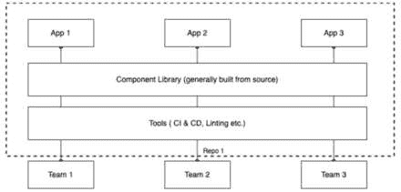
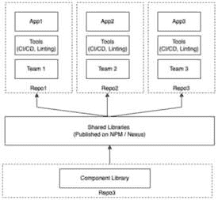
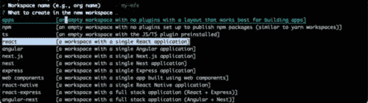
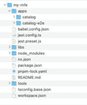
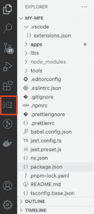
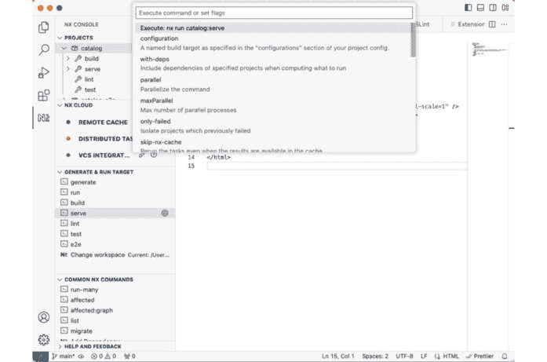
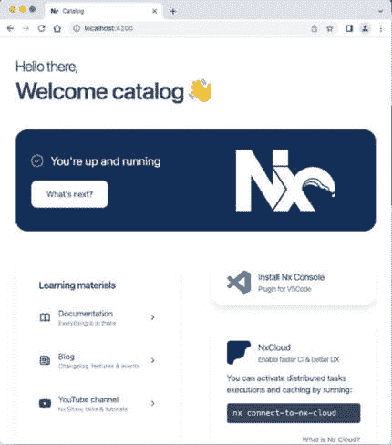

# 第三章：微前端的单仓库与多仓库对比

自从谷歌和 Facebook 的工程师提到他们在组织中有一个单仓库以来，开发者社区——尤其是前端社区——一直在积极参与关于单仓库与多仓库的辩论和讨论。

我们看到越来越多的团队倾向于使用单仓库来维护他们的前端代码。然而，根据社区的看法，您应该在多仓库和单仓库之间做出选择？

正如我们将在本章中学习的那样，选择单仓库或多仓库的决定远不止是花哨的技术或炒作。我们将看到，实际上，这更多与团队以及我们希望在团队内部建立的文化有关。

在本章中，我们首先了解多仓库和单仓库是什么。我们将看到它们如何影响团队的工作和协作，然后我们将看到为什么单仓库更适合微前端。最后，我们将设置我们的单仓库基础应用程序，并分配必要的权限以便团队工作。

在本章中，我们将涵盖以下主题：

+   仓库类型及其细微差别

+   为什么单仓库适合微前端？

+   设置我们的单仓库并分配团队权限

到本章结束时，您将对选择多仓库与单仓库之间的差异及其影响有深入的理解。

我们还将设置好单仓库并使其准备好，以便垂直切片的领域驱动型团队可以开始使用它。

# 技术要求

在我们浏览本章中的代码示例时，我们需要以下内容：

+   至少 8 GB RAM 的 PC、Mac 或 Linux 台式机或笔记本电脑（16 GB 更佳）

+   英特尔芯片组 i5+、AMD 或 Mac M1+芯片组

+   至少 256 GB 的空闲硬盘存储空间

您还需要在您的计算机上安装以下软件：

+   Node.js 版本 16+（如果需要管理不同版本的 Node.js，请使用**nvm**）

+   终端：iTerm2 与 Oh My Zsh（您会感谢我的）

+   集成开发环境（IDE）：我们强烈推荐 VS Code，因为我们将会使用一些 VS Code 附带的插件来提升开发者体验

+   npm、yarn 或 pnpm——我们推荐 pnpm，因为它速度快且存储效率高

+   浏览器：Chrome、Microsoft Edge、Brave 或 Firefox（我使用 Firefox）

本章的代码文件可以在以下位置找到：[`github.com/PacktPublishing/Building-Micro-Frontends-with-React`](https://github.com/PacktPublishing/Building-Micro-Frontends-with-React)

我们还假设您对 Git 有基本的操作知识，例如分支、提交代码和发起拉取请求。

# 仓库类型及其细微差别

在本节中，我们将确切了解多仓库和单仓库是什么。

如你们大多数人现在可能已经知道的那样，repo 是 repository 的简称，指的是存储你项目所有文件的地方。它还会跟踪这些文件的所有更改。这意味着，在任何时候，我们都可以轻松地查看哪些代码行被更改了，由谁更改，以及何时更改。在大多数情况下，我们使用 Git 进行版本控制。有些团队可能使用其他系统，例如 Mercurial 或一些其他分布式版本控制系统。

团队最常用的两种管理仓库的策略是 monorepos 和 polyrepos。还有其他模式，如 Git 子模块或 Git 子树，但这些超出了本章的范围。我们将专注于 monorepos 和 polyrepos。

## Monorepos

如其名所示，mono 意味着单一，因此源代码是在单个 Git repo 中管理的。这意味着所有团队成员都在一个共同的单一仓库上工作，在大多数情况下，monorepo 将包含多个应用程序。以下图显示了 monorepo 的设置：



图 3.1 – Monorepo 设置

如您在前面的图中所见，我们有一个包含多个应用程序的单个仓库。所有应用程序都使用共享的工具集进行 CI/CD、代码审查和构建共享组件库，该库通常在构建应用程序时从源代码构建。您还会注意到，所有团队都可以访问仓库中的所有项目。

## Polyrepos

Polyrepos 是指每个应用程序都有自己的仓库。团队通常在多个仓库上工作，当他们处理不同的应用程序时，会切换仓库。

大多数团队更喜欢选择 polyrepos 路线，因为它们更容易管理，每个团队都可以定义自己的分支策略和仓库权限。以下图显示了 polyrepo 的设置：



图 3.2 – Polyrepo 设置

在 polyrepo 设置中，您会注意到多个仓库，由虚线框表示。每个应用程序通常都有自己的仓库，我们还有一个用于共享组件和库的仓库。共享组件需要首先发布到如 npm 或 Nexus 这样的工件仓库，然后其他仓库才能使用它们。我们还注意到，每个仓库都有自己的团队，通常，团队没有访问其他团队的仓库（除非你是管理员或负责多个应用程序的高级开发者）。

## Polyrepos 和 Monorepos 之间的区别

如前所述，选择 polyrepo 或 monorepo 不仅仅关乎代码的组织方式，它的影响要深远得多，对团队的协作方式、团队文化、构建工具的设置等方面都有巨大的影响。

在本节中，让我们更深入地了解 monorepos 和 polyrepos 的细微差别。

### 团队协作

在多仓库中，团队创建自己的独立仓库，并决定和定义自己的规则和指南来维护代码。显然，这是开始的最简单和最快的方式，团队可以很快地变得高效。然而，这种模式也有一些缺点。在多仓库中，团队往往会变得更加封闭，因为每个团队只关注自己的仓库，并没有真正看到其他团队在做什么。

多仓库的另一个缺点是设置和维护所有构建管道、预提交钩子等所需的工作量，并且每个仓库都会重复。

在单仓库（monorepo）中，团队被迫进行协作，因为他们需要就代码维护的通用方式达成一致。在单仓库设置中，由于每个人都能看到其他人的代码，他们各自为政的可能性大大降低。团队通过提供代码反馈自然地被鼓励进行协作，这也为团队复制其他团队可能已实施的优秀代码模式提供了机会。

### 构建工具和质量门

使用多仓库（polyrepos）时，每个团队都需要实现自己的构建系统和质量门，例如预提交钩子。这导致了工作重复，并导致维护成本增加。这也反映出了每个团队的工程成熟度。有强大领导的团队显然会有优化的构建工具，而初级团队可能会在不太优化的构建工具和质量门上遇到困难，并需要其他团队的帮助。

在单仓库中，所有构建工具和质量门都可以集中管理，从而减少工作重复。在大多数情况下，这通常由一个团队中的专家设置。这允许利用所有团队的优势和技能集，并且团队可以立即从整个组织内的知识中受益。

### 代码所有权

在多仓库中，权限是在仓库级别设置的，即谁有权限查看仓库中的代码或对其进行更改。

在单仓库中，所有团队成员都有权查看和编辑代码中的所有文件。在本章后面的内容中，单仓库中的权限和控制通过`CODEOWNERS`文件来维护。

单仓库的心理模型是团队中的每个人都可以更改文件并提交合并请求；然而，只有`CODEOWNERS`文件中定义的合法所有者才有权接受或拒绝团队成员所做的更改。

### 灵活性

如此明显的，多仓库在如何管理每个团队内部的代码方面提供了最高级别的灵活性。

在单仓库中，这种灵活性有意被限制，以确保所有团队成员都能从团队可以提供的最佳编码实践和工具设置中受益。

### 代码重构

使用多仓库时，跨多个仓库重构代码可能会很耗时，因为需要检出所有不同的仓库，并为每个仓库分别提交合并请求或拉取请求。

使用单仓库，通过创建原子提交，可以轻松地进行大规模的重构，其中单个合并请求可以包含所有应用程序所需的必要更改。

### 升级所有权

当需要升级库或工具时，多仓库和单仓库设置之间最有趣的不同之处就会显现出来。

在多仓库中，升级共享库或工具的责任落在每个团队身上，并且如果团队有其他优先事项，可以选择推迟升级。这既有好的一面也有不好的一面。虽然这允许团队根据自己的节奏进行升级，但总有一些团队可能会在升级库方面落后很远。如果过时的库存在严重的安全漏洞，而团队忽略了升级它，这就会成为一个严重的问题。由于每个团队负责升级库，因此他们也有责任修复破坏性变更，而这通常是推迟升级的主要触发因素。

使用单仓库，如果正在升级共享库或工具，则可以轻松地在单仓库内的所有应用程序中进行原子提交，这意味着所有团队都可以直接获得最新版本的益处。有趣的是，对于单仓库（*拥有适当的构建工具和质量门控机制*）来说，修复任何破坏性变更的责任在于库所有者或进行升级的人员，因为构建管道不会允许你合并代码，除非它通过了所有构建步骤和质量门控。

### 代码库大小

使用多仓库时，代码库会随着时间的推移逐渐增加；然而，使用单仓库，你从第一天开始就要处理大型代码库，并且随着应用程序的增长，单仓库往往会呈指数级增长。

大型代码库对生产力有负面影响。不仅检出代码需要时间，而且所有其他活动，如运行构建步骤或运行单元测试，在本地开发者的 PC 上以及 CI/CD 管道上都需要更长的时间。

除非使用缓存和仅构建和测试已更改的内容等特性，否则单仓库可能会变得非常慢。

当我们到达本节的结尾时，我们已经了解了多仓库和单仓库之间的区别，并深入探讨了它们在代码重构、所有权、工具团队文化、协作等方面如何不同。

在下一节中，我们将看到哪一种更适合构建微前端。

# 为微前端选择单仓库

在经过多仓库和单仓库的优缺点分析后，你会选择哪一个用于你的项目？嗯，你可以选择其中的任何一个来构建微前端。就像编程中的所有事情一样，每个决策都有权衡，你需要清楚你愿意接受哪些权衡。

在本书的剩余部分，我们将选择使用单仓库设置，以下是一些原因：

+   使用单仓库，团队成员自然会通过学习和审查彼此的代码来鼓励协作。

+   它允许所有团队轻松使用共享的组件库。这确保了作为整体应用一部分构建的每个微应用都具有相同的视觉和感觉，并且整体用户体验在用户与不同微应用交互时保持一致。

+   它还使得中央平台团队，如 DevOps 团队或管理员团队，能够轻松地对所有微应用进行代码重构。

+   单仓库的一些缺点，如管道上质量门执行速度较慢，可以通过使用缓存技术来克服，其中许多是大多数单仓库工具的默认设置。

+   随着整体应用的成长和新功能的添加，新的微应用将不断添加到你的应用中。现在，如果你有一个每个微应用都有自己的仓库的多仓库设置，管理大量仓库将变得相当困难。

+   在微前端设置中，大多数时候，你会专注于你的单个微应用；然而，有时你需要一起运行所有微应用来在本地测试你的应用。如果你的微应用是在多仓库中设置的，这将相当难以实现。

在下一节中，我们将探讨一些流行的开源单仓库工具，这将帮助你决定哪一个最适合你。

## 流行的单仓库工具

本节涵盖了在构建微前端时可以选择的一些最受欢迎的开源单仓库工具。

### Lerna

Lerna 可能是第一个也是最广泛使用的单仓库工具。它遵循所谓的基于包的单仓库风格。这基本上意味着每个应用都位于`packages`文件夹下，并有自己的`package.json`文件，因此每个应用都有自己的依赖项集合，这些应用之间没有共同点。

Lerna 最近被 nrwl 团队采用，该团队最初构建了 Nx 单仓库。

### Nx

Nx 是下一个变得非常流行的单仓库，可能是所有单仓库工具中最成熟和功能丰富的。Nx 最初是一个集成单仓库。这意味着在 Nx 中，根目录下有一个单一的`package.json`文件，所有应用都使用相同版本的包。Nx 现在已经发展到也支持基于包的单仓库风格。

它配备了先进的本地和分布式缓存解决方案，非常适合管理大型单仓库代码库。

### Turborepo

Turborepo 是单仓库竞赛中的最新参与者。它遵循基于包的样式，并且与 Lerna 的工作方式非常相似。Turborepo 的主要优势是它支持本地和分布式缓存系统，并且与 Vercel 的产品套件紧密集成，包括 Next.js 和 Vercel 云托管。

当我们进入本节的尾声时，我们已经了解了多仓库与单仓库的优缺点。我们看到了选择使用单仓库进行微前端的一些原因，我们还了解了一些团队使用的流行单仓库工具。在下一节中，我们将着手设置我们的 monorepo。

# 设置我们的 Monorepo

在本节中，我们将设置我们的 monorepo，它将作为我们的微前端应用程序的基础。我们将学习如何设置正确的权限和必要的质量门。在这个过程中，我们还将了解一些提高开发者体验的生产力技巧和插件。

对于本例和本章的其余部分，我们将使用 Nx 作为 monorepo 来构建我们的微前端，因为它允许你构建包设置样式和集成样式 monorepo。你也可以选择 Lerna 或 Turborepo 来构建你的微前端。

按照以下分步指南设置 Nx monorepo：

1.  打开终端，**cd** 到你通常存放项目的文件夹，并运行以下命令：

    ```js
    org name). This will be the name of the folder within which your monorepo will be set up. We will call it my-mfe for the sake of consistency.
    ```

1.  接下来，它将提示你选择你想要创建的应用类型。我们将选择 **react**：



图 3.3 – 选择一个包含单个 React 应用的工作区

1.  当提示输入应用程序名称时，输入 **catalog**，因为这将是我们的微前端中的目录应用程序。

1.  当提示选择样式表格式时，你可以选择默认的 **CSS** 或任何你喜欢的其他格式。

1.  接下来，它将提示你启用分布式缓存。对于这个练习，我们将说 **No**。

重要提示

你可以在 [`nx.dev/getting-started/intro`](https://nx.dev/getting-started/intro) 找到设置 NX 的完整细节。

然后，它将继续安装所有依赖项，一旦成功完成，你应该有一个类似于 *图 3.4* 的文件夹结构：



图 3.4 – 我们 monorepo 的文件夹结构

你会注意到它已经创建了一个名为 `my-mfe` 的 monorepo 和 `apps` 文件夹中的一个名为 `catalog` 的应用程序。

1.  勇敢地打开这个文件夹在 Visual Studio Code 中，一旦你这样做，你将得到一个提示来安装推荐的插件。请继续安装推荐的插件。

一旦所有插件都已安装，你将在 VS Code 面板中注意到一个新的图标，如这里所示：



图 3.5 – VS Code 上安装的 Nx Console

Nx Console 是使用 Nx 的最酷特性之一，我们将在本书的剩余部分广泛使用它。

对于那些好奇如何出现安装推荐插件的弹出窗口的人来说，答案在于 `my-mfe/.vscode/extensions.json` 文件。

这是一个 VS Code 功能，你可以在这里了解它：[`code.visualstudio.com/docs/editor/extension-marketplace#_workspace-recommended-extensions`](https://code.visualstudio.com/docs/editor/extension-marketplace#_workspace-recommended-extensions)

你可以使用此文件添加你希望团队成员使用的推荐插件列表。

这是一种让团队标准化插件并帮助初级开发者更快地提高生产力的简单方法，而无需他们通过艰难的方式学习。

你还会注意到 Nx 还创建了一些其他文件，例如 `eslintrc.json`、`.prettierrc`、`.editorconfig` 等等。所有这些文件都有助于为编写良好的代码打下良好的基础，并确保代码在缩进、单引号与双引号的使用等方面的一致性。

## 在本地运行应用

要在本地运行应用，我们始终可以运行终端命令，但为了更好的开发者体验，我们将使用我们之前提到的自动添加的 Nx Console 扩展。

点击 Nx Console 图标，然后，在 **生成 & 运行目标** 下选择 **serve**，然后从顶部下拉菜单中选择 **catalog** 应用，然后选择 **执行:nx run catalog:serve**



图 3.6 – 使用 Nx Console 提供目录应用

你会发现它实际上在终端中运行了 `pnpm exec nx serve catalog`，几秒钟后，你将在 `http://localhost:4200` 上运行 catalog 应用。

在浏览器中打开链接，感受一下新创建的目录应用：



图 3.7 – 目录应用在端口 4200 上运行

## 使用 Nx Console 创建新应用

接下来，让我们创建另一个新应用。按照以下步骤操作：

1.  前往 Nx Console，从 **生成 & 运行目标** 中选择 **生成** 命令。然后，从下拉菜单中选择 **创建 React 应用程序**。在接下来的屏幕上，当询问应用程序名称时，输入 **checkout**。

1.  当你向下滚动到 **e2eTestRunner** 部分的表单时，选择无。这将确保不会创建 **checkout-e2e** 文件夹。

重要提示

注意，当你填写表单字段时，Nx 实际上在终端中进行了干运行，以显示输出将是什么样子。

1.  前往并点击 monorepo 中的 `apps` 文件夹。

1.  使用 Nx Console，继续提供 checkout 应用。在 nx serve checkout 屏幕上，向下滚动一点，选择 **端口** 并输入 4201，然后选择 **执行:nx run checkout:serve –port=4201** 以在端口 4201 上运行 checkout 应用。

我们可以遵循相同的步骤来创建额外的应用程序。Nx 附带了一套核心和社区插件，这允许您使用不同的框架创建应用程序，例如 Angular、Next.js、Vue 等。您可以在以下位置查看可用的插件完整列表：[`nx.dev/community`](https://nx.dev/community)。

## 在您的单一代码仓库中设置权限

现在我们单一代码仓库中有多个应用程序，并且假设每个应用程序都有独立团队在开发，接下来出现的问题是如何确保正确的权限，以确保团队不会意外更改其他团队的代码。

如我们之前所见，单一代码仓库的一般思路是，所有有权访问仓库的人员都有权访问单一代码仓库中的所有应用程序和文件夹，但他们不能合并他们不拥有的应用程序的代码更改。

在单一代码仓库中，权限是在文件夹级别设置的，并且通过使用`CODEOWNERS`文件来实现。您可以在以下位置详细了解`CODEOWNERS`：[`docs.github.com/en/repositories/managing-your-repositorys-settings-and-features/customizing-your-repository/about-code-owners`](https://docs.github.com/en/repositories/managing-your-repositorys-settings-and-features/customizing-your-repository/about-code-owners)。

重要提示

`CODEOWNERS`文件与 GitHub 和 GitLab 兼容。如果您使用 Azure DevOps，此功能通过所需的审批者功能实现：[`learn.microsoft.com/en-gb/azure/devops/repos/git/branch-policies?view=azure-devops&tabs=browser#automatically-include-code-reviewers`](https://learn.microsoft.com/en-gb/azure/devops/repos/git/branch-policies?view=azure-devops&tabs=browser#automatically-include-code-reviewers)。

简而言之，`CODEOWNERS`文件允许我们确保个人或团队明确参与他们拥有的文件代码审查和变更批准。

我们可以通过两种方式分配文件：给定文件夹内的所有文件或特定类型的所有文件。

让我们看看实际操作。

在我们的单一代码仓库根目录下，创建一个名为`CODEOWNERS`的文件：

```js
/apps/catalog @my-org/catalog-team
/apps/checkout @my-org/checkout-team
```

这意味着，如果任何拉取请求包含对`apps/catalog`文件夹内文件的修改，它将自动将目录团队的人员添加为拉取请求的审阅者，并且没有该团队的批准，拉取请求无法合并。

对于修改`checkout`文件夹内文件的拉取请求，同样适用。在这种情况下，它将需要 checkout 团队成员的明确批准。

我们还可以在`CODEOWNERS`文件中指定个人。假设我们想要确保对`tools`文件夹内文件的任何更改都需要 GitHub 用户`@msadmin`的批准。假设我们团队中有一位 CSS 专家，我们希望此人审查整个仓库中的所有 CSS 更改。我们可以添加以下两条规则来启用此功能：

```js
/tools @msadmin
*.css @cssexpert
```

这样，我们可以确保对拉取请求进行精细的审批流程，确保所有更改的正确利益相关者都参与了他们负责的文件更改的审批。如您所见，这也允许您设置规则，以便个人在某个特定主题上的专业知识可以为整个团队的利益做出贡献。

在创建 `CODEOWNERS` 文件条目时，以下是一些需要注意的要点：

+   文件路径在文件中是区分大小写的

+   规则的优先级是从 `CODEOWNERS` 文件的底部到顶部；例如，如果有多个匹配规则，则最底部的行具有最高优先级

+   如果某一行有语法错误，它将被跳过，GitHub 将简单地移动到下一行

为了测试这一点，请将带有 `CODEOWNERS` 文件条目的代码推送到 GitHub，修改该文件，并提交一个拉取请求以查看 `CODEOWNERS` 文件的实际应用。

到达本节末尾，我们学习了如何使用 Nx 初始化单仓库，如何在单仓库中创建应用，以及如何使用 NX Console 单独运行它们。我们还快速浏览了一些 Nx 提供的工具优势，它为初学者提供了非常好的开发者体验，同时也通过自动设置一些质量门为您的仓库提供了坚实的基础。最后，我们探讨了我们可以设置的各种权限，以允许开放协作并利用个别团队成员的优势，以整个团队的利益为出发点。

# 摘要

有了这些，我们就到了这一章的结尾，我们详细探讨了相当多的内容。我们看到了今天团队在版本控制代码库时，是如何在单仓库和多仓库方法之间进行选择的。

然后，我们详细探讨了选择多仓库或单仓库如何影响团队的操作方式，代码重构的难易程度，以及谁负责修复仓库中的破坏性更改。

然后，我们看到了为什么选择单仓库用于微前端有更多好处，例如，在单个仓库中管理所有微应用，尤其是在本地运行多个应用并集中管理单仓库中所有应用的工具时。

最后，我们着手设置了我们的单仓库，我们看到了使用像 Nx 这样的工具的好处，它为我们提供了预配置的质量门，如 ESLint 和 Prettier，以确保一致性和代码质量。我们还看到了如何使用 Nx Console 轻松创建新的微应用并运行现有的微应用。然后我们看到如何设置 `CODEOWNERS` 文件以确保对特定微应用的代码更改审批有细粒度控制。

在下一章中，我们将基于当前设置，着手创建一个完整的、多-SPA 模式微前端。
