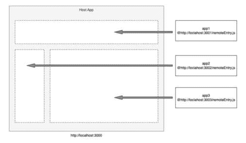
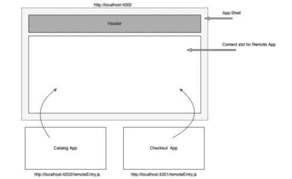
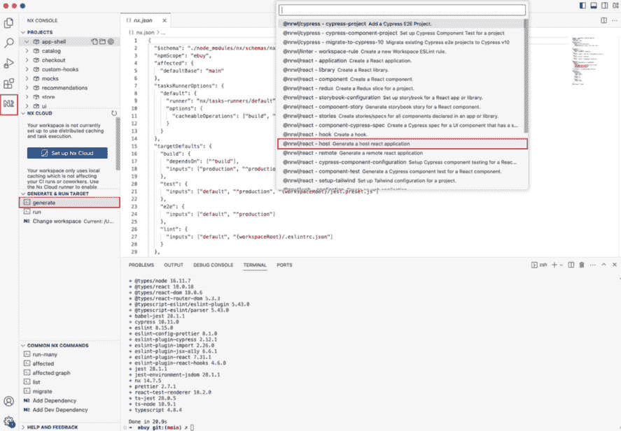
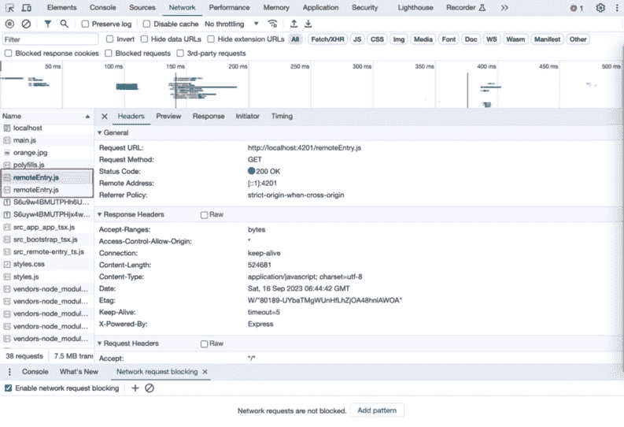
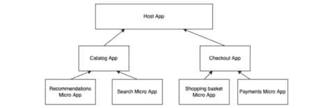
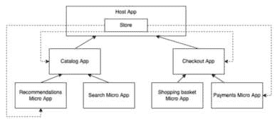
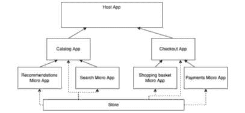
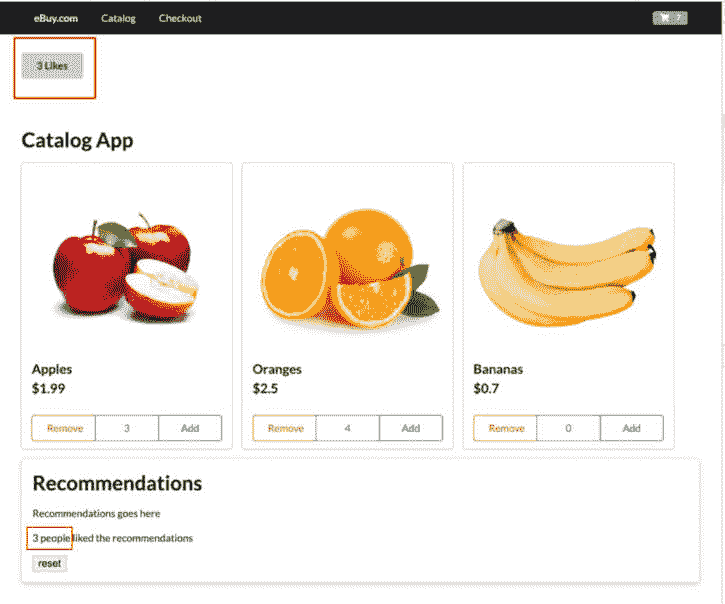
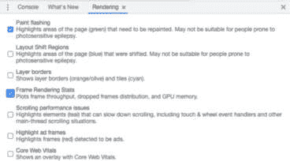

# 第五章：实现微前端模式的微应用

在上一章中，我们看到了构建微前端的多种 SPA 模式，这对于构建每个 SPA 都包含其自身用户旅程的大型应用来说是非常理想的。

这种模式的优点是每个应用都完全独立于其他应用，并且它们通过一个外部于应用的名字空间主路由连接。作为用户，在浏览应用时，您也会注意到，当您从一个 SPA 切换到另一个 SPA 时，您会通过浏览器重定向，并且页面会重新加载。如果您想避免这种情况，并且希望获得一致的 SPA 体验，那么我们可以探索使用模块联邦的微应用模式。 

在本章中，我们将构建一个微应用微前端，我们将学习以下内容：

+   模块联邦是什么，为什么它是构建微前端的关键？

+   设置带有主机和远程应用的微前端应用

+   将应用拆分成更小的微应用，并通过模块联邦加载

+   设置不同页面之间的路由

+   在不同的微应用之间共享状态

到本章结束时，我们将使用模块联邦将我们的多 SPA 微前端转换为微应用微前端。在这个过程中，我们还将了解 Zustand，这是一个易于使用的状态管理库。

# 技术要求

在我们浏览本章的代码示例时，我们需要以下条件：

+   至少 8 GB RAM 的 PC、Mac 或 Linux 桌面或笔记本电脑（16 GB 更佳）

+   英特尔芯片组 i5+或 Mac M1+芯片组

+   至少 256 GB 的空闲硬盘存储空间

您还需要在您的计算机上安装以下软件：

+   Node.js 版本 18+（如果需要管理不同版本的 Node.js，请使用**nvm**）

+   终端：iTerm2 配合 OhMyZsh（你以后会感谢我的）

+   IDE：我们强烈推荐使用 VS Code，因为我们将会利用它自带的一些插件来提升开发体验

+   NPM、Yarn 或 PNPM。我们推荐 PNPM，因为它速度快且存储效率高

+   浏览器：Chrome、Microsoft Edge 或 Firefox

+   对 Nx.dev 单仓库有基本理解，以及使用 VS Code 中的 NX 控制台插件的基本技能

+   对 React 有实际操作经验

本章的代码文件可以在以下位置找到：[`github.com/PacktPublishing/Building-Micro-Frontends-with-React`](https://github.com/PacktPublishing/Building-Micro-Frontends-with-React)。

我们还假设您对 Git 有基本的操作知识，包括分支、提交代码和发起拉取请求。

# 为什么微前端需要模块联邦？

在多 SPA 方法构建微前端时，你可能已经注意到我们在不同的微应用之间重复了一些公共依赖项。从大局来看，当主要目标是保持简单时，这可以是一个可接受的权衡。然而，当重复的依赖项数量和构建的应用程序数量很高时，你需要优化事情并最小化重复。在 Webpack 5 之前尝试实现这一点会导致不得不处理复杂的依赖项管理。这也会使维护和演进微前端应用程序变得困难。模块联邦帮助我们解决这些挑战。

在接下来的章节中，我们将了解模块联邦是什么以及它是如何帮助构建微前端的。

# 什么是模块联邦？

**模块联邦**是 Webpack 5 中引入的一个新特性，它允许我们在实时中加载外部 JS 包。

在模块联邦之前，导入应用程序所需的所有必要模块的标准方式仅限于构建时，此时它创建了一个大 JS 包或基于页面路由加载的小块，但无法实时动态加载应用程序包。

模块联邦为我们提供了一种彻底新的方式来构建我们的应用程序，构建和部署共享组件，并在无需重新构建整个应用程序的情况下更新它们。

传统上，我们构建大部分共享组件，例如 UI 组件库或`npm`模块，并在构建时将它们导入到我们的应用程序中。使用模块联邦，这些模块可以托管在独立的 URL 上，并在运行时导入到应用程序中。我们利用这一相同的功能来构建我们的微前端架构，其中我们的微应用独立托管，并实时加载到宿主或壳应用程序中。

在我们深入了解如何进行之前，让我们看看与模块联邦相关的一些基本术语。模块联邦围绕几个概念。以下是一些：

## ModuleFederationPlugin

所有模块联邦的功能都通过`ModuleFederationPlugin`插件在 Webpack 5+中提供。这是你定义模块联邦应该如何工作的设置的地方。

此插件允许在**运行时**与其他独立构建提供或消费模块。

您可以在此处详细了解`ModuleFederationPlugin`及其规范：[`webpack.js.org/plugins/module-federation-plugin/`](https://webpack.js.org/plugins/module-federation-plugin/)。

在其最简单的形式中，`ModuleFederationPlugin`的代码应如下所示：

```js
const { ModuleFederationPlugin } = require('webpack').container;
module.exports = {
  plugins: [
    new ModuleFederationPlugin({
      // module federation configuration options
    }),
  ],
};
```

上述代码是包含启用模块联邦所需所有配置的骨架。

## 宿主应用程序

这是根应用，其中加载了*远程*或外部应用。主机应用的模块联邦配置存储了需要在其内部加载的远程应用列表。在我们的微前端用例中，主机应用还包含有关不同路由及其与相应远程应用映射的信息。

主应用中 Webpack 对模块联邦的配置应该如下所示：

```js
module.exports = {
  plugins: [
    new ModuleFederationPlugin({
      name: 'hostAppName',
      remotes: {
        app1: '<app1's URL path to remoteEntry.js>',
       app2: '<app2's URL path to remoteEntry.js>',
      },
    }),
  ],
};
```

上述代码易于理解。我们让模块联邦知道主机应用的名字，并提供远程应用列表以及它们对应的`remoteEntry`文件在`remotes`对象中的路径。

## 远程应用

如你所猜，远程应用是在主机应用中动态加载的应用。在模块联邦术语中，这些远程应用也被称为*容器*。这些远程应用的 JS 包通常通过一个单一的`.js`文件暴露，通常称为`remoteEntry.js`，这是主机应用所寻找的。

每个远程应用都以以下方式在 Webpack 的模块联邦配置中公开：

```js
new ModuleFederationPlugin({
      name: 'remoteAppName', // this name needs to match with the entry name
      exposes: ['./public-path/remoteEntry.js'],
      // ...
    }),
```

每个远程应用都需要在其`name`属性中定义一个唯一名称，并且这个名称需要与主机应用模块联邦配置中定义的`remotes`对象中的名称相匹配。

## remoteEntry.js

`remoteEntry.js`文件是一个由模块联邦在运行时创建的小型 JS 文件。它包含每个远程应用的元数据。主机应用依赖于`remoteEntry.js`文件来知道要加载哪些模块。

模块联邦的使用案例不仅限于构建微前端；它们还可以用来动态加载公共库或模块，例如设计系统，例如，无需将这些公共库作为`npm`包发布，每次公共库发生变化时都无需重新构建和重新部署。

以下图表有助于解释模块联邦是如何工作的：



图 5.1 – 实时加载三个微应用的模块联邦

从图中，我们看到我们有在端口`3001`、`3002`和`3003`上运行的应用。每个应用都在其各自的`remoteEntry.js`文件中公开了其元数据。这些应用通过模块联邦动态加载到在端口`3000`上运行的主机应用中。

了解这一点可能很谨慎：这不仅仅是应用。任何类型的 JS 模块都可以动态导入到模块联邦中。

在下一节中，我们将把这些内容付诸实践。

# 使用主机和远程应用设置微前端

我们将把我们的多 SPA 应用转换成一个带有主机和远程应用的微前端，使用模块联邦。如前所述，这种方法的主要好处是用户可以获得真正的单页体验，同时确保每个应用都是独立构建和部署的。

让我们看看我们为此需要做什么：



图 5.2 – 模块联邦设置

你会注意到 *图 5**.2* 与 *图 5**.1* 类似，并解释了模块联邦的实现细节。我们看到主应用程序包含头部组件，并在端口 `4200` 上运行。然后我们有我们的目录和检查应用程序在端口 `4202` 和 `4201` 上运行。我们的目标是动态加载这些远程应用程序，每当调用正确的路由时。

为了将我们的多 SPA 转换为模块化联邦的微前端，我们需要进行以下更改：

1.  创建一个名为 App-shell 的新主应用程序。

1.  从每个单页应用程序（SPA）中删除头部组件并将其移动到 App-shell。

1.  定义需要加载到主应用程序中的远程应用程序，即目录和检查应用程序。

1.  定义目录和检查微应用程序的远程入口。

让我们开始吧。打开您在前一章中构建的 e-buy 应用程序。

您也可以从 Git 仓库下载它：

[`github.com/PacktPublishing/Building-Micro-Frontends-with-React/tree/main/ch4/ebuy`](https://github.com/PacktPublishing/Building-Micro-Frontends-with-React/tree/main/ch4/ebuy)

在接下来的小节中，我们将看到如何创建我们的主应用程序和远程应用程序，但首先，我们将清理现有的应用程序，并准备它们使用模块联邦。

## 清理

使用模块联邦，主应用程序负责路由，我们不需要使用我们在 `proxy.conf.json` 文件中定义的代理配置。因此，我们将删除此文件，并从 `project.json` 文件中删除不必要的配置。

然后继续删除 `/apps/catalog/proxy.conf.json`，并在 `catalog/project.json` 文件中删除以下行：

```js
"proxyConfig": "apps/catalog/proxy.conf.json"
```

在此过程中，我们还可以删除我们在 `checkout/project.json` 文件中定义的 `baseRef`。找到此行并将其删除：

```js
"baseHref": "/checkout/"
```

## 设置 App-shell 主应用程序

通过这种方式，我们现在已准备好开始将我们的多 SPA 应用程序迁移到模块联邦。

Nx 控制台有一个用于创建模块联邦的主应用程序和远程应用程序的便捷生成器。按照以下步骤操作：

1.  创建一个 React 主应用程序：

    **Nx 控制台** | **生成** | **@nrwl/react – 主生成一个主** **react 应用程序**



图 5.3 – 从 Nx 开发控制台选择主应用程序生成器

1.  在此表单中输入以下信息：

    +   **名称**: **app-shell**

    +   **devServerPort**: **4200**

    +   **e2eTestrunner**: **无**

    +   **remotes**: 由于一个不允许多个应用程序名称的 bug，我们将留空并手动添加。

1.  在您点击 `apps/app-shell/module-federation.config.js` 后。

1.  打开文件，在 **remotes** 数组中添加目录和检查作为远程应用程序：

    ```js
    remotes: ['catalog', 'checkout']
    ```

1.  现在，让我们打开 `React.Suspence` 和 React Router 的 `Route`。

1.  我们将调整此模板文件：

    ```js
    import React from 'react';import { Container } from 'semantic-ui-react';
    import { Route, Routes } from 'react-router-dom';
    import 'semantic-ui-css/semantic.min.css';
    import { Header } from ‘@ebuy/ui’; 
    const Catalog = React.lazy(() => import('catalog/Module'));
    const Checkout = React.lazy(() => import('checkout/Module'));
    export function App() {
      return (
        <React.Suspense fallback={null}>
          <Container style={{ marginTop: '5rem' }}>
            <Header />
    <Routes>
              <Route path="/" element={<Catalog />} />
              <Route path="/catalog" element={<Catalog />} />
              <Route path="/checkout" element={<Checkout />} />
            </Routes>
          </Container>
        </React.Suspense>
      );
    }
    export default App;
    ```

    如您从前面的代码中看到的，我们首先将 `Header` 组件导入到 App-shell。

    您还会注意到我们正在使用动态导入来使用`React.lazy`导入我们的 Catalog 和 Checkout 应用。这些行目前会抛出错误，因为它无法找到模块。

1.  为了解决这个问题，创建一个名为**/apps/app-shell/src/remotes.d.ts**的文件，并添加以下代码：

    ```js
    declare module 'catalog/Module';declare module 'checkout/Module';
    ```

    `remotes.d.ts`文件用于在模块联邦设置中为远程提供 TypeScript 类型声明。

    在 JSX 的下方，您会注意到我们在`/`和`/catalog`路由上导入 Catalog 应用，而在`/checkout`路由上导入 Checkout 应用。

这基本上完成了宿主应用的设置。

## 设置我们的远程应用

设置我们的远程应用需要一些工作。让我们逐一解决这些问题。

为了将现有的 Nx 中的 React 应用转换为远程应用，我们需要做以下几步：

+   在**module-federation.config.js**文件中创建远程入口。

+   将**project.json**中的应用构建器更改为使用模块联邦插件。

+   添加一个**serve-static**执行器。

+   使用自定义的 Webpack 配置，该配置定义了远程入口模块。

让我们从 Catalog 应用开始执行前面的更改。按照以下步骤操作：

1.  在**apps/catalog**文件夹中，创建一个名为**module-federation.config.js**的新文件，并添加以下代码：

    ```js
    const moduleFederationConfig = {  name: 'catalog',
      exposes: {
        './Module': './src/app/app.tsx',
      },
    };
    module.exports = moduleFederationConfig;
    ```

    这是我们定义目录远程应用及其暴露的模块路径的地方。

1.  接下来，我们需要对**apps/catalog/project.json**文件进行一些更改。

1.  首先，在目标下添加一个新的命令，命名为**serve-static**：

    ```js
        "serve-static": {      "executor": "@nrwl/web:file-server",
          "defaultConfiguration": "development",
          "options": {
            "buildTarget": "catalog:build",
            "port": 4201
          }
        }
    ```

    注意我们打算在`4201`上运行我们的应用，所以让我们也确保`serve`命令也使用端口号`4201`。

1.  确保在常规**serve**命令下的端口号在**options**对象中定义：

    ```js
    "serve": {      "executor": "@nrwl/web:dev-server",
          "defaultConfiguration": "development",
          "options": {
            "buildTarget": "catalog:build",
            "hmr": true,
            "port": 4201
          },
    ```

    这是因为模块联邦插件期望在`options`对象中定义端口号。如果没有定义，它将使用默认端口号，这可能导致非常有趣的错误。

    参考源代码中的这一行：[`github.com/nrwl/nx/blob/master/packages/react/src/module-federation/with-module-federation.ts#L29`](https://github.com/nrwl/nx/blob/master/packages/react/src/module-federation/with-module-federation.ts#L29)。

1.  接下来，在**serve**对象下，我们更新执行器以使用**module-federation dev-server**：

    ```js
    "serve": {      "executor": "@nrwl/react:module-federation-dev-server",
    ```

1.  接下来，确保我们有**WebpackConfig**带有自定义 Webpack 配置：

    ```js
    "webpackConfig": "apps/catalog/webpack.config.js"
    ```

1.  现在我们更新**webpack.config.js**文件，添加以下代码：

    ```js
    const { withModuleFederation } = require('@nrwl/react/module-federation');const baseConfig = require('./module-federation.config');
    const defaultConfig = {
      ...baseConfig,
    };
    module.exports = withModuleFederation(defaultConfig);
    ```

现在我们对 Checkout 应用重复相同的步骤：

1.  在**apps/checkout/**文件夹中，创建一个名为**module-federation.config.js**的新文件，并添加以下代码：

    ```js
    const moduleFederationConfig = {  name: 'checkout',
      exposes: {
        './Module': './src/app/app.tsx',
      },
    };
    module.exports = moduleFederationConfig;
    ```

    如您所见，它与 Catalog 应用中的配置相同。唯一的区别是我们将`name`值更改为`checkout`。

1.  接下来，让我们将**serve-static**命令添加到**apps/checkout/project.json**文件中的**targets**对象：

    ```js
          "serve-static": {      "executor": "@nrwl/web:file-server",
          "defaultConfiguration": "development",
          "options": {
            "buildTarget": "checkout:build",
            "port": 4202
          }
        }
    ```

1.  在同一文件中，我们继续更新执行器：

    ```js
    "serve": {      "executor": "@nrwl/react:module-federation-dev-server",
    ```

1.  然后在**serve.options**下更新端口号为**4202**。

1.  我们还更新了**webpackConfig**：

    ```js
    "webpackConfig": "apps/checkout/webpack.config.js"
    ```

    由于`webpack.config.js`文件没有变化，我们可以简单地从 Catalog 应用复制并粘贴此文件。

1.  最后，我们将更新**Header**组件以使用来自**ReactRouter**的**Link**组件，以便我们获得单页应用体验。

1.  打开**/libs/ui/src/lib/header.tsx**文件，并将以下内容更新为使用**<Link>**而不是**<a>**：

    ```js
    <Link to={navItem.href ?? '#'}>{navItem.label}</Link>
    ```

1.  不要忘记导入**<Link>**命令：

    ```js
    import { Link } from 'react-router-dom';
    ```

1.  在我们尝试测试之前，别忘了从位于**/apps/catalog/src/app/app.tsx**的相应 Catalog 应用和位于**/apps/checkout/src/app/app.tsx**的 Checkout 应用中移除头部组件。

1.  让我们在终端上快速测试一下。运行以下命令：

    ```js
    app-shell serve command.
    ```

1.  一切运行无误后，打开 App-shell 应用的**/assets**文件夹。

1.  在多 SPA 方法中，Catalog 应用是默认路由，并且有点像宿主应用。由于 App-shell 现在是我们的宿主，我们需要将**/catalog/src/assets**文件夹中的图片复制到**app-shell/src/assets**文件夹中。一旦完成这个操作，图片应该会加载到应用中。

1.  在 Catalog 应用和 Checkout 应用之间导航。将商品添加到购物车，并享受看到应用良好工作的乐趣。

    由于一切进展顺利，并且每个微应用团队都应该能够独立工作在自己的应用上，让我们也确保我们可以单独运行每个应用。

1.  运行**pnpm nx serve catalog**，你会注意到你得到一个错误：

    ```js
    ErrorShared module is not available for eager consumption: webpack/sharing/consume/default/react/react
    ```

    这是因为模块联邦将 Catalog 应用视为双向宿主，并且无法急切地加载共享模块。

    你可以在这里了解更多信息：

    [`webpack.js.org/concepts/module-federation/#uncaught-error-shared-module-is-not-available-for-eager-consumption`](https://webpack.js.org/concepts/module-federation/#uncaught-error-shared-module-is-not-available-for-eager-consumption)

    为了克服这个问题，我们需要定义一个异步边界来分割出更大块初始化代码，并避免任何额外的服务器往返。

1.  为了解决这个问题，我们需要做一些调整。在 Catalog 应用中，我们首先将**/apps/catalog/src/main.tsx**重命名为**bootstrap.tsx**。

1.  接下来，我们在同一个**src**文件夹内创建一个名为**main.ts**的新文件，并有一个单独的行导入 bootstrap：

    ```js
    import('./bootstrap');
    ```

1.  接下来，我们需要确保这个新创建的**main.ts**文件是作为入口点使用的，因此现在，在我们的 Catalog 应用的项目.json 文件中，我们需要更新**build > options**对象内的**main**属性：

    ```js
    "main": "apps/catalog/src/main.ts",
    ```

1.  对 Checkout 应用重复相同的步骤。现在，你应该能够以模块联邦微前端或每个应用独立的方式运行应用。

你可能也注意到，在本章的开头，我们提到了`remoteEntry.js`文件作为远程应用的入口文件，并且我们实际上并没有定义一个。

然而，如果你查看你的开发工具的网络标签页，你会注意到有两个 `remoteEntry.js` 文件分别从端口 `4201` 和 `4202` 被调用。这是 Nx 和模块联邦在这里进行一些魔法操作。

重要提示

如果你深入查看这个文件中的源代码，你会注意到文件名被定义为 **ModuleFederationPlugin** 配置的一部分 ([`github.com/nrwl/nx/blob/master/packages/react/src/module-federation/with-module-federation.ts`](https://github.com/nrwl/nx/blob/master/packages/react/src/module-federation/with-module-federation.ts))。

*图 5.4* 中的截图显示了 `remoteEntry.js` 文件从相应的应用中被调用：



图 5.4 – RemoteEntry.js

如果你渴望明确地定义文件并尽可能接近模块联邦的原生工作方式，那么请创建一个文件在 `apps/catalog/src/remote-entry.js` 中，包含以下行：

```js
export { default } from './app/app';
```

将 `apps/catalog/module-federation.js` 文件中的 `exposes` 值更新为以下内容：

```js
const moduleFederationConfig = {
  name: 'catalog',
  exposes: {
    './Module': './src/remote-entry.ts',
  },
};
```

通过这样，我们已经完成了关于使用模块联邦的章节，并成功将我们的多 SPA 应用转换为模块联邦微前端。

在本节中，我们看到了要使模块联邦工作所需的最小步骤，以及需要额外步骤，如定义远程和暴露模块名称，以允许每个应用独立工作。

在下一节中，我们将看到如何进一步将远程应用分解为真正的微应用微前端。

# 将模块联邦扩展到真正的微应用模式

想象一下，你是一个管理一个非常大的电子商务应用（比如 Amazon.com）的团队的成员。对于这样的大型网站，拥有一个拥有单个有机级组件（[`atomicdesign.bradfrost.com/chapter-2/#organisms`](https://atomicdesign.bradfrost.com/chapter-2/#organisms)）而不是整个迷你应用的团队是一种常见的做法。

例如，我们有一个专门的小组，他们专门负责产品推荐组件。这个组件被注入到，比如说，目录应用中。

在这种情况下，创建另一个名为推荐的微应用并将其动态导入到目录应用中将是明智的。这将允许实现真正的、联邦化的微应用模式架构。



图 5.5 – 使用模块联邦的远程应用树

如您从前面的图中所见，我们可以进一步将目录和结账应用分解为更小的有机级组件，并通过模块联邦让每个组件远程加载到目录应用中。

重要提示

记住，虽然这看起来非常酷，但我们不应该过度操作，将每个单一的组织体都转换为模块联邦的微应用程序。重要的是要遵循第 *第二章* 中提到的微前端原则，即 *将应用程序分解为单个团队拥有的最大独立部署的应用程序*，而不一定是最小的。

话虽如此，假设你确实有一个拥有 Recommendations 微应用程序的独立团队，让我们着手创建微应用程序。

## 创建 Recommendations 远程微应用程序

让我们使用我们信任的 Nx 开发控制台和 `GENERATE` 命令，按照以下步骤操作：

1.  选择 **@nrwl/react - remote Generate a remote application** 并在保持其余默认设置的情况下使用以下信息：

    +   **名称**：**recommendations**

    +   **e2eTestRunner**：**none**

    +   **主机**：**catalog**

    +   **devServerPort**：**4203**

1.  使用 **Generate** 命令并验证 **recommendations** 应用程序是否已成功创建。

1.  让我们快速编辑 **apps/recommendations/src/app.tsx** 文件，移除样板代码，并留下一个简单的消息：

    ```js
    import 'semantic-ui-css/semantic.min.css';export function App() {
      return (
        <div className="ui raised segment">
          <h1>Recommendations</h1>
          <p>Recommendations goes here</p>
        </div>
      );
    }
    export default App;
    ```

注意

构建一个完整的 Recommendations 微应用程序超出了本书的范围。

1.  运行 **npx nx serve recommendations** 并验证应用程序是否在端口 **4203** 上正确加载。

在我们添加它作为远程应用程序到 Catalog 应用程序的同时，保持其运行。

## 将 Recommendations 作为远程应用程序添加到 Catalog

由于我们希望 Recommendations 微应用程序作为远程应用程序加载到 Catalog 中，我们需要将 Catalog 转换为类似主机的行为。我们通过以下步骤来完成：

1.  打开 **apps/catalog/module-federation.config.js** 文件，并向其中添加 **remotes** 条目：

    ```js
    const moduleFederationConfig = {  name: 'catalog',
      remotes: ['recommendations'],
      exposes: {
        './Module': './src/app/app.tsx',
      },
    };
    module.exports = moduleFederationConfig;
    ```

1.  接下来，让我们在 **apps/catalog/src** 文件夹内创建一个 **remotes.d.ts** 文件，使用以下行：

    ```js
    declare module 'recommendations/Module';
    ```

1.  最后，让我们将 Recommendations 应用程序导入并调用到我们的 **apps/catalog/src/app/app.tsx** 文件中：

    ```js
    . . .import React from 'react';
    const Recommendations = React.lazy(() => import('recommendations/Module'));
    ```

1.  在组件的 **jsx** 部分，这是我们调用 Recommendations 组件的方式：

    ```js
    <Recommendations />
    ```

1.  打开一个新的终端窗口并运行以下命令：

    ```js
    pnpm nx serve app-shell
    ```

如果一切按计划进行，你将看到带有 Recommendations 组件的 Catalog 应用程序。有了这个，我们就到了本节的结尾。

在本节中，我们看到了如何使用模块联邦进一步将主应用程序分解成更小的微应用程序，并使它们作为一个远程应用程序的树状结构协同工作。

在下一节中，我们将看到如何在我们的微前端微应用程序中设置状态管理。

# 使用模块联邦进行状态管理

如您现在可能已经注意到的，我们的自定义状态管理系统，它使用 `sessionStorage`，与模块联邦无缝协作。这是因为从 React 的角度来看，它看起来就像一个普通的 React 应用程序，模块是懒加载的。因此，模块联邦的一个好处是我们可以使用任何常规的状态管理概念，例如属性钻取、上下文 API 或 Redux 或 Zustand 等库来管理状态。

在本节中，我们将使用 Zustand 状态管理库，因为它极其用户友好，且没有样板代码。

现在，从逻辑上讲，尤其是对于那些大量使用上下文 API 的人来说，我们可能会倾向于将 store 放在 App-shell 中，并让其他微应用程序消费它。然而，使用模块联邦，这并不理想，因为 store 需要作为一个远程应用程序暴露，并导入作为宿主的其他微应用程序。如果你尝试绘制这个，它有点像某种循环依赖，其中 App-shell 作为所有其他组件的宿主，但位于其中的 store 是其他组件的远程。

以下图更好地说明了这种循环流程的问题：



图 5.6 – App-shell 和 store 之间的循环流程

当使用模块联邦时，最好有一个单向流程来描述远程和宿主应用程序的加载方式。考虑到这一点，最好将我们的 store 作为其独立的微应用程序，并使其对所有使用它的其他应用程序定义为一个远程应用程序。有了这种新的结构，*图 5.6* 中的图可以重新绘制：



图 5.7 – Store 应用程序的单一方向远程连接

如 *图 5.7* 所示，Store 应用程序的远程单向流程看起来要干净得多，并确保 App-shell 不会不必要地膨胀业务逻辑和状态。

由于我们打算使用 Zustand 进行状态管理，这将是安装它的好时机。运行以下命令：

```js
pnpm install zustand
```

现在，让我们按照创建我们的 Recommendations 远程应用程序的步骤来创建我们的 Store 远程应用程序：

1.  使用 Nx Console 和 **@nrwl/react - remote Generate a remote application** 文件，创建 Store 微应用程序。

1.  使用以下信息填写表格，其余部分保留默认值：

    +   **名称**: **store**

    +   **e2eTestRunner**: **none**

    +   **宿主**: （留空，因为我们将会手动添加宿主）

    +   **devServerPort**: **4204**

一旦创建了应用，让我们着手设置我们的存储库。为了展示不同微应用之间状态和存储的工作情况，我们在宿主应用中添加一个 **Like** 按钮。点击它将增加喜欢计数。我们还会在推荐应用中显示计数。然后，在推荐微应用中我们将有一个 **重置** 按钮，该按钮将重置存储库并验证所有地方的喜欢计数是否已重置。

让我们开始吧：

1.  导航到 **/apps/store/src** 文件夹并创建一个名为 **store.tsx** 的新文件。这是我们定义存储和钩子的地方。

注意

Zustand 非常易于使用。请查看 [`docs.pmnd.rs/zustand/getting-started/introduction`](https://docs.pmnd.rs/zustand/getting-started/introduction) 的文档。

1.  从 **store.tsx** 文件开始，导入 Zustand 并定义 **LikeCount** 接口：

    ```js
    import {create} from 'zustand';interface LikeCount {
      count: number;
      increment: () => void;
      reset: () => void;
    }
    ```

1.  接下来，我们创建我们的 **useStore** 钩子并定义 **初始状态**、**增加** 和 **重置** 函数。这是这样做的一种标准方式：

    ```js
    const useStore = create<LikeCount>((set) => ({  count: 0,
      increment: () => set((state) => ({ count: state.count + 1 })),
      reset: () => set(() => ({ count: 0 })),
    }));
    export default useStore;
    ```

    就这样！我们的存储库和 `useStore` 钩子已经准备好被使用了。

1.  接下来，我们需要将其作为远程应用公开。我们将通过进行两项额外更改来实现这一点。在 **apps/store/src/remote-entry.ts** 文件中，将以下行修改为以下文本：

    ```js
    export { default } from './store';
    ```

1.  接下来，我们让 App-shell 和推荐应用知道它们需要将 Store 作为远程应用使用。我们通过在 App-shell 和推荐应用的相应 **module-federation.config.js** 文件中的远程数组中添加 Store 来实现这一点：

    ```js
    //apps/app-shell/module-federation.config.jsconst moduleFederationConfig = {
      name: 'app-shell',
      remotes: ['catalog', 'checkout', 'store'],
    };
    module.exports = moduleFederationConfig;
    ```

    这是 `apps/recommendations/module-federation.config.js` 文件中的内容：

    ```js
    const moduleFederationConfig = {  name: 'recommendations',
      remotes: ['store'],
      exposes: {
        './Module': './src/remote-entry.ts',
      },
    };
    module.exports = moduleFederationConfig;
    ```

1.  下一步，我们需要在 app-shell 文件的 **remotes.d.ts** 文件中声明 **store** 模块：

    ```js
    declare module 'store/Module';
    ```

1.  我们还需要在推荐应用中做同样的事情。由于 **remotes.d.ts** 文件不存在，我们可以在 **/apps/recommendations/src/remotes.d.ts** 中创建一个新文件，包含以下行：

    ```js
    declare module 'store/Module';
    ```

现在我们已经将存储库连接起来，以便推荐和 App-shell 可以读取和写入我们的 Store 微应用。

## 将“喜欢”按钮添加到宿主应用

在本节中，我们将创建一个 **Like** 按钮，该按钮增加喜欢计数并将其存储在存储库中。

现在我们已经设置了远程服务器，让我们将存储库导入到我们的应用外壳中，并创建 `/apps/app-shell/src/app/app.tsx` 文件。按照以下步骤操作：

1.  导入 **useStore**：

    ```js
    import { Button } from ‘semantic-ui-react’import useStore from 'store/Module';
    ```

1.  然后，在 **App** 函数中解构 count 和 increment：

    ```js
    const { count, increment } = useStore();
    ```

1.  最后，在我们的 JSX 中，我们在 **<****Header/>** 组件之后添加我们的按钮：

    ```js
    <Button onClick={increment}>{count} Likes </Button>
    ```

1.  重新启动所有应用。您还可以使用我们创建的以下自定义命令来服务所有应用：

    ```js
    pnpm serve:all
    ```

    我们在主应用中通过 Zustand 实现了状态管理，如您所见，它非常简单，没有多余的模板代码。但设置状态和存储库的真正目的是确保这个状态可以被其他微应用共享。在我们的例子中，它将是位于联盟层次结构底部的推荐应用。

1.  在**apps/recommendations/src/app/app.tsx**文件中，我们的代码应该看起来非常类似于以下内容：

    ```js
    import 'semantic-ui-css/semantic.min.css';import { Button } from ‘semantic-ui-react’
    import useStore from 'store/Module';
    export function App() {
      const { count, reset } = useStore();
      return (
        <div className="ui raised segment">
          <h1>Recommendations</h1>
          <p>Recommendations goes here</p>
          <p> {count} people liked the recommendations</p>
          <Button onClick={reset}>reset</Button>
        </div>
      );
    }
    export default App;
    ```

    就这样！

1.  运行您的应用，并尝试使用**喜欢**按钮。重置它并验证主应用和推荐应用之间的计数是否保持同步：



图 5.8 – 微应用间共享状态的完整工作应用

我们的应用运行得很好，但让我们确保它也具有高性能！

## 避免不必要的重新渲染

在处理状态时，一个非常重要的性能相关点是避免不必要的重新渲染。这在状态在不同组件之间共享或通过属性钻取时尤其正确。

验证这一点的办法是进入**开发者工具**，打开**渲染**面板，选择**闪烁绘制**和**帧渲染统计**，并验证当您点击按钮时，只有组件内的必要项目会更新。

在 Chrome 浏览器中，您可以通过打开**开发者工具**，进入**更多工具**，然后选择**渲染**面板来访问此面板：



图 5.9 – 开发者控制台中的渲染面板

如您从**图 5.9**中看到，一旦我们启用了**闪烁绘制**，您将看到绿色矩形包围了由于变化或用户交互而重新渲染的页面部分。理想的状态是当用户与之交互时，只有页面的一小部分闪烁。**帧渲染统计**显示了用户与页面交互时的帧率。帧率理想情况下应接近 60 fps，以提供流畅的用户体验。

有了这些，我们就来到了本节关于模块联盟应用中 Zustand 状态管理的结束。在本节中，我们学习了将 Store 应用定义为单独的微应用的优点。然后它被动态导入到其他微应用中。我们学习了如何设置存储库作为模块联盟模块。然后我们看到主应用和推荐应用如何通过共享存储库共享状态。最后，我们还能够打开闪烁绘制和帧渲染，以验证当状态变化时，只有应用内的必要元素更新，并且不会导致未更改的组件重新渲染。

# 摘要

我们终于来到了另一个有趣章节的结尾。我们开始学习模块联邦以及它如何改变我们构建和维护应用的方式。我们学习了模块联邦的一些基本概念，例如宿主应用、远程应用、`remoteEntry`等。

然后，我们看到了如何将我们的多 SPA 应用转换为具有应用壳的模块联邦应用，以及如何将目录和结账应用作为远程应用加载。接着，我们将这些应用进一步拆分，包括更小的微应用，以创建模块联邦微应用的树状结构。最后，我们看到了一些管理状态的最佳实践，并了解了如何使用诸如 Zustand 这样的工具来管理不同微应用之间的状态。

在接下来的章节中，我们将了解如何构建这些应用以供生产使用，以及如何将它们部署到云端的静态存储上。
