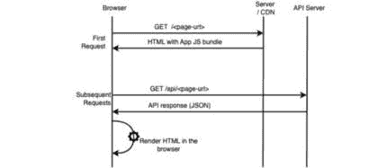
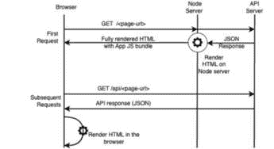
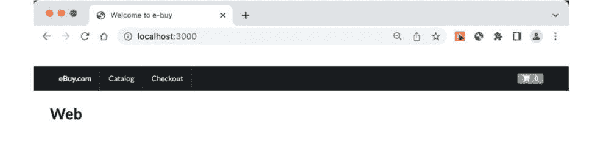
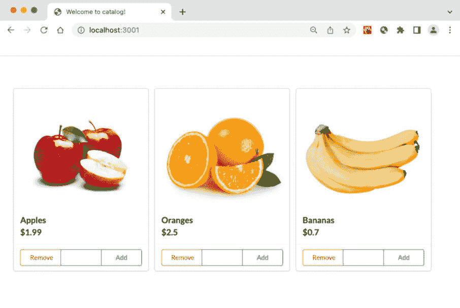
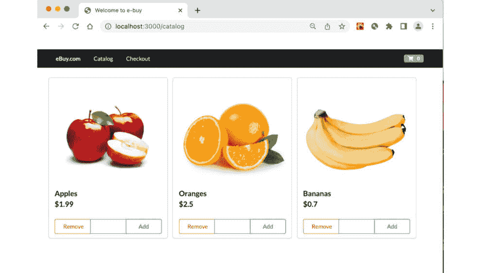
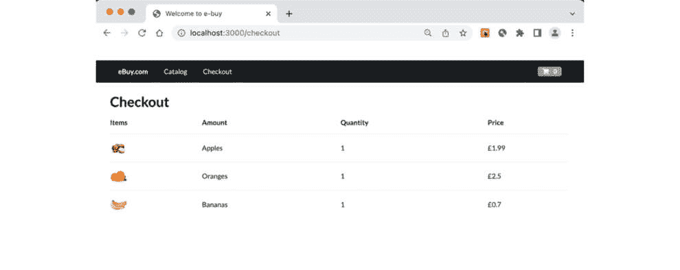

# 6

# 服务器端渲染微前端

大多数 JavaScript 框架，包括 React，主要用于构建**客户端渲染**（**CSR**）应用。客户端渲染应用在某些用例中非常好，例如管理仪表板或银行应用，用户在登录区域与应用交互。CSR 应用对于用户通过搜索引擎访问网站或进行匿名简短用户旅程（如新闻网站、博客或电子商务网站的客户结账）的用例并不理想。这是因为许多搜索引擎机器人无法索引基于 CSR 的 Web 应用。CSR 应用也有较差的**最大内容渲染时间**（**LCP**）得分——即它们首次页面加载的性能得分很差，导致更高的跳出率。

为了克服这些缺点，现在有一个被广泛接受的做法，即在 Node.js 服务器上渲染 Web 应用的页面，并将渲染后的 HTML 页面提供给浏览器。这通常被称为**服务器端渲染**（**SSR**），或服务器端渲染应用（SSR）。

在本章中，我们将探讨如何为服务器端渲染应用构建一个模块联邦微前端。虽然实现模块联邦的过程与上一章中看到的过程非常相似，但由于页面是服务器端渲染的，这带来了一些复杂性，我们将探讨在实现具有 SSR 的微前端时需要处理的一些细微差别。

在本章中，我们将涵盖以下主题：

+   快速了解 CSR 和 SSR 应用的区别

+   了解 Next.js 和 Turborepo

+   学习如何使用 Next.js 和模块联邦设置主机和远程应用

+   看看如何将多个组件暴露为远程组件，以便可以被不同的应用消费

+   探讨与 SSR（静态服务器渲染）中状态保持相关的问题，以及如何在主应用中反映一个微应用所做的更改

到本章结束时，我们将使用 Next.js 构建一个服务器端渲染的微前端。

# 技术要求

在我们浏览本章中的代码示例时，我们需要以下条件：

+   一台至少有 8 GB RAM（16 GB 更佳）的 PC、Mac 或 Linux 桌面/笔记本电脑

+   英特尔 i5+芯片组或 Mac M1+芯片组

+   至少 256 GB 的空闲硬盘存储空间

+   对 Next.js 和 Turborepo 有基本了解是理想的

+   对 Node.js 有基本了解将有所帮助

你还需要在你的计算机上安装以下软件。

+   Node.js 版本 18+（如果你必须管理不同版本的 Node.js，请使用**nvm**）。

+   **终端**：iTerm2 与 OhMyZsh（你以后会感谢我的）。

+   **IDE**：我们强烈推荐 VS Code，因为我们将会使用它的一些插件来提升开发者体验。

+   NPM、Yarn 或 PNPM；我们推荐 PNPM，因为它速度快且存储效率高。

+   **浏览器**：Chrome、Microsoft Edge 或 Firefox。

本章的代码文件可以在以下位置找到：https://github.com/PacktPublishing/Building-Micro-Frontends-with-React。

我们还假设您对 Git 有基本的了解，例如分支、提交代码和发起拉取请求。

# 客户端渲染和服务器渲染应用有何不同？

当涉及到使用 JavaScript 构建 Web 应用时，在用户界面构建和向用户提供服务方面有两种主要方法。它们被称为**客户端渲染**（**CSR**）和**服务器端渲染**（**SSR**）。

从开发角度来看，编写 CSR 或 SSR 应用的主要过程基本相同，只是 SSR 需要一些额外的步骤。然而，这些应用在渲染方式和云部署方式上存在一些差异。

在本节中，我们将更深入地探讨这些差异。

## 客户端渲染应用 (CSR)

让我们来了解一下客户端应用是如何工作的。正如其全名所暗示的，CSR 应用是在客户端“渲染”的。简而言之，应用在用户的浏览器中运行，调用数据获取，并在浏览器中生成页面。以下图表更好地说明了这一点：



图 6.1 – CSR 应用的请求和响应流程

前面的*图 6**.1*展示了 CSR 应用中的请求流程。在这里，浏览器对给定 URL 进行第一次调用，服务器（有时是 CDN 本身）将返回一个几乎为空的 HTML 外壳，其中包含应用 JavaScript 包的链接。浏览器解析包，然后对服务器 API 进行第二次 AJAX 调用，接收给定 URL 的 JSON 响应。浏览器然后解析响应，并根据客户端应用中的视图，在浏览器中渲染 HTML 页面，然后再将其提供给用户。对于其他每次调用，浏览器继续对 API 端点进行 AJAX 调用，并在浏览器中解析页面。

在这个流程中，请注意，对于用户的第一次请求，有两个往返服务器的过程——首先，获取 JavaScript 包，其次，获取页面数据和渲染页面。

由于 CSR 应用的工作性质，它们非常适合用户体验，用户通常在应用中保持登录状态，并在会话中浏览多个页面。

客户端渲染应用的缺点如下：

+   对于第一次请求，由于额外的往返服务器，用户需要等待更长的时间。

+   由于服务器响应不包含任何实际的 HTML 数据，未针对解析 JavaScript 进行优化的搜索引擎爬虫在索引客户端渲染应用的内容时将遇到困难。

CSR 应用不适合用户旅程短的场景，例如用户通过搜索结果链接到达的电子商务网站，购买一两个产品后离开，或者博客网站，用户通常一次只阅读一到两篇文章。

现在，让我们看看一个服务器端渲染的应用程序是如何工作的。

## 服务器端渲染应用程序（SSR）

在服务器端渲染的应用程序中，正如其全名所暗示的，对于第一次请求，页面是在服务器上生成的，并且渲染的 HTML 页面被发送到浏览器。让我们更详细地看看：



图 6.2 – 服务器端渲染应用程序的请求和响应流程

SSR 应用程序的工作原理在先前的*图 6*.2 中进行了说明。我们在这里看到的是，当浏览器从浏览器向 Node.js 服务器发出对页面的第一个请求时，它反过来调用 API 服务器以获取数据。然后，HTML 页面在服务器本身上生成并发送到浏览器，包括初始状态和 JavaScript 包。状态在浏览器上恢复，然后所有后续调用都是从浏览器到 API 服务器的，页面在浏览器本身上渲染。

由于浏览器在第一次请求时就接收到了完全渲染的 HTML 页面，因此最终用户感知的性能良好。它还有助于**搜索引擎优化**（**SEO**），尤其是在搜索引擎爬虫不太擅长解析 CSR 页面的情况下。

服务器端渲染的应用程序适用于用户旅程短的网络应用程序，例如 B2C 电子商务应用程序，或者内容丰富的应用程序，如新闻网站或博客。

我们现在对 SSR 和 CSR 应用程序的工作原理有了很好的理解，了解了它们的优缺点，以及哪些用例最适合它们。有了这些信息，让我们在下一节开始构建我们的 SSR 微前端。

# 构建我们的服务器端渲染微前端

在本节中，我们将探讨如何使用像 Next.js 这样的元框架构建 SSR 应用程序，然后我们将进一步构建一个使用 webpack 的模块联邦插件的模块联邦微前端。在这个过程中，我们将探索另一个 monorepo 工具，即 Turborepo。

重要提示

在撰写本书时，模块联邦插件不支持 Next.js 13 和应用程序路由，因此在本章中，我们将使用 Next.js 版本 12

当涉及到在 React 中构建 SSR 应用程序时，有两种常见的方法：

+   **使用 Node.js 进行自定义构建**：在这里，我们设置一个 Node.js 服务器，在 Node.js 上渲染 React 应用程序，使用**renderToString**或**renderToPipeableStream**方法将响应字符串化，然后使用**hydrateRoot**方法，这些都是**react-dom/server**模块的一部分，将 React 附加到渲染的 HTML 上。

+   **使用服务器端渲染元框架**：例如 Next.js、Remix 或 Shopify 的 Hydrogen 这样的元框架可以抽象出设置服务器端渲染应用程序的所有复杂性，并提供一个简单的接口来构建高性能的 SSR React 应用程序

对于本章，我们将使用 Next.js 来构建我们的 SSR 应用程序。Next.js 是构建 SSR React 应用程序中最古老和最受欢迎的框架之一。

对于单一代码仓库，我们将使用另一个名为 Turborepo 的工具。虽然我们也可以使用 Nx 单一代码仓库构建 Next.js 应用程序，但我们将选择 Turborepo，这样我们也可以了解不同单一代码仓库工具的细微差别以及它们是如何运作的。

## Turborepo 和 Next.js 入门

Next.js 是最流行的元框架，允许你使用 React 构建 SSR 应用程序。Turborepo 是另一个正在获得流行的新单一代码仓库框架，它最近被 Next.js 的构建和维护公司 Vercel 收购。

尽管我们将在本章中介绍 Turborepo 和 Next.js 的基础知识，但我强烈建议你花时间阅读它们的文档，以更深入地了解这些框架是如何工作的。

我们将从一张白纸开始；让我们首先使用 Turborepo 创建我们的单一代码仓库：

1.  在终端中运行以下命令：

    ```js
    pnpx create-turbo@1.6
    ```

    或者，你也可以运行以下命令：

    ```js
    npx create-turbo@1.6
    ```

1.  这将下载一些库，然后提示你选择你希望创建单一代码仓库的位置。让我们称它为 **ebuy-ssr**。

1.  在下一个分配包管理器的提示中，你可以选择你喜欢的。为了本章的目的，我们将选择 **pnpm**。

1.  让 Turborepo 去执行其任务，并在过程完成后，你可以在 **ebuy-ssr** 文件夹中执行以下命令：

    ```js
    pnpm dev
    ```

1.  注意它会在 **3000** 和 **3001** 端口分别启动两个应用程序，**web** 和 **docs**。在浏览器中打开 **http://localhost:3000** 和 **http://localhost:3001**，查看真正简约的默认页面。

1.  在你的 IDE 中打开 **ebuy-ssr** 文件夹，查看文件夹结构。

    它看起来可能像这样：

    ```js
    .└── ebuy-ssr/
    ├── apps/
    │   ├── docs
    │   └── web
    ├── packages/
    │   ├── eslint-config-custom
    │   ├── tsconfig
    │   └── ui
    ├── package.json
    └── turbo.json
    ```

    我们需要考虑的关键文件和文件夹如下：

    +   **apps**：这个文件夹将存放我们所有的微应用。

    +   **packages**：这是我们存放所有实用工具、共享组件、库等的文件夹。它相当于 Nx 中的 **libs** 文件夹。

    +   **package.json**：**package.json** 文件在 turbo 单一代码仓库的功能中起着至关重要的作用。

    +   **turbo.json**：这是我们定义 Turborepo 配置的文件。

### Turborepo 和 Nx 之间的差异

虽然 Turborepo 和 Nx 都为我们管理单一代码仓库，但它们的方法有所不同。Nx 像是一层薄薄的抽象层，使我们能够通过配置来管理我们的单一代码仓库；我们倾向于高度依赖 NX 及其命令来构建和管理我们的单一代码仓库；NX 真正为我们承担了所有的重活。另一方面，Turborepo 非常轻量级，更多地依赖于 npm 包管理器的标准来管理单一代码仓库。Turborepo 的方法是在后台保持隐形，让开发者完全控制他们如何管理单一代码仓库。这也意味着当你使用 Turborepo 管理单一代码仓库时，你需要做更多的工作。

## 设置我们的微应用

如我们所见，在我们的**apps**文件夹中默认创建了两个应用，`web`和`docs`。我们将首先将`web`文件夹重命名为`home`，暂时删除`docs`文件夹：

1.  将**web**文件夹重命名为**home**，删除**docs**文件夹。确保您在**apps/home/package.json**中更新名称属性为**"name": "home"**，因为这是 Turborepo 用来识别应用的方式。

1.  当我们打开文件时，让我们定义它在开发模式中运行的端口。更新**apps/home/package.json**中的开发脚本为**"dev": "next dev --****port 3000"**。

注意，使用 Turborepo，我们有多个`package.json`文件。根文件夹中的`package.json`文件用于管理管理 monorepo 所需的`dev`依赖项，以及 monorepo 中所有应用所需的通用`dev`依赖项。我们也可以在那里定义我们的通用脚本命令。

每个应用文件夹中的`package.json`文件用于管理每个应用的工作空间和依赖项。这里的主要优势是每个微应用都有自己的`npm_modules`文件夹，从而确保每个团队在管理他们的包和依赖项方面完全独立。

### 在 Next.js 中创建页面和组件

让我们开始在我们的各自的微应用中创建一些组件。

1.  使用 Next.js 创建组件与在其他 React 应用中创建组件的方式非常相似；我们通常创建一个**components**文件夹，并将我们的组件保存在其中。

1.  当涉及到路由时，Next.js 12 使用基于文件系统的路由器；这意味着要创建一个新的路由。我们需要在`/``pages/about-us.tsx`中创建一个带有路由名称的文件。

1.  让我们创建我们的组件。由于我们将使用**semantic-ui**来构建我们的组件，让我们继续在我们的微应用包管理器中添加它们作为依赖项。

1.  在微应用的**apps/home**文件夹中运行**pnpm add semantic-ui-react semantic-ui-css**。

1.  然后，在主页文件夹中创建一个名为**/components**的文件夹，并在其中创建**Header**组件。

1.  在**/apps/components/Header.tsx**文件中，添加以下代码：

    ```js
    import { Menu, Container, Icon, Label } from "semantic-ui-react";import Link from "next/link";
    export function Header() {
      return (
        <Menu fixed="top" inverted>
          <Container>
            <Menu.Item as="a" header>
              eBuy.com
            </Menu.Item>
            <MenuItems />
            <Menu.Item position="right">
              <Label>
                <Icon name="shopping cart" />0
              </Label>
            </Menu.Item>
          </Container>
        </Menu>
      );
    }
    const MenuItems = () => {
      return (
        <>
          {NAV_ITEMS.map((navItem, index) => (
            <Menu.Item key={index}>
              <Link href={navItem.href ?? "#"}>{navItem.label}</Link>
            </Menu.Item>
          ))}
        </>
      );
    };
    interface NavItem {
      label: string;
      href?: string;
    }
    const NAV_ITEMS: Array<NavItem> = [
      {
        label: "Catalog",
        href: "/catalog",
      },
      {
        label: "Checkout",
        href: "/checkout",
      },
    ];
    export default Header;
    ```

    上述代码与我们之前章节中使用的`Header`组件的代码非常相似。它只是用于显示菜单项和迷你篮子的标记。

1.  接下来，让我们将标题包含在我们的主页应用中。

    使用 Next.js，如果我们想让代码在所有页面中可用，我们可以在`/pages`文件夹中创建一个名为`_app.tsx`的文件，并将我们的相关代码放在那里，这正是我们将要做的，以便让`Header`组件在所有页面中显示。

1.  在**apps/home/pages**文件夹中创建一个名为**_app.tsx**的新文件，并包含以下代码：

    ```js
    import { AppProps } from "next/app";import Head from "next/head";
    import { Container } from "semantic-ui-react";
    import "semantic-ui-css/semantic.min.css";
    import Header from “../components/Header”;
    function CustomApp({ Component, pageProps }: AppProps) {
      return (
        <>
          <Head>
            <title>Welcome to ebuy!</title>
          </Head>
          <main>
            <Header />
            <Container style={{ marginTop: "5rem" }}>
              <Component {...pageProps} />
            </Container>
          </main>
        </>
      );
    }
    export default CustomApp;
    ```

1.  运行**pnpm dev**并验证**Header**组件是否显示在**http://localhost:3000**上。

1.  现在，我们将创建我们的目录微应用。只需复制主页应用并重命名文件夹为**catalog**。

1.  打开位于 **apps/catalog/package.json** 文件中的 catalog 的 **package.json** 文件，并进行一些小的修改。

1.  将应用名称更改为 **"name": "catalog"**；同时，让我们也将端口更改为运行在 **3001**：

    ```js
    "dev": "next dev --port 3001".
    ```

1.  现在，让我们在 **components** 文件夹中创建我们的产品卡片组件。

1.  在 **apps/catalog/components/ProductCard.tsx** 文件中创建一个新文件，以下是其代码：

    ```js
    import { Button, Card, Image } from "semantic-ui-react";export function ProductCard(productData: any) {
      const { product } = productData;
      return (
        <Card>
          <Card.Content>
            <Image alt ={product.title}
     src={product.image} />
            <Card.Header>{product.title}</Card.Header>
            <Card.Description>{product.description}</Card.Description>
            <Card.Header>${product.price}</Card.Header>
          </Card.Content>
          <Card.Content extra>
            <div className="ui three buttons">
              <Button basic color="red">
                Remove
              </Button>
              <Button basic color="blue"></Button>
              <Button basic color="green">
                Add
              </Button>
            </div>
          </Card.Content>
        </Card>
      );
    }
    export default ProductCard;
    ```

    再次强调，这与我们在 *第五章* 中创建的 `ProductCard` 组件非常相似。这是一个基本的标记，用于显示产品图片、产品名称和价格，以及添加到购物车按钮。

1.  随意删除 **catalog/components** 中的 **Header.tsx** 文件，并从 **_app.tsx** 文件中移除其引用，因为我们已经在主页应用中有了它，并且在这里不会使用它。

1.  接下来，为了节省我们一些时间，让我们将 **product-list-mocks.tsx** 文件从 *第四章* 复制粘贴到 **apps/catalog/mocks** 文件夹中。当我们在这里时，也让我们将包含产品图片的 **assets** 文件夹从 [`github.com/PacktPublishing/Building-Micro-Frontends-with-React-18/tree/main/ch4/ebuy/apps/catalog/src/assets`](https://github.com/PacktPublishing/Building-Micro-Frontends-with-React-18/tree/main/ch4/ebuy/apps/catalog/src/assets) 复制并粘贴到 **/apps/catalog/public/assets**。

1.  接下来，在 **apps/catalog/pages/index.tsx** 文件中，让我们添加以下代码：

    ```js
    import { Card } from "semantic-ui-react";import ProductCard from "../components/ProductCard";
    import { PRODUCT_LIST_MOCKS } from "../mocks/product-list-mocks";
    export function ProductList() {
      return (
        <Card.Group>
          {PRODUCT_LIST_MOCKS.map((product) => (
            <ProductCard key={product.id} product={product} />
          ))}
        </Card.Group>
      );
    }
    export default ProductList;
    ```

1.  从 **ebuy-ssr** 文件夹的根目录运行 **pnpm dev** 并验证 **home** 和 **catalog** 应用是否按预期工作。以下是我们的应用 URL：

    +   **主页** 应用：**http://localhost:3000**

    +   **目录** 应用：**http://localhost:3001**



图 6.3 – 在端口 3000 上运行的首页微应用



图 6.4 – 在端口 3001 上运行的目录微应用

现在我们已经让我们的独立应用运行，让我们努力通过模块联邦将目录微应用加载到主页应用中。

### 设置模块联邦

现在我们已经让我们的应用独立运行，是时候通过模块联邦将目录应用嵌入到主页应用中了。对于使用 Next.js 的模块联邦，我们将使用专门的 `nextjs-mf npm` 模块。按照以下步骤操作：

1.  让我们首先在目录应用中安装 **nextjs-mf** npm 模块以及 webpack：

    ```js
    pnpm add @module-federation/nextjs-mf webpack
    ```

1.  我们现在需要将目录应用作为远程暴露出来；我们在 **app/catalog/next.config.js** 文件中这样做。

1.  我们用以下内容替换 **next.config.js** 文件的内容：

    ```js
    const NextFederationPlugin = require("@module-federation/nextjs-mf");// this enables you to use import() and the webpack parser
    // loading remotes on demand, not ideal for SSR
    const remotes = (isServer) => {
      const location = isServer ? "ssr" : "chunks";
      return {
        catalog: `catalog@http://localhost:3001/_next/static/${location}/remoteEntry.js`,
      };
    };
    module.exports = {
      webpack(config, options) {
        config.plugins.push(
          new NextFederationPlugin({
            name: "catalog",
            filename: "static/chunks/remoteEntry.js",
            exposes: {
              "./Module": "./pages/index.tsx",
            },
            remotes: remotes(options.isServer),
            shared: {},
            extraOptions: {
              automaticAsyncBoundary: true,
            },
          })
        );
        return config;
      },
    };
    ```

    查看代码，我们首先导入`NextFederationPlugin`，然后定义远程，包括其名称和`remoteEntry.js`文件所在路径。Next.js 为其应用创建两个构建版本——一个用于服务器，另一个用于客户端。请注意，我们根据执行位置从`ssr`或`chunks`文件夹有条件地加载`remoteEntry.js`文件。

1.  接下来，我们定义 webpack 配置，在其中设置**NextFederationPlugin**的属性，即名称和它暴露的内容，如下所示：

    ```js
    exposes: {  "./Module": "./pages/index.tsx",
       },
    ```

我们可以定义远程数组，并让目录微应用中的不同组件或页面在其他应用中加载。这完成了目录端的设置。

### 创建结账微应用

为了完整性，让我们通过复制目录应用并重命名文件夹为`checkout`来创建`checkout`微应用。按照以下步骤操作：

1.  让我们对**apps/checkout/package.json**文件进行必要的更改，如下所示：

    ```js
    "name": "checkout",
    ```

1.  然后，更新端口号：

    ```js
    "dev": "next dev --port 3002",
    ```

1.  现在，在**apps/checkout/components/Basket.tsx**中创建一个名为**Basket.tsx**的文件，并包含以下代码：

    ```js
    import { Table, Image, Container } from "semantic-ui-react";export function ShoppingBasket(basketListData: any) {
      const { basketList } = basketListData;
      return (
        <Container textAlign="center">
          <Table basic="very" rowed=”true”>
            <Table.Header>
              <Table.Row>
                <Table.HeaderCell>Items</Table.HeaderCell>
                <Table.HeaderCell>Amount</Table.HeaderCell>
                <Table.HeaderCell>Quantity</Table.HeaderCell>
                <Table.HeaderCell>Price</Table.HeaderCell>
              </Table.Row>
            </Table.Header>
            <Table.Body>
              {basketList.map((basketItem: any) => (
                <Table.Row key={basketItem.id}>
                  <Table.Cell>
                    <Image alt={ basketItem.title } src={basketItem.image} rounded size=”mini” />
                  </Table.Cell>
                  <Table.Cell> {basketItem.title}</Table.Cell>
                  <Table.Cell>{basketItem.quantity || 1}</Table.Cell>
                  <Table.Cell>£{basketItem.price||1 * basketItem.quantity}</Table.Cell>
                </Table.Row>
              ))}
            </Table.Body>
          </Table>
        </Container>
      );
    }
    export default ShoppingBasket;
    ```

1.  让我们还将**apps/checkout/pages/index.tsx**文件的内容进行更改，以确保结账应用通过传递正确的信息集加载**basket**组件：

    ```js
    import { Container, Header as Text } from "semantic-ui-react";import ShoppingBasket from "../components/Basket";
    import "semantic-ui-css/semantic.min.css";
    import { PRODUCT_LIST_MOCKS } from "../mocks/product-list-mocks";
    export function App() {
      return (
        <Container style={{ marginTop: "5rem" }}>
          <Text size="huge">Checkout</Text>
          <ShoppingBasket basketList={PRODUCT_LIST_MOCKS} />
        </Container>
      );
    }
    export default App;
    ```

1.  现在，让我们更新**apps/checkout/next.config.js**中的模块联邦配置，以将结账应用设置为远程。

1.  让我们更新远程数组以反映名称结账，并将端口更新为**3002**，如下代码片段所示：

    ```js
    return {    checkout: `checkout@http://localhost:3002/_next/static/${location}/remoteEntry.js`,
      };
    The next set of changes in the same file are here
      new NextFederationPlugin({
            name: "checkout",
            filename: "static/chunks/remoteEntry.js",
            exposes: {
              "./Module": "./pages/index.tsx",
            },
    . . .
    ```

让我们快速检查应用，看看结账应用是否正确加载，通过在根目录运行`pnpm dev`并在浏览器中访问以下 URL——`http://localhost:3002`。

### 设置主机应用

现在，让我们专注于主应用：

1.  我们需要再次安装**module-federation/nextjs-mf npm**包和 webpack：

    ```js
    pnpm add @module-federation/nextjs-mf webpack
    ```

1.  完成后，通过更新**apps/home/next.config.js**文件，将主机应用设置为主机，如下所示：

    ```js
    const NextFederationPlugin = require("@module-federation/nextjs-mf");const remotes = (isServer) => {
      const location = isServer ? "ssr" : "chunks";
      return {
        catalog: `catalog@http://localhost:3001/_next/static/${location}/remoteEntry.js`,
        checkout: `checkout@http://localhost:3002/_next/static/${location}/remoteEntry.js`,
      };
    };
    module.exports = {
      webpack(config, options) {
        config.plugins.push(
          new NextFederationPlugin({
            name: "home",
            filename: "static/chunks/remoteEntry.js",
            exposes: {},
            remotes: remotes(options.isServer),
            shared: {},
            extraOptions: {
              automaticAsyncBoundary: true,
            },
          })
        );
        return config;
      },
    };
    ```

1.  由于我们希望在目录路由中加载目录微应用，我们将在**apps/home/pages/**下创建一个名为**catalog.tsx**的新文件，并包含以下代码：

    ```js
    import dynamic from "next/dynamic";const Catalog = dynamic(() => import("catalog/Module"), {
      ssr: true,
    });
    export default function catalog() {
      return <Catalog />;
    }
    ```

1.  让我们在**apps/home/pages/checkout.tsx**中创建一个类似的文件名为**checkout**，并包含以下类似代码：

    ```js
    import dynamic from "next/dynamic";const Checkout = dynamic(() => import("checkout/Module"), {
      ssr: true,
    });
    export default function checkout() {
      return <Checkout />;
    }
    ```

    如您所见，我们首次导入 Next.js 的动态模块，这是使用 Next.js 动态导入的推荐方式。

    您可以选择动态导入模块以执行客户端，通过设置`ssr:false`；这将使模块在客户端执行并绕过 SSR。这适用于您的模块包含个性化内容时，例如推荐、订单历史等。

    然后，我们定义名为`Catalog`的`const`并从`catalog/Module`导入它。请注意，TypeScript 抛出一个错误。这是因为我们没有为其定义类型。

1.  因此，让我们快速创建以下内容的 **/apps/home/remotes.d.ts** 文件：

    ```js
    declare module "catalog/Module";declare module "checkout/Module";
    ```

1.  让我们通过关闭所有运行的服务器来测试一切。

    `killall node` 是一个非常有用的命令，可以杀死所有节点进程。

1.  运行 **pnpm dev** 并访问 **http://localhost:3000**。点击目录并检查应用以查看相应的微应用加载。

注意

你可能需要将目录中的 **public/assets** 文件夹复制到宿主应用中。



图 6.5 – 在目录路由上加载的目录微应用

以下截图显示了在检查路由上加载的检查微应用：



图 6.6 – 在检查路由上加载的检查微应用

恭喜！！我们现在拥有了一个完整的服务器端渲染微前端。

让我们回顾一下到目前为止我们所学的。我们首先使用 Turborepo 和 Next.js 创建了各自的微应用，并了解了 Turborepo 的文件夹结构以及它与 Nx 的区别。然后我们使用 Next.js 创建了微应用，最后我们看到了如何设置模块联邦以在不同的路由中加载不同的微应用。

# 摘要

我们已经到达了本章的结尾，我们学习了客户端渲染和服务器端渲染应用之间的区别，以及哪种类型的应用适合哪种。我们探讨了构建 SSR 应用程序的各种选项，并专注于使用 Next.js 和 Turborepo 构建我们的模块联邦应用。然后我们看到了如何使用 `next.js-mf` 插件设置模块联邦，并着手设置我们的远程和宿主应用。最后，我们看到了如何将这些模块动态导入到宿主应用中，并设置不同应用之间的路由。

作为本章的一个挑战目标，你可以探索设置共享状态管理解决方案或共享组件库，按照我们在 *第五章* 中采取的方法进行。

在下一章中，我们将学习如何将我们的应用部署到云端。另一边见！
