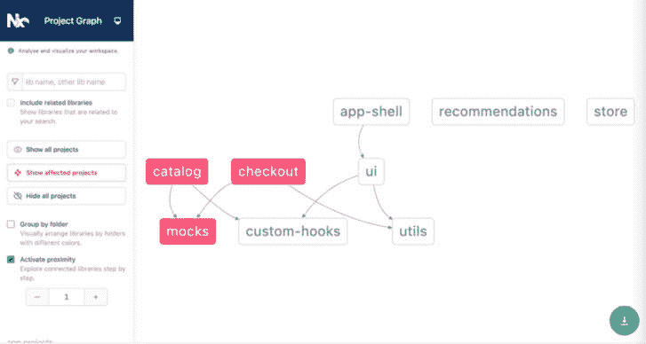

# 7

# 将微前端部署到静态存储

从本章开始，事情开始变得有趣，因为我们现在正走出前端/React 世界，进入云和全生命周期工程的领域。

如您从本书的早期章节所回忆的那样，微前端架构的一个主要目标是确保我们不需要在每次进行小幅度修改时部署整个应用，而是只需部署已更改的微应用。因此，一本关于微前端的书籍如果不涵盖将我们的微前端正确部署到生产环境的关键主题，就不能被认为是完整的。

当涉及到部署单页应用（SPAs）时，我们通常运行 webpack 的 `build` 命令来生成我们的 JavaScript 打包文件和资产，存放在 `/build` 或 `/dist` 文件夹中，然后我们只需将其复制到静态网站托管提供商那里，以便我们的应用对用户可用。然而，部署微前端要复杂得多。

在本章中，我们将看到如何将我们在 *第五章* 中构建的客户端渲染微前端部署到静态存储云提供商，如 Firebase。我们将涵盖以下主题：

+   理解什么是静态存储

+   设置 Firebase 托管

+   学习如何使用 Nx 构建 production 打包

+   学习如何仅构建和部署已修改的应用

到本章结束时，我们将使我们的微前端应用在 Firebase 上运行，并且我们还将创建仅构建和部署已修改应用的脚本。

# 技术要求

在我们浏览本章中的代码示例时，我们需要以下内容：

+   一台至少有 8 GB RAM（16 GB 更佳）的 PC、Mac 或 Linux 桌面/笔记本电脑

+   英特尔芯片组 i5+ 或 Mac M1+ 芯片组

+   至少 256 GB 的空闲硬盘存储空间

您还需要在您的计算机上安装以下软件：

+   Node.js 版本 18+（如果您必须管理不同版本的 Node.js，请使用 **nvm**）

+   终端：iTerm2 配合 OhMyZsh（您会感谢我的）

+   IDE：我们强烈推荐 VS Code，因为我们将会使用一些 VS Code 内置的插件来提升开发者体验

+   npm、Yarn 或 pnpm：我们推荐 pnpm，因为它速度快且存储效率高

+   浏览器：Chrome/Microsoft Edge，Firefox

+   对 Nx.dev 单一仓库有基本理解

+   对 Firebase 和静态网站托管有基本理解会有所帮助

本章的代码文件可以在以下位置找到：

[`github.com/PacktPublishing/Building-Micro-Frontends-with-React`](https://github.com/PacktPublishing/Building-Micro-Frontends-with-React)

我们还假设您对 Git 有基本的操作知识，例如分支、提交代码和发起拉取请求。

# 什么是静态存储？

云托管提供商，如 AWS、Google 和 Azure，提供各种托管解决方案。静态存储，也称为 blob 存储，是指一种针对存储大量非结构化数据优化的存储服务，例如 **二进制大对象**（**Blob**）。这些数据可以是任何类型，包括图像、视频、音频文件以及 HTML、CSS 和 JavaScript 等文本文件格式。

静态存储旨在高度可扩展，通常通过 **内容分发网络**（**CDN**）提供服务。这使得它能够处理大量数据而不会降低性能，并且也使其非常耐用，通过在不同节点上的数据复制来确保数据不会因为硬件故障或其他中断而丢失。

关于静态存储的一个关键点是它没有任何计算能力；也就是说，它没有 CPU 或 RAM 资源。它只能提供静态文件。把它想象成一个连接到云的非常大的外部硬盘。

历史上，静态存储被用于存储和提供图像、JavaScript 或 CSS 文件，或者作为备份存储。它从未是托管 Web 应用的选择。然而，随着在浏览器上执行的单页应用（SPAs）的出现，前端工程师意识到他们可以使用存储来托管 JavaScript 和 CSS 包，并让应用在浏览器上执行和运行。现在，大多数托管提供商都正式提供静态站点托管服务。以下是一些流行的静态站点托管提供商：

+   Firebase

+   Netlify

+   Cloudflare

+   Azure 静态 Web 应用

+   Google Cloud Storage

+   Amazon S3

由于其简单性和非常低的成本，静态存储非常适合提供客户端渲染（CSR）的 React 应用。由于缺乏计算能力，它们不能用于提供后端或基于节点的基础 API，或执行 **服务器端** **渲染**（**SSR**）。

在我们的案例中，由于我们的微前端是客户端渲染的，我们将使用它来部署我们的应用。

在可用的各种托管选项中，我们将选择 Firebase 作为我们的托管解决方案，在下一节中，我们将介绍如何设置我们的 Firebase 应用程序。

顺便提一下，将微前端部署到任何其他托管提供商的过程将与本章其余部分中我们将要经历的类似过程相似。

# 设置 Firebase

Firebase，作为 Google 云平台的一部分，是一个极其易于使用且对开发者友好的托管提供商。Firebase 提供了大量的构建和管理 Web 和移动应用的服务和产品。

许多这些服务都有免费层，这使得它们非常适合构建和测试。您可以通过访问 [www.firebase.com](https://www.firebase.com) 并使用您的 Google 账户登录来访问所有产品和服务。

一旦您登录到 Firebase，请转到 **管理** **控制台**（[`console.firebase.google.com/`](https://console.firebase.google.com/)）。

创建一个新的项目。让我们称它为`ebuy`。在下一节中，我们将在这个项目中设置我们的站点。

## 设置具有多个站点的项目

我们将使用 Firebase 的托管服务来部署我们的应用程序。如果您不熟悉 Firebase 托管，我们强烈建议您访问[`firebase.google.com/docs/hosting`](https://firebase.google.com/docs/hosting)并阅读相关内容：

1.  一旦进入控制台，选择**ebuy**项目。

1.  转到左侧导航面板上的**构建** | **托管**链接。点击**开始**按钮以启动向导，并按照步骤在**ebuy**项目中创建一个新的站点。

1.  我们为每个构建的微应用都需要一个新的站点，所以在仪表板页面上使用**添加另一个站点**，然后继续创建五个站点。为了保持本章的一致性，让我们按照以下名称命名：

    +   **ebuy-app-shell.web.app**

    +   **ebuy-catalog.web.app**

    +   **ebuy-checkout.web.app**

    +   **ebuy-recommendations.web.app**

    +   **ebuy-datastore.web.app**

注意，这些名称在整个 Firebase 中必须是唯一的。如果名称已被占用（这很可能会发生），您可以选择合适的名称或接受 Firebase 提供的建议。

一旦创建了这五个站点，记下这些站点将可用的 URL，因为我们稍后会需要它们。

## 安装和配置 Firebase CLI

接下来，我们需要安装 Firebase 工具并将它们连接到我们的项目和站点：

1.  在终端中运行**npm install -g firebase-tools**。

1.  然后，运行**firebase login**。这将打开一个浏览器窗口并请求您登录到您的 Firebase 账户。

1.  运行**firebase init hosting**。这将带您完成一系列步骤。如果一切顺利，您将看到新创建的**.firebaserc**和**firebase.json**文件。

1.  接下来，我们需要让 Firebase 知道哪个微应用应该部署到哪个目标站点。我们通过运行以下命令来实现。语法如下：

    ```js
    firebase target:apply hosting <micro-app-name> <firebase-site-name
    ```

1.  因此，在我们的情况下，考虑到我们的微应用名称和 Firebase 内创建的网站，我们的命令如下所示：

    1.  **firebase target:apply hosting** **app-shell ebuy-app-shell**

    1.  **firebase target:apply hosting** **catalog ebuy-catalog**

    1.  **firebase target:apply hosting** **checkout ebuy-checkout**

    1.  **firebase target:apply hosting** **ebuy-recommendations**

    1.  **firebase target:apply hosting** **store ebuy-datastore**

一旦成功执行了这些命令，您会注意到在`.firebaserc`文件中创建了这些条目。

这完成了我们在 Firebase 方面的设置。在下一节中，我们将为生产构建准备我们的微前端。

# 创建微前端生产构建

如您所回忆的，到目前为止，我们只以开发模式运行并测试了我们的微前端，使用的是`nx serve`命令。为了将应用程序部署到托管服务器，它们需要以生产模式构建。

这通常在常规 React 应用程序中相当直接，但与我们的微前端相比，需要做更多的工作。

打开我们构建的 ebuy 应用程序，见 *第五章*，并按照以下步骤操作。让我们首先创建一个脚本来构建所有我们的应用程序：

1.  在根目录下打开 **package.json** 文件，就像 **serve:all** 命令一样，让我们创建一个新的命令 **build:all**，如下所示：

    ```js
    "build:all": "nx run-many --target=build"
    ```

1.  运行 **pnpm build:all** 命令，让我们看看是否所有应用程序都构建成功。哎呀！你会注意到，尽管所有其他应用程序都构建得很好，**app-shell** 抛出了一些关于找不到 **catalog/Module** 或 **checkout/Module** 等错误，等等。

    让我们深入探讨一下。

1.  打开 `remotes` 数组是空的。这就是我们的应用程序外壳构建命令失败的原因，因为 webpack 不知道它需要从哪里获取 `remoteEntry.js` 文件的路径。

1.  让我们将我们的远程列表添加到这个数组中。这应该与我们的 `remoteEntry` 文件中远程数组中的应用程序列表相匹配。

1.  我们更新了 **apps/app-shell/webpack.config.prod.js** 文件中的远程数组如下：

    ```js
      remotes: [
        ['catalog', 'https://ebuy-catalog.web.app/'],
        ['checkout', 'https://ebuy-checkout.web.app/'],
        ['store', 'https://ebuy-datastore.web.app/'],
      ]
    ```

1.  现在，重新运行 `catalog` 和 `recommendations` 应用程序也需要在它们的 `webpack.config.prod.js` 文件中的远程数组。

    我们还注意到，由于我们的目录和结账应用程序最初并不是作为微前端远程应用程序构建的，它们有略微不同的配置，并且缺少 `webpack.config.prod.js` 文件。让我们首先修复这个问题。

1.  首先，让我们在构建生产构建时复制并粘贴 `.prod.js` 文件。

1.  因此，在它们各自的 **project.json** 文件中，我们在 **build > configuration > production** 对象内添加以下行，如下所示：

    ```js
    //apps/catalog/project.json
     . . .
    "vendorChunk": false,
      "webpackConfig": "apps/catalog/webpack.config.prod.js"
            },
    //apps/checkout/project.json
     . . .
    "vendorChunk": false,
      "webpackConfig": "apps/checkout/webpack.config.prod.js"
            },
    ```

    这将确保所有应用程序都使用它们各自的 `webpack.config.prod.js` 文件来运行它们的生产构建。

1.  现在，让我们更新我们的 **apps/catalog/webpack.config.prod.js** 文件中的远程路径数组。由于目录应用程序只有一个远程，即推荐微应用程序，我们的远程数组看起来如下：

    ```js
      remotes: [
        ['recommendations', 'https://ebuy-recommendations.web.app/'],
      ],
    ```

    接下来，让我们为我们的推荐应用程序做同样的事情，这些应用程序使用 `store` 微应用程序作为远程。因此，在 `apps/recommendations/webpack.config.prod.js` 文件中，我们更新远程数组如下：

    ```js
      remotes: [
        [‘store’, 'https://ebuy-datastore.web.app/'],
      ],
    ```

1.  10. 由于结账应用程序也需要使用存储作为远程，我们更新了 **apps/checkout/webpack.config.prod.js** 文件如下：

    ```js
      remotes: [
        [‘store’, 'https://ebuy-datastore.web.app/'],
      ],
    ```

1.  再次运行我们的 **pnpm build:all** 命令，以根据我们最新创建的 webpack 配置生成生产构建。

当构建成功时，查看项目根目录下的 `/dist` 文件夹，并验证所有我们的微前端文件夹是否位于 `/dist/apps` 内。注意它们的路径，因为我们将在下一节中使用它们。

在本节中，我们通过确保所有应用程序都使用了正确的 webpack 配置，包括 `remoteEntry.js` 文件的正确公共 URL，成功生成了我们的微前端的生产构建。

在下一节中，我们将看到如何将这些应用到 Firebase 上部署。

# 将我们的应用部署到 Firebase

使用 Firebase CLI 的`deploy`命令将我们的应用部署到 Firebase 相当简单。然而，在我们运行 Firebase 的`deploy`命令之前，我们需要让 Firebase 知道哪些微应用将部署到相应的 Firebase 网站上。我们在`/firebase.json`文件中完成这项操作。

将默认配置替换为以下内容：

```js
 {
  "hosting": [
    {
      "target": "app-shell",
      "public": "dist/apps/app-shell",
      "ignore": ["firebase.json", "**/.*", "**/node_modules/**"],
      "rewrites": [
        {
          "source": "**",
          "destination": "/index.html"
        }
      ]
    }
    {
      "target": "catalog",
      "public": "dist/apps/catalog",
      "ignore": ["firebase.json", "**/.*", "**/node_modules/**"],
      "rewrites": [
        {
          "source": "**",
          "destination": "/index.html"
        }
      ]
    },
    {
      "target": "checkout",
      "public": "dist/apps/checkout",
      "ignore": ["firebase.json", "**/.*", "**/node_modules/**"],
      "rewrites": [
        {
          "source": "**",
          "destination": "/index.html"
        }
      ]
    },
    {
      "target": "recommendations",
      "public": "dist/apps/recommendations",
      "ignore": ["firebase.json", "**/.*", "**/node_modules/**"],
      "rewrites": [
        {
          "source": "**",
          "destination": "/index.html"
        }
      ],
    },
    {
      "target": "store",
      "public": "dist/apps/store",
      "ignore": ["firebase.json", "**/.*", "**/node_modules/**"],
      "rewrites": [
        {
          "source": "**",
          "destination": "/index.html"
        }
      ]
    }
  ]
}
```

如您所见，前面的代码是一个配置，其中我们有一个目标应用数组，并定义了 Firebase 应该查找每个微应用的包的文件夹路径。我们还设置了一些关于忽略不部署`node_modules`和重写规则的设置，这对于你想要每个微应用也能作为其各自网站内的独立 SPA 可用是至关重要的。

现在，我们已经准备好将我们的应用部署到 Firebase。让我们先手动运行以确保一切正常。

在项目的终端中运行以下命令：

```js
firebase deploy --only hosting
```

这将生成一个包含许多文件的`.firebase`文件夹。别忘了将`.firebase`添加到你的`.gitignore`文件中。

让 Firebase 完成其工作，如果一切顺利，它应该会显示一个成功消息并打印出已部署的网站 URL 列表，如下所示：


图 7.1 – Firebase 成功部署后发布的网站 URL 列表

太好了！让我们点击`app-shell`链接，检查我们是否可以看到我们的微前端。

哎，我们看到一个空白页...看看浏览器开发者工具的控制台，你会注意到问题所在。我们的浏览器因为**跨源资源共享**（**CORS**）的原因阻止了对`remoteEntry.js`文件的调用。


图 7.2 – 由于缺少`Access-Control-Allow-Origin`头部导致的 CORS 策略头部

我们将在下一节中看到如何解决这个问题。

## 解决 CORS 问题

如果你曾经构建过 React 或其他任何 Web 应用，你将熟悉令人讨厌的 CORS 问题。这是浏览器出于安全原因阻止对外部域的调用，除非它看到明确的`'Access-Control-Allow-Origin'`头部。访问控制是在决定是否允许其域的资产在其他域上被消费和执行的 app 上设置的。

因此，为了使我们的微前端应用能够正常工作，宿主应用需要能够从每个微应用托管在的公共 URL 加载`remoteEntry.js`文件。这就是我们将在接下来的步骤中设置的。

使用 Firebase Hosting，这相当简单，我们可以在`firebase.json`文件中定义一个头部数组。

打开除`app-shell`以外的所有应用的`/firebase.json`文件，并在每个目标对象中定义我们想要设置的头部信息：

```js
      "headers": [
        {
          "source": "**/*.@(eot|otf|ttf|ttc|woff||woff2|js|font.css|remoteEntry.js)",
          "headers": [
            {
              "key": "Access-Control-Allow-Origin",
              "value": "https://ebuy-app-shell.web.app"
            }
          ]
        }
https://ebuy-app-shell.web.app.
			Note that we need to add the headers array for every target app defined within the `firebase.json` file.
			Rerun `firebase deploy --only hosting` and now, you should be able to view all the sites working on `https://ebuy-app-shell.web-app/`.
			Deploying only the selected target
			Currently, the `firebase` command deploys all the micro-apps. If we wanted to deploy only one of the micro apps, we’d simply need to pass the target name as an argument:

```

firebase deploy --only hosting:<app-name>

```js

			So, if we wanted to deploy only `app-shell`, our command would look as follows:

```

firebase deploy --only hosting:app-shell

```js

			This will be critical in the next section.
			Looking back at this section, we were able to deploy our apps to Firebase, and we also managed to fix the CORSs issue by setting `Access-Control-Allow-Origin` headers. We also saw the CLI syntaxes that allow us to deploy only the apps that we need.
			In the next section, we will use these CLI commands in combination with another nifty command from Nx to control and deploy only the apps that changed.
			Deploying only Micro Apps that changed
			To be able to deploy only the micro apps that have been impacted by modifications to a file, we basically need to be able to do two things:

				1.  Identify which apps have been impacted due to changes to a given set of files
				2.  Only build and deploy the micro-apps that have been impacted

			For the second point, from the previous section, we now know how to let the Firebase CLI know which micro-app we would like to be deployed. We will look at how to achieve the first point in the next subsection.
			NX Affected
			The NX dev tools come with a handy command called `nx affected`, which is able to keep track of what files changed from the previous commit and highlight the apps that have been impacted due to the changes to these files.
			This is a nifty feature that can be used for various purposes, such as speeding up the execution of tests by running unit tests or build commands only against projects that have been impacted by changes to certain files – or, in our case, deploying only the micro-apps that have changed.
			To give it a quick try, run `git add.`  and `git commit` to commit all the changes we have made so far. Try and make a small visual change to `apps/app-shell/src/app/app.tsx`. Save the file and run the following command:

```

pnpm nx print-affected --type=app --select=projects

```js

			It should print out `app-shell` as the app that was modified. Now, try and make changes to `libs/mocks/src/lib/product-list-mocks.tsx` and run the same command. You will see the catalog and checkout apps also added to the list of apps that are affected.
			The way the `nx affected` command works is by comparing the difference between the SHAs of the main branch and the current `HEAD`. You can pass in additional parameters to the affected command to compare the difference between any base and head and run a command passed to the target flag:

```

pnpm nx affected --target=deploy --base=main --head=HEAD

```js

			`--target` is the custom command to run, `--base` is the base you want to compare against, and `--head` is the tip of your Git branch.
			This will probably return a message saying **Nx successfully ran target deploy on 0 projects**. This is because we haven’t created our custom deploy command yet.
			To get a deeper understanding of the various options for `nx affected`, have a read here: [`nx.dev/nx/affected#affected`](https://nx.dev/nx/affected#affected).
			In addition to affected, you may also find the `nx graph` command useful for getting a nice, visual representation of the various micro-apps consuming the different shared components and utilities form the `libs` folder.
			Try running `pnpm nx affected:dep-graph` to get a visual graph of how the modified files impact the micro-apps.
			Here is an example of how changes to the `libs/mocks/src/lib/product-list-mocks.tsx` file impact both the catalog and checkout apps, because both these apps import the product list from the `product-list-mocks` file:
			

			Figure 7.3 – nx affected:dep-graph highlighting the projects impacted due to a change in mocks
			Note
			nx graph or nx affected doesn’t take into account the host and remote features of module federation.
			Creating an Nx custom command executor to deploy
			Executors in Nx allow you to create custom script commands for a project, which you can run via the Nx command system.
			Please do take the time to read more about Nx custom command executors here: [`nx.dev/recipes/executors/run-commands-executor#3.-run-the-command`](https://nx.dev/recipes/executors/run-commands-executor#3.-run-the-command).
			Let's create a custom command to deploy an individual micro app.
			In `apps/app-shell/project.json`, add the following code within the target attribute:

```

"deploy": {

"executor": "@nrwl/workspace:run-commands",

"options": {

"commands": ["firebase deploy --only hosting:app-shell"],

"parallel": true

}

}

```js

			Add the deploy custom command to each of the micro-app’s `project.json` files. Pass the correct micro-app name in the argument.
			Once that is done, try making a small change in the mocks file and run the following two commands:

```

pnpm nx affected -–target=build

pnpm nx affected -–target=deploy

```js

			Assuming Nx has detected the difference correctly, it will only build the catalog and checkout apps and you will also notice that these are the only two apps that deployed to Firebase.
			You can verify that by going into Firebase Console’s hosting dashboard and checking the timestamp of when the apps were last deployed:
			

			Figure 7.4 – Firebase Console displaying the deployed timestamp of modified apps
			Navigate to [`ebuy-app-shell.web-app/`](https://ebuy-app-shell.web-app/) (use the correct URL as displayed in your Firebase Console) and verify that everything continues to work fine and that the changes you’ve made reflect on the app. You may need to do a hard reload on your browser to view the updates.
			And with this, we’ve successfully managed to deploy only the apps that have changed while ensuring that the rest of the app works as expected.
			Summary
			With that, we come to the end of this chapter, where we learned about static storage hosting and why it is ideal for deploying and serving client-side-rendered React apps. We saw how to build production bundles for our module-federated micro app. We then saw how to set up a multi-site project in Firebase and used Firebase CLI commands to deploy our apps. We also saw how to address CORS issues by setting the right header values for the `Access-Control-Allow-Origin` header, and then finally, we saw how to combine the `nx affected` command and Firebase’s `hosting:<app-name>` command to detect the micro-apps that have been impacted by a change and only build and deploy them to Firebase. We also used this as an opportunity to create a custom command executor to deploy these affected apps.
			In the next chapter, we will go deeper into DevOps and cloud territory by seeing how to deploy our microfrontends to a managed Kubernetes cluster.

```
