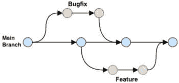
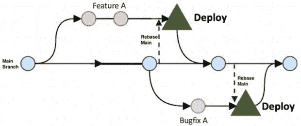

# 第九章：在生产环境中管理微前端

能够在你的本地计算机上开发和测试 Web 应用程序是很好的；然而，当你的应用程序被成百上千的访客访问时，将它们部署到生产环境、维护它们并发布新功能，这需要你的软件开发技能提升到下一个层次。本章将涵盖围绕在生产环境中部署和维护你的微前端的一些关键概念。

在本章中，我们将涵盖以下主题：

+   分支策略

+   版本控制

+   回滚策略

+   功能开关

到本章结束时，你将迈出可靠维护你的微前端应用在生产环境中的第一步。

# 强大软件交付模型的基础组件

当涉及到在生产环境中部署和维护应用程序时，我建议使用 **DevOps 研究和评估的**（**DORA**）软件交付成熟度模型来帮助确定重点关注的领域和你的生产部署流程中应该优化的方面。

重要提示

软件交付成熟度模型讨论了四个关键领域——即 *部署频率*、*变更的领先时间*、*恢复服务的时间* 和 *变更失败率*，这些被分类为 *精英*、*高*、*中* 和 *低*。你可以在 *DevOps 2021 状态报告* 中了解更多详细信息：[`dora.dev/publications/pdf/state-of-devops-2021.pdf`](https://dora.dev/publications/pdf/state-of-devops-2021.pdf)。你还可以在 [`dora.dev/publications/`](https://dora.dev/publications/) 和 [`cloud.google.com/devops/state-of-devops`](https://cloud.google.com/devops/state-of-devops) 注册并查看其他报告。

我们将探讨几个关键组件，这些组件有助于你创建正确的基石，确保随着你的团队在部署和管理微前端方面获得更多信心，你能够提升成熟度模型。

## 分支策略

我认为，分支策略是帮助你提高 *部署频率* 和 *变更的领先时间* 这两个关键指标的最重要组成部分。

GitFlow 和 GitHub Flow 是两种基于 Git 的版本控制系统流行的分支策略，每种策略都有其优势和劣势。

GitFlow 是一种分支模型，使用两个长期存在的分支，`main` 和 `develop`，以及功能、发布和热修复分支。

另一方面，GitHub Flow 是一种更简单、更灵活的分支策略，适用于较小的团队和项目。它围绕一个单一的 `main` 分支，通常是 `master` 或 `main`，并鼓励开发者在功能分支中进行更改，然后通过拉取请求合并到 `main` 分支。

在我们看来，当与微前端和单仓库一起工作时，GitHub Flow 是唯一可行的分支策略。这主要是因为以下原因：

+   **简单性**：GitHub Flow 通过在**main**分支上强制执行单一、线性的历史记录来简化开发过程。每个功能、错误修复或改进都是在从**main**创建的单独分支上开发的，一旦准备就绪，就将其合并回**main**。除了**main**之外，没有长期存在的分支，避免了管理、同步和维护多个长期分支的复杂性。

+   **更改隔离**：在单仓库中，确保对某个项目的更改不会无意中影响另一个项目至关重要。GitHub Flow 为每个新功能或错误修复使用隔离分支的做法有助于限制更改的范围，减少跨项目干扰的风险。

+   **持续集成/持续部署**（**CI/CD**）：GitHub Flow 的设计考虑了持续部署（CD）。在单仓库（monorepos）中，这可以带来更大的益处。由于所有项目都生活在同一个仓库中，因此更容易确保所有更改都经过测试并一致部署。

+   **减少合并冲突**：在 Git Flow 这样的策略中，更改通常在合并到`main`之前先合并到`develop`或`release`分支，这可能导致代码编写和部署之间的显著延迟。在快速发展的单仓库中，这可能导致复杂的合并冲突。GitHub Flow 通过鼓励频繁直接合并到`main`来减轻这一点。

当使用 GitFlow 工作时，我们也看到，根据你是在积极开发还是发布第一次生产部署后，稍微改变代码合并到`main`的方式是有益的。

### 在积极开发期间

在项目的积极开发阶段，团队成员勤奋地生成功能分支，只有在拉取请求（pull requests）获得必要的批准后，才将它们合并回`main`分支。在合并到`main`分支之前，对每个拉取请求启动一系列自动单元测试是常见做法，这可能是 CI 构建的一部分。此外，每晚在`main`分支上执行一系列集成和端到端测试也是首选的做法。这种常规做法有助于确保`main`分支上的任何中断都能被及时识别和纠正。

让我们看看 GitHub Flow 在积极开发期间的分支和合并工作流程：



图 9.1 – 积极开发期间的分支和合并策略

如您所见，使用 GitHub Flow，分支和合并相当直接。开发者从`main`分支分叉，然后合并回`main`。

### 在第一次发布到生产后

在您首次生产版本发布之后，合并策略经历了一种微妙的变化。团队继续从`main`分支创建功能分支，就像以前一样；然而，在功能测试和批准之后，过程发生了分歧。经过测试的功能版本与`main`分支进行 rebase，打上标签并直接从功能分支部署到生产环境中。只有当生产环境中的稳定性得到确认后，功能分支才会合并到`main`分支。

以下工作流程将有助于说明这个过程：



图 9.2 – 首次发布后的分支和发布

正如您在*图 9.2*中可以看到的，部署功能、错误修复或热补丁的过程是相同的，保持了简单性。这里的一个关键步骤是在您部署功能或错误之前重新 base`main`分支。

虽然这可能听起来不寻常，但坚持这种方法有几个好处，如下所示：

+   **main**分支始终反映生产环境中的稳定、当前版本。

+   团队有机会迅速解决和解决在功能部署期间遇到的任何小问题，在将其合并到**main**分支之前稳定发布。

+   这消除了在发布稳定之前禁止向**main**分支提交的必要性，这在执行多个每日部署时是一种不切实际的战略。

+   由于**main**分支始终与当前生产版本保持一致，因此部署功能或热补丁的过程保持一致。

+   由于所有合并到**main**分支的操作都是在发布之后，因此破坏**main**分支的可能性显著降低。这种中断可能会阻碍大型开发团队，并停止进一步的部署，直到问题得到解决。

在 GitHub Flow 的背景下，重要的是要注意以下几点：

+   在部署您的功能分支之前，请确保从**main**分支进行最终的 rebase。这确保了您的功能分支包含了在您的功能开发期间执行的所有先前部署。

与公众的看法相反，GitHub Flow 开发并不仅限于小型 2-3 人团队。实际上，对于在小型、专注的小队或 pod 中运作的大型团队来说，它具有明显的优势。

## 微应用的版本控制

将应用程序部署到生产环境的版本控制是标准做法，并且有不同方式来定义版本控制策略。版本控制从许多方面都很重要；它有助于管理变更日志并将不同的功能和错误映射到构建中。它还有助于回滚策略。

`MAJOR.MINOR.PATCH`。

这种结构不仅帮助用户理解新发布中变化的本性，还有助于软件系统中的依赖关系管理。

我们推荐的战略是使用 SemVer 作为指南。每个微应用都应该遵守自己的版本规则，确保任何对应用程序公共特性的更改都反映在其版本号中。微应用可以在每次有重大功能发布、小功能发布或错误修复更改时，按照 `MAJOR.MINOR.PATCH` 模式增加其版本号。我们建议在语义版本前加上应用程序名称——例如，`catalog-2.8.3` 将意味着以下内容：

+   **微应用名称**：**catalog**

+   **主版本号**：2

+   **次版本号**：8

+   **路径/错误修复版本号**：3

对于管理标签的简单方法，每次你在处理一个发布版本时，我们建议创建一个发布分支，例如 `releases/catalog-2.0.1`。

一旦发布经过测试并准备部署，我们可以这样标记它：

+   **git** **tag catalog-2.0.0**

+   **git push** **origin catalog-2****.0.0**

使用 CI/CD 管道，我们可以设置它在新标签检测到时自动触发测试环境的部署。

注意，虽然 SemVer 的官方定义使用术语 *重大变更* 来定义主版本号，但在微前端和模块联邦中，我们实际上无法有重大变更。因此，对于我们来说，包含重大功能发布的微应用将需要增加主版本号。

在多个微应用和频繁发布的常见场景中，团队中的每个人都知道哪个微应用的哪个版本目前在生产中可能会变得具有挑战性。一个简单的解决方案是在每个微应用中有一个 `/versions` 路由，它会显示当前版本号、发布日期、发布分支等信息。这对于试图在生产环境中调试问题的开发者来说非常有帮助。

这里是一个 `/versions` 路由上的信息示例：

```js
{
appName: Catalog
branchName: release/catalog-2.0.0
tagName: catalog-2.0.4
deployedDate: Thu 25 May 2023 13:34:04 GMT
}
```

对于大量微应用或频繁发布，手动标记每个版本可能会变得繁琐。你可能想要考虑使用脚本来自动化这个过程。以下是一个 `bash` 脚本的示例：

```js
# Microfrontend names
MICROFRONTENDS=(home catalog checkout)
for i in ${MICROFRONTENDS[@]}
do
  cd apps/$i
  # Fetch latest tags
  git fetch --tags
  # Get latest version from Git
  VERSION=$(git describe --tags `git rev-list --tags --max-count=1`)
  # Increment version
  npm version patch
  # Add release notes
  git commit -am "Release v$VERSION [skip ci]"
  # Tag commit
  git tag v$VERSION
  # Push changes
  git push --follow-tags origin main
  # Build microfrontend
  pnpm run build
done
```

在前面的代码中，你会注意到脚本会遍历 `apps` 文件夹中的每个微应用，使用 `git describe` 和 `git rev-list` 命令从 `git` 中获取最新的标签，运行 `npm version` 命令来更新版本号，然后将更新的标签提交并推送到 `git`。

我们还可以使用 `semantic-release` 或 `standard-version` 等工具。这些工具根据提交信息自动化版本管理和变更日志的生成。

版本控制和标记微应用对于确保所有利益相关者对当前生产中每个微应用的版本状态有清晰的认识至关重要。正如我们将在下一节中看到的，它在回滚策略中也发挥着关键作用。

# 回滚微应用

回滚策略是管理任何生产软件的关键组成部分。这影响了*恢复服务时间*指标。

微前端的回滚策略集中在当部署期间或部署后出现问题时，能够将特定的微应用或整个系统回滚到之前稳定状态的能力。*得益于微前端的独立性，回滚不一定影响整个应用程序，但可以针对有问题的组件，从而减少整体* *系统中断*。

最简单的回滚策略涉及利用版本控制系统，如 Git，以及 CI/CD 管道。在这种配置中，每个微前端都有特定的标记版本，这些版本被存储起来，如果需要可以重新部署。例如，如果当前版本的微前端是`catalog-1.2.3`，并且检测到问题，您可以通过触发 CI/CD 管道中的相应部署，快速回滚到之前的稳定版本`catalog-1.2.2`。

此外，利用蓝绿部署策略可能也很有效。在这种方法中，维护两个环境——蓝色和绿色。当其中一个环境（蓝色）服务于实时流量时，另一个环境（绿色）处于空闲状态或正在为下一个发布做准备。如果绿色环境在部署后出现问题，您可以快速切换回蓝色环境，有效地回滚更改。

由于 Kubernetes 声明式特性和内置的版本控制机制，Kubernetes 中的回滚非常简单。当创建新的部署时，Kubernetes 会自动为其版本化并存储其详细信息。如果新版本出现问题时，您可以使用`kubectl rollout undo`命令快速回滚到之前的版本。例如，如果您发现名为`deployment/catalog`的部署存在问题，您可以使用`kubectl rollout undo deployment/catalog`命令进行回滚。Kubernetes 将优雅地回滚部署到之前的稳定版本，而无需停机，使其成为管理微前端架构中回滚的强大工具。

在回滚微应用时，重要的是要意识到与后端 API 的任何不兼容性，以及相应的后端 API 是否也需要回滚。

有时回滚可能会很痛苦，而通过发布新功能或微应用的版本，并使用功能开关来减轻回滚的需求，这将在下一节中介绍。

# 带有功能开关的微应用部署

功能开关，也称为功能标志，是一种强大的技术，允许在运行时打开或关闭单个功能，而无需重新部署。这在微前端架构中尤其有用，因为它使得可以在多个微应用之间独立发布和控制微应用。

使用功能开关，团队可以将新功能部署到生产环境中，但它们在准备好发布之前“隐藏”在开关后面。这允许在实时环境中进行广泛的测试，并启用渐进式交付技术，如金丝雀发布或 A/B 测试。如果新功能出现任何问题，可以通过功能开关快速“关闭”，有效地减轻影响，而无需进行全面回滚或重新部署。

Unleash ([`www.getunleash.io/`](https://www.getunleash.io/)) 是一个流行的开源功能开关工具。

功能开关可用于为不同用户提供不同的体验。例如，您可以使用它们有选择地启用特定用户组的特征，如测试人员或付费用户。

然而，功能开关需要谨慎管理，以避免过时开关的积累，这可能导致代码复杂性和技术债务。定期审计和清理功能开关应成为开发过程的一部分。

通过这一点，我们来到了本节的结尾，它涵盖了管理生产中微前端的一些基础元素。这与其他章节中我们看到的内容相辅相成，关于将微前端部署到云中，并最终帮助减少在生产中部署和维护应用程序的整体压力。

# 摘要

在我们结束本章之前，让我们快速总结一下到目前为止我们所学的知识。我们学习了 DORA 的软件交付性能指标：*部署频率*、*变更的领先时间*、*恢复服务的时间*和*变更失败率*。然后我们查看了一些团队需要关注的基础元素，以确保他们为成功做好准备。

我们学习了分支策略，并了解到 GitHub Flow 是首选的分支策略。我们还了解了在软件构建时与部署时的流程细微差别。

我们学习了正确版本化我们的微应用的方法。我们还学习了回滚策略的重要性以及微前端如何帮助最小化爆炸半径。最后，我们学习了功能开关以及我们如何可以通过功能开关逐步将新微应用发布到生产环境中，更重要的是，如果存在问题。

在下一章中，我们将探讨在构建微前端时需要避免的一些常见陷阱。
