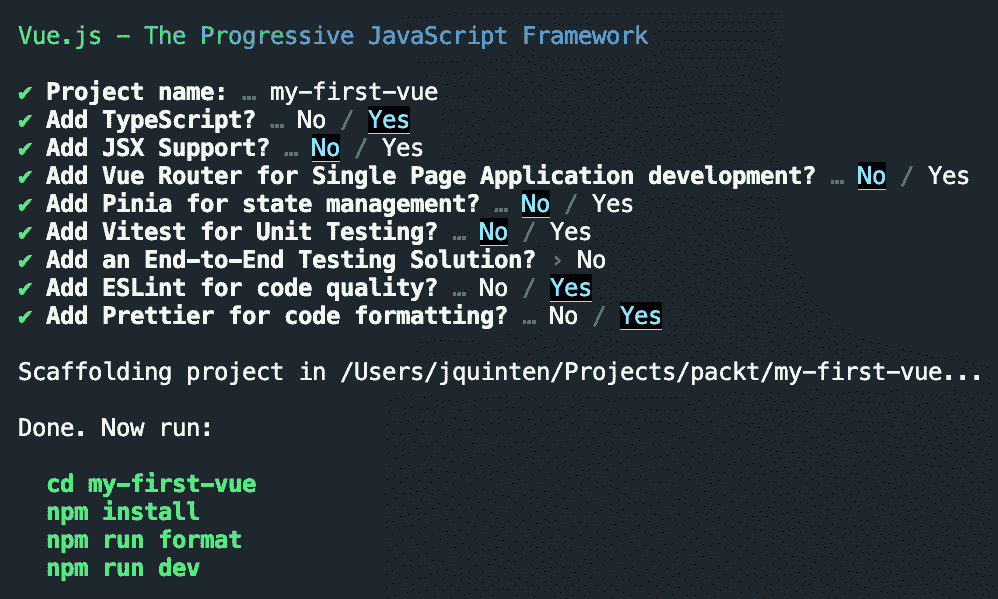
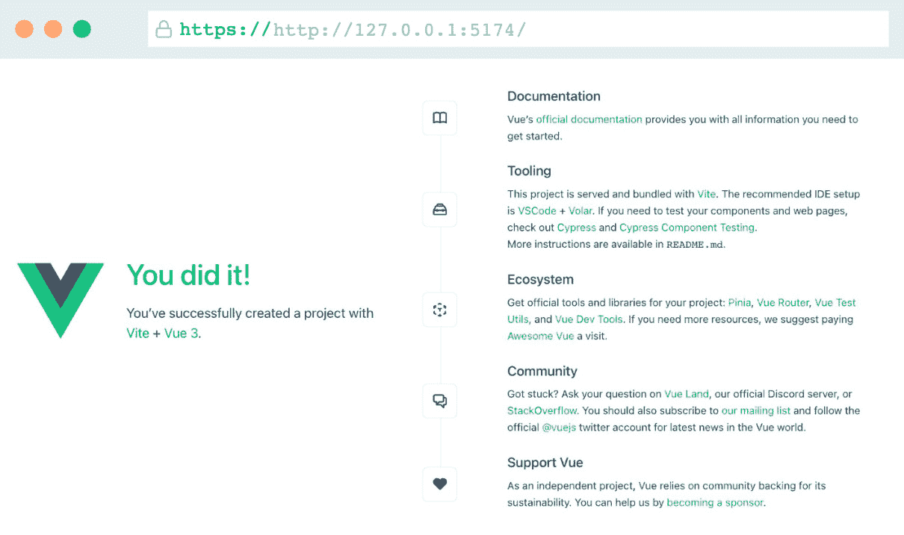
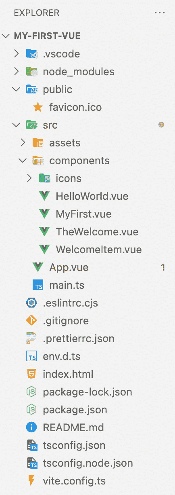

# 第一章：Vue.js 简介

这本书将使你熟悉目前最受欢迎的现代前端框架之一：**Vue.js**。现代框架使得向静态网页添加交互性变得容易，并可以帮助你构建完整的网络应用程序！

后者正是你在阅读本书时会学习到的内容。你将学习适合特定用例的不同技术，这将导致一系列可供展示的项目集合。

在你开始构建项目之前，我们将看看我们将构建这些项目的背景。在本章中，我们将使用最佳实践来设置开始任何 Vue.js 项目的环境。

在本章中，我们将涵盖以下主题：

+   Vue.js 的需求

+   需求和工具

+   设置开发环境

+   我的第一个应用程序

# 技术要求

在我们开始之前，我们需要确保我们已经满足了安装和运行 Vue.js 以及开发应用程序的所有要求。熟悉 HTML、CSS、JavaScript 以及 TypeScript 是理解这些技术之上的概念所必需的。

为了我们能够在本地运行 Vue.js，我们需要安装 Node.js ([`nodejs.org/en/download`](https://nodejs.org/en/download))。这是在开发机器上运行 JavaScript 的运行器。

# Vue.js 的需求

目前有大量的前端框架可供选择，这是一个不断发展和变化的领域。在这个时候，Vue.js 生态系统是一个非常成熟的领域，它提供了许多基于它的插件和工具。

Vue.js 是一个由世界各地的人们维护和开发的开源项目，它是一个社区驱动的项目。它最初是由 Evan You 的个人副项目发展而来，并已经成长为一个被各种类型的组织广泛采用的框架，例如 NASA、苹果、谷歌和微软。由于得到了公司和个人的赞助，Vue.js 是一个独立的框架。

Vue.js 目前处于第 3 版，与之前的版本相比有重大变化，尽管大多数模式仍然适用。Vue.js 3 支持所有 ES2015 兼容的浏览器。

让我们看看选择 Vue.js 构建网络应用程序的一些原因：

+   它的性能出色，因为它是从底层开始优化的。

+   它轻量级，可摇树（tree-shakeable），只包含运行应用程序所需的代码。经过构建步骤优化后的最小代码（大小约为 16 KB）。

+   它具有高度的可扩展性，使用如单文件组件和组合式 API 等首选模式，这使得它适合企业级应用。

    **单文件组件** 是 Vue.js 哲学的一部分，其中组件的模板、脚本和样式封装在一个单独的文件中，目的是提高代码的组织、可读性和可维护性。

    **组合式 API** 允许在整个应用程序中对代码进行更好的组织和重用，这使得代码更加模块化且易于维护。

在所有这些好处之上，对于入门级开发者来说，学习曲线非常容易上手。由于其语法与经典的 HTML、JavaScript 和 CSS 表示法相似，因此很容易开始并找到自己的路径。

在本章中，我们将引导你完成初始设置，并介绍你可以用作所有未来 Vue.js 项目样板的所有步骤和设置。我们将采用推荐的设置，以确保你从一开始就能学习和应用最佳实践。

我们首先确保你设置了开发者环境，这样你就可以开始创建交互式网络应用程序！

# 需求和工具

为了高效地开始 Vue.js 开发，我们需要确保你能够合理地运行和编辑代码。虽然技术上可以使用来自**内容分发网络**（**CDN**）的库来运行代码，但这对于实际应用来说并不推荐。正如官方文档（[`vuejs.org/guide/introduction.html`](https://vuejs.org/guide/introduction.html)）也指出，这里不涉及构建设置，其缺点是这种设置不支持单文件组件语法，并且让你在应用程序的优化（如编译、压缩和懒加载）方面几乎没有控制权。

在这本书中，我们将使用 Vue.js 的 `npm` 包，然后使用它来搭建起始项目以构建。我们将使用命令行启动所有项目。要使用 `npm` 包，你需要安装 Node.js（一个 JavaScript 运行时环境）。请确保安装至少 Node.js 版本 18。npm 是一个公共仓库（[`www.npmjs.com/`](https://www.npmjs.com/)），开发者在这里发布、共享和使用 JavaScript 包。

你可以从 [`nodejs.org/en`](https://nodejs.org/en) 下载 Node.js。你可以通过打开**命令行界面**（**CLI**）并输入以下内容来确认正确安装了版本：

```js
node -v
```

应该返回类似以下内容：

```js
v18.0.0
```

总是可以在没有任何本地安装的情况下开发和实验。我们可以转向基于网络的平台来实现这一点。这些环境提供了开箱即用的沙箱环境，并具有合理的预设。这意味着它们通常配置为使用官方文档中推荐的设置。它们提供的控制较少，并且在更具体的用例中有些受限。然而，如果你想要尝试一些概念，它们是非常有价值的。

## 在线资源

Vue.js 提供了一个在线开发沙盒，[`sfc.vuejs.org/`](https://sfc.vuejs.org/)，但我想要指出**StackBlitz**（[`stackblitz.com/`](https://stackblitz.com/)），在那里你可以实例化在浏览器中运行的完整开发环境。虽然它对于部署应用程序没有用，但这是一种测试概念证明或将其用作小型沙盒的极好方式。

你只需注册，开始一个新项目，并选择一个 **Vue.js 3** 模板即可开始。代码示例将在 GitHub 上提供，你可以克隆或分叉存储库以验证你的代码与工作示例的一致性。

为了方便查阅，Vue.js 文档([`vuejs.org/guide/introduction.html`](https://vuejs.org/guide/introduction.html))非常易于访问，并提供了所有可能上下文的逐步解释。我肯定会推荐你查看它们，以更深入地了解我们将要讨论的主题。

一旦你参与到 Vue.js 社区中，你会发现它是一个非常有帮助、支持性强且友好的社区。再次强调，官方 Vue.js 网站提供了一些指导([`vuejs.org/about/community-guide.html`](https://vuejs.org/about/community-guide.html))。

欢迎加入社区，现在让我们开始吧！

# 设置开发环境

编写和编辑代码有许多方法，随着时间的推移，你将找到最适合你的流程。对于这本书，我们将使用通常推荐的设置开始。请随意进行对你有用的更改。

Vue.js 开发在一个环境中进行，这个环境允许你通过突出显示正确代码并帮助你捕捉在保存更改之前出现的错误来高效地编写代码。调试和验证代码可以在多个阶段进行，但在这个书籍的范围内，我们将使用开发界面以及浏览器环境。

让我们从安装一个广泛使用的开发界面开始。

## 集成开发环境

**集成开发环境**（**IDE**）通过支持语法高亮、格式化和与所选框架集成的插件等辅助工具，帮助你编写和编辑代码。任何现代编辑器都可以，但在这本书中，我们将使用微软的 **Visual Studio Code**（**VSCode**），它是免费使用的，并提供良好的开发者体验；可以从 [`code.visualstudio.com/`](https://code.visualstudio.com/) 下载。

在安装 IDE 之后，我推荐以下插件，这些插件可以让开发者的体验变得更加愉快：

+   **Vue 语言特性**（**Volar**）：支持 Vue.js 3 片段的标记和突出显示

+   **Vue Volar 扩展包**：添加一些推荐的插件，帮助在编码时自动化一些琐事

+   **更好的注释**：用于在代码中更好地标记注释

+   **缩进彩虹**：为缩进的代码块应用颜色，以快速识别缩进级别

Vue.js 可以使用许多其他 IDE 进行开发，其他 IDE，如 WebStorm、Sublime Text、Vim/NeoVim 和 Emacs。选择适合你的，记住，截图将使用之前描述的推荐 VSCode 设置进行展示。

## Vue.js DevTools

今天的浏览器都内置了工具，允许网络开发者检查和操作网页的 HTML、CSS 和 JavaScript 代码，测试和调试他们的代码，测量页面性能，并模拟各种设备和网络条件。

macOS 用户可以使用 *Cmd* + *Option* + *I* 打开 DevTools。Windows 或 Linux 用户可以使用 *Ctrl* + *Shift* + *I*。

值得注意的是，当你检查浏览器中的元素时，你将看到的元素是 Vue.js 渲染的元素！如果你检查浏览器的源代码，你将只看到应用的挂载点。这是虚拟的**文档对象模型**（**DOM**）在起作用，我们将在稍后对此进行澄清。

由于 Vue.js 通常在浏览器环境中运行，使用 DevTools 是一项与编写干净代码一样有价值的技能。对于基于 Chromium 的浏览器和 Firefox，Vue.js 提供了一个标准插件。

Vue.js DevTools 插件可以帮助你在浏览器中运行时检查和操作 Vue.js 组件。这将有助于定位错误并更好地理解应用状态是如何转换为**用户界面**（**UI**）的。

注意

你可以在此处找到更多信息并安装插件：[`vuejs.org/guide/scaling-up/tooling.html#browser-devtools`](https://vuejs.org/guide/scaling-up/tooling.html#browser-devtools)。

我们将在稍后的阶段深入探讨 Vue.js DevTools。到目前为止，我们已经满足了启动任何规模（无论是小型还是大型）的 Vue.js 应用的所有要求。它们都满足相同的基本要求。

到目前为止，你可能已经迫不及待地想要开始第一个项目了，所以让我们创建一个小型应用来熟悉开发过程。

# 我的第一款应用

让我们通过创建我们的第一个 Vue.js 应用来检验我们所获得的工具和知识，怎么样？

你通常会先打开 CLI 并导航到你想要开始项目的文件夹。输入以下命令将使用官方的 `create-vue` 工具创建一个新的空项目：

```js
npm init vue@latest
```

按 *y* 继续操作，将 `my-first-vue` 作为项目名称，并选择以下图中显示的选项：



图 1.1 – 使用 Vue CLI 使用预设搭建应用

我们选择了 TypeScript 作为 JavaScript 的超集，它增加了静态类型。我们还启用了 ESLint 和 Prettier。ESLint 检查语法错误、格式问题和代码风格不一致，甚至可以与你的 IDE 集成，以视觉方式标记有问题的代码。Prettier 用于强制执行一致的代码风格。这三个选项通过在运行代码之前突出显示潜在问题来增强开发者的体验。

然后，按照说明，你可以进入创建的文件夹，并输入 `npm install` 来安装所需的依赖项。这将从 `npm` 注册表中下载所需的包文件，并将它们安装到项目的 `node_modules` 子文件夹中。

如果你运行 `npm run dev`，项目将启动一个开发服务器，你可以通过浏览器访问它。通常，本地地址将类似于 `http://127.0.0.1:5173/`。

如果你在这个浏览器中打开那个 URL，你应该能看到你的第一个 Vue.js 应用程序！默认情况下是一个空的起始项目，其中包含了许多我们到目前为止已经覆盖的指针和链接，但对于任何开始使用 Vue.js 的开发者来说，这是一个很好的起点。



图 1.2 – 你的第一个 Vue.js 应用程序！

在成功安装后，我们可以更仔细地看看实际上安装了什么。让我们深入了解安装文件！

## 在 IDE 中的项目

现在，如果你在你选择的 IDE 中打开项目，你会注意到一个预定的结构。这适用于所有以这种方式构建的项目。让我们快速看一下结构：



图 1.3 – 起始应用的展开文件夹结构

在项目的根目录下，你会找到一些特定于配置项目的文件类型。这里的主要文件是 `index.html` 和 `package.json`。`index.html` 文件是应用的入口点。它是一个轻量级的 HTML 模板，包含一个 `div` 元素，该元素的 `id` 将成为应用的挂载点。

`package.json` 文件是一个描述项目作为包的文件，定义了可以执行的节点脚本，并包含了项目所依赖的所有包的引用。`node_modules` 文件夹是包含从 `package.json` 文件中安装的所有包的文件夹。从这个目的来看，它可以被认为是一个只读文件夹。

然后我们有 `public` 和 `src` 文件夹。`public` 文件夹包含静态资源，如字体、图像和图标，这些资源不需要由构建系统处理。在起始项目中，你会找到一个默认的 `favicon.ico`。

最后，`src`（代表源文件）文件夹是我们将进行最多更改的文件夹。目前它包含两个根文件。`main.ts` 文件注册 Vue 应用程序并应用样式，并将其挂载到 HTML 模板上。

`App.vue` 文件是 Vue.js 应用的入口点。如果你打开它，你可能会在单个文件中找到一些熟悉的语法混合，例如脚本标签、HTML 和 CSS。我们稍后会详细介绍。

它还包含一个与`public`文件夹类似的`assets`文件夹，不同之处在于这些文件夹可以被并且将被构建系统处理。最后，还有`components`文件夹，你可以将构成应用程序的组件放在这里。如果你采用单文件组件，每个组件都将承担特定的角色，并封装模板、脚本和样式。你已经开始看到一些组件，它们构成了默认的起始页面。

## 您的第一步编码

让我们创建第一个组件并将其添加到应用程序中：

1.  在`components`文件夹中创建一个名为`MyFirst.vue`的新文件。

    Vue.js 组件最好使用至少两个驼峰式命名的单词来命名，通常由`script`、`template`和`style`块组成。这些都不是强制性的（尽管没有上下文的话，`style`块几乎没有价值）。

1.  让我们创建一个小 HTML 片段：

    ```js
    <template>    <div>My first <span>Vue.js</span> component!</div></template>
    ```

1.  在`App.vue`中，你可以将其作为 Vue.js 组件使用！如果你打开它，你会看到一个带有`import`语句的`script`标签。你可以移除`TheWelcome`导入行，并用以下内容替换它：

    ```js
    import MyFirst from './components/MyFirst.vue'
    ```

1.  接下来，在`template`标签中，你可以移除类似 HTML 的`<TheWelcome />`标签，并用`<MyFirst />`HTML 标记替换它。

    如果你仍在运行代码，你会注意到浏览器已经更新了自己以反映这些更改。这被称为热重载，使得开发流程更加顺畅。如果你已经停止了进程，你可以重新启动它，并在浏览器中重新访问页面。

    你应该能看到你创建的组件！

1.  让我们在组件中添加一个样式块，添加一些 CSS，并查看热重载的效果。在`MyFirst.vue`文件中，在`template`块下方添加以下代码：

    ```js
    <style scoped>div {  color: #35495f;  font-size: 1.6rem;}span {  color: #41b883;  font-weight: 700;}</style>
    ```

    样式块的内容将被像正常 CSS 文件一样处理。`scoped`属性意味着`div`和`span`样式定义仅限于这个组件。Vue 会给虚拟 DOM 添加一个唯一的数据属性，并将 CSS 规则附加到该属性。在`App.vue`中，你可以看到也支持全局样式。

在浏览器中，你会看到组件自己更新以应用新的样式！现在我们已经熟悉了开发环境，我们将在下一章开始创建一个更具交互性的组件。

# 摘要

到目前为止，你已经准备好开始使用 Vue.js 进行开发了。我们已经完成了本地环境的设置，并使用了推荐的脚手架方式来创建一个新的起始项目。

在下一章中，我们将更详细地探讨一些 Vue.js 概念（例如响应性），并学习使用官方工具检查我们的应用程序。每一课都将介绍在开发中应用的新概念。
