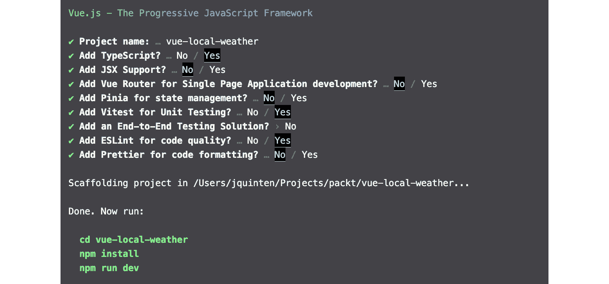

# 3

# 构建本地天气应用程序

现在我们能够构建一个小型应用程序，我们可以添加更多复杂性。在这种情况下，我们将探讨包括另一个浏览器 API，并将其与外部数据源结合用于我们的应用程序。我们将构建一个小型天气应用程序，返回当前天气。

我们将开始应用不同的样式方法，选择 Tailwind 作为我们的 CSS 框架，并且为了提供额外的稳健性，我们还将考虑在我们的应用程序中包含一些测试。

在本章中，我们将涵盖以下主题：

+   与来自不同类型 API 的外部数据合作

+   如何处理异步数据

+   将 Tailwind 应用于快速样式化任何应用程序

+   通过为功能添加单元测试来确保稳定性

让我们看看我们需要满足哪些要求才能使我们的应用程序运行起来。

# 技术要求

对于本章，我们将使用第三方 API 为我们提供实际数据。我们需要在[`www.weatherapi.com/`](https://www.weatherapi.com/)注册一个账户，并检索用于我们应用程序的 API 密钥。

我们将添加 Tailwind CSS 来为我们的应用程序应用样式。[`tailwindcss.com/`](https://tailwindcss.com/)网站提供了广泛的文档以及安装指南。

对于我们的单元测试，我们将使用 Vitest 框架：[`vitest.dev/`](https://vitest.dev/)。

您可以在以下位置找到源代码：[`github.com/PacktPublishing/Building-Real-world-Web-Applications-with-Vue.js-3/tree/main/03.weather`](https://github.com/PacktPublishing/Building-Real-world-Web-Applications-with-Vue.js-3/tree/main/03.weather)。

# 初始化应用程序

让我们从为 Vue.js CLI 启动器设置一个稍微不同的配置开始：

```js
npm init vue@latest
```

按`y`继续，选择`vue-local-weather`作为项目名称，并选择以下截图所示的选项：



图 3.1 – 本地天气应用程序的设置配置

在遵循安装依赖项和清理默认文件的说明后，我们可以开始工作！

# 与不同类型的 API 合作

为了检索本地天气，我们需要一种获取位置的方法。我们将使用的天气服务接受不同类型的位置数据，但在这个例子中我们将使用纬度和经度。

浏览器的地理位置 API 能够提供所需的信息真是太方便了！让我们先构建一个组件，请求这些信息并将其显示在用户界面上。

让我们在`components`文件夹中创建一个名为`GetLocation.vue`的文件。我们将在`script`标签中导入 Vue.js 的实用工具，并定义预期可用的数据：

```js
<script lang="ts" setup>import { ref } from "vue";
import type { Ref } from "vue";
type Geolocation = {
  latitude: number;
  longitude: number;
};
const coords: Ref<Geolocation | undefined>= ref();
</script>
```

现在，我们说我们期望响应式属性 `coords` 包含纬度和经度。没有什么特别的。让我们编写一个函数来从地理位置 API（[`developer.mozilla.org/en-US/docs/Web/API/Navigator/geolocation`](https://developer.mozilla.org/en-US/docs/Web/API/Navigator/geolocation)）获取数据。现在，请注意，用户可以拒绝访问此 API，因此我们还需要一个后备方案。

我们将添加一个响应式布尔属性 `geolocationBlockedByUser` 来跟踪调用 API 的成功情况，以及一个执行实际调用的函数：

```js
<script lang="ts" setup>import { ref } from "vue";
import type { Ref } from "vue";
type Geolocation = {
  latitude: number;
  longitude: number;
};
const coords: Ref<Geolocation | undefined> = ref();
const geolocationBlockedByUser: Ref<boolean> = ref(false);
const getGeolocation = async (): Promise<void> => {
  await navigator.geolocation.getCurrentPosition(
    () => {},
    (error: { message: string }) => {
      geolocationBlockedByUser.value = true;
      console.error(error.message);
    }
  );
};
</script>
```

这里有几个问题。`getGeolocation` 函数正在被定义，因为它依赖于用户输入，所以它默认是一个异步函数。它返回的承诺是空的，因为我们使用 `successCallback` 来更新我们的响应式属性。

目前这部分是空的，但我们在下一步中会添加它。`errorCallback` 函数仅在无法获取地理位置时被调用，目前我们假设用户拒绝了使用。因此，我们将 `geolocationBlockedByUser` 的值设置为 true 并将错误记录到控制台。

查看文档（[`developer.mozilla.org/en-US/docs/Web/API/Geolocation_API/Using_the_Geolocation_API#getting_the_current_position`](https://developer.mozilla.org/en-US/docs/Web/API/Geolocation_API/Using_the_Geolocation_API#getting_the_current_position)），我们看到 `getCurrentPosition` 返回一个对象（位置），该对象在 `coords` 属性上持有纬度和经度。由于我们的 `coords` 响应式属性期望纬度和经度，我们按照以下方式处理来自 API 的数据：

```js
const getGeolocation = async (): Promise<void> => {  await navigator.geolocation.getCurrentPosition(
    async (position: { coords: Geolocation }) => {
      coords.value = position.coords;
    },
    (error: { message: string }) => {
      geolocationBlockedByUser.value = true;
      console.error(error.message);
    }
  );
};
```

目前一切正常，但函数尚未执行。就像在上一章中一样，我们将使用 `onMounted` 钩子来在组件被挂载到 DOM 上时执行该函数。整个 `script` 标签现在应该看起来像这样：

```js
<script lang="ts" setup>import { ref, onMounted } from "vue";
import type { Ref } from "vue";
type Geolocation = {
  latitude: number;
  longitude: number;
};
const coords: Ref<Geolocation | undefined> = ref();
const geolocationBlockedByUser: Ref<boolean> = ref(false);
const getGeolocation = async (): Promise<void> => {
  await navigator.geolocation.getCurrentPosition(
    async (position: { coords: Geolocation }) => {
      coords.value = position.coords;
    },
    (error: { message: string }) => {
      geolocationBlockedByUser.value = true;
      console.error(error.message);
    }
  );
};
onMounted(async () => {
  await getGeolocation();
});
</script>
```

让我们快速添加一个模板块，以渲染如下输出：

```js
<template>  <div v-if="coords && !geolocationBlockedByUser">{{ coords.latitude }} {{ coords.longitude }}</div>
  <div v-if="geolocationBlockedByUser">User denied access</div>
</template>
```

将组件添加到 `App.vue` 中只需导入组件并在模板上渲染它：

```js
<script setup lang="ts">import GetLocation from "./components/GetLocation.vue";
</script>
<template>
  <GetLocation />
</template>
```

使用 `npm run dev` 启动我们的开发服务器。现在，如果你在浏览器中打开应用，你应该会看到一个浏览器弹出窗口请求分享你的位置权限。如果你允许访问，你应该会看到浏览器确定的你的坐标（结果可能不同）。如果你拒绝了访问，你应该会看到一个消息说明你已拒绝。

注意

如果你仔细检查控制台，可能会注意到一个警告：**仅对用户手势做出响应请求地理位置信息**。立即尝试收集地理位置信息通常被认为是一种反模式或是不礼貌的行为。并非所有浏览器都会始终显示确认对话框，这可能导致用户在不了解的情况下泄露信息！

正确的做法是在模板中添加一个按钮，使用 `onClick` 指令执行 `getGeolocation` 函数。这样，用户会主动发起地理位置请求。

# 处理第三方 API 的数据

现在我们有了坐标，我们可以开始请求本地化的天气数据。在这个例子中，我们将使用一个公共天气 API ([`www.weatherapi.com/`](https://www.weatherapi.com/))。为了使用这项服务，我们需要请求一个 API 密钥。如果你注册一个账户，免费层每月允许你进行 1,000,000 次请求，这应该绰绰有余！

将这类访问密钥或秘密存储在本地环境变量文件中是一种常见做法。这种做法允许我们的构建过程将本地开发操作与我们的生产环境分离。它将这些变量集中在一个地方，而不是散布在你的应用程序中。

目前，我们将在项目根目录下创建一个名为 `.env` 的文件来存储 API 密钥，内容如下：

```js
VITE_APP_WEATHER_API_KEY=Replace this with the key
```

`VITE_APP_` 前缀确保 Vite 自动将变量暴露给应用程序。

注意

对于基于客户端的 Web 应用程序，密钥默认会暴露，因为它将附加到你可以通过浏览器网络请求检查的 API 调用。对我们来说，这没问题。在一个类似生产的环境中，你可能会通过自己的后端代理请求来隐藏任何秘密。

## 构造 API 调用

拥有我们的令牌后，我们可以开始进行调用。让我们了解我们需要如何构造端点地址来检索我们的相关数据。

使用 API 探索器 ([`www.weatherapi.com/api-explorer.aspx`](https://www.weatherapi.com/api-explorer.aspx))，我们看到我们可以使用位置从服务中获取数据。虽然探索器显示了一个地点名称，但如果我们深入研究请求参数 ([`www.weatherapi.com/docs/#intro-request`](https://www.weatherapi.com/docs/#intro-request))，我们会看到 `q` 参数也接受十进制度数的纬度和经度，例如 `q=48.8567,2.3508`。这正是我们需要的东西！

查看文档后，我们需要类似以下内容：

```js
https://api.weatherapi.com/v1/current.json?key=OUR_SECRET_KEY&q=OUR_LATITUDE_AND_LONGITUDE
```

我们可以通过将此端点作为 URL 粘贴到浏览器中手动调用它，用我们的实际数据替换变量。你应该会看到一个格式化的 JSON 对象，包含你位置的天气数据！现在我们确认一切正常工作后，我们可以将逻辑移动到 Vue 组件中，以便将其包含在我们的应用程序中。

让我们在 `component` 文件夹中创建一个名为 `WeatherReport.vue` 的组件。我们将从 `script` 块开始，首先描述我们将要使用两种类型，并定义这个组件需要的属性（`coords`）：

```js
<script lang="ts" setup>type WeatherData = {
  location: {
    localtime: Date;
    name: string;
    region: string;
  };
  current: {
    temp_c: number;
    temp_f: number;
    precip_mm: number;
    condition: {
      text: string;
      icon: string;
    };
    wind_degree: number;
    wind_kph: number;
    wind_mph: number;
  };
};
type Coords = { latitude: number; longitude: number }
interface Props {
  coords: Coords;
}
const props = defineProps<Props>();
</script>
```

对于 `WeatherData` 类型，我查看了一下 API 返回给我们的内容，只描述了我们感兴趣的属性。在实现时，请随意选择公制或英制单位！`Coords` 类型非常简单，只需持有纬度和经度的数值，我们可以在 `script` 块内部重用该类型，例如，用来描述 `coords` 组件属性。

如果我们想使用端点的响应，我们需要使其变得响应式。我们可以使用 `ref` 来做这件事，并将其映射到一个数据常量：

```js
<script lang="ts" setup>import { ref } from "vue";
import type { Ref } from 'vue'
type WeatherData = {
  …
};
type Coords = { latitude: number; longitude: number }
interface Props {
  coords: Coords;
}
const props = defineProps<Props>();
const data: Ref<WeatherData | undefined> = ref();
</script>
```

在此基础上，我们准备好定义调用函数，使用 fetch API。在函数中，我们将接受一个参数，代表我们请求的坐标。我们将返回数据，以便我们稍后将其映射到我们刚刚创建的 `data` 属性：

```js
<script lang="ts" setup>import { ref, onMounted } from "vue";
import type { Ref } from 'vue'
type WeatherData = {
  …
};
type Coords = { latitude: number; longitude: number }
interface Props {
  coords: Coords;
}
const props = defineProps<Props>();
const data: Ref<WeatherData | undefined> = ref();
const fetchWeather = async (coords: Coords): Promise<WeatherData> => {
  const { latitude, longitude } = coords;
  const q = ${latitude},${longitude};
  const res = await fetch(
 `https://api.weatherapi.com/v1/current.json?key=${
 import.meta.env.VITE_APP_WEATHER_API_KEY
    }&q=${q}`
  );
  const data = await res && res.json();
  return data;
};
onMounted(async () => {
  const { latitude, longitude } = props.coords;
  const weatherResponse = await fetchWeather({latitude, longitude});
  data.value = weatherResponse;
});
</script>
```

如您所见，我们描述了一个返回 `WeatherData` 类型形状的 promise 的 `fetchWeather` 函数。我们使用 `coords` 参数来构造 URL，将其与密钥结合。在请求得到响应后，我们将其转换为 JSON 并返回值。

与我们的 `GetLocation` 组件类似，我们希望立即获取数据，所以我们以类似的方式使用了 `onMount` 钩子。我们将组件属性传递给 `fetchWeather` 函数，并将响应映射到响应式数据变量。

现在我们有了数据，我们可以标记模板来显示信息！我们处理的是异步数据，因此有一个数据仍在加载的 UI 状态。

让我们从向 `WeatherReport.vue` 文件中添加两个状态开始：

```js
<template>  <div>
    <article
      v-if="data && data.current">
      {{ data.current }}
    </article>
    <div v-else>Loading...</div>
  </div>
</template>
```

如果你从服务器得到快速响应，数据应该几乎瞬间显示出来。

现在，让我们看看我们如何以风格构建我们的界面！

# 使用 Tailwind 进行样式设计

**Tailwind CSS** 是一个流行的基于实用工具的 CSS 框架，我们可以通过使用和组合预定义的类来构建和样式化用户界面。由于抽象了 CSS 规则的编写，Tailwind 非常可扩展，这提供了在使用时的一致性和可维护性。让我们看看我们如何将 Tailwind CSS 应用到我们的小型应用中。

安装指南 ([`tailwindcss.com/docs/guides/vite`](https://tailwindcss.com/docs/guides/vite)) 覆盖了我们需要执行的步骤：

1.  首先，我们必须向项目中添加依赖项：

    ```js
    npm install -D tailwindcss postcss autoprefixer
    ```

    我们正在安装 Tailwind，同时也安装了允许 Vite 使用 PostCSS 处理样式的工具。PostCSS 是一个强大的 JavaScript 工具，用于使用 JavaScript 转换 CSS ([`postcss.org/`](https://postcss.org/))。

1.  接下来，我们将初始化 Tailwind 的默认配置：

    ```js
    content property tells the plugin where Tailwind should be applied. The next step is exposing the utility classes of Tailwind to the application.
    ```

1.  在 `./src` 文件夹中创建一个 `style.css` 文件，并在你的开发和构建步骤中添加以下行以导入 Tailwind CSS 实用工具类：

    ```js
    @tailwind base;@tailwind components;@tailwind utilities;
    ```

1.  最后，打开 `./src/main.ts` 文件，将 CSS 文件导入到应用中：

    ```js
    import { createApp } from 'vue'import './style.css'import App from './App.vue'createApp(App).mount('#app')
    ```

请记住，导入的 CSS 文件与您传统上将 CSS 样式表链接到 HTML 文件的方式不同。通过导入它，CSS 文件将成为开发和构建管道的一部分，这允许我们在样式输出之前对样式执行高级操作。

在我们的案例中，我们正在导入 Tailwind CSS 的引用，添加浏览器特定的前缀，并从样式表中删除未使用的类。拥有如此多的控制和力量对于构建高级应用程序来说非常方便！

在我们的设置就绪后，我们可以开始将 Tailwind CSS 应用到我们的应用程序中。Tailwind 使用实用类来定义元素的样式。

## 实用类

基于实用类 CSS 框架的方法是围绕将 CSS 紧密耦合到用户界面，同时抽象底层规则和定义的概念构建的。您现在不是向元素添加一个类名并在该类中应用 CSS 样式，而是向元素添加多个类名来描述 CSS 行为。

元素与其样式之间的紧密耦合关系的好处是它非常易于维护，几乎没有隐藏的规则或副作用影响元素的渲染方式。基础 CSS 文件的大小保持不变；它只是所有实用类的列表。

我们甚至可以移除未使用的样式，因为我们知道在标记中使用哪些类。这比更传统的 CSS 具有更高的可预测性，在传统 CSS 中，样式定义与依赖于该样式的元素之间的关系远没有那么清晰。特别是对于快速原型设计，基于实用性的方法确实非常出色，所以让我们将其付诸实践。

让我们对`index.html`文件进行一些小的修改，以看到 Tailwind CSS 的实际应用。我们将向我们的应用程序挂载的`<div/>`元素添加一个类列表：

```js
bg-gradient-to-b from-indigo-500 via-purple-500 to-pink-500 w-full h-screen flex items-center justify-center
```

Tailwind CSS 的一个优点是其可读性。从标记中，我们可以可视化组件在浏览器中的渲染方式。在这种情况下，背景是一个多色渐变，内容位于页面的水平和垂直中心。要了解更多关于可用的 Tailwind 实用类，官方文档提供了一个所有可用类的综合列表：[`tailwindcss.com/docs`](https://tailwindcss.com/docs)。

文件看起来是这样的：

```js
<!DOCTYPE html><html lang="en">
  <head>
    <meta charset="UTF-8" />
    <link rel="icon" type="image/svg+xml" href="/vite.svg" />
    <meta name="viewport" content="width=device-width, initial-scale=1.0" />
    <title>Vite + Vue + TS</title>
  </head>
  <body>
    <div id="app" class="bg-gradient-to-b from-indigo-500 via-purple-500 to-pink-500 w-full h-screen flex items-center justify-center"></div>
    <script type="module" src="img/main.ts"></script>
  </body>
</html>
```

如果我们现在在浏览器中查看应用程序，我们可以看到这个更改的结果。结合更多的实用类，我们将对从天气 API 获取的数据进行样式化。

让我们转到`WeatherReport.vue`并添加一些样式和 HTML 元素：

```js
<template>  <div>
    <article
      v-if="data && data.current"
      class="max-w-md w-96 rounded-lg shadow-lg p-4 flex bg-white text-black"
    >
      <div class="basis-1/4 text-left">
        
      </div>
      <div class="basis-3/4 text-left">
        <h1 class="text-3xl font-bold">
          {{ data.current.condition.text }}
          <span class="text-2xl block">{{ data.current.temp_c }}&#8451;</span>
        </h1>
        <p>{{ data.location.name }} {{ data.location.region }}</p>
        <p>Precipitation: {{ data.current.precip_mm }}mm</p>
      </div>
    </article>
    <div v-else>Loading...</div>
  </div>
</template>
```

这看起来已经很不错了！看看我们是如何结合 Tailwind 类来确定元素的样式？你可以尝试各种不同的方式来展示数据。

我们有一些预定义的属性尚未映射到模板中。让我们看看它们，因为它们需要一些额外的关注。

## 数据格式化

让我们看看来自服务的时间戳。我们以 `datetime` 字符串的形式接收它。我们可以将其格式化以显示更易读的信息。我们可以简单地使用一个格式化函数将任何日期字符串格式化为我们喜欢的格式。我们将在组件的 `<script>` 块中创建这个函数：

```js
const formatDate = (dateString: Date): string => {  const date = new Date(dateString);
  return new Intl.DateTimeFormat("default", {
    dateStyle: "long",
    timeStyle: "short",
  }).format(date);
};
```

我们使用浏览器的内置 `Intl` 命名空间（[`developer.mozilla.org/en-US/docs/Web/JavaScript/Reference/Global_Objects/Intl`](https://developer.mozilla.org/en-US/docs/Web/JavaScript/Reference/Global_Objects/Intl)）来解释日期信息，并根据浏览器的设置将其返回给用户。现在我们可以在模板中简单地调用该方法：

```js
<template>  <div>
    <article
      v-if="data && data.current"
      class="max-w-md w-96 rounded-lg shadow-lg p-4 flex bg-white text-black"
    >
      <div class="basis-1/4 text-left">
        
      </div>
      <div class="basis-3/4 text-left">
        <h1 class="text-3xl font-bold">
          {{ data.current.condition.text }}
          <span class="text-2xl block">{{ data.current.temp_c }}&#8451;</span>
        </h1>
        <p>{{ data.location.name }} {{ data.location.region }}</p>
        <p>Precipitation: {{ data.current.precip_mm }}mm</p>
        <p>{{ formatDate(data.location.localtime) }}</p>
      </div>
    </article>
    <div v-else>Loading...</div>
  </div>
</template>
```

Vue.js 将括号之间的信息解释为表达式，所以它将只评估 `formatDate` 方法的输出作为渲染信息。

## 自定义样式用例

现在我们剩下关于风的信息：速度和方向。表示风速是直接的：要么选择公制值，要么选择英制值，并在模板中渲染它。表示风向，我们可以通过使用指向特定方向的箭头来使其更易于用户理解。

对于这样一项专业操作，最好是创建一个新的组件。我们先创建一个名为 `WindDirection.vue` 的组件。它将接收一个名为 `degrees` 的数值属性。我们将使用这个属性来创建一个动态（计算）样式，根据输入来决定：

```js
<script lang="ts" setup>import { computed } from "vue";
interface Props {
  degrees: number;
}
const props = defineProps<Props>();
const windStyle = computed(() => ({
  transform: "rotate(" + props.degrees + "deg)",
}));
</script>
<template>
  <span
    ><span aria-hidden="true" class="inline-block" :style="windStyle">⬇</span
    ><span class="sr-only">Wind direction: {{ degrees }} degrees</span></span
  >
</template>
```

在文件中，有两件有趣的事情在进行。首先，`degrees` 属性被用来创建一个名为 `windStyle` 的计算值。这个值包含一个动态的 CSS 属性，因此将对其接收到的任何属性做出响应。我们通过将其绑定到 `<span>` 元素的 `:style` 属性来应用样式，该属性简单地包含一个箭头。

第二点要指出的是具有 `sr-only` 类的 `<span>` 元素。这是一种使内容更易于访问的技术，这是你应该始终考虑的事情。箭头及其旋转只有在你可以看到渲染的组件时才有意义。并不是每个人在使用网络时都能依赖视觉。有些人使用屏幕阅读器等工具来处理给定页面上的信息。

Tailwind 提供了一个特殊的类工具，用于标记仅对屏幕阅读器可见的内容，这意味着其内容默认情况下会被浏览器行为隐藏。屏幕阅读器可能会读取该元素的内容。在这种情况下，我们通过其旋转描述箭头的含义。

请注意提供工具，使任何网站或应用默认对所有用户都易于访问。

现在我们将把这个组件添加到我们的应用中，以完成整个应用：

```js
<script lang="ts" setup>import { ref, onMounted } from "vue";
import type { Ref } from 'vue'
import WindDirection from "./WindDirection.vue";
// abbreviated…
</script>
<template>
  <div>
    <article
      v-if="data && data.current"
      class="max-w-md w-96 rounded-lg shadow-lg p-4 flex bg-white text-black"
    >
      <!-- abbreviated -->
      </div>
      <div class="basis-3/4 text-left">
        <h1 class="text-3xl font-bold">
          <!-- abbreviated -->
        </h1>
        <p>{{ data.location.name }} {{ data.location.region }}</p>
        <p>Precipitation: {{ data.current.precip_mm }}mm</p>
        <p>{{ formatDate(data.location.localtime) }}</p>
        <p>
          Wind: {{ data.current.wind_kph }} kph
          <wind-direction :degrees="data.current.wind_degree" />
        </p>
      </div>
    </article>
    <div v-else>Loading...</div>
  </div>
</template>
```

就这样！这就是我们的天气应用！你可以按任何你想要的方式对其进行样式设计。如果你想添加或删除属性，请先完成最后一部分，因为它将帮助你保持更改过程中的稳定性。

在下一节中，我们将为应用程序的特定功能添加单元测试。单元测试接受代码的小部分（单元），并验证在给定某些条件下这些部分具有相同的输出。让我们看看它是如何工作的。

# 使用 Vitest 确保稳定性

现在我们有一个工作的应用程序，添加或删除属性可以轻松完成。只需更新文件即可。然而，这并不总是理想的情况。能够轻松删除属性可能会导致应用程序中出现不希望的 bug！

我们可以通过使用测试来描述代码的行为，从而增加对代码的控制。在本部分中，我们将查看如何使用 Vitest 和 Vue Test Utils 添加单元测试，以展示单元测试如何帮助你（以及它们不能帮助你之处）。

## Vue Test Utils

Vue.js 项目的官方测试库是**Vue Test Utils**([`test-utils.vuejs.org/`](https://test-utils.vuejs.org/))。测试框架是一系列工具和函数，你可以使用它们来创建组件的独立实例，并操纵它以断言某些行为。

单元测试的目的是验证软件的每个单元（或组件）是否按预期工作并满足指定的要求。在我们的情况下，我们可以为我们的 Vue 组件编写测试，也可以为仅导出函数的 JavaScript 文件编写测试。

使用我们选择的预设，我们已经将测试工具包含在我们的应用程序中。它甚至将测试脚本作为`package.json`文件的一部分添加，以便我们可以运行测试。有几种组织和结构化代码的方式。我更喜欢将测试放在它们所测试的组件旁边。测试文件通过文件名中的`.spec.ts`后缀来识别，因此你可以轻松地找到它们。

当涉及到编写好的单元测试时，有几个方面需要考虑：

+   你应该能够独立测试每个功能

+   每个单元测试都应该独立于所有其他测试，并且不依赖于其他测试或函数的状态

+   测试支持你的文档，因此请使用逻辑和描述性的名称来帮助理解测试覆盖的内容

当我们编写不同的测试集或将 Vue 组件作为纯 JavaScript 文件时，我们将发现我的意思。

让我们从简单的事情开始。应用程序的入口点是`./src/app.vue`组件。让我们快速打开文件：

```js
<script setup lang="ts">import GetLocation from "./components/GetLocation.vue";
</script>
<template>
  <GetLocation />
</template>
```

现在，从功能的角度来看，很少会出现错误。它导入了`GetLocation`组件并将其挂载到模板上。如果我们从文档的角度来考虑，你可以将组件的功能描述为*它应该渲染 GetLocation 组件*。我们可以断言这一点，这正是我们将要编写的第一个测试的方式。

创建一个名为`App.spec.ts`的文件，内容如下：

```js
import { describe, it, expect } from 'vitest'import { shallowMount } from "@vue/test-utils";
import GetLocation from "./components/GetLocation.vue";
import App from "./App.vue";
describe("App", ():void  => {
  it("renders the GetLocation component", ():void => {
    const wrapper = shallowMount<App>(App);
    expect(wrapper.findComponent(GetLocation).exists()).toBe(true);
  });
});
```

在本例中，我们导入了一些来自 Vitest 的工具来编写我们的测试和断言，还导入了一个用于在测试中挂载组件的方法，以及导入 `GetLocation` 和 `App` 组件。你可以使用以下命令执行单元测试：

```js
npm run test:unit
```

此命令将执行所有已识别的测试文件，并保持一个监视器运行以重新运行任何更改的测试。脚本会自动在控制台生成测试报告。

（浅度）挂载的组件将表现得就像它被浏览器渲染时一样，但我们是在隔离状态下运行的。使用 Vue Test Utils，你可以选择 `mount` 或 `shallowMount` 一个组件，区别在于挂载会尝试渲染任何子组件。`shallowMount` 函数为任何子组件创建存根，这减少了副作用并直接关注组件本身。作为一个经验法则，我倾向于总是使用 `shallowMount`，除非我需要断言特定的父子行为。

我们使用 `describe` 块来限定测试范围，并确保我们描述了测试的主题。

然后我们编写我们的测试：*它渲染了 GetLocation 组件*。这仅仅是挂载了 `App` 组件，然后断言 `GetLocation` 组件的存根是否在渲染树中被找到。

## 全局测试函数

在所有测试中，我们将使用三个函数来创建我们的测试断言。这些函数用于创建清晰和有组织的测试代码，其中 `describe` 函数用于将测试分组到逻辑测试套件中，`it` 函数用于定义单个测试用例，而 `expect` 函数用于定义正在测试的代码的预期行为。

我们可以在项目文件中进行一些小的修改，以消除手动导入这些常用函数的需求。

打开 `vite.config.ts` 文件并查找 `test` 属性。如果我们向 `test` 属性添加一个名为 `globals` 的属性，其值为 `true`，那么最终的结果应该类似于以下内容：

```js
export default defineConfig({  plugins: [vue()],
  test: {
    globals: true,
    environment: "jsdom",
  }
})
```

现在，我们可以使用这些函数，但我们的 IDE 并不知道这些函数，因此我们需要配置一些额外的设置。首先，我们需要通过在 CLI 中运行以下命令来安装一些类型：

```js
npm i --save-dev @types/jest
```

我们将使用以下添加到 `types` 的内容来更新 `tsconfig.vitest.json` 文件：

```js
{  "extends": "./tsconfig.app.json",
  "exclude": [],
  "compilerOptions": {
    "composite": true,
    "lib": [],
    "types": ["node", "jsdom", "jest"]
  }
}
```

现在我们的 IDE 完美地支持直接使用 `describe`、`it` 和 `expect` 函数。这就是你需要做的全部，以便将它们注册为全局可用函数。如果你喜欢，你可以从我们的第一个测试文件中删除那行代码。

## 简单的组件测试

让我们开始处理更复杂的组件。让我们从 `WindDirection` 组件开始。我们可以断言组件渲染的内容，以及它是否添加了正确的样式到方向指示器，以及屏幕阅读器文本是否反映了相同的值。

首先，我们将创建 `WindDirection.spec.ts` 文件，内容如下：

```js
import { shallowMount } from "@vue/test-utils";import WindDirection from "./WindDirection.vue";
describe("WindDirection", () => {
  it("renders without crashing", (): void => {
    const wrapper = shallowMount(WindDirection, {
      props: {
        degrees: 90,
      },
    });
    expect(wrapper).toBeTruthy();
  });
});
```

这只断言组件在提供最小属性要求时不应出错。`toBeTruthy` 是一个宽松的断言，它断言值是任何表达式或值，该表达式或值评估为真。

当我们考虑到我们尽可能想要隔离测试时，我们可以添加一个测试来渲染带有适当样式的风向箭头。为此，我们需要检索一个元素——应用计算样式的 `span` 元素。在这些情况下，给元素添加一个特定的属性，称为 `data-testid` 是常见的做法。修改 `span` 元素以添加 `data-testid` 属性：

```js
<span aria-hidden="true" class="inline-block" data-testid="direction" :style="windStyle">⬇</span>
```

现在我们有了一些测试可以指向的东西。添加特定属性进行测试而不是通过类名或层次结构进行定位的好处是，这不太可能随着时间的推移而发生变化，这使得你的测试更加健壮：

```js
import { shallowMount } from "@vue/test-utils";import WindDirection from "./WindDirection.vue";
describe("WindDirection", () => {
  it("renders without crashing", (): void => {
    const wrapper = shallowMount(WindDirection, {
      props: {
        degrees: 90,
      },
    });
    expect(wrapper).toBeTruthy();
  });
  it("renders the indicator with the correct wind direction", (): void => {
    const wrapper = shallowMount(WindDirection, {
      props: {
        degrees: 90,
      },
    });
    const direction = wrapper.find("[data-testid=direction]");
    expect(direction.attributes("style")).toContain("rotate(90deg)");
    expect(direction.html()).toContain("⬇");
  });
});
```

正如你所见，我们使用 `[data-testid=direction]` 查询来本地化元素，然后断言其样式。通过将其映射到内容（一个向下指的箭头），旋转与箭头的组合提供了有意义的上下文。如果我们用任何其他内容替换向下指向的箭头，组件就会失去其意义，测试也会相应地失败。

我们可以添加一个针对屏幕阅读器使用的最终断言。首先，我们将给组件添加另一个 `data-testid` 属性。在这种情况下，添加到与屏幕阅读器相关的元素：

```js
<span class="sr-only" data-testid="direction-sr">Wind direction: {{ degrees }} degrees</span>
```

这个值必须唯一，这样我们才能从测试文件中定位它，现在的测试文件如下所示：

```js
import { shallowMount } from "@vue/test-utils";import WindDirection from "./WindDirection.vue";
describe("WindDirection", () => {
  it("renders without crashing", (): void => {
    const wrapper = shallowMount(WindDirection, {
      props: {
        degrees: 90,
      },
    });
    expect(wrapper).toBeTruthy();
  });
  it("renders with the correct wind direction", (): void => {
    const wrapper = shallowMount(WindDirection, {
      props: {
        degrees: 90,
      },
    });
    const direction = wrapper.find("[data-testid=direction]");
    expect(direction.attributes("style")).toContain("rotate(90deg)");
    expect(direction.html()).toContain("⬇");
  });
  it("renders the correct wind direction for screen readers", (): void => {
    const wrapper = shallowMount(WindDirection, {
      props: {
        degrees: 270,
      },
    });
    const srOnly = wrapper.find("[data-testid=direction-sr]");
    expect(srOnly.classes()).toContain('sr-only')
    expect(srOnly.html()).toContain("Wind direction: 270 degrees");
  });
});
```

在隔离方面，我们在这个挂载组件的新实例上执行这个测试，并且我们只关注 `direction-sr` 属性组件的内容。我们这样做是因为，如果测试失败，我们应该能够立即看到原因和影响。

我们可以将 `expect` 行添加到之前的测试块中，但如果任何断言失败，我们就无法看到直接的失败原因。在小型代码库中，这不会是一个大问题，但你可以想象当你处理由数百个组件及其单元测试组成的代码库时的复杂性。这就是为什么隔离和简单是关键。

## 模拟外部源

之前的组件只处理其自身的状态。但我们在我们的应用程序中也集成了外部源。我们无法测试我们无法控制的内容，因此我们不需要测试那些外部源。我们必须测试我们的组件与外部源交互的方式。为了使其更可预测，我们可以使用模拟来控制输出。

一个很好的例子是我们用来检索用户地理位置的浏览器 API。让我们创建我们的 `GetLocation.spec.ts` 文件来测试这个组件！

```js
import { shallowMount } from "@vue/test-utils";import GetLocation from "./GetLocation.vue";
describe("GetLocation", () => {
  it("should render the component without crashing", (): void => {
    const wrapper = shallowMount(GetLocation);
    expect(wrapper).toBeTruthy();
  });
});
```

如果我们现在运行测试，它将会失败。坦白说，我们需要修复两件事。首先，这个测试是一个异步测试，因为地理位置的检索是一个承诺：

```js
import { shallowMount } from "@vue/test-utils";import GetLocation from "./GetLocation.vue";
describe("GetLocation", () => {
  it("should render the component without crashing", async (): Promise<void> => {
    const wrapper = await shallowMount(GetLocation);
    expect(wrapper).toBeTruthy();
  });
});
```

不幸的是，这仍然不起作用。这是因为测试不是在实际浏览器中执行的，而是在 `jsdom` 中执行的，`jsdom` 是一个基于 JavaScript 的浏览器环境。它不支持（所有）原生浏览器 API。

组件尝试访问 `navigator.geolocation.getCurrentPosition` API，但它不存在！我们需要模拟它以允许我们的组件渲染。模拟可能有点抽象，但它实际上是关于控制影响我们组件的环境。在我们的情况下，我们可以使用一个非常直接的实施方法：

```js
it("should render the component without crashing", async (): Promise<void> => {  global.navigator.geolocation = {
    getCurrentPosition: () => {},
  };
  const wrapper = await shallowMount(GetLocation);
  expect(wrapper).toBeTruthy();
});
```

在这个情况下，我们只是提供了一个名为 `getCurrentPosition` 的方法，以便在执行测试时存在于 *浏览器* 中。这个服务不返回任何有效或有用的信息，但这不是我们这里感兴趣的地方。我们只是希望我们的组件能够渲染。

同时请注意，这个测试突显了我们应用程序的一个缺陷：它需要 `navigator.geolocation.getCurrentPosition` 存在；否则，它将失败！

## 成功模拟

为了扩展我们的测试场景，我们需要断言我们的组件能够返回一个成功解析的地理位置。我们将创建一个新的测试用例，因为隔离，并改进我们的模拟导航器 API。我们将使用 Vitest 的 `vi.fn()` 函数来完成这项工作。

`vi.fn()` 函数 ([`vitest.dev/api/vi.html#vi-fn`](https://vitest.dev/api/vi.html#vi-fn)) 是一个 Vitest 函数，它会在函数上创建一个间谍。这意味着它存储了所有调用参数、返回值和实例。通过将其存储在 `mockGeoLocation` 中，我们可以更容易地断言其属性。该函数接受一个参数，即一个可调用的模拟实例。

在测试文件顶部，我们将像这样导入 `vi` 函数：

```js
import { vi } from 'vitest'
```

让我们看看测试：

```js
it("displays when geolocation resolved successfully", async (): Promise<void> => {  const mockGeoLocation = vi.fn((successCallback: Function) => {
    const position = {
      coords: {
        latitude: 51.5074,
        longitude: -0.1278,
      },
    };
    successCallback(position);
  });
  global.navigator.geolocation = {
    getCurrentPosition: mockGeoLocation,
  };
  const wrapper = await shallowMount<GetLocation>(GetLocation);
  expect(wrapper.vm.coords).toEqual({
    latitude: 51.5074,
    longitude: -0.1278,
  });
});
```

在这种情况下，我们不是在 `navigator.geolocation.getCurrentPostition` 方法上只有一个空函数，而是创建了一个模拟，模拟了一个成功的解决方案。我们可以找到 `getCurrentPosition` API 的规范 ([`w3c.github.io/geolocation-api/#dom-geolocation-getcurrentposition`](https://w3c.github.io/geolocation-api/#dom-geolocation-getcurrentposition))，以便我们的模拟匹配预期的行为。

我们提供了一个 `successCallback` 函数，它返回坐标，就像浏览器 API 一样，并且我们立即调用它来模拟用户授予对地理位置数据的访问权限。

在有一个成功的解决方案的情况下，我们可以断言组件接收到了来自浏览器的相同的 `coords` 对象。

## 不愉快路径

在测试了一个成功的解决方案之后，最后要测试的是如果用户拒绝访问位置数据会发生什么。我们将使用一个非常类似的方法，但我们将提供一个失败的次要回调而不是成功的回调。再次强调，这是根据规范：

```js
it("displays a message when user denied access", async (): Promise<void> => {  const mockGeoLocation = vi.fn((successCallback: Function, errorCallback: Function) => {
    const error = new Error("User denied geolocation access");
    errorCallback(error);
  });
  global.navigator.geolocation = {
    getCurrentPosition: mockGeoLocation,
  };
  const wrapper = await shallowMount<GetLocation>(GetLocation);
  expect(wrapper.vm.geolocationBlockedByUser).toEqual(true);
  expect(wrapper.html()).toContain("User denied access");
});
```

如您所见，在这种情况下，我们完全忽略了 `successCallback`，而是定义和调用 `errorCallback`。正如组件所指示的，反应性的 `geolocationBlockedByUser` 属性将被设置为 true，我们将显示错误消息。

完整的测试文件现在看起来是这样的，其中我们断言组件可以渲染，并且可以解析成功的查询并处理拒绝的请求：

[`github.com/PacktPublishing/Building-Real-world-Web-Applications-with-Vue.js-3/blob/main/03.weather/.notes/2.1-GetLocation.spec.ts`](https://github.com/PacktPublishing/Building-Real-world-Web-Applications-with-Vue.js-3/blob/main/03.weather/.notes/2.1-GetLocation.spec.ts)

我们确保我们已经测试了快乐和不幸的路径。让我们看看我们如何将测试应用到处理来自端点的外部数据的组件上。

## 测试 API

我们最终的组件也有外部依赖。这并不比模拟浏览器 API 差很多，正如我们将在本节中发现的那样。如果我们看看我们的组件，它有以下特点：在没有检索到数据时显示加载状态，并以良好的格式显示服务的响应。

让我们从评估组件是否可以在名为 `WeatherRepost.spec.ts` 的文件中渲染开始：

```js
import { shallowMount } from '@vue/test-utils'import WeatherReport from './WeatherReport.vue'
describe('WeatherReport', () => {
  it("should render the component without crashing", (): void => {
    global.fetch = vi.fn() as any
    const wrapper = shallowMount<WeatherReport>(WeatherReport, {
        props: {
            coords: {
                latitude: 0,
                longitude: 0
            }
        }
    });
    expect(wrapper).toBeTruthy();
  });
});
```

在这种情况下，你可以看到，我们不是模拟 `navigator` 属性，而是在模拟全局的 `fetch` 属性。我们不需要返回任何东西，所以我们保持这个测试尽可能简单。

接下来是测试加载状态。实际上，我们在这里有点作弊。这里只有一个没有数据或有数据的状态。我们为了简单起见，将没有数据视为加载状态：

```js
it('displays loading message when data is undefined', (): void => {  global.fetch = vi.fn(() => Promise.resolve({
    json: () => Promise.resolve()
  })) as any
  const wrapper = shallowMount(WeatherReport, {
    props: {
      coords: {
        latitude: 0,
        longitude: 0
      }
    }
  });
  expect(wrapper.text()).toContain('Loading...')
});
```

对于这个测试，我们只是将数据解析为无。这意味着没有可渲染的数据，这将保持组件在加载状态。我们可以断言，在没有数据的情况下，**Loading…** 文本仍然可见。

我们还可以断言当我们从服务接收到数据的情况。这涉及到类似的方法，区别在于我们不是解析无，而是解析一个模拟的天气报告：

```js
it('displays weather data when data is defined', async () => {  const mockData = {
    // ...abbreviated
  }
   global.fetch = vi.fn(() => Promise.resolve({
    json: () => Promise.resolve(mockData)
  })) as any
  const wrapper = shallowMount(WeatherReport, {
    props: {
      coords: {
        latitude: 0,
        longitude: 0
      }
    }
  })
  expect(wrapper.text()).toContain(mockData.current.condition.text)
  expect(wrapper.text()).toContain(mockData.current.temp_c)
  expect(wrapper.text()).toContain(mockData.location.name)
  expect(wrapper.text()).toContain(mockData.location.region)
  expect(wrapper.text()).toContain(mockData.current.wind_kph)
  expect(wrapper.text()).toContain(mockData.current.wind_degree)
});
```

我们断言 `mockData` 属性正在映射到包装器。然而，有一个问题：断言失败了！实际上，我们有两个问题。`shallowMount` 函数稍微简化了 HTML 结构，我们必须等待承诺得到解决。

幸运的是，Vue Test Utils 有一个处理承诺的有用工具：`flushPromises` 是一个实用函数，确保所有挂起的承诺都得到解决。我们可以在文件顶部导入它，与我们的 `mount` 函数一起：

```js
import { mount, shallowMount, flushPromises } from '@vue/test-utils'
```

如果我们重新运行我们的测试，它将成功：

```js
it('displays weather data when data is defined', async () => {  const mockData = {
// abbreviated
  }
  global.fetch = vi.fn(() => Promise.resolve({
    json: () => Promise.resolve(mockData)
  })) as any
  const wrapper = mount(WeatherReport, {
    props: {
      coords: {
        latitude: 0,
        longitude: 0
      }
    }
  })
  await flushPromises();
  expect(wrapper.text()).toContain(mockData.current.condition.text)
  expect(wrapper.text()).toContain(mockData.current.temp_c)
  expect(wrapper.text()).toContain(mockData.location.name)
  expect(wrapper.text()).toContain(mockData.location.region)
  expect(wrapper.text()).toContain(mockData.current.wind_kph)
  expect(wrapper.text()).toContain(mockData.current.wind_degree)
});
```

由于我们有时间戳的格式化器，所以有一个最后的检查。让我们给元素添加一个 `data-testid` 属性：

```js
<p mockData object because we are only interested in one property (and not crashing the component):

```

it('displays formats the datetime to a locale format', async () => {  const mockData = {

location: {

localtime: new Date(),

},

current: {

condition: {},

}

}

global.fetch = vi.fn(() => Promise.resolve({

});

})) as any

const wrapper = mount(WeatherReport, {

props: {

坐标：{

纬度：0，

经度：0

}

}

})

});

const localtime = wrapper.find("[data-testid=localtime]");

预期(localtime.text()).toEqual('2001 年 1 月 31 日 上午 11:45')

});

```js

Now this will only succeed once because the new `Date()` function will constantly be refreshed with the date and time of executing the test! Again, we have an external factor that we need to mock in order to isolate our test.
Vitest offers tooling to manipulate dates, times, and even the passing of timers ([`vitest.dev/api/vi.html#vi-setsystemtime`](https://vitest.dev/api/vi.html#vi-setsystemtime)). We can modify our test so that the test always assumes the exact same date and time. This way, we can assert the outcome based on a fixed value.
The updated version will look like this:

```

it('显示格式化为本地格式的日期时间', async () => {  const mockDateTime = new Date(2000, 12, 31, 11, 45, 0, 0)

vi.setSystemTime(mockDateTime)

const mockData = {

位置：{

localtime: new Date(),

},

当前：{

condition: {},

}

}

global.fetch = vi.fn(() => Promise.resolve({

json：() => Promise.resolve(mockData)

})) as any

const wrapper = mount(WeatherReport, {

props: {

坐标：{

纬度：0，

经度：0

}

}

})

等待(flushPromises());

const localtime = wrapper.find("[data-testid=localtime]");

预期(localtime.text()).toEqual('2001 年 1 月 31 日 上午 11:45')

vi.useRealTimers()

等待(flushPromises());

```js

This makes it safe to assert the date based on a static value. I tend to pick my date and time values in such a way that months, days, hours, and minutes are easily identifiable regardless of the notation.
Summary
At this point, we’ve added a bit more complexity to our app, any external resource calls for additional error handling, and we’ve learned how to deal with asynchronous data using a loading state. We’ve been able to quickly style our app using the utility style CSS framework Tailwind. With the unit test, we’ve made sure that we can assert that our application’s core features will continue to work as expected or alarm us if the output changes in any way.
In the next chapter, we’ll focus on connecting more extensively with a third-party API, by combining multiple endpoints from an API into a single app.

```
