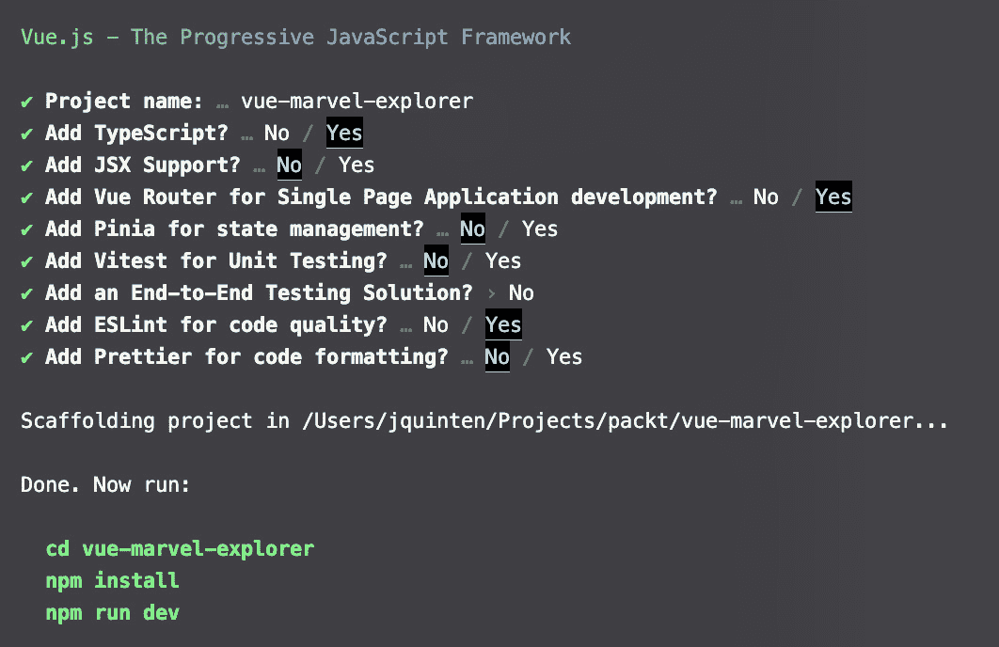

# 第四章：创建 Marvel Explorer 应用

让我们构建一个稍微复杂一些的应用，使用第三方 API 为其提供数据。我希望你喜欢漫画，因为我们将构建一个基于 Marvel Comics API 的探索器，我还会尝试加入一些英雄式的双关语。我们将探索添加不同的路由，并添加一些抽象来更好地利用编写我们的代码。

在本章中，我们将涵盖以下主题：

+   开始使用

+   从 API 获取数据

+   单页应用程序中的路由

+   编写和使用 composables

+   搜索和处理数据

+   用户友好的错误处理

# 技术要求

在本章中，我们将用**性能 npm**(**pnpm**)替换**node 包管理器**(**npm**)：[`pnpm.io`](https://pnpm.io)。

我们需要在[`developer.marvel.com/`](https://developer.marvel.com/)注册以获取 API 密钥。我们将添加**Tailwind CSS**([`tailwindcss.com/`](https://tailwindcss.com/))来为此应用应用样式。

在本章中，我们介绍使用 Vue.js 应用程序的官方路由来使用路由：[`router.vuejs.org/`](https://router.vuejs.org/)。

本章的完整代码可在[`github.com/PacktPublishing/Building-Real-world-Web-Applications-with-Vue.js-3/tree/main/04.marvel`](https://github.com/PacktPublishing/Building-Real-world-Web-Applications-with-Vue.js-3/tree/main/04.marvel)找到。

# 开始我们的新项目

为了开始，我们需要一个 API 密钥。如果您访问[`developer.marvel.com/`](https://developer.marvel.com/)并从菜单中选择**获取密钥**，您需要注册一个免费账户。之后，您将被重定向到开发者门户，在那里您创建一个密钥以与 API 交互。请确保记下公钥和私钥。

在我们的示例中，我们将从 localhost 访问 API，因此您需要将`localhost`和`127.0.0.1`添加到授权引用者列表中。

注意

如果您想将此应用部署到网络上，您还需要确保将应用的相应 URL 添加到那里，但本章不涵盖部署步骤。

我想指出文档，您可以在**交互式文档**下找到它。我建议您尝试操作一下，以了解我们的数据提供者。

让我们开始一个新项目！

```js
npm init vue@latest
```

按`y`键继续，将项目名称选择为`vue-marvel-explorer`，并选择以下图片中显示的选项：



图 4.1 – Marvel Explorer 应用的设置配置

按照安装依赖项的说明操作后，我们就可以开始工作了！

这次，让我们使用 pnpm 安装我们项目的依赖项。pnpm 是一个针对 node 的包管理器，它相对于 npm 有一些优势，例如更好的包存储管理，这导致安装速度提高和网络请求减少。如果您互联网连接不佳，pnpm 会帮您解决问题！您可以在此处阅读安装指南（[`pnpm.io/installation`](https://pnpm.io/installation)）。命令与 npm 类似，因此应该很容易上手。

导航到您的项目文件夹，并输入 `pnpm install`（而不是 `npm install`）。酷的地方在于，将来安装相同包时，都会引用已安装的本地缓存，这样可以节省大量带宽和时间。

我们还将使用 pnpm 在项目中安装 tailwind，回顾来自天气应用程序的步骤，使用 npm 的替代品，旨在优化 `node_modules` 管理：

```js
pnpm install -D tailwindcss postcss autoprefixerpnpm dlx tailwindcss init -p
```

让我们更新 `tailwind.config.js` 文件：

```js
/** @type {import('tailwindcss').Config} */export default {
  purge: ['./index.html', './src/**/*.{vue,js,ts,jsx,tsx}'],
  content: ['./src/**/*.{vue,js,ts,jsx,tsx}'],
  theme: {
    extend: {},
  },
  plugins: [],
}
```

在 `./src` 文件夹中创建一个 `style.css` 文件：

```js
@tailwind base;@tailwind components;
@tailwind utilities;
```

最后，打开 `./src/main.ts` 文件以将 CSS 文件导入到应用程序中（注意该文件包含路由初始化）：

```js
import { createApp } from 'vue'import App from './App.vue'
import router from './router'
import './style.css'
const app = createApp(App)
app.use(router)
app.mount('#app')
```

如果您使用 `pnpm run dev` 运行开发服务器，您会看到演示应用程序添加了一个示例路由，允许您在主页和关于视图之间导航。关闭开发服务器，让我们在代码编辑器中打开项目。

您可以移除默认 Vue 安装添加的组件，以清理您的项目。如果您不确定，可以始终参考 GitHub 仓库。链接可以在 *技术要求* 部分找到。*技术* *要求*

将 `.env.example` 文件重命名为 `.env`，并确保从 Marvel 开发者门户插入秘密：

```js
VITE_APP_MARVEL_API_PUBLIC=YOUR_PUBLIC_KEY_HEREVITE_APP_MARVEL_API_SECRET=YOUR_SECRET_HERE
```

以 `VITE_APP_` 为前缀的来自 `.env` 文件的变量会自动传递到您的应用程序中，并在预定义的 `import.meta.env` 对象中可用。

注意

我再次强调，在类似生产环境的生产环境中共享秘密不是最佳实践。您通常会使用类似授权代理的东西来确保 API 只接收受信任的请求。从某种意义上说，我们已经通过在 Marvel API 配置中定义请求域做到了这一点。通常，`localhost` 或其等效的 `127.0.0.1` 也不会出现在生产环境中！

这就完成了我们的环境设置。接下来，我们将继续将这些设置连接到我们的应用程序。

# 超级英雄连接

我们希望从应用程序的不同组件中检索 Marvel 漫画 API 的数据。一个很好的模式是通过创建 Vue 可组合式来实现。Vue 可组合式是在整个应用程序中使用和重用逻辑的一个经过验证的模式。我们将在 `src` 文件夹中创建一个名为 `composables` 的文件夹，并创建一个名为 `marvelApi.ts` 的文件。

您可以从示例仓库中导入类型（[`github.com/PacktPublishing/Building-Real-world-Web-Applications-with-Vue.js-3/blob/main/04.marvel/src/types/marvel.ts`](https://github.com/PacktPublishing/Building-Real-world-Web-Applications-with-Vue.js-3/blob/main/04.marvel/src/types/marvel.ts)）。

这些类型主要是与 API 的合约。请随意查看它们。我是通过摄取 API 的结果并定义类型来创建它们的。

我们将从一个异步函数开始，该函数从 API 的漫画端点获取数据，并返回响应的 promise。我们将逐步扩展其功能。向文件中添加一个新的组合函数`useComics`，并不要忘记导入类型：

```js
import type { Comics } from '@/types/marvel'export const useComics = async (): Promise<Comics> => {
  const apiKey = import.meta.env.VITE_APP_MARVEL_API_PUBLIC;
  const MARVEL_API = `//gateway.marvel.com/v1/public/
  const API_SIGN = apikey=${apiKey}`
  const requestURI = `${MARVEL_API}/comics?${API_SIGN}`
  const res = await fetch(requestURI);
  const jsonRes = await res.json();
  return jsonRes.data;
}
```

现在我们可以将 API 调用连接到用户界面。我们将创建一个组件来显示端点数据。在`src/components`文件夹中创建一个新的 Vue 组件，名为`ComicsOverview.vue`。我们将从`script`标签的内容开始：

```js
<script lang="ts" setup>import { ref, onMounted } from "vue";
import type { Ref } from "vue";
import { useComics } from "@/composables/marvelApi";
import type { Comic } from "@/types/marvel";
const isLoading: Ref<boolean> = ref(false);
const data: Ref<Comic[] | undefined> = ref();
const getComics = async () => {
  isLoading.value = true;
  const comics = await useComics();
  data.value = comics.results;
  isLoading.value = false;
};
onMounted(async () => {
  await getComics();
});
</script>
```

`script`块与第四章中的天气应用*第四章*非常相似。我们在组件挂载时请求数据，并使用`isLoading`变量跟踪状态。

在同一文件的模板中，我们将添加以下内容：

```js
<template>  <div>
    <div v-if="isLoading"><p>Loading comics…</p></div>
    <div v-if="data && !isLoading">
      <div
        class="grid grid-flow-row grid-cols-1 gap-4 md:grid-cols-2 lg:grid-cols-4"
      >
        <div :key="comic.id" v-for="comic in data">{{ comic.title }}</div>
      </div>
    </div>
  </div>
</template>
```

您可以通过临时将组件导入到`App.vue`并在模板中加载它来快速查看结果。这里有一点细微的差别是我们将实际的获取操作抽象到了组合中，这使得组件的代码更加简洁，并且使获取操作更加可重用。

现在我们有了数据，我们将稍微润色一下组件。让我们创建一个`LoadingIndicator.vue`组件：

```js
<script setup lang="ts">const props = defineProps<{
  text?: string;
}>();
</script>
<template>
  <div
    class="flex flex-col items-center justify-center p-4 pt-16 min-h-min min-w-screen"
  >
    <div v-if="text" class="mb-4">
      {{ text }}
    </div>
    <div class="flex space-x-2 animate-pulse">
      <div class="w-3 h-3 bg-gray-500 rounded-full"></div>
      <div class="w-3 h-3 bg-gray-500 rounded-full"></div>
      <div class="w-3 h-3 bg-gray-500 rounded-full"></div>
    </div>
  </div>
</template>
```

我们可以将它导入到组件中，然后使用它来替换`<div v-if="isLoading"><p>Loading comics…</p></div>`元素，如下所示：

```js
<script lang="ts" setup>import { ref, onMounted } from "vue";
import type { Ref } from "vue";
import { useComics } from "@/composables/marvelApi";
import type { Comic } from "@/types/marvel";
import LoadingIndicator from "./LoadingIndicator.vue";
//… abbreviated
</script>
<template>
  <div>
    <LoadingIndicator v-if="isLoading" text="Loading comics..."/>
    // … abbreviated
  </div>
</template>
```

我们这样做是为了在使用重复的用户界面模式时创建更多的一致性。再次强调，这是基于组件的架构的一个优势。

我们还可以创建漫画的视觉表示。我们将立即应用抽象。在实践中，代码重构往往发生在代码库的开发过程中。预先预测哪些代码将被重用是很困难的，所以当需要时，不要犹豫，尽早和经常重构。然而，在我们的案例中，我们有一个不同的目标要教授，所以我们将不会专注于重构部分。

创建一个名为`CardView.vue`的组件，其中包含以下代码：

```js
<template>    <article class="p-4 bg-white rounded-lg shadow-xl place-content-center text-slate-800">
    <header>
        <h1 class="pb-5 text-lg font-semibold "><slot name="header"></slot></h1>
    </header>
    <slot></slot>
    </article>
</template>
```

在这个组件中，我们正在使用插槽。插槽是来自父组件的特定动态内容（组件或文本）的占位符。插槽是重用模板和提供大量灵活性的绝佳方式。考虑一下`LoadingIndicator`组件，它只接受一个文本属性。限制可能是有益的，但有时您可能更愿意选择灵活性而不是约束。让我们开始应用这个通用组件。

我们将创建一个包含以下内容的`ComicCard.vue`组件：[`github.com/PacktPublishing/Building-Real-world-Web-Applications-with-Vue.js-3/blob/main/04.marvel/.notes/4.1-ComicCard.vue`](https://github.com/PacktPublishing/Building-Real-world-Web-Applications-with-Vue.js-3/blob/main/04.marvel/.notes/4.1-ComicCard.vue)

让我们分解这个组件，好吗？你应该熟悉大多数概念，但我已经介绍了一些更多内容。一个特别的添加是以下这一行：

```js
const lf = new Intl.ListFormat('en');
```

`Intl`是一个标准化的命名空间，用于处理与语言相关的函数。在我们的案例中，我们正在设置一个特定于英语（`en`）语言的列表格式化器，并在模板中使用它来连接创作者列表。列表作为数组提供（即`[“Evan You”, “Sebastien Chopin”, “Anthony Fu”]`）。使用`Intl`格式化器，结果是特定于该语言的易读文本：*Evan You, Sebastien Chopin, and Anthony Fu!*

我们使用计算值来为每个漫画创建角色列表（`charactersList`）和每个漫画的创作者列表（`creatorsList`）。

在模板中，我们看到我们是如何在`CardView`组件中使用插槽并填充我们自己的模板的：

```js
<template>  <CardView :data-testid="comic.id">
    <template v-slot:header>
     {{ comic.title }}
    </template>
    <template v-slot:default>
      
      //… abbreviated
    </template>
  </CardView>
</template>
```

我们已经定义了模板的内容。我们指定`comic.title`作为组件中的标题。对于默认插槽，我们提供了卡片内容的标记。在两种情况下，我们都让`<CardView>`组件处理格式化和样式，这也确保了用户界面的统一性。

在示例代码中，你会看到命名插槽的简写表示法：

```js
<template #header>  {{ comic.title }}
</template>
<template #default>
  //… abbreviated
</template>
```

目前，我们将移除对`App.vue`的临时更改，因为我们打算将其添加到特定的路由视图中！

使用我们准备好的组件，我们将继续将这些组件移动到特定的视图和路由中。

# 单页应用程序中的精彩路由

现在，让我们看看应用程序的默认设置，因为我们已经预安装了应用程序以使用`vue-router`。这配置了应用程序的一些功能：

+   在`router`文件夹中，我们有一个`index.ts`文件

+   在`views`文件夹中，我们有两个名为`HomeView.vue`和`AboutView.vue`的组件

+   在`App.vue`中，我们有几个名为`RouterLink`和`RouterView`的组件

这就是路由是如何相互关联的。让我们看看每一个。

`router`文件夹的内容定义和配置了应用程序的路由。路由定义了应用程序中的不同路径以及当访问这些路径时应渲染的组件。每个路由都表示为一个具有`path`、`name`和`component`等属性的对象。

`path`属性指定了 URL 路径，`component`属性指定了要渲染的 Vue 组件。`name`不是必需的，更多的是作为一个人类可读的标识符用于路由。

使用默认配置，它为我们定义了主页视图，并设置了其他视图以支持代码拆分，以限制每个路由的包大小。所以，这是一个开箱即用的最佳实践！

我们将把对`about`的引用更改为`search`，为我们的最终结果做准备：

```js
{  path: '/search,
  name: search,
  // route level code-splitting
  // this generates a separate chunk (Search.[hash].js) for this route
  // which is lazy-loaded when the route is visited.
  component: () => import('../views/SearchView.vue')
}
```

我们将把`AboutView.vue`重命名为`SearchView.vue`。对于文件的内容，你可以简单地删除大部分，我们稍后会构建一些新的内容。目前像这样就可以了：

```js
<template>  <div class="search">
    <h1>This is a search page</h1>
  </div>
</template>
```

为了将这些内容重新组合在一起，我们可以更新`App.vue`文件，使`RouterLink`组件指向`/search`而不是`/about`。

为了明确：你必须使用我们在路由文件中配置的路径。`RouterView`组件用于根据当前路由渲染匹配的组件。它充当占位符，在相应组件渲染的地方。每当路由发生变化时，`RouterView`组件将自动更新以渲染新组件。还记得插槽吗？将`RouterView`视为一种动态插槽，可以容纳整个视图。

`RouterLink`用于在应用程序中创建导航链接，并在点击时触发到指定路由的导航。`RouterLink`的`to`属性指定目标路由的路径或名称。

让我们清理掉我们不再需要的默认配置部分：

```js
<script setup lang="ts">import { RouterLink, RouterView } from 'vue-router'
</script>
<template>
  <header>
    <div class="my-4 text-center">
      <h1 class="mb-4 text-6xl font-extrabold uppercase">Marvel Explorer 🔭</h1>
      <nav>
        <RouterLink to="/" class="px-4 py-2 border-2 rounded-s-md hover:text-slate-600">📒 Comics</RouterLink>
        <RouterLink to="/search" class="px-4 py-2 border-2 border-s-0 hover:text-slate-600 rounded-e-md">🦹 Heroes</RouterLink>
      </nav>
    </div>
  </header>
  <RouterView />
</template>
```

由于我们的`ComicsOverview.vue`组件已经准备好了，我们可以将其添加到`HomeView.vue`中，替换掉`TheWelcome.vue`部分：

```js
<script setup lang="ts">import ComicsOverview from '@/components/ComicsOverview.vue';
</script>
<template>
  <main>
    <ComicsOverview />
  </main>
</template>
```

如果你现在运行应用程序，你可以在主页（加载漫画概览）和几乎为空的搜索页面之间导航。

我们将继续努力将更多信息添加到我们的应用程序中，因为我们的应用程序目前仅限于显示 API 结果的首页。

## 可选参数

如果你分析了来自漫威 API 的网络请求，你可能已经注意到我们显示的漫画只是冰山一角。有大量的漫画，由于数量庞大，它们不会在一个响应中发送。API 提供了分页结果。我们可以修改我们的应用程序以反映 API 的功能！

如果我们打开路由文件，我们可以在路由中添加一个可选参数。它解析并公开要用于应用程序的值。参数（或简称*param*）的表示法是在名称前加冒号。我们将向`home`路由添加一个名为`page`的参数：

```js
{  path: '/:page',
  name: 'home',
  component: HomeView
},
```

我们在应用程序中引入了一个轻微的 bug。现在应用程序*总是期望一个参数*。对于主页来说，这并不总是如此！参数应该是可选的。为了标记参数为可选，我们在其后添加一个问号作为后缀：

```js
{  path: '/:page?',
  name: 'home',
  component: HomeView
},
```

欢呼！我们已经成功添加了一个可选参数。现在我们可以将分页引入到漫画概览中。

## 呼叫斯特兰奇博士

`vue`路由器将自己暴露为一个可组合式组件。可组合式组件是 Vue 的一个超级功能，用于封装可复用的状态逻辑。这意味着在这个例子中，路由器可组合式组件持有路由的状态，我们可以在任何组件中使用它！

这意味着我们可以直接打开我们的`ComicsOverview.vue`文件来实现分页。让我们看看组件的`script`标签并添加几行：[`github.com/PacktPublishing/Building-Real-world-Web-Applications-with-Vue.js-3/blob/main/04.marvel/.notes/4.2-ComicsOverview.vue`](https://github.com/PacktPublishing/Building-Real-world-Web-Applications-with-Vue.js-3/blob/main/04.marvel/.notes/4.2-ComicsOverview.vue)

首先，我们导入可组合式组件（*第 4 行*）并将其注册到路由常量（*第 12 行*）。然后我们添加两个响应式变量（*第 16 行、第 17 行*）来跟踪页面信息。我们通过`route.params`对象访问参数。由于我们命名了变量，我们可以访问方法上的相应属性。我们使用`+route.params.page`（*第 19-21 行*）作为简写来将值转换为数值类型，并将其存储在响应式的`currentPage`中。

然后，在`getComics`中，我们使用来自端点数据来实际化值（*第 27 行、第 28 行*）。

现在我们知道了有多少页以及我们目前在哪一页，我们可以使用这些属性来提供一个简单的`Pagination`组件。

## 一个简单的分页组件

那么，让我们创建一个新的组件，命名为`Pagination.vue`，并添加以下内容：[`github.com/PacktPublishing/Building-Real-world-Web-Applications-with-Vue.js-3/blob/main/04.marvel/.notes/4.3-Pagination.vue`](https://github.com/PacktPublishing/Building-Real-world-Web-Applications-with-Vue.js-3/blob/main/04.marvel/.notes/4.3-Pagination.vue)

到现在为止，应该已经很直观了：我们添加了相关的属性（为了更大的灵活性，我们还提供了一个`path`属性），并且根据我们的当前页，我们可以渲染到第一页、上一页、下一页或最后一页的链接，并显示分页状态。

我想指出的是`aria-hidden`属性，我们用它来标记对屏幕阅读器无价值的装饰性元素。现在，我们将通过导入并将其粘贴在漫画卡片概述下添加到`ComicsOverview.vue`组件中：

```js
<template>  <div>
    <LoadingIndicator v-if="isLoading" text="Loading comics..." />
    <div v-if="data && !isLoading">
      <div
        class="grid grid-flow-row grid-cols-1 gap-4 md:grid-cols-2 lg:grid-cols-4"
      >
        <ComicCard
          :comic="comic"
          :key="comic.id"
          v-for="comic in data"
        ></ComicCard>
      </div>
      <Pagination
        :total-pages="totalPages"
        path="/"
        :current-page="+currentPage"
      ></Pagination>
    </div>
  </div>
</template>
```

那是有效的！我们可以点击到下一页，但什么也没有发生。这是因为我们的 API 还没有支持分页功能。让我们看看如何添加这个功能，所以我们将打开`marvelApi.ts`文件。首先，我们将为`useComics`添加分页选项：

```js
export const useComics = async (page: number = 0): Promise<Comics> => {    const apiKey = import.meta.env.VITE_APP_MARVEL_API_PUBLIC;  const MARVEL_API = //gateway.marvel.com/v1/public/
  const API_SIGN = apikey=${apiKey}
  const ITEMS_PER_PAGE = 20;
  const pagination = page ? &offset=${page * ITEMS_PER_PAGE} :
  const requestURI = ${MARVEL_API}/comics?${API_SIGN}${pagination}
  const res = await fetch(requestURI);
  const jsonRes = await res.json();
  return jsonRes.data;
}
```

我们只是接受一个页码，然后我们将使用预定义的`ITEMS_PER_PAGE`来确定偏移量（这是漫威 API 处理分页的方式）。然后，我们存储查询参数并将其添加到`requestURI`。

现在，我们可以再次切换到`ComicsOverview`组件，以实现分页并将路由参数连接到 API 请求。为了完成这个任务，我们在脚本块中添加以下内容：

```js
<script lang="ts" setup>import { ref, onMounted, watch } from "vue";
// abbreviated…
const getComics = async (page: number = 0) => {
  isLoading.value = true;
  const comics = await useComics(page);
  currentPage.value = comics?.offset / comics?.limit || 0;
  totalPages.value = Math.ceil(comics.total / comics.limit);
  data.value = comics.results;
  isLoading.value = false;
};
watch(
  () => route.params.page,
  async (newPage) => {
    await getComics(+newPage);
  }
);
onMounted(async () => {
  await getComics(+currentPage.value);
});
</script>
```

我们现在可以简单地将页面添加到`getComics`请求中，并将其传递给`useComics`可组合组件。我们在`onMounted`时这样做，即当你直接从 URL 进入应用程序时。我们还添加了一个监视函数，它跟踪`route.params.page`的变化，并在值改变时请求新页面。正如你所看到的加号，我们在这里也使用了快速转换为数字。

在所有这些准备就绪之后，我们现在可以浏览所有 2,746 页！作为一个额外的练习，为什么不尝试扩展分页组件以显示多个页面。

一旦你准备好向前推进，我们将重构我们的应用程序以使用可组合组件。它们是封装（有状态的）逻辑的函数。

# 可组合组件，集合！

让我们看看我们如何利用我们的可组合组件并重构应用程序以扩展一些功能。可组合组件都是关于可重用性：这是它们在 Vue 空间中的超级力量，所以让我们将我们之前创建的可组合组件投入实际应用。

首先，我们将对`useComics`可组合组件进行重构，我们将轻柔地应用清洁代码原则。在我们的上下文中，这相当于应用单一责任原则，并编写小型且结构紧凑的函数，具有有意义的名称。

## 重构 useComics

我们将以非破坏性的方式进行重构，直到我们准备好更新现有的`useComic`可组合组件。

我们首先将静态常量从函数中移出，放到更高的作用域。我们还将导入将在函数中引用的附加类型。这样，我们仍然可以访问它们，但它们在整个文件中都是可用的。我习惯于将这些类型的值放在文件顶部，以便于未来的参考：

```js
import { Path } from '@/types/marvel'import type { Comics, Characters, Character } from '@/types/marvel'
const apiKey = import.meta.env.VITE_APP_MARVEL_API_PUBLIC;
const MARVEL_API = //gateway.marvel.com/v1/public/
const API_SIGN = apikey=${apiKey}
const ITEMS_PER_PAGE = 20;
export const useComics = async (page: number = 0): Promise<Comics> => {
  const pagination = page ? &offset=${page * ITEMS_PER_PAGE} :
  const requestURI = ${MARVEL_API}/comics?${API_SIGN}${pagination}
  const res = await fetch(requestURI);
  const jsonRes = await res.json();
  return jsonRes.data;
}
```

如果我们思考我们的新可组合组件应该做什么以及它们有什么共同点，我们可以确定以下活动：确定分页、确定搜索查询、构建漫威开发者 API URL、获取并返回数据。我们将为每个活动创建简短、独立的函数。这些不是可组合组件，我们不会在文件外部暴露它们。

让我们添加`getPagination`函数，它接受页码并将其转换为字符串，将页码转换为**偏移量**（符合漫威 API 的预期）：

```js
const getPagination = (page?: number): string => {    return page ? &offset=${page * ITEMS_PER_PAGE} : ''
};
```

为了构建一个包含搜索查询的额外字符串，我们添加以下内容：

```js
const getQuery = (query?: string): string => {    return query ? &${query} : ''
};
```

下一个添加的是构建请求 URI 的函数，它将静态常量与`getPagination`和`getQuery`函数的输出相结合：

```js
const getRequestURI = (path: Path,query: string, pagination: string): string => {    const apiPath = ${MARVEL_API}/${path};
    return ${apiPath}?${API_SIGN}${query}${pagination};
};
```

我们还将添加一个执行请求并返回结果的函数。在这种情况下，我们可能可以重用这个函数，所以我们可以将其编写为可组合组件，使用`use`前缀：

```js
export const useFetch = async (requestURI: string): Promise<Comics | Characters> => {  const res = await fetch(requestURI);
  const jsonRes = await res.json();
  return jsonRes.data as Comics | Characters;
};
```

最后，我们可以在一个组合式中将所有函数串联起来，这将使我们能够与漫威开发者 API 进行交互：

```js
interface ApiOptions {  query?: string;
  page?: number;
}
export const useMarvelAPI = async (path: Path, options: ApiOptions): Promise<Comics | Characters> => {
  const pagination = getPagination(options.page);
  const query = getQuery(options.query);
  const requestURI = getRequestURI(path, id, query, pagination);
  return useFetch(requestURI);
}
```

正如你所见，我们创建了一个函数，它可以返回漫画或角色，这取决于我们提供的路径变量。由于漫威开发者 API 对每个端点都有类似的机制，我们能够对所需的选项做出有用的抽象。

我们添加到`MavelAPI.ts`文件中的代码如下：[`github.com/PacktPublishing/Building-Real-world-Web-Applications-with-Vue.js-3/blob/main/04.marvel/.notes/4.4-MarvelAPI.ts`](https://github.com/PacktPublishing/Building-Real-world-Web-Applications-with-Vue.js-3/blob/main/04.marvel/.notes/4.4-MarvelAPI.ts)

我们通过添加抽象来扩展文件，以从端点检索数据，这样我们就可以重用通用的函数，同时能够请求特定内容。

让我们调查将这些功能整合到我们的应用中。

## 重新组装功能

现在，我们可以更新现有的`useComics`组合式，在此基础上构建。正如你所见，我们现在能够将组合式的代码内容缩减到一行，只提供路径和当前页：

```js
export const useComics = async (page: number = 0): Promise<Comics> => {  return await useMarvelAPI(Path.COMICS, { page }) as Comics
}
```

通过运行我们的代码，带有分页的现有漫画概览应该保持完全功能。这是编写干净代码而不是组合式力量的证明。它使我们能够相对容易地实现新的、有用的代码。在我们的下一个组合式中，我们将请求不同类型的信息，正如我们将在函数中描述的那样。

我们与搜索 API 交互的方式是提供正确的 API 路径，在我们的案例中，我们将使用`nameStartsWith`方式进行搜索。我们将将其与动态搜索值一起作为查询的一部分提供：

```js
export const useCharacterSearch = async (query: string, page: number = 0): Promise<Characters> => {  return await useMarvelAPI(Path.CHARACTERS, { query: nameStartsWith=${query}, page }) as Characters
}
```

这次，正如你所见，我们将预期的响应类型更改为`Characters`而不是`Comics`。当我们与这些组合式交互时，我们的 IDE 将能够区分这两种类型。

现在我们有两个组合式准备在应用中使用。我们重构文件的方式在编码中是一种自然的过程。随着时间的推移，需求会发生变化，因此代码随之变化是合乎逻辑的。将我们的代码拆分成小型、专注的函数将使我们在未来更容易理解和修改。

当使用组合式时，我们通常遵循提供简单易用函数的相同做法，而不是将它们组合成一个。

如果你感兴趣于应用组合式，我建议查看[`vueuse.org/`](https://vueuse.org/)。它托管了一个用于 Vue 应用中日常问题的现成组合式集合。

到目前为止，我们已经看到，将清晰的代码思维与特定的可组合组件相结合，如何帮助我们重构应用程序代码，将其分解成更易于阅读和维护的各个部分。我们也亲身体验了代码重构的过程。有时我们重构代码是因为需求的变化，有时我们只是想让现有的代码更易于阅读。

让我们现在看看如何向我们的应用程序添加更多类型的数据！

# 管理名单

通过我们全新的可组合组件，我们可以轻松访问来自漫威开发者 API 的更多数据！我们将继续创建 Vue 组件，这将使用户界面能够处理搜索操作。

我们首先将创建一个名为`CharacterCard.vue`的`ComicCard.vue`的变体。该组件将稍微简单一些，因此您可以将以下内容粘贴到文件中，或者创建`ComicCard.vue`的一个副本并更新它以匹配以下内容：

```js
<script setup lang="ts">import type { Character } from "@/types/marvel";
import CardView from "./CardView.vue";
interface Props {
  character: Character;
}
const props = defineProps<Props>();
</script>
<template>
  <CardView :id="character.id">
    
    <template #header>{{ character.name }}</template>
    <div class="text-base max-w-prose">{{ character.description }}</div>
  </CardView>
</template>
```

这里没有发生什么特别的事情。我们期望一个名为 character 的单个属性，并且它应该匹配类型。因此，我们可以轻松地将底层属性映射到一个简单的 HTML 模板中。

接下来，我们将创建一个主要组件来托管所有用户界面元素。我们将创建一个名为`SearchCharacter.vue`的文件，并且我们将从模板开始。在创建了`ComicsOverview.vue`之后，这也应该看起来很熟悉。我已经高亮了关键差异：[`github.com/PacktPublishing/Building-Real-world-Web-Applications-with-Vue.js-3/blob/main/04.marvel/.notes/4.5-SearchCharacter.vue`](https://github.com/PacktPublishing/Building-Real-world-Web-Applications-with-Vue.js-3/blob/main/04.marvel/.notes/4.5-SearchCharacter.vue)

当数据正在加载时（*第 3 行*），我们提供了一个有意义的消息，并且以不同的方式显示结果，即`CharacterCard`（*第 8-12 行*）。在`Pagination`中，我们提供了当前路径（*第 16 行*），并且在没有返回数据时添加了一个更具体的消息（*第 25-28 行*）。

现在，我们将实现一种输入搜索查询的方法，以便将其传递到`SearchCharacter`展示。

## 搜索英雄

搜索是一个隔离的、特定的动作，因此按照单文件组件的哲学，我们将为这个动作创建一个特定的组件！

让我们通过创建一个名为`SearchForm.vue`的新文件来创建一个表单组件。从`script`标签开始，我会在过程中解释一些新内容：

```js
<script lang="ts" setup>import { ref } from "vue";
import type { Ref } from "vue";
const emit = defineEmits(['searchSubmit'])
interface Props {
  isSearching: boolean;
}
const props = defineProps<Props>();
const query: Ref<string> = ref("");
const search = (): void => {
  emit("searchSubmit", query.value);
};
</script>
```

正在进行着两件有趣的事情。第一行高亮定义了一个`emit`。当我们要在作用域内向上传递某些内容（一个事件）时，就会发生 emit。Props 向下传递，emits 向上传递。通过使用`defineEmits`，我们将其包装起来，这样 Vue 可以在运行时跟踪事件，并将其命名为`searchSubmit`。

接下来，我们有一个名为`search`的函数，它除了通过引用其名称并传递`query.value`作为参数来触发事件外，什么都不做。在我们的父组件中，我们将能够捕获该事件及其值。

是时候添加模板了。让我们尽可能简单开始：

```js
<template>  <form class="flex justify-center my-8" v-on:submit.stop="search">
    <input
      class="px-3 py-2 border rounded-md rounded-r-none disabled:opacity-40 border-slate-300 text-slate-800 focus:outline-none focus:border-slate-500"
      type="text"
      v-model="query"
      placeholder="Search..."
      :disabled="isSearching"
    />
    <button
      class="px-4 py-2 text-sm font-bold text-white transition-colors duration-300 rounded-md rounded-l-none disabled:opacity-40 bg-slate-500 hover:bg-slate-600"
      :disabled="isSearching"
      type="submit"
    >
      🔍 Search
    </button>
  </form>
</template>
```

这里也有两点需要注意。`v-on:submit.stop` 语句是一个内置方法，它阻止实际的表单作为 HTML 表单提交（这会导致页面刷新）。相反，在提交时，它调用 `search` 函数。

为了有任何值引用，我们可以使用 `v-model` 将查询值绑定到输入字段。这为你提供了双向数据绑定。

## 添加搜索

虽然表单可以工作，但它感觉不像一个应用：我们仍然需要手动提交表单。在展示结果之前，让我们升级 `SearchForm`。我们将使用观察者来监视查询值的变化，并在它发生变化时触发 `search` 函数。

我们将更新 `script` 标签中的代码以匹配以下内容：

```js
<script lang="ts" setup>import { ref, watch } from "vue";
import type { Ref } from "vue";
const emit = defineEmits(["searchSubmit"]);
interface Props {
  isSearching: boolean;
}
const props = defineProps<Props>();
const query: Ref<string> = ref("");
let timeout: number;
const search = (): void => {
  emit("searchSubmit", query.value);
};
const debouncedSearch = (): void => {
  clearTimeout(timeout);
  timeout = setTimeout(async () => {
    search();
  }, 500);
};
watch(query, (): void => {
  debouncedSearch();
});
</script>
```

理解导入 `watch` 函数和定义观察者并不难。而且，而不是直接调用搜索函数，观察者调用 `debouncedSearch`。

向 API 发送请求在资源方面是昂贵的。通过防抖函数，我们运行一个计时器，在本例中为 500 毫秒（ms）。当计时器结束时，我们然后调用 `search` 函数，该函数反过来发出 `searchSubmit` 事件。然而，如果 `debouncedSearch` 函数在计时器清除之前被调用，我们只需重置计时器并等待另一个 500 毫秒。

## 超级能力的概述

我们终于可以组装 `SearchCharacter` 组件了。让我们从 `script` 标签开始，因为我们第一次开始时遗漏了它：[`github.com/PacktPublishing/Building-Real-world-Web-Applications-with-Vue.js-3/blob/main/04.marvel/.notes/4.6-SearchCharacter.vue`](https://github.com/PacktPublishing/Building-Real-world-Web-Applications-with-Vue.js-3/blob/main/04.marvel/.notes/4.6-SearchCharacter.vue)

除了导入我们的实用工具和组件之外，组件的核心是在 Marvel 开发者 API 上触发搜索操作。`getCharacterSearch`（*第 20-34 行*）负责更新响应式值以转换为 UI 并计算分页。其核心是使用我们的可组合结构检索结果，这些结果传递给响应式数据属性。

`searchReset` 函数（*第 36-41 行*）确保我们总能回到初始状态，例如，当你想要清除 UI 或有人搜索空值时。

在模板本身中，我们只需要添加 `SearchForm`，这样我们的用户就可以从漫威宇宙中找到他们最喜欢的英雄：

```js
<template>  <div>
    <SearchForm
      :is-searching="isSearching"
      @search-submit="search"
    />
    <LoadingIndicator v-if="isSearching" :text="Searching by '${searchQuery}'..." />
    // ...abbreviated
  </div>
</template>
```

我们现在已经通过非常有用的搜索功能扩展了应用。这意味着我们可以测试我们的新可组合结构。它允许我们专注于搜索表单的实现，包括防抖，而不是获取数据。

我们已经看到我们的抽象如何以最小的努力扩展功能。到目前为止，我们所构建的几乎都是关于“愉快流程”，其中各个部分按预期工作。由于我们依赖于第三方 API，我们无法控制其稳定性，必须为数据未返回的情况做好准备。在下一节中，我们将重点关注错误处理。

# 不同的视角

到目前为止，我们的应用程序运行良好。我们可以通过确保我们可以处理 API 返回错误的情况来改善我们的应用程序体验。让我们看看我们如何使我们的应用程序在这方面更加健壮。

我们将添加一个页面，当发生错误时能够向用户显示错误。让我们从`views`文件夹中的新文件`ErrorView.vue`开始。只需创建以下内容的模板：

```js
<template>  <main>
    Oops!
  </main>
</template>
```

我们稍后会回到这个文件。现在我们至少可以在`router/index.ts`文件中创建一个新的路由，它只是从`search`路由复制类似的逻辑：

```js
import { createRouter, createWebHistory } from 'vue-router'import HomeView from '../views/HomeView.vue'
const router = createRouter({
  history: createWebHistory(import.meta.env.BASE_URL),
  routes: [
    {
      path: '/:page?',
      name: 'home',
      component: HomeView
    },
    {
      path: '/search',
      name: 'search',
      component: () => import('../views/SearchView.vue')
    },
    {
      path: '/error',
      name: 'error',
      component: () => import('../views/ErrorView.vue')
    }
  ]
})
export default router
```

如果我们导航到应用程序中的`/error`路由，我们应该看到我们的`errorpage`。由于数据来自外部 API，我们无法控制它。这使得它成为应用程序中的一个明显弱点。

此外，编写防御性代码是常见的做法。如果我们查看`marvelApi`组合式文件，我们可以在应用程序中使用的组合式周围添加一些安全措施：

```js
export const useComics = async (page: number = 0): Promise<Comics> => {  try {
    return await useMarvelAPI(Path.COMICS, { page }) as Comics
  } catch {
    throw new Error('An error occurred while trying to read comics');
  }
}
export const useCharacterSearch = async (query: string, page: number = 0): Promise<Characters> => {
  try {
    return await useMarvelAPI(Path.CHARACTERS, { query: nameStartsWith=${query}, page }) as Characters
  } catch {
    throw new Error('An error occurred while trying to search comics');
  }
}
```

注意

您还可以考虑在`useFetch`和`useMarvelAPI`上添加这些`try`/`catch`块。在发生错误时，错误将通过调用堆栈向上传播，这意味着它将在最高级别被捕获。

我们将模拟错误行为，以便为这些不可预见的情况进行开发。一种简单的方法是进入您的`.env`文件，并将`VITE_APP_MARVEL_API_PUBLIC`变量的值临时重命名为`VITE_APP_MARVEL_API_PUBLIC_ERROR`。完成后我们将将其改回！如果您运行应用程序，它将无法请求任何内容，您将在控制台看到我们设置的错误消息。

## 处理错误

现在，我们将专注于以用户友好的方式处理错误。让我们从`ComicsOverview.vue`文件开始。我们将用另一个`try`/`catch`块包裹`getComics`函数的内容。

在这种情况下，用户无法从这种错误中恢复状态，因此留在该页面上没有意义，因为它已经完全损坏。我们将用户重定向到我们的错误页面。这意味着我们将从`vue-router`导入`useRouter`组合式并在组件上实例化它。我们将相应地修改文件，特别是`getComics`函数：[`github.com/PacktPublishing/Building-Real-world-Web-Applications-with-Vue.js-3/blob/main/04.marvel/.notes/4.7-ComicsOverview.vue`](https://github.com/PacktPublishing/Building-Real-world-Web-Applications-with-Vue.js-3/blob/main/04.marvel/.notes/4.7-ComicsOverview.vue)

我们在（*第 4 行*）导入并注册路由（*第 14 行*），并在发生错误时使用`router`重定向到新路由（*第 27-29 行*）。

接下来，我们将创建一个在`ErrorView.vue`中显示的组件。让我们创建一个名为`ErrorMessage.vue`的新组件，其中包含一些静态内容：

```js
<template>  <article
    class="p-4 mx-4 my-24 bg-white rounded-lg shadow-xl place-content-center text-slate-800"
  >
    <header>
      <h1 class="pb-5 text-lg font-semibold">Oops! 🤭</h1>
    </header>
    Something went wrong!
  </article>
</template>
```

我们还将更新`ErrorView.vue`以加载该组件：

```js
<script setup lang="ts">import ErrorMessage from '@/components/ErrorMessage.vue'
</script>
<template>
  <main>
    <ErrorMessage />
  </main>
</template>
```

如果我们运行我们的代码，只要 API 将我们视为未授权，我们应该会被重定向到`/error`路径。我们也将以类似的方式在`SearchCharacter.vue`中添加`errorhandling`：

```js
<script lang="ts" setup>import { ref } from "vue";
import type { Ref } from "vue";
import { useRouter } from "vue-router";
// … abbreviated
const router = useRouter();
// … abbreviated
const getCharacterSearch = async (query: string, page: number = 0) => {
  try {
    if (query !== "") {
      isSearching.value = true;
      searchQuery.value = query;
      const search = await useCharacterSearch(query, page);
      currentPage.value = search?.offset / search?.limit || 0;
      totalPages.value = Math.ceil(search.total / search.limit);
      data.value = search.results;
      isSearching.value = false;
    } else {
      searchReset();
    }
  } catch (e) {
    router.push("/error");
  }
};
// … abbreviated
</script>
```

在这种情况下，在你尝试搜索之后，应用将重定向到同一页面。如果能为我们用户提供一些上下文，让他们更好地理解出了什么问题，那就太好了。幸运的是，我们可以访问我们在`catch`块中抛出的错误消息。

## 添加查询参数

我们将修改`router.push`动作，使其向目的地传递一些额外的信息。

这是一个简单的更改，我们将将其应用到`ComicsOverview.vue`和`SearchCharacter.vue`的行上。让我们更改这个：

```js
} catch (e) {  router.push("/error");
}
```

我们还将修改它，使其提供有关`query`参数的信息：

```js
} catch (e) {  router.push({ path: 'error', query: { info: e as string }})
}
```

在这种情况下，我们将把错误消息中的信息作为`query`参数传递给路由。请注意，这并不是为了发送大量文本，但它是一个很好的使用`query`参数的例子。

最后，我们可以修改`ErrorMessage.vue`文件，以便读取`query`参数并将其显示在组件上。我们可以通过在组件挂载后利用`useRoute`可组合式来读取路由来实现这一点。文件将看起来像这样：

```js
<script setup lang="ts">import { ref, onMounted } from "vue";
import type { Ref } from "vue";
import { useRoute } from "vue-router";
const route = useRoute();
const errorMessage: Ref<string> = ref("");
onMounted((): void => {
  errorMessage.value = route.query.info as string;
});
</script>
<template>
  <article
    class="p-4 mx-4 my-24 bg-white rounded-lg shadow-xl place-content-center text-slate-800"
  >
    <header>
      <h1 class="pb-5 text-lg font-semibold">Oops! 🤭</h1>
    </header>
    {{ errorMessage }}
  </article>
</template>
```

如果你现在处于错误状态，你应该看到一个更准确地说明出了什么问题的消息。完成操作后，别忘了重命名你的`VITE_APP_MARVEL_API_PUBLIC`变量！

到目前为止，我们在一些相当常见的技巧和原则上已经取得了良好的进展。在本章中，我们向应用中引入了可组合式，这带来了可重用的功能。我们还添加了客户端路由，并能够在我们的应用程序用户界面中创建链接，以及应用动态路由和传递额外的参数。

作为额外的奖励，我们介绍了基本的错误处理，并对喜欢的漫威漫画书籍有了一些了解。

# 摘要

在本章中，我们学习了如何添加多个页面，并通过多种方式导航：使用 router-link 组件或通过编程方式操作路由。我们创建了可组合式，以便在应用程序中使用和重用逻辑。为了提供更好的用户体验，我们学习了如何以用户友好的方式处理错误。

在下一章中，我们将使用 Vuetify 构建一个应用程序，这是一个第三方组件库。组件库允许我们通过使用现成的组件来加速开发。此外，我们还将介绍使用 Pinia 的应用程序状态，我们可以将数据（或状态）模块化存储，以便在整个应用程序中共享组件之间的数据。

# 第二部分：中级项目

在本部分，你将学习如何迭代使用外部 API 来构建数据丰富的应用程序。你还将了解如何处理更复杂的应用程序状态，应用数据存储和检索的基本知识，以及何时以及如何使用短期存储或长期持久化存储解决方案。你将了解到如何使用网络技术构建超越网络的应用程序并将它们部署到任何地方。

本部分包含以下章节：

+   *第五章*，*使用 Vuetify 构建食谱应用*

+   *第六章*，*使用数据可视化创建健身追踪器*

+   *第七章*，*使用 Quasar 构建多平台支出追踪器*
