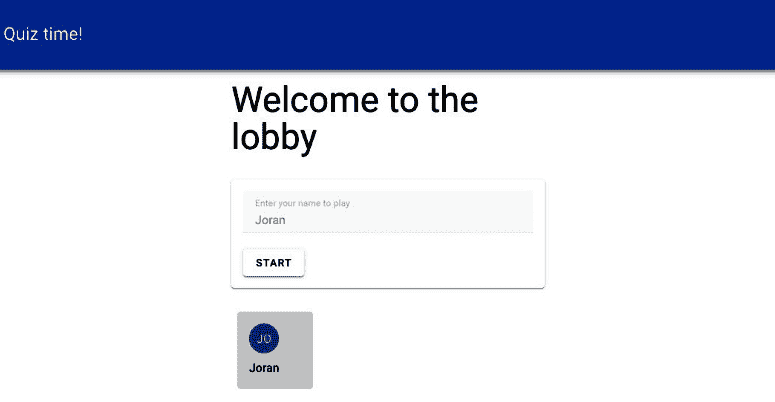

# 8

# 构建一个交互式问答应用

我们将通过创建一个具有管理面板和通过 WebSockets 在多个客户端之间实现实时连接的问答应用来提高本章的复杂性。WebSockets 与我们的常规端点不同，它保持连接打开，允许从中央 socket 服务器向一个或多个客户端发送连续更新。使用这些功能，我们将构建一个小型 Kahoot 克隆。

对于管理面板，我们将使用 Nuxt ([`nuxt.com/`](https://nuxt.com/))。Nuxt 是一个作为 Vue 哲学扩展而构建的框架，但增加了服务器功能。除了第七章中的 Electron 应用*第七章*之外，我们所有的代码都可以在客户端的浏览器中运行。Nuxt 允许 Vue 代码在服务器上执行。除此之外，它还具有许多额外的功能，这些功能极大地改善了**开发者体验**（**DX**）。随着本章的进展，我们将遇到这些功能。

在本章中，我们将涵盖以下主题：

+   熟悉 Nuxt 和服务器端渲染

+   理解 REST API 和 WebSockets 之间的区别

+   复杂应用架构中的客户端体验和服务器角色

+   应用逻辑的结构化

+   在开发环境中使用 Node.js 脚本

我们将构建三个不同的应用，这些应用需要相互通信以形成一个交互式问答。

# 技术要求

在我们的设置中，核心是**服务器问答应用**（**SQA**），它围绕 Nuxt ([`nuxt.com/`](https://nuxt.com/))、Pinia ([`pinia.vuejs.org/`](https://pinia.vuejs.org/))进行状态管理、Supabase ([`supabase.com/`](https://supabase.com/))管理问答数据以及 Vuetify ([`vuetifyjs.com/`](https://vuetifyjs.com/))渲染管理界面而构建。

我们将构建一个独立的`socket.io`服务器 ([`socket.io/`](https://socket.io/))，以在客户端之间保持实时连接。

最后，我们的**客户端问答应用**（**CQA**）将使用 Vuetify 来渲染问答元素 ([`vuetifyjs.com/`](https://vuetifyjs.com/))。

您可以在此处找到本章的完整代码：[`github.com/PacktPublishing/Building-Real-world-Web-Applications-with-Vue.js-3/tree/main/08.quiz`](https://github.com/PacktPublishing/Building-Real-world-Web-Applications-with-Vue.js-3/tree/main/08.quiz).

# 问答应用设置中的实体

为了让您了解我们的元素将如何协同工作，让我们快速看一下以下图示：


图 8.1 – 问答应用设置中的实体概览

与我们之前的项目相比，一个重大变化是，我们的客户端（CQA）不再直接与 Supabase 数据库通信。相反，它通过 SQS 连接，从中检索问题和分数，并将其答案发送回 SQS。SQS 然后，与 SQA 通信以检索相关的测验信息，并在其客户端（CQAs）之间集中当前活动的测验会话。

SQA 用于管理测验内容和与数据库交互。

事先说一句

由于设置相当复杂，本章将不会关注，并且将省略安全措施。了解项目的局限性，不要将其视为生产就绪代码是很好的。在可能的情况下，我们将简要提及影响或可能的解决方案。

让我们通过设置数据库来深入了解。

# 设置数据库

与前几章一样，我们将从设置我们的数据库开始。我们将创建另一个名为 `quiz` 的项目，设置一个强大的数据库密码，并选择一个地理位置相近的区域。

记得记录**项目 URL**和**API 密钥**值！

注意

本章的目的是不专注于数据库管理，以下设置不应被视为生产应用程序的最佳实践！

按照以下步骤设置数据库：

1.  前往 `quiz`。

1.  取消选择**启用行级安全（RLS）**，并在阅读其警告后确认对话框。

1.  在**列**部分，将**id**字段的类型更改为**uuid**。

1.  这个表格就足够了，所以点击**保存**。

我们将仅使用此表作为问题分组机制，因此我们将尽可能保持其简单。

+   现在，返回到 `questions`。再次取消选择 `quiz` 表，并确认**id**列是自动输入的。点击**保存**以关闭外键属性。创建一个名为**question**的列，并将其类型设置为**text**。创建四个名为**answer_1**至**answer_4**的列，并将它们的类型设置为**text**。创建一个名为**correct**的列，并将其类型设置为**int2**。点击**保存**以创建表。

我们不会导入任何预设数据，因为我们将使用我们的 SQA 来处理插入操作！让我们从这个项目中构建我们的第一个应用程序开始。

# The SQA

为了组织我们所有的应用程序，我们将在章节根文件夹中为每个项目创建子文件夹。由于此应用程序将在 Nuxt 上运行，我们可以使用 `Nuxi` CLI 来为我们安装项目。从我们项目的根目录，我们将在命令行中运行以下命令：

```js
npx nuxi@latest init server
```

我们将简单地选择 `npm` 作为我们的包管理器。一旦安装完成，导航到 `server` 文件夹并运行 `npm run dev` 以启动应用程序。默认情况下，它将在端口 `3000` 上运行。在浏览器中打开 URL 后，你应该会看到如下内容：


图 8.2 – 新鲜 Nuxt 安装的欢迎屏幕

虽然这看起来可能不多，但请检查这个页面的源代码。Nuxt 不是将虚拟 DOM 渲染到`<div id="app" />`元素中，而是作为一个 Node.js 进程运行，这意味着它支持 Vue 组件的服务端渲染！这可以非常有益，因为你不必依赖于 JavaScript 在浏览器中执行，这有利于搜索引擎优化、爬虫支持、渲染性能和浏览器内存使用。更多信息，请访问 Nuxt 官方文档([`vuejs.org/guide/scaling-up/ssr.html#server-side-rendering-ssr`](https://vuejs.org/guide/scaling-up/ssr.html#server-side-rendering-ssr))。

在我们的基础搭建好之后，让我们使用 Nuxt 模块系统添加一些额外的功能。

## 模块和自动导入

我们将首先将 Vuetify 添加到我们的项目中。Nuxt 有一个稳固的社区，为每个人贡献了一些模块。在我们的案例中，我们将使用*Nuxt Vuetify 模块*([`nuxt.com/modules/nuxt-vuetify`](https://nuxt.com/modules/nuxt-vuetify))。在我们的`server`文件夹中，运行以下命令：

```js
npm install --save-dev @invictus.codes/nuxt-vuetify
```

Nuxt 模块可以通过修改`nuxt.config.ts`文件来注册和配置，如下所示：

```js
// https://nuxt.com/docs/api/configuration/nuxt-configexport default defineNuxtConfig({
  devtools: { enabled: true },
  modules: [
    '@invictus.codes/nuxt-vuetify'
  ],
  vuetify: {
    moduleOptions: {
      treeshaking: true,
      useIconCDN: true,
      styles: true,
      autoImport: true,
      useVuetifyLabs: true,
    }
  }
})
```

在`modules`属性中，我们注册我们想要使用的模块，并且可选地（在这种情况下）在`vuetify`属性中配置模块应该如何行为。

就这些了！我们现在可以在我们的应用程序中使用 Vuetify 模板。Nuxt 支持一个称为自动导入的概念，这意味着对于常用脚本，我们不需要在脚本块中显式编写导入语句。Nuxt 可以在运行时确定所需的文件！当您开始编写代码时，这将使我们的文件非常干净和易于阅读。

## 基于文件的路由

与自动导入类似，Nuxt 默认使用我们熟悉的`vue-router`，并且配置为根据一定的文件结构为你创建路由。[`nuxt.com/docs/getting-started/routing#routing`](https://nuxt.com/docs/getting-started/routing#routing)。

我们将从一个默认布局开始，通过在`layouts`文件夹中创建一个`default.vue`文件来实现：[`github.com/PacktPublishing/Building-Real-world-Web-Applications-with-Vue.js-3/blob/main/08.quiz/.notes/8.1-default.vue`](https://github.com/PacktPublishing/Building-Real-world-Web-Applications-with-Vue.js-3/blob/main/08.quiz/.notes/8.1-default.vue).

如您所见，我们依赖于 Vuetify 组件为我们创建一个简单的布局。您已经可以识别出几个路由。我们将在下一节中创建它们。现在，我们可以通过更新 SQA 根文件夹中的`app.vue`文件来使用默认布局，内容如下：

```js
<template>  <NuxtLayout>
    <NuxtWelcome />
  </NuxtLayout>
</template>
```

如菜单所示，我们需要几个路由：一个主页路由，一个管理测验的路由，以及一个可以分享测验的路由。

我们将从主页路由开始，在 SQA 文件夹的根目录下创建一个 `pages` 文件夹，并添加一个包含以下内容的 `index.vue` 文件：

```js
<template>  <v-card class="mx-auto" width="600">
    <template v-slot:title>Welcome to the Admin Panel</template>
    <v-card-text>
      <p>
        Via this interface, you can create and edit quizzes. This panel is not perfect, but it works. As an extra challenge consider implementing the following features:
      </p>
      <ul class="ma-4">
        <li>
          Adding meta data to a quiz, such as a title and make it more identifiable in Admin Panel;
        </li>
        <li>Managing the order of Questions in a Quiz;</li>
        <li>Securing the Admin Panel via the Supabase OTP authentication;</li>
        <li>Adding validation on the Question dialog inputs</li>
      </ul>
      <p>Good luck!</p>
    </v-card-text>
  </v-card>
</template>
```

现在，如果我们切换回 `app.vue` 文件，并在开发服务器激活时用 `<NuxtPage />` 组件替换 `<NuxtWelcome />` 组件（注意，我们不需要在我们的脚本块中导入这些组件就可以使用它们？），那么我们的主页现在会在我们的应用中打开 `./pages/index.vue` 的内容！

那么，这里发生了什么？`NuxtPage` 组件内置了一些逻辑，可以读取 `pages` 文件夹，并在初始化为 Nuxt 默认部分的 vue 路由实例上动态创建路由。真不错！

现在，如果我们想要路由到某个路径，我们只需在 `./pages` 文件夹中创建一个与路由名称匹配的新文件夹。在我们的例子中，我们将创建一个 `quiz` 子文件夹，并在该文件夹中添加另一个 `index.vue` 文件。

注意

从技术上讲，你还可以选择在 `./pages` 文件夹中创建一个名为 `quiz.vue` 的文件。然而，由于我们将添加多个属于 `quiz` 域的路由，将它们分组在专门的文件夹中是一个更好的做法。

我们将从 `./pages/quiz/index.vue` 中的一个基本文件开始：

```js
<template>  <div class="my-8">
    <h1 class="text-h3 mb-8">Choose quiz to edit</h1>
    <v-card class="mx-auto" max-width="600">
      <v-divider />
      <v-card-actions>
        <v-btn primary class="my-4 mx-4">✨ Create new Quiz</v-btn>
      </v-card-actions>
    </v-card>
  </div>
</template>
```

现在，当你在浏览器中导航到 `http://localhost:3000/quiz`（或使用导航抽屉中的 **管理测验** 按钮）时，你应该看到以下页面：


图 8.3 – 基于文件的路由在实际中的应用

我们的静态页面对我们帮助不大，所以我们将专注于在下一节中建立与数据库的连接和数据。

## 重新介绍两位熟悉的朋友

正如我们在第六章和第七章中所做的那样，我们将依赖于 Supabase JS 客户端和 Pinia。让我们看看它是如何工作的。

首先，我们将使用 `npm` 命令安装 Supabase JS 客户端（[`www.npmjs.com/package/@supabase/supabase-js`](https://www.npmjs.com/package/@supabase/supabase-js)）：

```js
npm install @supabase/supabase-js
```

我们还将创建一个包含 `supabase.ts` 文件的 `./composables` 文件夹，其内容如下：

```js
import { createClient } from '@supabase/supabase-js'const supabaseUrl = import.meta.env.VITE_SUPABASE_URL
const supabaseAnonKey = import.meta.env.VITE_SUPABASE_ANON_KEY
export const useSupabaseClient = createClient(supabaseUrl as string, supabaseAnonKey as string, { auth: { persistSession: false } });
```

Nuxt 已经设置为扫描 `./composables` 文件夹并提取导出，以便它支持对可组合组件的自动导入！有一个注意事项：它只扫描一个层级，并排除嵌套文件夹。

如您所见，我们需要在我们的 SQA 文件夹的根目录中设置一个 `.env` 文件，其中包含我们在创建数据库时收到的 URL 和 API 密钥。`.env` 文件与第六章和第七章中的设置相同：

```js
VITE_SUPABASE_URL=YOUR_SUPABASE_URLVITE_SUPABASE_ANON_KEY=YOUR_SUPABASE_ANON_KEY
```

在我们的客户端就绪后，我们可以添加 Pinia – 这次，作为一个 Nuxt 模块。在终端中运行以下命令来安装包：

```js
npm install pinia @pinia/nuxt
```

如果你安装过程中遇到 `ERESOLVE` 错误，请查看安装指南中提供的提示（[`pinia.vuejs.org/ssr/nuxt.html#Installation`](https://pinia.vuejs.org/ssr/nuxt.html#Installation)）。

我们将把模块添加到 `nuxt.config.ts` 属性的 `modules` 数组中：

```js
  modules: [    '@invictus.codes/nuxt-vuetify',
    '@pinia/nuxt'
  ],
```

为了获得更好的编码体验，我们还可以通过在 Nuxt 配置中添加以下属性来定义 Pinia 函数的自动导入：

```js
  pinia: {    autoImports: [
      'defineStore',
      ['defineStore', 'definePiniaStore'],
    ],
  },
```

`nuxt.config.ts` 文件将看起来像这样：[`github.com/PacktPublishing/Building-Real-world-Web-Applications-with-Vue.js-3/blob/main/08.quiz/.notes/8.2-nuxt.config.ts`](https://github.com/PacktPublishing/Building-Real-world-Web-Applications-with-Vue.js-3/blob/main/08.quiz/.notes/8.2-nuxt.config.ts)。随着 Supabase 和 Pinia 的部署就绪，我们可以创建我们的测验存储库了！

对于我们的存储库，我们将在 `./pages` 文件夹中创建一个 `./stores` 文件夹，并包含一个 `quiz.ts` 文件，其内容如下：[`github.com/PacktPublishing/Building-Real-world-Web-Applications-with-Vue.js-3/blob/main/08.quiz/.notes/8.3-quiz.ts`](https://github.com/PacktPublishing/Building-Real-world-Web-Applications-with-Vue.js-3/blob/main/08.quiz/.notes/8.3-quiz.ts)。

如果你将这个存储库与，例如，*第六章*中的 *用户存储库* 进行比较，你会注意到缺少了很多导入。这是因为它们由 Nuxt 处理！既然我们不会深入探讨，让我们快速总结一下 *测验存储库* 的功能。

我们的存储库公开了一个所有测验的列表（*第 7 行*）以及从 Supabase 获取该数据的方法（*第 11-30 行*）。我们的存储库还公开了单个测验的属性（*第 8 行*）以及从数据库获取测验数据的相关方法（*第 62-82 行*）。对于测验及其答案，我们公开了更新和删除数据的方法。这就是我们需要继续的基本管理。

我们将重新访问 `./pages/quiz/index.vue` 文件，以在测验级别添加管理：[`github.com/PacktPublishing/Building-Real-world-Web-Applications-with-Vue.js-3/blob/main/08.quiz/.notes/8.4-index.vue`](https://github.com/PacktPublishing/Building-Real-world-Web-Applications-with-Vue.js-3/blob/main/08.quiz/.notes/8.4-index.vue)。

当你运行开发服务器时，你应该能够添加几个新的测验，并且它们将显示在这个概览中，如下面的截图所示：


图 8.4 – 我们的应用程序通过 Pinia 存储连接到数据库

通过在 `./pages` 文件夹中创建一个 `./share` 子文件夹，创建一个 `index.vue` 文件，并将以下内容粘贴到该文件中，我们可以轻松地构建一个用于 `/share` 路由的类似测验概览：[`github.com/PacktPublishing/Building-Real-world-Web-Applications-with-Vue.js-3/blob/main/08.quiz/.notes/8.5-index.vue`](https://github.com/PacktPublishing/Building-Real-world-Web-Applications-with-Vue.js-3/blob/main/08.quiz/.notes/8.5-index.vue)。

我们正在接近目标！如果你注意到了我们创建的两个页面中的 `<nuxt-link />` 组件，你可能已经注意到了它与 `<router-link />` 的相似之处。`<nuxt-link />` 组件是它的包装器，同时也帮助 Nuxt 确定所有可能的路由映射。与基于文件的路由一起，这些 `<nuxt-link />` 组件的出现和配置有助于确定 `vue-router` 实现的配置。你可能也注意到了，这两个组件分别链接到 `/quiz` 和 `/share` 的动态路由。让我们来修复这些问题！

## 动态基于文件的路由

我们将从 `./share` 路由开始。正如你通过链接组件的标记所看到的，我们正在针对一个带有参数的路由：

```js
<nuxt-link :to="`/share/${quiz.id}`">  <v-btn flat>{{ quiz.id }}</v-btn>
</nuxt-link>
```

通常，我们会用以下示例配置我们的 Vue 路由配置：

```js
  routes: [    {
      path: '/share/:id',
      name: share,
      component: () => import('../pages/ShareDetail.vue')
    },
  ]
```

使用 Nuxt，传递参数就像在文件名中标记它一样简单。在 `index.vue` 文件旁边，我们将创建一个名为 `[quiz_id].vue` 的文件。这是在路由文件中定义参数的等效结果。它告诉 Nuxt 指示路由器创建一个带有 `quiz_id` 参数的路由。在文件中，我们可以通过使用 `useRoute` 可组合函数并访问 `params.quiz_id` 属性来读取参数！

在 `[quiz_id].vue` 文件中，我们将添加以下内容：[`github.com/PacktPublishing/Building-Real-world-Web-Applications-with-Vue.js-3/blob/main/08.quiz/.notes/8.6-%5Bquiz_id%5D.vue`](https://github.com/PacktPublishing/Building-Real-world-Web-Applications-with-Vue.js-3/blob/main/08.quiz/.notes/8.6-%5Bquiz_id%5D.vue).

页面本身并没有什么特别之处：它只是生成一个指向 URL 的锚点链接元素，这个 URL 我们将在本章的最后部分构建一个应用！

为了完成管理界面的构建，我们将为某个测验中的问题编辑创建一个页面。首先，作为一个要求，我们将创建一个 `./components` 文件夹，并包含一个 `FormQuestion.vue` 文件，其内容如下：[`github.com/PacktPublishing/Building-Real-world-Web-Applications-with-Vue.js-3/blob/main/08.quiz/.notes/8.7-FormQuestion.vue`](https://github.com/PacktPublishing/Building-Real-world-Web-Applications-with-Vue.js-3/blob/main/08.quiz/.notes/8.7-FormQuestion.vue).

在文件中，我们直接将表单映射到我们数据库中的列。设置起来相当直接，尽管我想指出重复设置答案（*第 33-48 行*）的地方，我们使用 `v-for` 指令生成四个答案字段，并使用动态对象键映射每个字段的 `v-model`（*第 36 行*）。

现在，我们将通过在`./pages/quiz`文件夹中创建一个`[quiz_id].vue`文件，作为`quiz`路由的后代来创建一个动态路由：[`github.com/PacktPublishing/Building-Real-world-Web-Applications-with-Vue.js-3/blob/main/08.quiz/.notes/8.8-%5Bquiz_id%5D.vue`](https://github.com/PacktPublishing/Building-Real-world-Web-Applications-with-Vue.js-3/blob/main/08.quiz/.notes/8.8-%5Bquiz_id%5D.vue).

在完成这些页面后，你应该能够创建一个或两个包含多项选择题的小测验。在我们继续之前，我们需要至少有一个，但最好是更多的测验在数据库中，附带几个多项选择题。

你为什么不尝试创建一个关于 Vue 生态系统的测验呢？

# 设置 SQS

我们接下来的任务是设置处理一个或多个客户端请求的服务器。这将是一个小型独立应用程序，并且它将从我们的 Nuxt 服务器获取数据，因为那已经与数据库实例建立了连接。在 Nuxt 中创建一个端点是我们在还没有构建的，因为我们的 Nuxt 应用程序只能展示管理应用程序！

## Nuxt API 路由

如我之前提到的，Nuxt 应用程序作为 Node 进程运行。当我们请求页面时，它充当一个解析 Vue 组件和路由以返回 HTML 响应的 Web 服务器。除此之外，它还可以同时充当服务器！Nuxt 使用 Nitro 服务器引擎([`nuxt.com/docs/guide/directory-structure/server`](https://nuxt.com/docs/guide/directory-structure/server))来处理`./server`文件夹中的脚本请求。它还支持基于文件的路由和参数，类似于`./pages`文件夹。

为了将测验作为 RESTful API 的一部分来提供，我们将在我们的 Nuxt 项目中创建`./server/api/quiz`结构。在`quiz`文件夹中，我们将创建一个`index.ts`文件。这将通过 Nuxt URL 的`/api/quiz`请求可用：

```js
import type { QuizHead } from '../../types/quiz';import { useSupabaseClient } from '../../composables/supabase';
export default defineEventHandler(async (): Promise<QuizHead[] | null> => {
  console.log("📦 Requesting quizzes from endpoint")
  const { data, error, status } = await useSupabaseClient
    .from(`quiz`)
    .select(`id, created_at`);
  if (error && status !== 406) console.error(error);
  return data
})
```

这里没有发生什么特别的事情。我们添加了带有📦表情符号的`console.log`，这有助于我们分析创建后的应用程序流程。如果你的开发服务器正在运行（添加新文件时可能需要重启），你应该能够通过此 URL 请求测验信息：[`localhost:3000/api/quiz`](http://localhost:3000/api/quiz)。

如果我们正确设置了端点，我们应该在浏览器中看到类似这样的内容。这是我们的测验表内容的 JSON 格式：


图 8.5 – Nuxt 的测验 API 服务器示例

我们将使用参数化文件表示法添加另一个入口点。我们将在`index.ts`文件旁边创建一个`[id].ts`文件：[`github.com/PacktPublishing/Building-Real-world-Web-Applications-with-Vue.js-3/blob/main/08.quiz/.notes/8.9-%5Bid%5D.ts`](https://github.com/PacktPublishing/Building-Real-world-Web-Applications-with-Vue.js-3/blob/main/08.quiz/.notes/8.9-%5Bid%5D.ts).

我们使用这个端点来快速检索所有问题和答案以及用于我们设置的正确答案。现在我们能够检索到测验及其详细信息，我们终于可以构建设置的下一步：SQS。

## 设置基本的 Node 项目

在本节中，我们不会使用任何与 Vue 相关的软件。这部分主要依赖于 Express ([`expressjs.com/`](https://expressjs.com/)) 和 Socket.io ([`socket.io/`](https://socket.io/))。这意味着我们不能依赖有用的 CLI 工具来为我们创建项目。幸运的是，这并不难。返回到我们项目的根目录，我们将创建一个名为`./sockets`的新文件夹。通过 CLI，我们将运行`npm init`命令来定义我们的项目，我们将简单地接受所有默认设置。一旦完成，我们将通过 CLI 安装 Express、Socket.io 和一些 TypeScript 工具包：

```js
npm install express socket.io ts-node @types/node
```

我们还将在`./sockets`文件夹中创建一个`tsconfig.json`文件，其中包含以下配置：

```js
{  "compilerOptions": {
    "target": "ES2022",
    "module": "commonjs",
    "lib": ["dom"],
    "allowJs": true,
    "outDir": "build",
    "rootDir": "./",
    "strict": true,
    "noImplicitAny": true,
    "esModuleInterop": true,
    "resolveJsonModule": true
  }
}
```

对于游戏机制，我提供了一个`Quiz`类，我们可以实现它而不必深入了解细节。创建一个名为`quiz.ts`的文件，其内容如下：[`github.com/PacktPublishing/Building-Real-world-Web-Applications-with-Vue.js-3/blob/main/08.quiz/.notes/8.10-quiz.ts`](https://github.com/PacktPublishing/Building-Real-world-Web-Applications-with-Vue.js-3/blob/main/08.quiz/.notes/8.10-quiz.ts)。

接下来，我们可以处理套接字连接。我们将在`./sockets`文件夹中创建一个名为`index.ts`的文件，其内容如下：

```js
const express = require("express");const { createServer } = require("node:http");
const { Server } = require("socket.io");
import QuizGame from "./quiz";
const app = express();
const server = createServer(app);
// This needs to match the client url of the running app instance
const clientAppUrl = "http://localhost:5173";
let serverOptions = {};
if (process.env.NODE_ENV !== "production") {
  serverOptions = {
    ...serverOptions,
      cors: {
        origin: clientAppUrl, // cors is enabled for socketed connections on localhost:5173
      },
    }
}
const io = new Server(server, serverOptions);
const game = new QuizGame();
// ******************************
// Listen on the port for events
// ******************************
server.listen(4000, () => {
  console.log("🔌 Server is running on port 4000");
});
```

这段代码构建了一个空白服务器。正如你所见，我们已经导入了`Quiz`类，并使用它来在服务器上实例化一个游戏。`clientAppUrl`很重要：当使用套接字时，**跨源资源共享**（**CORS**；[`developer.mozilla.org/en-US/docs/Web/HTTP/CORS`](https://developer.mozilla.org/en-US/docs/Web/HTTP/CORS)）策略将阻止来自 localhost 的传入流量，除非其来源被提供给服务器。

尽管如此，我们现在又遇到了另一个问题：`Quiz`类期望从我们的 Nuxt 服务器获取数据，记得吗？我们需要让 Nuxt 服务器与 SQS 同时运行。我们可以手动在单独的终端窗口中这样做，但也可以编写脚本来自动化启动过程，以便更方便。毕竟，一旦我们完成对 SQS 的工作，我们需要能够运行另一个应用程序来充当客户端！

## 并行执行脚本

在本节中，我们将关注我们项目的根目录，从这里我们将触发子目录中的脚本。我们将使用终端导航到根目录，并使用`npm init`设置另一个 Node 项目，接受默认设置。一旦完成，我们将安装一些辅助包：

```js
npm install nodemon npm-run-all ts-node @types/node open chalk
```

我们还将创建一个名为`open.mjs`的文件，其内容如下：

```js
import chalk from 'chalk';import open from 'open';
const urls = [{
    name: '📦 Quiz Admin Panel',
    url: 'http://localhost:3000',
}]
urls.forEach(url => {
    setTimeout(async (): void => {
        console.log(`✨ Opening ${chalk.black.bgCyan(url.name)} at ${chalk.magenta(url.url)}`);
        await open(url.url);
    }, url.wait || 0);
});
```

在这个文件中，我们使用 `open` 包来自动打开浏览器窗口。为了使控制台中的状态更易于识别，我们使用 `chalk` 为日志的某些部分添加颜色。现在，当我们打开 `package.json` 时，我们可以更改 `scripts` 属性，使其与以下示例匹配：

```js
  "scripts": {    "dev": "npm-run-all --parallel dev:*",
    "dev:sockets": "nodemon ./sockets/index.ts",
    "dev:server": "cd server && npm run dev",
    "dev:open": "node ./open.mjs"
  },
```

那么，这里发生了什么？`npm-run-all` 命令以并行模式触发多个命令——在我们的情况下，所有以 `dev` 为前缀的脚本：

+   `dev:sockets` 脚本使用 `nodemon` 在我们的套接字项目文件夹中运行并监视文件更改

+   `dev:server` 脚本从其文件夹中打开 Nuxt 服务器

+   `dev:open` 脚本执行 `open.mjs` 脚本，该脚本反过来会在预定义的 SQA URL 上打开浏览器窗口

如果你不想每次启动脚本时都打开 SQA，你可以删除 `dev:open` 脚本，或者从 `open.mjs` 文件中的 `urls` 常量中删除条目。

至少我们现在可以用一个命令控制多个脚本的执行。如果我们从项目的根目录运行 `npm run dev`，它将自动启动 Nuxt 服务器以及 SQS！

让我们退一步，解释为什么常规端点不足以满足需求，以及为什么我们正在构建一个完整的套接字服务器作为服务器和客户端之间的层。

## 为什么使用套接字？

我们使用套接字服务器作为我们的测验应用程序的主机。与 RESTful 连接相比，套接字的优势在于数据传输默认是双向的，套接字连接是有状态的和持久的。这使得套接字非常适合依赖于即时更新的应用程序，例如聊天应用程序，或者在我们的情况下，在线游戏（尤其是那些支持协作或竞争的游戏）。

我们正在启动一个客户端可以连接的套接字服务器。在连接时，服务器和客户端之间进行握手，这建立了两者之间的协议和约定。这个握手允许服务器识别客户端，这在处理多个客户端但想要针对个体时非常有用。

一旦建立了连接，客户端和服务器都可以发送带有上下文的事件。服务器可以向所有客户端或单个客户端广播。客户端只向服务器发送事件。根据事件和上下文，我们可以处理事件。

使用 Sockets.io，我们可以使用 `io.emit('event', context)` 广播事件，并使用 `io.on('event')` 监听事件。

在我们的应用程序中，我们将看到服务器和客户端上两种方法的实际应用：服务器处理发送给客户端的信息，并接收客户端给出的答案——我们甚至会用它来控制客户端应用程序的导航状态！从客户端方面来看，我们将监听发送的事件，并使用套接字向我们的测验答案发送回复。

## 完成 SQS

我们可以通过将`./sockets`文件夹中的`./index.ts`文件的内容替换为以下内容来最终确定 SQS：[`github.com/PacktPublishing/Building-Real-world-Web-Applications-with-Vue.js-3/blob/main/08.quiz/.notes/8.11-index.ts`](https://github.com/PacktPublishing/Building-Real-world-Web-Applications-with-Vue.js-3/blob/main/08.quiz/.notes/8.11-index.ts).

我们已经添加了通信的机制。套接字服务器在*第 27-76 行*初始化。在套接字连接事件中，我们定义了服务器需要监听的所有事件：

+   当玩家加入时（*第 17 行*），服务器通过当前状态通知其他玩家（*第 32 行，第 130-133 行*）

+   当玩家准备好开始游戏时（*第 37-41 行*），玩家被添加到当前游戏中（*第 38 行*），并且通知其他玩家

+   如果玩家在游戏过程中回答问题（*第 43-50 行*），则处理答案，并在需要时更新玩家的分数

+   当玩家选择测验时（*第 55-60 行*），服务器查询 Nuxt 服务器以获取问题，并将其更新到当前游戏中（*第 59 行*）

+   当测验开始时（*第 62-66 行*），当前问题被设置为集合中的第一个，并将问题发送给玩家（*第 65 行，第 82-88 行*）

我们有一些选项可以将玩家发送到特定的视图：

+   有一种方法可以向玩家发送问题（*第 82-88 行*）

+   在每第三个问题之间，我们可以显示当前得分（*第 114-118 行*）

+   一旦测验结束，我们将玩家引导到最终得分（*第 120-125 行*）

作为游戏机制的一部分，回答问题是基于时间的。计时器作为游戏的一部分内部运行，但我们会在计时器开始时（*第 138-145 行*）或结束时（*第 147-150 行*）发出事件。

通过所有这些，我们有了交互式测验的基本需求。请注意，它并不非常健壮，但足以有效地传达我们的观点。

在最后一节中，我们将创建一个应用程序来完成整个测验应用平台！

# 创建 CQA

为了总结所有内容，我们将在项目的根目录下创建客户端应用程序作为 Vuetify 项目。让我们通过终端导航到根目录，并输入`npm create vuetify`以开始安装。我们将使用以下设置：

+   `app`作为项目的名称

+   对于预设，我们将选择默认的`Base (Vuetify, VueRouter)`

+   我们将选择 TypeScript

+   安装依赖项时，我们将选择`npm`

安装完成后，我们可以打开文件夹并在我们的 IDE 中开始编辑。

首先，我们将对`vite.config.ts`文件进行一些修改，这有助于我们的应用程序在多应用环境中工作。我们将添加一个名为`clearScreen`的新属性，其值为`false`。这将防止进程清除日志（其中也将包含我们的服务器日志）。我们只需在文件底部简单添加即可。

接下来，我们将定位`server`和`port`属性，并将`port`更改为新值——即`5173`（这对应于我们的 socket 服务器的 CORS 设置）。这防止了 Vuetify 应用程序尝试占用与我们的 Nuxt 应用程序相同的端口！`vite.config.ts`文件的底部应该类似于以下代码：

```js
// ...abbreviatedexport default defineConfig({
  plugins: [
    // ...abbreviated
  define: { 'process.env': {} },
  resolve: {
    // ...abbreviated
  },
  server: {
    port: 5173,
  },
  clearScreen: false,
})
```

在我们继续对应用程序进行工作之前，我们将把我们的客户端应用程序添加到我们的主要开发脚本中。让我们从项目根目录打开`package.json`文件并添加一个运行 Vuetify 开发脚本的脚本：

```js
  "scripts": {    "dev": "npm-run-all --parallel dev:*",
    "dev:client": "cd app && npm run dev",
    "dev:sockets": "nodemon ./sockets/index.ts",
    "dev:server": "cd server && npm run dev",
    "dev:open": "node ./open.mjs"
  },
```

关于`open.mjs`文件，我们将添加一个 URL，该 URL 将自动打开浏览器。我们将给它一个`5000`毫秒的超时时间，因为它需要等待 Nuxt 和 socket 服务器初始化完成：

```js
const urls = [  {
    name: "📦 Quiz Admin Panel",
    url: "http://localhost:3000",
  },
  {
    name: "📱 Quiz App",
    url: "http://localhost:5173",
    wait: 5000,
  },
];
```

现在，我们可以通过使用`npm run dev:client`命令从项目的根目录启动应用程序。我们也可以通过在项目根目录使用`npm run dev`命令一次性启动所有脚本。当我们在应用程序的功能上工作时，这非常方便，因为应用程序本身非常依赖于其他正在运行的实体。

## 设置应用程序

我们将首先设置应用程序的路由和视图。我们将回到应用程序文件夹，对`./src/router/index.ts`文件进行一些修改：[`github.com/PacktPublishing/Building-Real-world-Web-Applications-with-Vue.js-3/blob/main/08.quiz/.notes/8.12-index.ts`](https://github.com/PacktPublishing/Building-Real-world-Web-Applications-with-Vue.js-3/blob/main/08.quiz/.notes/8.12-index.ts)。

现在，对于所有这些路由，我们将在`./src/views`文件夹中添加一个单独的视图 Vue 组件。我们将使用以下模板作为基础（将模板中的标题替换为相应视图的标题）：

```js
<template>  <div class="my-8">
    <h1 class="text-h3 mb-8">Home</h1>
  </div>
</template>
```

最后，你将得到以下视图：


图 8.6 – 与我们的路由匹配的新创建的视图

我们还将通过用以下内容替换`./src/layouts/default.vue`中的内容来简化布局：

```js
<template>  <v-layout>
    <v-app-bar class="bg-primary pa-4"
      ><h1 class="text-h5">Quiz time!</h1>
    </v-app-bar>
    <v-main>
      <RouterView />
    </v-main>
  </v-layout>
</template>
```

我们还可以从文件夹中删除`AppBar.vue`和`View.vue`文件。

在下一步中，我们将着手添加到我们的服务器的连接。

## 添加 socket 客户端

到目前为止，是时候将 socket 客户端添加到我们的应用程序项目中了。在`./app`根文件夹中，通过输入以下命令安装包：

```js
npm install socket.io-client
```

要在我们的应用程序中使用 Socket.io，我们将在`./src`文件夹中创建一个名为`sockets.ts`的文件，并包含以下内容：[`github.com/PacktPublishing/Building-Real-world-Web-Applications-with-Vue.js-3/blob/main/08.quiz/.notes/8.13-sockets.ts`](https://github.com/PacktPublishing/Building-Real-world-Web-Applications-with-Vue.js-3/blob/main/08.quiz/.notes/8.13-sockets.ts)。

此文件将处理来自套接字服务器的连接并将连接作为常量导出（*第 6 行*）。在此文件中，我们还将存储并公开我们接收到的数据，作为一个单一的对象（*第 18-29 行*）。由于对象具有多个层级，我们将使用`reactive`而不是`ref`，因为它的深度响应模型（[`vuejs.org/api/reactivity-core.html#reactive`](https://vuejs.org/api/reactivity-core.html#reactive)）。此`state`将传播它在我们的应用程序中使用的任何更改。

## 监听套接字事件

现在，让我们创建一个功能，使我们能够开始打开一个测验。我们期望用户通过包含测验 ID 的链接进入应用程序。为此，我们将更新`./src/views/Start.vue`文件，并完全替换其内容如下：

```js
<script setup lang="ts">import { onMounted } from 'vue';
import { useRoute, useRouter } from 'vue-router';
import { socket } from "@/socket";
const route = useRoute();
const router = useRouter();
const init = (id: string): void => {
  socket.emit('quiz:select', id);
}
onMounted(() => {
  const id : string | string[] = route.params.id;
  if (id) {
    init(id.toString());
    router.push('/lobby');
  }
});
</script>
```

如您所见，我们甚至不需要任何模板！组件从路由参数中获取`id`值。代码使用套接字来发出`quiz:select`事件，然后将用户重定向到`/lobby`路由。

## 自动路由更改

在我们继续进入大厅之前，我们还将修改`./src/App.vue`文件，使其能够监听测验中的特定状态变化并重定向到某些路由：

```js
<template>  <router-view />
</template>
<script setup lang="ts">
import { computed, watch } from 'vue'
import { RouterView, useRouter } from 'vue-router'
import { state } from '@/socket'
const router = useRouter()
const quizStatus = computed((): string | null => state.quizStatus)
// when quizStatus changes, check if it's "ready" and if so, redirect to /quiz
watch(quizStatus, (newStatus) => {
  if (newStatus === 'question') {
    router.push('/question')
  }
  if (newStatus === 'answer') {
    router.push('/answer')
  }
  if (newStatus === 'end') {
    router.push('/final')
  }
  if (newStatus === 'scoreboard') {
    router.push('/scoreboard')
  }
})
</script>
```

在这里，我们正在导入`quizStatus`并监视其变化。一旦更新的值匹配我们的其中一个路由，我们将程序化地更新路由器以显示相应的视图。现在，让我们进入大厅！

## 大厅中的玩家管理

在大厅中，我们希望能够将自己添加为玩家，同时也想查看所有当前连接的玩家的概览。为了添加玩家，我们将在`./src/components`文件夹中创建一个新的组件，名为`PlayerAdd.vue`：[`github.com/PacktPublishing/Building-Real-world-Web-Applications-with-Vue.js-3/blob/main/08.quiz/.notes/8.14-PlayerAdd.vue`](https://github.com/PacktPublishing/Building-Real-world-Web-Applications-with-Vue.js-3/blob/main/08.quiz/.notes/8.14-PlayerAdd.vue)。

在此情况下，我们将使用套接字连接来发出事件（*第 9-11 行，第 25-27 行*），但我们也会从状态中读取，例如，只允许玩家连接一次。

在文件夹中的下一个组件，名为`PlayersOverview.vue`，将补充大厅：[`github.com/PacktPublishing/Building-Real-world-Web-Applications-with-Vue.js-3/blob/main/08.quiz/.notes/8.15-PlayersOverview.vue`](https://github.com/PacktPublishing/Building-Real-world-Web-Applications-with-Vue.js-3/blob/main/08.quiz/.notes/8.15-PlayersOverview.vue)。

此组件仅从状态中读取，并以良好的格式展示概览，使用户能够在大厅视图中识别自己。

我们现在可以将这两个组件添加到`./src/views/Lobby.vue`文件中，以完成此功能：

```js
<script setup lang="ts">import PlayerAdd from '@/components/PlayerAdd.vue'
import PlayersOverview from '@/components/PlayersOverview.vue'
</script>
<template>
  <div class="my-8">
    <h1 class="text-h3 mb-8">Welcome to the lobby</h1>
    <player-add />
    <players-overview class="my-8" />
  </div>
</template>
```

这是我们第一次看到我们的 socket 实际运作的机会！所以，让我们看看。一旦我们运行了开发脚本，我们的三个应用程序将并行运行。要进入大厅，我们需要通过本地开发 URL 访问 CQA，并将 ID 作为参数提供给`/start`路由。还记得我们的管理员面板吗？它有一个名为`/start/{QUIZ_ID}`的路由，用于大厅：



图 8.7 – 已将玩家添加到大厅

现在，在不关闭现有大厅浏览器窗口的情况下，切换回管理员面板，并在新浏览器窗口中打开相同的链接。你将被再次重定向到大厅。但在这个情况下，你将以新玩家的身份进入。你应该在概览中看到我们之前添加的玩家，准备开始游戏！如果你添加一个新的玩家名称，新玩家将通过 socket 服务器实时添加到两个浏览器窗口中！

看看我们的终端控制台。你会看到显示玩家状态已更改的消息：


图 8.8 – 控制台显示来自 socket 服务器的玩家状态

由于我们已经连接了视图和路由，我们可以触发测验的开始。如果玩家之一点击**开始**，测验将自动遍历所有问题，并最终结束在**最终得分**视图。请随意尝试。你会注意到测验同时由两个浏览器窗口处理！

## 我们需要一些答案

好的——现在是时候构建我们应用程序的核心：回答机制了。对于这个和接下来的部分，我建议准备一个包含四个问题的测验。这样，我们可以在合理的时间内测试所有机制。

我们将在`./components`文件夹中创建一个新的组件，名为`QuestionForm.vue`：[`github.com/PacktPublishing/Building-Real-world-Web-Applications-with-Vue.js-3/blob/main/08.quiz/.notes/8.16-QuestionForm.vue`](https://github.com/PacktPublishing/Building-Real-world-Web-Applications-with-Vue.js-3/blob/main/08.quiz/.notes/8.16-QuestionForm.vue)。

与我们添加和显示玩家的方式类似，我们使用 socket 连接来发射用户的输入（*第 12 行*），同时读取实际状态并在 UI 中展示（*第 15-17 行*）。

在`./src/views/Question.vue`中，我们将导入并显示此组件，作为当前问题的标题显示在视图旁边：

```js
<script setup lang="ts">import { computed } from 'vue'
import { state } from '@/socket'
import type { QuizQuestion } from '@/types/quiz'
import QuestionForm from '@/components/QuestionForm.vue';
const question = computed((): QuizQuestion => {
  return state.quizCurrentQuestion
})
</script>
<template>
  <div class="my-8">
    <h1 class="text-h3 mb-8">{{ question.question }}</h1>
    <QuestionForm />
  </div>
</template>
```

通过将此组件添加到视图中，我们的用户可以尝试并回答问题。我们是否也向用户展示结果呢？让我们创建一个新的组件，名为 `AnswerResult.vue`：[`github.com/PacktPublishing/Building-Real-world-Web-Applications-with-Vue.js-3/blob/main/08.quiz/.notes/8.17-AnswerResult.vue`](https://github.com/PacktPublishing/Building-Real-world-Web-Applications-with-Vue.js-3/blob/main/08.quiz/.notes/8.17-AnswerResult.vue).

在前面的文件中，我们正在使用来自 socket 服务器的测验状态来显示单个用户是否回答正确。如您所见，我们可以完美地追踪哪个用户是哪个，并向他们展示定制的界面。在这种情况下，我们是在客户端应用程序中进行过滤。

再次，我们可以将此 `AnswerResult` 组件添加到正确的视图中——在这种情况下，是 `Answer.vue` 文件：

```js
<script setup lang="ts">import AnswerResult from '@/components/AnswerResult.vue'
</script>
<template>
  <div class="my-8">
    <h1 class="text-h3 mb-8">Answers</h1>
    <answer-result />
  </div>
</template>
```

到目前为止，客户端应用程序已经开始非常接近我们想要的结果：


图 8.9 – 测验回答正确时的状态示例！

到目前为止，我们的工作开始变得有些重复，所以让我们通过显示中间结果和最终得分来完善我们的应用！

## 保留和显示得分

对于我们的得分板，我们将在组件文件夹中创建另一个名为 `ScoreBoard.vue` 的组件：[`github.com/PacktPublishing/Building-Real-world-Web-Applications-with-Vue.js-3/blob/main/08.quiz/.notes/8.18-ScoreBoard.vue`](https://github.com/PacktPublishing/Building-Real-world-Web-Applications-with-Vue.js-3/blob/main/08.quiz/.notes/8.18-ScoreBoard.vue).

我们将组件添加到 `ScoreBoard` 视图中：

```js
<script setup lang="ts">import ScoreBoard from '@/components/ScoreBoard.vue';
</script>
<template>
  <div class="my-8">
    <h1 class="text-h3 mb-8">Scoreboard</h1>
    <score-board />
  </div>
</template>
```

对于最终得分，我们希望为赢家做一些额外有趣的事情。我们将在 `./app` 文件夹的终端中运行以下命令来安装 *Vue Confetti Explosion* 组件（[`github.com/valgeirb/vue-confetti-explosion`](https://github.com/valgeirb/vue-confetti-explosion)）：

```js
npm install vue-confetti-explosion
```

对于我们的盛大结局，我们将确保在名为 `FinalScoreBoard.vue` 的组件中为测验赢家添加彩带，创建以下内容：[`github.com/PacktPublishing/Building-Real-world-Web-Applications-with-Vue.js-3/blob/main/08.quiz/.notes/8.19-FinalScoreBoard.vue`](https://github.com/PacktPublishing/Building-Real-world-Web-Applications-with-Vue.js-3/blob/main/08.quiz/.notes/8.19-FinalScoreBoard.vue).

这里重要的是我们要识别哪个用户是赢家，并向该用户展示彩带（*第 6 行、* *第 22-24 行、第 53-55 行*）！

`FinalScoreBoard` 组件也需要添加到其相应的视图文件（`./src/views/FinalScore.vue`）中：

```js
<script setup lang="ts">import FinalScoreBoard from '@/components/FinalScoreBoard.vue';
</script>
<template>
  <div class="my-8">
    <h1 class="text-h3 mb-8">Scoreboard</h1>
    <final-score-board />
  </div>
</template>
```

就这样，我们的应用就完成了！你现在应该能够同时让一个或多个玩家完成测验：


图 8.10 – 这场比赛只能有一个赢家

我认为我们的客户端应用程序几乎没有值得提及的状态。所有这些都由中央网络套接字服务器处理！

# 摘要

这一章节相当长，涵盖了三个不同的应用程序。我希望各个应用程序的独立角色是清晰的。我也希望你能欣赏套接字服务器设置和 RESTful 服务器之间的差异。在这一章节中，我们使用了两者，各自都有其优势。

此外，考虑到我们在这一章节中编写的代码量，应该很清楚，这些代码在稳健性和安全性方面并不如你期望的生产就绪版本那样。我想强调，这并不是本章的重点！

在这一章节中引入的新概念之一是 Nuxt。正如你可能已经注意到的，它具有非常强大的功能，可以提升最终产品和开发者的体验。你可以将 Nuxt 视为任何 Vue 应用的默认扩展。我支持使其易于正确做事，同时使错误做事变得困难的理念。Nuxt 鼓励的具有偏见的设置使其容易上手。

网络套接字服务器在我们的所有项目中算是一个有点特别的存在。但正如我们从客户端的实现中可以看到的那样，它的实时更新与 Vue 应用的响应式模型非常契合。

作为结束语，我们还通过创建自动化重复性任务的脚本，在我们的开发工作流程中做了一些小的质量提升。你可以将其视为一种迈向工作空间或单仓库设置的垫脚石，这进一步扩展了相互依赖的项目管理。

在下一章中，我们将缩小应用程序的数量，并通过在 Vue 应用中使用人工智能和对象识别来构建一些有趣的东西！
