# 第二章 创建应用程序模块和组件

在本课中，我们将首先创建一个包含所有与显示来自我们的 API 的帖子相关的代码的`PostsModule`。

在这个模块中，我们将添加各种组件、一个服务和两个解析器。

组件用于在浏览器中显示数据。在本课中，我们将介绍它们的用法。服务用于从 API 检索数据。最后，我们将向我们的应用程序添加解析器；解析器确保在从一个路由导航到另一个路由时，服务中的数据可用。

# 课程目标

+   探索我们应用程序中将要使用的组件类型

+   创建并加载 PostsModule

+   创建容器组件，例如 PostsComponent 和 ProfileComponent

+   添加虚拟帖子和个人资料

+   创建一个用于检索数据的服务

+   创建表现性组件，例如 PostListComponent、PostItemComponent 和 ProfileItemComponent

+   创建并导入解析器

# 组件类型

在本节中，我们将探讨如何通过区分**容器**和**表现性**组件来区分我们的组件。有时，它们也被称为*智能*和*愚笨*组件，这取决于每个组件对组件外部世界的*知识*程度。

我们可以做出的主要区别如下：

+   表现性组件负责**外观**

+   容器组件负责**如何工作**

当我们创建它们时，我们将深入探讨这种区分为什么很重要，但我们可以提前透露一些信息。

## 表现性组件

关于表现性组件，我们可以这样说：

+   他们使用`@Input()`装饰器将数据**传递**进来

+   任何操作都是使用`@Output()`装饰器**传递**上去的

+   它们处理应用程序的标记和样式

+   它们主要只包含其他表现性组件

+   它们对任何路由或服务都没有知识（或依赖）

## 容器组件

关于容器组件，我们可以这样说：

+   它们从服务或解析器中检索数据

+   它们处理从表现性组件接收到的操作

+   它们具有非常少的标记和样式

+   它们通常会包含表现性和容器组件

## 文件夹结构

为了在我们的项目中明确区分，我们将为每种类型的组件使用不同的文件夹：

+   `src/<module>/components`文件夹是表现性组件所在的位置

+   `src/<module>/containers`文件夹是容器组件所在的位置

# 生成并懒加载 PostsModule

我们将使用`ng`命令生成`PostsModule`，并在`AppRoutingModule`中懒加载`PostsModule`。

使用`ng generate`命令，我们可以生成或构建出所有可用于我们的 Angular 应用程序的代码。

我们将使用`ng generate module`命令生成我们的`PostsModule`。

此命令有一个必需的参数，即名称。在我们的应用程序中，我们将此模块称为`posts`。还有一个可选参数被传递，以便为该模块创建一个单独的文件来保存路由，即`PostsRoutingModule`：

1.  打开您的终端并导航到项目目录。

1.  在项目目录内运行以下命令：

    ```js
    ng g m posts --routing
    ```

如您从命令输出中看到的那样，我们的`PostsModule`是在新的文件夹`src/app/posts`中生成的：


与我们通过将`UiModule`导入到`AppModule`中来加载`UiModule`的方式不同，我们将使用`AppRoutingModule`来懒加载`PostsModule`。

这是对我们应用程序构建方式的优化，并确保我们的应用程序有一个更小的初始文件要下载，这是通过使用名为**代码拆分**的技术来实现的。这基本上是将每个懒加载的模块捆绑到其自己的文件中，浏览器被指示在需要时下载此文件，但不是在需要之前。

我们将在主应用程序文件中添加两个路由。第一个路由具有空白的`path`属性（我们的默认路由），其功能是重定向到`/posts`路由。

第二个路由是`/posts`路由，它懒加载`PostsModule`。

如果用户导航到应用程序，第一个找到的路由是我们的空白重定向路由。这将告诉路由器导航到`/posts`。路由器找到`/posts`路由并将用户导航到该模块：

1.  在您的编辑器中打开项目。

1.  打开`src/app/app-routing.module.ts`文件。

1.  定位到在`routes`属性中定义的唯一现有路由对象。

1.  在这个新的`children`数组中，我们创建了两个看起来像这样的路由：

    ```js
    { path: '', redirectTo: '/posts', pathMatch: 'full'},
    { path: 'posts', loadChildren: './posts/posts.module#PostsModule' },
    ```

    ```js
    const routes: Routes = [
      { path: '', component: LayoutComponent, children: [
        { path: '', redirectTo: '/posts', pathMatch: 'full'},
        { path: 'posts', loadChildren: './posts/posts.module#PostsModule' },
      ] },
    ];
    ```

这里有一些解释这个工作原理的事情：

+   首先，我们定义我们想要在我们的主路由下有子路由。这确保了所有子路由都在*创建布局组件*部分中定义的`<router-outlet>`中渲染。

+   我们定义了第一个路由以响应所有路径（这就是空字符串的作用），并告诉它重定向到`/posts`路由。

+   最后，我们创建一个`posts`路由，并告诉它从我们新的模块中加载其子路由。`loadChildren`属性是启用懒加载的。

当我们在浏览器中刷新页面时，我们可以看到应用程序本身没有任何变化，但我们可以看到我们的 URL 已经改变；它已经重定向到`/posts`。

让我们继续到下一个部分来创建我们的容器组件，这样我们就可以开始看到数据了！

# 创建容器组件

在本节中，我们将使用`ng generate`来在`PostsModule`内部创建`PostsComponent`和`ProfileComponent`，为这两个组件添加路由，并添加我们可以用来构建表示组件的虚拟数据。

## 创建 PostsComponent 和 ProfileComponent

我们将使用 `ng generate` 命令创建我们的 `PostsComponent`。这是最终列出所有帖子概览的组件。

此组件的应用程序路由将是 `/posts:`

1.  打开您的终端并导航到项目目录。

1.  从项目目录中运行以下命令：

    ```js
    ng g c posts/containers/posts
    ```

    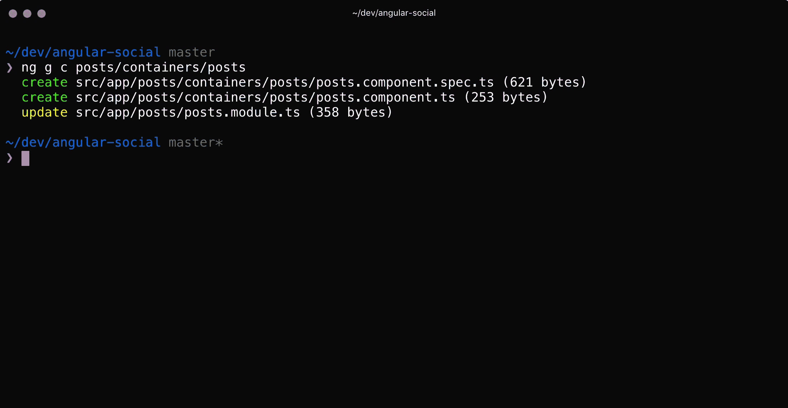

1.  打开 `src/app/posts/posts-routing.module.ts` 文件。

1.  导入 `PostsComponent`：

    ```js
    import { PostsComponent } from './containers/posts/posts.component'
    ```

1.  将以下路由添加到 `routes` 数组：

    ```js
    { path: '', component: PostsComponent },
    ```

现在我们刷新应用程序中的页面，我们应该在页眉和页脚之间看到文本 **posts works!**：


与我们创建 PostsComponent 的方式非常相似，我们现在将创建 `ProfileComponent`。这是负责显示发帖个人资料的组件。

此组件的应用程序路由将是 `/posts/<id>`，其中 `<id>` 是我们想要显示的个人资料标识符：

1.  打开您的终端并导航到项目目录。

1.  从项目目录中运行以下命令：

    ```js
    ng g c posts/containers/profile
    ```

    

1.  打开 `src/app/posts/posts-routing.module.ts` 文件。

1.  导入 `ProfileComponent`：

    ```js
    import { ProfileComponent } from './containers/profile/profile.component'
    ```

1.  将以下路由添加到 `routes` 数组：

    ```js
    { path: ':profileId', component: ProfileComponent },
    ```

当我们的应用程序刷新并且我们将浏览器导航到 `http://localhost:4200/posts/1` 时，我们应该看到文本 **profile works!**：


## 添加虚拟帖子和个人资料数据

为了了解我们的应用程序是如何工作的，我们将在我们的组件中添加一些虚拟数据，以便我们有东西可以工作。我们将添加一个服务来从我们的 API 获取数据：

1.  打开 `src/app/posts/containers/posts/posts.component.ts` 文件。

1.  创建一个名为 `posts` 的新属性，并使用以下结构定义它：

    ```js
    public posts = []
    ```

1.  将以下导入添加到文件顶部：

    ```js
    import { ActivatedRoute } from '@angular/router';
    ```

1.  我们 `posts` 对象中的 `items` 数组将最终包含我们的帖子。我们将使用一个简单的循环添加一些虚拟项。

1.  定位到 `ngOnInit()` 方法，并将以下代码添加到方法体中。此代码在 `posts` 数组中创建 10 个虚拟元素，以便我们可以显示一些数据。这些细节并不重要，因为当我们在下一课从 API 获取数据时，此块将变得过时：

    ```js
    for(let i = 1; i < 10; i++) {
       this.posts.push({ id: i, text: 'This is post with id: ' + i })
     }
    ```

1.  对于最后一步，我们需要更新我们的模板。从 `template` 属性中删除所有内容，并用以下标记替换它：

    ```js
    <div *ngFor="let post of posts">
       <a [routerLink]="post.id">
         {{post.text}}
       </a>
     </div>
    ```

我们模板中的代码使用 `ngFor` 指令遍历 `posts` 数组的内容。对于这些项目中的每一个，它打印一个 `a` 标签，通过 `routerLink` 指令链接到帖子 `id`。链接文本设置为 `post.text`。

这是我们浏览器中看到的内容：


最后，我们将向我们的 `ProfileComponent` 添加一些虚拟数据：

1.  打开 `src/app/posts/containers/profile/profile.component.ts` 文件。

1.  创建一个名为`profile`的新属性，并使用以下结构定义它：

    ```js
    public profile = { id: null };
    ```

1.  在文件顶部添加以下`import`：

    ```js
    import { ActivatedRoute } from '@angular/router';
    ```

1.  定位到`constructor()`方法，并将以下代码添加到方法参数中：

    ```js
    constructor(private route:ActivatedRoute){}
    ```

1.  定位到`ngOnInit()`方法，并将以下代码添加到方法体中。此代码*订阅*了当前路由的参数，当它改变时，它读取 URL 中`profileId`属性的值，并将其分配给`this.profile`的`id`属性：

    ```js
    this.route.params.subscribe(res => this.profile.id = 'profileId = ' + res['profileId'])
    ```

1.  对于最后一步，我们需要更新我们的模板。从`template`属性中删除所有内容，并用以下标记替换：

    ```js
    <p>
      {{profile.id}}
    </p>
    ```

当我们访问`http://localhost:4200/posts/5`时，我们将看到以下内容：


`ngOnInit`块中的代码*订阅*了*激活路由*的参数。当我们通过订阅检索这些参数时，我们使用它将 ID 附加到`post.text`属性中的字符串，使内容动态化。

现在，我们可以从`PostsContainer`点击到`ProfileContainer`组件。我们可以使用后退按钮或页眉中的链接返回。

我们的容器组件已设置好，路由也正常工作。让我们添加一些来自 API 的真实数据！

# 创建一个用于检索数据的服务

在本节中，我们将使用`ng generate`创建`PostsService`，使用`环境`存储 API URL，并在我们的组件中使用`PostsService`。然后，我们在`PostsService`中定义我们的 API 调用，并利用`HttpClientModule`启用 HTTP 访问。

## 生成服务

我们将使用`ng generate service`命令生成一个服务，该服务将处理与我们的 API 的交互：

1.  打开您的终端并导航到项目目录。

1.  从项目目录中运行以下命令：

    ```js
    ng g s posts/services/posts --module posts/posts
    ```

    

## 存储我们的 API URL

我们将使用 Angular CLI 的`环境`来存储我们的 API URL。使用`环境`，我们可以为开发和生产环境定义不同的 URL。

默认情况下，使用 Angular CLI 生成的应用程序带有两个预定义的环境。这些环境在项目根目录的`.angular-cli.json`中定义。

1.  打开`src/environments/environment.ts`文件。

1.  在`环境变量`中，添加一个`apiUrl`键，并将其值设置为字符串`http://localhost:3000/api`，这是开发 API 的 URL：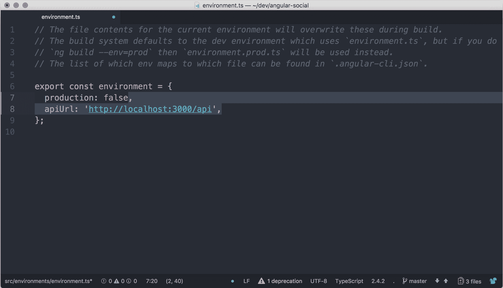

1.  打开`src/environments/environment.prod.ts`文件。

1.  在`环境变量`中，添加一个`apiUrl`键，并将其值设置为字符串`https://packt-angular-social.now.sh/api`，这是生产 API 的 URL：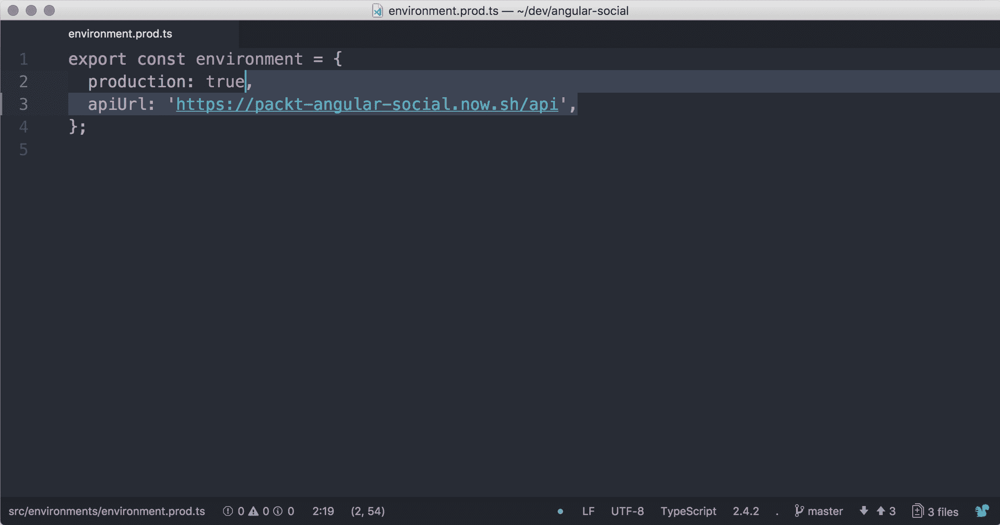

## 在我们的容器组件中引用我们的新 PostsService

在此服务中，我们将在容器组件中引用我们的新`PostsService`，从而定义我们的服务应该是什么样子。

我们将使用 Angular 提供的 `OnInit` 组件生命周期钩子来调用我们的注入服务，并在该服务上调用 `getPosts` 方法。

我们将 *映射* 结果以仅获取项目，然后我们将订阅并将方法的结果设置为我们的 `posts` 属性。

注意我们对 `PostsComponent` 和 `ProfileComponent` 都做了同样的事情：

1.  打开 `src/app/posts/containers/posts/posts.component.ts` 文件。

1.  为我们的新 `PostsService` 添加一个 `import` 语句：

    ```js
    import { PostsService } from '../../services/posts.service';
    ```

1.  更新构造函数以 *注入* `PostsService` 并使其在 `private postsService` 变量下可用：

    ```js
    constructor(private postsService: PostsService) { }
    ```

1.  删除 `ngOnInit` 方法的内容并更新如下：

    ```js
      ngOnInit() {
         this.postsService.getPosts()
           .map(res => res['items'])
           .subscribe((result: any) => this.posts = result)
       }
    ```

1.  打开 `src/app/posts/containers/posts/profile.component.ts` 文件。

1.  为我们的新 `PostsService` 添加一个 `import` 语句：

    ```js
    import { PostsService } from '../services/posts.service';
    ```

1.  更新构造函数以 *注入* `PostsService` 并确保留下我们的 `private route` 依赖项：

    ```js
    constructor(private route: ActivatedRoute, private postsService: PostsService) { }
    ```

1.  删除 `ngOnInit` 方法的内容并更新如下：

    ```js
    this.postsService.getProfile(this.route.snapshot.params['profileId'])
      .subscribe((result: any) => this.profile = result)
    ```

## 定义公共方法

下一步是在我们的 `PostsService` 中定义我们的公共方法，并确保这些方法从我们的 API 获取所需的数据。

我们将在 `PostsService` 中添加两个方法。第一个方法是 `getPosts` 方法，它不接受任何参数并从 API 返回所有帖子。第二个方法是 `getProfile` 方法，它接受 `profileId` 作为参数。它返回与传入的 `profileId` 相关的配置文件，并包括该配置文件创建的所有相关帖子：

1.  打开 `src/app/posts/services/posts.service.ts` 文件。

1.  添加一个 `import` 语句以从 `@angular/common/http` 导入 `HttpClient` 以及一个指向我们定义 API URL 的 `environment` 的引用：

    ```js
    import { HttpClient } from '@angular/common/http';
    import { environment } from '../../../environments/environment'
    ```

1.  更新构造函数以注入 `HttpClient` 并使其在 `private http` 变量下可用：

    ```js
    constructor(private http: HttpClient) { }
    ```

1.  创建一个名为 `getPosts() {}` 的新方法并添加以下内容：

    ```js
    getPosts() {
       const url = `${environment.apiUrl}/posts/timeline?filter[where][type]=text`
       return this.http.get(url)
    }
    ```

1.  创建一个名为 `getProfile(profileId) { }` 的新方法，并添加以下内容：

    ```js
    getProfile(profileId) {
       const url = `${environment.apiUrl}/profiles/${profileId}?filter[include]=posts`
       return this.http.get(url)
     }
    ```

## 在我们的 AppModule 中导入 HttpClientModule

我们几乎完成了 `PostsService` 的创建，但还有一件事需要修复。当我们刷新浏览器中的应用程序时，我们看到在 **控制台** 选项卡中有一个错误消息：

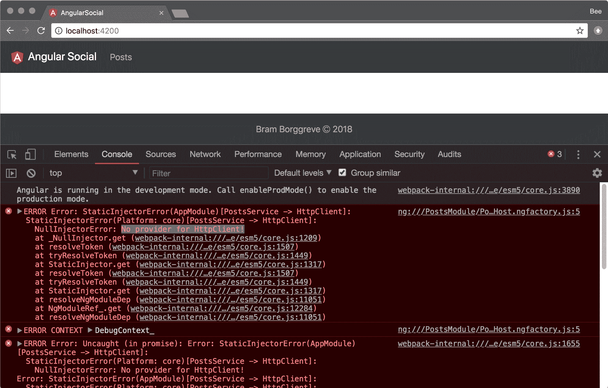

我们得到这个错误的原因是因为我们在服务中使用了 `HttpClient`，但 Angular 不知道这个模块来自哪里。为了解决这个问题，我们需要在 `AppModule:` 中导入 `HttpClientModule`。

1.  打开 `src/app/app.module.ts` 文件。

1.  添加一个 `import` 语句以从 `@angular/common/http` 导入 `HttpClientModule`。

    ```js
    import { HttpClientModule } from '@angular/common/http';
    ```

1.  更新 `NgModule` 装饰器中的 `imports` 数组以导入 `HttpClientModule`：

    ```js
    @NgModule({
       ...
       imports: [
         ...
         HttpClientModule,
         ...
       ],
       ...
     })
    ```

    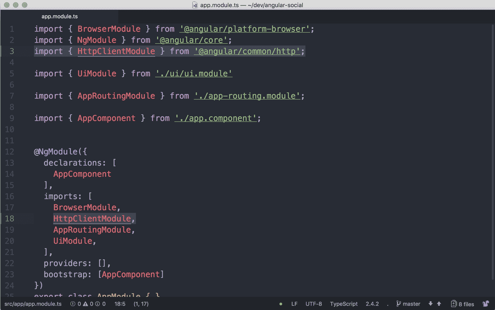

当我们现在检查 **控制台** 选项卡时，我们看到还有一个错误消息，**.map 不是一个函数**：

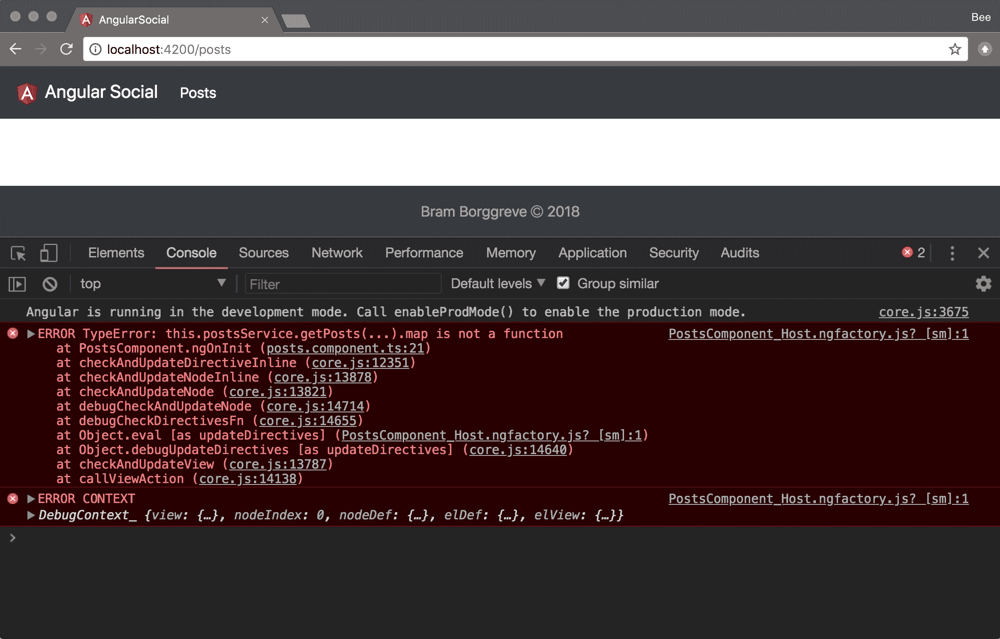

为了解决这个问题，我们需要从 `rxjs` 库中导入 `map` 操作符。

`rxjs` 库是 Angular 的主要依赖之一，用于在 Angular 中实现 *Observable* 模式。它被 Angular 本身用于路由和 HTTP 客户端。

`map` 操作符是 `rxjs` 提供的操作符之一，可以在订阅之前对数据进行映射。如果你想要操作你正在处理的数据，这很有用：

1.  打开 `src/app/app.module.ts` 文件。

1.  添加一个 `import` 语句来导入 `rxjs` 库中的 `map` 操作符：

    ```js
    import 'rxjs/add/operator/map';
    ```

当我们刷新应用程序时，我们应该看到从 API 获取的帖子列表！

让我们继续添加一些表现性组件，为我们的帖子添加一些样式！

# 创建表现性组件

在本节中，我们将使用 `ng generate component` 在 `PostsModule` 内创建 `PostListComponent` 和 `PostItemComponent`。然后我们将为这些组件添加 UI 并在容器组件中使用这些组件。

`PostListComponent` 负责通过其 *Input* 接收一个帖子数组，并遍历这些帖子并调用 `PostItemComponent`。

`PostItemComponent` 接受单个帖子作为其 *Input* 并显示该帖子。

## 创建 PostListComponent

我们将使用 `ng generate` 命令来创建我们的 `PostListComponent`。这是将遍历我们的帖子并从我们的 `PostsComponent` 调用的组件：

1.  打开 `src/app/posts/container/posts/posts.component.ts` 文件。

1.  将模板更新为以下内容：

    ```js
    <app-post-list [posts]="posts"></app-post-list>
    ```

1.  打开终端并导航到项目目录。

1.  从项目目录中运行以下命令：

    ```js
    ng g c posts/components/post-list
    ```

    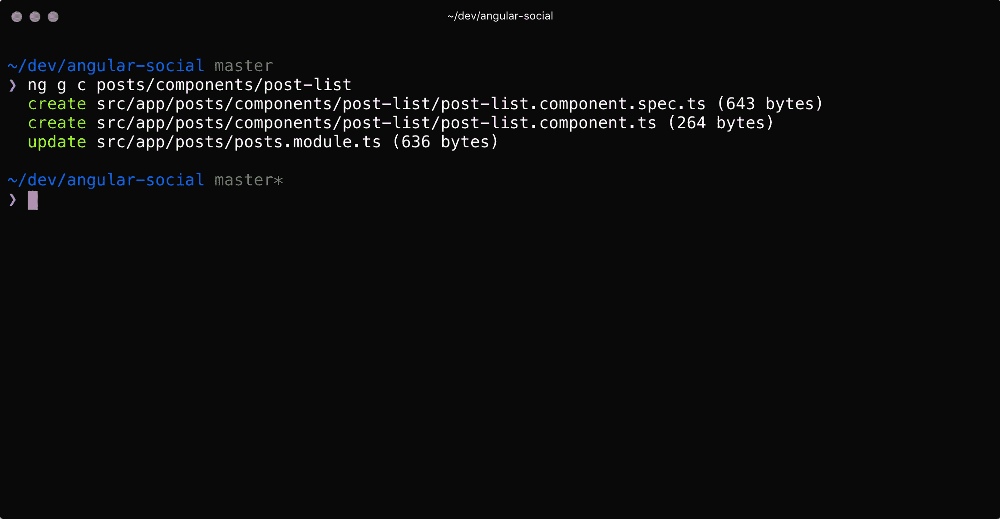

1.  打开 `src/app/posts/components/post-list/post-list.component.ts` 文件。

1.  通过将其添加到现有的 `import` 语句中，从 `@angular/core` 导入 `Input`。

1.  在组件类中添加以下属性：

    ```js
    @Input() posts: any[]
    ```

1.  将模板更新为以下内容：

    ```js
    <div *ngFor="let post of posts" class="mb-3">
       <app-post-item [post]="post"></app-post-item>
     </div>
    ```

## 创建 PostItemComponent

我们将使用 `ng generate` 命令来创建我们的 `PostItemComponent`：

1.  打开终端并导航到项目目录。

1.  从项目目录中运行以下命令：

    ```js
    ng g c posts/components/post-item
    ```

    

1.  打开 `src/app/posts/components/post-item/post-item.component.ts` 文件。

1.  通过将其添加到现有的 `import` 语句中，从 `@angular/core` 导入 `Input`。

1.  在组件类中添加以下属性：

    ```js
    @Input() post: any;
    ```

1.  将模板更新为以下内容：

    ```js
    <!-- The row and the col make sure the content is always centered -->
     <div class="row">
       <div class="col-md-8 offset-md-2">
         <!-- The card is where the message is shown -->
         <div class="card">
           <div class="card-body">
             <!-- We use the Bootstrap 'media' component to show an avatar with content -->
             <div class="media">
               
               <div class="media-body">
                 <!-- The full name of the author is used to navigate to the post detail -->
                 <h5>
                   <a [routerLink]="post?.profile?.id"> {{post?.profile?.fullName}} </a>
                   <span class="date float-right text-muted">

                   </span>
                 </h5>
                 <!-- The text of the post is shown in a simple paragraph tag-->
                 <p>{{post?.text}}</p>
               </div>
             </div> <!-- End media -->
           </div>
         </div> <!-- End card -->
       </div>
     </div> <!-- End row-->
    ```

1.  将组件的 `styles` 属性更新为以下内容：

    ```js
    styles: [`
       img.avatar {
         height: 60px;
         width: 60px;
       }
       span.date {
         font-size: small;
       }
     `],
    ```

如果我们现在刷新浏览器，页面将看起来是这样的：


## 创建 ProfileItemComponent

我们将使用 `ng generate` 命令来创建我们的 `ProfileItemComponent`：

1.  打开 `src/app/posts/container/posts/profile.component.ts` 文件。

1.  将模板更新为以下内容：

    ```js
    <app-profile-item [profile]="profile"></app-profile-item>
    ```

1.  打开您的终端并导航到项目目录。

1.  从项目目录中运行以下命令：

    ```js
    ng g c posts/components/profile-item
      create src/app/posts/components/profile-item/profile-item.
    component.spec.ts (664 bytes)
      create src/app/posts/components/profile-item/profile-item.component.ts (273 bytes)
      update src/app/posts/posts.module.ts (846 bytes)
    ```

1.  打开`src/app/posts/components/profile-item/profile-item.component.ts`文件。

1.  通过将`Input`从`@angular/core`导入到现有的`import`语句中。

1.  在组件类中添加以下属性：

    ```js
    @Input() profile: any;
    ```

1.  将模板更新为以下内容：

    ```js
    <div class="row">
     <div class="col-md-8 offset-md-2">
       <div class="card mb-3" *ngFor="let post of profile.posts">
         <div class="card-body">
           <div class="media">
             
             <div class="media-body">
               <h5>
                 <a [routerLink]="profile?.id"> {{profile?.fullName}} </a>
                 <span class="date float-right text-muted">

                 </span>
               </h5>
               <p>{{post?.text}}</p>
             </div>
           </div>
         </div>
       </div>
     </div>
    ```

1.  将我们组件中的`styles`属性更新为以下内容：

    ```js
    styles: [`
      img.avatar {
       height: 60px;
        width: 60px;
      }
      span.date {
        font-size: small;
      }
    `],
    ```

当我们现在在浏览器中刷新应用程序时，我们看到内容被样式化，并且导航仍然按预期工作：

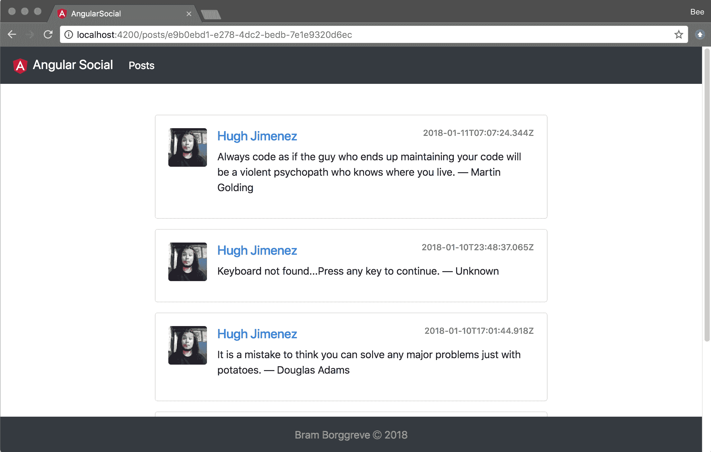

我们已经成功地将检索数据和显示数据的关注点分离了。

通常来说，保持组件尽可能小和简单是一个好主意；特别是，我们的`PostItemComponent`可能可以被拆分成多个组件。

对于我们的目的，这完全适用，我们可以继续本课的最后一个步骤，即使用 Angular 路由器正确处理数据的检索。

# 使用路由器创建用于检索数据的解析器

在本节中，我们将手动创建两个作为解析器的可注入类，然后配置我们的路由器以使用这些解析器。然后我们将更新我们的容器组件以使用这些解析后的数据。

解析器是一个类，我们可以在组件显示之前使用它来获取我们在组件中使用的数据。我们在需要数据的路由中调用解析器。在我们的实现中，解析器从 API 检索数据并返回它，以便可以在组件中显示。

### 注意

更多关于解析器的信息可以在：[`angular.io/guide/router#resolve-pre-fetching-component-data`](https://angular.io/guide/router#resolve-pre-fetching-component-data)找到。

我们的应用程序结构已经很整洁了，但有一件事我们可以优化。

为了看到我们的问题是什么，打开 Chrome 开发者工具并转到**性能**标签页：

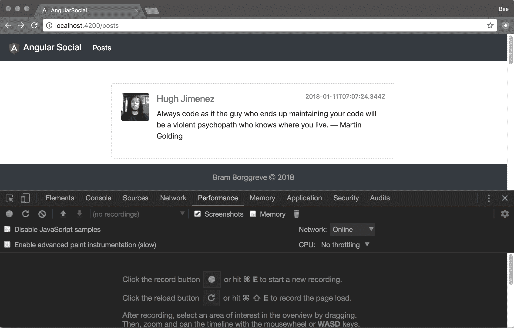

点击齿轮图标，将**网络**设置为**慢速 3G**：


如果我们现在在我们的应用程序中点击，我们会看到我们的页面导航仍然正常工作，但我们看到的是空页面。

原因是，虽然我们的组件加载正确，但它们在加载后仍然需要检索数据。这是因为我们的组件从`ngOnInit`方法中调用`PostsService`。

如果我们的路由器能确保在进入页面之前组件已经加载了所有需要的数据，那就更好了。

幸运的是，Angular 路由器提供了一种使用解析器来处理这种情况的方法。它们会在进入路由之前解析数据，在我们的组件中，我们只需取这些解析后的数据并显示它。

我们创建的解析器需要`@Injectable()`装饰器来确保它们是 Angular 依赖注入的一部分。

## 创建解析器

现在，我们将创建一个解析器来解析我们的帖子：

1.  打开终端并运行以下命令：

    ```js
    ng g class posts/resolvers/posts-resolver
    ```

    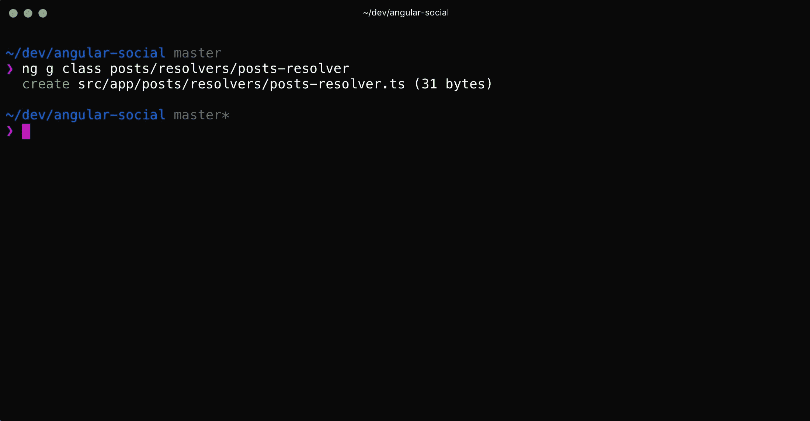

1.  打开`src/app/posts/resolvers/posts-resolver.ts`文件。

1.  在文件开始处定义所需的导入：

    ```js
    import { Injectable } from '@angular/core'
    import { Resolve } from '@angular/router'
    import { PostsService } from '../services/posts.service'
    ```

1.  使用`@Injectable`操作符装饰`PostsResolver`类：

    ```js
    @Injectable()
    export class PostsResolver {}
    ```

1.  使类实现`Resolve<any>`：

    ```js
    @Injectable()
    export class PostsResolver implements Resolve<any> {
    }
    ```

1.  在类内部，创建一个构造函数并注入我们的`PostsService`：

    ```js
    constructor(private postsService: PostsService) {}
    ```

1.  在构造函数下方创建一个名为`resolve`的类方法，并使其返回`PostsService`的`getPosts()`方法：

    ```js
    resolve() {
      return this.postsService.getPosts()
    }
    ```

这是将用于检索所有帖子的解析器，就像我们目前在`PostsComponent`中这样做一样。

现在，我们将创建一个解析器来解析我们的个人资料：

1.  打开终端并运行以下命令：

    ```js
    ng g class posts/resolvers/profile-resolver
    ```

    

1.  打开`src/app/posts/resolvers/profile-resolver.ts`文件。

1.  在文件开始处定义所需的导入：

    ```js
    import { Injectable } from '@angular/core'
    import { ActivatedRouteSnapshot, Resolve } from '@angular/router'
    import { PostsService } from '../services/posts.service'
    ```

1.  使用`@Injectable`操作符装饰`ProfileResolver`类：

    ```js
    @Injectable()
    export class ProfileResolver {}
    ```

1.  使类实现`Resolve<any>`：

    ```js
    @Injectable()
    export class ProfileResolver implements Resolve<any> {
    }
    ```

1.  在类内部，创建一个构造函数并注入我们的`PostsService`：

    ```js
    constructor(private postsService: PostsService) {}
    ```

1.  在构造函数下方创建一个名为`resolve`的类方法，并将`route: ActivatedRouteSnapshot`类传递给它：

    ```js
    resolve(route: ActivatedRouteSnapshot) {
    }
    ```

1.  在`resolve`方法内部，我们返回`PostsService`的`getProfile()`方法，同时从我们的路由中获取`params['profileid']`：

    ```js
    resolve(route: ActivatedRouteSnapshot) {
      return this.postsService.getProfile(route.params['profileId'])
    }
    ```

这是将用于检索我们在路由中导航到的帖子的解析器。

## 导入我们的解析器

我们将把两个新的解析器添加到`PostsRoutingModule`中。我们通过导入解析器，然后为我们的两个路由添加一个`resolve`属性来完成此操作。`resolve`属性接受一个对象，其中键是解析后数据在路由器中的可用方式，值是导入的解析器的引用：

1.  打开`src/app/posts/posts-routing.module.ts`文件。

1.  导入我们刚刚创建的两个解析器：

    ```js
    import { PostsResolver } from './resolvers/posts-resolver'
    import { ProfileResolver } from './resolvers/profile-resolver'
    ```

1.  更新我们的两个路由以添加`resolve`属性并调用解析器：

    ```js
    { path: '', component: PostsComponent, resolve: { posts: PostsResolver } },
    { path: ':profileId', component: ProfileComponent, resolve: { profile: ProfileResolver } },
    ```

当我们现在刷新页面时，我们看到没有输出显示，并且在浏览器控制台中有一个错误：

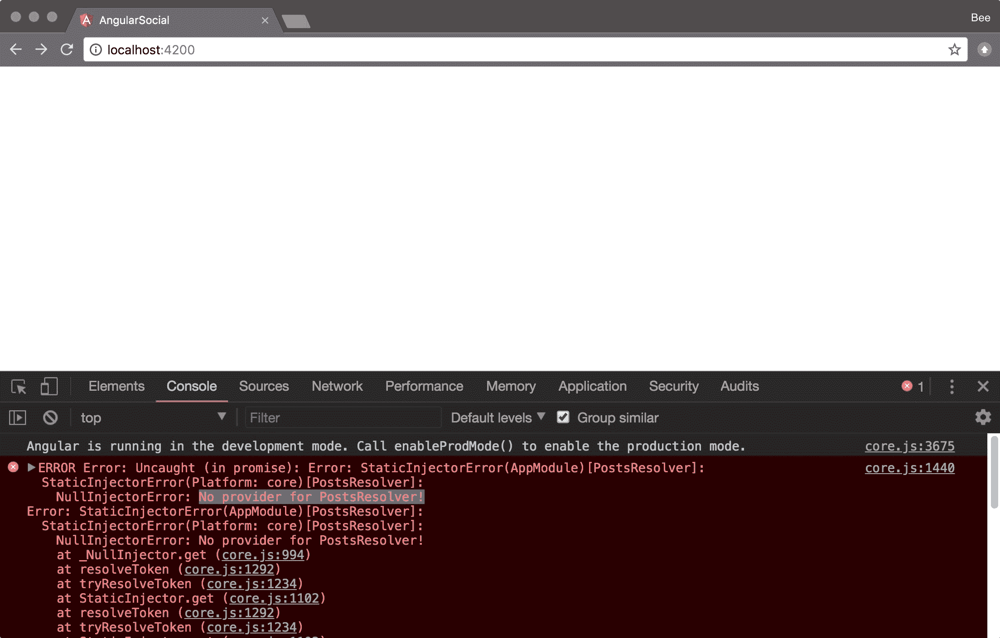

为了修复这个错误，我们需要在我们的模块中`provide`解析器，就像我们处理其他注入器（如服务）一样：

1.  打开`src/app/posts/posts.module.ts`文件。

1.  导入两个解析器：

    ```js
    import { PostsResolver } from './resolvers/posts-resolver'
    import { ProfileResolver } from './resolvers/profile-resolver'
    ```

1.  将两个解析器添加到`providers`数组中：

    ```js
    providers: [PostsService, PostsResolver, ProfileResolver]
    ```

当应用程序刷新时，我们看到控制台中的错误消失了。

如果我们在 Chrome 开发者工具的**网络**标签页中检查，我们会看到我们对同一个端点进行了两次请求。这是因为我们在解析器和组件中两次检索数据。让我们更新我们的容器组件，并让它们使用由路由器解析的数据。

## 使用路由器解析的数据

我们将更新 `PostsComponent` 以读取由我们的路由器解析的数据。我们订阅了活动路由的数据，并对该数据进行了两次映射。在第一次映射命令中，`posts` 值与我们在解析器对象中用于此路由的对象键相关：

1.  打开 `src/app/posts/container/posts/posts.component.ts` 文件。

1.  从 `@angular/router` 中导入 `ActivatedRoute`:

    ```js
    import { ActivatedRoute } from '@angular/router'
    ```

1.  由于我们不再在此处使用它，请移除 `PostsService` 的导入。

1.  更新构造函数以注入 `private route: ActivatedRoute`:

    ```js
    constructor(private route: ActivatedRoute) { }
    ```

1.  更新 `ngOnInit()` 方法并替换内容如下：

    ```js
    ngOnInit() {
      this.route.data
        .map(data => data['posts'])
        .map(data => data['items'])
        .subscribe((result: any) => this.posts = result)
    }
    ```

1.  由于我们到达路由时始终有数据可用，我们可以从 `posts` 属性中移除赋值，使其看起来如下：

    ```js
    public posts: any
    ```

刷新页面并确保数据仍然被加载。

现在，我们将更新 `ProfileComponent` 以读取由我们的路由器解析的数据。我们订阅了活动路由的数据，并对该数据进行了映射。在我们的映射命令中，`profile` 值与我们在解析器对象中用于此路由的对象键相关：

1.  打开 `src/app/posts/container/profile/profile.component.ts` 文件。

1.  由于我们不再在此处使用它，请移除 `PostsService` 的导入。

1.  更新构造函数以仅注入 `private route: ActivatedRoute`:

    ```js
    constructor(private route: ActivatedRoute) { }
    ```

1.  更新 `ngOnInit()` 方法并替换内容如下：

    ```js
    this.route.data
      .map(data => data['profile'])
      .subscribe((result: any) => this.profile = result)
    ```

1.  从 `public profile` 属性中移除赋值，使其看起来如下：

    ```js
    public profile: any;
    ```

完成了！我们的基本应用已经构建完成，尽管还有很多东西可以添加和优化，但它结构良好，并且使用了 Angular 的最佳实践。

在本节中，我们创建了容器组件并添加了虚拟数据。我们还创建了展示组件并为我们的应用实现了解析器。在下一课中，我们将通过添加 Angular Universal 来添加对服务器端渲染的支持。

# 摘要

在本课中，我们学习了不同类型的组件以及如何创建它们。然后我们学习了如何创建解析器以使用路由检索数据。

在下一课中，我们将探讨如何在我们的应用中实现服务器端渲染。
