# 第三章 服务器端渲染

正常应用是如何渲染的？

让我们先看看一个没有服务器端渲染的正常 Angular 应用程序是如何表现的。

当我们在开发模式下启动服务器，使用 `ng serve`，并在浏览器中使用**查看源代码**选项来检查源代码时，我们会看到只有来自我们的 `src/index.html` 文件的输出被渲染，底部附加了一些脚本。

这些脚本将由浏览器下载，下载并执行后，应用程序将显示：

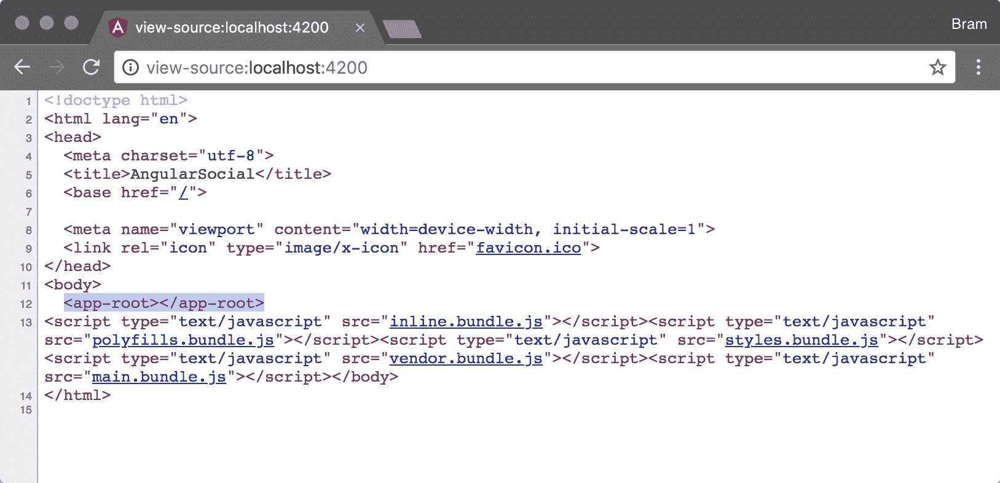

虽然这在某些情况下是可行的，但在其他情况下可能会出现问题。如果您的应用用户处于慢速连接或慢速设备上，加载和解析脚本将需要时间，而在等待期间，用户将看到一个空白页面。

另一个问题是最多的搜索引擎和社交媒体网站只会读取我们网站的初始**负载**，而不会下载和执行我们的客户端 JavaScript 文件。

这些是我们将在本节课中解决的问题。在我们添加了服务器端渲染之后，我们将添加对动态元数据和页面标题的支持。这确保了任何服务器端渲染的页面都有适当的元数据，这将使这些社交页面内容丰富，并确保搜索引擎可以正确索引页面。

要获取实际的加载时间，请使用 Chrome 开发者工具中**网络**标签页的状态栏。

### 注意

在正常 Chrome 浏览器上体验慢速连接的一种方法是在 Chrome 开发者工具中打开，转到**网络**标签页，并将网络速度从**在线**改为**慢速 3G**。当您加载由服务器提供的页面时，您将了解慢速连接加载应用程序需要多长时间：

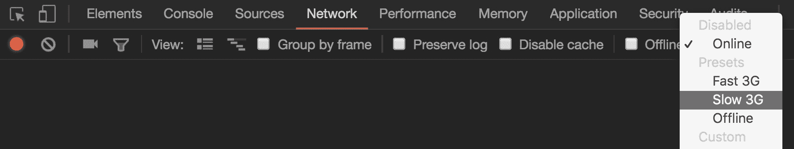

# 课程目标

在本节课中，您将：

+   将服务器端渲染添加到我们在上一节课中构建的应用程序中

+   将 Angular Universal 添加到我们的应用程序中，并在 Angular CLI 配置中配置第二个应用

+   实现一个网络服务器来托管我们的应用

+   将动态元数据添加到我们的应用程序中

# 生成服务器应用

自从 Angular CLI 版本 1.6 以来，就有一个生成器用于添加对 Angular Universal 的支持。它是通过在 Angular CLI 配置文件`.angular-cli.json`中添加第二个应用来实现的。

我们将把这个新应用称为我们的**服务器应用**，而我们在上一节课中使用的应用将被称为我们的**浏览器应用**。

那么，浏览器应用和服务器应用之间有什么区别呢？

+   它们都会加载另一个平台，该平台的行为不同。

+   浏览器应用使用代码拆分，将应用构建成各种较小的文件。这提高了浏览器中的加载时间。服务器构建应用时不进行代码拆分，因为在服务器上这样做没有好处。

+   浏览器应用加载了更多的 polyfills。这些是小型的 JavaScript 库，如果浏览器尚未支持它们，则可以添加功能。对于服务器来说，这不需要。

让我们更详细地探索当我们运行生成器时会发生什么：

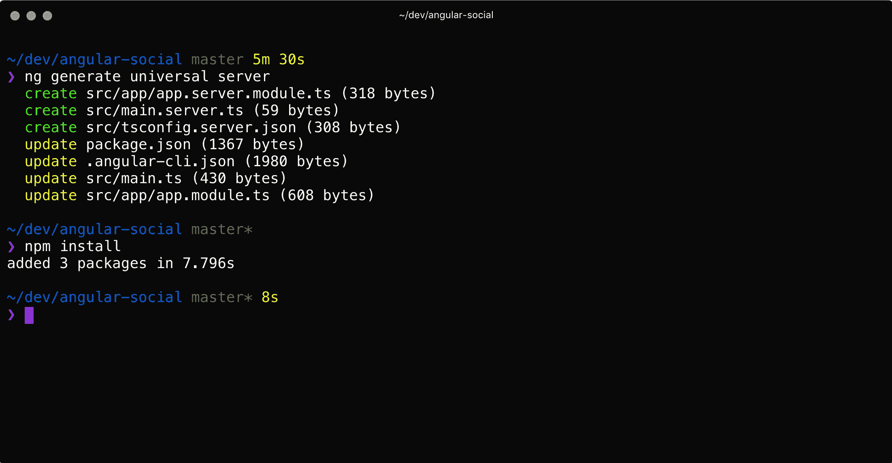

运行此生成器将在当前应用中更改一些内容：

+   它将在`.angular-cli.json`中的`apps`数组中添加第二个应用。

+   它将为`@angular/platform-server`包添加一个依赖项。

+   它将更新`AppModule`并更改`BrowserModule`的导入。

+   它将更改浏览器应用在`src/main.ts`中的引导方式。

此外，它还创建了一些新文件：

+   它生成一个新文件`src/app/app.server.module.ts`，其中包含`AppServerModule`。

+   创建了`src/main.server.ts`文件，该文件导出`AppServerModule`。

+   在`src/tsconfig.server.json`中生成了一个服务器应用的 TypeScript 配置文件。

如上所述，我们在`package.json`中有新的依赖项。这意味着我们需要运行`npm install`以确保依赖项被安装。

## 生成 Angular 通用应用

我们将创建服务器应用并安装缺失的依赖项：

1.  在项目目录中打开终端。

1.  运行生成器以添加通用应用。命令如下：

    ```js
    ng generate universal server
    ```

1.  安装添加到`package.json`中的依赖项：

    ```js
    npm install
    ```

## 使我们的应用保持一致

我们将对浏览器应用和服务器应用进行一些小的修改，以便它们更加一致：

1.  在项目目录中打开终端。

1.  运行以下命令以更新服务器应用的`outDir`：

    ```js
    ng set apps.1.outDir=dist/server
    ```

1.  运行以下命令以更新浏览器应用的`outDir`：

    ```js
    ng set apps.0.outDir=dist/browser
    ```

1.  运行以下命令以更新浏览器应用的`name`：

    ```js
    ng set apps.0.name=browser
    ```

1.  运行以下命令以更新浏览器应用的`platform`：

    ```js
    ng set apps.0.platform=browser
    ```

    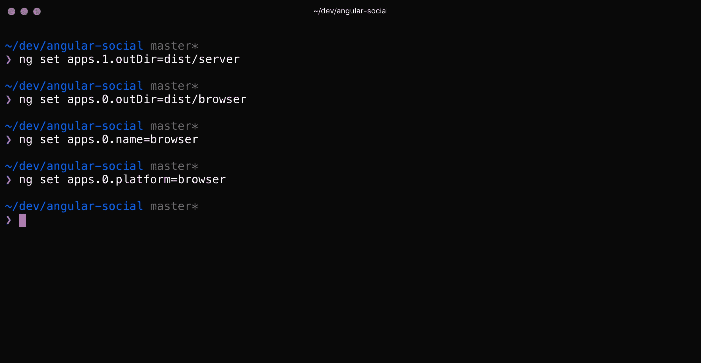

这些更改将在`.angular-cli.json`中反映出来：

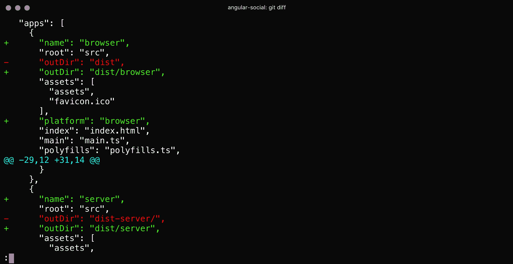

我们现在已经安装了所需的依赖项。

在本节中，我们在已有的浏览器应用之外创建了一个新的服务器应用。让我们继续在我们的应用中添加对 Angular Universal 的支持。

# 为服务器应用添加依赖项

为了确保我们的服务器应用能够正确运行，我们需要确保加载 Angular 的两个依赖项：`zone.js`和`reflect-metadata`。

我们的浏览器应用使用`polyfills.ts`加载这些依赖项，而对于服务器应用，我们将它们添加到`src/main.server.ts`中。

我们还需要添加另一个依赖项，即`ModuleMapLoaderModule`。这是一个第三方模块，它需要与 Angular Universal 应用配合使用懒加载功能。

我们将在`src/main.server.ts`中导入两个依赖项，以便在`AppServerModule`加载时导入。

此外，我们将启用生产模式，就像在`src/main.ts`中对浏览器应用所做的那样：

1.  打开新创建的文件`src/main.server.ts`。

1.  在文件顶部添加导入语句：

    ```js
    import 'zone.js/dist/zone-node';
    import 'reflect-metadata';

    import { enableProdMode } from '@angular/core';
    import { environment } from './environments/environment';
    ```

1.  根据环境条件启用生产模式：

    ```js
    if (environment.production) {
      enableProdMode();
    }
    ```

让我们继续将这个新应用程序添加到我们的 Angular CLI 配置中！

## 将服务器应用程序添加到我们的 Angular CLI 配置中

1.  在项目目录内打开一个终端。

1.  运行以下命令来安装依赖项：

    ```js
    npm install --save @nguniversal/module-map-ngfactory-loader
    ```

1.  在您的编辑器中打开 `src/app/app.server.module.ts` 文件。

1.  在文件顶部添加以下 `import`：

    ```js
    import { ModuleMapLoaderModule } from '@nguniversal/module-map-ngfactory-loader';
    ```

1.  将对导入模块的引用添加到 `imports` 数组中：

    ```js
    imports: [
      ...
      ModuleMapLoaderModule,
    ],
    ```

在本节中，我们添加了所需的依赖项并将服务器应用程序添加到我们的配置中。在下一节中，让我们探索运行脚本并将它们添加到我们的应用程序中。

# 将运行脚本添加到 package.json

现在我们已经将第二个应用程序添加到我们的 Angular CLI 配置中，我们需要确保我们可以轻松地构建这两个应用程序，而无需记住确切的命令。

为了做到这一点，我们将利用所谓的 npm 脚本。这些脚本用于定义可以在我们的应用程序上执行的操作。这些操作的例子包括构建应用程序、运行测试以及将应用程序部署到预发布或生产环境。

我们可以在项目根目录下的 `package.json` 文件的 `scripts` 部分中定义我们的 npm 脚本，以便我们可以轻松地为我们的应用程序创建构建。

在这里，我们将添加三个名为 `build`、`build:browser` 和 `build:server` 的脚本，其中第一个脚本将调用其他两个。

这使我们能够同时运行这两个命令，或者如果我们愿意，可以独立运行它们。

为了了解这些脚本的工作原理，请考虑以下流程：

1.  `npm run build` 命令将首先运行 `npm run build:browser`。

1.  当该命令完成后，它将运行 `npm run build:server`。

运行 `build:browser` 和 `build:server` 脚本的顺序无关紧要；这两个脚本完全独立。

## 添加 npm 脚本

我们将向我们的 `package.json` 添加一些 npm 脚本，以便我们可以轻松地为我们的应用程序创建构建。

1.  在编辑器中打开项目根目录下的 `package.json` 文件。

1.  定位到 `scripts` 对象并删除现有的 `build` 属性。

1.  将以下键添加到 `scripts` 对象中：

    ```js
    "build": "npm run build:browser && npm run build:server",
    "build:browser": "ng build --prod --app browser",
    "build:server": "ng build --prod --app server --output-hashing=false",
    ```

## 测试两个应用程序的构建结果

我们将测试浏览器和服务器应用程序的构建结果：

1.  在项目目录内打开一个终端。

1.  运行以下命令来构建浏览器应用程序：

    ```js
    $ npm run build:browser
    ```

    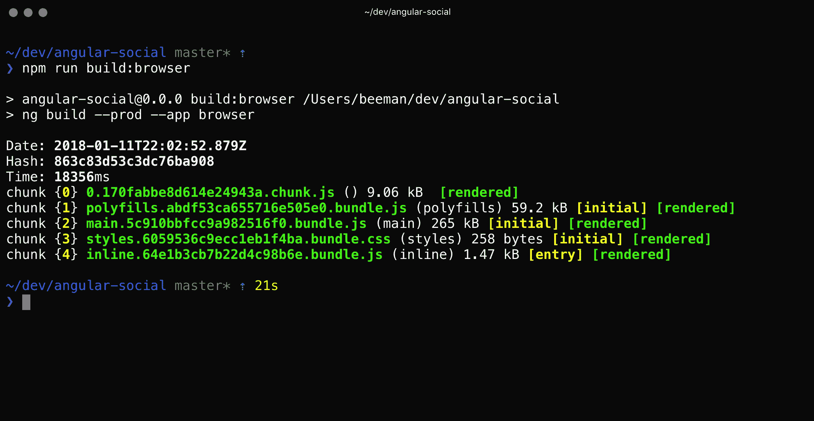

1.  运行以下命令来构建服务器应用程序：

    ```js
    $ npm run build:server
    ```

    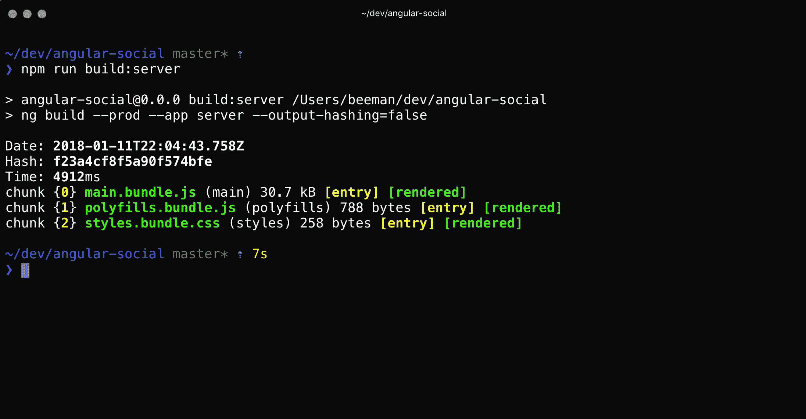

如果两个命令都执行而没有错误消息，我们可以继续进行下一步，即实现一个小型网络服务器来托管我们的应用程序。

# 实现网络服务器

现在我们两个应用程序都可以构建，我们可以继续创建一个简单的服务器来托管我们的应用程序。

为了做到这一点，我们将创建一个基于 Express.js 的简单 Node.js 服务器。

我们将在一个名为 `server.ts` 的 TypeScript 文件中定义我们的服务器，并使用我们将要安装的 `ts-node` 二进制文件运行此文件。

### 注意

Angular Universal 的当前实现依赖于 Node.js，因为它是用 JavaScript 实现的。

可以使用其他服务器运行 Angular Universal 应用程序，例如 ASP.NET，尽管在底层，ASP.NET 服务器将调用 Node.js 进程来处理 Angular Universal 部分。

可以在这里找到一个运行 Angular Universal 的示例仓库：[`github.com/MarkPieszak/aspnetcore-angular2-universal`](https://github.com/MarkPieszak/aspnetcore-angular2-universal)。

## 安装服务器依赖项

我们将安装我们将用于执行服务器文件的 `ts-node` 二进制文件。此外，我们还将安装 Express.js 将用于加载我们的 Angular Universal 应用程序的渲染引擎：

1.  在项目目录中打开终端。

1.  运行以下命令安装 `ts-node`：

    ```js
    npm install --save ts-node @nguniversal/express-engine
    ```

    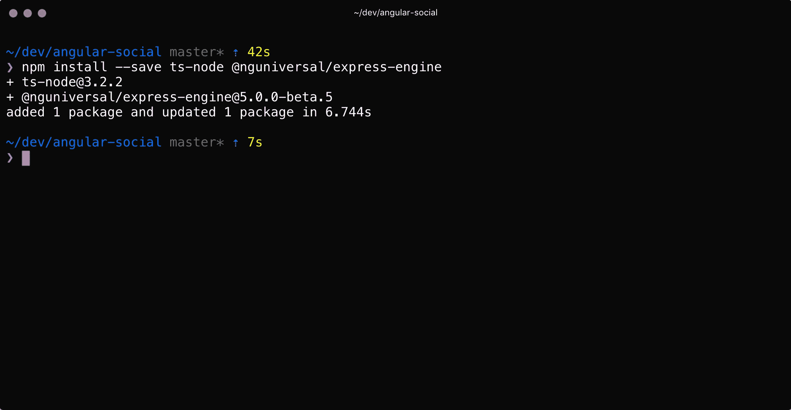

## 创建 server.ts 文件

我们将实现我们的 `server.ts` 文件。

在此文件中，我们将定义我们的 Express.js 服务器并配置它以渲染和提供我们的服务器应用程序：

1.  在您的编辑器中，在项目根目录下创建一个名为 `server.ts` 的新文件。

1.  在文件顶部添加以下 `import` 语句：

    ```js
    import * as express from 'express';
    import { join } from 'path';
    import { ngExpressEngine } from '@nguniversal/express-engine';
    import { provideModuleMap } from '@nguniversal/module-map-ngfactory-loader';
    ```

1.  定义我们将在服务器中使用的常量：

    ```js
    const PORT = process.env.PORT || 8080;
    const staticRoot = join(process.cwd(), 'dist', 'browser');
    const { AppServerModuleNgFactory, LAZY_MODULE_MAP } = require('./dist/server/main.bundle');
    const app = express();
    ```

1.  定义 `html` 视图引擎。这将让 Express.js 知道它使用哪个函数来渲染 HTML 文件：

    ```js
    app.engine('html', ngExpressEngine({
      bootstrap: AppServerModuleNgFactory,
      providers: [
        provideModuleMap(LAZY_MODULE_MAP)
      ]
    }));
    ```

1.  定义 Express.js 的其余默认设置。我们将默认视图引擎设置为 `html`，我们在上一步中定义的引擎。接下来，我们将视图的根目录设置为引用我们的 `staticRoot`：

    ```js
    app.set('view engine', 'html');
    app.set('views', staticRoot);
    ```

1.  使用以下 Express.js 默认设置，我们定义了我们要静态提供所有非 `html` 类型的文件，并且默认路由（`*`）是渲染 `index.html` 文件：

    ```js
    app.get('*.*', express.static(staticRoot));
    app.get('*', (req, res) => res.render('index', { req }));
    ```

1.  启动服务器并记录主机和端口号：

    ```js
    app.listen(PORT, () => console.log(`Server listening on http://localhost:${PORT}`));
    ```

## 将 npm 脚本添加到 package.json

我们将更新 `package.json` 并添加一个用于启动我们服务器的脚本：

1.  在编辑器中打开我们项目根目录下的 `package.json` 文件。

1.  定位到 `scripts` 对象并删除现有的 `start` 属性。

1.  在 `scripts` 对象中添加以下键：

    ```js
    "start": "ts-node ./server",
    ```

## 启动服务器

我们将构建并启动我们的应用程序，并测试它是否正常工作！

1.  使用以下命令运行完整的构建：

    ```js
    $ npm run build
    ```

1.  使用以下命令启动 Node.js 服务器：

    ```js
    $ npm start
    ```

    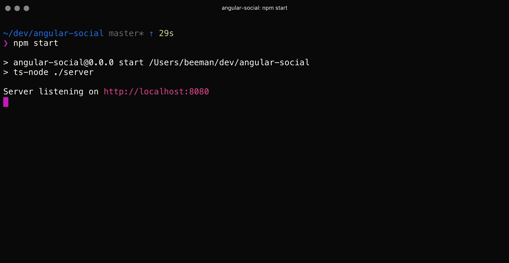

1.  导航到服务器端渲染的构建在：`http://localhost:8080`。

1.  验证应用程序是否正常工作。

1.  从 Chrome 菜单中，转到 **查看** | **开发者工具** | **查看源代码**，并验证应用程序输出是否被渲染。

在本节中，我们使用 Express.js 构建的服务器运行了我们的应用程序。下一步是添加动态元数据，这将帮助我们的应用程序变得更加 SEO 友好。

# 添加动态元数据

现在我们可以使用服务器端渲染来渲染我们的页面，我们可以引入新的功能来增强我们应用的外观。

目前，我们的应用仍然只显示在 `src/index.html` 中设置的默认标题，并且不会添加任何其他 HTML 元标签。

为了提高我们页面的 SEO 友好性，并确保我们的社交预览中有有价值的信息，我们想要解决这个问题。

幸运的是，Angular 内置了 `Meta` 和 `Title` 类，允许我们向我们的页面添加动态标题和元数据。

当与服务器端渲染结合使用时，元数据和页面标题将确保被搜索引擎索引的页面在文档标题中设置了正确的元标签，从而提高可发现性。

在本节中，我们将添加一个服务，允许我们定义这些数据，并且在我们从解析器加载数据后，将更新我们的容器组件以调用该服务。

## 创建 UiService

1.  在项目目录中打开一个终端。

1.  运行以下命令以生成 `UiService` 并将其注册到 `UiModule`：

    ```js
    ng g s ui/services/ui --module ui/ui
    ```

    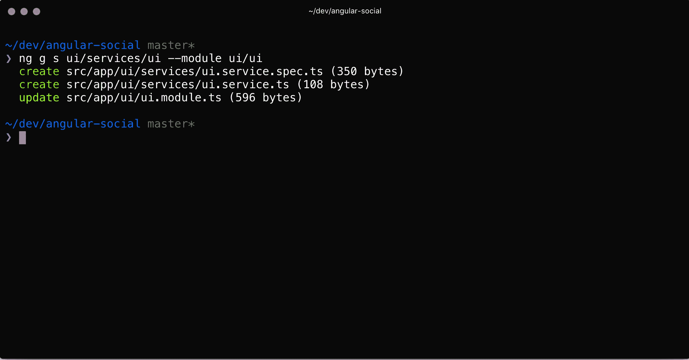

1.  在您的编辑器中打开 `src/app/ui/services/ui.service.ts` 文件。

1.  在类定义中添加以下行：

    ```js
    private appColor = '#C3002F';
    private appImage = '/assets/logo.svg';
    private appTitle = 'Angular Social';
    private appDescription = 'Angular Social is a Social Networking App built in Angular';
    ```

1.  从 `@angular/platform-browser` 中导入 `Title` 和 `Meta`：

    ```js
    import { Meta, Title } from '@angular/platform-browser';
    ```

1.  在构造函数中注入 `private title: Title` 和 `private meta: Meta`：

    ```js
    constructor(private titleService: Title, private metaService: Meta){}
    ```

1.  添加一个名为 `setMetaData` 的类方法，该方法接受一个 `config` 属性：

    ```js
    public setMetaData(config) {}
    ```

1.  将以下代码添加到 `setMetaData` 属性的主体中：

    ```js
    // Get the description of the config, or use the default App Description
    const description = config.description || this.appDescription
    // Get the title of the config and append the App Title, or just use the App Title
    const title = config.title ? `${config.title} - ${this.appTitle}` : this.appTitle;

    // Set the Application Title
    this.titleService.setTitle(title);

    // Add the Application Meta tags
    this.metaService.addTags([
       { name: 'description', content: description },
       { name: 'theme-color', content: this.appColor },
       { name: 'twitter:card', content: 'summary' },
       { name: 'twitter:image', content: this.appImage },
       { name: 'twitter:title', content: title },
       { name: 'twitter:description', content: description },
       { name: 'apple-mobile-web-app-capable', content: 'yes' },
       { name: 'apple-mobile-web-app-status-bar-style', content: 'black-translucent' },
       { name: 'apple-mobile-web-app-title', content: title },
       { name: 'apple-touch-startup-image', content: this.appImage },
       { property: 'og:title', content: title },
       { property: 'og:description', content: description },
       { property: 'og:image', content: this.appImage },
    ]);
    ```

我们的 `UiService` 现在已准备好使用。我们将在下一节中将它添加到我们的组件中。

## 将元数据添加到 PostsComponent 和 ProfileComponent

我们将元数据添加到 `PostsComponent`：

1.  在您的编辑器中打开 `src/app/posts/container/posts/posts.component.ts` 文件。

1.  从 `rxjs` 中导入 `UiService` 和 `map` 操作符：

    ```js
    import { UiService } from '../../../ui/services/ui.service';
    ```

1.  在构造函数中注入 `private uiService: UiService`：

    ```js
    constructor(private route: ActivatedRoute, private uiService: UiService) { }
    ```

1.  添加一个名为 `setMetadata()` 的类方法，该方法接受一个 `posts` 属性：

    ```js
    setMetaData(posts) {}
    ```

1.  将以下内容添加到 `setMetaData` 方法中。在这个方法中，我们将构建动态元数据，并将其传递给 `UiService` 中的 `setMetaData` 方法：

    ```js
    const { itemsPerPage, itemsTotal } = posts['counters']
    const description = `Showing ${itemsPerPage} from ${itemsTotal} posts`
    const title = 'Posts List'

    this.uiService.setMetaData({ description, title })
    return posts;
    ```

1.  更新 `ngOnInit` 方法中的第一个 `map` 语句，如下所示。这将通过我们定义的方法将我们从 API 获取的数据传递过去：

    ```js
    .map(data => this.setMetaData(data['posts']))
    ```

现在，我们将元数据添加到 `ProfileComponent`：

1.  在您的编辑器中打开 `src/app/posts/container/profile/profile.component.ts` 文件。

1.  从 `rxjs` 中导入 `UiService` 和 `map` 操作符：

    ```js
    import { UiService } from '../../../ui/services/ui.service';
    ```

1.  在构造函数中注入 `private uiService: UiService`：

    ```js
    constructor(private route: ActivatedRoute, private uiService: UiService) { }
    ```

1.  添加一个名为 `setMetadata()` 的类方法，该方法接受一个 `profile` 属性：

    ```js
    setMetaData(profile) {}
    ```

1.  将以下内容添加到 `setMetaData` 方法中。在这个方法中，我们将构建动态元数据，并将其传递给 `UiService` 中的 `setMetaData` 方法：

    ```js
    const { fullName, posts } = profile;
    const description = `${fullName} posted ${posts.length} posts.`;
    const title = `Posts by ${fullName}`;
    this.uiService.setMetaData({ description, title });
    return profile;
    ```

1.  更新 `ngOnInit` 方法，如下所示。这将通过我们定义的方法将我们从 API 获取的数据传递过去：

    ```js
    this.route.data
       .map(data => this.setMetaData(data['profile']))
       .subscribe((result: any) => this.profile = result)
    ```

当你现在浏览应用程序时，你应该会看到页面标题根据你访问的页面进行更新。

你可以使用 Chrome 开发者工具中的**元素检查器**来验证元数据是否被添加到渲染的组件中：

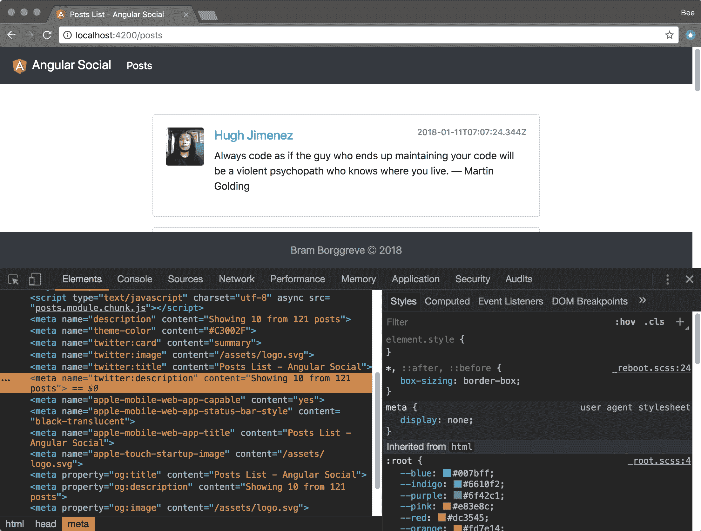

在本节中，我们已将元数据添加到我们的 `PostsComponent` 和 `ProfileComponent`。我们还创建了一个 UiService，允许我们定义这些数据。

# 摘要

在本课中，我们为我们的应用程序添加了服务器端渲染。我们首先生成了服务器应用程序并添加了其依赖项。然后我们在 `package.json` 文件中添加了脚本，在 Express.js 中实现了一个网络服务器。最后，我们看到了如何向我们的页面添加动态元数据。

在下一课中，我们将为我们的应用程序配置服务工作者。
