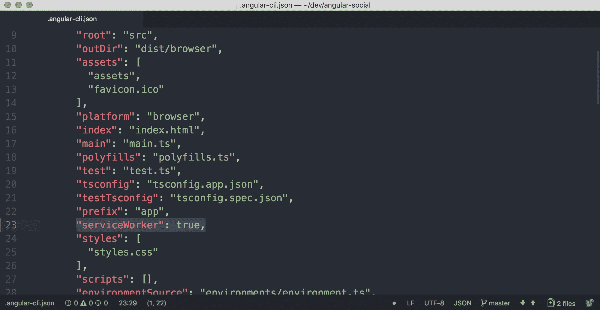
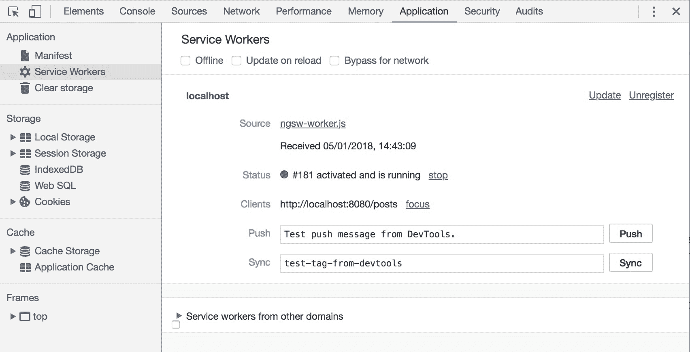

# 第四章 服务工作者

在上一课中，我们学习了如何向我们的应用程序添加服务器端渲染。在下一课中，我们将为我们的应用程序配置服务工作者。

# 课程目标

在本课中，你将：

+   探索服务工作者和 PWAs

+   将服务工作者添加到我们在上一课中构建的应用程序中

+   配置服务工作者将应用转换为渐进式网络应用

+   探索如何调试服务工作者

让我们先了解什么是服务工作者和渐进式网络应用。

# 什么是服务工作者？

服务工作者是一个浏览器在后台运行的脚本，它充当网络代理以编程方式管理网络请求。它位于网络和设备之间，缓存内容，使用户能够离线体验。

除了缓存数据外，它还可以在后台同步 API 数据，并添加推送通知等功能。

# 什么是渐进式网络应用？

**渐进式网络应用**（**PWA**）是一个用于描述以类似原生移动应用方式行为的网络应用的术语。

就像原生应用一样，它们允许在用户离线时启动应用程序，缓存 UI 元素和 API 调用来显示初始页面。这样，用户就可以在基本层面上与应用程序交互，直到连接建立。

一旦建立连接，PWA 将从服务器检索更新数据并刷新应用程序，以便用户可以使用最新数据。

### 注意

官方 Angular 文档有一个关于服务工作者的优秀部分：[`angular.io/guide/service-worker-intro`](https://angular.io/guide/service-worker-intro)

# 安装依赖项

Angular 内置了对服务工作者的支持。为了使用它，我们首先需要安装依赖项。

1.  在项目目录中打开终端。

1.  使用 `npm` 命令安装所需的依赖项：

    ```js
    npm install @angular/service-worker
    ```

1.  当安装成功时，我们应该在我们的项目 `package.json` 文件的 `dependencies` 对象中看到新添加的包：

在本节中，我们已经为我们的服务工作者安装了依赖项，这是在我们的应用程序中实现服务工作者的第一步。让我们继续到下一节，我们将在此处启用应用程序中的服务工作者。

# 启用服务工作者

现在依赖项已安装，是时候启用服务工作者了。

这涉及三个步骤：

1.  在 `.angular-cli.json` 中启用我们的浏览器应用中的服务工作者。

1.  在我们的 `AppModule` 中导入和注册 `ServiceWorkerModule`

1.  创建服务工作者配置文件 `src/ngsw-config.json`。

我们将使用 `ng set` 命令在 `.angular-cli.json` 中启用对服务工作者的支持：

1.  在项目目录中打开终端。

1.  运行以下命令以调整 `.angular-cli.json` 文件：

    ```js
    ng set apps.0.serviceWorker=true
    ```

1.  确认在 `.angular-cli.json` 文件中 `apps` 数组的第一个应用中属性 `serviceWorker` 设置为 `true`：

## 导入 ServiceWorkerModule

我们将在 `AppModule` 中导入 `ServiceWorkerModule` 并注册它。

我们将在 `ServiceWorkerModule` 上调用 `register` 方法。此方法接受两个参数。第一个参数定义了 Angular 服务工作者的位置。在我们的情况下，应该使用值 '`/ngsw-worker.js'`。

第二个参数是一个名为 `environment` 的对象，通过这个对象，我们可以控制是否启用服务工作者。我们使用 `environment` 对象来确定是否应该启用服务工作者，因为我们只想在生产构建中启用它：

1.  在您的编辑器中打开 `src/app/app.module.ts` 文件。

1.  在文件顶部添加以下 `import` 语句：

    ```js
    import { ServiceWorkerModule } from '@angular/service-worker'
    import { environment } from '../environments/environment'
    ```

    将 `ServiceWorkerModule` 添加到 `imports` 数组，并使用这些参数调用 `register` 方法：

    ```js
    ServiceWorkerModule.register('/ngsw-worker.js', {enabled: environment.production}),
    ```

## 创建服务工作者配置

1.  创建 `src/ngsw-config.json` 文件并在您的编辑器中打开它。

1.  将以下内容添加到文件中：

    ```js
    {
     "index": "/index.html",
     "assetGroups": [
       {
         "name": "app",
         "installMode": "prefetch",
         "resources": {
           "files": [
             "/favicon.ico",
             "/index.html"
           ],
           "versionedFiles": [
             "/*.bundle.css",
             "/*.bundle.js",
             "/*.chunk.js"
           ]
         }
       },
       {
         "name": "assets",
         "installMode": "lazy",
         "updateMode": "prefetch",
         "resources": {
           "files": [
             "/assets/**"
           ]
         }
       }
     ]
    }
    ```

    在这里，我们将初始默认内容添加到 `ngsw-config.json` 文件中。这是 Angular 团队提供的默认配置，可以在以下位置找到：[`angular.io/guide/service-worker-getting-started#step-4-create-the-configuration-file-ngsw-configjson`](https://angular.io/guide/service-worker-getting-started#step-4-create-the-configuration-file-ngsw-configjson)

1.  在项目目录中打开终端。

1.  运行 `npm run build:browser` 以创建生产构建。

1.  验证构建是否成功运行，并且文件 `ngsw-worker.js` 和 `ngsw.json` 已在 `dist/browser` 目录中生成。

在本节中，我们在应用程序中启用了服务工作者并使用了默认配置。我们已经验证了生产构建生成了服务工作者配置。

让我们添加一些自定义配置选项。

# 配置服务工作者

在上一节中，我们将服务工作者配置文件 `src/ngsw-config.json` 添加到我们的项目中，但我们还没有进行任何配置。

在本节中，我们将添加两种类型的配置：资产组和数据组。

## 资产组和数据组

在资产组配置中，我们指定我们的服务工作者如何处理我们的应用程序的资产。当我们谈论资产时，我们应该想到样式表、图像、外部 JS 文件等等。

资产组使用以下 TypeScript 接口定义：

```js
interface AssetGroup {
  name: string;
  installMode?: 'prefetch' | 'lazy';
  updateMode?: 'prefetch' | 'lazy';
  resources: {
    files?: string[];
    versionedFiles?: string[];
    urls?: string[];
  };
}
```

参数的含义如下：

+   `name` 唯一标识资产组

+   `installMode` 定义了新资源最初如何缓存

+   `updateMode` 定义了现有资源的缓存行为

+   `resources` 对象描述了实际要缓存的资源

完整的参考信息可以在以下位置找到：[`angular.io/guide/service-worker-config#assetgroups`](https://angular.io/guide/service-worker-config#assetgroups)。

在数据组配置中，我们指定了我们的 Service Worker 如何缓存我们从 API 请求的数据。

数据组使用以下 TypeScript 接口定义：

```js
export interface DataGroup {
  name: string;
  urls: string[];
  version?: number;
  cacheConfig: {
    maxSize: number;
    maxAge: string;
    timeout?: string;
    strategy?: 'freshness' | 'performance';
  };
};
```

这里是这些参数的含义：

+   `name` 唯一标识该组

+   `urls` 是一个 URL 模式数组

+   `version` 提供了一种机制来强制重新加载缓存项

+   `cacheConfig` 定义了用于缓存此组的策略

完整的参考信息可以在以下位置找到：[`angular.io/guide/service-worker-config#datagroups`](https://angular.io/guide/service-worker-config#datagroups)。

## 配置资产组和数据组

我们将向资产组配置中添加两个项目。

第一个资产组缓存了来自我们用于获取 CSS 和其中包含的字体所使用的域的数据。

第二个资产组缓存了我们工作中使用的 API 的静态数据；在这种情况下，是用户头像：

1.  在您的编辑器中打开 `src/ngsw-config.json` 文件。

1.  定位到 `assetGroups` 数组。

1.  向此数组添加以下两个对象：

    ```js
    {
       "name": "externals",
       "installMode": "prefetch",
       "updateMode": "prefetch",
       "resources": {
         "urls": [
           "https://ajax.googleapis.com/**",
           "https://fonts.googleapis.com/**",
           "https://fonts.gstatic.com/**",
           "https://maxcdn.bootstrapcdn.com/**"
         ]
       }
     },
     {
       "name": "avatars",
       "installMode": "prefetch",
       "updateMode": "prefetch",
       "resources": {
         "urls": [
           "http://localhost:3000/avatars/**",
           "https://packt-angular-social.now.sh/avatars/**"
         ]
       }
    }
    ```

    确保正确格式化 JSON；使用 [`jsonlint.com/`](https://jsonlint.com/) 来确保正确性。

我们将创建数据组配置。我们将定义一个数据组，用于缓存来自我们 API 的请求：

1.  在您的编辑器中打开 `src/ngsw-config.json` 文件。

1.  创建一个带有 `dataGroups` 键的顶级数组。

1.  向此数组添加以下对象：

    ```js
    {
       "name": "rest-api",
       "urls": [
         "http://localhost:3000/api/**",
         "https://packt-angular-social.now.sh/api/**"
       ],
       "cacheConfig": {
         "strategy": "freshness",
         "maxSize": 100,
         "maxAge": "1h",
         "timeout": "5s"
       }
    }
    ```

在本节中，我们在 Service Worker 中配置了应用程序的资产组和数据组。

使用此配置和运行中的 Service Worker，我们应该能够检索到一个完全样式化的应用程序，该应用程序显示最新的 API 数据。

# 测试 Service Worker

为了测试我们的 Service Worker 是否正常工作，我们必须加载我们的应用程序，然后断开浏览器与互联网的连接。

## 检查数据来源

使用 Chrome 开发者工具，可以轻松地看到特定资源是从哪里检索的。

使用 Chrome 开发者工具中的 **Network** 选项卡，您可以看到正在检索哪些文件，数据来自哪里，以及浏览器检索这些资源花费了多长时间。

下面的屏幕截图显示了一个正常的页面请求，其中每个文件都是从网络服务器下载的：


在下面的屏幕截图中，在 **Size** 列中，您可以看到数据是从 Service Worker 中检索的。这意味着它没有向网络发出请求来获取这些项；相反，它从浏览器缓存中获取了它们：


## 启用离线模式

网络浏览器在线是它的本质，但在现实中，我们都发现自己处于设备离线的情况，这是由于缺乏网络连接。

为了开发能够处理这些情况的应用程序，Chrome 提供了一个所谓的**离线模式**。它将阻止浏览器连接到网络。这样，我们可以确保我们的应用程序按预期运行。

在 Chrome 开发者工具的**网络**标签页中，你可以找到一个名为**离线**的复选框，它触发了这种行为：


在勾选此框后，你将在标签名称旁边看到一个黄色的指示器，这表明**网络**标签页存在异常情况：


### 运行浏览器应用程序的本地构建

我们将构建一个启用 Service Worker 的应用程序的生产版本。一旦构建完成，我们将使用一个简单的名为 `http-server` 的网络服务器托管该构建，并在我们的浏览器中打开它：

1.  使用以下命令构建浏览器应用程序：

    ```js
    npm run build:browser
    ```

1.  使用以下命令启动应用：

    ```js
    npx http-server ./dist/browser
    ```

    应用程序现在将在：`http://localhost:8080`上提供服务。

1.  在浏览器中打开页面。你应该看到帖子列表。

1.  在 Chrome 开发者工具中打开**控制台**标签页，并验证是否存在错误。

### 检查行为

我们将看到我们的应用程序在启用 Service Worker 时的行为：

1.  在浏览器中打开上一个练习的页面。

1.  在 Chrome 开发者工具中打开**网络**标签页。

1.  在打开此**网络**标签页的情况下，重新加载 `http://localhost:8080` 以查看数据来源。

你应该看到数据是从 Service Worker 加载的。

### 将我们的应用程序设置为离线模式

我们将把我们的应用程序设置为**离线**模式，并验证 Service Worker 是否显示了我们应用程序的完整和缓存版本：

1.  在浏览器中打开上一个练习的页面。

1.  在 Chrome 开发者工具中打开**网络**标签页。

1.  通过勾选复选框启用**离线**模式。

1.  在**离线**模式下，导航到：`http://localhost:8080`。

你应该看到我们的应用程序仍然被加载并显示缓存的数据。

在本节中，我们运行了我们应用程序的本地构建，并测试了其在离线模式下的行为。即使在离线模式下，我们的应用程序也能正常运行。我们现在可以探索如何调试我们的 Service Worker。

# 调试 Service Worker

计算机科学中有一句著名的话：

> “计算机科学中有两个难题：缓存失效，命名事物。”
> 
> -Phil Karlton

第一个适用于调试 Service Worker。

如前所述，Service Worker 在网络和设备之间添加了一个缓存层。这本质上使得调试变得困难，因为当你更新你的 Service Worker 定义或网站的配置时，你的更改可能会被缓存，因此不可见。

这是在使用支持 Service Worker 的应用程序开发中相当常见的挑战，因此了解如何调试 Service Worker 是很好的。



## Chrome 开发者工具来帮忙

Chrome 开发者工具是一个用于检查和调试网站背后技术的先进工具，幸运的是，它对服务工作者有很好的支持。

在**应用程序**标签页中，我们可以看到已安装的服务工作者，它们的状态是什么，以及注销它们以确保我们下载最新版本。

### 定位正在运行的服务工作者

我们将找到可以找到正在运行的服务工作者的地方：

1.  在浏览器中打开上一个练习的页面。

1.  在 Chrome 开发者工具中打开**应用程序**标签页。

1.  在**应用程序**标签页的侧边栏中点击**服务工作者**链接。

1.  验证服务工作者列表中是否有条目。

### 注销已注册的服务工作者。

我们将注销我们的服务工作者：

1.  在浏览器中打开上一个练习的页面。

1.  在 Chrome 开发者工具中打开**应用程序**标签页，并点击侧边栏中的**服务工作者**链接。

1.  定位到状态设置为**激活**的服务工作者条目。

1.  点击**更新**链接旁边的**注销**链接。

1.  当您现在刷新页面时，应该加载一个新的服务工作者。

### 注意

如果您只是刷新页面，它将加载我们构建中的相同服务工作者。

构建服务工作者的开发周期看起来大致如下：

1.  在 Angular 应用程序中做出更改。

1.  使用`npm run build:browser`命令创建生产构建。

1.  使用`npx http-server ./dist/browser`命令提供新的构建版本。

1.  注销当前活动中的服务工作者。

1.  浏览到新版本并验证您所做的更改是否已应用。

在本节中，我们看到了如何在浏览器中定位服务工作者。然后，我们通过注销它来调试它。

# 摘要

在本节课中，我们完全使用了服务工作者。我们首先安装了所需的依赖项。然后，我们继续启用服务工作者，配置它，测试它，最后调试它。
