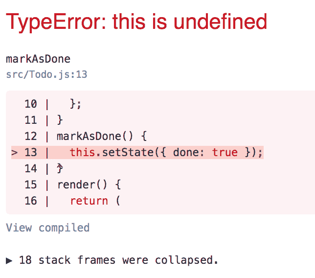

# 第二章：创建我们的第一个 Create React App 应用程序

在第一章《介绍 Create React App 2》中，我们首先仔细研究了 Create React App 及其提供的一些选项。我们甚至开始了`create-react-app`的学习，并从非常基础的 React 知识开始学习。然而，我们现在需要开始构建一个将作为添加更多功能和测试 Create React App 极限框架的应用程序。 

为了让事情更加简单，我们将构建一个简单的**待办事项列表**，因为这是一个几乎每个人都能理解的应用程序。它甚至有一个很好的非数字类似物，这使得它很容易进行推理！

在本章中，我们将涵盖以下主题：

+   设计一个网络应用程序

+   构建一个简单的项目结构

+   通过 props 向组件传递值

+   通过 props 将函数传递给子组件

+   使用包含的 CSS 进行基本组件样式设计

# 创建我们的第一个主要项目

现在是我们向前推进并开始构建一个真正项目的时候了，这个项目将作为我们想要在这个书中探索的所有其他功能的基准项目。不过，为了做到这一点，让我们先简要地谈谈我们想要如何设计我们的应用程序。

# 设计我们的应用程序

当你不确定最初要构建什么时，构建项目是非常困难的，对吧？当我们谈论如何设计、构建和规划一个应用程序时，我们需要讨论我们最初试图解决的问题。考虑到这一点，让我们来谈谈我们应用程序的理论愿景。

首先，我们将构建一个介于**番茄计时器**和待办事项列表之间的混合体。这将给我们一个普通的待办事项列表的功能，同时允许我们在通过列表时跟踪每个项目花费的时间。我们将保持这个应用程序的整体设计相当简单；没有必要深入一个庞大的应用程序。一个相对较小且简单的应用程序将教会你如何快速开始使用 Create React App。

本章也将是唯一一个真正只关注 React 方面，而较少关注 Create React App 的章节。如果你在开始使用任何工具后不知道如何构建东西，那么能够开始使用任何工具基本上是没有用的，这就是本章旨在帮助你解决的问题。

我们的应用程序将有一个简单的待办事项界面，每个待办事项都有一个“标记为完成”按钮。对于每个项目，你可以在添加后将其标记为完成，并且它将更改该项目的显示，让你知道它已完成。实际上并没有什么特别复杂的事情，只是一个非常简单的应用程序设计。让我们看看这个设计的可能样子（从非常高的层面来看）：


# 为我们的应用程序构建基准功能

现在我们已经了解了设计，我们将直接开始创建项目并构建。虽然应用程序本身并不特别复杂，但整体上具有一定的复杂性，并且我们将最终需要编写相当多的代码。为了使一切正常工作，我们将分离应用程序的关注点，并确保我们在有限范围内构建的内容仍然非常类似于在现实世界应用程序中构建的内容！

# 创建我们的项目

与上一个项目类似，我们将使用 Create React App 创建一个新的项目，我们将称之为 `todoifier`：

```js
$ create-react-app todoifier
```

在项目创建完成后，我们将通过在项目上运行 `start` 来验证一切是否正确设置并运行：

```js
$ yarn start
```

# 初始化我们的组件以构建在之上

在构建你的项目时，你应该努力使顶级组件（在我们的例子中是 `src/App.js`）尽可能简单，并尽可能少地将其中的代码放入其中。在我们的例子中，我们将移除所有内容（类似于我们在上一章第一章，*介绍 Create React App 2*)中完成的工作，并用一个简单的替换标题和一些其他内容来替换它：

```js
import React from 'react';
import './App.css';

const App = () => (
 <div className="App">
   <h2>Todoifier</h2>
 </div>
);

export default App;
```

我们还希望从 `App.css` 中移除所有内容，因为我们在这个项目中也将采取空白石板的方法！

# 在单独的文件中构建独立的组件

Create React App 最令人愉快的事情之一是它使导入其他文件作为它们自己的独立 React 组件的过程变得非常简单，而无需你真正思考 Webpack 如何组织一切。我们将从构建一个新的简单组件开始。让我们创建一个 `Todo` 组件来跟踪我们将需要添加的每个 `Todo` 项目。

在 `src/Todo.js` 中，我们希望复制 `App.js` 中的所有内容（除了 `className` 属性中的字符串和函数名）：

```js
import React from 'react';
import './Todo.css';

const Todo = () => <div className="Todo">I am an item</div>;

export default Todo;
```

这里没有什么令人兴奋的内容可以讨论，所以我们将继续前进！我们还应该创建一个 `Todo.css` 文件，以确保我们的组件不被未设置样式：

```js
.Todo {
  border: 2px solid black;
  text-align: center;
  background: #f5f5f5;
  color: #333;
  margin: 20px;
  padding: 20px;
}
```

如果我们不做任何事情，我们将看不到我们刚刚创建的华丽新 `Todo` 组件的结果，因此我们需要回到 `src/App.js` 并更改代码。我们将从在顶部添加一个 `import` 语句来导入 `Todo` 组件开始！记住，我们是从本地文件系统加载这个文件，而不是从安装的依赖中加载：

```js
import Todo from './Todo';
```

我们还需要在源代码中包含 `Todo` 组件，以便在重新渲染页面时显示：

```js
const App = () => (
  <div className="App">
    <h2>Todoifier</h2>
    <br />
    <Todo />
  </div>
);
```

我们在这里添加的只是 `Todo` 组件，它被渲染在 `App` 组件的主根 `div` 中。当浏览器刷新（假设你已经保存），你应该能看到 `Todo` 组件出现并准备好使用！

这个整个过程最令人兴奋的部分是，我们已经通过这种方式引入了更好的代码标准和可复用性。`Todo`组件已经被完全提取出来，所以如果我们想在`App`组件中包含多个`Todo`组件，我们只需复制粘贴几行代码，而不需要做任何更复杂的事情。

这听起来相当不错，所以让我们自己尝试一下，验证一切是否如我们所预期。回到`App`组件，添加一些更多的`Todo`组件作为 JSX 标签：

```js
const App = () => (
  <div className="App">
    <h2>Todoifier</h2>
    <br />
    <Todo />
    <Todo />
  </div>
);
```

当我们在`App`组件的根目录中声明两次`Todo`时，我们应该看到这两个组件出现：


有了这个，我们得到了相当多的可复用性，而且几乎不需要付出任何努力！然而，存在的问题是这里没有变化。组件只是盲目地重复，我们更希望它能够做些不同的事情，比如为每个`Todo`显示不同的内容。我们可以通过引入两个新概念来实现这一点：**状态**和**属性**！我们稍后会谈到状态，让我们先从属性开始，以尽可能简单的方式实现所有这些。

# 介绍 props

那么，什么是 props？Props 是*属性*的缩写，正如你可以猜到的，它们定义了我们 React 组件内部的属性。一般来说，这些属性是从父组件传递过来的，尽管实际上它们可以从任何地方传递过来。

现在，我们只是使用一个简单的函数组件，而这个函数在其签名中并没有指定任何参数，所以如果我们想开始使用 props，我们首先需要改变这一点。

让我们打开`Todo`组件在`src/Todo.js`中的代码，并将函数声明更改为传递一个`props`参数：

```js
const Todo = props => {
```

这大致相当于我们用纯 JavaScript 编写以下内容：

```js
function Todo(props) {
```

接下来，我们必须更改显示文本，以便实际使用`props`参数中的某个内容，所以我们将添加对`{props.description}`的引用：

```js
const Todo = props => <div className="Todo">{props.description}</div>;
```

保存文件，因为我们现在需要回到我们的主要`App`组件（`src/App.js`）并开始将`description`作为属性传递给我们的`Todo`组件：

```js
const App = () => (
  <div className="App">
    <h2>Todoifier</h2>
    <br />
    <Todo description="Do the thing" />
    <Todo description="Do another thing" />
  </div>
);
```

保存文件并看到浏览器窗口刷新后，我们应该期望看到我们刚刚输入的属性现在显示在浏览器中，如下所示：


就这样！可复用、可修改的组件，几乎不需要任何努力就完成了！

更好的部分是，对`props`的任何更改都会触发 React 重新渲染该组件（取决于更改了什么以及在哪里更改）。这非常有用，尤其是在考虑到旧世界需要你检查更改，然后尝试在飞行中删除和重新创建元素，或者试图在不删除所有内容的情况下悄悄地更改更改的情况下。

Props 总体来说很棒，但如果我们想要做一些更持久的事情，或者更好地存储随时间变化的东西，我们需要引入状态的概念。与 props 不同，状态是用来表示不断变化的东西的，通常局部于单个组件；你将通过 props 将状态传递给需要它的子组件。

问题在于我们目前使用的是函数组件，这对于现在来说是可以的，但当我们想要开始跟踪任何类型的内部状态时，我们就需要切换到创建 React 组件的不同方法。

# 编写基于类的组件

在**ECMAScript 6**（**ES6**）中，我们第一次在 JavaScript 中尝到了真正的面向对象编程的滋味，那就是**类**。类的声明方式与我们的函数组件有根本的不同，但大部分核心原则仍然相同，我们不需要学习太多就可以开始使用它们。

我们首先需要做的是对`src/Todo.js`中的`import`语句进行一些小的修改。我们需要`import`的不只是 React 本身：我们还需要`import`React 中指定的一个命名导出，称为`Component`**。**让我们看看新的`import`语句是什么样子的：

```js
import React, { Component } from 'react';
```

我们已经导入了`Component`，所以让我们看看声明`class`的语法：

```js
class Todo extends Component { /* ... */ }
```

这告诉 JavaScript 我们正在构建一个新的`Todo`类，它继承自`Component`的功能（因此有`extends`关键字）。接下来，任何作为 ES6 类构建的 React 组件都需要声明一个`render()`函数。要在类中声明一个函数，你只需在类定义中写出名称、参数和函数体：

```js
functionName(argument1, argument2) { /* ... */ }
```

React 特别要求我们声明一个不带参数的`render()`函数，正如我们之前提到的。我们的`return`语句与我们在之前的函数组件中的相同，所以将所有内容组合起来，我们应该得到类似以下的内容：

```js
class Todo extends Component {
  render() {
    return <div className="Todo">{this.props.description}</div>;
  }
}
```

在这里，我们编写我们的`render() { … }`函数，它基本上没有变化，除了一个小变化：`props.description`现在变成了`this.props.description`！

原因在于 props 不再是函数的简单参数了。它实际上是类特定属性的一部分，因此我们需要告诉 JavaScript 当我们说`props`时，我们实际上是指这个类的*局部 props*。我们只是用`this.props`来简写它！这样我们就解决了这个问题，接下来我们可以更深入地探索状态的世界！

# 将状态引入我们的组件

声明状态到类组件的一部分是开始一个初始或默认状态。如果我们不告诉 JavaScript 当我们的类实际实例化时应该做什么，我们就无法做到这一点，所以我们的类需要一个`constructor`来处理这项工作。在我们的`Todo`类中，我们将构建我们的`constructor`函数，它将`props`作为其单个参数接收：

```js
  constructor(props) {
    super(props);
    this.state = {
      description: props.description,
      done: false
    };
  }
```

JavaScript 知道使用`constructor()`作为我们的构造函数，因为这是一个语言构造，我们知道它需要接收`props`。由于我们是在扩展 React 的`Component`类，我们需要在`constructor()`的第一行代码中调用`super()`。这告诉 JavaScript 使用`Component`的`constructor()`中的代码来设置它需要设置的内容。接下来，我们通过声明一个新变量并将其附加到我们的类上，命名为（有点无聊地）`this.state`来设置状态。我们将其设为一个带有`description`键的普通对象，它只是存储在`props`参数上传递的描述。它还有一个名为`done`的属性，初始值为`false`（因为我们不应该创建已经完成的任务）。仅此代码本身并不会做任何事情，所以让我们也改变我们的`render()`函数以利用我们的`state`：

```js
  render() {
    return <div className="Todo">{this.state.description}</div>;
  }
```

目前还没有什么变化。相反，我们需要添加某种形式的交互性，以真正了解使用`state`的好处！

# 通过状态修改添加交互性

我们将在我们的`Todo`组件中添加一个非常简单的`button`，命名为`Mark as Done`。当点击时，这个`button`应该将这个`Todo`项的`state` `done`状态改为`true`。现在，我们想要确保只有在这个组件上改变，而不是所有组件上改变，这是使用内部状态的一个重要部分！让我们首先构建我们的`markAsDone()`函数：

```js
markAsDone() {
  this.setState({ done: true });
}
```

做完这些后，我们可以继续实现我们的功能，包括我们的`Mark as Done`按钮：

```js
  render() {
    return (
      <div className={'Todo' + (this.state.done ? ' Done' : '')}>
        {this.state.description}
        <br />
        <button onClick={this.markAsDone}>Mark as Done</button>
      </div>
    );
  }
```

现在，如果我们只是保存，等待刷新，然后尝试点击`markAsDone`按钮，我们最终会得到一个错误信息：



让我们更深入地探索这个错误信息。我们得到了一个 TypeError: this is undefined 的消息，这绝对不是世界上最清晰的错误信息，当然。这是使用 ES6 类与任何类型的 React 组件以及 JavaScript 事件处理器结合使用的一个缺点。所以在这种情况下，当我们的`onClick`调用`this.markAsDone`时，函数进入`markAsDone`的主体，它试图调用`this.setState`，但它实际上并不理解`this`试图引用什么！这仅发生在事件处理器中，所以我们不需要总是担心这个问题。好消息是，有一个简单的方法可以解决这个问题。让我们在我们的`constructor`中再添加一行，如下所示：

```js
this.markAsDone = this.markAsDone.bind(this);
```

这告诉 JavaScript，如果它看到`markAsDone`函数内部对`this`的引用，它是对`Todo`类的特定引用。保存文件并点击按钮——它工作了！好吧，你还不能确定它是否真的工作。我们需要添加一些视觉指示来表明它已经工作。

# 使用 CSS 表示我们的状态

我们的工作几乎已经完美无缺，但我们还缺少一些代码来告诉我们的 React 组件何时使用某些 CSS 类。让我们先添加一个新函数 `cssClasses()`，它将返回一个包含在我们组件中的 CSS 类列表：

```js
  cssClasses() {
    let classes = ['Todo'];
    if (this.state.done) {
      classes = [...classes, 'Done'];
    }
    return classes.join(' ');
  }
```

这里的特别之处仅在于使用了 JavaScript 扩展运算符（即 `...classes` 部分）。这仅仅是我们以安全的方式向数组末尾添加内容的一种方法。接下来，我们将改变声明我们组件的 `className` 的逻辑，以便使用这个新函数：

```js
  render() {
    return (
      <div className={this.cssClasses()}>
// ...
```

最后，在 `src/Todo.css` 中添加新的 `.Done` CSS 类定义：

```js
.Done {
  background: #f58888;
}
```

现在，我们可以看到点击标记为完成的按钮时的结果：


# 进一步迭代我们的项目

好的，每个组件中都有一些状态和属性；我们有可以按需使用和重用的组件，我们可以看到一点交互性，并且我们组件之间的分离做得很好。这让我们离编写更复杂和困难的 React 组件更近了一步。更重要的是，我们正在构建一个更大、更复杂的应用程序，这将需要我们作为 Create React App 工具集一部分的一些功能。

# 构建列表组件

让我们进一步扩展我们的 `Todo` 组件，并实际创建一个动态的组件列表，我们可以将其添加到列表中！我们需要首先添加一个新的 `TodoList`，它负责渲染我们的 `Todo` 组件列表！

我们将首先添加两个新文件来处理我们的 `Todo` 列表：`src/TodoList.js` 和 `src/TodoList.css`。在我们的 `src/TodoList.js` 文件中，我们将从一个相当标准的 React 框架开始（你将经常编写类似的内容，所以这会很快成为你的第二天性）：

```js
import React, { Component } from 'react';
import Todo from './Todo';
import './TodoList.css';

class TodoList extends Component {

}

export default TodoList;
```

注意，我们类的主体目前是空的。接下来，我们需要添加一个 `render()` 函数，让我们直接跳到那里：

```js
render() {
  return (
    <div className="TodoList">
      <Todo description="Item #1" />
      <Todo description="Item #2" />
    </div>
  );
}
```

我们还需要修改 `TodoList` 的样式表，使其不仅仅是默认的：

```js
.TodoList {
 margin: 20px;
 padding: 20px;
 border: 2px solid #00D8FF;
 background: #DDEEFF;
}
```

# 将 TodoList 添加到我们的 App 中

目前，我们只是通过复制粘贴组件多次来显示 `Todo` 项的列表，但这并不有趣，也不是好的编程实践！相反，让我们将我们的 `List` 组件添加到 `App` 中，并使其负责处理多个项。我们将首先从本地文件系统导入新的 `TodoList` 组件到 `src/App.js`：

```js
import TodoList from './TodoList';
```

我们还需要修改 `render()` 函数，以便使用 `TodoList` 组件，而不是直接使用两个 `Todo` 组件：

```js
const App = () => (
  <div className="App">
    <h2>Todoifier</h2>
    <br />
    <TodoList />
  </div>
);
```

一切看起来几乎都一样，但因为我们稍微改变了样式表，所以整个列表周围应该有一个干净的蓝色框。这有助于我们区分每个组件及其周围的父组件。

# 为 TodoList 添加状态

在我们能够做更多事情之前，我们需要在 `src/TodoList.js` 中添加一些 `state`，所以我们将创建一个初始的 `state`，它可能不是那么令人兴奋，但能完成任务。给 `TodoList` 组件添加一个 `constructor`，并给它以下内容：

```js
constructor(props) {
  super(props);
  this.state = { items: ['Item #1', 'Item #2'] };
}
```

# 创建和使用辅助的 render() 函数

创建和初始化状态，但不使用它对我们帮助不大，所以我们要确保所有的 JSX 都是在我们状态的帮助下构建的！我们必须遍历存储在我们状态中的每个 `Todo` 项目，我们将它命名为 `this.state.items`，对于每个项目，我们将渲染 `Todo` 组件，并使用属性传递该 `Todo` 的 `description`。

我们将在这里特别使用 `map` 函数，因为 `map` 将遍历每个项目，执行一个函数，然后将结果存储为数组。JSX 期望我们返回一个单一的 JSX 元素或一个 JSX 元素的数组，所以这非常适合我们的需求。我们还将把这个任务委托给一个新的函数，称为 `renderItems()`，以确保我们的每个函数都服务于单一的小目标：

```js
renderItems() {
  return this.state.items.map(description => (
    <Todo key={description} description={description} />
  ));
}
```

这里唯一的新增是添加了 `key` 属性。这是在 React 中通过 JSX 添加多个项目的一个重要部分：React 必须以某种独特的方式知道如何引用相关项目。如果 React 要更改某些内容、删除它或以其他方式影响 DOM，它必须有一些东西可以用来引用特定的项目。

在这里，我们并没有对名字列表做出任何保证；如果我们最终出现任何重复，这将会给我们带来问题，但这是我们现在的天真实现。

返回到 `render()` 函数，我们将添加对新创建的 `renderItems()` 函数的引用，而不是对 `Todo` 的多次调用：

```js
render() {
  return <div className="TodoList">{this.renderItems()}</div>;
}
```

为了更加确信，让我们也在 `constructor` 中添加第三个项目到我们的初始状态。如果我们也能验证这一点，那么我们就知道我们已经正确地实现了所有内容：

```js
constructor(props) {
  super(props);
  this.state = { items: ['Item #1', 'Item #2', 'Item #3'] };
}
```

就这样！三个项目，都按预期工作，并且完全依赖于 `state`！这是一个相当好的进度指标！

# 创建一个新的 Todo 组件

现在我们已经对动态状态影响我们的 DOM 有了一个良好的初始尝试，是时候创建一个新的组件，允许我们向 `TodoList` 添加额外的 `Todo` 项目了。我们将称之为 `NewTodo`！按照惯例，首先创建 `src/NewTodo.js` 和 `src/NewTodo.css`。然后在 `src/NewTodo.css` 中，给它一些默认样式：

```js
 .NewTodo {
  margin: 20px;
  padding: 20px;
  border: 2px solid #00FFD8;
  background: #DDFFEE;
  text-align: center;
 }
```

然后，是我们构建 `NewTodo` 组件的时候了！我们开始于我们经常使用的 React 模板代码：

```js
import React, { Component } from 'react';
import './NewTodo.css';

class NewTodo extends Component {
}

export default NewTodo;
```

接下来，我们将构建我们的 `constructor()` 函数：

```js
  constructor(props) {
    super(props);
    this.state = { item: '' };
    this.handleUpdate = this.handleUpdate.bind(this);
  }
```

我们开始于对 `super()` 的调用，就像往常一样。接下来，我们将设置一个初始状态，其中包含一个 `item` 属性，它一开始是空的（关于这一点我们稍后再说）。我们还需要编写一些处理更新的内容，所以我们将在一个 `handleUpdate()` 函数上编写一个 `bind` 语句（我们将在下一个步骤中编写）：

```js
  handleUpdate(event) {
    this.setState({ item: event.target.value });
  }
```

因此，当 `handleUpdate()` 被调用时，它将接收一个 DOM 事件，如果我们想获取正在更改的输入的值，我们可以通过 `event.target.value` 来获取它。最后，让我们调用我们的 `render()` 函数：

```js
render() {
  return (
    <div className="NewTodo">
      <input type="text" onChange={this.handleUpdate} />
      &nbsp;&nbsp;
      <button>Add</button>
    </div>
  );
}
```

这段代码大部分都很普通，但请注意，我们这里有一个 `input`，它是一个 `text` 类型，每次输入值改变时都会通过委托处理程序到我们已编写的 `handleUpdate()` 函数来响应！

是时候回到我们的 `TodoList`，导入 `NewTodo` 组件，并将其添加到 `render()` 调用的顶部。在 `src/TodoList.js` 的顶部添加以下内容：

```js
import NewTodo from './NewTodo';
```

然后，将 `NewTodo` 添加到 `render()` 函数中：

```js
render() {
  return (
    <div className="TodoList">
      <NewTodo />
      {this.renderItems()}
    </div>
  );
}
```

# 将函数作为属性传递

这引入了一个非常有趣的“鸡生蛋，蛋生鸡”的场景：我们如何从子组件向父组件添加组件？`Todo` 项的列表位于 `TodoList` 中，而我们需要添加新 `Todo` 的组件是一个独立的组件，它位于 `TodoList` 内部！`NewTodo` 中没有 `Todo` 列表的内部状态，那么我们如何让它工作呢？

简单！我们将在 `TodoList` 中创建一个函数，该函数可以修改其组件列表，然后将其传递给我们的 `NewTodo` 组件。所以，在 `src/TodoList.js` 中，我们需要添加一个名为 `addTodo()` 的新函数，并确保它包含一个 `bind()` 语句，这样无论该函数在哪里，它都知道如何处理对 `this` 的引用。在 `constructor` 中添加我们的 `bind` 语句：

```js
this.addTodo = this.addTodo.bind(this);
```

让我们继续编写我们的 `addTodo()` 函数。我们将接受一个单独的字符串，它将是我们添加的描述。好消息是这个函数非常容易编写：

```js
addTodo(item) {
  this.setState({ items: [...this.state.items, item] });
}
```

我们在这里使用了一些新的 JavaScript 语法，一个数组展开。这允许我们本质上通过添加新项目来简化操作！本质上，我们想要将新项目添加到 `state` 中的项目列表中，但我们希望以一种非破坏性的方式做到这一点。这将创建一个修改后的项目列表副本并保留原始列表。我们将项目列表设置为这个新修改后的数组，这就完成了！我们接下来要做的就是只需将这个新的 `addTodo` 函数作为属性传递给 `NewTodo`：

```js
render() {
  return (
    <div className="TodoList">
      <NewTodo addTodo={this.addTodo} />
      {this.renderItems()}
    </div>
  );
}
```

让我们回到 `src/NewTodo.js`。我们需要复制我们的函数名，所以我们在 `NewTodo` 中添加一个 `addTodo` 函数。这个函数将通过 JavaScript 事件处理程序来调用，所以我们需要在 `constructor` 中为它添加一个 `bind` 语句：

```js
this.addTodo = this.addTodo.bind(this);
```

注意以下内容，关于我们的 `addTodo()` 函数体：

```js
addTodo() {
  this.props.addTodo(this.state.item);
  this.setState({ item: '' });
}
```

记得我们通过属性传递下来的 `addTodo()` 函数吗？我们需要通过对象上的属性调用该函数，并将 `state` 中的 `item` 属性传递进去。记住，`item` 是通过我们的 `onChange` 事件处理程序不断更新的值！最后，让我们修改 `render()` 来将其全部组合起来：

```js

  render() {
    return (
      <div className="NewTodo">
        <input
          type="text"
          onChange={this.handleUpdate}
          value={this.state.item}
        />
        &nbsp;&nbsp;
        <button onClick={this.addTodo}>Add</button>
      </div>
    );
  }
```

我们需要添加一个新的值属性，并将其设置为`state`中`item`属性的当前值。如果不这样做，我们就无法看到当我们清除`state`的`item`属性时发生了什么。最后，我们添加了一个新的`onClick`事件处理程序，它只是调用`addTodo`，就像我们准备的那样！

尝试一下，我们就有了：交互性！

# 删除项目同样重要

如果我们在添加项目，我们也应该删除它们，所以我们在`TodoList`中实现一个`removeTodo()`函数，然后它将传递到每个`Todo`中。这与我们在`NewTodo`组件中所做的是非常相似的。我们需要遵循相同的步骤：添加一个`bind`语句，编写`removeTodo()`函数，并在`Todo`组件中实现调用它。

首先，`src/TodoList.js`中的`bind`如下所示：

```js
  constructor(props) {
    super(props);
    this.state = { items: ['Item #1', 'Item #2', 'Item #3'] };

    this.addTodo = this.addTodo.bind(this);
    this.removeTodo = this.removeTodo.bind(this);
  }
```

接下来，我们将实现`removeTodo()`函数。我们将`filter`掉任何匹配我们要删除的项目的新 Todos 列表：

```js
  removeTodo(removeItem) {
    const filteredItems = this.state.items.filter(description => {
      return description !== removeItem;
    });
    this.setState({ items: filteredItems });
  }
```

我们需要做的最后一件事是更改`renderItems()`调用，以便将这个新函数传递给每个`Todo`：

```js
  renderItems() {
    return this.state.items.map(description => (
      <Todo
        key={description}
        description={description}
        removeTodo={this.removeTodo}
      />
    ));
  }
```

最后，我们准备在子组件中实现这个功能。打开`src/Todo.js`，我们将在`Todo`组件内部实现一个同名`removeTodo()`函数。我们还需要一个`bind`，所以我们将从`constructor`开始这个实现：

```js
this.removeTodo = this.removeTodo.bind(this);
```

然后，我们将编写`removeTodo()`函数：

```js
removeTodo() {
  this.props.removeTodo(this.state.description);
}
```

我们需要做的最后一件事是通过一个`button`和一个`onClick`事件处理程序添加一个调用，并调用组件的`removeTodo()`函数：

```js
render() {
 return (
 <div className={this.cssClasses()}>
 {this.state.description}
 <br />
 <button onClick={this.markAsDone}>Mark as Done</button>
 <button onClick={this.removeTodo}>Remove Me</button>
 </div>
 );
}
```

保存后刷新浏览器，你现在应该能够即时添加和删除项目！完全的交互性！请参考以下截图：


# 摘要

到现在为止，你应该对 React 有了深刻的理解，包括 React 的工作原理、如何编写良好的 JSX 和 React 代码，以及你可能会遇到的各种问题和关注点。我们在完成工作的同时涵盖了所有这些内容，而且从未需要离开 Create React App。现在，我们应该有以下几点：

+   一个正在工作的 Create React App 项目

+   更复杂的应用程序结构

+   理解如何通过传递变量和函数作为属性来影响父结构

+   如何绑定可能从事件处理程序内部调用的函数

随着我们继续本章的学习，我们将更深入地探讨 Create React App 的其他功能和它所支持的功能。对我们来说，重要的是我们的应用程序已经构建并准备好，这样我们就有空间迭代和探索 Create React App 的真正深度。现在我们已经准备好了，我们可以尽情地玩转各种东西！
