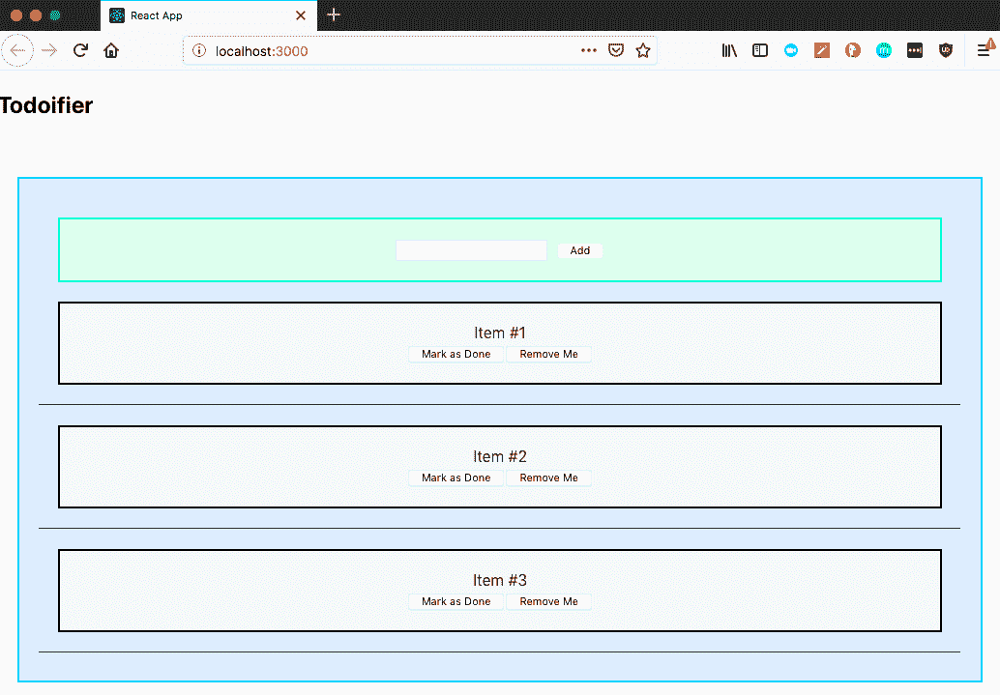
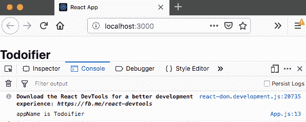
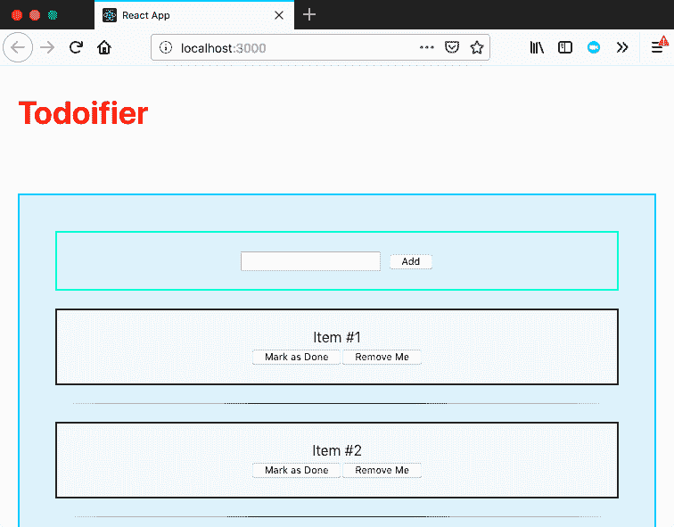
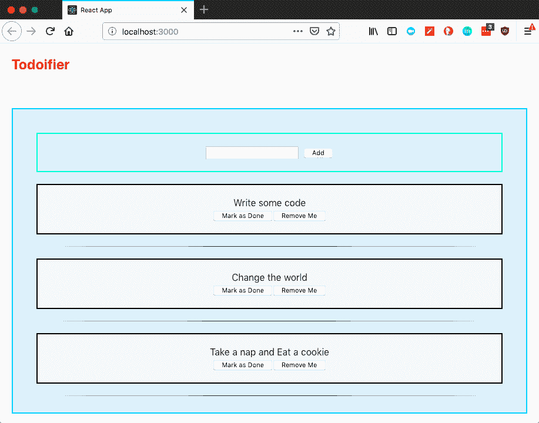
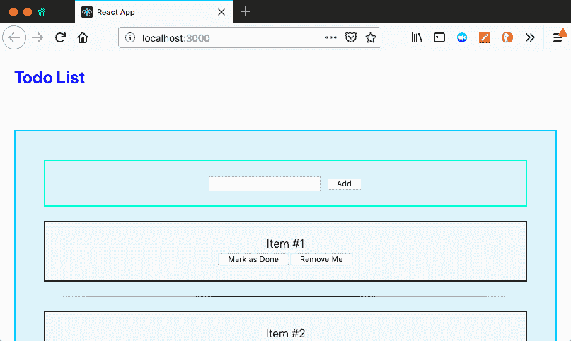
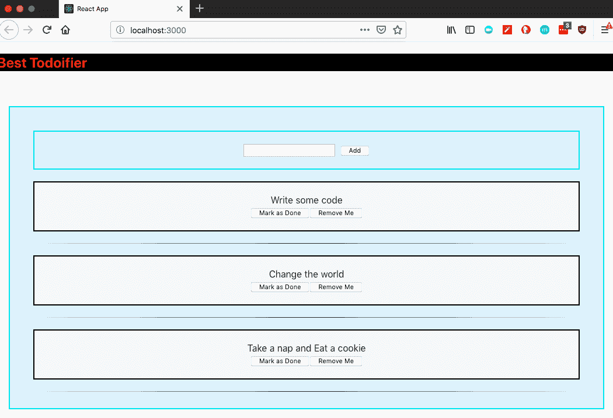

# 创建 React App 和 Babel

如果你来自一个可能已经很久没有使用 JavaScript 的背景，或者你可能对 JavaScript 和 Create React App 是使用它的途径，你可能会在本书的各个部分以及探索他人的项目时看到很多语法，并发现没有对正在发生的事情有彻底的了解，代码很难阅读。本章旨在为那些新接触 Babel 的人架起桥梁，并描述它为我们的 Create React App 项目带来了什么。

本章的另一个目标是针对已经熟悉 JavaScript 但对其引入的功能和默认在 Create React App 项目中启用的 Babel 感兴趣的人，这样你就可以在你的项目中充分利用所有的生活质量改进和更简洁的语法规则，真正为你的项目增添最后一笔。目标是教授你生产就绪的代码，以便你能够在你的 React 项目中达到最高水平的贡献。

随着我们学习本章，你可以期待掌握以下主题：

+   常量变量

+   新的箭头函数语法

+   数组和对象解构

+   数组和对象扩展操作符

+   React 片段

# Babel 和最新的 JavaScript 语法

我们一直在构建这个应用程序作为我们的基础，在这个过程中，我们引入了许多可能与你习惯编写的 JavaScript 不同的语法。例如，我们使用这种语法编写了一些函数：

```js
const foo = () => {
  doSomething();
  doSomethingElse();
}
```

这里的语法并不特别复杂，你可能能够弄清楚发生了什么，但也许你并不完全理解所有这些最终是如何变成一个函数的。你可能更习惯于按照以下类似模式编写函数：

```js
var foo = function() {
  doSomething();
  doSomethingElse();
}
```

或者可能更类似于没有变量的函数声明，如下面的函数：

```js
function foo() {
  doSomething();
  doSomethingElse();
}
```

事实上，随着 JavaScript 的发展，有新的、更高效的方法来编写各种不同的语言结构。一些提供了有用的快捷方式，或者可能为开发者提供了更好的生活质量改进。由于 Create React App 在 Node.js 上运行，我们在这里得到了一些语法改进，但一般来说，Node 以更慢的速度将新功能和语法整合到其标准库中。

在本章的进程中，我们将更深入地探讨如何在 Create React App 项目中编写、整合以及最重要的，*理解* 现代 JavaScript 代码。我们将查看当前在 Create React App 中支持哪些功能，并学习如何充分利用每一个功能！

# 什么是 Babel？

Babel 旨在弥合*JavaScript 将拥有的功能*与*Node.js 目前支持的功能*之间的差距，并将生成的代码转换为 Node.js 可以理解的形式。这意味着即使 Node 选择不支持某些功能（或者可能由于与现有系统的不兼容性而无法支持），你仍然有解决方案！

# 理解历史

要理解为什么 Babel 默认集成到 Create React App 项目中，你需要了解一点它的历史（类似于为什么了解 Create React App 被转化为工具的历史是有帮助的）。在方便的 CLI 工具出现之前，很多配置都是手动完成的，而且，通常这些项目要么是针对 vanilla Node.js 构建的，要么是直接在浏览器上构建的。你想要做的任何 JavaScript 都局限于在 Node.js 的每个版本中支持的最小功能集，或者是在你的应用程序中选择的每个浏览器上支持的功能集。

因此，你最终基本上对任何有趣或生活质量的提升都没有支持。想象一下以下表格：

| **浏览器** | **功能 A** | **功能 B** | **功能 C** | **功能 D** |
| --- | --- | --- | --- | --- |
| Internet Explorer | 否 | 是 | 否 | 否 |
| Firefox | 是 | 是 | 否 | 是 |
| Chrome | 是 | 是 | 是 | 否 |
| Safari | 否 | 是 | 是 | 是 |
| 我的代码可以支持的功能 | 否 | 是 | 否 | 否 |

以之前的表格为例，我们可以在项目中支持*功能 B*，而绝对不支持其他任何功能！知道你可能会支持你编程语言中一些非常棒的功能，但由于一些用户会有负面或完全糟糕的体验，却无法使用它们，这是最令人沮丧的事情。

也许你和你的公司决定想要减少官方支持的浏览器数量，以便可以使用这些新功能。现在你需要做出决定，牺牲你的用户群，疏远新旧用户，以便使用更新的语言功能。也许这会给其他用户带来更好的体验，最终证明这是值得的，但那些决定需要谨慎做出，并考虑有多少用户在使用什么。例如，如果你决定只支持 Safari，你将疏远每一个 Windows 用户，而不仅仅是每一个 Internet Explorer 用户。

这些决定很重大，对应用程序的健康状况有长期影响。在项目生命周期的开始就疏远用户群可能意味着它根本无法恢复！

# Babel 在这个谜题中扮演什么角色？

Babel 在这里伸出援手，说：“嘿，我们会给你那些你想要使用的语言特性，但不是所有浏览器都支持。”当你开始使用越来越大的代码库，并绕过一些你过去必须用来构建大型 JavaScript 应用程序的糟糕方式时，这会带来巨大的安慰！现在，如果你想使用导入、新语法以及其他任何东西，你都可以这样做！

Babel 作为一个**转换器**，这是一个非常华丽的说法，意思是它将你的 JavaScript 代码（可能不是所有内容都能被理解）转换成可以被理解的 JavaScript 代码！根据不同的配置、设置和所谓的**阶段**，Babel 将允许你选择使用各种新的语法和语言特性，并确保你的代码能在大多数现代浏览器上运行！当然，没有任何东西是万无一失的，你当然会发现一些特定浏览器不支持的场景。不幸的是，你不可能赢得所有比赛！

# 使用 Babel 探索现代 JavaScript

在本节中，我们将探讨 Babel 允许我们作为代码主要部分的现代 JavaScript 技巧和技术。我们将查看我们可以实现各种不同代码和模式的不同方式，探讨 JavaScript 标准方式执行某些技巧与 Babel 允许我们使用的简写语法之间的差异。首先是变量声明的添加，特别是如果你很久没有编写现代 JavaScript 的话，比如`const`和`let`。

`let`变量允许我们声明一个具有非常具体作用域规则的变量。虽然`var`的作用域是最近的函数块，并因此被使用，但`let`的作用域是最近的块，并且在其声明之前不能使用。你也不能用`let`重新声明具有相同名称的变量。

`const`变量允许我们声明一个具有与`let`相同作用域规则的常量。总的来说，最佳实践是尽可能多地使用这两个变量，而不是使用`var`。事实上，如果我知道我正在处理的代码支持`const`和`let`，我个人从来不会使用`var`。

现在，让我们继续到我们作为应用程序代码遇到的第一件更复杂的事情：JSX！

# JSX

让我们看看一个非常简单的 JSX 代码示例；与我们已经编写过的代码非常相似。我们最好从简单开始，逐步构建，这样你就可以看到 JSX 实际上是如何帮助我们更快、更智能地编写代码的。

首先，这是一个简单的 React 中的`HelloWorld div`：

```js
const HelloWorld = () => (<div>Hello World</div>);
```

正如我说的，目前还没有什么特别复杂或困难的东西。让我们来看看这个的纯 JavaScript 版本：

```js
function HelloWorld() {
  return React.createElement('div', null, 'Hello World');
}
```

最终它做的都是同样的事情：它创建了一个 `HelloWorld` React 组件，然后该组件本身包含一个带有 `HelloWorld` 主体文本的单个 `div`。当您必须开始包括子组件时，事情开始变得复杂。使用我们之前的 `HelloWorld` 组件，让我们扩展它，并使我们要问候的人可配置：

```js
const HelloWorld = props => (<div>Hello {props.name}</div>);
```

在常规 JavaScript 中的类似操作如下：

```js
function HelloWorld(props) {
  return React.createElement("div", null, `Hello ${props.name}!`);
}
```

让我们打开我们的项目，并尝试改变现有项目中的一些语法，以使用创建 React 组件和元素的非 JSX 方法。我们的目标是，我们应该达到在 `TodoList` 组件中的每个 `Todo` 项目之间添加一个小分隔符的程度。我们不需要做太多修改就能使它工作，但我们将使用非 JSX 方法来构建 `Divider` 组件。我们将从创建 `src/Divider.js` 和 `src/Divider.css` 开始，然后首先编写 `src/Divider.js`：

```js
import React from "react";
import "./Divider.css";

function Divider() {
 return React.createElement(
 "div",
 { className: "Divider" },
 React.createElement("hr")
 );
}

export default Divider;
```

在这里我们并没有做太多额外的事情；我们创建了一个具有 `Divider` 类的 `div` 容器（你从这里可以看到为什么 `class` 在 React JSX 中不可用；这没有意义，因为 `class` 是我们用来声明类（如我们的基于类的有状态组件）的）。在我们的函数中，它不接受任何额外的属性，我们返回 `React.createElement()` 函数的结果。`React.createElement()` 调用有三个参数：我们正在创建的主要元素（可以是 HTML 标签，如 `div` 或 `hr`，或者函数或变量的完全限定名称，如 `Todo`），然后是一个对象，包含传递给该元素的属性，最后是应该存在于该组件内部的子元素数组。

接下来，我们将用一些花哨的 CSS 来填充我们的 `src/Divider.css`，使我们的 `hr` 变成基于渐变的分隔线：

```js
hr {
  border: 0;
  height: 1px;
  background-image: linear-gradient(
    to right,
    rgba(0, 0, 0, 0),
    rgba(0, 0, 0, 0.8),
    rgba(0, 0, 0, 0)
  );
}
```

接下来，进入 `src/TodoList.js`，我们将 `import` 我们的新 `Divider` 并修改一些代码以包含新的分隔符。首先，我们从顶部开始 `import`：

```js
import Divider from "./Divider";
```

然后，我们将实际上将 `Divider` 放置在代码中。我们需要进入 `renderItems()` 函数，并将主体改为将 `Todo` 包裹在一个 `div` 容器中（我们可以通过使用 React Fragments 来解决这个问题，但我们会稍后再详细讨论），然后在底部包含 `Divider` 组件。此外，请注意，在下面的 JSX 代码中的每个关键属性中，我们都在 "description" 前缀加上我们正在构建的组件的简要描述，以避免冲突：

```js
  renderItems() {
    return this.state.items.map(description => (
      <div key={"div-" + description}>
        <Todo
          key={description}
          description={description}
          removeTodo={this.removeTodo}
        />
        <Divider key={"divide-" + description}/>
      </div>
    ));
  }
```

保存并重新加载，我们应该有一些新的分隔线来分隔我们的 `Todo` 项目：



然后，我们就有了，一个完全用纯 JavaScript 编写的 `Divider`！

下一个代码片段只是作为一个示例，展示一个完整的、更复杂的函数在没有 JSX 的情况下会是什么样子。你实际上不需要做任何这项工作！

为了好玩，让我们看看在 `TodoList` 中的两个 `render()` 函数调用在没有 JSX 的情况下会是什么样子：

```js
  renderItems() {
    return this.state.items.map(description =>
      React.createElement("div", { key: "div-" + description }, [
        React.createElement(Todo, {
          key: description,
          description: description,
          removeTodo: this.removeTodo
        }),
        React.createElement(Divider, { key: "divider-" + description })
      ])
    );
  }
  render() {
    return React.createElement("div", { className: "TodoList" }, [
      React.createElement(NewTodo, { addTodo: this.addTodo }),
      this.renderItems()
    ]);
  }
```

所有的功能都将保持完全相同，所以如果你想要追求这个，并且你更喜欢这种语法而不是 JSX，这仍然是你的一种选择。

# 函数语法

让我们也花一点时间来谈谈在使用 Babel 和 Create React App 配对时可以利用的不同方式来编写函数。在我们之前写的代码中，我们已经对此进行了一些讨论，并展示了几个替代函数语法的示例，但现在我们将更深入地探讨所有这些内容。

最终，在 JavaScript 中，有一些标准的方式来声明函数，没有任何花哨的东西。我们可以选择使用 `function` 关键字声明函数的方法，或者将其声明为一个变量。让我们看看一些例子：

```js
function sayHello(name) {
  console.log(`Hello ${name}!`);
}
```

我们也可以这样写，不使用 Babel 的任何花哨功能，通过以下代码：

```js
var sayHello = function(name) {
  console.log(`Hello ${name}!`);
}
```

在构建函数之后，我们调用该函数的方式只是简单地通过以下方式：

```js
sayHello('Mason');
```

现在，回想一下我们在前两章中编写的一些其他函数。我们经常使用 `const` 语句来定义函数，这会把我们之前写的 `function` 转换成以下形式：

```js
const sayHello = name => {
 console.log(`Hello ${name}!`);
};
```

虽然这实际上与旧 JavaScript 中声明函数的变量方法非常相似，但在语法上有细微的差别，这是值得指出的，那就是在代码中声明函数签名的方式。

在之前，在我们的变量声明之后，我们会写一个函数，然后是带有参数的括号。在现代 JavaScript 中，我们可以使用一种叫做 **箭头函数** 的东西。箭头函数是一种简写语法快捷方式，在 `this` 绑定方面有一个额外的优势。具体来说，函数声明时的 `this` 上下文是函数声明时的 `this` 上下文。而不是函数自己获取并定义自己的 `this` 上下文，它使用当前作用域中的 `this`。

声明箭头函数的规则相当简单：

+   如果你没有参数，你必须使用圆括号声明函数，然后是粗箭头 (`=>`)：

```js
const foo = () => { return "Hi!"; }
```

+   如果你有一个参数，你可以选择性地包含圆括号：

```js
const foo = name => { return `Hi ${name}!` };
```

+   如果你有两个或更多参数，你必须包含圆括号：

```js
const foo = (greeting, name) => { return `${greeting} ${name}!`; } 
```

+   如果你作为单行函数返回某个东西，你不需要使用花括号或 `return` 语句：

```js
const foo = (greeting, name) => `${greeting} ${name}`;
```

+   如果你作为多行函数返回某个东西，你必须使用花括号和 `return` 语句：

```js
const foo = (greeting, name) => {
    const message = greeting + " " + name + "!";
    return message;
};
```

# 解构赋值

现代 JavaScript 也给了我们更好的解构访问。解构是一种匹配数据结构（例如，在数组或对象中）的模式，并且能够将这些模式转换为函数参数或变量声明中的单个变量。让我们通过几个不同的例子来玩一玩，以更好地了解解构是如何工作的，以及我们如何更好地利用它。打开`src/App.js`，我们将多次使用解构。在我们做出更改之前，`App`函数应该看起来像以下代码：

```js
const App = () => (
  <div className="App">
    <h2>Todoifier</h2>
    <br />
    <TodoList />
  </div>
);
```

目前还没有什么激动人心的东西，所以让我们让这段代码变得有趣！我们首先允许你重命名你的应用，因为也许你并不觉得`Todoifier`是一个很好的应用名称！我们将在代码上方添加一个简单的数据结构：

```js
const details = {
  header: "Todoifier",
  headerColor: "red"
};
```

接下来，我们将这个数据结构解构到一个单独的变量名中。我们将在声明我们的`details`数据结构之后添加以下行：

```js
const { header } = details;
```

我们在这里所做的就是重新编写我们在`details`变量中创建的数据结构的结构，然后说我们想要它取`details`变量中`header`键的值，忽略其他所有内容，然后将它抛入`header`变量中。最终结果是，我们应该在`header`变量中看到`Todoifier`。为了确保这一点，让我们抛出一个`console.log`语句来验证结果：

```js
console.log("appName is " + appName);
```

如果一切顺利，我们应该在我们的浏览器 JavaScript 控制台中看到它：



就这样！现在我们知道这可以工作，让我们回到`App`组件，并添加对`header`变量的引用：

```js
const App = () => (
  <div className="App">
    <h2>{appName}</h2>
    <br />
    <TodoList />
  </div>
);
```

当我们的页面刷新时，我们应该看到你在`details`变量中的`header`值所抛出的任何值！让我们让它更简洁一些，更接近你通常在生产代码中期望看到的样子，因为现在我们写的代码有点冗余。删除对`appName`的引用和`console.log`语句，我们将编写一个新的函数用于我们的组件：

```js
const headerDisplay = ({ header: title, headerColor: color }) => (
  <h2 style={{ color: color }}>{title}</h2>
);
```

我们实际上在这里使用了一些单独的技巧！我们使用了新的函数声明语法和简单的函数`return`语法，我们还使用了解构来使我们的代码超级简单和整洁！我们解构传入的参数以提取`title`和`headerColor`，并将它们分别存储在`title`和`color`变量中！

我们然后将这些传递给`h2`标签，以设置 CSS 的`color`样式和应用的显示`title`！最后一步是我们需要将这个组件连接到使用我们刚刚定义的新`header`函数：

```js
const App = () => (
  <div className="App">
    {headerDisplay(details)}
    <br />
    <TodoList />
  </div>
);
```

就这样！有了这段代码，我们应该看到一个红色的标题，上面写着 Todoifier！让我们看看：



实际上，我们也可以解构数组！例如，假设我们有一些独特的选项想要作为列表的起始项。我们可以通过数组解构捕获这些选项，我们还可以利用我们稍后将要学习的其他一些语法技巧，比如数组展开！让我们看看`src/TodoList.js`，并更改我们的构造函数以使用数组解构：

```js
const [item1, item2, ...rest] = [
  "Write some code",
  "Change the world",
  "Take a nap",
  "Eat a cookie"
];
this.state = {
  items: [item1, item2, rest.join(" and ")]
};
```

数组解构仅基于位置；这里唯一的技巧是在匹配`item1`和`item2`之后，我们将把数组的其余部分扔到一个叫做`rest`的变量中，我们将用一些空格和单词`"and"`将其连接起来。让我们看看结果：



# 可选参数

为函数设置可选参数是一个相对简单的任务！如果你想使一个`function`参数可选，你只需要在参数名称后添加一个等号，并给它一个默认值。例如，让我们回顾一下本章稍早前我们编写的`sayHello`函数：

```js
const sayHello = name => {
  console.log(`Hello ${name}!`);
};
```

现在，让我们修改一下，如果有人没有指定`name`，函数调用将不会失败或抛出错误：

```js
const sayHello = (name = "Unknown") => {
  console.log(`Hello ${name}!`);
};
```

注意，由于我们正在使用可选变量作为参数列表，我们需要再次将其括在括号中！现在，如果有人调用该函数而不指定任何参数，我们预计在控制台看到的是 Hello Unknown!，类似于以下内容：

```js
sayHello();
```

既然如此，让我们将其写入我们之前的`headerDisplay`函数中。这确实会有些杂乱，但了解如何有效地使用它是非常好的，因为这是一种在项目中实现防御性编程的绝佳方式：

```js
const headerDisplay = ({
  header: title = "Todo List",
  headerColor: color = "blue"
}) => <h2 style={{ color: color }}>{title}</h2>;
```

现在，如果我们回到并更改我们的`App`组件对`header()`函数的调用，只传递一个空对象，我们预计标题将改为显示`TodoList`，带有蓝色的标题：

```js
const App = () => (
  <div className="App">
    {headerDisplay({})}
    <br />
    <TodoList />
  </div>
);
```

在我们将更改回`header`函数并改回传递`details`变量之前，让我们看看结果：



# 展开运算符

记得在章节开头一点，当我们写了一个省略号然后一个变量名的时候吗？每次你这样做，你都是在告诉 JavaScript 将未匹配的其余部分放入这里，并将其与当前的数据结构连接起来：

```js
    const [item1, item2, ...rest] = [
      "Write some code",
      "Change the world",
      "Take a nap",
      "Eat a cookie"
    ];
```

这行代码告诉 JavaScript，第一个位置的项目进入`item1`变量，第二个位置的项目进入`item2`变量，然后所有其他的项目都进入`rest`变量。当我们想要以非破坏性的方式向数组中添加项目时，我们也可以利用这一点。还记得位于`src/TodoList.js`中的`addTodo()`函数吗？让我们更详细地看看，看看我们如何在其他地方使用数组展开：

```js
  addTodo(item) {
    this.setState({ items: [...this.state.items, item] });
  }
```

这行代码告诉 JavaScript 将组件的 `state` 中的 `items` 键设置为当前 `this.state.items` 的值，然后将 `item` 添加到该列表的末尾。代码与以下内容相同：

```js
this.setState({ items: this.state.items.concat(item) });
```

你也可以使用 Babel 在 Create React App 中的最新更新在 JavaScript 代码中这样做，这对于 `state` 修改来说非常好，因为 `state` 修改只是改变对象！让我们回到 `src/App.js` 并编写一段示例代码，这段代码也会为我们的 `header` 设置背景颜色。我们将从对象展开开始，并设置一个新的变量 `moreDetails`：

```js
const moreDetails = {
  ...details,
  header: "Best Todoifier",
  background: "black"
};
```

我们只是获取 `details` 数据结构，然后在上面添加新的键或替换现有键的值。接下来，我们需要修改 `headerDisplay` 函数，使其能够处理传入的背景颜色：

```js
const headerDisplay = ({
  header: title = "Todo List",
  headerColor: color = "blue",
  background: background = "none"
}) => <h2 style={{ color: color, background: background }}>{title}</h2>;
```

这个过程的最后一步是将 `App` 组件中的调用改为传递 `moreDetails` 到 `header` 而不是 `details` 或一个空对象：

```js
const App = () => (
  <div className="App">
    {headerDisplay(moreDetails)}
    <br />
    <TodoList />
  </div>
);
```

保存并重新加载后，你应该会看到以下内容：



`Object` 展开的代码行相当于我们编写以下内容：

```js
const moreDetails = Object.assign({}, details, {
  header: "Best Todoifier",
  background: "black"
});
```

这只是稍微简洁一些，更容易阅读，所以非常感谢 Create React App 团队和 Babel 团队在最新版本中支持这一点！

# React Fragments

本章我们将讨论的最后一件事是 React Fragments 的新支持！React Fragments 是一个全新的但重要的特性。之前，如果你想在同一级别包含多个组件，你 *总是* 必须有一个根组件，即使对于像多行表这样的东西，这实际上也没有太多意义；你必须在 `<div>` 内部嵌套 `<td>` 标签，这看起来很奇怪。

结果是你不得不在技术上无效的 HTML 和符合 React 代码之间做出选择，这往往只是为了绕过限制而编写尴尬或糟糕的代码。现在，相反，我们可以编写包含特殊 Fragment 标签（`<Fragment>` 和 `</Fragment>》）的代码，分别表示片段的开始和结束。我们可以将这些引用为 `<React.Fragment>`、`<Fragment>`（如果我们选择在 `import Component` 的地方 `import Fragment`，例如在以下代码行中），或者作为 `<>` 的快捷方式：

```js
import React, { Fragment, Component } from "react";
```

关于使用 `<>` 和 `</>` 简写语法的快速警告：如果你在构建片段列表的代码中使用片段，你不能使用简写语法并指定 `key` 属性；你将不得不使用 `React.Fragment` 或 `Fragment`。

如果我们回到 `src/TodoList.js`，在我们的 `renderItems()` 函数中，我们可以看到将多余的 `<div>` 替换为 `Fragment` 的完美位置：

```js
 renderItems() {
 return this.state.items.map(description => (
 <Fragment key={"item-" + description}>
  <Todo
   key={description}
   description={description}
   removeTodo={this.removeTodo}
  />
 <Divider key={"divide-" + description} />
  </Fragment>
 ));
 }
```

在函数顶部，我们通过`import Component`作为从`React`的命名`import`导入组件，我们还需要包含`Fragment`，类似于本节稍高一点的代码行。

最终结果在其他方面是相同的；主要区别在于，我们不再无理由地将每个 Todos 和 Dividers 放在额外的`div`中，它们都可以并排坐在 DOM 树中，让你的代码更加整洁，尤其是在处理 HTML 表格时，引入额外的`div`实际上只会破坏你的代码！

# 快速回顾

在结束本章之前，让我们看看我们所编写代码的最终状态。我们的`src/TodoList.js`已经扩展，并包含了很多新技巧：

```js
import React, { Fragment, Component } from "react";
import Todo from "./Todo";
import "./TodoList.css";

import NewTodo from "./NewTodo";
import Divider from "./Divider";

class TodoList extends Component {
  constructor(props) {
    super(props);
    const [item1, item2, ...rest] = [
      "Write some code",
      "Change the world",
      "Take a nap",
      "Eat a cookie"
    ];
    this.state = {
      items: [item1, item2, rest.join(" and ")]
    };

    this.addTodo = this.addTodo.bind(this);
    this.removeTodo = this.removeTodo.bind(this);
  }
  addTodo(item) {
    this.setState({ items: [...this.state.items, item] });
  }
  removeTodo(removeItem) {
    const filteredItems = this.state.items.filter(description => {
      return description !== removeItem;
    });
    this.setState({ items: filteredItems });
  }
  renderItems() {
    return this.state.items.map(description => (
      <Fragment key={"item-" + description}>
        <Todo
          key={description}
          description={description}
          removeTodo={this.removeTodo}
        />
        <Divider key={"divide-" + description} />
      </Fragment>
    ));
  }
  render() {
    return (
      <div className="TodoList">
        <NewTodo addTodo={this.addTodo} />
        {this.renderItems()}
      </div>
    );
  }
}

export default TodoList;
```

我们的`src/App.js`组件也显著扩展了：

```js
import React from "react";
import "./App.css";

import TodoList from "./TodoList";

const details = {
 header: "Todoifier",
 headerColor: "red"
};

const moreDetails = {
 ...details,
 header: "Best Todoifier",
 background: "black"
};

const App = () => (
 <div className="App">
 {header(moreDetails)}
 <br />
 <TodoList />
 </div>
);

const header = ({
 header: title = "Todo List",
 headerColor: color = "blue",
 background: background = "none"
}) => <h2 style={{ color: color, background: background }}>{title}</h2>;

export default App;
```

# 摘要

我们覆盖了很多内容，但非常高效！我们讨论了很多如何在 Create React App 2 项目中充分利用 Babel 提供的更好、更干净的语法！

即使这样，这也只是触及了现代 JavaScript 所能做到的一小部分，但它涵盖了你在整本书中都会看到的许多常见模式和技巧。我们希望这本指南能给你提供一切所需，以便能够执行项目，并在最高水平上理解和贡献！

我们将在未来的章节中探索很多这些代码技巧，所以请确保在你继续前进之前，你已经牢固掌握了本章中我们讨论的所有内容！
