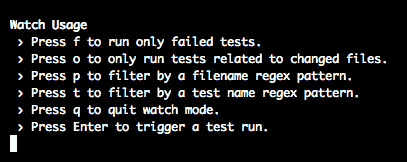
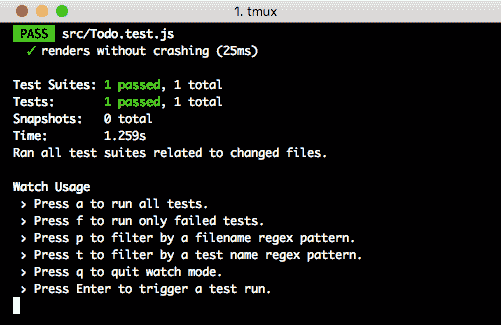
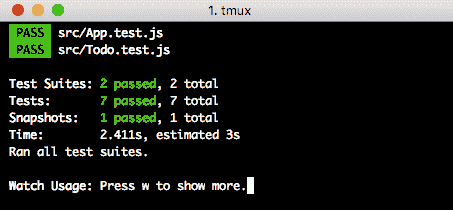
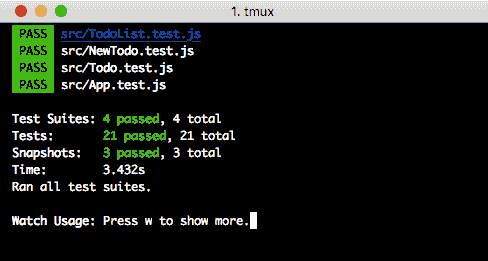

# 使用测试和 Jest 保持你的应用程序健康

任何应用程序开发者的生活中一个重要的部分是确保他们的应用程序第一次运行就正确无误，每次都如此。随着应用程序变得更加复杂，这可能是一个困难的事情去做；之前可能只需要几分钟和一行代码来清理或修复的问题，现在可能需要数小时、数天，甚至数周（或更长）来尝试修复！此外，如果你试图构建你的应用程序并使其工作干净、有效。

在本章中，我们将涵盖以下主题：

+   测试 React 应用程序的历史

+   运行 React 测试的不同方式

+   Jest 的简要介绍

+   测试监视器的简要介绍

+   如何编写测试

# 测试的“为什么”和“何时”

你可能想知道为什么我们在应用程序开发的这么晚才开始处理测试。一般来说，当你刚开始你的项目时，你可能会等待一段时间，看看你的应用程序如何发展，然后再开始用测试来验证其行为。但话虽如此，我们现在也已经到了一个很好的时机，开始巩固我们的项目，使其成为我们可以自信地部署到生产环境中的东西！

# 测试 React 的历史

再次强调，了解工具集的历史对于理解为什么使用某些功能或库是非常有帮助的。当人们刚开始使用 React 时，关于测试的想法和标准四处散落。有些人使用各种各样名字的库的组合，比如 night-something、mocha 或其他随机的框架。你必须弄清楚模拟库、测试框架和用户界面测试框架。

这绝对是 *令人筋疲力尽*的，不可避免的是，你使用的任何框架和设置都会失去青睐或过时，你不得不每隔几周就重新开始学习一个新的框架！更糟糕的是，如果你问了很多不同的人他们的特定测试设置，你会得到至少那么多不同的答案！

# 关于 Jest

Jest 是 React 团队针对“我们应该为我们的 React 应用程序使用什么测试框架？”这一持续问题的回答。你得到的答案总是因人而异，有时你不得不使用多个框架才能获得你想要的功能，这导致了大量的冗余和开发者对于在任何给定时间应该使用哪个框架的困惑！

# 分析 Jest 测试的结构

我们开始的最佳地点是查看任何新的 Create React App 项目中附带的标准测试，那就是对我们 `App` 组件的测试，位于 `src/App.test.js`：

```js
import React from 'react';
import ReactDOM from 'react-dom';
import App from './App';

it('renders without crashing', () => {
  const div = document.createElement('div');
  ReactDOM.render(<App />, div);
  ReactDOM.unmountComponentAtNode(div);
});
```

嗯，从任何想象的角度来看，这不是一个特别**令人兴奋**的测试。正如其名所示，这个测试只是验证了`App`组件可以在页面上渲染，没有任何大的故障或错误。这个测试可能看起来有点多余，但它实际上扮演了一个极其重要的角色：它作为你应用程序的理智检查！

想想看：如果你的主要应用程序或组件在没有其他更复杂的检查的情况下无法渲染，那么你的项目可能非常、非常糟糕！这有助于我们检查我们是否意外地排除了某些内容，或者以保持我们所有人理智的方式对我们的项目引入了重大的破坏性更改！让我们也验证一下，即使现在我们有了一些更改，这也确实按照我们预期的样子工作：

```js
$ yarn test
```

当我们运行这个时，我们应该在我们的控制台窗口中看到一些输出，它会告诉我们更多关于运行了哪些测试，哪些测试通过，哪些失败，以及关于我们的测试运行的其他元数据：


就这样，干净且可工作的测试！现在，这本身真的很酷，但让我们花几分钟来分析之前的输出窗口！

# 探索测试输出

目前，如果我们没有上下文，只看之前的输出可能不太有意义！让我们从查看测试之后的第一个行开始，它讨论了我们的测试套件：

```js
Test Suites: 1 passed, 1 total
```

Jest 允许我们以多种不同且有用的方式运行和组织我们的测试！例如，我们的测试可以通过套件运行；套件是测试的更大分组。稍后当我们有不止一个测试时，我们会进一步探讨这一输出行，但现在我们只有一个测试套件，所以我们只运行了一个测试套件：

```js
Tests: 1 passed, 1 total
```

我们运行了一个测试，并且这个测试通过了！这使我们能够跟踪随着应用程序代码的变化，运行了哪些测试；当我们进行小改动时，我们可能不需要在每个套件中运行每个测试！相反，我们可以专注于受更改影响的测试，因此你可能看到这少于套件中的总测试数：

```js
Snapshots: 0 total
```

在 Jest 中，快照是一个完全不同的特性。快照是一种告诉 Jest 的方式：**给定输入 X，渲染的组件应该看起来完全像这样**。我们稍后会更详细地探讨这一点！以下行指示了我们的测试运行所需的时间：

```js
Time: 3.986s
```

这点很重要，因为有时你可能会向你的应用程序中引入一些代码，使得应用程序变得极其缓慢！这可以帮助你捕捉到应用程序中那些偷偷破坏性能的代码片段。你的测试将基本上是你对性能不佳算法的早期预警系统！我们将得到以下输出：

```js
Ran all test suites.
Watch Usage: Press w to show more.
```

最后，我们得到了一些输出，告诉我们一些关于运行了哪些测试以及我们可以做些什么的信息。我们也可以在这里按下 *w* 键，以获取更多关于我们可以使用测试运行器和监视器的选项：



# 使用 F 键的开发测试工作流程

当我们按下 *w* 键时，我们会得到一个新列表的命令，我们可以运行这些命令来继续我们的测试套件并对其进行更多操作。我们已经探索了这些选项的一些内容，但值得重申的是，我们在开发期间可以（和应该）做的工作，以及谈谈何时使用这些测试！

第一个主要的问题是以下内容：

```js
Press f to run only failed tests
```

我们会大量使用这个测试。通常在开发复杂的应用程序时，您可能会引入破坏测试套件的变化，或者您可能会采用更多的测试驱动开发方法，在这种情况下，您将使用破坏的测试，然后在应用程序或测试中进行修复，直到测试再次通过！如果这种情况发生，您将大量使用这个命令，所以最好早点熟悉它！如果我们现在在没有失败的测试的情况下尝试运行它，我们会得到以下输出：

```js
No failed test found.
Press `f` to quit "only failed tests" mode.

Watch Usage: Press w to show more.
```

这是有道理的。我们没有失败的测试，所以当然找不到任何测试，因此不会运行任何测试。不过，我们可以通过故意引入一个失败的测试，然后运行我们的完整测试套件，接着只运行失败的测试来使这为我们所用！我们可以通过回到 `src/App.js` 并取消注释代码底部的 `export` 语句来快速模拟这个过程：

```js
// export default App;
```

现在如果您重新启动测试，您将得到一个失败的测试！我们应该能够按下 *F* 键，然后它会重新运行单个失败的测试（我们也可以反复执行这个过程）。现在如果我们取消注释那一行并保存文件，如果我们重新运行测试套件（无论是自动还是手动使用 *F* 键），我们应该能够回到一个完全工作的测试套件！

有另一个原因需要您熟悉重新运行失败的测试：您应该熟悉编写故意失败的测试，直到您使测试通过，或者通过注释或故意破坏代码来使测试通过！如果您做出的代码更改应该破坏您的测试，但测试仍然通过，这意味着您的测试实际上并没有正确地测试您应用程序的行为！

# 是时候添加一些新的测试了！

我们对我们的初始测试有相当好的理解，但通过编写新的测试，我们可以学到更多！我们将从测试我们迄今为止编写的最简单的组件开始：我们的 `Todo` 组件！您会注意到我们如何命名测试以便 Jest 正确地捕获它们：我们将为 `Todo` 组件（在 `src/Todo.js` 中）创建一个测试，命名为 `src/Todo.test.js`！我们几乎总是希望从模仿 `App.test.js` 中的结构开始我们的测试，所以我们将开始做几乎相同的事情：

```js
import React from "react";
import ReactDOM from "react-dom";
import Todo from "./Todo";

it("renders without crashing", () => {
 const div = document.createElement("div");
 ReactDOM.render(<Todo />, div);
 ReactDOM.unmountComponentAtNode(div);
});
```

在重新运行我们的测试套件之后（你可能需要使用*Q*退出测试监视器并重新运行`yarn test`），你应该会得到以下输出：



因此，它运行了我们刚刚添加的`src/Todo.test.js`测试，而且它还是一个全新的测试套件！让我们扩展我们的测试，因为到目前为止，它们实际上并没有做什么。然而，为了做到这一点，我们需要向我们的测试套件中添加几个更多的库！我们希望添加`enzyme`（用于浅渲染）；`enzyme`是 React v16.x 的适配器，以及 React 的测试`renderer`到我们的应用程序。我们可以通过一个快速的`yarn`命令来实现：

```js
$ yarn add --dev react-test-renderer enzyme enzyme enzyme-adapter-react-16
```

`enzyme`为我们的测试套件增添了大量的功能，使得与之工作变得更加容易，所以将`enzyme`作为测试套件的基础确实是值得的！实际上，它如此有用，以至于它被包含在一些默认的 React/Jest 测试文档中！现在，仅仅包括这些还不足以完成我们所需的一切，所以我们也需要创建一个测试设置文件来初始化 Enzyme。创建`src/setupTests.js`并给它以下内容：

```js
// setup file
import { configure } from 'enzyme';
import Adapter from 'enzyme-adapter-react-16';

configure({ adapter: new Adapter() });
```

在完成这些之后，我们可以开始处理一些真正的测试代码！我们需要打开`src/Todo.test.js`，在那里我们可以在顶部添加一些代码，这将使我们能够利用`enzyme`的浅渲染`renderer`！我们还需要`renderer()`函数的`react-test-renderer`，因为我们将使用它来创建快照：

```js
import React from "react";
import ReactDOM from "react-dom";
import { shallow } from "enzyme";
import renderer from "react-test-renderer";

import Todo from "./Todo";
```

现在我们已经拥有了开始编写测试所需的一切。在我们开始编写测试之前，我通常首先将所有的测试都抛入一个大的`describe`函数中，所以让我们从移动我们已经在`describe`块内部编写的测试开始：

```js
describe(Todo, () => {
  it("renders without crashing", () => {
    const div = document.createElement("div");
    ReactDOM.render(<Todo />, div);
    ReactDOM.unmountComponentAtNode(div);
  });
});
```

重新运行测试，我们应该回到绿色，两个套件和两个测试：


`describe`是一种将相关测试组合在一起的方式，无论是通过功能、概念还是其他方式。你有几种方法来声明一个`describe`块。你可以使用一个字符串来指定测试的名称，或者你可以使用一个有效的`Class`或`Component`名称。

现在，如果我们想使我们的测试变得更加复杂，我们还需要做一些基本的设置工作，因为如果你记得我们的`Todo`组件，我们有一些函数需要传递到我们的子组件中。让我们看看`Todo`的默认`props`：

```js
    this.state = {
      done: false
    };
```

以及`removeTodo`属性的函数体：

```js
  removeTodo() {
    this.props.removeTodo(this.props.description);
  }
```

描述很简单；那只是一个我们需要传递的字符串。另一方面，`removeTodo(...)`要复杂得多。它是一个不作为此组件一部分存在的函数；相反，它存在于父组件中，并被传递进来！那么，我们如何处理这种情况呢？

简单来说，我们可以用 Jest 来 *模拟* 一个函数！模拟一个函数基本上创建了一个跟踪其何时被调用的假函数。我们还需要对组件进行 **浅渲染** 以验证它在 DOM 中的整体外观。我们稍后会详细讨论这个问题，但现在请将以下内容添加到 describe 块的顶部：

```js
  const description = "New Todo";
  const mockRemoveTodo = jest.fn();
  const component = shallow(
    <Todo description={description} removeTodo={mockRemoveTodo} />
  );
```

如前例所示，`jest.fn()` 允许我们创建一个模拟函数。正如之前提到的，模拟一个函数并没有做任何特别的事情。它假装是一个函数，看到谁试图使用该函数，并跟踪一些事情，比如伪造的参数或为函数设置伪造的返回值。如果我们想验证我们的 `props` 中的 `removeTodo` 确实做了些什么，但我们不关心它执行的具体行为，这会很有用。

# 编写一个通用的快照测试

谈论编写测试是一回事，但让我们实际开始实现我们的测试。我通常以以下方式处理测试编写：

+   编写一个通用的快照测试

+   编写一些子组件特定的测试

+   检查内容

+   检查交互

快照测试可以用来验证初始状态渲染以及满足特定条件后的渲染。这是通过获取组件的表示形式，存储它，然后用于未来的测试来实现的。当你的组件不断变化时，这可能会很棘手，但当你的组件稳定且不应经常修改时，这会非常方便。让我们编写我们的 `snapshot` 测试：

```js
  it("renders and matches our snapshot", () => {
    const component = renderer.create(<Todo description="Yo" />);
    const tree = component.toJSON();
    expect(tree).toMatchSnapshot();
  });
```

记得我们之前从 `react-test-renderer` 中 `import` 的 `renderer` 吗？这就是我们使用它的地方！我们通过 JSX 创建一个 `Todo` 组件，并将其传递给 `renderer.create()` 函数。然后我们获取组件结构，将其转换为 JSON，并验证它是否与之前运行中适当的快照匹配。这是另一个早期预警系统，有助于捕捉到有人更改了组件但未对测试进行任何更新的情况！让我们来看看我们的测试套件中的结果：


# 为内容编写测试

我们还需要确保当传递的属性会修改用户看到的内容时，这些属性实际上已经进入了完全渲染的函数！我们已经在 describe 块的顶部设置了 `description` 变量。在我们跳得太远之前，我们需要为我们的浅渲染编写一个快速测试，以确保它也正常工作！

# 什么是浅渲染？

浅渲染基本上就是组件的一个假渲染，其中只渲染根级组件，不渲染其他内容。这是任何组件在测试中可以使用的最简版本，因此我们应该在跳入其他任何内容之前始终使用它！让我们首先编写我们的浅渲染测试：

```js
  it("renders a Todo component", () => {
    expect(component.contains(<div className="Todo" />));
  });
```

这是一个简单的测试。它只是确保我们渲染出一个带有`Todo` CSS 类的`div`，这是当我们使用 JSX 实例化我们的`Todo`组件时渲染的根`div`。否则，这里没有太大的惊喜！在此之后，我们需要编写一些测试来确保这些传入的`props`确实进入了`组件`：

```js
  it("contains the description", () => {
    expect(component.text()).toContain(description);
  });
```

我们已经创建了`组件`的浅渲染版本，所以我们正在获取这个组件，分析如果它是一个真实渲染，将会添加到 DOM 中的渲染`文本`，然后确保我们放入描述中的任何内容都包含在内！

# 测试交互

最后一步是测试组件中的实际交互！我们需要能够定位我们的每个按钮。如果你回想起我们的`Todo`组件的`render()`函数，有两个按钮被创建：

```js
  render() {
    return (
      <div className={this.cssClasses()}>
        {this.state.description}
        <br />
        <button onClick={this.markAsDone}>Mark as Done</button>
        <button onClick={this.removeTodo}>Remove Me</button>
      </div>
    );
  }
```

没有任何修改，实际上对我们来说很难具体地定位任何一个实际按钮。我们希望有一种方法可以单独地定位每个`按钮`，所以让我们进入`Todo`组件，并为每个按钮添加一个唯一的`className`！在`src/Todo.js`的渲染函数中，将`MarkDone className`添加到第一个`button`，将`RemoveTodo className`添加到第二个`button`，就像以下代码所示：

```js
  render() {
    return (
      <div className={this.cssClasses()}>
        {this.props.description}
        <br />
        <button className="MarkDone" onClick={this.markAsDone}>
          Mark as Done
        </button>
        <button className="RemoveTodo" onClick={this.removeTodo}>
          Remove Me
        </button>
      </div>
    );
  }
```

保存这段代码，测试将重新运行并且失败？但是为什么？我们还没有修改测试！参考以下截图：


这实际上正是它应该做的！我们对组件进行了一些修改，改变了组件的渲染方式。在我们的例子中，我们对这些修改完全满意，所以我们将使用另一个测试监视器命令来更新`快照`！按*u*键，我们的`快照`将更新，并且测试将重新通过！最后，我们可以回到完成我们的交互测试！

# 完成我们的交互测试

现在我们已经可以隔离每个按钮，我们可以测试当每个按钮被点击时会发生什么！我们需要首先验证我们的`MarkDone button`是否将`Todo`标记为完成，这也可以通过检查`状态`来完成！让我们看看测试，然后我们再讨论它做了什么：

```js
  it("marks the Todo as done", () => {
    component.find("button.MarkDone").simulate("click");
    expect(component.state("done")).toEqual(true);
  });
```

思考这些测试的最简单方法就是大声说出来。如果我们像人类一样测试这个行为，我们会说，找到标记`Todo`为完成的按钮，点击那个按钮，然后我们应该期望`Todo`完成！我们的代码正是这样做的！它通过 CSS 选择器找到了组件，该选择器抓取了附有`MarkDone` CSS 类的按钮（记得我们之前更改的`render()`函数）。然后我们模拟了一个发送到该`button`的`"click"`事件，该事件针对`onClick`处理程序。最后，我们必须使用`state()`函数从组件的状态中获取一个值，对我们来说就是`state`中的`"done"`属性！如果现在是`true`，那么我们就成功了，我们的测试就通过了！

# 返回到我们的模拟函数

我们谈了很多关于函数模拟的内容，但后来又关注了一堆其他的测试；现在是我们重新审视我们的模拟函数并实际测试它的时候了！基本上，我们只需要使用一个辅助函数来验证我们的模拟是否被调用：

```js
  it("calls the mock remove function", () => {
    component.find("button.RemoveTodo").simulate("click");
    expect(mockRemoveTodo).toHaveBeenCalled();
  });
```

我们之前在 describe 块顶部放回的`mockRemoveTodo`函数：

```js
const mockRemoveTodo = jest.fn();
```

我们在之前的测试中已经看到了`simulate`的调用，所以我们只需要创建一个期望，即我们的模拟函数已被调用，这就足够了！有了这个，我们就有了针对`Todo`组件的非常全面的测试套件，从这里开始，我们所做的一切都是相同测试的略微复杂的变化！总共七个测试，两个测试套件，以及一个快照测试——一切运行得都很完美！参考以下截图：



在我们继续之前，让我们验证`src/Todo.test.js`的完整测试套件：

```js
import React from "react";
import ReactDOM from "react-dom";
import { shallow } from "enzyme";
import renderer from "react-test-renderer";

import Todo from "./Todo";

describe(Todo, () => {
  const description = "New Todo";
  const mockRemoveTodo = jest.fn();
  const component = shallow(
    <Todo description={description} removeTodo={mockRemoveTodo} />
  );

  it("renders without crashing", () => {
    const div = document.createElement("div");
    ReactDOM.render(<Todo />, div);
    ReactDOM.unmountComponentAtNode(div);
  });

  it("renders and matches our snapshot", () => {
    const component = renderer.create(<Todo description="Yo" />);
    const tree = component.toJSON();
    expect(tree).toMatchSnapshot();
  });

  it("renders a Todo component", () => {
    expect(component.contains(<div className="Todo" />));
  });

  it("contains the description", () => {
    expect(component.text()).toContain(description);
  });

  it("marks the Todo as done", () => {
    component.find("button.MarkDone").simulate("click");
    expect(component.state("done")).toEqual(true);
  });

  it("calls the mock remove function", () => {
    component.find("button.RemoveTodo").simulate("click");
    expect(mockRemoveTodo).toHaveBeenCalled();
  });
});
```

现在我们也给`TodoList`添加一些测试吧！

# 为 TodoList 添加测试

我们将首先添加一个框架来放置我们其余的`TodoList`测试！我们需要标准的导入和渲染、快照和浅渲染组件的测试。我们将从以下`src/TodoList.test.js`的脚手架开始：

```js
import React from "react";
import ReactDOM from "react-dom";
import { shallow } from "enzyme";
import renderer from "react-test-renderer";

import TodoList from "./TodoList";
import NewTodo from "./NewTodo";
import Todo from "./Todo";

describe(TodoList, () => {
  const component = shallow(<TodoList />);

  it("renders without crashing", () => {
    const div = document.createElement("div");
    ReactDOM.render(<TodoList />, div);
    ReactDOM.unmountComponentAtNode(div);
  });

  it("renders and matches our snapshot", () => {
    const component = renderer.create(<TodoList />);
    const tree = component.toJSON();
    expect(tree).toMatchSnapshot();
  });

  it("renders a TodoList component", () => {
    expect(component.contains(<div className="TodoList" />));
  });
});
```

我们之前已经覆盖了这些测试，所以没有太多需要深入的内容，但我们想确保，由于我们的`render()`调用包括一个`NewTodo`组件，并且我们在文件顶部导入了该`component`，我们有一个测试来验证树中只有一个`NewTodo`：

```js
  it("includes a NewTodo component", () => {
    expect(component.find(NewTodo)).toHaveLength(1);
  });
```

我们还需要验证`TodoList`中有多少`Todo`组件，但这个测试有一个更复杂的问题需要解决。如果你记得，`TodoList`中状态的`"items"`属性决定了哪些`Todo`应该出现，所以我们将检查状态与组件的`find`函数是否同步：

```js
  it("renders the correct number of Todo components", () => {
    const todoCount = component.state("items").length;
    expect(component.find(Todo)).toHaveLength(todoCount);
  });
```

我们的`component`已经通过`shallow()`调用被渲染出来，所以我们将使用`state()`调用来验证项目的长度，并找到相同数量的`Todo`组件。我们还需要测试`TodoList`的`addTodo`函数：

```js
  it("adds another Todo when the addTodo function is called", () => {
    const before = component.find(Todo).length;
    component.instance().addTodo("A new item");
    const after = component.find(Todo).length;
    expect(after).toBeGreaterThan(before);
  });
```

这里有一些新的功能可能稍微复杂一些，所以让我们简单谈谈！我们首先找出已经存在的 Todos 数量，因为在我们添加另一个项目后，我们应该期望这是我们从前的数量加上一个！之后，我们将在组件上调用`addTodo()`，但为了做到这一点，我们需要跳入`component`的实际生活上下文。我们可以通过`instance()`调用来实现，这允许我们调用`component`上的任何函数，而无需模拟任何按钮点击！在调用`addTodo`之后，我们抓取所有存在的 Todos 列表并期望它比我们最初开始时更多！这是一种非常重要且非常好的编写测试的方法；我们从不硬编码 Todos 的数量或其他任何东西；相反，我们在事件发生后检查相对值！这消除了某些奇怪的场景，即有人更改了组件的默认或初始状态，并直接导致我们的测试失败！

最后，我们需要实现一个`removeTodo`测试，这正好是我们之前写的测试的反向操作：

```js
  it("removes a Todo from the list when the remove todo function is called", () => {
    const before = component.find(Todo).length;
    const removeMe = component.state("items")[0];
    component.instance().removeTodo(removeMe);
    const after = component.find(Todo).length;
    expect(after).toBeLessThan(before);
  });
```

唯一值得注意的区别是`removeTodo`函数需要实际的项目来移除，因此我们必须从列表中抓取一个项目，并通过将此值传递给`removeTodo`函数来具体移除它！

一切都结束后，我们应该有一个完整的`TodoList.test.js`测试套件，如下所示：

```js
import React from "react";
import ReactDOM from "react-dom";
import { shallow } from "enzyme";
import renderer from "react-test-renderer";

import TodoList from "./TodoList";
import NewTodo from "./NewTodo";
import Todo from "./Todo";

describe(TodoList, () => {
  const component = shallow(<TodoList />);

  it("renders without crashing", () => {
    const div = document.createElement("div");
    ReactDOM.render(<TodoList />, div);
    ReactDOM.unmountComponentAtNode(div);
  });

  it("renders and matches our snapshot", () => {
    const component = renderer.create(<TodoList />);
    const tree = component.toJSON();
    expect(tree).toMatchSnapshot();
  });

  it("renders a TodoList component", () => {
    expect(component.contains(<div className="TodoList" />));
  });

  it("includes a NewTodo component", () => {
    expect(component.find(NewTodo)).toHaveLength(1);
  });

  it("renders the correct number of Todo components", () => {
    const todoCount = component.state("items").length;
    expect(component.find(Todo)).toHaveLength(todoCount);
  });

  it("adds another Todo when the addTodo function is called", () => {
    const before = component.find(Todo).length;
    component.instance().addTodo("A new item");
    const after = component.find(Todo).length;
    expect(after).toBeGreaterThan(before);
  });

  it("removes a Todo from the list when the remove todo function is called", () => {
    const before = component.find(Todo).length;
    const removeMe = component.state("items")[0];
    component.instance().removeTodo(removeMe);
    const after = component.find(Todo).length;
    expect(after).toBeLessThan(before);
  });
});
```

# 添加对新 Todo 的测试

最后，我们可以添加我们的最终测试套件并确保`NewTodo`也被覆盖。大部分时间，我们将使用我们之前已经使用过的相同的框架。创建`src/NewTodo.test.js`并给它以下框架：

```js
import React from "react";
import ReactDOM from "react-dom";
import { shallow } from "enzyme";
import renderer from "react-test-renderer";

import NewTodo from "./NewTodo";

describe(NewTodo, () => {
  const mockAddTodo = jest.fn();
  const component = shallow(<NewTodo addTodo={mockAddTodo} />);

  it("renders without crashing", () => {
    const div = document.createElement("div");
    ReactDOM.render(<NewTodo addTodo={mockAddTodo} />, div);
    ReactDOM.unmountComponentAtNode(div);
  });

  it("renders and matches our snapshot", () => {
    const component = renderer.create(<NewTodo addTodo={mockAddTodo} />);
    const tree = component.toJSON();
    expect(tree).toMatchSnapshot();
  });

  it("renders a Todo component", () => {
    expect(component.contains(<div className="NewTodo" />));
  });
});
```

我们还希望修改我们编写的检查内容的测试，因为我们至少应该确保文本字段和`button`作为表单的一部分仍然存在：

```js
it('contains the form', () => {
  expect(component.find('input')).toHaveLength(1);
  expect(component.find('button')).toHaveLength(1);
});
```

我们还希望测试我们的模拟`addTodo`函数：

```js
  it("calls the passed in addTodo function when add button is clicked", () => {
    component.find("button").simulate("click");
    expect(mockAddTodo).toBeCalled();
  });
```

这基本上与我们之前在`Todo`组件套件中所做的是一样的。我们需要为我们的`handleUpdate`函数编写一个测试，该测试应将`"item"状态`属性修改为伪造的`input`值：

```js
  it("updates the form when keys are pressed", () => {
    const updateKey = "New Todo";
    component.instance().handleUpdate({ target: { value: updateKey } });
    expect(component.state("item")).toEqual(updateKey);
  });
```

`handleUpdate`参数的结构有点奇怪，因此我们需要确保我们传递的对象与我们所编写的`handleUpdate`函数兼容，该函数如下所示：

```js
  handleUpdate(event) {
    this.setState({ item: event.target.value });
  }
```

然后，我们使用`state`函数来验证`"item"`现在是否与我们传递的相匹配！我们将通过验证当点击添加项目的按钮时，`"item"状态`键的值重置为空白来结束我们的测试编写之旅：

```js
 it("blanks out the Todo Name when the button is clicked", () => {
 const updateKey = "I should be empty";
 component.instance().handleUpdate({ target: { value: updateKey } });
 expect(component.state("item")).toEqual(updateKey);
 component.find("button").simulate("click");
 expect(component.state("item")).toHaveLength(0);
 });
```

我们需要通过确保组件首先有一个值然后重置为空白来验证我们的测试是否彻底。如果我们不这样做，我们就无法验证我们的测试是否按预期工作！

完整的测试套件如下所示：

```js
import React from "react";
import ReactDOM from "react-dom";
import { shallow } from "enzyme";
import renderer from "react-test-renderer";

import NewTodo from "./NewTodo";

describe(NewTodo, () => {
 const mockAddTodo = jest.fn();
 const component = shallow(<NewTodo addTodo={mockAddTodo} />);

 it("renders without crashing", () => {
 const div = document.createElement("div");
 ReactDOM.render(<NewTodo addTodo={mockAddTodo} />, div);
 ReactDOM.unmountComponentAtNode(div);
 });

 it("renders and matches our snapshot", () => {
 const component = renderer.create(<NewTodo addTodo={mockAddTodo} />);
 const tree = component.toJSON();
 expect(tree).toMatchSnapshot();
 });

 it("renders a Todo component", () => {
 expect(component.contains(<div className="NewTodo" />));
 });

 it("contains the form", () => {
 expect(component.find("input")).toHaveLength(1);
 expect(component.find("button")).toHaveLength(1);
 });

 it("calls the passed in addTodo function when add button is clicked", () => {
 component.find("button").simulate("click");
 expect(mockAddTodo).toBeCalled();
 });

 it("updates the form when keys are pressed", () => {
 const updateKey = "New Todo";
 component.instance().handleUpdate({ target: { value: updateKey } });
 expect(component.state("item")).toEqual(updateKey);
 });

 it("blanks out the Todo Name when the button is clicked", () => {
 const updateKey = "I should be empty";
 component.instance().handleUpdate({ target: { value: updateKey } });
 expect(component.state("item")).toEqual(updateKey);
 component.find("button").simulate("click");
 expect(component.state("item")).toHaveLength(0);
 });
});
```

如果您一直跟随我们的测试，最终的结果应该是以下测试套件结果：



# 摘要

测试对于您应用程序的整体健康至关重要！它确保了您的开发周期是合理的，您的部署不会非常危险。您的行为可以被测试和验证，您可以在任何时间点对应用程序正在执行的操作有信心，而无需打开浏览器！

这曾经是一件令人头疼的事情。React 测试设置是一个人们普遍讨厌的功能，因为它需要投入大量的时间，而且在设置完成后变得非常挑剔。一旦出现失误或配置更改不当，整个测试框架可能会完全崩溃！

如果你编写的是一款生产就绪的 React 应用程序，那么准备写大量的测试是非常重要的！在编写代码时，这是一个非常好的软件工程实践，React 也不例外！

在下一章中，我们将深入探讨使用最新版本的 Create React App 中内置的新 CSS 模块和 SASS 支持来清理我们项目的视觉设计，并且我们还将引入一个主要的 CSS 框架！
