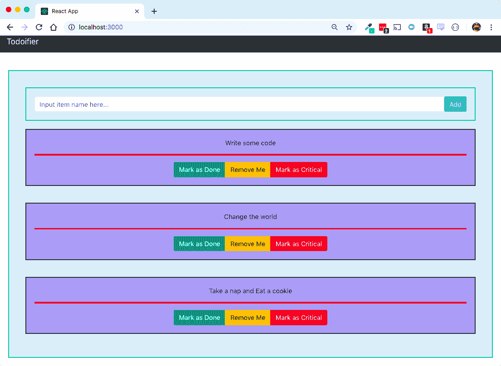

# 将现代 CSS 应用于创建 React App 项目

在我们一直在工作的项目中，我们非常重视功能，但总体来说，我们对实际的外观可能关注得稍微少一些！虽然这对于建立功能和在项目开始时使一切流畅是不错的，但任何参与项目的设计师在这个时候可能会大喊大叫！

让我们的设计团队满意，无论是实际团队还是我们自己，只需花一点时间清理项目的视觉吸引力！就我们当前的设计而言，虽然它并不一定难看，但确实有很多地方需要改进！

那么，我们如何以安全可靠的方式改进应用程序的设计呢？嗯，以前在 Create React App 中，你实际上没有很多选项来从视觉上清理东西。你经常受随机**层叠样式表**（**CSS**）项目维护者的摆布，试图让其他库、框架或预处理器参与项目编译过程通常是一场噩梦。

在 Create React App 的上下文中，**预处理器**基本上是构建过程中的一个步骤。在这种情况下，我们谈论的是一些样式代码（CSS 或其他格式），将其编译成基本的 CSS，并将其添加到构建过程的输出中。

在本章中，我们将涵盖涉及样式相关功能的各个方面，并突出我认为是 Create React App 中最好的新功能之一：支持 CSS Modules 和 SASS。具体来说，我们将涵盖以下主题：

+   将 CSS 引入我们的项目的不同方法

+   Create React App 项目中 CSS 的简要历史

+   介绍 CSS Modules

+   将 SASS 引入我们的项目

+   将 CSS Modules 和 SASS 混合使用

+   将 CSS Modules 和 SASS 集成到我们的项目中

+   将 CSS 框架集成到我们的项目中

+   在修改设计后清理我们的测试

# 有哪些工具可用？

默认情况下，Create React App 支持我们以多种不同的方式将 CSS 引入我们的应用程序。

我们可以通过编写一个`style`属性并给它一些任意的 CSS 来直接将 CSS 引入我们的组件中，如下面的代码所示：

```js
const Example = () => {
  return (
    <div className="Example" style="border: 1px solid red;">
      Hello
    </div>
  );
};
```

这将给我们一个包含单词`Hello`的`div`，周围有一个单像素的红线作为边框。虽然技术上可以这样做，但一般来说，你应该避免这样做。使用像前面示例那样的内联样式声明会使你的样式难以组织，并且在格式化出错时难以追踪。此外，如果设计师或其他非开发人员需要更新外观和感觉（例如，如果某些标准颜色发生变化），他们必须搜索以找到这个随机的一个像素红边的来源！

我们还可以创建`.css`文件，然后通过以下类似语句将它们导入到我们的项目中：

```js
import "./someStyle.css";
```

这是一个你之前已经看到过并且我们在我们的应用程序中大量使用的技术。它是有用的，当然，它允许我们稍微分离代码和样式，但它并不能给我们提供我们需要的所有东西。事实上，它实际上引入了一个新的问题，我们现在必须解决，这个问题可能会随着时间的推移使修复项目和清理项目的视觉显示变得极其令人沮丧和困难：CSS 冲突！

# CSS 冲突可能会破坏你的应用程序

什么是 CSS 冲突？基本上，当你将 CSS 文件导入到你的组件中时，它并不会真正限制它只针对一个特定的文件；它会被添加到全局 CSS 定义中。这意味着如果你在一个地方定义了特定的样式，它可能会覆盖或与另一个地方的不同样式发生冲突。这些样式表按照特定的顺序导入，这取决于代码如何加载到你的应用程序中，最终在浏览器加载所有内容时，所有内容都会添加到一个巨大的样式表中。

如你所想，如果所有内容都被添加到一个巨大的文件中，而且不同文件之间以及加载方式之间没有真正的区分，你可能会定期遇到一些被粗心命名的东西最终破坏一切的问题！

# CSS 冲突的快速示例

理解这个问题的最简单方法就是看到它在实际操作中的效果。大部分时间，我们都非常聪明和谨慎地命名了我们的 CSS 文件，但我们确实遇到了一个巨大的问题：我们的`Divider`组件为所有`hr`标签定义了一个全局样式，无论它们出现在哪里。让我们回到`src/Todo.js`，并更改我们的`render`函数，在`description`和`button`之间放置一个`hr`标签：

```js
  render() {
    return (
      <div className={this.cssClasses()}>
        {this.state.description}
        <br />
        <hr />
        <button className="MarkDone" onClick={this.markAsDone}>
          Mark as Done
        </button>
        <button className="RemoveTodo" onClick={this.removeTodo}>
          Remove Me
        </button>
      </div>
    );
  }
```

注意，我们还没有对这个文件添加任何样式！保存文件并重新加载，尽管我们从未在`Todo`组件中为`hr`标签定义过样式，但我们仍然会发现它继承了`Divider`组件的样式！请参考以下截图：


但这并不是我们想要的！虽然这是一个相当不错的分隔符，但我们可能希望我们的分隔符有不同的颜色！为了比较，我们可以说我们希望`Todo`组件内的分隔符是实心的红色线条，但我们希望其他的保持不变。我们将在`src/Todo.css`中添加以下 CSS，将我们的`hr`标签改为红色，通过更改`border`颜色：

```js
hr {
  border: 2px solid red;
}
```

保存并重新加载，但什么都没有发生？这很奇怪。代码是正确的，并且它确实已经正确地将 CSS 导入到我们的应用程序中。为了确保一切正常，我们将`hr`标签改为`div`标签，以确保它为我们的`Todo div`标签添加一个红色边框：

```js
div {
  border: 2px solid red;
}
```

保存并重新加载，你应该现在能看到这个：


哎呀，这可不是我们想要的！它给页面上的每一个`div`都添加了边框，而不是仅仅在我们的`Todo`组件中的`div`标签上！好吧，至少我们已经弄清楚代码没有问题，只是 CSS 加载的方式有些问题。这很容易解决；我们只需在`src/Todo.css`文件的`hr`定义的末尾加上一个`!important`标志，然后就算完成了！

`!important`标志是一种强制 CSS 优先执行此指令而不是其他指令的方法。它也是一个让你的应用程序随着时间的推移变得难以维护的绝佳方式；尽可能避免使用它！

在`src/Todo.css`中，我们将通过在`hr`块的末尾添加一个`!important`标志来犯下我们的 CSS 罪行：

```js
hr {
  border: 2px solid red !important;
}
```

好了！保存并重新加载，我们将看到以下输出：


现在，我们搞砸了一切。哎呀！希望我们的设计团队不会因此完全抛弃我们，对吧？他们真的很擅长 CSS，所以他们会修复问题的！嗯，他们会在我们因为代码中破坏了网站的布局而大喊大叫之后修复问题，这对非开发者来说很难追踪到。

好消息是，有一种不同的方式来处理这种情况，效果非常好，可以防止未来发生这种类型的场景！这对那些一直在做共享前端开发项目的人来说是一个绝对的福音，这些项目可能需要搜索多个不同的 CSS 文件，才能找到导致主要设计头痛的单个 CSS 文件！

# 介绍 CSS Modules

这些方法中的第一个是 CSS Modules，在 Create React App 2 及以上版本中，你不需要做任何事情就可以立即开始利用它。CSS Modules 允许你以防止引入全局、重叠命名空间的方式模块化你导入的任何 CSS 代码，尽管最终结果仍然是一个巨大的 CSS 文件。

话虽如此，如果你不打开任何东西或者稍微更好地组织一下代码，这东西也不会立即在你的项目中工作。目前，我们一直把所有的代码直接放入`src/`目录，导致`root`文件夹会随着时间的推移不断增大，最终变得庞大而难以管理，以至于你永远找不到任何东西。

# 更好的项目组织

让我们从更好地清理我们的项目目录结构开始。有无数种不同的方法来做这件事，而且说实话，它们都有自己的优点和缺点。由于这个项目实际上不会非常大，我们现在将采用一个非常简单的结构，因为用这个结构保持简单和构建起来非常容易。我们将要做的是将每个具有 CSS 和 JavaScript 代码的组件分开到它们自己的文件夹中。我们将从创建`NewTodo`、`Todo`、`App`、`TodoList`和`Divider`文件夹开始，并将所有相关代码放在每个文件夹中。我们还需要在每个这些目录中创建一个名为`index.js`的新文件，它将只负责导入和导出适当的组件。例如，`App`索引文件（`src/App/index.js`）将看起来像这样：

```js
import App from "./App";
export default App;
```

新的`Todo`索引文件（`src/Todo/index.js`）将看起来像这样：

```js
import Todo from "./Todo";
export default Todo;
```

你可能可以猜到`NewTodo`、`TodoList`和`Divider`索引文件的样子，根据这个模式！

接下来，我们需要更改所有引用这些文件的地方，以便更容易地导入所有文件。这无疑会是一点点的体力劳动，但无论如何我们都需要这样做，以确保在过程中不会破坏任何东西。

首先，在`src/App/App.js`中，将`TodoList`导入组件更改为以下内容：

```js
import TodoList from "../TodoList";
```

对于`Divider`组件，我们不需要做任何事情，因为它是一个没有导入的组件。`NewTodo`和`Todo`类型相似，所以我们可以跳过它们。另一方面，`src/TodoList/TodoList.js`有很多东西需要处理，因为它是我们最高级别的组件之一，并且导入了大量内容：

```js
import Todo from "../Todo";
import NewTodo from "../NewTodo";
import Divider from "../Divider";
```

但这还不是全部。我们的测试文件`src/TodoList/TodoList.test.js`也需要修改，以包含这些新路径，否则我们的测试将会失败！我们需要几乎与之前相同的导入列表：

```js
import TodoList from "./TodoList";
import NewTodo from "../NewTodo";
import Todo from "../Todo";
```

现在，当你重新加载你的应用程序时，你的代码应该仍然工作得很好，所有的测试都应该通过，而且一切都应该被干净地分离出来！这使我们生活变得更加容易，原因有很多，但当我们与其他开发者或设计师一起工作时，这对他们来说就像天赐之物，因为他们可以准确地找出在需要修复东西时应该修改哪些 CSS！我们的完整项目结构现在应该看起来像这样：

```js
src/
  App/
    App.css
    App.js
    App.test.js
    index.js
  Divider/
    Divider.css
    Divider.js
    index.js
  NewTodo/
    NewTodo.css
    NewTodo.js
    NewTodo.test.js
    index.js
  Todo/
    Todo.css
    Todo.js
    Todo.test.js
    index.js
  TodoList/
    TodoList.css
    TodoList.js
    TodoList.test.js
    index.js
  index.css
  index.js
  setupTests.js
  ... etc ...
```

# 如何使用 CSS 模块

是时候让我们直接将 CSS 模块整合到我们的项目中了。目前，我们还没有设置任何东西来开始使用 CSS 模块，所以我们需要做一些更改才能使其工作。回想一下我们的`Todo` CSS 冲突，引入一些冲突的 CSS 命名空间和关于使用`!important`标志的糟糕选择，导致了一个噩梦般的情况。

相反，让我们开始利用 CSS Modules！我们实际上可以混合旧的方式和新方式，但更进一步，完全使用 CSS Modules 会更好。

# 将 CSS Modules 引入我们的应用程序

如果我们要使用 CSS Modules，有一些简单的指南我们需要遵循。首先，我们需要将我们的文件命名为 `[ whatever ].module.css`，而不是 `[ whatever ].css`。接下来，我们需要确保我们的样式命名简单且易于引用。让我们从遵循这些约定并重命名我们的 CSS 文件 `Todo` 为 `src/Todo/Todo.module.css` 开始，然后我们会稍作修改：

```js
.todo {
  border: 2px solid black;
  text-align: center;
  background: #f5f5f5;
  color: #333;
  margin: 20px;
  padding: 20px;
}

.done {
  background: #f5a5a5;
}
```

CSS Module 指南建议您使用 **camelCase** 命名约定，所以 `Done` 和 `Todo` 将分别变为 `done` 和 `todo`。类似 `NewTodo` 的东西也将变为 `newTodo`！

接下来，我们将打开 `src/Todo/Todo.js` 文件，以利用 CSS Modules。我们在 `Todo` 组件中创建了一个辅助函数 `cssClasses()`，它返回我们在组件中应该使用的样式，而且我们不需要做太多修改就能让这一切与之前完全一样。我们还需要更改顶部的 `import` 语句，因为我们重命名了文件，并且正在更改我们的 CSS 被加载到代码中的方式！请看以下内容：

```js
import styles from "./Todo.module.css";
```

这使得我们的代码能够通过将它们作为 `styles.[className]` 引用来利用 `Todo.module.css` 中定义的任何类名。例如，在上一个文件中，我们定义了两个 CSS 类名：`todo` 和 `done`，因此我们现在可以通过 `styles.Todo` 和 `styles.done` 在我们的组件中引用它们。我们需要更改 `cssClasses()` 函数以使用它，所以现在让我们进行这些精确的更改。在 `src/Todo/Todo.js` 中，我们的 `cssClasses()` 函数现在应该如下所示：

```js
  cssClasses() {
    let classes = [styles.todo];
    if (this.state.done) {
      classes = [...classes, styles.done];
    }
    return classes.join(' ');
  }
```

保存并重新加载，我们的应用程序应该恢复正常！不过，我们还可以做更多的事情，所以让我们回到我们的冲突场景。如果你还记得，问题是我们需要能够在 `todo` 组件内部更改 `hr` 标签以拥有自己的样式和效果，同时不影响其他一切，并且如果可能的话，避免使用 `!important` 标志。回到 `src/Todo/Todo.module.css` 文件，并为我们的 `hr` 标签添加以下块，我们将给它一个新的类名 `redDivider`：

```js
.redDivider {
  border: 2px solid red;
}
```

最后，回到我们的 `render()` 函数，它在 `src/Todo/Todo.js` 文件中，并将我们的 `render()` 函数的 `hr` 标签包含更改为以下内容：

```js
<hr className={styles.redDivider} />
```

保存并重新加载，现在我们应该有了完全分区的 CSS 代码，无需担心冲突和全局命名空间！请参考以下截图：


# 与 CSS Modules 的组合性

这并不是 CSS Modules 给我们的所有东西，尽管这确实是 CSS Modules 的一个伟大部分，我们可以立即获得，而且没有任何麻烦（真的，我们写了零配置来让所有这些发生；这只是一些代码）。我们还获得了 CSS 可组合性，这是从其他类继承 CSS 类的能力，无论它们是否在主文件中！当你设置更复杂的嵌套组件，所有这些组件都需要处理稍微不同的样式表，但彼此之间并不完全不同时，这可以非常有用。让我们假设我们想要有标记一些组件为 `critical` 而不是只是常规 Todos 的能力。

我们不想对组件做太多改动；我们希望它继承所有其他 Todos 的相同基本规则。我们需要设置一些代码来实现这一点。回到 `src/Todo/Todo.js`，我们将对允许新的 `critical` 状态属性的代码进行一些修改。我们将在 `constructor` 组件中开始，我们将添加新的 `state` 属性和一个用于函数的 `bind` 标签：

```js
  constructor(props) {
    super(props);
    this.state = {
      done: false,
      critical: false
    };

    this.markAsDone = this.markAsDone.bind(this);
    this.removeTodo = this.removeTodo.bind(this);
    this.markCritical = this.markCritical.bind(this);
  }
```

在我们的 `state` 属性中，我们添加了一个新的 `critical` 属性，将其设置为默认值 `false`，然后我们还引用了一个（我们还没有编写的）名为 `markCritical` 的函数，并绑定 `this`，因为我们将在事件处理程序中稍后使用它。接下来，我们将处理 `markCritical()` 函数：

```js
  markCritical() {
    this.setState({ critical: true });
  }
```

我们还需要修改我们的 `cssClasses()` 函数，使其能够响应这个新的 `state` 属性。为了演示 CSS Modules 的可组合性功能，我们将设置 `classes` 初始为一个空数组，然后第一个项目要么变为 `critical`，要么变为 `todo`，具体取决于项目是否被标记为 `critical`：

```js
  cssClasses() {
    let classes = [];
    if (this.state.critical) {
      classes = [styles.critical];
    } else {
      classes = [styles.todo];
    }
    if (this.state.done) {
      classes = [...classes, styles.done];
    }
    return classes.join(' ');
  }
```

最后，在我们的 `render` 函数中，我们将创建 `button` 标签来标记项目为 `critical`：

```js
  render() {
    return (
      <div className={this.cssClasses()}>
        {this.props.description}
        <br />
        <hr className={styles.hr} />
        <button className="MarkDone" onClick={this.markAsDone}>
          Mark as Done
        </button>
        <button className="RemoveTodo" onClick={this.removeTodo}>
          Remove Me
        </button>
        <button className="MarkCritical" onClick={this.markCritical}>
          Mark as Critical
        </button>
      </div>
    );
  }
```

虽然我们已经完成了至少 90%，但我们还没有完全完成。我们还需要回到 `src/Todo/Todo.module.css` 并为 `critical` 类名添加一个新的块，同时我们也会使用我们的可组合属性：

```js
.critical {
  composes: todo;
  border: 4px dashed red;
}
```

要使用组合，你只需要添加一个新的 CSS 属性 `composes` 并给它一个类名（或多个类名），你想要它组合的。在这里，组合是一个花哨的说法，意思是它继承了其他类名的行为，并允许你覆盖它们。在前面的例子中，我们说的是 `critical` 是一个由 `todo` 模型作为基础组合的 CSS 模块类，并添加了一个大红色虚线边框组件，因为，嗯，我们只能说这意味着它是 `critical`。这段之前的代码相当于我们编写以下内容：

```js
.critical {
  text-align: center;
  background: #f5f5f5;
  color: #333;
  margin: 20px;
  padding: 20px;
  border: 4px dashed red;
}
```

和往常一样，保存并重新加载，你应该能够标记项目为“标记为完成”、“标记为关键”或两者兼而有之，或者通过点击“移除我”来移除它们，如下面的截图所示：


大概这就是我们对 CSS 模块的简要介绍了！当然，随着时间的推移，你可以涵盖更多内容，但这个文档更倾向于作为一个快速入门指南，我们可能只需要再写一本书就能涵盖 CSS 技巧和库了！

在继续之前，你还需要快速更新你的测试快照，在 `yarn test` 界面中按 *U* 键！

# 将 SASS 引入我们的项目

这还不是 Create React App 2 部分添加的所有支持。根据非常受欢迎的需求，Create React App 团队还添加了对 SASS 预处理的支持！通常，你几乎可以保证，一旦你想在你的项目中开始使用任何 SASS，你就需要将项目推出。

# 什么是 SASS？

让我们简单谈谈 SASS 实际上是什么，因为它是一个非常重要的内容。否则，你就不会知道为什么这值得付出努力（尽管，公平地说，将其集成到你的 Create React App 项目中几乎不需要付出什么努力）。SASS 实质上是具有扩展功能支持的 CSS。当我说 *扩展功能支持* 时，我确实是这个意思！SASS 支持以下功能集，这是 CSS 中缺失的，包括以下内容：

+   变量

+   嵌套

+   部分 CSS 文件

+   导入支持

+   混合

+   扩展和继承

+   运算符和计算

仅这个功能集就使得在几乎任何复杂的客户端项目中包含 SASS 都是有价值的，而且说实话，在使用了很长时间的 SASS 之后，没有它就很难再想回到纯 CSS。那么，让我们开始在我们的项目中添加一些 SASS 吧！

# 安装和配置 SASS

好消息是，在 Create React App 项目中使 SASS 支持工作极其简单！我们首先需要通过 `yarn` 或 `npm` 安装它。我们之前一直使用 `yarn`，所以我们将继续使用它：

```js
$ yarn add node-sass
```

我们会看到大量的输出，但假设没有错误并且一切顺利，我们应该能够重新启动我们的开发服务器，并开始使用一些 SASS。让我们创建一个更通用的实用 SASS 文件，它将负责存储我们将在整个应用程序中使用的标准化颜色，以及存储我们可能想要在其他地方使用的整洁渐变 `hr` 模式。

我们还将更改一些我们正在使用的颜色，以便根据项目是否关键、已完成或都不是，分别使用红色、绿色和蓝色。此外，我们还需要稍微调整我们的项目，并添加一个新文件来有一个共享样式和颜色的概念。那么，让我们开始吧：

1.  在我们的项目中创建一个名为 `src/shared.scss` 的新文件，并给它以下内容：

```js
$todo-critical: #f5a5a5;
$todo-normal: #a5a5f5;
$todo-complete: #a5f5a5;
$fancy-gradient: linear-gradient(
  to right,
  rgba(0, 0, 0, 0),
  rgba(0, 0, 0, 0.8),
  rgba(0, 0, 0, 0)
);
```

1.  接下来，转到 `src/Divider/Divider.css` 并将其重命名为 `src/Divider/Divider.scss`。接下来，我们将更改 `src/Divider/Divider.js` 中对 `Divider.css` 的引用，如下所示：

```js
import "./Divider.scss";
```

1.  现在，我们需要更改 `Divider.scss` 中的代码，以导入共享变量文件并使用变量作为其一部分：

```js
@import "../shared";

hr {
  border: 0;
  height: 1px;
  background-image: $fancy-gradient;
}
```

因此，我们在 `src/` 中导入新的共享 SASS 文件，然后 `background-image` 的值仅引用我们创建的 `$fancy-gradient` 变量，这意味着我们现在可以在需要时重新创建那个复杂的渐变，而无需反复重写它！

1.  保存并重新加载，您应该看不到任何重大变化！

这是一个很好的例子，展示了如何引入 SASS 来替换我们的标准 CSS，但当我们开始引入 CSS Modules 时会发生什么呢？

# 混合 SASS 和 CSS Modules

好消息是，在 Create React App 中引入 SASS 到 CSS Modules 并没有更复杂。实际上，步骤几乎完全相同！所以，如果我们想开始混合这两种技术，我们只需要重命名一些文件并更改我们的导入方式。让我们看看实际操作：

1.  首先，回到我们的 `src/Todo/Todo.module.css` 文件，进行一个非常小的修改。具体来说，让我们将其重命名为 `src/Todo/Todo.module.scss`。接下来，我们需要更改 `src/Todo/Todo.js` 中的 `import` 语句，否则整个项目都会崩溃：

```js
import styles from "./Todo.module.scss";
```

1.  现在，我们应该让 SASS 在 `Todo` 组件中为 CSS Modules 工作，让我们开始利用它。同样，我们还需要将 `shared` 文件导入到这个 SASS 文件中。注意以下在 `src/Todo/Todo.module.scss` 中的内容：

```js
@import '../shared';
```

1.  接下来，我们需要开始更改对各种背景颜色的引用。我们将常规待办事项的背景更改为 `$todo-normal`。然后，我们将完成的 `Todo` 背景更改为 `$todo-complete`。最后，我们希望将 `critical` 项目更改为 `$todo-critical`：

```js
.todo {
  border: 2px solid black;
  text-align: center;
  background: $todo-normal;
  color: #333;
  margin: 20px;
  padding: 20px;
}

.done {
  background: $todo-complete;
}

.hr {
  border: 2px solid red;
}

.critical {
  composes: todo;
  background: $todo-critical;
}
```

1.  保存并重新加载我们的项目，让我们确保新的配色方案被尊重：


实话实说，从这一点开始，就是越来越深入地探索 SASS 特定的语法，而且，这又超出了本书的范围。然而，正如您从前面的截图中所见，我们能够将 SASS 引入我们的 CSS Modules 代码中，而且没有遇到任何真正的困难。

更好的是，我们现在已经引入了一种新的方法来更改项目中的主题和皮肤，而无需做很多额外的工作，如果我们的设计师想要快速进入并更改，例如，所有待办事项的背景以及整体配色方案，他们可以通过快速进入 `shared.scss` 文件并做一些颜色更改来实现，而无需更改其他太多内容！

我们可以保留 CSS Modules 和 SASS 的可爱代码模块化和以开发者为中心的特性，同时为设计师和其他非开发者提供修改设计元素和样式元素的入口！更好的是，通过添加两个新功能，我们的代码变得更加易于维护，而不是让我们的项目变得复杂指数级增长！

# 添加 CSS 框架

在前端项目中工作时会遇到的一个非常常见的用例是集成某种第三方 CSS 框架。这是我几乎在接触过的每一个前端开发项目中都必须做的事情，而且有很大可能性你需要运行相同的流程！

我们将坚持使用最常见的一种，因为它将为你提供一个很好的框架使用介绍，所以我们将从将 bootstrap 集成到我们的项目中开始！我们的项目从有点丑陋到真正有点体面不会花费太多时间！正如我们在使用 Create React App 进行开发过程中遇到的大多数其他事情一样，这同样简单易行！我们将从将`bootstrap`和`reactstrap`都添加到我们的项目中开始，`reactstrap`是一个预制的 React 组件，充分利用了 Twitter Bootstrap！

我们将首先通过`yarn`添加`bootstrap`和`reactstrap`：

```js
$ yarn add bootstrap@4 reactstrap@6.5.0
```

目前，如果你使用的是`bootstrap` 4.x 版本，你需要包含`reactstrap`，但在 6.5.x 版本中，为了避免错误信息！

我们应该在项目文件夹中看到许多东西被安装，但希望没有错误！在所有内容都成功安装后，我们就可以通过打开`src/index.js`并添加一个单独的`import`语句来将基线`bootstrap`引入我们的项目：

```js
import 'bootstrap/dist/css/bootstrap.css';
```

# 清理我们的设计，从头部开始

接下来，让我们清理我们丑陋的头部，这也将要求我们移除我们之前为了实验 JavaScript 语法而编写的部分代码！目前，我们的`header`是我们自己预制的，但它现在看起来并不好看。我们将利用`reactstrap`作为其标准导出的一部分提供的`Navbar`和`NavbarBrand`组件！打开`src/App/App.js`，我们将开始对该文件进行相当大的修改：

1.  我们将首先在顶部添加`Navbar`和`NavbarBrand`的导入：

```js
import { Navbar, NavbarBrand } from "reactstrap";
```

1.  接下来，我们可以移除所有的`header`配置对象，因为我们编辑完这个文件后不再需要它们。相反，我们将用单个`headerTitle`变量来替换它：

```js
const headerTitle = "Todoifier";
```

1.  接下来，我们需要替换我们的`headerDisplay`函数，因为它将使用新的`reactstrap`组件而不是我们之前放置的代码：

```js
const headerDisplay = (title) => (
  <Navbar color="dark" dark expand="md">
    <NavbarBrand href="/">{title}</NavbarBrand>
  </Navbar>
);
```

注意，现在`header`只接受传入的标题，而不是我们之前使用的巨大的配置对象。这显著简化了我们的代码！我们还需要更改`App`组件中对`header`函数的调用：

```js
const App = () => (
  <div className="App">
    {headerDisplay(headerTitle)}
    <br />
    <TodoList />
  </div>
);
```

1.  保存它，我们应该在我们的项目中有一个显著更干净的`header`！参考以下截图：


# 清理 NewTodo 组件

我们还想要清理我们的 `NewTodo` 组件，因为它现在非常简单！我们将基本上想要更新代码中任何出现 `Button` 或 `Input` 函数的地方，以确保我们的应用程序在各个地方都有一个干净、一致的设计！

1.  首先，在 `src/NewTodo/NewTodo.js` 的顶部，我们想要添加我们的 `reactstrap` 导入！我们需要 `Button`、`Input` 和 `InputGroup`，所以让我们从 `reactstrap` 中添加它们作为命名导入：

```js
import { Button, Input, InputGroup } from "reactstrap";
```

1.  接下来，我们需要正确清理 `Input` 和 `Button` 的文本显示，所以让我们将我们的文本字段和 `Button` 包裹在 `InputGroup` 组件中，以保持它们在一起！我们将文本 `Input` 更改为 `reactstrap Input` 组件，并将 `Button` 标签更改为 `reactstrap Button` 组件，并为输入项添加一个 `placeholder` 文本。此外，请注意，我们在 `Button` 标签上设置了一个新属性 `color`，其设置为 `"primary"`。这给了我们一个蓝色的按钮，而不是默认的丑陋灰色按钮！我们的 `render()` 函数现在应该看起来像这样：

```js
  render() {
    return (
      <div className="NewTodo">
        <InputGroup>
          <Input
            type="text"
            onChange={this.handleUpdate}
            value={this.state.item}
            placeholder="Input item name here..."
          />
          <Button onClick={this.addTodo} 
          color="primary">Add</Button>
        </InputGroup>
      </div>
    );
  }
```

1.  保存并重新加载，我们的输入应该看起来好多了；类似于以下内容：


# 清理我们的 Todo 组件

我们的 `Todo` 组件仍然看起来有点丑，所以让我们也给它们同样的处理。在这之后，我们将足够好地完成我们的项目，使其看起来更漂亮，但要达到这个目标，我们需要更多的导入：

1.  我们需要将 `import`、`Button` 和 `ButtonGroup` 导入到我们的 `Todo` 组件中，因为我们想要清理的只有我们的按钮！为此，使用以下代码，将其添加到 `src/Todo/Todo.js`：

```js
import { Button, ButtonGroup } from "reactstrap";
```

1.  接下来，直接进入 `src/Todo/Todo.js` 中的 `render()` 函数，我们将把我们的按钮包裹在 `ButtonGroup` 组件中，并将每个 `button` 标签更改为 `Button` 组件：

```js
  render() {
    return (
      <div className={this.cssClasses()}>
        {this.props.description}
        <br />
        <hr className={styles.hr} />
        <ButtonGroup>
          <Button className="MarkDone" onClick={this.markAsDone}
          color="success">
            Mark as Done
          </Button>
          <Button className="RemoveTodo" onClick={this.removeTodo}
          color="warning">
            Remove Me
          </Button>
          <Button className="MarkCritical" onClick={this.markCritical}  
           color="danger">
            Mark as Critical
          </Button>
        </ButtonGroup>
      </div>
    );
  }
```

1.  保存并重新加载，现在我们应该看到我们的项目看起来像这样：



我们还没有修复的一件事是我们的测试！现在我们应该看到大量的失败测试，所以我们需要进去并专门修复它们！

# 让我们的测试再次通过

由于我们更改了许多 `input` 和 `button` 标签，并且我们有针对它们的特定测试，因此我们需要首先进入 `src/NewTodo/NewTodo.test.js`，并将每个 `.find("input")` 和 `.find("button")` 实例更改为 `.find("Input")` 和 `.find("Button")`。我们将从我们的第一个测试开始，该测试测试表单：

```js
  it("contains the form", () => {
    expect(component.find("Input")).toHaveLength(1);
    expect(component.find("Button")).toHaveLength(1);
  });
```

我们还想要修改下一个依赖于模拟 `button` 点击的测试：

```js
  it("calls the passed in addTodo function when add button is clicked", () => {
    component.find("Button").simulate("click");
    expect(mockAddTodo).toBeCalled();
  });
```

我们几乎完成了这个文件！我们还有一个地方正在尝试模拟一个 `button` 点击，所以我们需要清理这个测试！我们可以这样做：

```js
  it("blanks out the Todo Name when the button is clicked", () => {
    const updateKey = "I should be empty";
    component.instance().handleUpdate({ target: { value: updateKey } });
    expect(component.state("item")).toEqual(updateKey);
    component.find("Button").simulate("click");
    expect(component.state("item")).toHaveLength(0);
  });
```

保存并重新加载后，我们应该看到失败的测试更少，然后我们可以继续进行下一个失败的测试套件！我们可以这样做：

```js
 FAIL src/Todo/Todo.test.js
 - Todo › marks the Todo as done

 Method “simulate” is meant to be run on 1 node. 0 found instead.

 34 |
 35 | it("marks the Todo as done", () => {
 > 36 | component.find("button.MarkDone").simulate("click");
 | ^
 37 | expect(component.state("done")).toEqual(true);
 38 | });
 39 |

 at ShallowWrapper.single (node_modules/enzyme/build/ShallowWrapper.js:1875:17)
 at ShallowWrapper.simulate (node_modules/enzyme/build/ShallowWrapper.js:1080:21)
 at Object.simulate (src/Todo/Todo.test.js:36:39)

 - Todo › calls the mock remove function

 Method “simulate” is meant to be run on 1 node. 0 found instead.

 39 |
 40 | it("calls the mock remove function", () => {
 > 41 | component.find("button.RemoveTodo").simulate("click");
 | ^
 42 | expect(mockRemoveTodo).toHaveBeenCalled();
 43 | });
 44 | });

 at ShallowWrapper.single (node_modules/enzyme/build/ShallowWrapper.js:1875:17)
 at ShallowWrapper.simulate (node_modules/enzyme/build/ShallowWrapper.js:1080:21)
 at Object.simulate (src/Todo/Todo.test.js:41:41)

 PASS src/TodoList/TodoList.test.js
 PASS src/App/App.test.js

Test Suites: 1 failed, 3 passed, 4 total
Tests: 2 failed, 19 passed, 21 total
```

从之前的代码片段中，我们可以看到其他失败的测试套件位于 `src/Todo/Todo.test.js` 中，所以我们也以同样的方式修复它！滚动到文件的底部并更改两个失败的测试，这些测试正在寻找 `button` 标签而不是 `Button` 组件：

```js
  it("marks the Todo as done", () => {
    component.find("Button.MarkDone").simulate("click");
    expect(component.state("done")).toEqual(true);
  });

  it("calls the mock remove function", () => {
    component.find("Button.RemoveTodo").simulate("click");
    expect(mockRemoveTodo).toHaveBeenCalled();
  });
```

保存文件，当测试重新开始（你可能需要按 *U* 更新 `Snapshots`，别忘了），我们应该再次看到一个完全绿色的测试套件，如下所示：

```js
 PASS src/Todo/Todo.test.js
 PASS src/NewTodo/NewTodo.test.js
 PASS src/App/App.test.js
 PASS src/TodoList/TodoList.test.js

Test Suites: 4 passed, 4 total
Tests: 21 passed, 21 total
Snapshots: 3 passed, 3 total
Time: 4.386s
Ran all test suites.

Watch Usage: Press w to show more.
```

我们 *几乎* 到达目的地了，但记得我们为项目添加的新功能，用于标记某些 `Todo` 项为 `critical` 吗？我们从未为它添加新的测试！好消息是，我们只需要再写一个测试！

这个测试应该几乎与查看 `Todo` 项被点击并标记为完成的测试相同；但是，这次我们正在寻找 `Mark Critical` 按钮，我们将模拟点击该按钮。按钮点击后，我们应该期望看到 `component` 的 `critical` 属性从 `false` 变为 `true`，这也意味着我们在点击按钮之前，将在测试中进行一个健全性检查，以确保 `critical` 属性开始时为 `false`，并在按钮点击后变为 `true`！如下所示：

```js
 it("marks the Todo as critical", () => {
 expect(component.state("critical")).toEqual(false);
 component.find("Button.MarkCritical").simulate("click");
 expect(component.state("critical")).toEqual(true);
 });
```

在你的测试中养成编写这些健全性检查的习惯，因为这将帮助你避免编写错误地假设默认状态的测试，并在未来导致无用的测试！

就这样！我们的设计很干净，我们的测试套件是绿色的，我们的项目正以惊人的速度前进！我们将再次运行测试套件，以确保一切仍然绿色，但如果它是的话，那么我们可以安全地继续到下一个挑战：

```js
 PASS src/NewTodo/NewTodo.test.js
 PASS src/TodoList/TodoList.test.js
 PASS src/Todo/Todo.test.js
 PASS src/App/App.test.js

Test Suites: 4 passed, 4 total
Tests: 22 passed, 22 total
Snapshots: 3 passed, 3 total
Time: 4.969s
Ran all test suites.

Watch Usage: Press w to show more.
```

# 摘要

我们为项目添加了一些很棒的新功能，但真的不必参与很多头痛和设置（我想，还有心痛）的工作，这些工作伴随着向项目中添加两个新的 CSS 处理器！我们在 Create React App 项目中让 CSS Modules 和 SASS 顺利地协同工作，并且只需要安装一个新依赖项。我们甚至让它们 *一起* 顺利工作，这是一个更大的成就！

我们稍微清理了一下代码，并开始将事物分组在一起，引入了如共享 SASS 文件等概念来存储颜色和值等变量，这使得我们可以在一个地方更改颜色，例如，它将影响变量出现的所有地方！

我们的代码更干净，我们的设计师很高兴，我们也很高兴，我们可以继续推进我们的项目，而无需放慢速度。我们从未需要深入研究配置文件，或做任何比安装依赖项更复杂的事情！这是 Create React App 的又一个巨大胜利！

在下一章中，我们将深入了解如何通过 Create React App 的非常棒的代理 API 功能构建前端项目的模拟后端！
