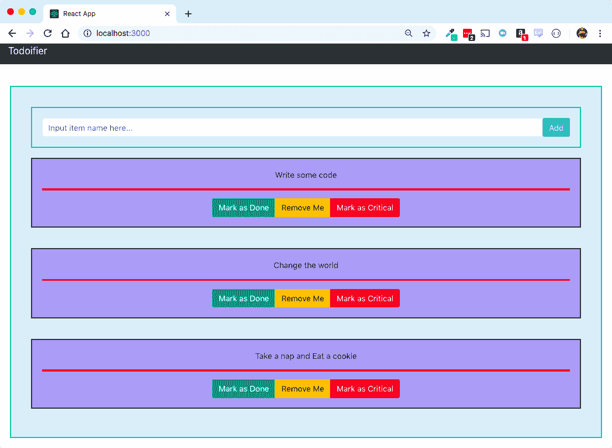
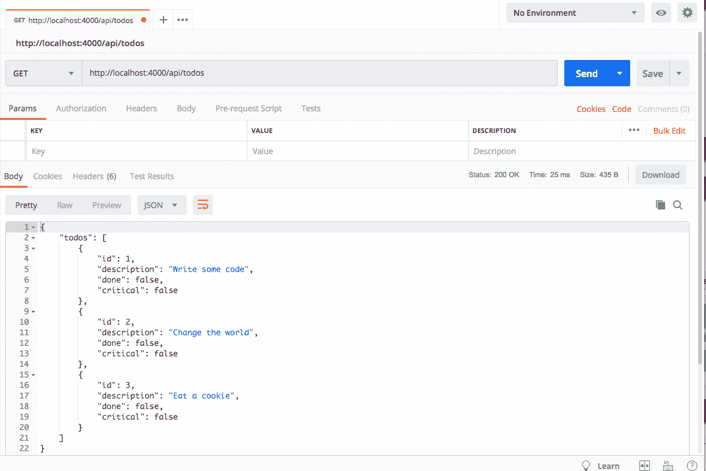
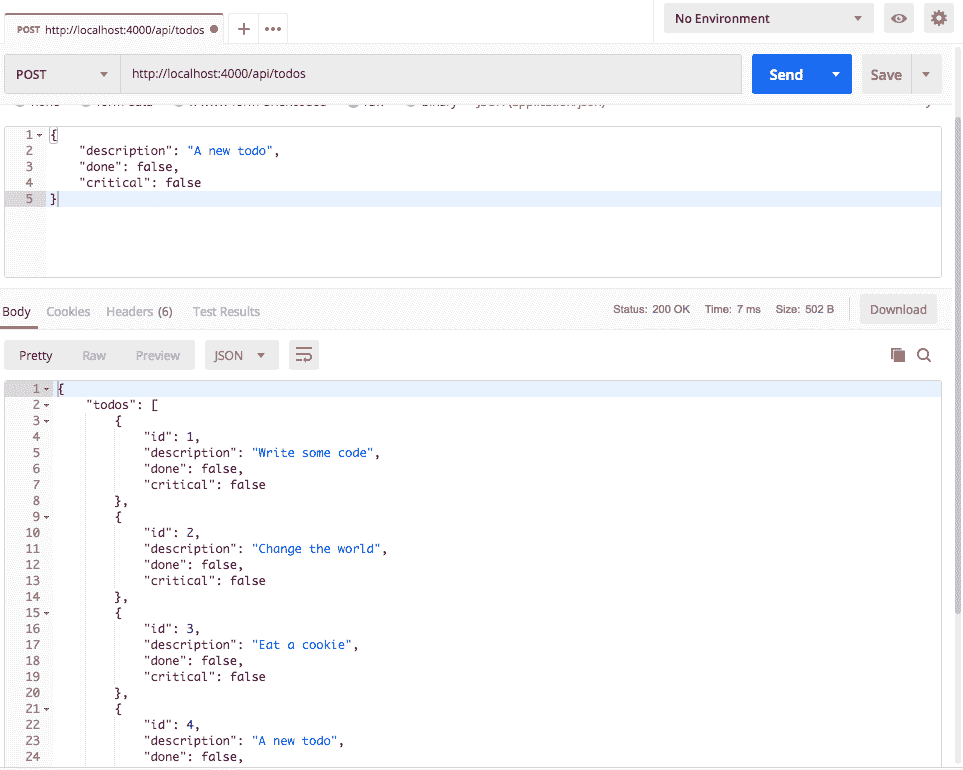
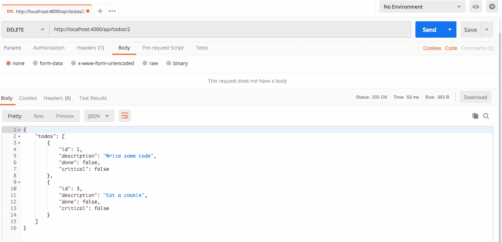
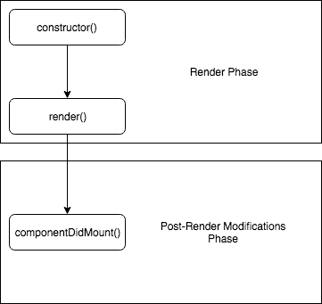

# 第六章：使用代理 API 模拟你的后端

在我们构建应用程序的过程中，我们已经做了大量的出色工作，但几乎所有的工作都处于一种奇怪的状态，数据完全存在于我们的 React 应用程序内部。但现实是，对于你将要工作的多数项目来说，这不会是事实，因此我们想要做一些工作，尝试将我们的 Create React App 项目的状态置于 React 本身之外。为此，我们可以利用 Create React App 世界中的另一个特性：代理后端！

此外，我们还需要花一点时间讨论如何将数据从后端服务器实际获取到我们的 Create React App 项目中！没有前端的后端并不特别有用，反之亦然！同样，一个对这两个方向都没有理解的开发者将处于一个困难的情况，他们设计系统时没有意识到它们需要如何相互交互！

我们将要构建的模拟后端服务器将作为我们前端开发人员遵循的设计文档。它并不是我们最终将使用的最终后端，而是作为一个框架，其他开发人员可以在此基础上工作，更好地理解如何正确地与我们的前端交互，以及如何构建一个不需要我们完全重建前端的后端 API！

在本章中，我们将涵盖以下主题：

+   了解代理功能

+   实现一个占用空间小的快速`Express.js`服务器

+   学习一点关于 React 组件方法的知识

+   通过 Fetch 从我们的后端代理获取或发送数据

+   更新我们的测试

# 使用代理 API 模拟后端服务器

我们一直在使用 Create React App 构建我们的应用程序，但我们几乎将其完全保持为纯前端应用程序。这当然很好，但现实是，你可能会构建一个后面有服务器的应用程序！好消息是，在 Create React App 项目中创建模拟后端仍然尽可能简单，同时还能让你对现实世界场景或项目中的事物转换有一个良好的感觉！

# 设置后端 API

如前所述，假装我们的 Create React App 项目有一个后端需要付出非常少的努力，并且能让我们非常快地回到开发状态。为了利用这一点，我们首先需要在`package.json`文件中设置一个`"proxy"`。代理是一种让我们告诉 Create React App，我们发出的任何请求都应该发送到这个其他服务器，即使它看起来像是在本地发出请求。让我们从配置我们的项目开始，然后继续实现这一功能：

```js
"proxy": "http://localhost:4000"
```

我们还希望添加一个命令来运行和执行我们的服务器，这样我们就可以通过 `yarn` 容易地运行它，因此我们还需要更新 `package.json` 中的 `"scripts"` 部分，以包含一个新的命令。我们将随意命名为 `"backend"`，这样当我们准备好运行我们的服务器时，我们只需运行 `yarn backend` 命令即可：

```js
  "scripts": {
    "start": "react-scripts start",
    "build": "react-scripts build",
    "test": "react-scripts test",
    "eject": "react-scripts eject",
    "backend": "node server.js"
  },
```

仅此还不够。我们需要在幕后实现一个 `server`，它能够对我们在过程中发出的任何 API 调用做出响应和反应。不过，由于我们本身无法模拟 API，我们还需要在我们的项目中添加另一个库来做这件事。我个人更喜欢使用 `Express.js` 来做这件事，因此我们将选择它作为我们项目的库。在我们的命令窗口中，我们将通过 `yarn` 添加 express：

```js
$ yarn add express
```

然后，我们在 Create React App 项目的根目录中创建一个新的文件，名为 `server.js`。这将成为服务所有我们应用程序将发出的请求的代码，以模拟现实世界的场景。我们的服务器实际上不会是状态化的；相反，我们将通过从我们的小型、虚假 API 返回的静态数据来模拟这种行为。

这个部分将比 React 更侧重于 Node.js 和 Express 概念，因为我们需要能够设置一个快速的服务器来充当我们的模拟后端！

我们将从为我们的服务器创建一个基本的骨架开始，这将执行 `express` 从我们这里要求的一些设置工作。在 `server.js` 中，在我们的项目根目录中，我们将有以下内容：

```js
const express = require('express');
const app = express();
const port = 4000;

app.use(express.json());

app.get('/', (req, res) => res.json({}));

app.listen(port, () =>
  console.log(`Simulated backend listening on port ${port}!`)
);
```

我们将首先将 Express 加载到我们的服务器项目中。由于我们将通过 Node 运行它，我们需要通过 `require()` 语句而不是 `import()` 语句将其拉入我们的项目。接下来，我们需要在我们的应用程序变量中构建我们的服务器，这是 `express.js` 代码的实例化。我们还将设置我们将运行的端口，这是我们在代理配置中指定的端口。我倾向于选择 1,000 的倍数作为端口，但你可以使用你个人偏好的任何端口号！

接下来，我们需要告诉我们的应用程序使用 express JSON 中间件，这将使我们能够对 JSON post body 语句做出反应和响应（当我们去创建服务器中的新 `Todo` 项目时，我们将需要这样做）。之后，我们在我们的 express 服务器中有了第一个路由的例子。当有人对我们的代理 API 后端根目录发起请求时，它只是返回一个空的 JSON 主体。

让我们花几分钟时间更详细地讨论一下 Express 中路由的结构。虽然我们不会深入细节并从头到尾写出来，但至少了解什么是路由以及如何在 Express 中编写路由是值得的，以避免以后产生任何混淆。

路由是结构化和编写的，形式为`(express()变量的名称).(HTTP 方法)("path", (请求变量, 响应变量))`然后是一个基于该路径的函数。每个路由都应该以向请求者发送某些内容结束，在我们的情况下（因为我们正在编写一个小型 API），应该发送一些 JSON。

这就足够我们目前使用了；我们将在本章后面的内容中进一步扩展这个配置！

中间件是一系列函数，它们在服务器看到请求、请求进入正确的路由，然后返回给发送者的过程中执行。在这种情况下，所有 JSON 体都被转换为 JSON，这样我们就可以在不添加大量额外代码的情况下每次都从中读取。

最后，我们需要设置一个监听器来监听我们的应用程序。我们将监听我们之前指定的端口，然后指定一个函数，当应用程序完成对该端口的监听时执行。在我们的情况下，我们只有一个简单的消息，它会记录下来，让我们知道服务器已设置并正确运行！

这段代码非常简洁，但由于它的简洁性，它也需要一些维护。例如，每次你更改代码时，你都需要重新启动你的后端服务器（尽管不是 Create React App 项目）。

# 确定我们的后端请求

为了确定我们将如何构建我们的 API，重新查看 UI 以识别可能发生的不同类型的函数很有帮助：



看看那个用户界面，你能弄清楚我们需要什么吗？我们需要`Todo`项的表示以及获取当前项列表的方法，我们还需要一种改变它们状态、删除项或添加新项的方法。我们将从实现`Todo`索引开始，但这需要先确定我们将要使用的数据结构。首先，我们需要为每个`todo`创建一个对象。每个`todo`都需要与它们的内部对象相同的表示：

```js
{ description: String, done: Boolean, critical: Boolean }
```

我们还需要一些内部`id`实例的表示，所以我们的新对象将是以下形式：

```js
{ id: Number, description: String, done: Boolean, critical: Boolean }
```

让我们从在服务器中构建这个开始，这样我们就可以在后面的操作中更好地了解如何处理它！

# 构建 Todos 索引 API 请求

首先，回到`server.js`，我们需要整理我们的`Todo`项列表。你可能会从之前使用的`Todo`项中认出这些项，除了我们现在在项中也有一些`id`之外。这更接近我们在服务器中通常看到的形式，其中项不仅包含它们的正常属性，还包含主键的形式。我们将这些存储为`const`，因为我们不希望不小心在以后覆盖它们：

```js
const todos = [
  { id: 1, description: 'Write some code', done: false, critical: false },
  { id: 2, description: 'Change the world', done: false, critical: false },
  { id: 3, description: 'Eat a cookie', done: false, critical: false }
];
```

要通过服务器`get`到这些 Todos，我们需要创建一个指向端点的新的路由，`/api/todos`：

```js
app.get('/api/todos', (req, res) => res.json({ todos: todos }));
```

首先，你需要使用 `yarn backend` 启动后端。接下来，如果我们通过某些网络工具发送 `HTTP` 请求（例如，使用 Postman），我们应该能够通过向 `http://localhost:4000/api/todos` 发送 `GET` 请求来验证结果：



我们还可以删除 `app.get("/"...)` 行，因为我们不再需要那段代码。

有很多方法可以模拟对后端的请求。类似于代码编辑器的选择，Postman 是我手动发送 `HTTP` 请求以验证结果的工具，或者你可能已经拥有可用的工具，例如 CURL！无论你使用什么，都应该没问题。

# 构建添加待办事项的 API 请求

我们还需要能够创建新的待办事项。为此，我们将实现我们 API 的下一部分，在 `server.js` 中创建一个能够处理接收带有正文的 `HTTP` 请求的路由。记得之前的那行代码，我们指示 express 使用 JSON 中间件？这个代码也不复杂。我们告诉 express 我们可以接受一个 `HTTP` 请求，并给它标准的 `req`，`res` 参数。

从那里开始，由于我们的 `Todo` 列表中只有几个条目，我们给新的 `Todo` 分配一个等于列表长度的 `id`，然后使用对象展开运算符填充用户传递的其余正文！如下所示：

```js
app.post("/api/todos", (req, res) => {
  const body = { id: todos.length + 1, ...req.body };
  res.json({ todos: [...todos, body] });
});
```

再次，为了验证我们是否正确地做了事情，我们将通过 Postman 发送一个快速的测试，带有 `Todo` 正文，并验证我们是否收到了待办事项列表，以及我们发布的新的一个！参考以下截图：



那就是我们添加新 `Todo` 所需要做的所有事情，所以现在我们可以继续到下一个功能：删除 `Todo`！

# 构建删除待办事项的 API 请求

删除一个 `Todo` 也很简单！就像接受一个 post 路由一样，我们必须接受一个 delete 路由并在正文中指定一个 `id`。这将允许我们使用类似 `/api/todos/3` 的 URL，其中 `3` 将是我们想要删除的 `Todo` 的 `id`！我们可以通过 `req.params.[参数名称]` 访问 URL 中的 `params`。在以下情况下，我们指定的参数名称是 `:id`，这意味着我们可以访问的变量是 `req.params.id`！

从那里，我们只需 `filter` 出不匹配的 `id` 实例，然后结束！记住，任何 `params` URL 都是以字符串形式传递的；这就是为什么我们在 `filter` 函数之前对 `id` 进行快速 `parseInt()` 的原因！如下所示：

```js
app.delete("/api/todos/:id", (req, res) => {
  const todoId = parseInt(req.params.id);
  res.json({ todos: todos.filter(t => t.id !== todoId) });
});
```

然后，我们将在 Postman 中运行它并验证结果：



# React 组件的生命周期（挂载）

我们还需要了解 React 组件的生命周期，以便挂载组件，因为我们稍后需要将其作为将一切重新连接到应用程序的一部分。处理 React 组件时，有两个主要的阶段。第一个是 **渲染阶段**，在这个阶段，React 关注的是如何创建初始组件并将其渲染到页面上。你应该保持这些阶段干净，没有副作用，例如，我们不会包含任何调用后端以填充数据或页面上组件的调用。这里最常用的函数是 `constructor()` 和 `render()`。

然而，第二个阶段是我们可以在事后修改事物的阶段。这里要提到的主函数是 `componentDidMount()`，我们可以在其中（并将会）向我们的后端服务器发起请求。这些调用的图示可能看起来像这样：



# API 请求的放置位置

基于此，我们将不得不创建一个 `componentDidMount()` 函数，它将包含我们需要向我们的后端服务器发起请求的代码，而不是将它们放在 `constructor()` 或其他函数中！这确保了我们的组件将以合理的方式更新和挂载！

# 使用 React 与你的代理服务器通信

现在我们已经编写了服务器端所需的所有代码，我们需要修改我们的 `TodoList` 组件，以便真正调用我们编写的服务！好消息是，再次，我们需要的所有东西都已经存在于我们的 Create React App 项目中！

这也是一个很好的机会，让我们来谈谈另一个现代 JavaScript 函数：`Async`/`Await`！

# 使用 Async/Await

如果我们想从服务器获取数据，最适合我们使用的工具就是通过一些新的 JavaScript 语法来处理异步操作和调用！

这被称为 `Async`/`Await`，是一种执行不需要应用程序完全挂起但会在处理其他数据的同时等待结果的操作方法。如果你熟悉承诺，你可能熟悉看起来像这样的代码：

```js
doSomethingAsync().then(doSomething()).then(doSomethingElse())
```

这是可以的，但还有更好的方法来做这件事。随着代码的增长，这段代码可能会变得特别混乱，尤其是如果我们引入了不同的分支或需要考虑的失败标准时。最终，一串承诺可能会变成在出错时难以追踪的代码，我们希望尽量避免这种情况。

# 介绍 Fetch

好消息是，Fetch 也是一个极其简单的库，易于使用！它的语法简单明了，应该很容易快速理解其功能。当然，这引发了一个问题：什么是 Fetch？

简短的回答是，Fetch 是一个`HTTP`请求机制，它已经被提升为 JavaScript 世界中的第一公民。更长的回答是，Fetch 是 JavaScript 社区和贡献者尝试以标准化的方式处理 JavaScript 代码中的`HTTP`请求的尝试，而不是数百（甚至可能是数千）种不同的选择，每种选择都需要自己的实现、模式、配置等等。

Fetch 的实用性源于其无处不在，并且是 JavaScript 语言标准的一部分，尽管目前并非所有浏览器都完全支持它。因此，我们不必选择其他随机的库来工作，而是更容易依赖于标准，因为我们深知，你在使用 Fetch 时学到的技能应该可以很好地转移到你可能选择并开始使用的任何其他库中。

# 从服务器获取待办事项列表

要获取待办事项，我们需要改变我们构建状态的方式。如果你回想起我们最早的`TodoList`组件实现，我们是将所有的待办事项作为一个字符串数组构建的，然后允许我们的`Todo`组件完成其余的工作。当我们实际上从服务器获取信息时，这种模型并不理想，因此我们希望从依赖于简单的字符串来存储待办事项信息过渡到一个模型，其中待办事项的数据结构与其组件实现和服务器端的数据表示相匹配。

为了开始修改`TodoList`以适应我们的新世界，我们希望从一个空的待办事项列表和一个标志开始，这个标志用来捕获数据是否已经加载。在`src/TodoList/TodoList.js`中添加以下代码：

```js
  constructor(props) {
    super(props);

    this.state = {
      items: [],
      loaded: false
    };

    this.addTodo = this.addTodo.bind(this);
    this.removeTodo = this.removeTodo.bind(this);
  }
```

这个`loaded`标志实际上非常重要；没有它，我们可能会遇到一个场景，即当页面首次加载时，页面看起来是空的，或者显示*无项*，而实际上它只是还没有加载完整的项列表！为了创造更好的用户体验，我们希望依赖于一个标志来告诉应用程序它是否已经完成加载，并向用户显示有关此的信息，而不是依赖于`items 状态属性`中是否有值。

如果你记得我们的服务器，`Todo`项现在将从我们在服务器文件中创建的数据结构中填充，因此它们不再只是描述。这将要求我们重构一些代码，所以我们将回过头来修复因这一变化而损坏的代码。首先，让我们添加一个新项：

```js
  addTodo(description) {
    const newItem = {
      description: description,
      done: false,
      critical: false
    };
    this.setState({
      items: [...this.state.items, newItem]
    });
  }
```

将`newItem`拆分成一个单独的变量然后传递给`setState()`调用对我们来说更容易，否则我们可能会使这一行代码变得非常长，而且对任何可能发生的数据结构变化来说也非常脆弱：

```js
  removeTodo(removeItem) {
    const filteredItems = this.state.items.filter(todo => {
      return todo.description !== removeItem;
    });
    this.setState({ items: filteredItems });
  }
```

我们还对 `removeTodo` 调用执行了类似的操作。我们将根据描述移动过滤后的项目列表。接下来是 `renderItems()` 调用，它也将检查新的状态变量以确定数据是否已从服务器加载。此外，我们还将向 `Todo` 组件传递一些新属性，使其遵守我们的数据结构。具体来说，我们将传递 `id`、`done` 和 `critical` 标志，以便在 `Todo` 中作为传入的 `props` 部分设置：

```js
  renderItems() {
    if (this.state.loaded) {
      return this.state.items.map(todo => (
        <Fragment key={'item-' + todo.description}>
          <Todo
            id={todo.id}
            key={todo.id}
            description={todo.description}
            removeTodo={this.removeTodo}
            done={todo.done}
            critical={todo.critical}
          />
          <Divider key={'divide-' + todo.description} />
        </Fragment>
      ));
    } else {
      return <p>Still Loading...</p>;
    }
  }
```

注意，我们向 `Todo` 组件传递了一些新的属性，这意味着我们需要修改它们以允许通过 `props` 设置 `state`，以便确定一个 `Todo` 是否已完成以及一个 `Todo` 是否是关键的。打开 `src/Todo/Todo.js`，我们将在 `constructor()` 函数中迅速处理这个问题：

```js
  constructor(props) {
    super(props);
    this.state = {
      done: props.done,
      critical: props.critical
    };

    this.markAsDone = this.markAsDone.bind(this);
    this.removeTodo = this.removeTodo.bind(this);
    this.markCritical = this.markCritical.bind(this);
  }
```

回到 `src/TodoList/TodoList.js`，让我们开始编写我们的 `Async`/`Await` 功能。我们将创建一个新的函数，它是 React 标准组件生命周期的一部分，`componentDidMount()`，我们将将其声明为一个 `async` 函数。记住，我们想要在代码中使用 `await` 的任何地方，都必须在已经声明为 `async` 的函数内部这样做！我们将从一个简单的主体开始，以便首先验证它的工作方式，然后我们会对其进行更多扩展：

```js
  async componentDidMount() {
    this.setState({ loaded: true });
  }
```

接下来，我们需要使用 `fetch` 向我们的模拟后端发起请求，我们将 `await` `fetch` 的结果：

```js
const res = await fetch('/api/todos', { accept: 'application/json' });
```

记住，我们通过 Create React App 代理请求到不同的后端！因此，我们不需要指定端口或主机，因为它假装是相同的端口/主机。

这个后端服务器旨在作为当你在一个与代码运行相同的应用程序或服务上构建后端时的占位符，以实现最小延迟。当你正在构建某个前端但后端尚未完全构建时，这是一个非常好的模型！

如果我们想要对这些结果进行任何操作，我们还需要将它们转换为 JSON 格式，这也是一个 `async` 调用：

```js
const json = await res.json();
```

最后，别忘了我们的服务器以以下形式返回数据：

```js
{
  todos: [ ...todo1, ...todo2, ...etc ]
}
```

所以最后，我们需要将项目的状态替换为新状态：

```js
this.setState({ items: json.todos, loaded: true });
```

就这样！现在当页面刷新时，你应该看到与之前相同的组件列表，但现在数据来自我们的模拟后端！这应该让这个函数的完整体看起来像以下代码片段：

```js
async componentDidMount() {
  const res = await fetch('/api/todos', { accept: 'application/json' });
  const json = await res.json();
  this.setState({ items: json.todos, loaded: true });
}
```

# 在服务器上创建一个新的 Todo

我们还希望能够通过使用`HTTP` post 来创建一个新的`Todo`。这也会是一个`async`函数，因为我们将会对`fetch`进行`async`调用以发送数据。由于通过`HTTP` post 比获取更复杂，我们还需要在我们的`fetch`调用中指定一些选项。具体来说，我们可以通过指定`HTTP`方法（在我们的情况下是`POST`），头部（仅一个接受`header`的 JSON 数据，这与我们通常与任何 JSON API 通信时使用的是相同的），以及我们要发送到服务器的正文来配置调用，这只是一个新的`Todo`的数据结构。如果成功，我们将新的`Todo`添加到我们的状态中，然后结束。回到`src/TodoList/TodoList.js`，如下所示：

```js
  async addTodo(description) {
    const res = await fetch('/api/todos', {
      method: 'POST',
      headers: { accept: 'application/json', 'content-type': 'application/json'  },
      body: JSON.stringify({ description: description, critical: false, done: false })
    });
    if (res.status === 200) {
      const newItem = {
        id: this.state.items.length + 1,
        description: description,
        done: false,
        critical: false
      };
      this.setState({
        items: [...this.state.items, newItem]
      });
    }
  }
```

# 删除待办事项

删除`Todo`的过程将与创建`Todo`非常相似，所以这里实际上没有太多需要描述的。最重要的事情是方法设置为`DELETE`，以及我们想要删除的`Todo`的`id`将通过 URL 传递：

```js
  async removeTodo(removeItemId) {
    const res = await fetch(`/api/todos/${removeItemId}`, {
      method: 'DELETE',
      headers: { accept: 'application/json', 'content-type': 'application/json' }
    });
    if (res.status === 200) {
      const filteredItems = this.state.items.filter(todo => {
        return todo.id !== removeItemId;
      });
      this.setState({ items: filteredItems });
    }
  }
```

我们还需要更改从`src/Todo/Todo.js`中调用`removeTodo`函数的方式，所以打开该文件，并将它传递的参数更改为 Todo 的`id`而不是其描述！如下所示：

```js
  removeTodo() {
    this.props.removeTodo(this.props.id);
  }
```

这应该能让我们获得我们想要的绝大部分功能，但我们目前遇到的问题是我们的代码并不像我们希望的那样简单易测试。事实上，我们实际上有几个失败的测试需要修复！

# 回到通过测试

测试失败了。我们将首先按`u`来更新我们的快照，然后继续与我们的代码一起工作，修复其余的测试。好消息是，我们的`Todo`组件的测试很容易修复！记住，我们的`Todo`组件现在接受一些其他属性来初始化；根据我们的测试，它实际上只接受`description`和`removeTodo`属性。

# 修复待办事项测试

我们需要更改我们的浅渲染组件的初始化，以接受`id`、`critical`和`done`属性！在`src/Todo/Todo.test.js`中，我们将通过将`const component`语句更改以包含这些额外的属性来更改第一个失败的测试套件：

```js
  const component = shallow(
    <Todo
      description={description}
      removeTodo={mockRemoveTodo}
      critical={false}
      done={false}
      id={1}
    />
  );
```

重新运行测试，现在我们应该只剩下单个失败的测试套件！不幸的是，这将也是最难修复的测试套件！

# 通过重构修复我们最后的失败的测试套件

不幸的是，我们的代码现在让我们陷入了一个场景，我们的组件实际上很难进行适当的测试。我们的代码必须从后端获取数据，与初始化我们的组件的代码混合，以及与按钮点击时的行为混合！这不行，所以我们需要修复这个问题！

好消息是，我们修复这个问题的最简单方法不需要大量的努力；相反，它只需要我们将一些代码移动到使其更易于扩展的方式。我们首先需要执行的操作是将所有与后端交互的代码移动到它自己的独立服务库中！

服务库模式是一个非常好的模式，当你需要将行为和与外部服务的交互锁定到更简单的 API 中时，这将使你的代码或他人的代码更容易高效地与后端服务器交互！

# 构建服务库

我们将从将所有 API 调用移动到一个新文件 `src/TodoService.js` 开始。我们将从最简单的调用开始，即从服务器获取 `fetchTodos` 项目：

```js
const fetchTodos = async () => {
  const res = await fetch("/api/todos", { accept: "application/json" });
  const json = await res.json();
  return { status: res.status, todos: json.todos };
};
```

在这里，我们将我们的 `fetchTodos()` 函数编写为一个 `async` 函数，大部分功能与最初相同。这里唯一的重大不同是，我们将 `return` 语句改为不仅从服务器发送回 `todos` 列表，还发送服务器的 `HTTP` 状态码！

接下来，我们将实现创建服务器上的 `Todo` 的调用：

```js
const createTodo = async description => {
  const res = await fetch("/api/todos", {
    method: "POST",
    headers: { accept: "application/json" },
    body: JSON.stringify({
      description: description,
      critical: false,
      done: false
    })
  });
  const json = await res.json();
  return { status: res.status, todos: json.todos };
};
```

再次强调，这篇文章几乎与你之前看到的一样，只是对 `return` 语句进行了修改。最后，我们将继续进行服务器上的删除调用：

```js
const deleteTodo = async todoId => {
  const res = await fetch(`/api/todos/${todoId}`, {
    method: "DELETE",
    headers: { accept: "application/json" }
  });
  const json = await res.json();
  return { status: res.status, todos: json.todos };
};
```

我们添加了一些函数，所以我们将它们在服务库的末尾 `export`。我们只需要将这些三个函数作为命名函数 `export`：

```js
export { fetchTodos, createTodo, deleteTodo };
```

# 在 TodoList 中实现服务库

现在我们有了 `TodoService` 服务库，我们必须回到我们的 `src/TodoList/TodoList.js` 文件，找到我们曾经在我们的组件中写入 `fetch` 代码的所有区域。我们需要从文件的顶部开始，导入来自 `TodoService` 的这三个命名函数：

```js
import { fetchTodos, createTodo, deleteTodo } from "../TodoService";
```

接下来，我们需要进入我们的 `componentDidMount()` 函数，我们将对其进行修改以调用 `fetchTodos()` 函数：

```js
  async componentDidMount() {
    const { todos } = await fetchTodos();
    this.setState({ items: todos, loaded: true });
  }
```

看看这个函数现在多么干净漂亮！这绝对是一个向好的方向发展的举措！现在，让我们继续到我们的 `addTodo()` 函数调用：

```js
  async addTodo(description) {
    const { status } = await createTodo(description);
    if (status === 200) {
      const newItem = {
        id: this.state.items.length + 1,
        description: description,
        done: false,
        critical: false
      };
      this.setState({
        items: [...this.state.items, newItem]
      });
    }
  }
```

最后，我们将修改我们的 `removeTodo()` 函数：

```js
  async removeTodo(todoId) {
    const { status } = await deleteTodo(todoId);
    if (status === 200) {
      const filteredItems = this.state.items.filter(todo => {
        return todo.id !== todoId;
      });
      this.setState({ items: filteredItems });
    }
  }
```

这将使我们大部分回到修复失败的测试，但我们还需要在失败的测试本身做一些工作。

# 最后修复我们失败的测试套件

首先，前往失败的测试套件，`src/TodoList/TodoList.test.js`，在那里我们需要在 Jest 中创建一个 **mock 库**。mock 库基本上是我们告诉 Jest 我们需要伪造一个特定的 `import` 模块的行为，这样，无论何时使用它，我们的伪造 mock 函数都将被使用。这将允许我们伪造我们编写的整个服务库的行为，使我们能够测试我们的组件并验证功能，而无需实际调用某个后端 API 的测试！

我们将在测试文件的顶部，在`import`语句之下，添加库模拟和三个`mock`函数：

```js
jest.mock("../TodoService", () => ({
  fetchTodos: jest.fn().mockReturnValue({ status: 200, todos: [] }),
  createTodo: jest.fn().mockReturnValue({ status: 200, todos: [] }),
  deleteTodo: jest.fn().mockReturnValue({ status: 200, todos: [] })
}));
```

我们编写这些代码的方式是，函数始终会工作，始终返回一个空的`todos`列表，并且始终返回一个假的`HTTP`状态码`200`！处理完这些之后，我们可以清理失败的测试。

失败的两个测试是因为当我们处理非异步测试且涉及`async`功能时，行为是随机的！我们可以将我们的测试写成`async`函数，类似于我们写其他函数调用一样！想想测试声明的结构：

```js
it("does some thing", () => {
  // Do some work here
});
```

如果我们想要使那个测试异步化，我们就会将测试声明写成如下：

```js
it("does some thing", async () => {
  // Do some work here
});
```

考虑到这一点，让我们看看修正后的函数：

```js
  it("adds another Todo when the addTodo function is called", async () => {
    const before = component.find(Todo).length;
    await component.instance().addTodo("New Item");
    component.update();
    const after = component.find(Todo).length;
    expect(after).toBeGreaterThan(before);
  });
```

与我们之前进行的测试相比，并没有太大的不同，只是增加了对`addTodo()`的调用需要`await`语句。现在让我们来看看我们对`removeTodo()`的测试：

```js
 it("removes a Todo from the list when the remove Todo function is called", async () => {
 const before = component.find(Todo).length;
 const removeMe = component.state("items")[0];
 await component.instance().removeTodo(removeMe.id);
 component.update();
 const after = component.find(Todo).length;
 expect(after).toBeLessThan(before);
 });
```

你可能会收到关于第一个测试的错误信息，即尝试渲染组件而不崩溃的测试。由于我们新的`async`/`await`添加，这个测试不再可行，所以只需删除它！现在运行测试，我们应该看到以下结果：

```js
 PASS src/Todo.test.js
 PASS src/App/App.test.js
 PASS src/TodoList/TodoList.test.js
 PASS src/NewTodo/NewTodo.test.js
 PASS src/Todo/Todo.test.js

Test Suites: 4 passed, 4 total
Tests: 21 passed, 21 total
Snapshots: 3 passed, 3 total
Time: 5.596s
Ran all test suites.
```

我们又回到了一个完全通过测试的套件！

# 摘要

在本章中，我们花了不少时间探索了在 Create React App 项目旁边制作、模拟和运行后端服务器的选项。这使我们能够将项目转交给其他团队，他们知道在前后端开发团队之间作为开发过程一部分需要存在的隐式数据结构合约。

我们还花了不少时间探索了从 React 项目内部检索数据到服务器的选项！这只是许多实现方式中的一种；一般来说，JavaScript 项目往往有大量的（并且每种方式都有其自身的优点）实现许多常见功能的方法。使用 Fetch 和库服务只是实现这一点的可能方式之一，但这是我个人发现非常成功并且倾向于坚持的方式，除非我看到需要做更复杂的事情。

在下一章中，我们将探讨一些更先进的选择，以支持以支持移动用户和互联网连接较差的用户的方式构建 Web 应用程序：渐进式 Web 应用程序！Create React App 自带构建渐进式 Web 应用程序的出色支持，因此我们将深入探讨构建渐进式 Web 应用程序，它为我们提供了哪些功能和机会，以及我们如何利用这些功能来制作一个真正现代的 React 应用程序，同时仍然保持在 Create React App 项目的范围内！
