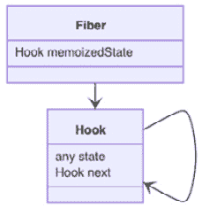
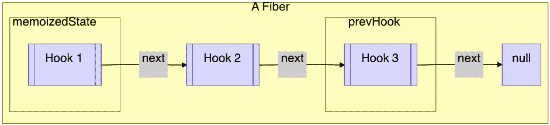
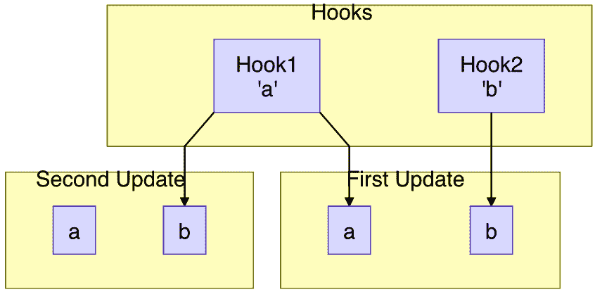
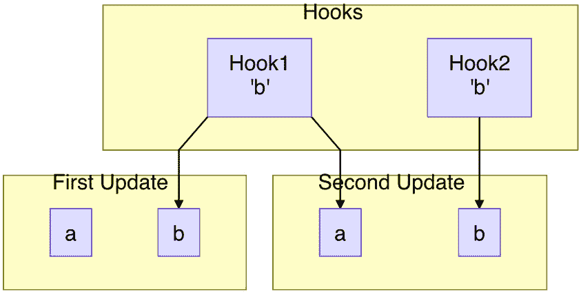
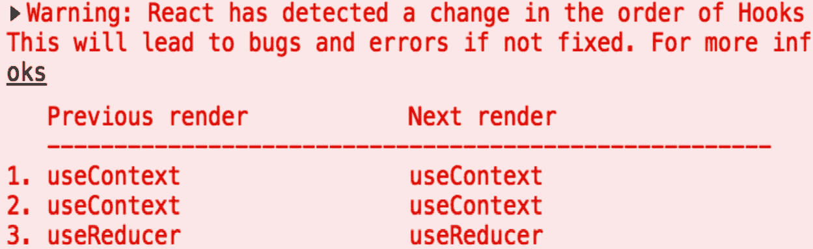
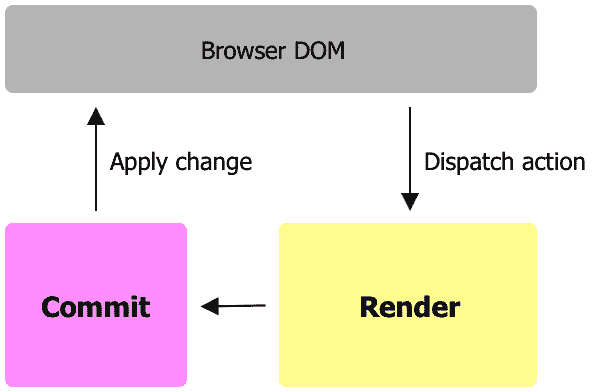

# 第三章：Hooking into React

在上一章中，我们学习了如何在函数组件内部使用我们自定义的状态来执行操作。在本章中，我们将探讨在创建良好的状态解决方案时面临的挑战，然后看看 React 如何通过底层的 Hook 构建解决方案。然后我们将介绍什么是 hook，并了解它的调用顺序，以及如何在实际应用中避免遇到条件 hook 问题。本章还包括附录部分的两篇附加主题，*React Fiber* 和 *Current and WorkInProgress Scenes*。

在本章中，我们将涵盖以下主题：

+   创建良好的状态解决方案

+   介绍 React Hook

+   什么是 hook？

+   问答

+   附录

# 创建良好的状态解决方案

状态非常强大。一个没有状态组件就像一个没有变量的函数。它将缺乏推理能力。一块 UI 逻辑依赖于状态来处理来自用户的连续交互。

在上一章中，我们按照以下方式构建了一个自定义状态：

```js
let states = {}
function _getM2(initialValue, key) {
  if (states[key] === undefined) {
    states[key] = initialValue
  } 
  return states[key]
}
function _setM2(v, key) {
  states[key] = v
  ReactDOM.render(<Title />, rootEl)
}
```

虽然这种方法可行，但在我们可以认真考虑使用 React 之前，我们需要解决一些问题。我们将逐一提及这些问题。

状态分配的位置是第一个主要问题：

```js
let states = {}
```

前面的 `states` 变量被分配为一个全局变量，但通常我们首先感兴趣的会是特定于组件的状态。换句话说，我们需要找到一个地方来定义局部状态。

使用状态的第二大问题是每个状态的唯一键：

```js
const a = _getM2(0, 'comp_a')
```

就像在先前的状态使用中一样，在将状态命名为`comp_a`之后，我们必须为涉及此状态的任何操作携带这个键。在一个典型的应用中，我们可能有大量的状态；如果每个都必须用唯一的字符串定义，我们就必须想出很多唯一的名称。跟踪所有使用的名称的工作量会相当大，更不用说函数组件内部持有状态的变量已经有一个名字，`a`。同时拥有变量名和键字符串会有些繁琐。

除了这两个主要问题之外，还有一些其他的小事情我们需要考虑。在演示状态的使用时，当我们需要请求新的更新时，我们会渲染`Title`组件：

```js
ReactDOM.render(<Title />, rootEl)
```

明确知道我们为每个执行的操作需要更新哪个组件可能对开发者来说是一个挑战。如果引擎能帮助我们在这里隐藏这个细节，找出需要更新的组件，那就更好了。这正是 React 最擅长的；我们应该将其与引擎连接起来以执行正确的更新。最后但同样重要的是，我们知道状态可以用于不同的目的，因为其底层概念是一个持久化机制。如果做得恰当，我们应该能够创建某种基础设施，在此基础上我们可以添加额外的功能。

前面列出的都是一个好的状态解决方案应该考虑的问题。考虑到这些，让我们看看 *React* 是如何处理这个状态问题的。

# 引入 React Hook

状态主要位于组件内部，至少就本书的内容而言是这样的。存储状态的天然位置应该是在组件实例下，因为 *React* 中的组件定义了一块 UI。那么，*React* 中函数组件的组件实例存储在哪里呢？

结果表明，组件并不是 *React* 中的最小单元。有一个更细粒度的结构叫做纤维，它用于表示一个元素。纤维为这个元素执行所有任务。元素可以是像 `h1`、`div` 这样的简单元素，也可以是执行不同操作的伪元素。例如，“片段”元素可以组合其他元素而不显示自己，或者“memo”元素可以记住上一次更新中的所有元素。

实际上，函数组件是纤维表示的伪元素之一。函数组件的作用是允许我们定义它可以显示的元素，所以每次它被调用时，它都能确定屏幕需要更新哪些 DOM 元素。你可以在本章末尾的 *附录 A – React Fiber* 中找到更多信息。

因此，现在我们找到了组件实例的单位；这正是 *React* 决定存储状态的地方。*React* 使用 Hook 结构在 `memoizedState` 属性下存储它们，如图 3.1 所示：



图 3.1 – 纤维下的 Hooks

我们在这里引入的 Hook 是一个用于保存状态的（或类）结构。这并不完全等同于我们稍后将要介绍的 *React* Hook（函数）。不幸的是，*React* 在这两个地方都使用了相同的词。为了区分它们，我们故意使用 *Hook*（带大写 *H*）来表示结构，而使用 *hook*（带小写 *h*）来表示函数。

Hook 结构的主要功能是在 `state` 属性下保存单个状态。而不是在数组（或对象）中保存多个状态，多个状态通过链表链接在一起，如图 3.2 所示。一个 Hook 通过其 `next` 属性指向另一个 Hook。当它到达列表的末尾时，最后一个 Hook 的 `next` 属性被设置为 `null`。这就是编程中典型的链表工作方式。如果有的话，第一个 Hook 存储在纤维的 `memoizedState` 下；这样，纤维就可以找到第一个之后的所有 Hooks。



图 3.2 – 链表中的 Hooks

为了让引擎知道屏幕上是否有任何变化，需要更新纤维。在更新函数中，这就是 Hook 初始化的地方。所以接下来，让我们看看更新函数。

## 更新函数组件

*React*通过`updateFunctionComponent`函数更新一个函数组件。输入参数接受一个`Component`函数及其`props`输入：

```js
let updatingFiber = ...
function updateFunctionComponent(Component, props) {
  prevHook = null
  let children = Component(props)
  ...
}
```

更新函数的主要任务是调用`Component(props)`以了解新的`children`元素。以`Title`组件为例，当它需要更新时，`updateFunctionComponent`函数会调用`Title()`。有了这个，引擎会比较返回的元素和屏幕上的元素，并提交差异。

在前面的更新函数中定义了两个全局变量。它们很容易理解。`updatingFiber`代表当前由引擎更新的纤维，`prevHook`指向这个纤维之前工作的 Hook。在组件被调用之前，`updatingFiber`由引擎填充，例如`Title`，而`prevHook`被设置为`null`。

组件第一次更新，就像挂载一样，是创建这个纤维的第一个 Hook 的时候。

## 在挂载时创建 Hook

要在当前正在更新的纤维下挂载一个 Hook，*React*会创建一个新的 Hook 对象并将其附加到链表中：

```js
function mountHook() {
  const Hook = {
    state: null
    next: null
  }  
  if (prevHook === null) { 
    updatingFiber.memoizedState = Hook
    prevHook = Hook
  } else {
    prevHook.next = Hook
    prevHook = prevHook.next     
  }
  return Hook
}
```

在前面的`mountHook`函数中，首先分配了一个空的 Hook 对象，并将`state`和`next`都设置为`null`。如果是第一个到达纤维的 Hook，由于`preHook`是`null`，它会被存储在纤维的`memoizedState`下。否则，它会被附加到前一个 Hook 的`next`属性上。之后，返回分配的 Hook。

## 在更新时获取 Hook

在挂载之后的任何其他更新中，我们可以访问*React*在挂载时创建的 Hook：

```js
function updateHook() {
  var Hook
  if (prevHook === null) {
    Hook = updatingFiber.memoizedState
  } else {
    Hook = prevHook.next
  }  
  prevHook = Hook
  return Hook
}
```

在前面的`updateHook`函数中，通过在纤维下查找第一个`memoizedState` Hook 来获取一个 Hook 对象。在第一个 Hook 之后，它通过跟随`prevHook`的`next`属性来获取。*React*也会在我们沿着列表移动时保持`prevHook`的最新状态。获取到的 Hook 会被返回。

## 使用 Hook

现在我们已经使 Hook 对所有更新持久化，我们可以在函数组件中使用它，类似于我们在上一章中编写的`_getM`或`_getM2`函数。

让我们这次创建一个接受`initialState`值的`_useHook`函数：

```js
function _useHook(initialState) {
  let Hook
  if (isFiberMounting) {
    Hook = mountHook()
    Hook.state = initialState
  } else {
    Hook = updateHook()
  }  
  return Hook.state
}
```

根据组件是否处于挂载状态，通过`isFiberMounting`标志，前面的`_useHook`函数获取一个持久化的 Hook。如果是挂载状态，*React*将`initialState`分配给 Hook。对于任何其他更新，Hook 不会被修改。在所有情况下，Hook 下的`state`都会被返回。

你可能会想知道*React*是如何确定`isFiberMounting`标志的；因为它与引擎的连接更深，所以我们把这个材料放在本章末尾的*附录 B – 当前和 WorkInProgress 场景*中。

到目前为止，我们已经了解了*React*在引擎下如何实现 Hook。我们刚刚咬下了硬骨头，现在让我们看看我们如何使用它。

# 什么是 Hook？

现在我们已经揭示了简化版的 *React* 钩子基础设施，并使用它创建了一个函数，让我们在一个函数组件中试一试：

```js
const Title = () => {
  const a = _useHook(0)
}
```

在挂载时，前一个 `a` 变量被分配一个 `0` 数字，然后它作为后续更新的状态。

`_useHook` 技术上是一个 *React* 钩子函数。虽然它不是官方支持的钩子，但我们在这里创建它来演示基础设施，但它具有钩子函数的所有特性。让我们仔细看看它。

注意

为了区分我们创建的教育性钩子与官方支持的钩子，我们用 `_` 前缀命名钩子，例如 `_useHook`。

我们将在下一节进一步解释钩子作为函数的本质以及其调用顺序。

## 钩子是一个函数

钩子是一个接受输入参数并返回值的函数，并且按照惯例带有 `use` 前缀。

如果我们将 `useHook` 视为一个通用钩子，以下是用不同输入参数使用钩子的示例用法：

```js
const Title = () => {
  const a = useHook()
  const b = useHook(1)
  const c = useHook(1, 2, "Hello")
  const d = useHook({ text: "Hello World"})
}
```

钩子可以接受零个或任意数量的输入参数。输入参数可以用作初始条件，例如在 `_useHook` 中的 `initialState` 参数。重要的是要知道，并非所有输入参数都用于初始化目的，因为，正如你在实现中可以看到的，例如 `initialState` 这样的输入参数会被发送到每次更新中，但更新是否需要使用输入参数取决于更新本身。

作为函数，钩子如果需要的话可以返回一个值。返回值可以设计成任何格式：

```js
const Title = () => {
  useHook(...)
  const i = useHook(...)
  const [j, k] = useHook(...)
  const { value } = useHook(...)
}
```

并非所有钩子都返回值。如果返回值，它可以是一个 `null`、一个数字、一个字符串、一个数组、一个对象或任何 JavaScript 表达式。

由于一个返回值可以成为另一个的输入参数，因此看到钩子的链式使用并不罕见，如下所示。

```js
const Title = ({ text }) => {
  const i = useHook(...)
  const j = useHook(i)
  const k = useHook(i, j, text)
}
```

在前面的代码中，`i` 和 `j` 是从两个钩子返回的，然后通过输入参数注入到另一个钩子中，从而得到 `k`。此外，一个 `text` 属性被作为输入参数发送到钩子。实际上，钩子语句与局部赋值语句并没有太大的区别。

总的来说，从技术上讲，钩子是一个函数。不要因为它是钩子就感到害怕。你了解的大部分关于函数的知识都适用于钩子。话虽如此，钩子是一个特殊的函数，它有一个需要注意的注意事项——其调用顺序。

## 钩子的调用顺序

到目前为止，我们知道钩子函数可以在函数组件中使用多次而不会引起冲突，因为每个状态都指向一个独立的内存空间：

```js
const Title = () => {
  const a = _useHook(0)
  const b = _useHook("Hello")
}
```

记得我们创建 `_getM2` 的原始版本以支持多个状态时，我们必须使用一个键来区分 `a` 变量和 `b` 变量吗？现在，有了钩子基础设施，我们不再这样做。你有没有想过没有状态键是如何做到这一点的？

在挂载时，在函数组件中使用 `a` 的第一个钩子函数之前，还没有创建任何钩子：

```js
  const a = _useHook(0)
```

在运行前面的语句后，*React* 创建了一个钩子并将其放在纤维之下。然后，它看到了另一个针对 `b` 的钩子函数：

```js
  const b = _useHook("Hello")
```

在看到前面的语句后，*React* 创建了另一个钩子并将其放在第一个钩子之后，按照链表顺序。第一次挂载更新已完成。

现在是第二次更新；当它再次看到 `a` 的第一个钩子函数时，它会查看纤维下的链式钩子并获取第一个钩子。同样，当它看到 `b` 的第二个钩子函数时，它会继续查看列表并找到第一个钩子之后的第二个钩子。

实际上，*React* 不使用键，因为列表的顺序充当键，键被称为钩子的调用顺序。只要 `a` 的第一个钩子首先调用，`b` 的第二个钩子其次调用，列表下存储的状态位置就会被正确标记。因此，我们不必有意识地跟踪键，因为在我们写下所有钩子语句之后，调用顺序应该已经确定。

这种没有开发者提供显式键的设计相当容易使用。除了有一个需要注意的地方；如果我们能避免遇到它，这种设计在实际中就像魔法一样有效。

所以，这里有一个需要注意的地方。这个调用顺序在代码编译期间并不是固定的；相反，它在运行时确定。有什么区别？区别在于运行时的事情是可以改变的。为了给你一个例子，我们可以使用一个 `if` 语句来设置一个案例。

## 条件钩子问题

假设我们有一个以下 `Title` 组件，它使用了两次钩子：

```js
const Title = ({ flag }) => {
  const a = flag ? _useHook('a') : ' '
  const b = _useHook('b')
  return <h1>Hello World+{a}{b}</h1>
}
```

在前面的代码逻辑中，我们的意图是将 `'a'` 和 `'b'` 字符分别存储在 `a` 和 `b` 变量中。但是，当 `flag` 为 `false` 时，空字符 `' '` 被存储在 `a` 变量中。

为了确认代码是否工作，让我们在翻转 `flag` 属性的同时对这个组件进行两次更新。假设第一次更新时 `flag` 属性设置为 `true`，而第二次更新时它被更改为 `false`。对于这个设置，它生成了以下时间线草图：

```js
|T-------F---------------> flag
|a------- ---------------> a
|b-------a---------------> b
```

在第一次更新时，变量 `a` 和 `b` 都被正确分配。但当进行第二次更新时，变量 `b` 被设置为 `'a'` 字符。这有点奇怪，因为我们从未在代码中要求将 `'a'` 字符设置为变量 `b`。这是怎么发生的?!

`_useHook('b')` 语句怎么会返回一个 `'a'` 字符，而 `'a'` 字符又是从哪里来的？为了回答这些问题，我们需要深入挖掘 `Title` 组件背后的纤维下的钩子：

```js
|T-------F---------------> flag
|a-------a---------------> Hook1
|b-------b---------------> Hook2
```

在前面的时间线草图中，我们打印出了两个钩子下存储的状态。`Hook1` 存储了 `'a'` 字符，`Hook2` 存储了 `'b'` 字符，对于两次更新。让我们仔细看看第二次更新；编译器看到的是以下代码：

```js
const Title = () => {
  const a = ' '
  const b = _useHook('b')
  return <h1>Hello World+{a}{b}</h1>
}
```

在前面的代码排列中，我们硬编码了`flag`属性为`false`。正因为如此，`a`钩子的第一次使用被省略了，我们最终只有一个针对`b`的钩子语句。你可以在*图 3.3*中看到这个信息，其中我们展示了两个钩子以及每个钩子语句读取的内容：



图 3.3 – 条件钩子不匹配 I

在第一次更新中，`a`和`b`变量从`Hook1`和`Hook2`读取。但在第二次更新中，由于第一个钩子语句执行，`b`变量发生了偏移并从`Hook1`读取。在这个更新中，也没有任何内容从`Hook2`读取。因此，`b`变量现在读取的是`'a'`字符。

操场 – 条件钩子 I

欢迎尝试这个在线示例：[`codepen.io/windmaomao/pen/RwLrxbp`](https://codepen.io/windmaomao/pen/RwLrxbp)。

在这种情况下，我们将`flag`属性从`T`更改为`F`；我们也可以通过将`flag`属性从`F`更改为`T`来测试这个条件情况。如果我们这样做，让我们看看时间线草图：

```js
|F-------T---------------> flag
| -------b---------------> a
|b-------b---------------> b
|b-------b---------------> Hook1
|~-------b---------------> Hook2
```

从前面的运行中，我们打印了`a`和`b`变量以及两个钩子状态。你可以看到，在第二次更新中，`a`变量读取了`'b'`字符！我们可以使用*图 3.4*来更清楚地说明这个情况：



图 3.4 – 条件钩子不匹配 II

这个情况发生了以下情况。在第一次更新中，由于标志是`F`，我们为`b`有一个钩子使用。由于这是挂载，`'b'`字符被初始化为`Hook1`，而`Hook2`被省略了。当进行第二次更新时，由于`Hook1`已经被初始化，其值不能再次初始化，因此它继续保留`'b'`字符。而这次`Hook2`最终被初始化为`'b'`字符。这就是为什么在第二次更新后，`a`和`b`都存储了`'b'`字符。这真是太令人震惊了，不是吗？从某种意义上说，这个情况比之前的情况更糟，当然；两者都是错误实现的。

从这两个案例中，我们可以得出结论，使用`if`语句与钩子语句会导致奇怪的行为。而且这完全是因为钩子的调用顺序在更新之间发生了变化，因此状态键被搞混了，状态不能按预期读取。

操场 – 条件钩子 II

欢迎尝试这个在线示例：[`codepen.io/windmaomao/pen/oNGbEzq`](https://codepen.io/windmaomao/pen/oNGbEzq)。

实际上，不仅仅是`if`；任何涉及条件的钩子语句都不能使用。这里有一个另一个例子：

```js
const Title = ({ arr }) => {
  const names = arr.map(v => _useHook(v))
  return <div>{names.join('')}</div>
}
```

在前面的代码中，我们在迭代 `arr` 数组的循环中嵌入了一个钩子。猜猜这个情况下我们会遇到多少个钩子语句？不确定？是的，你猜对了 – 我们不知道 `arr` 属性包含多少个元素；这只能在运行时确定。我们不会详细说明这个情况，但你可以看到，如果 `arr` 的长度从 0 变为 1，或从 1 变为 2，等等，代码很容易遇到奇怪的问题。

*React* 在其在线文档中给出了他们的建议："不要在循环、条件或嵌套函数中调用钩子。相反，始终在 React 函数的最顶层使用钩子，在所有早期返回之前。" 现在你对为什么他们会这么说有了更深的理解。

*React* 完全清楚这个问题的严重性，因为它可能会危及钩子的使用。因此，在代码编译时，编译器实际上会在发现条件钩子使用时提醒开发者。此外，如果在编译时错过了捕捉到的情况，在运行时，*React* 会监控钩子列表，以确定在新的更新中是否有钩子顺序的混乱。如果它发现了一个，你将看到一个警告，如图 *3.5* 所示：



图 3.5 – React 条件钩子运行时警告

## 避免使用条件钩子

现在我们知道我们不应该编写任何条件钩子语句，但我们如何避免它？或者，换一种说法，如果我们必须实现涉及钩子的某些条件逻辑，正确的做法是什么？

这个问题的解决方案并不困难。我们仍然可以写条件语句，只是不能写条件钩子语句。只要我们有固定数量的钩子和一致的调用顺序，我们就可以随意编写钩子语句。

让我们尝试修复我们的示例，首先从将 `flag` 从 `T` 设置为 `F` 开始。我们可以在之前声明两个 `_useHook` 而不是有条件地声明：

```js
const Title = ({ flag }) => {
  const _a = _useHook('a')
  const b = _useHook('b')
  const a = flag ? _a : ' '
  return <h1>Hello World+{a}{b}</h1>
}
```

在前面的代码中，我们使用一个辅助的 `_a` 变量来持有 `'a'` 字符。`b` 变量仍然持有 `'b'` 字符。这样，无论什么情况，所有钩子都在所有更新中保持固定的调用顺序。

现在，有了这个，我们可以将 `a` 的条件逻辑部分重新定位到钩子语句之后。我们可以通过查看生成的时间线草图来验证这是否有效：

```js
|T-------F---------------> flag
|a-------a---------------> Hook1
|b-------b---------------> Hook2
|a------- ---------------> a
|b-------b---------------> b
```

同样，我们可以生成将 `flag` 从 `F` 更改为 `T` 的时间线：

```js
|F-------T---------------> flag
|a-------a---------------> Hook1
|b-------b---------------> Hook2
| -------a---------------> a
|b-------b---------------> b
```

现在两种情况都正确实现了。`a` 变量可以根据 `flag` 的值持有 `'a'` 字符或空 `' '`，而 `b` 变量始终持有 `'b'` 字符。

操场 – 条件钩子 I

你可以自由地在这个在线示例[`codepen.io/windmaomao/pen/KKXVQWV`](https://codepen.io/windmaomao/pen/KKXVQWV)中玩耍。

操场 – 条件钩子 II

你可以自由地在这个在线示例[`codepen.io/windmaomao/pen/MWEKQQJ`](https://codepen.io/windmaomao/pen/MWEKQQJ)中玩耍。

将钩子语句移动到函数前面的写法是 *React* 推荐的，并且也可以应用于循环情况：

```js
const Title = ({ arr }) => {
  const t = _useHook(arr)
  const names = t.map((v, i) => t[i] || '')
  return <div>{names.join('')}</div>
}
```

在前面的代码中，我们不知道 `arr` 的长度，所以最好不要在循环中遍历每个钩子语句。相反，我们可以将整个 `arr` 存储到状态中，然后迭代这个数组。这样，我们消除了有变量数量的钩子语句的可能性。

幸运的是，之前提到的注意事项是 *React* 钩子唯一的缺陷，如果我们遇到条件语句，我们可以通过将钩子语句放在函数的前面来应用“正确”的方式。

简而言之，*React* 钩子是一个特殊的函数，它允许函数组件拥有持久的状态。开箱即用，*React* 提供了相当多的基于这个基础设施的钩子。从下一章开始，我们将详细了解其中的一些常见钩子，包括 `useState`、`useEffect`、`useMemo`、`useContext` 和 `useRef`。在 *第九章* “使用自定义钩子重用逻辑”中，我们将了解如何创建我们自己的自定义钩子来满足我们的特定需求。

# 摘要

在本章中，你学习了什么构成了一个好的状态解决方案，并了解了 *React* 如何构建 Hook 来提供这个解决方案。你还学习了钩子是什么以及它的调用顺序，以及如何在实际应用中避免遇到条件钩子问题。

在下一章中，我们将深入了解 *React* 家族的第一个钩子，通过它 *React* 允许我们定义一个状态来驱动 UI 显示。

# 问题和答案

这里有一些问题和答案来刷新你的知识：

1.  什么是 *React* 钩子？

    *React* 钩子是一个特殊的函数，它允许我们在函数组件中拥有持久的状态。钩子的调用顺序被用作状态的内部键，因此，当我们使用钩子时，我们不需要指定一个键。我们可以在一个函数组件下拥有尽可能多的钩子，每个钩子可以用于不同的目的。

1.  我们如何避免条件钩子？

    每个具有特定调用顺序的钩子都会存储在钩子列表中。*React* 不允许在运行时更改这个调用顺序，因此我们应该避免在条件、循环或任何改变调用顺序的结构中使用钩子。相反，我们可以将所有的钩子语句移动到函数的前面部分，预先确定它们的调用顺序，然后在返回语句之前留下条件逻辑。

# 附录

## 附录 A – React Fiber

在用户与网站的会话期间，会生成一系列操作。我们期望这些操作被分发，并将更改应用到 **文档对象模型** (**DOM**) 上。这个周期使得它成为一个典型的网络体验。



]

图 3.6 – 带有 Render 和 Commit 语句的 React Fiber

*React* 为我们做的事情是允许分发的动作更新屏幕上的更改。*React* 将每次更新分为两个主要阶段，**渲染** 和 **提交**，如图所示。渲染所做的就是逐个遍历所有元素并收集所有更改，而提交则一次性将更改应用到 UI 上。

这台引擎有一个代号，*Fiber*。为了方便所有这些操作，*React* 创建了一个内部对象，称为纤维，来表示每个元素。正如我们之前所介绍的，元素可以是经典元素，例如 DOM 元素，也可以是人工元素，例如函数组件。在物理 DOM 和 *React* 元素之间有一个层的好处是双重的。

函数组件（或类组件）更容易让开发者将 UI 以及逻辑组织成一个功能单元。有一个纤维包裹这样的单元可以提供一些通用元素行为，并为特定元素添加特殊处理。例如，我们介绍了 `updateFunctionComponent` 用于更新函数组件，但对于其他元素，有不同的更新函数。

另一方面，在 UI 引擎中添加一个额外的层允许优化。实际上，React Fiber 并不会盲目地更新到屏幕上。在第一次更新，就像挂载一样，每个纤维都会被创建，所有 DOM 元素都会从头开始创建。这次更新应该非常接近经典的更新。

然而，之后的一切都不同了。对于新的更新，假设只有屏幕的一小部分需要调整。因此，在 *React* 更新屏幕之前，它会遍历之前更新中存储的所有纤维，并将它们与新的渲染元素进行比较。这种比较被称为协调，即比较新元素与之前的 DOM 元素，以确定在本次更新中需要应用的新 DOM 变更。*React* 使这种协调非常高效，以便只将必要的更改应用到屏幕上。

优化不仅限于协调。为了确保事情可以高效完成，纤维也充当了工作单元。在每次更新期间，所有纤维都会被发送到一个管道中，每个纤维依次被处理。这样做有一些优势。因此，更新工作不再被视为非此即彼。引擎可以在资源不足时暂停，一旦获得足够的计算时间，就会回来完成最后一个单元。其中一个直接的好处是能够快速响应对浏览器中更紧急的工作。

## 附录 B – 当前和工作进行中场景

当我们说 *React* 在内部为每个元素创建一个纤维时，我们是在撒谎。实际上，对于每个元素，*React* 会创建两个纤维，这两个纤维的名字分别是 `current` 和 `workInProgress`。

想象一下用户屏幕就像一个有幕布的舞台。面向观众的舞台是当前场景，而幕布后面还有一个正在准备下一个要展示给观众的内容的工作中场景。当观众享受观看当前场景时，工作中场景也在同时准备。只有当时机成熟时，才会有一个轮子旋转当前场景背后的幕布，并将工作中场景推向观众，如图*图 3.7*所示：

![图 3.7 – React 的当前和 workInProgress 两个场景

![img/Figure_3.07_B17963.jpg]

图 3.7 – React 的当前和 workInProgress 两个场景

这是一种在所有商业表演背后的常见机制，包括计算机屏幕。*React*也不例外。为了在提交前/后的屏幕过渡中提供平滑性，它使用内存中的两个场景，分别命名为`current`和`workInProgress`。

初始时，这两个场景都是空的，因为表演还没有开始。我们在`workInProgress`场景上工作，而`current`是空的；这一步骤被称为`workInProgress`完成，阶段旋转，使得`workInProgress`成为`current`。在编程中，这只是一种指针赋值。

在任何未来的操作之后，`workInProgress`场景开始再次准备。这次，由于可以从`current`中克隆未更改的内容，因此不需要从头创建`workInProgress`，这一步骤被称为`workInProgress`完成，阶段旋转，使得`workInProgress`成为新的`current`场景。

在挂载（mount）或更新（update）过程中，我们选择`workInProgress`来处理未来的场景，同时将`current`保留为上一次完成的作业，除了在挂载期间，`current`中没有任何内容。因此，为了判断任何组件是否处于挂载或更新状态，我们可以检查`current`是否为空：

```js
const isFiberMounting = current === null
```

除非你在引擎上工作，否则你不会同时获得两个场景，因为核心外的开发者工作在`workInProgress`上，而用户观看`current`。对他们所有人来说，只有一个场景。
