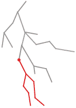
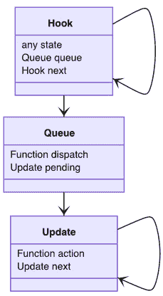
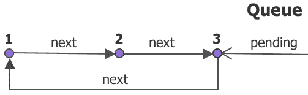
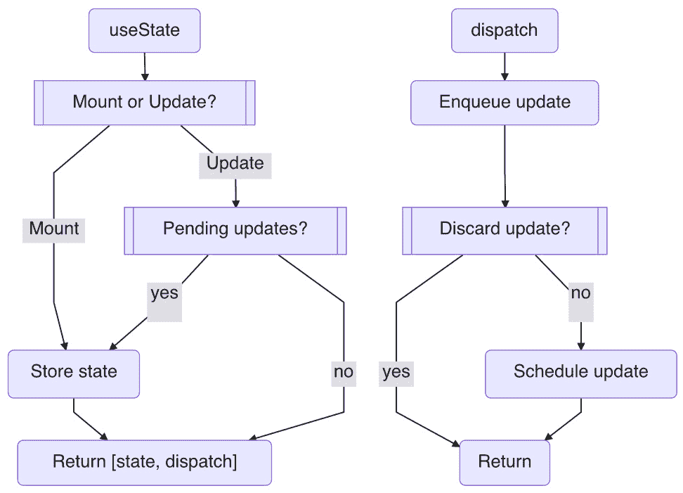

# *第四章*：使用状态启动组件

在上一章中，我们学习了*React*如何设计一个*hook*基础设施来提供函数组件的持久性。在本章中，我们将开始学习*React*中的内置钩子，从`useState`钩子开始。我们首先解释*状态*的概念在*React*中的使用，然后我们将遍历`useState`背后的数据结构和源代码，并描述一些更改状态的常见用例。我们将对`useState`进行测试，并在本章末尾提供两个将`useState`应用于`Avatar`和`Tooltip`组件的实际示例。

在本章中，我们将涵盖以下主题：

+   React 中的状态

+   `useState` 设计

+   分派状态

+   测试`useState`钩子

+   `useState` 示例

+   问题与答案

+   附录

# React 中的状态

到现在为止，你应该对什么是*状态*有一些了解。为了回顾，状态是存储在纤维中的一部分*内存*，在*第三章**，*Hooking into React*中引入的。当与*属性*结合时，状态可以确定性地表示一个*UI*屏幕。



Figure 4.1 – 包含源纤维的纤维树

例如，假设我们构建了一个网站，最终得到一个纤维树（如图*4.1*所示）。当用户进行操作（如点击）时，操作通过事件处理程序向纤维（如图*4.1*中的红色点）发送信号。我们称这个纤维为*源纤维*。

现在，假设派发的事件将计数器从`0`更改为`1`。*React*应根据此用户操作安排更新，并为屏幕准备所有**文档对象模型**(**DOM**)元素。假设红色线条是需要更改的纤维，React 如何找出这一点？

在收到此更新请求后，*React*从根开始遍历纤维树。相当多的纤维（显示为灰色线条）与此更新无关，因此它们是从上一场景克隆的。当更新到达源纤维时，让我们想象纤维携带一个函数组件并调用一个名为`updateFunctionComponent`的更新函数：

```js
let updatingFiber = ...
function updateFunctionComponent(Component, props) {
  let prevHook = null
  let children = Component(props)
  ...
  reconcileChildren(children)
  return updatingFiber.child
}
```

我们在*第三章*，*Hooking into React*中介绍了`updateFunctionComponent`函数的第一部分。该函数的第二部分接受`Component`函数返回的子元素，并通过`reconcileChildren`将它们转换为纤维。在过程结束时，第一个子纤维告诉引擎下一步要做什么。这会一直持续到访问源纤维下的所有纤维——即*Figure 4.1*中显示的红色区域。

通过这种方式，状态变化通过该分支传播到子纤维中。当一个父组件更新时，子组件在更新之前会得到一组新的 props，从而携带状态的影响。这就是状态在 React 生态系统中发挥作用的基本方式。现在，让我们深入探讨 React 是如何创建`useState`钩子来支持这种行为的。

# `useState`设计

React 提供了一个`useState`钩子来管理函数组件内的状态。以下代码示例展示了它的常见用法：

```js
const Title = () => {
  const [state, dispatch] = useState(initialState)
  const onClick = () => {
    dispatch(newState)
  }
  return <button onClick={onClick} />
}
```

`useState`函数接受一个`initialState`参数作为输入参数，并返回一个`state`对象和一个`dispatch`函数。`dispatch`函数可以用来请求将状态更改为`newState` *对象*。

你是否曾经好奇过 React 在幕后是如何设计`useState`钩子的？为什么它返回一个数组？我们如何知道新的分发是否成功？最重要的是，我们如何确保每次渲染的当前状态？

为了回答这些问题，我们将打开引擎并查看其内部结构。在我们深入研究其各种用途之前，我们将阅读源代码的简化版本，以获得有关此钩子架构的鸟瞰图。让我们首先从数据结构开始。

## `useState`数据结构

使`useState`工作所需的数据结构包括一个`Hook`类型、一个`Queue`类型以及一个`Update`类型，如图*4.2*所示：



图 4.2 – useState 钩子的数据结构

一个钩子使用一个`state`属性来存储状态，以及一个指向下一个钩子的`next`属性。我们已经在*第三章*，“React 中的钩子”中解释了这种架构。现在新的地方是，为了支持分发功能，添加了一个`queue`属性，其中它提供了一个`dispatch`函数来分发一个带有新状态的`action`对象。在队列中，一系列更新存储在一个名为`pending`的属性下。队列的职责是维护一个待处理的更新列表，以便于这个纤维——这样，用户就可以向纤维分发多个更新。

更新被定义为包含一个需要由用户提供的`action`函数，以计算下一个状态。每个更新通过一个名为`next`的属性链接到另一个更新，形成一个循环链表（见图 4.3）。链表类似于钩子的链接方式，除了更新是环形链接的，最后一个更新始终指向第一个更新。



图 4.3 – 钩子的队列及其待处理的更新

在前面的图中，队列中有三个更新，`pending property`指向最后一个，使`pending.next`指向列表的第一个更新。当我们需要在大脑或尾部插入或删除更新时，这个循环列表变得很有用。

现在我们已经看到了`useState`的数据结构，是时候查看源代码，看看这个数据结构是如何在实现中使用的。

`useState`的源代码以典型的*hook*方式结构化，它根据纤维是否处于`mount`或`update`状态（如*第三章*，*React 中的钩子*）来接受`mountState`或`updateState`路径：

```js
function useState(initialState) {
  if (isFiberMounting) {
    return mountState(initialState)
  } 
  else {
    return updateState(initialState)
  }
}
```

## 挂载状态

当一个组件处于`mount`状态时，`mountState`通过创建一个钩子来获取钩子：

```js
function mountState(initialState) { 
    const hook = mountHook ()
    if (typeof initialState === 'function') {
      initialState = intialState()
    }
    hook.state = initialState
    hook.queue = {
      pending: null 
      dispatch: dispatchAction.bind(
        null,
        updatingFiber,
        hook.queue
      )
    }
    return [hook.state, hook.queue.dispatch]  
}
```

然后，它开始执行钩子的初始化工作。根据提供的`initialState`对象的形式，它可以使用值或函数初始化钩子的`state`对象：

```js
    useState(1)        // a value
    useState(() => 1)  // a function
```

在初始化状态后，它创建一个空的`queue`对象，没有挂起的更新。此外，它设置一个`dispatch`函数并将其存储在`queue`对象下。让我们仔细看看这个函数，因为它是`useState`钩子的重要部分之一。

## 分发一个动作

`dispatch`函数被设计用来分发一个带有新状态的动作。它是通过一个实用函数`dispatchAction`创建的，该函数接受一个纤维、一个队列和一个动作。

在将`dispatchAction`函数分配给队列后，它将更新纤维和队列绑定在一起，这样`dispatch`函数就可以接受`action`对象作为唯一的输入参数：

```js
function dispatchAction(fiber, queue, action) {
  const update = {
    action
    next: null
  }

  const pending = queue.pending
  if (pending === null) {
    update.next = update
  } 
  else {
    update.next = pending.next
    pending.next = update
  }
  queue.pending = update

  // Appendix A: Skip dispatch
  scheduleUpdateOnFiber(fiber)
}
```

该函数从输入参数中获取一个`action`对象，然后创建一个新的`update`对象并将其追加到`queue`对象中。前面的与`pending`相关的代码都是列表操作，所有这些都将`update`对象追加到列表的末尾，同时确保队列继续形成一个循环链表，如图*4.3*所示。

一个`action`对象可以是值或函数更新器，正如`initialState`对象一样，因此在我们调用`dispatch`对象时支持这两种格式。以下是一个示例：

```js
    dispatch(1)         // a value
    dispatch(() => 1)   // a function
```

在队列更新后，它通过一个`scheduleUpdateOnFiber`函数请求更新，这个函数本质上会将*React*启动到我们在本章开头介绍的更新过程中。这是*React*处理用户动作的主要途径。

*React*在引擎内部有很多优化。其中一些不是公开可访问的，因为它们是引擎代码的一部分。例如，有一个隐藏的路径，可以在不调用`scheduleUpdateOnFiber`函数的情况下取消分发或整个更新。如果你感兴趣，你可以在本章末尾的*附录 A – 跳过分发*部分找到更多关于这个路径的信息。

## 更新状态

组件挂载后，下一次它被更新并到达`useState`钩子时，它会进入`updateState`并通过克隆一个钩子来获取：

```js
function updateState(initialState) {
    const hook = updateHook()
    const queue = hook.queue
    let updates = queue.pending
    queue.pending = null
    if (updates != null) {
      const first = updates.next
      let newState = hook.state
      let update = first
      do {
        const action = update.action
        newState = typeof action === 'function' 
          ? action(newState) : action
        update = update.next
      } 
      while (update !== null && update !== first)        
      if (!Object.is(newState, hook.state)) { … }      
      hook.state = newState 
    }
    return [hook.state, hook.queue.dispatch]  
}
```

一旦我们有了钩子，我们可以在`queue.pending`对象下检查它是否有任何挂起的更新。`pending`对象可以有更新，是因为`dispatch`函数已经被调用过。它通过第一个`pending.next`更新，并按照`update.next`更新的顺序迭代它们。对于每个更新，它都会取存储的`action`对象并将其应用于之前存储的状态，形成一个`newState`对象，最后将其存储回钩子中。

更新后的`newState`对象与之前的`state`对象进行比较，以确定是否发生变化：

```js
      // Appendix B - Bailing out an update
      if (!Object.is(newState, hook.state)) {
        didReceiveUpdate = true
      }
```

如果`newState`对象与之前的状态不同，*React*会设置一个`didReceiveUpdate`标志，指示更新纤维是否包含任何更改。*React*在这里使用全局标志的原因是，可以有很多其他钩子附加到这个纤维上，因此，它必须等待所有钩子处理完毕后，才能确定纤维是否应该更新或退出。如果您对退出过程的细节感兴趣，请参阅本章末尾的*附录 B – 退出更新*部分的路径。

## 返回钩子

对于`mountState`或`updateState`函数，返回`state`和`dispatch`函数：

```js
  return [hook.state, hook.queue.dispatch]  
```

它们以包含两个元素的数组形式返回。这里使用的数组格式很有趣，因为我们本可以使用另一种格式，例如具有键的对象：

```js
  return {
    state: hook.state,
    dispatch: hook.queue.dispatch
  }
```

之前的关键值设计同样可以工作。相反，*React*决定使用数组，因为这样做有一个优势——那就是我们不必记住键名来引用任何值。以下是一些演示这一点的例子：

```js
const [state, dispatch] = useState("")
const [count, setCount] = useState(0)
const [a, d] = useState(null)
```

如您所见，我们可以使用任何我们想要的名称来重命名`state`和`dispatch`函数，只要它在当时逻辑上合适即可。这在实际操作中非常方便。

总的来说，`state`和`dispatch`函数直接映射到底层钩子的`state`对象和`queue.dispatch`函数。如果状态没有变化，它返回之前的状态。`dispatch`函数在挂载期间创建，并保持所有未来更新的相同函数实例。

## useState 的流程解析

我们刚刚已经走过了`useState`钩子的所有代码。为了让您感觉更好，*React*包含的代码量是我们所展示的代码量的五倍。使用简化版，它很容易理解与它设计解决的问题相关的关键工作流程以及它采取的方法。让我们看看*图 4.4*中的工作流程草图。



图 4.4 – useState 钩子工作流程

让我们来解释一下我们在 *图 4.4* 中看到的内容。在更新过程中，当调用 `useState` 钩子时，它首先检查是否处于 `mount` 或 `update` 状态。如果是 `mount` 状态，它将存储 `initialState`，创建一个 `dispatch` 函数，然后返回。如果是 `update` 状态，它将检查任何 `pending` 更新并将它们应用到新的 `state` 上。在两种情况下，都返回 `[state, dispatch]`。

当调用 `dispatch` 函数时，它会创建一个带有提供的 `action` 对象的更新并将其附加到 `pending` 更新中。然后，将请求新的更新安排到 *React*。

重要的是要注意，新的更新是分配 `state` 对象的地方。`dispatch` 函数的目的是仅请求更改，但 *真正的更改不会在下一个更新中应用*。

既然我们已经了解了 `useState` 背后的设计，我们就可以在下一节讨论如何一般性地分发状态。

# 分发状态

在本章中，我们了解到由 `useState` 钩子提供的 `dispatch` 函数允许我们在想要更改状态时进行请求。表示动作的输入参数可以是字符串、数字、对象、数组或任何 *JavaScript* 表达式：

```js
  dispatch(state)
  dispatch({ state })
  dispatch([ state ])
  dispatch(null)
```

我们知道，内部输入参数也支持函数式更新格式：

```js
  dispatch(state => state + 1)
```

在这里使用函数式更新格式的优点是，它有机会在向下一个状态移动之前读取前一个状态。如果你构建的新状态需要旧状态，这有时会很有用。

如果更改，在最终调用之前会将分发的状态与当前状态进行比较。这意味着并非所有分发的最终结果都会导致状态改变。以下代码可以作为例子：

```js
const [state, dispatch] = useState(1)
const onClick = () => { dispatch(3) }
```

如果状态以数字 `1` 开始，我们可以在第一次点击时将状态更改为 `3`。对于后续的点击，由于它已经是 `3`，因此无法将数字更改为 `3`。因此，在多次点击后，所做的更改是 `1, 3`，而不是 `1, 3, 3, …` – 无论用户点击多少次。让我们详细看看这种比较是如何进行的。

## 比较状态

我们之前提到，*React* 在比较两个状态时始终使用 `Object.is` 函数。这是一个 *JavaScript* 原生函数，与 *JavaScript* 严格相等运算符 (`===`) 非常相似，用于确定两个值是否相同。

对于原始类型，例如数字或字符串，这种比较是直接的：

```js
1 === 1                 true
"Hello" === "World"     false
false === true          false
```

理解比较数字 `1` 和 `1` 应返回 `true` 以及比较两个字符串 `Hello` 和 `World` 应返回 `false` 并不难。

*JavaScript* 有七个原始数据类型：字符串、数字、BigInt、布尔值、undefined、symbol 和 null。这些数据类型 *一旦在内存中创建后就不能更改*：

```js
null === null           true
undefined === undefined true
```

*原始比较* 是我们通常理解为 *按值比较* 的一种。

对于*JavaScript*中的非原始类型，例如对象或数组，使用引用（也称为指针）来指向特定的内存空间：

```js
{} === {}               false
v === v                 true
```

这意味着如果你分配了两个新的对象，它们不能指向相同的内存空间。因此，比较两个对象`{}`和`{}`应该返回`false`，即使它们包含完全相同的*内容*。相比之下，比较相同的对象（例如，`v`和`v`）应该返回`true`，无论对象的内容如何变化。让我们通过一个例子来更好地理解这一点：

```js
const [v, dispatch] = useState({})
const onClick = () => {
  v.abc = 3
  dispatch(v)
}
```

你能猜到之前的派遣在用户点击时是否做了什么吗？答案是*没有*。从`Object.is`函数的角度来看，改变一个对象的内容并不算作变化，因为`v`变量仍然指向相同的内存位置，即使其中一个属性已经改变。

在这种情况下，唯一引起变化的方法是派遣一个指向不同内存空间的状态，我们可以通过创建一个新的来做到这一点：

```js
const [v, dispatch] = useState({})
const onClick = () => {
  dispatch({ ...v, abc: 3 })
}
```

通过 JavaScript 的`{ ...v }`帮助创建一个新的对象，同时将`abc`属性更改为`3`，克隆`v`的内容。对于对学习更多关于*JavaScript* *ES6* *语法*感兴趣的读者，请参阅*第十章*的*JavaScript ES6*部分，*使用 React 构建网站*。

适应使用`Object.is`函数或严格相等运算符（`===`）可能需要一些时间。你可以问自己一个简单的问题：*要比较的值是否可变？* 如果是，它通过*引用*进行比较。如果不是，它通过*值*进行比较。

在*React*中，如果你无法管理值的变化，你就不能正确地派遣变化。因此，理解`object.is`非常重要，因为它被广泛用于所有钩子值比较，正如你在本书的其余部分将看到的那样。

## 多次派遣

当我们在一个事件处理器内部执行多次派遣时，会出现一个有趣的情况。在*React*中，连续的多次派遣被设计成一起处理，如下面的例子所示：

```js
const [state, dispatch] = useState(1)
const onClick = () => {
  dispatch(3)
  ...
  dispatch(5)
}
```

当用户点击时，如果我们两次调用派遣（P-Code）函数，最终只会引起一个变化，因为每次派遣都会将一个更新添加到队列中。当我们达到下一次更新时，队列中所有注册的动作都会被迭代以形成一个单一的新状态。在我们的例子中，状态从`1`变为`5`，跳过了`3`。但为什么两个派遣只触发一个更新？难道每个派遣没有调用`scheduleUpdateOnFiber`函数吗？

每次派遣都会调用`scheduleUpdateOnFiber`来启动*React*的更新过程。然而，这个函数被设计成这样的方式，它在做出最终更新之前会等待来自同一动作的所有派遣。因此，使用这个功能，多个派遣可以被合并为一个更新操作，作为一个延迟执行。

这个好处是，你可以像写赋值语句一样轻松地写一个`dispatch`语句，而不必担心它可能会给 DOM 带来不必要的操作。这不仅在实际使用中很方便，而且使更新非常高效。

现在我们已经了解了`dispatch`函数，我们可以开始使用`useState`钩子。

# 测试驱动 useState 钩子

状态是*React*中驱动用户交互的最常见技术之一。让我们考虑一个带有按钮的组件。每次我们点击按钮时，它都会增加一个数字并将其附加到`Hello World`字符串上（见图*图 4.5*）。


图 4.5 – Hello World 计数器

我们可以在`Title`组件中捕获这种行为：

```js
const Title = () => {
  let [count, setCount] = useState(0)

  const onClick = () => {
    setCount(count + 1)
  }

  return (
    <>
      <button onClick={onClick}>+</button>
      <h1>Hello World+{count}</h1>
    </>
  )
}
```

在这里，我们使用`[count, setCount]`来跟踪`count`状态。然后，我们在页面的`h1`元素中显示`count`，并在`button`元素的点击处理程序中调用`setCount`。每次点击按钮时，它应该增加`count`值。

为了确认底层发生了什么，让我们在两个位置添加`console.log`：

```js
function Title() {
  let [count, setCount] = useState(0)

  const onClick = () => {
    setCount(count + 1)
    console.log('clicked', count)   ➀
  }

  console.log('rendered', count)    ➁
  return ...
 }
```

第一个放在`setCount`之后，以确认每次`dispatch`后的`count`值。第二个放在`return`语句之前，以便我们可以确认更新何时到达以及在那个更新中`count`值是多少。它们标记为`➀`和`➁`：

```js
|-----0-----1------2-----> clicked  ➀
0-----1-----2------3-----> updated  ➁
```

从`➁`版本的`updated`系列开始，数字从`➀`版本的`clicked`系列增加`1`。在挂载期间，`count`值从`0`开始，每次点击后，它都会快速更新到一个新的带有更新数字的状态，如图*图 4.6*所示。

`➀`版本的`clicked`系列确认在`dispatch`之后，`count`值不会更新到新的`count + 1`值。相反，它继续保留在定义`onClick`对象的更新中的当前状态。


图 4.6 – Hello World 计数器

太好了！这就是我们通常使用`useState`的方式。让我们看看`useState`的另一个流行用法，即在父组件中安装它并允许子组件驱动它。

## 让孩子开车

从父组件向子组件发送`dispatch`函数并期望子组件从父组件请求状态变化是非常常见的：

```js
const App = () => {
  const [count, setCount] = useState(0)
  const onClick = () => {
    console.log('clicked', count)   ➀
    setCount(count + 1)
  }
  console.log('rendered', count)    ➁  
  return <Title onClick={onClick} />
}
const Title = ({ onClick }) => {
  return <button onClick={onClick}>+</button>
}
```

在前面的例子中，`Title`组件有一个按钮，当它被点击时，它会改变`App`组件中的`count`状态。我们将设置两个`console.log`语句来确认更新：

```js
|-----0-----1------2-----> clicked  ➀
0-----1-----2------3-----> updated  ➁
```

它按预期工作 – 点击来自子组件，但其他一切与上一个例子相同。基本上，我们已经赋予了子组件改变在父级创建的`count`值的能力。

这实际上非常方便。它告诉我们，无论我们在哪里定义状态，如果其子组件（或孙组件）需要它，它都可以通过 prop 访问它。这包括状态和改变状态的能力。这是在 *React* 中使用状态的最有效策略之一，我们称之为 *提升*。

## 向父组件提升

由于其设计，*React* 不允许直接将信息发送到元素。相反，所需的机制是使用一个 *prop*，将信息从父组件传递到子组件，然后到子组件的子组件，依此类推。

另一方面，为了在两个子组件之间共享信息，信息需要首先对父组件可用，然后再发送给每个子组件：

```js
const App = () => {
  return (
    <>
      <Title />
      <Content />
    </>
  )
}
const Title = () => {
  const [count, setCount] = useState(0)
  return <button>+</button>
}
const Content = () => {
  return ...
}
```

在前面的设置中，我们有一个父组件 `App`，渲染两个子组件 `Title` 和 `Content`。安装到 `Title` 对象中的 `count` 对象不能被其兄弟组件 `Content` 或其父组件 `App` 访问。因此，为了使 `count` 对象可访问，我们需要将 `count` 对象移到 `App`：

```js
const App = () => {
  const [count, setCount] = useState(0)
  const onClick = () => {
    setCount(count + 1)
  }  
  return (
    <>
      <Title onClick={onClick} />
      <Content count={count} />
    </>
  )
}
```

在前面的代码中，`useState` 在 `App` 中声明，因此我们可以将 `onClick` 对象发送到 `Title`，并将 `count` 对象发送到 `Content`。因此，我们可以通过 *提升* 这些东西到父组件来允许与兄弟组件共享东西。这突出了 *React* 设计的一个重要方面：*如果你的父组件有它，你也可以有它*。这是我们设计 *React* 应用时最基本和最有效的行为之一。

重要提示

如果你是一个 *React* 初学者，你应该尽可能多地尝试使用 props。它们不仅易于理解，而且也是确保一切连接正确的途径。

现在我们已经对 `useState` 钩子进行了测试，让我们看看更多实际应用如何使用 `useState` 来驱动 *UI* 行为。

# useState 示例

在本节中，我们将探讨两个示例，展示 `useState` 钩子在实践中的应用。

## 创建头像组件

假设你想显示从互联网上获取的人物的图片。大多数情况下，它将是一张好图片（见 *Figure 4.7*）。但有时，由于网络或权限问题，图片可能无法下载。当这种情况发生时，浏览器会抛出一个损坏的图标（*Figure 4.7* 中中间的标志），看起来并不那么美观。最新的用户体验研究显示，如果我们用更独特的东西（如 *Figure 4.7* 右侧所示的用户名或首字母）替换任何损坏的图像图标，这将提高用户体验。


Figure 4.7 – 使用 useState 的头像组件

为了在图像和文本之间切换，我们可以使用 `useState` 来定义一个条件。我们还需要一个事件处理器来通知我们当图像 URL 损坏时。如果我们把这些逻辑组合起来，我们得到一个 `Avatar` 组件：

```js
const Avatar = ({ src, username }) => {
  const [error, setError] = useState(false)
  const onError = () => { setError(true) }
  return (
    <AvatarStyle>
      {error ? (
        <div>{username}</div>
      ) : (
        
      )}
    </AvatarStyle>
  )
}
```

在前面的代码中，首先，我们使用`useState`定义了一个状态，`error`，并将其初始状态设置为`false`，假设在加载图像之前没有错误发生。

在组件的`return`中，它遵循以下简单逻辑：

```js
  { error ? A : B }
```

如果`error`为`true`，它将显示`A`。否则，它将显示`B`。在我们的例子中，`A`将返回用户的首字母，而`B`将返回一个图像。因此，它最初显示图像。如果图像成功加载，任务就完成了。然而，如果图像加载失败，它将触发一个`onError`事件处理程序。在`onError`事件处理程序中，它将发送一个指令将`error`标志翻转为`true`。在下一次更新中，随着`error`标志变为`true`，它将显示用户的首字母。所以，任务完成了——太棒了！

为了便于使用，`Avatar`组件由两个属性构建，`src`和`username`，其中第一个属性是图像 URL，第二个属性是用户名字符串。以下是代码的示例：

```js
const LOGO = 'https://gravatar.com/avatar/7aa1ac6'
const App = () => {
  return <Avatar src={LOGO} username="F" />
}
```

游戏场 – 头像组件

欢迎在线尝试这个示例：[`codepen.io/windmaomao/pen/VwzaqEo`](https://codepen.io/windmaomao/pen/VwzaqEo)。

`AvatarStyle`组件是一个样式组件，它允许我们在组件内部编写 CSS。如果你对这种方法感兴趣，请参阅*第十章*中的*采用 CSS-in-JS 方法*部分，*使用 React 构建网站*，以获取更多详细信息。

## 创建自定义提示组件

这里是使用`useState`的另一个示例。假设你有一个头像（你可以从上一个示例中借用），当鼠标悬停在它上面时，你希望看到一些提示文本（如图*图 4.8*所示）。这必须是一个自定义提示，因为我们希望它允许自定义边框、颜色、字体，甚至包括段落。浏览器的内置提示不会在`title`属性中提供这些选项。


图 4.8 – 使用 useState 的自定义提示组件

为了支持这个弹出效果，我们可以使用`useState`设置一个布尔状态来指示鼠标是否悬停在头像区域上。我们还需要两个事件处理程序来监控鼠标进入或离开头像区域。我们可以将这个逻辑放入一个`Tooltip`组件中：

```js
const Tooltip = ({ children, tooltip }) => {
  const [entered, setEntered] = useState(false)
  return (
    <TooltipStyle>
      <div
        onMouseEnter={() => { setEntered(true) }}
        onMouseLeave={() => { setEntered(false) }}
      >
        {children}
      </div>
      {entered && (
        <div className="__tooltip">
          {tooltip}
        </div>
      )}
    </TooltipStyle>
  )
}
```

我们定义了一个状态，`entered`，并将其初始值设置为`false`（因为我们第一次看到这个组件时，提示不会可见）。我们将`setEntered`连接到`onMouseEnter`和`onMouseLeave`事件处理程序以翻转状态。

注意，这次我们没有使用`?`运算符进行提示的条件显示，而是使用了`&&`运算符：

```js
{ entered && A }
```

这是因为在`Tooltip`中没有`B`。根据鼠标是否在正确区域，`A`将被显示或隐藏。因此，`&&`运算符充当短路——如果条件不满足，它将跳过下一个语句。

`Tooltip`组件接受`children`和`tooltip`作为属性，这允许它托管任何组件作为`Avatar`对象，以及任何组件作为提示内容，如下面的代码所示：

```js
const TooltipBox = <div>Account</div>
const Title = () => {
  return (
    <Tooltip tooltip={<TooltipBox />}>
      <Avatar>
    </Tooltip>
  )
}
```

在前面的代码块中，我们定义了一个自定义的`TooltipBox`组件，通过`tooltip`属性传入`Tooltip`组件。

操场 - 提示组件

你可以自由地在这个示例上在线玩耍：[`codepen.io/windmaomao/pen/qBXZvKV`](https://codepen.io/windmaomao/pen/qBXZvKV)。

这是`Tooltip`组件的最好部分。它不仅仅被设计为一个满足单一用例需求的组件——相反，它被设计为一个机制，允许你构建灵活的提示行为。

使用`useState`，我们可以定制我们的函数组件成为有状态的引擎，使得处理各种用户交互成为可能。

# 摘要

在本章中，你学习了在*React*中*状态*的概念。你深入了解了`useState`的设计，它分为挂载状态和更新状态。我们学习了各种分发状态的方法以及确定状态是否改变的方法。然后，我们还了解到分发可以支持值格式或函数更新器格式，并且我们了解到我们可以在一个事件处理器中多次分发。然后，我们测试了`useState`，学习了如何通过属性将状态变化发送到子组件。我们还学习了一种称为*提升*的常见技术，它涉及将状态提升到父组件。最后但同样重要的是，我们设计了两个组件——头像组件和提示组件——来学习如何在组件设计中应用`useState`。

在下一章中，我们将探索*React*家族中的第二个钩子。我们还将看到*React*如何定义一个称为**effect**的动作，并允许你在状态变化后调用它。

# 问题和答案

这里有一些问题和答案来刷新你的知识：

1.  什么是`useState`？

    `useState`钩子是*React*中的一个内置钩子，它允许你在函数组件中定义状态并分发一个动作来改变它。

1.  `useState`最常用的用途是什么？

    `useState`钩子可能是*React*钩子家族中最常见的钩子。无论何时你需要一个变量来改变*UI*元素，你通常都可以求助于`useState`来完成这个任务。触摸小部件、点击点赞按钮、悬停在图标上、切换复选框等等，都可以使用`useState`来实现。

# 附录

## 附录 A - 跳过分发

我们说并非所有分发的状态都会导致变化。但实际上，并非所有分发都会导致成功的分发。当鼠标点击时，它会进入`dispatch`函数。它有一个特殊的路径，当你满足那个条件并发现没有状态变化时，它可以提前返回而不执行分发：

```js
function dispatchAction(fiber, queue, action) {
  ...

  if (NoWorkUnderFiber) {
    const currentState = queue.lastRenderedState
    const newState = typeof action === 'function' 
      ? action(currentState) : action
    if (Object.is(newState, currentState)) {
      return
    }
  }
  scheduleUpdateOnFiber(fiber)
}
```

在前面的`dispatchAction`函数中，当它检测到纤维下目前没有工作时要计算一个新的状态。它计算`newState`值的方式与`updateState`函数中的计算方式类似，只是这里只处理一个`action`对象。基本上，它询问这个动作是否导致从最后更新的状态中发生状态变化。

如果最终结果显示没有任何变化，它将不带更新返回，假装什么都没发生。这导致没有任何*UI*更新。这个路径很重要，因为它可能会非常频繁地发生（例如，当用户反复执行相同的操作而没有任何状态变化时）。

## 附录 B – 回退更新

对于任何已经更新的纤维，都会有一个集体标志被添加到它上面，称为`didReceiveUpdate`，它表示纤维是否发生了变化。在开始对纤维进行工作之后，任何导致变化的钩子都可以将这个标志设置为`true`。之后，如果工作完成且标志仍然是`false`，这意味着纤维绝对没有任何变化，所以*React*通过从上一个场景克隆它来回退纤维，然后继续处理下一个纤维：

```js
let updatingFiber = ...
function updateFunctionComponent(Component, props) {
  let prevHook = null
  let didReceiveUpdate = false  
  let children = Component(props)  
  if (!isFiberMounting && !didReceiveUpdate) {
    return bailout(updatingFiber)
  }
  ...
}
```

在前面的`updateFunctionComponent`函数中，在调用`Component`函数之后，它检查两个标志。一个是`isFiberMounting`，因为在站点处于挂载状态时，由于所有纤维仍然需要创建，所以无法进行回退。另一个标志是`didReceiveUpdate`。当这两个标志都为假时，它将触发纤维的回退。

它通过从当前树中克隆子纤维来回退纤维，这反过来又携带了所有完成的工作，包括旧的属性和渲染的*DOM*。基本上，通过回退，它不需要执行常规的协调工作来找出新的子纤维。而且更好，如果发现这个纤维的子纤维下没有工作，整个分支都会回退。这对应于*图 4.1*中的所有灰色线条。
