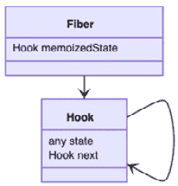
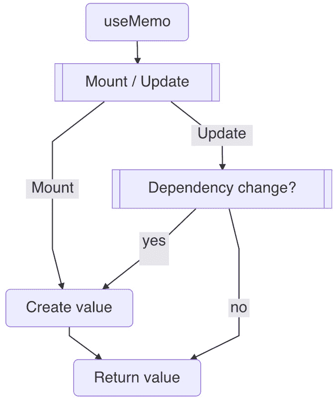
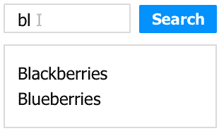
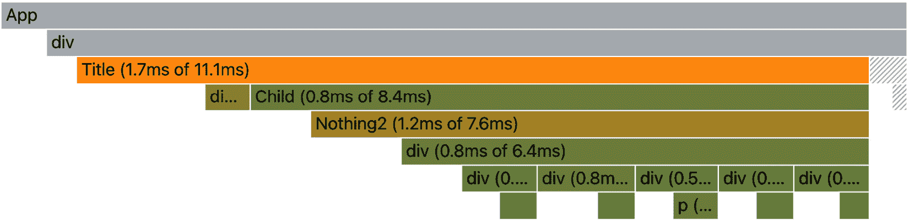
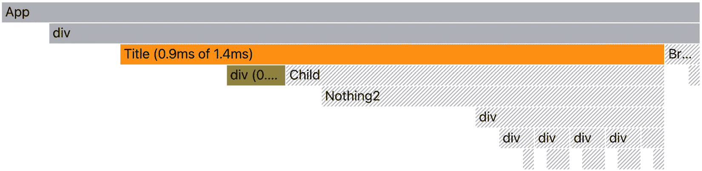

# 第六章：使用 Memo 提升性能

在上一章中，我们学习了`useEffect`钩子的设计和如何使用它来管理*React*中的副作用。在本章中，我们将转向一个优化主题，用于重用最后的赋值。我们首先介绍我们如何在典型的 Web 应用程序中遇到性能下降。然后，我们将详细介绍`useMemo`的设计和源代码，并描述各种条件重用值的多种方式。接着，我们将优化技术应用于两个常见案例：点击搜索和搜索防抖。最后，本章还包括附录部分的两个附加主题，*非经典记忆*和*跳过子组件更新*。

在本章中，我们将涵盖以下主要主题：

+   性能下降

+   理解`useMemo`的设计

+   重用最后的赋值

+   测试驱动`useMemo`

+   `useMemo`示例

+   问答

+   附录

# 性能下降

当我们构建一个网站时，我们通常从一个草案或原型版本开始，其中包含一些页面，这些页面使用示例数据和初步逻辑进行布局。目的是从小处着手，看看网站是否有增长潜力。虽然这是一个非常常见的做法，但有趣的是，大多数与性能相关的问题在这个阶段并没有显现出来。当具有真实业务逻辑的网站开始增长时，我们开始体验到性能下降的问题。了解这些问题最初是如何产生的非常有价值，因为它有助于我们规划网站的扩展。

让我们从零开始构建这样一个案例。一个在函数组件体内定义的变量在其被调用时会被评估：

```js
const Title = ({ text }) => {
  const a = 1
  ...
}
```

在前面的代码中，`a`变量被赋值为一个`1`常量。当`text`属性每次变化时，存储这样的数字不应该花费我们太多，因为`a`每次都会被重新赋值。但如果我们需要计算一些重量级的操作，比如在一个大数组中匹配文本呢？

```js
const Title = ({ text }) => {
  const found = matchTextInArray(text)
  ...
}
```

假设前面的`matchTextInArray`函数平均需要 200 *毫秒*来完成，这有点昂贵。我们可以争辩说，只有当`text`发生变化时，`found`变量才会被赋值，所以如果`text`不经常变化，我们不必担心`found`会频繁赋值。让我们对此进行一些思考。

函数组件可以因各种原因被调用。在*React*中，函数组件的更新主要是由状态变化触发的。然而，状态可能来自`Title`组件内部或来自`Title`组件的父组件（或祖父组件）。因此，我们不能仅仅通过观察组件来假设组件的更新频率。

想象一下，如果用户决定刷新页面；它应该导致此页面的所有组件更新。从某种意义上说，组件只能确定哪些内容需要更新，但不能完全决定何时更新。换句话说，当涉及到更新时，组件也依赖于其父组件的行为。

让我们看看以下示例：

```js
const Title = ({ text, flag }) => {
  const found = matchTextInArray(text)
  ...
}
```

在前面的代码中，`Title` 组件获得了一个额外的 `flag` 属性。因此，每当 `flag` 属性翻转时，它就会渲染并花费 200 毫秒来计算 `a`。你可以想象这个标志就像是一个来自父组件的用户投票按钮。

如果用户持续点击按钮，多个 200 毫秒可以迅速累积成为一秒或两秒，应用程序的性能现在直接与用户翻旗的速度挂钩。当这种情况发生时，用游戏术语来说，它会导致延迟，或者帧率下降。用户应该开始感觉到响应延迟，并失去使用网站的信心。

当这种情况发生在游戏中时，我们该怎么办？嗯，那正是玩家需要升级他们的游戏硬件的时候。但这也可能是开发者利用优化机会的时候。

## 重复使用之前的赋值

那么，在性能下降的情况下，我们该怎么办？让我们看看当前时间线之后我们有什么。当 `flag` 或 `text` 属性发生变化时，`found` 变量会得到一个新的赋值：

```js
|----TFTF--------TF------> flag flip
----------a---------b----> text change
c----cccc-c------cc-c----> new assignment
```

所以，在我们的情况下，我们想要承认的是，`matchTextInArray` 并不依赖于 `flag`，因为该函数除了 `text` 之外没有其他输入参数。

为什么我们想在之前的赋值仍然有效时执行新的赋值？当 `flag` 属性变化时，我们能否跳过赋值？

我们在 *第五章*，*使用 Effect 处理副作用* 中了解到，效果可以用来监听值的变化。在我们的情况下，我们能否监听 `text` 属性的变化，在忽略其他值的同时进行赋值？让我们试一试：

```js
const Title = ({ text, flag }) => {
  const [found, setFound] = useState("")
  useEffect(() => {
    setFound(matchTextInArray(text))
  }, [text])
  ...
}
```

在前面的代码中，我们使用 `useEffect` 的依赖数组来对 `text` 变化做出反应，并在 `matchTextInArray` 之后更新 `found` 状态。这可以通过以下时间线草图得到证实：

```js
|----TFTF--------TF------> flag flip
----------a---------b----> text change
-c---------c---------c---> new assignment
```

这个解决方案直接可用。标志来回翻转很多次（六次），但由于文本变化，我们只有三次新的赋值。因此，赋值并不依赖于翻转。这真是太好了，因为我们成功地克服了潜在的性能下降。

虽然这个解决方案是可行的，但我们希望对其进行改进，因为它使用副作用来处理赋值，而我们看到这个赋值不必是一个副作用。由于副作用在更新后收集，它必须等待下一次更新。这意味着赋值的行为与直接赋值，如 `a = 1`，非常不同。最后但同样重要的是，使用 `found` 状态来保存赋值值，而这个值不必是一个状态。如果能解决所有这些问题就更好了。

*React* 添加了一个 `useMemo` 钩子来做到这一点，而不需要其他障碍。钩子的任务是允许我们在更新中重用之前的赋值。让我们首先看看 `useMemo` 的设计。

# 理解`useMemo`的设计

React 提供了一个`useMemo`钩子，通过一个函数支持值赋值，该函数可以返回新值或从上一个更新返回旧值：

```js
const Title = () => {
  const label = useMemo(() => {
    return "Hello World"
  }, [])
}
```

`useMemo`函数将其第一个输入参数作为`create`函数。如果被调用，该函数返回一个新值。第二个参数是`deps`依赖数组，类似于`useEffect`中的`deps`。在前面的例子中，`"Hello World"`在挂载后只被分配给`label`变量一次。

除了基本的钩子支持外，不需要额外的数据结构来支持`useMemo`，如图 6.1 所示：



图 6.1 – useMemo 的数据结构

钩子的状态在更新之间持续存在，每个钩子函数都必须定义它想要持久化什么（或以何种格式）。例如，`useState`钩子存储状态数组，`useEffect`钩子存储效果对象，现在`useMemo`钩子存储与赋值相关的内容。实际上，`useMemo`采用分配值和依赖数组的格式作为`[value, deps]`。

`useMemo`的源代码在典型的钩子设置中以`mountMemo`和`updateMemo`的形式组织，这取决于纤维是否处于挂载状态或通过`isFiberMounting`标志进行更新，如第三章中所述，*Hooking into React*：

```js
function useMemo(create, deps) {
  if (isFiberMounting) {
    return mountMemo(create, deps)
  } else {
    return updateMemo(create, deps)
  }
}
```

`useMemo`钩子接受`create`赋值函数和`deps`依赖数组作为输入。`name`、`create`表示它在被调用时创建一个新值。

当处于挂载状态时，它首先通过创建一个来获取钩子对象：

```js
function mountMemo(create, deps) {
  const hook = mountHook()
  const value = create()
  hook.state = [value, deps]
  return value
}
```

如果没有提供`deps`，则默认转换为`null`，并通过调用`create`赋值函数来存储初始值。在返回值之前，初始值及其依赖都通过数组存储在钩子下的`state`属性中。

当处于更新状态时，它通过克隆一个来获取钩子：

```js
function updateMemo(create, deps) {
  const hook = updateHook()
  const prevState = hook.state
  if (prevState !== null) {
    if (deps !== null) {
      const prevDeps = prevState[1]
      if (areDepsEqual(ndeps, prevDeps)) {
        return prevState[0]
      }
    }
  }
  const value = create()
  hook.state = [value, deps]
  return value
}
```

一旦我们有了钩子，它就从钩子的`state`中获取`prevState`，这是一个包含上一个值和上一个依赖数组的数组。

它通过`areDepsEqual`检查依赖是否已更改。如果没有变化，它将简单地返回上一个值。如果有变化，它将再次调用`create`赋值函数以更新到新`value`。在我们返回值之前，值和依赖都存储在钩子的`state`中。以下是`useMemo`工作流程的总结：



图 6.2 – useMemo 工作流程

与 `useState` 和 `useEffect` 相比，`useMemo` 非常直接。它不涉及任何分发或效果。相反，你可以将其视为一个特殊的赋值语句。当满足 `deps` 依赖项时，它就会创建一个值并将其作为当前值返回。在所有情况下，都会返回当前值。因此，更准确地说，*在所有情况下都会进行赋值；当条件不满足时，会重用旧值*。

既然我们已经了解了 `useMemo` 的设计，现在就让我们带你了解这个特殊赋值可以做到的所有场景。

# 重用最后一个赋值

重用值和记住值有时会指相似的行为。然而，值得注意的是，`useMemo` 钩子只能记住过去的一个值，即最后一个值。

默认情况下，单个 *JavaScript* 变量具有一个作用，除非被新的赋值覆盖，否则它将保留之前分配的值。因此，在阅读“memo”这个词时要小心。如果你将“memo”视为单个值而不是记住所有值，那么它可以帮助你正确地可视化它，就像 *React* 设计的那样。如果你对经典记忆感兴趣，请查看本章末尾的 *附录 A – 非经典记忆* 部分。

`useMemo` 如何重用之前的赋值是由 `deps` 依赖项数组控制的，它使用 `areDepsEqual` 工具函数来比较前一次和当前更新之间的两个依赖项数组。我们已经在 *第五章* 中考察了这个函数，*使用 Effect 处理副作用*。在这里我们将跳过源代码，直接进入与每个依赖项数组配置相对应的场景。

同样，这里也有三种情况：无依赖项、空依赖项和某些依赖项：

+   没有提供依赖项的 `useMemo` 不常见，但很容易看到 `useMemo` 钩子语句和直接赋值可以非常快速地相互替换，因为它们在 `...` 中共享赋值语句。

+   提供了 `deps` 数组但没有元素，这意味着值不依赖于任何东西。因此，值在挂载后只创建一次：

    ```js
      const v = useMemo(() => {...}, [])
    ```

    如果你想要在所有更新中保持一个静态值，这是一个很好的用途。你可能会想知道为什么我们不能在组件外部声明静态值。这是因为赋值仍然可以使用组件内部的变量。

+   `useMemo`。当 `deps` 的元素不为空时，它会比较前一次和下一次依赖项之间的每个元素，以确定是否有变化：

    ```js
      const v = useMemo(() => {...}, [a, b])
    ```

    如果任何元素发生变化，值将被重新赋值。

有一个需要注意的事项 – 在所有提到的情况下，都会为所有更新执行赋值。尽管有时赋值似乎被跳过了，但我们的真正意思是赋值是从上次满足条件时重用的。

## 赋值值类型

从赋值返回的值类型可以是任何格式——字符串、数字、对象，甚至是函数。这使得 `useMemo` 在满足所有需要重用值的场景时更加灵活：

```js
  const a = useMemo(() => {
    return b + 3
  }, [b])
```

以下 `useMemo` 的使用给 `b` 加上 `3` 并将结果赋值给 `a`，当 `b` 发生变化时。同样，我们也可以构建一个使用对象的用法：

```js
  const obj = useMemo(() => {
    return { name }
  }, [name])
```

在前面的使用中，当 `name` 发生变化时，一个具有 `name` 属性的对象被赋值给 `obj`。我们甚至可以构建一个函数的用法：

```js
  const fn = useMemo(() => {
    return () => {
      return 1
    }
  }, [])
```

在前面的代码中，我们构建了一个赋值，在挂载后创建了一个函数实例。为了使事情更容易理解，我们可以将 `useMemo` 取出，看看原始赋值是什么：

```js
  const fn = () => { return 1 }
```

当 `useMemo` 应用于非原始值，如对象、数组或函数时，有一些微妙之处。在创建这些值时，你会得到一个指向新内存空间的新值。这意味着当依赖条件不满足时，将使用旧内存空间。

总的来说，`useMemo` 钩子可以用作特殊的赋值来返回任何类型的值。

## 跳过更新的神话

我们可能都会从“memo”这个词的使用中想到，也许 `useMemo` 可以帮助我们跳过更新：

```js
const Title = () => {
  const a = useMemo(() => { ... }, [])
  return <Child a={a} />
}
```

在前面的代码中，由于 `a` 变量在挂载后没有获得新值，可能 `Child` 组件也没有收到任何新的更新。不幸的是，情况并非如此。

这个问题的答案可以追溯到是什么让 *React* 中的更新发生。我们在本章开头提到，`Title` 组件或其父组件的状态变化可以触发新的更新，但 `a` 变量不是一个状态，也没有人为更新这个值进行分发。

在某种程度上，`useMemo` 钩子与更新没有直接关系。它没有像 `useState` 或 `useEffect` 那样直接挂钩到更新的功能。事实上，`useMemo` 除了条件赋值之外，没有做任何其他的事情。

基于属性变化跳过更新可以使用 `React` 提供的 `memo` 函数来完成。`memo` 和 `useMemo` 是两回事；我们在这本书中不讨论 `memo`。如果你真的想用 `useMemo` 钩子跳过更新，我们在本章末尾的 *附录 B – 跳过子组件更新* 部分提供了一个特殊的用法。

现在我们已经知道了 `useMemo` 是什么以及它能做什么，不能做什么，让我们来试驾一下。

# 测试 `useMemo`

让我们通过改进本章开头看到的 `useMemo` 钩子示例来获得一些性能提升：

```js
const Title = ({ text, flag }) => {
  const found = useMemo(() => {
    console.log('created')         ➀
    return matchTextInArray(text))
  }, [text])  
  console.log('updated', found)    ➁
  ...
}
```

以下代码用 `useMemo` 替换了 `useState` 和 `useEffect`。让我们看看时间线，看看它带来了什么变化：

```js
|----TFTF--------TF------> flag
----------a---------b----> text
R----RRRR-R---------R----> updated ➁
c---------c---------c----> created ➀
```

当 `text` 发生变化时，在 `"created"` 序列中创建了一个新值，与 `flag` 的翻转无关。这次甚至更好，因为现在在分配 `found` 值和接收 `text` 变化之间没有延迟，因为这是一个在同一更新下的直接赋值。

重要的一点是，无论是否有 `useMemo`，都没有引入大的代码结构变化来解决性能问题。事实上，要切换回非优化版本，我们可以省略依赖项，或者简单地通过一行或两行代码移除 `useMemo` 的使用。

好的，我们现在已经看到了如何使用 `useMemo` 钩子。接下来，让我们看看两个例子，展示我们如何将其应用于一些真实性能问题。

# `useMemo` 示例

`useMemo` 钩子通常是我们想要优化网站性能和/或提升用户体验时使用的钩子。因此，它通常用于解决问题。在接下来的几节中，我们将通过两个与搜索相关的例子来展示如何将 `useMemo` 作为优化工具的应用。

## 点击搜索

假设你有一个水果列表，并且你想要通过输入框和按钮搜索它以找到匹配的水果。例如，输入 `"bl"` 应该从水果列表中返回黑莓和蓝莓。



图 6.3 – 点击搜索用户界面

这里是一个在 `fruits` 全局变量中定义的水果列表：

```js
const fruits = ["Apple", "Banana", "Blackberries", ...]
```

我们使用一个 `text` 状态来存储用户当前输入的字符串。当用户点击时，`text` 被发送到 `query` 状态作为当前搜索查询字符串：

```js
const Title = () => {
  const [text, setText] = useState('')
  const [query, setQuery] = useState('')
  const matched = fruits.filter(v => v.includes(query))  
  const onType = e => { setText(e.target.value) }
  const onSearch = () => { setQuery(text) } 
  console.log('updated', text)      ➁
  return (
    <>
      <input value={text} onChange={onType} />
      <button onClick={onSearch}>Search</button>
      {{matched.join(',')}
    </>
  )
}
```

`fruits` 列表通过 `query` 字符串进行过滤以找到我们的 `matched` 水果。前面的代码是现成的。但是，在我们将这段代码部署到生产环境中后，我们收到了一些反馈，指出当用户快速在键盘上输入或频繁更正错误时，*UI* 会变得有些卡顿。

在深入调查问题时，我们发现问题是由以下代码行引起的：

```js
  const matched = titles.filter(v => v.includes(query))
```

我们可以查看时间线来帮助我们可视化问题：

```js
|----kkkk--------kk------> user type
----------x---------x----> search click
R-----RRRR-R------RR-R---> updated  ➁
m-----mmmm-m------mm-m---> created  ➁
```

用户输入的每个按键都转化为一个更新，其中创建 `matched` 值。这正是我们在介绍中讨论的相同问题，只是 `text` 和 `query` 都是状态而不是属性。问题的本质是相同的。

因此，这里的解决方案是看看我们是否可以限制 `matched` 值只在 `query` 变化时创建。这样，当用户输入时，我们就不需要不断创建新的 `matched` 值。让我们用 `useMemo` 来尝试这个想法：

```js
  const matched = useMemo(() => {
    console.log('created', query)   ➀
    return titles.filter(v => v.includes(query))
  }, [query])
```

注意，我们将 `query` 添加到了 `deps` 变化依赖数组中。如果其他东西发生了变化——例如，用户输入——它不应该影响 `matched` 值。让我们通过以下时间线来确认这一点：

```js
|----kkkk--------kk------> user type
----------x---------x----> search click
R-----RRRR-R------RR-R---> updated  ➁
m----------m---------m---> created  ➀
```

现在，我们得到的新`匹配`值数量减少了，性能也不再与用户如何输入键盘按键有关。这对于我们所有人来说都是一件好事，因为如今我们都能快速打字。

操场 – 点击搜索

你可以自由地在这个在线示例[`codepen.io/windmaomao/pen/OJjmjBv`](https://codepen.io/windmaomao/pen/OJjmjBv)中尝试。

点击搜索是用户体验的经典例子之一，当在网络上执行搜索时，它作为一个稳固的模式。虽然这种方法仍在使用，但如今，用户对响应式网站有更高的期望，因此存在一种更受欢迎的方法来通过这个问题来提高用户体验。

## 搜索去抖动

我们都曾在某个时刻使用过*Google*进行搜索。当我们输入搜索栏时，下拉菜单会滑下来，提供与用户输入最接近的匹配项。这是一个非常流畅的用户体验，因为*Google*已经训练我们几十年来习惯它，如图 6.4 所示：

![图 6.4 – 搜索去抖动 UI]

![图 6.4]

图 6.4 – 搜索去抖动 UI

用户现在不再有可以点击的搜索按钮；用户需要做的只是继续输入。当用户停止输入时，匹配的列表就会显示出来。那么，我们该如何实现这个功能呢？首先，让我们移除**搜索**按钮：

```js
const Title = () => {
  const [text, setText] = useState('')
  const [query, setQuery] = useState('')
  const matched = useMemo(() => {
    console.log('created', query)    ➀
    return fruits.filter(v => v.includes(query))
  }, [query])
  const onType = e => {
    const v = e.target.value
    setText(v)
    setQuery(v)
  }
  console.log('updated', text)       ➁
  return (
    <>
      <input value={text} onChange={onType} />
      {matched.join(',')}
    </>
  )
}
```

尽管我们没有点击的按钮，但点击搜索的本质并没有改变。某种意义上，我们仍然需要在用户即将完成输入并期望发生搜索的时候找到一个“点击”的时刻。因此，这里的想法是找到正确的“点击”时刻。

我们究竟如何知道这样的时机，即在某个事情即将发生但尚未发生的时候？实际上，这个问题有一个完美的类比。你是否想过电梯在关闭门之前如何等待所有乘客进入？门是如何知道何时是关闭门的正确时间的？它是如何预判在下一秒是否还有其他人想要挤进来的？

给定一个`fn`函数，如果收到调用它的请求，它不会立即执行。相反，它会等待一段时间。在这段时间内，如果没有更多的请求来调用它，它将在时间结束时调用。这种行为被称为**去抖动**。

去抖动最初是为了机械开关和继电器而引入的——巧合吗？为了解决按键过于频繁的问题，键盘处理器通过“组合”它们在时间上形成一个单一的点击。相当多的库实现了`debounce`函数；为了避免重复造轮子，这本书从名为*Lodash*的库中借用了它：

```js
const debouncedFn = debounce(fn, dt)
```

`debounce`函数接受原始的`fn`函数和一个等待时间`dt`，在调用`fn`之前等待。它返回一个新的具有去抖动行为的`debouncedFn`函数。我们现在调用的是`debouncedFn`而不是`fn`。

让我们应用它来找到“点击”的正确时刻：

```js
  const setDebouncedQuery = debounce(
    t => { setQuery(t) }, 300
  )
  const onType = e => {
    const v = e.target.value
    setText(v)
    setDebouncedQuery(v)
  }
```

在前一个更改中，每当用户输入时，都会调用去抖动的`setDebouncedQuery`版本。但并非所有输入都会通过`setQuery`更新查询；相反，它会等待 300 *毫秒*，以确保用户恰好停止输入，那一刻就是我们的“点击”时刻。多个用户按键组合成一个单一的`setQuery`。正如我们所设置的，每次`query`更改后，`useMemo`钩子都会创建一个新的搜索。

剩下只有一个小问题需要解决，以便让一切正常工作；`setDebouncedQuery`函数在每次用户按键时创建一个新的实例，这并不是我们想要的。相反，我们希望有一个`setDebouncedQuery`的实例，以便所有按键都可以去抖动到同一个`setQuery`函数。我们如何重用最后一个函数实例？是的——使用我们刚刚学到的`useMemo`钩子：

```js
  const setDebouncedQuery = useMemo(() => {
    return debounce(t => {
      console.log('clicked')         ➂ 
      setQuery(t)) 
    }, 300)
  }, [setQuery])
```

在前面的代码中，我们通过使用`useMemo`钩子改进了`setDebouncedQuery`，并在其中为`setQuery`插入了`debounce`。现在，让我们通过以下时间线来确认：

```js
|----kkkk--------kk------> user type
---------x---------x-----> "clicked" ➂ 
R-----RRRRR-------RRR----> updated   ➁
m---------m---------m----> created   ➀
```

太棒了！对于两组用户会话，它执行了两次搜索。将这个时间线与之前的经典点击搜索时间线进行比较，你可以看到它们非常相似。物理按钮点击被一个想象的“点击”所取代，我们得到了更好的用户体验。

操场 – 搜索去抖动

欢迎免费尝试这个在线示例：[`codepen.io/windmaomao/pen/xxLdPga`](https://codepen.io/windmaomao/pen/xxLdPga)。

通过这两个示例，我们现在应该知道如何有效地应用`useMemo`。

# 摘要

在本章中，我们首先了解了一个新的钩子，`useMemo`。我们首先简要地回顾了什么会导致性能下降，然后我们学习了`useMemo`的设计，并逐行阅读了如何构建一个优化方案来重用最后一个值，而无需每次都创建一个新的值。然后，我们探讨了基于依赖数组的所有重用值的场景。我们尝试了`useMemo`，最后，我们看到了它如何应用于两个经典示例：点击搜索和搜索去抖动。

在下一章中，我们将深入了解 React 家族中的另一个钩子，其中状态更改可以分发到多个位置以进行区域更新。

# 问题

这里有一些问题和答案来刷新你的知识：

1.  什么是`useMemo`？

    `useMemo`钩子是一个赋值语句，其中当依赖项之一发生变化时创建新值。它可以用来最小化值的创建，所以它有时表现得像赋值被“跳过”一样。

1.  `useMemo`的常见用法是什么？

    它主要用作优化，以避免在每次渲染时进行繁重的操作。如果某些评估被过度使用，从而阻塞 *UI*，那么考虑使用 `useMemo` 限制其使用到仅相关的条件是正确的时间。例如，如果输入与该任务无关，我们可以将其从依赖列表中移除。

1.  你如何使用 `useMemo` 进行记忆化？

    `useMemo` 并不记住所有过去值，只记住最后创建的值。因此，最佳用法是将其用作特殊赋值替换，而不是缓存机制。

# 附录

## 附录 A – 非经典记忆化

很容易将 `useMemo` 与计算机科学中使用的 **记忆化** 混淆，正如其名称所暗示的。

记忆化是计算机程序中的一种优化技术，主要设计用于通过存储昂贵操作的结果并返回在相同条件下之前已计算出的缓存结果来加速过程。最后一部分，“在相同条件下之前”，是使其特殊化的部分。

*斐波那契* 序列是一个经典的记忆化问题。如果使用递归算法编写，可能会非常昂贵；因此，我们倾向于使用缓存存储来存储所有过去计算出的值：

```js
const fibs = { 0: 1, 1: 1 }
function fib(n)  {
  if (!fibs[n]) {
    fibs[n] = fibs[n - 1] + fibs[n - 2]
  }
  return fibs[n]
}
```

上述代码提供了一个专门的 `fib` 函数；如果你按顺序从 `1`、`2` 等调用它，它可以不费太多力气地给出下一个数字。

在 *React* 应用中，我们通常从 `n=0` 开始；除非 `n` 移动到下一个数字，我们不想计算新的值。我们可以添加 `useMemo`：

```js
const Title = ({ n, text }) => {
  const f = useMemo(() => fib(n), [n])  
  return <div>{text} – {f}</div>
}
```

我们首先迅速发现的是，它实际上重用了 `fib` 函数，这意味着它们的函数性完全不重叠。从另一方面来说，`useMemo` 并不做 `fib` 做的事情。太神奇了！

另一个发现是，`Title` 组件所做的确保当另一个 `text` 属性改变时，它不会再次计算 `f`。但如果我们把 `n` 从 `3` 改为 `2`，它仍然会创建一个新的数字。这意味着代码可以简化为以下内容：

```js
const Title = ({ n, text }) => {
  const f = fib(n)  
  return <div>{text} - {f}</div>
}
```

哈哈，现在有点好笑了。我们实际上移除了 `useMemo`。为什么？因为通过 `fib` 已经实现了节省计算。此外，`useMemo` 钩子不提供任何这种存储。

`useMemo` 为 *最后一个值* 建立了一个记忆化存储。如果你能利用这一点，那就太好了。否则，你只是使事情过于复杂。

不要期望 `useMemo` 给你更多值，因为它甚至没有多个值的键/值映射。*React* 本身是一个大状态机；给定一个变化，它会移动到新的状态。它所关心的只是它即将进入的当前和下一个场景。从 `t-1` 移动到 `t` 是 *React* 擅长的事情，但不是从 `t` 移动到 `t-2`。因此，`useMemo` 不能适应记忆化上下文，这通常是缓存所涉及的内容。

## 附录 B – 跳过子组件更新

我们将使用由 *React Developer Tools* 提供的 profiler 图表来检查浏览器内 React 组件层次结构，如图 *图 6.5* 所示：



图 6.5 – 使用 Child bailout 失败的 Profiler 渲染

Profiler 图表提供的是一次更新中所有访问到的 fibers 的拓扑概览。拓扑本身就能说明它们是如何像树一样连接的。此外，我们可以根据它们的颜色来判断它们发生了什么。

一个实心颜色的条形表示来自该组件的更新。另一方面，如果颜色是灰色阴影，这意味着 *React* 决定跳过更新该组件，这被称为 bailout。

当我们研究网站的性能时，这个图表很有用，因为它可以告诉我们在给定更新中替换了多少个 fibers，重用了多少个，以及是否有特定的 fiber 被访问过。

`useMemo` 创建的值可以用于任何目的。为了影响子组件，它可以与 prop 连接起来，将信息发送得更深：

```js
const Title = () => {
  const a = useMemo(() => { ... }, [])
  return <Child a={a} />
}
```

如果我们得到一个将变量 `a` 通过 prop 连接到 `Child` 组件的先前 `assignment`，这意味着我们可以对 `Child` 进行条件更新吗？这是一个好问题。

从 `Title` 更新时对应所有组件的 profiler 图表（见图 *图 6.5*），我们可以快速找到答案是否定的。前面的代码不能跳过 `Child` 更新，因为当 `Title` 父组件更新时，它会通过 `Child` fiber 的 reconciliation 生成一组新的 props。换句话说，它触发了 `Child` 的更新，无论单个 prop，如 `a`，是否有新值。

那么，我们如何确切地使用 `useMemo` 来手动跳过子组件的更新呢？让我们尝试一些不同的方法。记住 `useMemo` 的设计目的是 – 保留从上次更新以来的值，直到再次满足条件：

```js
const Title = () => {
  const child = useMemo(() => {
    return <Child a="Hello World" />
  }, [])  
  return child
}
```

在前面的 `useMemo` 代码中，我们不是返回一个字符串，而是用它来保存 `<Child />` 组件实例。`<Child />` 是什么？它是 `Child` 函数组件返回的一个元素对象。因此，只要元素保持不变，我们期望屏幕也是一样的。让我们通过 profiler 图表来确认这种方法，如图 *图 6.6* 所示：



图 6.6 – 使用 Child bailout 成功的 Profiler 渲染

在挂载后，正如 `[]` 依赖数组所示，`child` 保留了上一次的相同 `Child` 更新。现在，当 `Title` 组件更新时，它不会更新 `Child` 组件。这是因为，对 React 来说，`Title` 组件下面没有派发的更改，所以它跳过了下面的所有内容。
