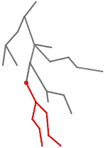
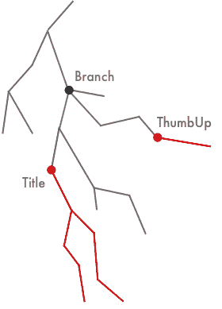
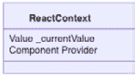
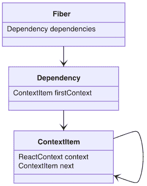
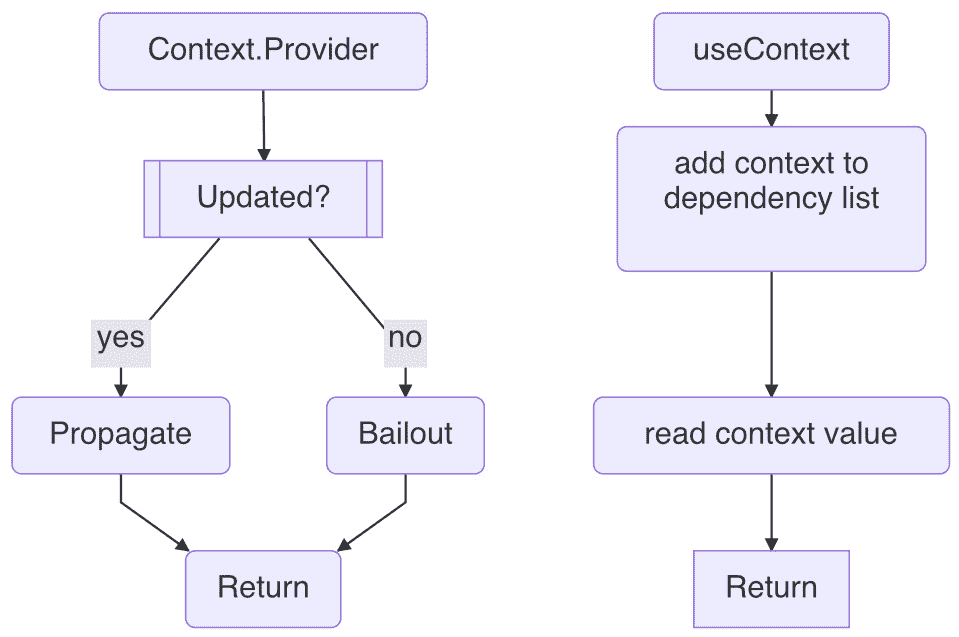
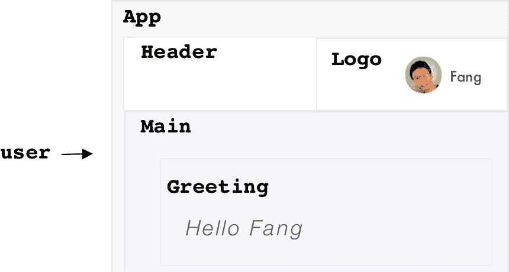
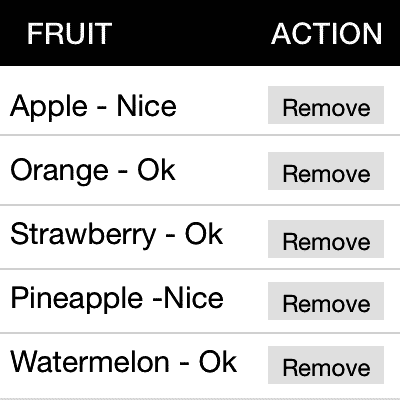

# 第七章：*第七章*：使用上下文覆盖区域

在上一章中，我们学习了 `useMemo` 的设计和如何使用 `useMemo` 有条件地重用最后一个值。在本章中，我们将讨论如何传播更改以覆盖区域更新。我们将介绍什么是区域更新以及 *React* 上下文如何用于在该区域内共享值。然后，我们将遍历 `useContext` 后面的数据结构和源代码以消费共享值。最后，我们将提供两个将上下文应用于主题和表格的实际示例。本章还包括 *附录* 部分的两个额外主题：*传播上下文* 和 *上下文作用域和值*。

在本章中，我们将涵盖以下主题：

+   那么区域更新是什么？

+   介绍 React 上下文

+   理解 `useContext` 设计

+   测试 `useContext`

+   `useContext` 示例

+   问答

+   附录

# 什么是区域更新？

在一个典型的网站上，一旦网站加载完成，它就开始监听所有用户动作。每个接收到的动作都会按照先来先服务的原则进行处理。通常，每个动作的影响仅限于屏幕上的一个小区域，使用 *UI* 术语，就是一个单个组件。然而，有时一个用户动作可以做得更多。

让我们用计算机作为类比。假设你决定更改系统的颜色设置。一旦颜色更改，计算机就会遍历所有打开的窗口并将该颜色应用到它们上。因此，这个动作可以影响屏幕上分散的多个应用程序。这成为了一个区域更新。

你是否想过，当受影响的组件彼此之间非常遥远时，我们如何进行区域更新？为了回答这个问题，让我们首先回顾一下在 *第四章* 中引入的单个更新，*使用状态启动组件*。

当接收到一个动作时，纤维树会安排一个单个更新。这个更新围绕接收动作的源纤维进行本地化（*图 7.1* 中的红色点）。*React* 跟随源纤维，收集与之相关的所有更改，然后将它们应用到 *DOM* 上（红色线条）。这是 *React* 中的单个更新模式。



图 7.1 – 由用户动作引发的单个更新

假设源纤维是一个 `Title` 组件：

```js
const Title = () => {
  const [count, dispatch] = useState(0)
  const onClick = () => {
    dispatch(count + 1)
  }

  return ( 
    <>
      <div onClick={onClick}>{count}</div>
      ...
    </>
  )
}
```

当用户点击 `count` 时，前面的 `Title` 组件会进行更新。它也应该更新 `...` 部分中的其他子组件。

现在，考虑另一个名为 `ThumbUp` 的组件：

```js
const ThumbUp = () => {
  // made up count
  return count > 5 ? "Awesome" : ""
}
```

`ThumbUp` 组件的目的是响应 `count`。当它大于 `5` 时，我们希望在屏幕上打印出 `"Awesome"` 消息。`ThumbUp` 组件位于 *图 7.2*：



图 7.2 – 对单个用户动作响应的两个更新

目前，`ThumbUp`组件中的`count`变量是一个虚构的变量，因为我们不知道它如何从`Title`组件传递过来。我们所知道的是，我们想在两个组件之间共享这个`count`，而挑战似乎在于它们之间的关系。

显然，这两个组件之间并不是父子关系。除非我们首先向上移动多个步骤到达`Branch`组件（*图 7.2*中的暗点）然后再向下选择另一条路径，否则没有直接从一方到另一方的路径。本质上，`Branch`是它们的共同祖先。那么我们究竟如何在这两个不是直接父子关系的节点之间发送信息呢？

让我们通过两种方法来探讨这个问题，首先从 props 方法开始。

## Props 方法

由于 React 的 props 只适用于父子设置，为了将 props 应用到这个问题上，我们需要将相关的状态提升到共同祖先，即`Branch`组件：

```js
const Branch = () => {
   const [count, dispatch] = useState(0)
   const onClick = () => {
     dispatch(count + 1)
   }

   return (
     <>
       <div>
         ...
         <Title count={count} onClick={onClick} />  
         ...
       </div>
       <div>
         ...
         <ThumbUp count={count} />
         ...
       </div>
     </>
   )
}
```

在前面的代码中，`count`状态从`Title`移动到了`Branch`。从那里，`count`和`dispatch`通过 props 发送到（遥远的）子组件。现在，如果状态发生变化，`Branch`组件会更新所有子组件，包括`Title`和`ThumbUp`。好吧，我们成功共享了`count`状态。

虽然 props 方法在一般情况下是可行的，但它确实要求我们修改`Title`和`ThumbUp`组件的 props。由于`Branch`和每个组件之间的路径上可能有其他组件，所以沿途的所有组件都需要进行修改。考虑到典型的网站构建，共享状态的需求通常发生在项目周期的后期阶段。采用这种方法可能会因为需要修改的组件数量而变得非常昂贵。

那么，有没有一种更好的方法来共享 prop，而不需要修改这么多组件？观察*图 7.2*，一个直观的方法可能是同时向`Title`组件和`ThumbUp`组件发送更新。这种组合影响可能会产生覆盖两者的区域更新。让我们看看这个想法是否可行。

## 组合分发方法

为了实现组合分发，我们需要允许从事件处理器访问两个分发。这有点棘手，因为通过`useState`提供的分发函数通常定义在一个组件内部，无论是`Title`还是`ThumbUp`。为了解决这个问题，让我们假设我们目前使用一个全局变量：

```js
let dispatch2
const ThumbUp = () => {
  const [count, dispatch] = useState(0)
  dispatch2 = dispatch
  return count > 5 ? "Awesome" : ""
}
```

在前面的代码中，我们修改了`ThumbUp`组件，并添加了一个`count`状态和一个`dispatch`函数。然后我们使用一个全局变量`dispatch2`来指向这个`dispatch`函数，以便其他组件可以调用它。现在，通过这个变化，我们可以要求`Title`组件执行两个分发：

```js
const Title = () => {
  const [count, dispatch] = useState(0)
  const onClick = () => { 
    dispatch(v => v + 1)
    dispatch2(v => v + 1)
  }

  return <div onClick={onClick}>{count}</div>
}
```

从前面的设置来看，当用户点击`count`时，它会从`Title`执行`dispatch`操作，并从`Greeting`执行`dispatch2`操作。尽管每个组件中的两个`count`状态并没有指向共享的值，但它们分别从这两个`dispatch`操作中各自增加。*React*将这些两个`dispatch`操作批处理为一次屏幕更新，如果用户继续点击数字，当`count`状态大于`5`时，你会在屏幕上看到一条`"Awesome"`消息。

你可能不相信这种类似黑客的方法会有效，但它确实有效。我们为另一个组件调用`dispatch`函数的事实略超出了*React*设计`useState`的目的，但这并不错误。这种方法需要对代码结构进行较少的修改。没有涉及任何属性。所有更改都是在`Title`和`ThumbUp`的本地侧进行的。更重要的是，它作为一个教育案例，表明影响多个组件的更新可以由多个更新组成。

好的，从这两种方法中我们学到的是，我们想要避免在这个非父/子情况下一路向下传递属性，我们还想共享值以及触发一种随值变化而进行的组合更新。此外，在实践中，如果解决方案可以提供开箱即用的联合`dispatch`，并且只需要对现有代码结构进行少量修改，那就更好了。

到 2017 年底，*React*团队发现了这样的需求，并引入了一个新版本的上下文来解决当时存在的限制。新上下文的作用是帮助通过多个组件层级共享一个值，而不需要在每个层级中传递属性。它还提供了一个机制，允许远端子组件访问祖先组件的值。让我们来看看这个*React*上下文。

# 介绍 React 上下文

上下文通过一个包含`_currentValue`值的`ReactContext`数据类型进行建模。



Figure 7.3 – React 上下文数据结构

我们可以使用`createContext`函数创建一个上下文。例如，如果我们想共享一些用户信息，我们可以创建一个`UserContext`并持有`defaultValue`：

```js
const UserContext = createContext(defaultValue)
export default UserContext
```

创建的上下文可以通过*JavaScript*的`export`语句进行共享，这样，当任何其他文件或组件需要它时，它可以被导入。

上下文允许我们通过`Provider`属性将值提供给所有下层的消费者：

```js
import UserContext from './UserContext'
const Branch = () => {
  return (    
    <UserContext.Provider value={...}>      
    ...    
    </UserContext.Provider>  
  )
}
```

一个上下文提供者，如`UserContext.Provider`，接受一个用于共享的`value`属性。提供者是一个特殊组件。与函数组件不同，它有自己的更新实现。当它由于`value`的变化而更新时，它会启动一个搜索。

搜索会遍历其子级及其子级的子级，直到访问到所有内容。对于所有使用上下文的消费者，它们都被标记为需要更新。如果你对上下文提供者感兴趣，请查看本章末尾的*附录 A – 上下文的传播*。

因此，提供者的工作就是共享一个值。如果需要多个不同目的的值，我们可以将它们堆叠在一起。比如说，在`UserContext`之上，我们还有一个`ThemeContext`上下文来共享：

```js
const Branch = ({ user, theme }) => {
  return (
    <ThemeContext.Provider value={theme}>
      <UserContext.Provider value={user}>
        ...
      </UserContext.Provider>
    </ThemeContext.Provider>
  )
}
```

之前的使用方法将允许`...`部分中的任何消费者读取`theme`或`user`的值，或者两者都读取。

关于提供者设计的一个有趣方面是，一个提供者可以嵌套在同一个提供者下面以覆盖共享值：

```js
const Branch = ({ theme1, theme2 }) => {
  return (
    <ThemeContext.Provider value={theme1}>
      // A. value = theme1
      <ThemeContext.Provider value={theme2}>
        // B. value = theme2
      </ThemeContext.Provider>
      // C. value = theme1
    </ThemeContext.Provider>
    // D. value = defaultTheme
  )
}
```

在前面的代码中，`theme1`和`theme2`是由同一个`ThemeContext`定义的两个提供者提供的。那么，消费者会看到哪个上下文值，你可能想知道？

在前面的代码中，标记了四个位置`A`、`B`、`C`和`D`。消费者看到的值取决于它被消费的位置。对于位置`A`，消费者看到的值是`theme1`，对于位置`B`，它是`theme2`，而对于位置`C`，它又回到了`theme1`。

从本质上讲，上下文提供者（以某种方式）设计得像*JavaScript*函数。你可以在不同的函数作用域中获取不同的值。为了确定特定位置的正确值，你需要找到提供`value`的第一个祖先父级。最近的祖先提供者应该提供正确的上下文值。这应该解释了为什么位置`C`得到`theme1`而不是`theme2`。

那么，在没有任何提供者作用域之外，例如在位置`D`，上下文值是什么？由于它碰巧不是一个你可以找到在`Branch`组件之上的祖先提供者。这就是`defaultValue`发挥作用的地方：

```js
const ThemeContext = React.createContext(defaultTheme)
```

当找不到其他提供者来提供值时，它将采用在创建上下文时提供的`defaultValue`。这意味着默认值不是必需的，但它可以在早期查看上下文类型格式时很有用：

```js
const defaultTheme = {
  mode: 'light'
}
```

内部，*React*使用一个栈来推送和弹出上下文，以跟踪所有提供者作用域的上下文值。如果你对这个细节感兴趣，请查看本章末尾的*附录 B – 上下文作用域和值*。

好的，现在我们知道了如何提供上下文值，让我们看看我们如何在消费者/子组件中消费它。*React*提供了一个`useContext`钩子来完成这项工作。

# 理解 useContext 设计

*React*提供了一个`useContext`钩子来消费上下文：

```js
import UserContext from './UserContext'
const Title = () => {  
  const user = useContext(UserContext)
  return <div>{user.name}</div>
}
```

`useContext`钩子函数接受一个输入参数`context`，并返回共享的值。`context`通常从一个定义文件中导入。

## useContext 数据结构

我们将解释如何使用简化版源代码来设计`useContext`。让我们看看使其发生的数据结构：



图 7.4 – useContext 钩子数据结构

要消费（或读取）上下文值，每个纤维都会获得一个新的`dependencies`属性来跟踪它所消费的所有上下文。这是因为一个组件可以使用多个`useContext`，并且每次使用都会消费不同的上下文，例如`UserContext`和`ThemeContext`。

`dependencies`属性被设计为一个链表，其`firstContext`属性用于保存第一个具有`ContextItem`类型的上下文。每个`ContextItem`都包含一个`ReactContext`（之前介绍过的上下文）和一个指向下一个上下文的`next`属性。依赖列表是提供者如何在传播更新时找到所有消费者的方式。

`useContext`钩子被设计用来读取所有更新中的上下文值：

```js
function useContext(context) {
  const contextItem = {      
    context: context,      
    next: null,    
  }    
  if (lastDependency === null) {      
    lastDependency = contextItem      
    updatingFiber.dependencies = {        
      firstContext: contextItem,      
    }    
  } else {      
    lastDependency =        
      lastDependency.next = contextItem    
  }
  ...
}
```

在前面的代码块中，`useContext`的主要任务是返回`context`中的`_currentValue`。在返回上下文值之前，它还将`context`追加到纤维的`dependencies`列表中。

`lastDependency`是一个辅助变量，用于跟踪更新的最后一个上下文。如果是第一个上下文，则将其创建为`firstContext`，否则将其追加到列表的`next`中。在更新的开始时，`lastDependency`被设置为`null`。因此，每个纤维的`dependencies`列表在每次更新时都会重新创建，这提醒我们钩子是如何在每次更新中创建的。

## useContext 工作流程

您已经通过简化版的`useContext`代码进行了学习。以下是提供者和`useContext`的总结工作流程：



图 7.5 – useContext 和 ContextProvider 工作流程

让我们快速回顾一下。上下文通过提供者提供。在提供者的值发生变化的情况下，它会找到所有消费者并传播更新。否则，它会跳过更新。

在更新过程中，当使用给定上下文的`useContext`钩子被调用时，它会将上下文追加到纤维的`dependencies`列表中，并返回上下文的当前值。

现在我们已经完成了整体设计，让我们来对其进行一次全面的测试。

# 测试`useContext`

上下文的使用很有趣，并且有相当多的常见应用。考虑一个在屏幕右上角显示用户标志的网站：



图 7.6 – 包含 App、Header 和 Logo 的应用程序

该网站使用`App`组件创建，包含`Header`和`Main`。然后，`Header`包含`Logo`，而`Site`包含`Greeting`。`App`、`Header`和`Logo`的定义如下：

```js
function App({ initialUser }) {
  const user = initialUser
  return (
    <div>
      <Header user={user} />
      <Main user={user} />
    </div>
  )
}
const Header = ({ user }) => {
  return <Logo user={user} />
}
const Logo = ({ user }) => {
  return (
    <div>
      
      <span>{ user.username }</span>
    </div>
  )  
}
```

假设用户经过认证作为`initialUser`发送到`App`，它将通过属性传递给`Header`和`Logo`。在`Logo`中，它通过其`imageUrl`属性和`username`被消费以显示一个标志。注意所有组件的接口都需要携带`user`属性。由于我们想在`Main`下显示问候消息，因此`user`也需要通过属性传递。

让我们看看上下文如何帮助简化这个设置。假设我们定义一个`UserContext`：

```js
const UserContext = React.createContext()
export default UserContext
```

在`App`应用中，我们可以通过`UserContext.Provider`提供`initialUser`：

```js
import UserContext from './UserContext'
const App = ({ initialUser }) => {
  const [user, changeUser] = useState(initialUser)
  const value = { user, changeUser }
  return (
    <UserContext.Provider value={value}>
      <div>
        <Header />
        <Site />
      </div>
    </UserContext.Provider>
  )
}
```

注意，`Header`和`Main`不再需要携带`user`属性。

`App`组件创建一个`user`状态来保存`initialUser`。`changeUser`函数可以在需要时替换当前用户。然后它从`user`和`changeUser`组装一个`value`对象，通过`UserContext.Provider`共享。

在`Logo`组件内部，我们可以消费提供的值，包括`user`属性：

```js
import UserContext from './UserContext'
const Logo = () => {
  const { user } = useContext(UserContext)
  return (
    <div>
      
      <span>{ user.username }</span>
    </div>
  )  
}
```

在前面的代码中，通过 ES6 语法读取`UserContext`来获取`user`对象。对于那些对 ES6 用法感兴趣的读者，可以查看*第十章*中的*拥抱 JavaScript ES6*部分，*使用 React 构建网站*。一旦获取到`user`，我们可以使用`user`的`imageUrl`和`username`属性快速将其连接到现有的`Logo`组件。

同样适用于`Main`下的组件，例如`Greeting`，它根据当前登录用户显示`Hello Fang`消息。我们可以利用上下文轻松完成这项工作：

```js
import UserContext from './UserContext'
const Greeting = () => {
  const { user } = useContext(UserContext)
  return <h1>Hello {user.username}</h1>
}
```

重要的是要注意，使用像`UserContext`这样的上下文，我们的应用在访问`user`对象方面变得更加易于管理和可扩展。因为信息变成了上下文信息，只要组件属于这个上下文，它就可以访问它。

现在我们知道了如何读取用户对象，让我们看看是否可以从`initialUser`中更改它，例如允许用户登录和退出应用。

## 更改上下文值

假设我们添加一个`Logo`。当这个按钮被点击时，当前用户会注销，这意味着他们的标志将不再可用于显示：

```js
import UserContext from './UserContext'
const Logo = () => {
  const { user, changeUser } = useContext(UserContext)
  const { imageUrl, username } = user
  const authenticated = username != undefined
  const onLogout = () => { changeUser({}) }
  const onLogin = () => { // redirect to LoginForm }
  return (
    <div>
      {authenticated ? (
        <>
          
          <span>{ username }</span>
           <button onClick={onLogout}>Logout</button>
        </>
      ) : (
           <button onClick={onLogin}>Login</button>
      )}
    </div>
  )  
}
```

在前面的代码中，`changeUser`函数通过`UserContext`提供。它根据`username`是否存在定义了一个`authenticated`标志。这个标志可以用来决定*UI*是否应该显示**注销**或**登录**按钮。

如果用户经过认证作为`initialUser`发送到`App`，它将通过属性传递给`Header`和`Logo`。在`Logo`中，它通过其`imageUrl`属性和`username`被消费以显示一个标志。注意所有组件的接口都需要携带`user`属性。由于我们想在`Main`下显示问候消息，因此`user`也需要通过属性传递。

如果用户未认证，将触发`onLogin`事件处理器，我们可以将用户重定向到`LoginForm`（此处省略重定向代码）：

```js
const LoginForm = () => {
  const { changeUser } = useContext(UserContext)
  const onSubmit = (_user) => {
    changeUser(_user)
    // redirect to home page
  }
  return ...
}
```

`LoginForm`也消耗`UserContext`并读取`changeUser`属性。在表单成功提交后，我们可以再次使用`changeUser`将空用户更改为认证用户。同样，新的更新将传播到所有消费者，包括`Logo`和`Greeting`。因此，用户在登录后将在右上角看到他们的标志和用户名，以及在主体上的问候消息。参见*图 7.6*。

对于一个网站来说，用户登录和注销通常是重要的操作，因为它对网站的认证和授权有直接影响。特别是当完全刷新页面不是一个选项时，上下文在读取和写入用户对象方面是一个完美的选择，无需担心各个组件之间的不同步时刻。

现在我们已经看到了在上下文改变的情况下，上下文更新如何协调所有组件的更新，让我们看看两个使用上下文在真实应用中的示例。

# useContext 示例

上下文用于共享网站级别的信息，但它也可以在更窄的范围内非常有效地共享事物。在本节中，我们将看到这两种情况的示例。

## 主题上下文

一个涉及上下文的好用且常见的用法是主题化，它允许用户根据他们的偏好在浅色和深色主题之间切换。参见*图 7.7*：


图 7.7 – 使用浅色和深色选项制作的主题

要实现这个功能，让我们从`ThemeContext`开始：

```js
const ThemeContext = React.createContext({
  mode: 'light',  // or 'dark'
})
```

我们可以使用支持`mode`属性的`对象`来设置默认主题，其中`mode`是一个字符串，可以包含“light”或“dark”。

### 设计主题上下文

任何需要主题的组件都可以从`ThemeContext`中读取设置。让我们构建一个具有主题感知能力的`Button`组件：

```js
const Button = () => {
  const theme = useContext(ThemeContext)
  return (
    <ButtonStyle mode={theme.mode}>
     Ok
    </ButtonStyle>
}
```

我们可以根据`ButtonStyle`组件内部的共享`mode`来为主题按钮的样式进行主题化：

```js
const color = props => 
  props.mode === 'light' : 'black' ? 'white'
const ButtonStyle = styled.button`
  color: ${color};
`
```

`ButtonStyle`是一个应用于宿主`button`组件的样式化组件，它具有修改后的*CSS*。它接收`mode`属性，基于此，我们可以使用`"white"`或`"black"`来定义其`color`。如果您对使用`StyledComponent`感兴趣，请查看*第十章*的*采用 CSS-in-JS 方法*部分，*使用 React 构建网站*。

基于这种方法，我们可以构建许多其他具有主题感知能力的组件。想象一下，如果我们有`App`下的几个这样的组件；在模式改变的情况下，它们可以在单个更新中切换到相应的样式：

```js
const App = ({ theme }) => {
  return (
    <ThemeContext.Provider value={theme}>
      ...
    </ThemeContext.Provider>
}
```

现在让我们谈谈如何设计一个上下文。在前面的主题化案例中，我们使用了`mode`在主题之间切换，但我们也可以将确切的样式烘焙到其中：

```js
const ThemeContext = React.createContext({
  primaryColor: 'blue',
  secondaryColor: 'red'
})
```

在前面的上下文中，定义了两种用于主要和次要目的的单独颜色。这样，我们就可以直接在 `Button` 中读取颜色：

```js
const color = props => props.primaryColor
const ButtonStyle = styled.button`
  color: ${color};
`
```

在设计上下文方面，没有对错之分。关于您应该使用哪个属性的决策，更多或更少地基于您想要如何消费这些属性并设计组件。在我们的案例中，决策更多关于组件是否应该基于 `mode` 或 `primaryColor`。

### 手动应用主题

使用主题为多个组件组工作得很好，尤其是在主题上下文中。然而，有时会有这样的需求，我们想要将主题应用于一个特定的组件，而不影响所有其他组件的主题。这通常适用于获得与网站其他部分不同对比色的导航标题组件。

通过在单独的作用域中应用上下文，可以解决这个问题：

```js
const Header = () => {
  return (
    <ThemeContext.Provider value={{ mode: 'dark' }}>
      <Button />
    </ThemeContext.Provider>
  )
}
```

在前面的 `Header` 组件中，还写了一个 `ThemeContext.Provider` 的另一个用途，提供不同的 `mode` 主题，而 `App` 已经提供了一个 `mode` 主题。假设 `App` 主题是 `'light'`；当它进入 `Header` 时，它变为 `'dark'`。

当主题感知的 `Button` 组件被更新时，它会寻找定义提供者的最近祖先。由于找到的祖先是 `Header` 而不是 `App`，它读取 `'dark'` 模式。

我们可以自由地覆盖上下文值的部分，而不是覆盖整个值：

```js
const Header = () => {
  const theme = useContext(ThemeContext)
  const value = { ...theme, primaryColor: 'blue' }
  return (
    <ThemeContext.Provider value={value}>
      ...
    </ThemeContext.Provider>
  )
}
```

在前面的上下文中，`Header` 从父作用域中获取当前主题，并覆盖了 `primaryColor` 属性为 `'blue'`。因此，所有在 `Header` 下的子消费者都看到了修改后的主题设置。

操场 – 主题上下文

您可以自由地在这个在线示例中玩耍：[`codepen.io/windmaomao/pen/xxLrwJy`](https://codepen.io/windmaomao/pen/xxLrwJy).

现在我们看到，上下文非常适合网站级别的主题，如主题。上下文不必总是像网站那样大；如果我们能识别一个区域，我们就应该能够将其应用于它。让我们看看一个例子，我们将上下文应用于一个目标区域，如表格。

## 表格上下文

上下文的另一个用途是将上下文应用于一个可以很小但足够大以包含许多相关组件的地方，例如表格。参见 *图 7.8*：



图 7.8 – 包含可定制单元格显示的表格

在现代 *UI* 中，一个表格可能相当复杂，因为它包含标题、主体、页脚、分页以及可定制的列设置，以驱动单元格的外观和感觉。此外，所有这些元素都可以即时混合匹配，以适应不同的业务目的。

### 自定义表格单元格

表格由单元格的行和列组成，其中每个单元格都可以由如 `DefaultCell` 这样的单元格组件控制：

```js
const DefaultCell = ({ value }) => {
  return <div>{value}</div>
}
```

属性`value`用于从一个行的属性中传递一个原始值，例如一个字符串或一个数字。在典型情况下，我们简单地将其显示为字符串格式，就像前面的代码所示。

给定一个跟踪水果列表的表格行：

```js
const fruits = [
  { title: 'Apple', status: true },
  { title: 'Orange', },
  { title: 'Strawberry' },
  { title: 'Pineapple', status: true },
  { title: 'Watermelon' }
]
```

前面的`title`列是一个完美的例子，它应该显示水果名称的列表。然而，并非所有单元格都是纯字符串，因为我们可以将单元格显示为状态指示器、进度条、复选框等。在我们的例子中，我们有一个表示水果是否美味或只是 OK 的`status`列，这可以通过另一个单元格行为来处理：

```js
const StatusCell = ({ value }) => {
  const s = value ? 'Nice' : 'Ok'
  return <div>{s}</div>
}
```

在前面的自定义`StatusCell`组件中，传入的值是一个布尔值，它显示为`'Nice'`或`'Ok'`。

这意味着我们需要一个通用的`TableCell`，我们可以传入某种类型的列信息来定制显示：

```js
const TableCell = ({ col, row }) => {
  const value = row[col.name]
  const Component = col.Cell || DefaultCell
  return <Component value={value} />
}
```

在前面的`TableCell`组件中，提供了一个`col`属性来描述单元格应该如何更新。让我们看看`title`和`status`两列的信息：

```js
const cols = [
  { name: 'title' },
  { name: 'status', Cell: StatusCell }
]
```

对于第二列，`Cell`属性被指定为自定义的`StatusCell`，而第一列省略了它，因此使用了`DefaultCell`。通过这个`col`功能，我们可以为各种单元格设计自定义的外观和感觉。

### 设计表格上下文

到目前为止的例子是基于单元格内容显示单元格，即`row[col.name]`。只要列名与行数据中存储的数据匹配，我们就应该找到正确的单元格值。但有时，它们可能不匹配，或者更糟糕的是，有时我们需要根据多个列来显示单元格。例如，为了显示一个人的全名，我们需要这个人的名字和姓氏，它们分布在两个列中。只有`row`可以提供足够的信息。但我们只有一个单元格`value`。我们能在哪里得到`row`？

我们可以将`row`作为属性传递给每个`TableCell`。但如果我们想避免使用属性方法以保持单元格接口的灵活性，我们可以这样做。在这种情况下，我们可以创建一个`TableContext`：

```js
const TableContext = React.createContext({
  rows: [],
  cols: [],
  row: {}
})
export default TableContext
```

在前面的`TableContext`中，我们添加了`row`属性以及`rows`和`cols`，以便所有消费者都可以共享它们。然后我们可以将其提供给`TableRow`组件中的每一行：

```js
import TableContext from './TableContext'
const TableRow = ({ row }) => {
  const table = useContext(TableContext)
  const value = { ...table, row }
  const cols = table.cols
  return (
    <TableContext.Provider value={value}>
      <TableRowStyle>
        {cols.map(col => {
          <TableCell
            row={row}
            col={col}
          />
        })}
      </TableRowStyle>
    </TableContext.Provider>
  )
}
```

`TableRow`组件负责更新表格中的一行。我们在这里使用`TableContext`有两个目的，一个是为了获取所有存储的`cols`，另一个是为了在将上下文返回给每一行之前，用之前提供的属性覆盖`row`属性。现在，当我们到达每个单元格组件时，我们应该能够获取当前的`row`。为了演示，我们可以为`'combo'`设置另一个自定义列：

```js
const cols = [
  { name: 'title' },
  { name: 'status', Cell: StatusCell },
  { name: 'combo', Cell: ComboCell }
]
```

`'combo'`列的想法是在单个单元格中通过自定义的`ComboCell`组件将`'title'`和`'status'`结合起来：

```js
const ComboCell = () => {
  const { row } = useContext(TableContext)
  const s = row.status ? 'Nice' : 'Ok'
  return <div>{row.title} – {s}</div> 
}
```

在前面的代码中，我们从`TableContext`中获取当前的`row`信息，并访问`title`和`status`属性。通过这种方法，我们可以从当前行组装任何信息。此外，请注意，没有将属性传递到这个组件中。这意味着，只要导入`TableContext`，你就可以在任何你想的地方设计一个自定义单元格。这种解耦，没有显式的依赖，应该使我们能够非常舒适地动态设计自定义单元格样式。

我们可以争论，如果我们直接将`row`提供给`ComboCell`，我们就可以在不设置表格上下文的情况下实现相同的功能。这可能是对的。你选择是否将`row`作为属性或从上下文中传递会影响你如何设计单元格。

在我们的例子中，从上下文中传递`row`确实使设计变得更加灵活。让我们继续我们的例子，看看在其他地方如何使用这个`TableContext`。假设这次一个单元格需要知道更多信息，比如`cols`设置，甚至与表格相关的一些操作，比如删除一行。

让我们看看一个例子，通过点击单元格来删除表格的一行。现在，为了管理表格的内容，我们可以向`Table`组件提供一个状态`[rows, setRows]`：

```js
const Table = ({ cols, rows, setRows }) => {
  const value = { cols, rows, setRows }
  return (
    <TableContext.Provider value={value}>
      <TableStyle>
        {rows.map(row => {
          <TableRow row={row} />
        })}
      </TableStyle>
    </TableContext.Provider>
  )
}
```

在前面的代码中，`Table`组件负责显示表格的所有行。传递的`rows`和`cols`以及`setRows`分发函数都被发送到`TableContext`提供者以供消费。有了这个，我们可以定义一个自定义的`DeleteCell`组件：

```js
const DeleteCell = () => {
  const { row, rows, setRows } = useContext(TableContext)
  const onClick = () => {
    const newRows = rows.filter(r => r.title !== row.title)
    setRows(newRows)
  }

  return (
    <div>
      <button onClick={onClick}>Remove</button>
    </div>
  )
}
```

在前面的代码中，`DeleteCell`包含一个`newRows`，通过过滤掉当前的`row`然后使用`setRows`分发函数来替换表格内容。一旦`rows`被更新，它应该触发提供者的更新，从而将更改传播到所有表格组件。

没有上下文提供`setRows`，它必须通过许多层传递才能到达`DeleteCell`。即使在简短的例子中，层数也不是显而易见的。此外，在这种情况下，我们事先并不知道组件的名称。它可能是`DeleteCell`或`DefaultCell`，或者任何尚未设计的单元格组件。因此，这里的上下文使用对于将事物传递到未知的确切位置非常有帮助。

操场 – 表格上下文

欢迎免费尝试这个在线示例：[`codepen.io/windmaomao/pen/VwzWeMa`](https://codepen.io/windmaomao/pen/VwzWeMa)。

让我们通过在`App`组件下使用`Table`组件来总结这个表格例子：

```js
const cols = [
  { name: 'combo', Cell: ComboCell },
  { name: 'action', Cell: DeleteCell }
]
const App = () => {
  const [rows, setRows] = useState(fruits)
  return <Table
    rows={rows}
    cols={cols}
    setRows={setRows}
  />
}
```

# 概述

在本章中，我们学习了一个非常酷的概念，那就是上下文。首先，我们了解了在*React*中上下文是什么。然后，我们深入研究了上下文的设计以及如何使用`useContext`钩子来消费它。然后，我们通过管理一个网站的用户对象进行上下文测试驱动，进一步学习了将上下文应用于`Theme`和`Table`的两种更多应用。

在下一章中，我们将进入 React 家族的下一个钩子，并看看如何使用 ref 将私人事务隐藏在引擎之外。

# 问题与答案

以下是一些问题与答案，以帮助您巩固知识：

1.  什么是*React*上下文？

    *React*上下文是一个可以用来与消费者共享值的身份。它被设计成可以提供一个值给局部作用域，因此该作用域内的所有组件都可以从这个共享值中读取。

1.  `useContext`钩子是什么？

    `useContext`钩子在消费者组件中使用，以便它可以读取由提供者给出的上下文。一个组件可以消费尽可能多的上下文。当提供者更新时，该特定上下文的所有消费者组件将同时更新。

1.  `useContext`的常见用法是什么？

    当涉及到组件区域更新时，`useContext`钩子是*React*钩子家族中的一个钩子。我们经常在`User`、`Theme`和`Table`中看到这种上下文用法，这需要在不通过组件层传递的情况下，在祖先组件下消费一个值。`useContext`钩子还使得向一个区域传递值成为可能，而不必确切知道目的地在哪里。

# 附录

## 附录 A – 传播上下文

React 包含不同类型的纤维。虽然函数组件是其中之一，但上下文提供者又是另一种。它为每次更新都有自己的更新逻辑：

```js
function updateContextProvider(fiber) {
  var providerType = fiber.type
  var context = providerType._context
  var newProps = fiber.pendingProps
  var oldProps = fiber.memoizedProps
  var newValue = newProps.value
  if (oldProps !== null) { ... }
  var children = newProps.children
  reconcileChildren(fiber, children)
  return fiber.child
}
```

在前面的代码中，`updateContextProvider`函数接收`fiber`，并通过`oldProps !== null`检查它是否已经挂载。如果是首次挂载，那么它就会做一些类似于函数组件的事情，将子组件协调到纤维中，然后返回第一个子组件以供后续处理。

如果不是首次挂载，例如在更新过程中，它就会比较`value`属性之间的`oldValue`和`newValue`：

```js
  if (oldProps !== null) {
    var oldValue = oldProps.value
    if (oldValue === newValue) {
      if (oldProps.children === newProps.children) {
        return bailoutOnAlreadyFinishedWork(fiber)
      }
    } else {
      propagateContextChange(fiber, context)
    }
  }
```

如果从严格的相等比较`===`提供的值没有变化，并且子组件也没有变化，那么它就会退出纤维并跳过协调。否则，如果提供的值有变化，它将通过`propagateContextChange`函数将上下文变化传播到所有消费者纤维：

```js
function propagateContextChange(work, context) {
  var fiber = work.child;
  while (fiber !== null) {
    var nextFiber = void 0
    var list = fiber.dependencies;
    if (list !== null) {
      nextFiber = fiber.child;
      var dependency = list.firstContext;
      while (dependency !== null) {
        if (dependency.context === context) {
          scheduleWorkOnParentPath(fiber.return) 
          break
        }
        dependency = dependency.next;
      }
    } else {
      nextFiber = fiber.child;
    }
    ...
    fiber = nextFiber;
  }
}
```

在`fiber`纤维下进行深度搜索的传播检查是否包含与`firstContext`相同的`context`。如果找到匹配项，它将调用`scheduleWorkOnParentPath`函数来安排从根到父级的路径更新。这个函数与我们在`useState`钩子中看到的`scheduleUpdateOnFiber`非常相似。但在这里，这个函数不是只执行一次，而是应用于找到的所有消费者。

简而言之，你可以看到提供者是一个特殊的组件，它为从同一上下文中读取的所有消费者安排更新。

## 附录 B – 上下文作用域和值

上下文值在不同的上下文作用域下发生变化。但这个陈述意味着什么呢？

```js
Const provider1 = (value) => {
  const provider2 = (value) => {
    const provider3 = (value) => {
      console.log(value)  
    }
    provider3(3)
  }
  provider2(2)
}
provider1(1)
```

在前面的复杂示例中，如果我们调用`provider1(1)`，你能猜到输出是什么吗？请花一分钟思考。答案是`3`。

因为每个函数都有一个作用域，在函数的作用域内，所有从输入参数传入的局部变量都有优先权。尽管外部的`value`是`1`，但由于作用域的改变，内部的`value`变成了`3`。

上下文提供者以类似的方式设计；在进入一个作用域之前，它使用堆栈将旧值推入，然后在离开相同的作用域后弹出旧值。这样，当我们在一个内部作用域中工作时，总是将外部作用域保持在内存中。

让我们仔细看看这个过程。假设`cursor`在一个外部作用域中持有值，并且它想要带着新的`value`进入内部作用域：

```js
function push(cursor, value) {
  index++
  valuesStack[index] = cursor.current
  cursor.current = value
}
```

在前面的代码中，`cursor`是一个全局变量，它持有`current`属性下的当前值。`push`操作将旧值放入堆栈，然后替换`cursor`的当前值为新值。

因此，一旦我们进入内部作用域，`cursor`的`current`就会更新为最新值，那么我们如何在完成这个内部作用域后恢复旧值呢？是的，我们执行一个`pop`操作：

```js
function pop(cursor) {
  if (index < 0) return
  cursor.current = valueStack[index]
  valueStack[index] = null
  index--
}
```

在前面的代码中，我们将之前的堆叠值弹回到`cursor`。因此，当我们从内部作用域退出时，值会恢复到旧值。

这种机制正是应用于我们的上下文提供者：

```js
function updateContextProvider(fiber) {
  ...
  pushProvider(fiber, newValue)
  if (oldProps !== null) { ... }
  ...
}
```

当它到达提供者的更新时，它使用`pushProvider`函数将旧值推入并替换为新值：

```js
function pushProvider(fiber, nextValue) {
  var context = fiber.type._context
  push(valueCursor, context._currentValue)
  context._currentValue = nextValue;
}
```

`pushProvider`的最后一行使用`value`属性的`nextValue`将上下文的`_currentValue`设置为上下文。这就是内部作用域中的消费者如何获得内部值。但在那之前，它将`_currentValue`的旧值推入堆栈，并将其存储在全局变量`valueCursor`中。

在我们离开提供者的作用域之前，调用`popProvider`：

```js
function popProvider(fiber) {
  var currentValue = valueCursor.current
  pop(valueCursor)
  var context = fiber.type._context
  context._currentValue = currentValue
}
```

`popProvider`的最后一行将上下文的`currentValue`设置回从`valueCursor`保存的值。但在那之前，它从堆栈中弹出旧值。

因此，在所有时候，都有一个`valueCursor`来持有外部作用域的值，而`context._currentValue`则持有当前/内部作用域的值。这意味着存储在`_currentValue`中的上下文值在整个更新过程中并不是一个固定值。希望你现在可以明白，上下文具有“全局”的概念，并且根据作用域而变化。
