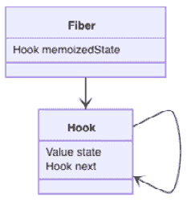
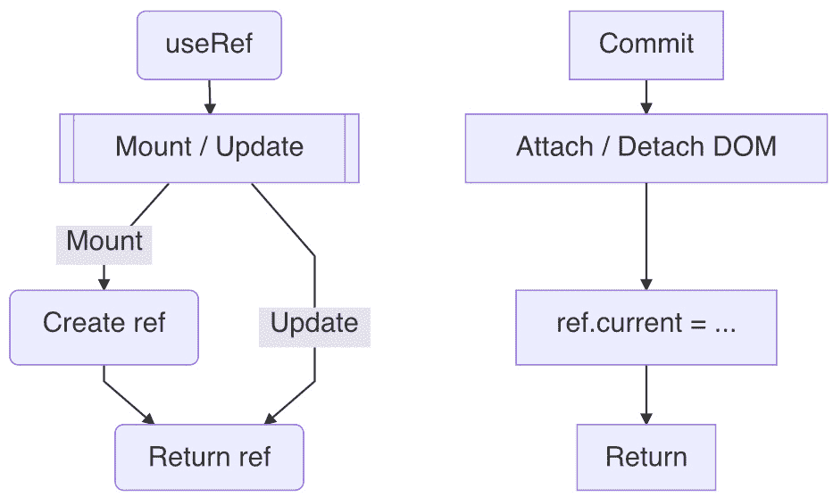
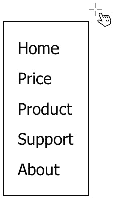
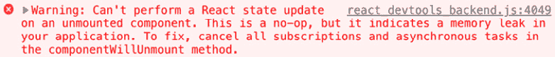

# 第八章：*第八章*：使用 Ref 隐藏内容

在上一章中，我们学习了*React*上下文的设计以及如何使用`useContext`钩子来更新一个区域。在本章中，我们将介绍另一个*React*实体，即 ref。我们将学习如何通过 ref 访问*DOM*元素，并探讨`useRef`钩子背后的设计和源代码。我们还将描述如何在不触发更新的情况下与持久值一起工作。最后，我们将把 refs 应用到一些实际问题中，例如点击菜单外部、避免内存泄漏、设置中继和定位当前值。我们还会在*附录*部分揭示两个额外主题，即回调 ref 和 forward ref。

在本章中，我们将涵盖以下主题：

+   访问*DOM*元素

+   理解`useRef`设计

+   未更新状态

+   测试`useRef`

+   `useRef`示例

+   问答环节

+   附录

# 访问 DOM 元素

在现代*UI*框架引入之前，为了改变屏幕，我们直接与*DOM*元素工作：

```js
<body>
  <h1 id="title"></h1>
</body>
<script>
  const el = document.getElementById('#title')
  el.textContent = "Hello World"
</script>
```

前面的*HTML*文件定义了一个带有特定`id`值的`h1`元素。因此，我们可以使用`id`值来找到`el`元素并更改其`textContent`。这就是*DOM*元素更新的方式：


图 8.1 – 显示 Hello World 标题的 HTML

使用 React，我们可以通过将元素包裹在组件中来实现前面的功能，例如函数组件：

```js
const Title = () => {
  const [title, setTitle] = useState("")
  useEffect(() => { setTitle("Hello World") }, [])
  return <h1>{title}</h1>
}
```

使用前面提到的函数式方法的好处是，它提供了一个在物理*DOM*之上的抽象，并允许我们专注于局部开发空间。这样，我们可以安全地放置我们的逻辑和设计，而不必担心其他代码可能会意外地触摸这个空间。这使得我们的开发更加高效。

这是一件好事，这里有一个问题。我们是否还能像以前一样使用`id`来获取*DOM*元素？因为*React*的工作并不是重新发明所有的*DOM*功能，有时我们确实需要直接与元素工作：

```js
const Title = () => {
  return <h1 id="title">{title}</h1>
}
```

在前面的代码中，我们给`h1`元素添加了`id`。但很快我们就遇到了一些问题。首先，`Title`组件被设计成可重用的。这意味着我们可以在当前屏幕上拥有多个`<Title />`实例。假设我们想要操作其中一个——我们如何通过`id`知道要找到哪个实例？

其次，更重要的是，假设我们找到了我们想要的元素。由于它现在被包裹在组件中，*React*管理其生命周期，那么我们如何精确地知道它在何时挂载和卸载？如果我们不确定这一点，我们如何安全地操作它？

这两个问题都很棘手，但在我们能够直接在组件下操作元素之前，我们需要解决这些问题。让我们看看*React*是如何解决它们的。

## 连接和断开连接

那么，组件中的元素何时挂载和卸载呢？要回答这个问题，我们首先需要仔细查看从组件返回的元素：

```js
  return <h1>{title}</h1>
```

前面的语句返回了什么？它是一个 *DOM* 元素，就像我们在 *HTML* 文件中放入的那样吗？虽然看起来很像，但编译器却给出了不同的说法：

```js
return createElement('h1', null, title)
```

实际上，编译器看到的是一个带有 `createElement` 函数的 *JavaScript* 语句，它返回一个 *React* 元素。它接受三个输入参数，元素类型（`h1`），属性（`null`），和子元素（`title`），返回的元素通常被称为虚拟 *DOM*。如果您想了解更多关于 `createElement` 的使用方法，请查看 *第十章* 的 *Adopting CSS-in-JS approach* 部分，*Building a Website with React*。

当第一次更新开始时，*React* 会取这个元素，将其与纤维进行协调，并将其附加到树上。然后它继续处理其子元素。对于所有子元素，它将它们协调并作为子纤维附加。这个过程会一直持续到所有元素都被协调到树中。

在所有纤维都准备就绪后，*React* 执行一次提交操作，在屏幕上创建所有 *DOM* 元素。所以，本质上，物理 *DOM* 元素直到整个树在内存中更新完毕才被创建。因此，只有到那时，*React* 才会根据我们的请求提供元素实例：

```js
  return <h1 ref={ref}>Hello World</h1>
```

在前面的代码中，一个 `ref` 对象被作为属性传递给 `h1` 元素，并作为一个存储容器，要求 *React* 一旦可用就存储元素实例。这个 `ref` 容器采用特定的格式：

```js
  ref = { current: null }
```

在 *DOM* 元素实例创建后，前面的 `ref` 在 **提交** 阶段的 `commitAttachRef` 函数中被填充：

```js
function commitAttachRef(fiber, instance) {
  const ref = fiber.ref
  if (ref !== null) {
    ref.current = instance
  }
}
```

在前面的 `commitAttachRef` 函数中，当 `ref` 被提供并初始化时，其 `current` 属性从 *DOM* 实例中分配。这是为了挂载。同样，当 *DOM* 元素即将被移除时，`current` 在 **提交** 阶段的 `commitDetachRef` 函数中重新分配回 `null`：

```js
function commitDetachRef(fiber) {
  var ref = fiber.ref
  if (ref !== null) {
    ref.current = null
  }
}
```

使用这个功能，只要我们提供一个指向元素的 `ref`，React 就会在挂载和卸载时将元素的实例分配给 `ref.current`。我们可以使用 `ref.current` 来处理元素，就像它过去一样。这是 *React* 访问 *DOM* 元素的 *React* 方式。

这里有一个细微之处。请注意，当元素准备好时传递元素实例时，赋值是通过 `ref.current = instance` 而不是 `ref = instance` 来完成的。这是因为 *React* 将 `ref` 设计为一个在组件生命周期中可用的容器。简单来说，容器始终有效，而 `current` 属性下的值可能会在过程中发生变化。

我们迄今为止使用的 `ref` 属性是一个对象格式的 ref，这是最流行且易于使用的格式。除此之外，*React* 在其他情况下还支持一种其他格式。如果你感兴趣，可以查看本章末尾的 *附录 A – 回调 ref*。

现在我们知道了什么是 *React* ref，让我们看看如何在函数组件中使用 `useRef` 钩子创建一个。

# 理解 useRef 设计

*React* 提供了一个 `useRef` 钩子来创建 ref：

```js
const Title = () => {
  const ref = useRef(null)
  return <h1 ref={ref}>Hello World</h1>
}
```

`useRef` 钩子只接受一个初始值作为其唯一的输入参数，并返回一个 `ref` 对象，将初始值放在 `current` 属性下。

除了基本的 fiber 钩子支持之外，不需要额外的数据结构用于 `useRef`：




图 8.2 – useRef 设计

就像 `useState` 和 `useEffect` 使用 `state` 来存储状态和副作用一样，`useRef` 使用 `state` 来存储 ref。接下来，让我们看看它是如何实现的。

`useRef` 钩子遵循典型的钩子设置，它根据 `isFiberMounting` 标志是否表示纤维正在挂载或通过更新进行，选择 `mountRef` 或 `updateRef` 的路径，如 第三章 中所述，*Hooking into React*：

```js
function useRef(initialValue) {
  if (isFiberMounting) {
    return mountRef(initialValue)
  } else {
    return updateRef()
  }
}
```

在挂载期间，它首先通过创建一个来获取钩子：

```js
function mountRef(initialValue) {
  const hook = mountHook()
  const ref = { current: initialValue }
  hook.state = ref
  return ref
}
```

在返回 `ref` 对象之前，初始值被存储在 `current` 属性下，而 `ref` 被存储在钩子的 `state` 中。

组件挂载后，下次它被更新并到达 `useRef` 钩子时，它会通过克隆一个来获取钩子：

```js
function updateRef() {
  const hook = updateHook()
  return hook.state
}
```

一旦我们有了钩子，我们就可以从 `state` 中获取 `ref` 并返回它。此外，请注意，钩子在挂载后不接受任何输入参数。

到目前为止，这是我们见过的最短的钩子实现。以下图表显示了工作流程：




图 8.3 – useRef 工作流程

简而言之，`useRef` 钩子提供了持久化 ref 的基本存储。存储在钩子中的 ref 在挂载后永远不会更新，其中 `current` 值被初始化。基本上，`useRef` 钩子本质上让我们能够开箱即用地管理状态。

如果 `ref` 被连接为一个元素的属性，当元素挂载或卸载时，其 *DOM* 实例会在 `current` 属性中更新。

现在我们知道了 `useRef` 钩子的设计。如果创建的 ref 用于持有值，它与 `useState` 钩子有何不同？由于它们都可以持有值，让我们花些时间比较它们，以更好地了解 `useRef` 钩子。

# 无更新的状态

通过 `useRef` 创建的 ref 可以用来持有不仅仅是 DOM 实例，还可以是任何值。在任何时候，我们都可以通过新的赋值来更改它的 `current` 属性：

```js
  ref.current = ...
```

赋值可以是一个*JavaScript*表达式。特别之处在于，*引用赋值除了赋值之外不做任何其他事情*。这意味着它不会触发更新。让我们看看当我们将它连接到用户操作时，它对 UI 的影响：

```js
const Title = () => {
  const ref = useRef(null)
  const onClick = () => {
    ref.current = 'white'
  }
  return <Child color={ref} onClick={onClick} />
}
```

在前面的代码中，一个事件处理器被连接到`Child`组件上，当用户点击时，它将一个颜色赋值给`ref.current`。这看起来与使用`useState`钩子的情况非常相似。如果我们使用`useState`钩子，代码将如下所示：

```js
const Title = () => {
  const [color, setColor] = useState('')
  const onClick = () => {
    setColor('white')
  }
  return <Child color={color} onClick={onClick} />
}
```

当比较这两个案例时，我们可以看到主要的不同之处在于以下这一行：

```js
  // ref version
  ref.current = 'white'
  // state version
  setColor('white')
```

在引用的情况下，它是一个简单的赋值，而在状态的情况下，它调度了一个更新来安排状态变化。这意味着状态情况比引用情况要复杂得多。我们甚至可以用状态来模拟引用情况：

```js
const Title = () => {
  const [obj] = useState({ color: '' })
  const onClick = () => {
    obj.color = 'white'    
  }
  return <Child color={obj} onClick={onClick} />
}
```

在前面的实验中，我们使状态成为一个具有`color`属性的`obj`。这个`obj`与`useRef`中的`ref`相当相似，因为`obj.color =`也是一个简单的赋值：

```js
  obj.color = 'white'
```

你可能会想知道，对于普通的赋值，与`ref`或`obj`连接的`color`属性会发生什么？有趣的是，在这两种情况下，都没有发生任何事情。因为对于普通的赋值，没有向`Title`组件发送任何消息，因此没有对`Child`组件进行更新。因此，即使内容发生了变化，*React*也不会对此做出响应。

因此，本质上，一个引用（ref）可以用来存储一个值，但没有更新能力。这也解释了为什么`useRef`的源代码如此紧凑，因为它除了返回一个持久值之外，没有做太多其他的事情。

既然我们已经了解了引用（ref）和`useRef`钩子的设计，让我们来实际测试一下。

# 测试驱动`useRef`

总是有可能*React*在控制*DOM*元素内部方面显得力不从心。比如说，有一个输入框和一个按钮，如图 8.4 所示。当按钮被点击时，我们希望手动将焦点放在输入框上：

![Figure 8.4 – 焦点输入

![Figure 8.04_B17963.jpg]

图 8.4 – 焦点输入

通常情况下，如果我们点击按钮，它会获得焦点，如果我们点击其他地方，它会失去焦点。但在这个例子中，在我们点击**焦点**按钮之后，我们希望将焦点放在输入框上而不是按钮上，这样用户就可以立即开始输入。

让我们看看我们如何应用`useRef`来实现这一点：

```js
const Title = () => {
  const ref = useRef()
  const onClick = () => { 
    ref.current.focus()
  }
  return (
    <>
      <input ref={ref} />
      <button onClick={onClick}>focus</button>
    </>
  )
}
```

在前面的例子中，当`input`被挂载后，它的实例被存储在`ref.current`中。当我们点击按钮时，事件处理器使用引用来调用原生的*DOM* `focus`方法，使输入框获得焦点。就是这样！

虽然引用对象始终是有效的，但`current`属性并不总是有效的。在挂载完成之前，它可以存储一个`null`值。在卸载之后，它也可以存储一个`null`值。因此，为了确保我们不遇到任何运行时错误，我们通常在使用它之前添加一个检查：

```js
if (ref.current) ref.current.focus()
```

有时候，你会看到以下短路方式：

```js
ref.current && ref.current.focus()
```

重要的是要注意，尽管我们可以使用`ref`来控制*DOM*元素，但 React 不会知道你代码的影响。例如，在我们的例子中，*React*无法判断输入是否被聚焦。为了使 React 知道这一点，我们仍然需要添加一个状态来跟踪这种变化：

```js
const Title = () => {
  const [focused, setFocused] = useState(false)
  const ref = useRef()
  const onClick = () => {
    ref.current.focus()
    setFocused(true)
  }
  ...
}
```

从某种意义上说，获取原始 DOM 元素使我们能够绕过 React 来操作元素。

操场 – 聚焦输入

你可以自由地在这个在线示例中玩耍：[`codepen.io/windmaomao/pen/WNZwoje`](https://codepen.io/windmaomao/pen/WNZwoje)

## 控制子组件引用

由于引用基本上是一个对象，它可以作为属性传递给子组件。因此，传入的`ref`对象可以附加到子组件内部的 DOM 元素上：

```js
const Child = ({ childRef }) => {
  return <input ref={childRef} />
}
```

利用这个`childRef`，`Child`组件允许父组件对其操作：

```js
const Title = () => {
  const ref = useRef()
  const onClick = () => { 
    ref.current.focus()
  }
  return (
    <>
      <Child childRef={ref} />
      <button onClick={onClick}>focus</button>
    </>
  )
}
```

在前面的代码中，`Title`组件通过`useRef`创建了一个`ref`对象，并通过`childRef`属性将其传递给`Child`。当`Child`挂载时，它将`input`实例填充到`ref.current`中。当我们点击按钮时，它调用`Child`输入元素的`focus`方法。这允许父组件控制`Child`的*DOM*元素。

注意我们使用的属性名为`childRef`而不是`ref`，因为`ref`是一个保留的属性名，用于附加*DOM*实例，而`childRef`只是一个普通的属性，用于传递一个对象。尽管两者都是属性，但`ref`属性是特殊的。如果我们在这个例子中错误地使用了`ref`而不是`childRef`，那就错了：

```js
  <Child ref={ref} />
```

前面的行会要求`Child`函数组件将其实例分配给`ref`。但是，函数组件默认情况下没有引用。因此，在传递时避免使用引用名称。实际上，有一种方法可以将引用附加到函数组件上，如果你感兴趣，你可以在本章末尾的*附录 B – 传递引用*部分找到更多信息。

现在我们已经使用引用来控制组件中的元素，让我们看看更多使用`useRef`的例子。

# `useRef`示例

引用非常强大。因为*React*使事物非常具有反应性，如果我们想禁用这种反应性或对其进行调整，引用就给我们提供了这样做的机会。在本节中，我们将探讨更多如何使用它来解决*React*中有趣问题的例子。

## 点击菜单外部

假设你有一个组件，并且你想知道当用户点击组件外部时。这是一个非常受欢迎的弹出菜单或模态窗口的功能。一旦菜单可见，我们希望在用户点击任何外部位置时将其关闭：



图 8.5 – 点击外部关闭

假设我们有一个显示菜单项列表的`Menu`组件：

```js
const Menu = () => {
  const [on, setOOn] = useState(true)
  if (!on) return null
  return (
    <ul>
      <li>Home</li>
      <li>Price</li>
      <li>Produce</li>
      <li>Support</li>
      <li>About</li>
    </ul>
  )
}
```

在前面的代码中，创建了一个 `on` 状态并将其初始值设置为 `true`，从而使菜单项可见。但当我们点击列表外部时，我们希望将 `on` 设置为 `false` 来隐藏它。为了简单起见，这里我们在 `Menu` 组件内部定义了 `on` 标志，但在实际应用中，它可能作为属性从父组件传递过来。

我们知道如何使用事件处理器找出用户何时点击了 `Menu` 组件，但我们如何知道用户何时点击了屏幕外的某个地方？我们需要知道整个屏幕上所有组件的位置吗？

这是我们可以将引用（ref）附加到 `ul` 元素上的地方：

```js
const Menu = () => {
  const [on, setOn] = useState(true)
  const ref = useRef()
  if (!on) return null
  return (
    <ul ref={ref}> 
      ...
    </ul>
  )
}
```

我们可以监听一个 `mousedown` 窗口事件，而不是将点击事件处理器附加到一个元素上。这样，我们就能意识到任何用户点击，无论它是在 `Menu` 组件内部还是外部：

```js
const Menu = () => {
  const ref = useRef()
  useEffect(() => {
    const listener = e => { ... }
    window.addEventListener('mousedown', listener)
    return () => {
      window.removeEventListener('mousedown', listener)
    }
  }, [])
  ...
}
```

在前面的代码中，我们为 `mousedown` 窗口事件注册了一个事件处理器，因此任何鼠标点击都会调用我们的 `listener` 函数。在卸载时，我们也确保通过一个 `destroy` 函数移除这个事件处理器。

当 `mousedown` 处理器被触发时，我们可以使用 `ref` 来找出鼠标位置是否包含在 `ul` 元素的边界内：

```js
    const listener = e => {
      if (!ref.current) return
      if (!ref.current.contains(e.target)) {
        setOn(false)
      }
    }
```

在前面的 `listener` 处理程序中，每次 `mousedown` 事件发生时，我们通过 `ref.current` 检查元素是否已经挂载，然后通过 `e.target` 检查鼠标下的元素是否是 `ul` 元素的子元素。如果用户点击 `ul` 内的任何子元素，那么我们知道他们点击了内部。如果没有，我们知道用户点击了外部，然后我们可以分派以将 `on` 状态设置为 `false`，从而关闭菜单的显示。

操场 – 点击菜单外部

欢迎免费尝试这个在线示例：[`codepen.io/windmaomao/pen/XWaerGm`](https://codepen.io/windmaomao/pen/XWaerGm)。

简而言之，借助引用（ref），我们可以调用 `contains` 函数来找出一个元素是否在另一个元素内部。

## 避免内存泄漏

从历史的角度来看，引用（ref）最初是用来持有 DOM 元素的，但后来人们发现它在解决棘手问题方面非常有效。一个问题就是内存泄漏，它发生在执行异步操作时。关于异步操作，回调函数会在稍后调用。当回调被处理时，组件（或与组件相关的任何变量）可能已经不再有效。

假设我们获取一个 API 并将结果显示为 `text`：

```js
const Title = () => {
  const [text, setText] = useState("")
  useEffect(() => {
    fetch("https://google.com").then(res => {
      setText(res.title)
    })
  }, [])
  return <h1>{text}</h1>
}
```

前面的代码是一个常见的获取过程，但其中隐藏着一个内存泄漏。当它发生时，浏览器会输出以下信息：



图 8.6 – 内存泄漏警告信息

虽然在开发构建中，*React*足够友好地将其显示为警告信息，但实际上这是一个错误，因为它在信息中提到**表明存在内存泄漏**。这个泄漏的奇怪之处在于，大多数时候，即使在消息出现后，*UI*仍然可以继续工作。那么，我们应该忽略这个消息吗？绝对不行。

让我们构建犯罪现场，并尝试理解在这个消息下到底发生了什么：

```js
const App = ({ flag }) => {
  if (flag) return <Title />
  return null
}
```

假设您有一个`App`父组件，它根据`flag`显示`Title`。对于一次更新，`flag`变为`false`，因此`Title`被卸载，屏幕变空白。这是有效的业务逻辑，那么为什么它是个问题呢？

问题出在`Title`组件内部，而不是`App`组件。确切地说，当`Title`组件挂载时，API 获取开始，但获取可能不会在卸载之前很快完成。`flag`和获取是两件独立的事情。因此，`Title`组件在卸载后可能会有未完成的事务。比如说，到了处理未完成事务的时间，比如回调函数——`setText`语句会发生什么？当组件已经消失时，它应该引发另一个更新吗？

技术上讲，如果组件被卸载，它就不再可以被更新了。此外，每个钩子都在纤维下注册，如果纤维被移除，那么其下注册的任何内容都不应该再被访问。否则，会出现不一致的情况，例如内存泄漏。

所以回到我们的案例，当一个异步调用在卸载后返回——这成为一个我们不能忽视的明确错误。这个错误在代码切换到另一个更新分支的情况中很常见，比如路由切换。大多数内存泄漏都很难调试，所以我们应不惜一切代价避免它们。

操场 - 内存泄漏

欢迎您在这个在线示例[`codepen.io/windmaomao/pen/VwzMYNL`](https://codepen.io/windmaomao/pen/VwzMYNL)中尝试。

为了查看内存泄漏信息，您需要打开**浏览器开发者**面板并切换到**控制台**标签页。

为了解决这个问题，我们需要做的事情是，根据`Title`组件是否仍然挂载，仔细保护回调函数的内容：

```js
const Title = () => {
  const [text, setText] = useState("")
  const mountedRef = useRef(true)
  useEffect(() => {
    fetch("https://google.com").then(res => {
      if (!mountedRef.current) return
      setText(res.title)
    })
    return () => {
      mountedRef.current = false 
    }
  }, [])
}
```

在前面的代码中，我们添加了`mountedRef`来指示`Title`是否挂载。我们最初将其设置为`true`，因为当组件被更新时，我们假设可以安全地分派更多更新。在通过`useEffect`卸载后，我们在`destroy`函数中将`mountedRef`标志设置为`false`。

现在，在获取的回调处理程序中，我们通过读取`mountedRef`来检查它是否仍然挂载。如果它是`false`，我们取消处理程序操作，而不前进到访问任何内部方法，比如`setText`。这意味着即使*API*成功，也不会有更新将这个值带到屏幕上。

操场 - 避免内存泄漏

欢迎尝试这个在线示例：[`codepen.io/windmaomao/pen/wvqraKP`](https://codepen.io/windmaomao/pen/wvqraKP)。

你可能会想知道为什么我们不能用状态而不是引用（ref）来为`mountRef`目的。让我们假设我们用`mounted`状态替换`mountRef`：

```js
const Title = () => {
  const [mounted, setMounted] = useState(true)
  useEffect(() => {
    ...
    return () => {
      setMounted(false)
    }
  }, [])
}
```

虽然很有创意，但前面的代码不会工作。因为本质上，你在卸载后要求分发一个新的更新，这正是我们想要避免的内存泄漏。在*第五章*，“使用 Effect 处理副作用”中，我们学习了被动效果的`destroy`函数是在所有 DOM 元素稳定后最后被调用的，所以到那时，我们不应该被允许访问任何内部方法。

这个例子也告诉我们，从引用（ref）的变化不应该反映在用户界面（UI）中，而状态（state）的设计是为了始终与 UI 保持同步。

## 设置骡子

当我们设计一个 Web 应用程序时，我们往往不使用全局变量，因为我们知道它们的用法很容易导致一些难以管理的副作用。另一方面，如果我们有一些对整个站点都有效的全局信息，如果我们想在幕后与整个应用程序的其他部分共享它，那么这仍然很方便。那么，在这种情况下，我们可以有什么妥协呢？

在*第七章*，“使用上下文覆盖区域”，我们学习了如何创建上下文以共享站点的信息。我们可以在树的顶部提供信息，即`App`组件：

```js
const App = () => {
  const [value, setValue] = useState(0)
  return (
    <AppContext.Provider value={{ value, setValue }}>
      ...
    </AppContext.Provider>
  )
}
```

在前面的代码中使用状态的一个事实是，通过`setValue`分发函数更改值会导致整个站点更新，这可能是一个非常昂贵的操作。如果我们不需要通知用户这个更改，我们可以使用引用（ref）来代替：

```js
const App = () => {
  const value = useRef({
    count: 1 
  })
  const onIncrement = () => {
value.current.count++
  }
  return (
    <AppContext.Provider value={value}>
      <button onClick={onIncrement}>+<button>
      <Title />
    </AppContext.Provider>
  )
}
```

在前面的代码中，使用`useRef`创建了一个引用（ref），用于在`current`属性下持有自定义的`count`值。我们可以通过`onIncrement`点击按钮来增加它。我们还添加了一个`Title`组件来消费这个`count`值：

```js
const Title = () => {
  const { current } = useContext(AppContext)
  return <div>{current.count}</div>
}
```

在前面的`Title`组件中，它从`AppContext`中消费`current`，并显示存储的`count`值。在这种设置下，如果你在`App`组件中点击`onIncrement`，`number`值始终保持在`0`。看起来我们的`count`出了问题。

为了揭示发生了什么，让我们在`Title`组件中添加一个带有按钮的手动更新：

```js
const Title = () => {
  const { current } = useContext(AppContext)
  const [number, setNumber] = useState(current.count) 
  const onClick = () => {
    setNumber(current.count)
  }
  return <button onClick={onClick}>{number}</button>
}
```

在前面的代码中，我们将`count`值放入一个本地的`number`状态中，这样我们就可以使用`setNumber`来进行更新。现在，当你通过`onClick`点击`number`时，你将在屏幕上看到最新的`current.count`值，如图*图 8.7*所示：


图 8.7 – 具有单独更新的计数状态

在这里看到数字如何在屏幕上显示的过程有点引人入胜。首先，我们增加它，然后我们揭示它。因此，`current.count`并没有损坏；它只是没有与屏幕同步。

操场 – Mule 上下文

随意在这个在线示例中玩耍：[`codepen.io/windmaomao/pen/YzxrXQN`](https://codepen.io/windmaomao/pen/YzxrXQN)。

在像`AppContext`这样的上下文中，我们可以存储值并自由地使用它，而不与显示解耦。从某种意义上说，ref 上下文变成了一个可以绕过*React*在组件之间移动任何数据（或功能）的“驮马”。实际上，当你需要引入一个第三方库，这个库不一定与*React*紧密连接，但你希望它能够与*React*一起运行时，这种上下文是一种有效的方法。

## 定位当前值

`current`属性是 ref 的独特之处。ref 下的`current`属性名称给出是有原因的，因为从技术上讲，在 React 中没有什么比 ref 更“当前”的了。

当我们使用`useState`钩子时，我们想知道状态的当前更新值。尽管我们使用了相同的词，但在某些情况下，状态并不一定是“当前”的。我们将通过一个例子来演示这一点。

假设我们有一个按钮用来增加计数，但不是立即增加，而是在点击后等待 3 秒钟：

```js
function Title() {
  const [count, setCount] = useState(0)
  const onClick = () => {
    setTimeout(() => {
      console.log('clicked', count) ➀
      setCount(count + 1)
    }, 3000)
  }
  console.log('updated', count)     ➁
  return <button onClick={onClick}>+</button>
} 
```

在前面的代码中，在事件处理程序中使用了`setTimeout`来故意延迟`setCount`函数 3 秒钟。我们期望看到的是每次点击都应该像延迟点击一样，屏幕上的`count`值在 3 秒后增加到`1`、`2`和`3`。

当我们运行代码时，它显示的结果不同，如下一个时间线所示：

```js
|--------------0-0--0----> clicked  ➀
0---------------1-1--1---> updated  ➁
```

在连续点击按钮三次并等待 3 秒后，我们没有在屏幕上看到`count`增加到`3`。相反，我们看到它只增加到`1`。这很令人惊讶吗？

操场 – 当前值在哪里？

随意在这个在线示例中玩耍：[`codepen.io/windmaomao/pen/ZEJXbEG`](https://codepen.io/windmaomao/pen/ZEJXbEG)。

三个分发如何最终只导致一个分发？让我们通过在时间线上添加两个更多系列来调试，即`"x"`点击和`"R"`更新：

```js
      0.5s     3.5s
|-----x-x--x-------------> click
|--------------0-0--0----> clicked  ➀
R---------------R-R------> update
0---------------1-1------> updated  ➁
```

当我们第一次点击按钮（大约在`t=0.5s`时），事件处理程序中的`count`值是多少？它是`0`，我们的初始状态。然后，当我们第二次点击按钮时，事件处理程序中的`count`值是多少？你会说，它一定是`1`，对吧，因为我点击了它？但不幸的是，情况并非如此。

观察到`"updated"`序列，点击后并没有立即接收到第二次更新。如果没有新的更新，`count`将继续保持旧状态。由于新的更新直到三秒后（大约在`t=3.5s`）才到达，在这段时间内，任何事件处理程序都会携带相同的`count`。好吧，这就解释了为什么在每次点击时`"clicked"`序列打印了`0`。这几乎就像是所有的三次点击都执行了相同的派发语句：

```js
  const onClick = () => {    
    setTimeout(() => {
      setCount(0 + 1)        // count = 0
    }, 3000)
  }
```

实际上，我们派发了三次请求来更改`1`。在我们的案例中，所有点击都在第二次更新之前发生。这造成了一个不同步的时刻。这并不是设计缺陷，因为`count`只被设计用来指向当前更新中的一个副本。除非它是由指向相同内存空间的指针组成，否则它不能指向当前值。

一个常见的误解是将`setState`称为一个赋值操作。到现在为止，你应该看到这是不正确的，因为它实际上请求一个赋值而不是执行赋值。请求需要时间来处理和执行，而且，赋值可以被优化撤销。从`setState`来的这个赋值的命运并不明朗，而在引用案例中，赋值是明确、即时且不可错过的。

让我们应用一个引用来解决这个问题：

```js
function Title() {
  const [count, setCount] = useState(0)
  const ref = useRef(0)
  const onClick = () => {
    setTimeout(() => {
      ref.current++
      setCount(ref.current)
      console.log('clicked', ref.current) ➀
    }, 3000)
  }
  console.log('updated', count)    ➁
  ...
} 
```

我们可以通过以下时间线草图来确认这一点：

```js
|-----0.5s-----3.5s------> time
|-----x-x--x-------------> click
|--------------1-2--3----> clicked  ➀
R---------------R-R--R---> update
0---------------1-2--3---> updated  ➁
```

好吧，现在我们使用引用来存储数字和`count`状态后，一切工作正常。`ref.count++`语句增加了当前数字，并继续存储更新的数字。在这里，我们使用了状态和引用来跟踪一个单一的数字。这有点过度，我们在这里做这个演示只是为了展示解决方案。在*第九章*的*使用自定义钩子重用逻辑*部分，*useCurrent 钩子*，我们将把这个方法精炼成更实用的东西。

操场 – 定位当前值

随意在这个在线示例中玩耍：[`codepen.io/windmaomao/pen/eYEGpJJ`](https://codepen.io/windmaomao/pen/eYEGpJJ)。

对于这个问题有一个更简单的解决方案，而且它不涉及引用。记住，`useState`钩子支持另一种函数式格式：

```js
  const onClick = () => {
    setTimeout(() => {
      setCount(v => v + 1)
    }, 3000)
  }
```

在前面的代码中，使用了函数式格式设置器，这样我们就可以通过`v`读取当前状态，因为我们想在提交之前确切地知道当前状态是什么。`v => v + 1`语句变得至关重要，有时我们甚至可以在这个函数内部放置一些逻辑：

```js
      setCount(v => { 
        // perform some action
        // based on the current v
        return v
      })
```

看起来前面的位置不是执行除了值更新之外的其他业务逻辑的正确地方；然而，根据`useState`的设计，这实际上是唯一一个你可以一致读取当前状态的位置。我们甚至返回了当前的`v`值，这意味着我们只想获取当前值，而不关心新的更新。你可以把这当作一个虚构的`getCount`访问函数来访问状态。

总的来说，这两种解决方案都揭示了这样一个事实：在当前的更新中，状态值可能会与其底层当前值不同步。

你可能现在会有一个疑问——如果引用如此强大且灵活，为什么我们不直接用它来替换状态？这个问题的答案在于这样一个困境：*React*希望开发者使用的状态是一个受管理的状态，它在任何状态变化时都会负责分发。然而，引用是一个原始状态，开发者仍然需要管理*UI*更新的其他各个方面。从某种意义上说，如果我们用引用来做所有的事情，那么我们甚至不需要使用*React*，因为引用的目的就是隐藏东西，而不引起引擎的注意。

# 摘要

在本章中，我们首先学习了什么是*React*引用。然后我们介绍了如何使用引用访问*DOM*元素，并探讨了`useRef`钩子的设计，以及如何持久化一个值而不触发*UI*更新。我们还通过一个输入焦点示例对`useRef`进行了测试。最后，我们通过展示更多使用示例，包括在菜单外点击、避免内存泄漏、设置中转站和定位当前值，来展示了它的特殊性。

在下一章中，我们将把迄今为止学到的所有钩子放在一起，看看如何最终创建你定制的钩子，以解决你自己的问题。

# 问题和答案

这里有一些问题和答案来刷新你的知识：

1.  什么是引用？

    *React*引用是一个用于持有持久值的容器。通常，你可以将值用作没有更新能力的原始状态。

1.  什么是`useRef`？

    `useRef`钩子可以在函数组件中创建一个引用。一旦创建，它就可以在组件的生命周期内用作持久容器。

1.  `useRef`的常见用法有哪些？

    `useRef`的一个主要用途是持有可以用来调用原生*DOM*功能的*DOM*实例。另一个主要用途是绕过 React 做一些事情，而不会意外地启动引擎。

# 附录

## 附录 A – 回调引用

React 提供了两种通过`ref`属性接收元素实例的方式。最简单的一种是我们介绍的方式，即对象格式。但还有一种叫做回调引用，它采用函数格式：

```js
function commitAttachRef(fiber, instance) {
  var ref = fiber.ref;
  if (ref !== null) {
    if (typeof ref === 'function') {
      ref(instance)
    } else {
      ref.current = instance
    }
  }
}
```

类似地，当*DOM*元素卸载时，这种功能格式也得到支持：

```js
function commitDetachRef(fiber) {
  var ref = fiber.ref
  if (ref !== null) {
    if (typeof ref === 'function') {
       ref(null)
    } else {
      ref.current = null
    }
  }
}
```

在 DOM 附加或分离期间，如果它发现`ref`属性以函数格式提供，它将调用它并将实例传递给它。这里的使用方法：

```js
const Title = () => {
  const ref = useRef()
  const onRef = (instance) => {
    ref.current = instance
  }
  return <h1 ref={onRef}>...</h1>
}
```

在前面的代码中，一个`onRef`函数被连接到`ref`属性。设置引用的两种方式，无论是对象还是回调，都是可比较的。而且函数方式似乎涉及更多的工作。那么这种函数格式有什么更实用的地方？

尽管引用对象给我们分配了 *DOM* 元素，但它并没有告诉我们 *DOM* 元素何时被附加或移除。因此，为了捕捉这些时刻，我们可以使用引用回调：

```js
  const ref = useRef()
  const setRef = (r) => {
    if (...) {
      ref.current = r
    } else {
      …
    }
  }
  return <h1 ref={setRef}>...</h1>
```

在前面的代码中，基于一个条件，我们可以决定在哪里存储这个引用或存储哪个引用。示例只提供了一个非常简单的实现，但你可以看到这为我们提供了更多在管理 DOM 实例方面的自定义逻辑空间。

## 附录 B – Forward ref

引用用于存储类的实例，无论这个类是 *DOM* 元素还是类组件。但并非所有组件都是使用类编写的，例如函数组件：

```js
function Title = () {
  return ...
}
// Not valid declaration
const ATitle = new Title()
// Not valid operation
ATitle.doSomething()
```

在前面的代码中，我们将 `Title` 声明为一个函数组件。但由于它没有用类声明，我们不需要使用 `new` 来创建实例。相反，我们在更新时通过 `Title()` 调用它。同样，由于这个原因，我们无法通过实例方法（如 `ATitle.dosomething()`）访问内部变量。

这就是为什么我们之前提到我们不能将引用附加到函数组件上；默认情况下，这不是函数组件可以提供的：

```js
return <Title ref={ref} />
```

然而，从实际的角度来看，对于开发者来说，获取 `Title` 实例并对其实施一些操作是有意义的。因此，为了满足这一需求，并将引用的概念一致地应用于所有组件，React 提供了一个名为 forward ref 的选项：

```js
const Title = React.forwardRef((props, ref) => {
  return (
    <h1 ref={ref}>
      {props.children}
    </h1>
  )
})
```

在前面的设置中，通过使用 *React* 提供的 `forwardRef` 函数，我们可以将定义在 `h1` 元素上的引用提升为 `Title` 组件的引用。这意味着什么？让我们看看一个用法示例：

```js
const App = () => {
  const ref = useRef()
  const onClick = () => {
    ref.current.textContent = "Hello"
  }
  return <Title ref={ref} />
}
```

在前面的 `App` 组件中，我们现在可以将 `Title` 类似于一个 `h1` 元素来处理；当我们更改其内容时，它实际上会改变 `Title` 内部的 `h1` 文本内容。本质上，一个引用从子组件传递给了父组件。

函数组件与类组件不同，在 *React* 中没有实例方法，所以即使我们现在有了引用，如果我们想支持它，也需要设置一个自定义方法：

```js
const Title = React.forwardRef((props, ref) => {
  useImperativeHandler(ref, () => ({
    go: () => { ref.current.focus() }
  }))
  return (
    <h1 ref={ref}>
      {props.children}
    </h1>
  )
})
```

在前面的代码中，React 提供了一个内置的钩子 `useImperativeHandle`，允许我们自定义实例值。在这个例子中，我们为引用添加了一个 `go` 自定义方法：

```js
const App = () => {
  const ref = useRef()
  const onClick = () => {
    ref.current.go()
  }
  return <Title ref={ref} />
}
```

这样，当我们要求 `Title` 实例移动时，它会聚焦到 `h1` 元素上。

因此，通过 `forwardRef` 和 `useImperativeHandle`，我们向函数组件添加了一个引用。这为开发者提供了更多手动控制函数组件的机会。然而，我们需要理解，从子组件传递给父组件的引用来自单个元素，所以从技术上讲，这种方式完成的引用仍然是该元素的引用，而不是函数组件的真实引用。
