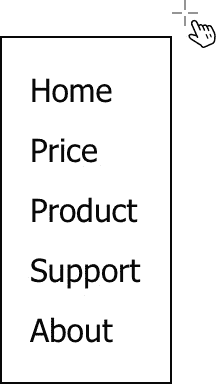

# *第九章*：使用自定义钩子重用逻辑

在上一章中，我们学习了 `useRef` 钩子的设计和如何使用引用来更新状态而不刷新屏幕。在这一章中，我们将汇集到目前为止所学的所有钩子，并看看如何创建一个自定义钩子来满足我们的需求。我们将介绍什么是自定义钩子，然后逐步编写一些自定义钩子，包括 `useToggle`、`useWindow`、`useAsync`、`useDebounced`、`useClickOutside`、`useCurrent` 和 `useProxy`。

在这一章中，我们将涵盖以下主题：

+   复习 React 钩子

+   `useToggle`

+   `useWindow`

+   `useAsync`

+   `useDebounced`

+   `useClickOutside`

+   `useCurrent`

+   `useProxy`

+   问题和答案

# 复习 React 钩子

我们已经看到了 *React* 提供的许多钩子。让我们花点时间回顾一下我们到目前为止学到了什么：

+   使用 `useState` 钩子更新状态。

+   使用 `useEffect` 钩子处理副作用。

+   使用 `useMemo` 钩子重用最后一个值。

+   使用 `useContext` 钩子更新区域。

+   使用 `useRef` 钩子隐藏显示内容。

`useState` 钩子是最受欢迎的，用于定义状态并使其可触发 *UI* 更新。*React* 希望我们使用这个作为与屏幕同步的主要机制。使用它的一个心理图像是，只要状态发生变化，*UI* 就应该相应地产生结果。否则，*UI* 应保持不变。本质上，这意味着要在屏幕上发生某些事情，设计一个状态并将其与元素连接起来。这是 *React* 的方式。如果你以此为基准，可以帮助你理解其他任何东西。

`useEffect` 钩子允许我们监听状态变化，基于此，我们可以执行一个动作，例如副作用。因此，有了它，你就有两种方式在屏幕上产生某些事情，即监听事件或状态变化。这里的微妙之处在于，副作用不会在更新后所有 *DOM* 元素都稳定下来之前应用。另外，别忘了清理副作用，如果有的话。

`useMemo` 钩子作为一个优化，使我们能够使用在之前更新中评估的值。基本设置是，如果状态已更改，它应该驱动另一轮更新。在那个更新中，所有组件变量都应该得到更新。但如果我们有意重用旧值，值似乎会“跳过”更新。这样，我们可以抑制一些与组件更新无关的高频动作。

当涉及到区域更新时，`useContext` 钩子是必不可少的。一个 `useState` 钩子可以将状态发送到某个地方，但它缺少两件事。一是需要使用属性将状态进一步发送到子组件，二是需要知道它将属性发送给哪些子组件。一旦建立上下文，任何在其下的子组件都可以消费它，无论层级有多深。并且它支持按需使用——你消费时才使用它。

`useRef` 钩子是 *React* 支持的一种绕过 *React* 引擎的方式。默认情况下，*React* 会希望对所有的状态变化做出反应。`useRef` 钩子允许你继续持久化这个值，而不需要更新能力。因此，`useRef` 钩子可以在 *React* 无法或不允许我们触及的地方变得非常有用。

前面的钩子并不是 *React* 钩子集合的全部。实际上，*React* 有十几个内置的钩子；例如，`useCallback`、`useLayoutEffect`、`useTransition` 和 `useDeferredValue`，其中一些也处于 *React* 未来并发模式的实验阶段。

我们到目前为止所涵盖的钩子有一个独特之处。每个钩子都是独特的，并且每个钩子都是为了一个原子目的而设计的。它们之间没有太多的重叠。当我们想要在我们的应用程序中混合和匹配它们时，这为我们提供了一个坚实的基础，正如我们在前面的章节中已经看到的。

当涉及到构建网站时，可能会有时候你想创建一些可能不被这些内置钩子覆盖的自定义逻辑。你可能考虑扩展一些钩子，或者你可能甚至想重写一个或两个。在这种情况下，我们有什么选择？这个问题的答案在下一节中。

## 创建一个新的钩子

我们能否创建一个新的钩子？在每一章的前面，我们都要求你阅读源代码，所以到现在，你应该熟悉每个钩子是如何在底层实现的。那么，我们能否遵循同样的过程并创建一个呢？不幸的是，这并不那么容易，主要是因为这个过程并不允许即时扩展。

用游戏引擎作类比，它允许你处理动画、材质、灯光，甚至游戏逻辑，但它不允许你更改引擎。例如，你不能添加一个既不是动画也不是材质的自定义身份类型，并仍然期望游戏引擎能够识别它。你可能会问“为什么不能？”这是因为自定义身份类型需要引擎进行额外的实现以支持它。

注意

*React* 是一个开源项目，这意味着任何人都可以为引擎做出贡献。源代码也由 *Facebook React* 团队积极维护，他们一直在寻找新的提案和功能请求。

虽然引擎不容易扩展，但创建自定义钩子的门并没有关闭。大多数时候，我们不需要新的钩子类型，而是希望有一个具有扩展行为的钩子。让我们来看一个例子：

```js
const aFunctionWrittenByOthers = () => {}
```

给定前面的函数，我们可以轻松地将其封装在一个新的函数中：

```js
const aFunction = () => {
  aFunctionWrittenByOthers()
  ...
}
```

钩子是一个函数。如果一个钩子被设计用来管理状态，每次我们需要状态时，我们就不需要重新发明它；同样，如果一个钩子被设计用来处理副作用，每次我们需要副作用时，我们可以通过调用它来采用这些功能。所以，只要我们设计的钩子足够有用和可用，我们就应该能够直接在我们的函数中使用它。这就是可重用性的基本思想。

让我们看看下面的例子：

```js
const useUsername = (initialFirst, initialLast) {
  const [firstName, setFirstname] = useState(initialFirst)
  const [lastName, setLastname] = useState(initialLast)
  const fullname = firstName + ' ' + lastName 
  return { fullname, setFirstname, setLastname }
}
```

在前面的函数中，`useUsername`使用了两次`useState`钩子，输出包括来自两个状态`firstName`和`lastName`的联合`fullname`，以及两个单独的派发函数来更新它们。

让我们更仔细地检查一下`useUsername`函数，因为`useUsername`是一个自定义钩子。

## 编写自定义钩子

我们现在可以使用我们刚刚创建的`useUsername`函数如下：

```js
const Title = () => {
  const { fullname } = useUsername('John', 'Doe')
  ...
}
```

将前面两个版本与或没有`useUsername`钩子的版本进行比较，我们可以看到`useUsername`函数基本上是通过代码重构提取的一个实用函数，其中新`useUsername`函数的接口以两个字符串作为输入参数，以及一个包含字符串和两个函数的对象作为返回值。

这正是我们最初创建新函数的方式。我们创建函数是因为我们需要它，或者因为我们看到代码中存在一些重复，我们可以通过一些重构来避免重复。这样，代码不仅会变得整洁，而且函数还可以在未来的其他地方使用。重构更像是一种一石二鸟的方法，只要有多只鸟要打。

这是计算机科学 101，我们迄今为止创建的自定义钩子是它的一个演示。好，让我们回顾一下自定义钩子的一些基本概念。

我们之所以称`useUsername`为自定义钩子，是因为它满足以下要求：

+   它是一个函数。

+   它以`use`为前缀命名。

+   它至少消耗了一个内置钩子。

显然，我们可以编写一个函数并随意给它一个以`use`为前缀的名字，但这样的函数是否算作自定义钩子呢？让我们看看下面的函数：

```js
const useNotAHook = (a) => {
  return a
}
const Title = () => {
  return useNotAHook()
}
```

在前面的设置中像`useNotAHook`这样的函数不是钩子！我们不是一直在说钩子是一个函数吗？是的，但并非所有函数都是钩子，即使它在功能组件内部被调用，比如在`Title`组件中。`useNotAHook`仅仅是一个普通函数。

你可能会想，“好吧，我们需要让函数变得更复杂才能算作自定义钩子。”让我们尝试以下函数：

```js
const useValue = (v) => {
  const [value] = useState(v)
  return value
}
```

前面的函数中只有两行，所以它并不复杂。它只取`useState`钩子的第一部分并返回状态。就是这样。但它是自定义钩子吗？是的，它是。所以，自定义钩子不必很复杂！

希望到现在为止，你看这些令人费解的例子时不会感到头晕。简而言之，按照惯例，一个自定义钩子需要满足之前列出的所有要求。

从技术上讲，自定义钩子和常规函数之间唯一的区别是它至少使用了一次内置钩子。内置钩子有什么特别之处呢？内置钩子“钩入 React”并提供了一些你无法在不打开引擎的情况下实现的功能。这里的功能主要指的是管理持久状态。这就是“自定义”这个名字的由来，用来区分你创建的钩子和内置钩子。

在我们开始创建自定义钩子之前，还有另一个值得注意的独特之处。大多数自定义钩子都是没有附带任何视觉表示的。因此，自定义钩子本质上是一段可重用的算法。

这是 React 团队构想的钩子可以为我们带来的。钩子“让你可以在组件之间重用逻辑。”当你创建自定义钩子时，请记住这一点。如果你觉得逻辑足够通用，或者至少你认为还有其他地方可以应用相同的逻辑，那么是我们尝试使用自定义函数的时候了。如果它最终使用了内置钩子之一，那么你就可以创建一个自定义钩子了。

现在我们有了基本的概念，回顾一下，如果我们回顾这本书中迄今为止所写的代码，我们会发现我们可能在不自知的情况下上了这艘船。让我们重新审视它。

# useToggle

在这个自定义钩子中使用的钩子：`useState`

以一个例子为例，我们已经有在`true`和`false`之间切换状态的想法有一段时间了。我们用它来处理可切换的情况，比如切换复选框、悬停在文本上、引发错误，或者任何模拟开关灯的行为。参见*图 9.1*中的一个用法：


图 9.1 – useToggle

我们能否将这个想法抽象化，提供这样的布尔状态以及切换功能？让我们开始重构：

```js
const useToggle = (initialStatus = false) => {
  const [status, setStatus] = useState(initialStatus)    
  const toggle = () => {
    dispatch(status => !status)
  )    
  return [status, toggle]
}
```

在前面的代码块中，`useToggle`自定义钩子接受一个`initialStatus`作为输入参数，默认值为`false`，并返回`status`和一个`toggle`函数。调用`toggle`函数会将`status`从`false`切换到`true`，或者从`true`切换到`false`。

`useToggle`钩子有一个设计得很好的函数，具有定义明确的输入参数和返回值，看起来非常适合支持布尔状态的切换。这里我们可以做一些小的改进。有时，我们还想切换到特定的状态，而不仅仅是翻转：

```js
    const toggle = (newStatus) => () => {
      if (newStatus === undefined) {
        setState(status => !status)
      } else {
        setState(newStatus)
      }
    }
```

在`toggle`的前一个修订版本中，当给出`newStatus`时，它会切换到该特定状态，否则，它会像旧的`toggle`一样翻转。注意我们使用了一行中的双箭头，如`() => () => {}`：

```js
const toggle = (newStatus) => {
      return () => {
        …
      }
    }
```

如果我们慢慢写，我们可以使用前面的等效版本，其中可以清楚地看到从函数中返回了一个内联函数，因为在这种情况下，我们期望`toggle`返回的是一个事件处理器。

返回函数的函数在**函数式编程**（**FP**）中非常常见。尽管这本书并没有强烈要求使用 FP（或者可能已经做到了），但在*React*代码中使用 FP 是很自然的，尤其是在处理函数组件时。

好的，现在我们已经设计了自定义钩子，让我们来试一试。

## 用法

假设我们将这个`useToggle`钩子应用到可以切换`error`状态的`Avatar`组件中。`Avatar`组件在*第四章*中介绍，*使用状态启动组件*：

```js
Const Avatar = ({ src, username }) => {
  const [error, onError] = useToggle()
  return (
    <AvatarStyle>
      {error ? (
        <div>{username}</div>
      ) : (
        
      )}
    </AvatarStyle>
  )
}
```

很有趣！尽管在应用`useToggle`前后没有太大的差异，但在图像加载遇到错误后，`error`状态被切换的逻辑变得相当清晰。

操场 – 使用 useToggle 的 Avatar

欢迎自由地在这个在线示例中尝试[`codepen.io/windmaomao/pen/yLozOJQ`](https://codepen.io/windmaomao/pen/yLozOJQ)。

让我们尝试在另一个地方应用`useToggle`，比如在也介绍在*第四章*中的`Tooltip`组件中，*使用状态启动组件*：

```js
const Tooltip = ({ children, tooltip }) => {
  const [entered, onEntered] = useToggle()
  return (
    <TooltipStyle>
      <div
        onMouseEnter={onEntered(true)}
        onMouseLeave={onEntered(false)}
      >
        {children}
      </div>
      {entered && (
        <div className="__tooltip">
          {tooltip}
        </div>
      )}
    </TooltipStyle>
  )
```

在前面的代码中，我们使用了`useToggle`来返回一个`entered`状态和一个`onEntered`函数，这个函数可以很好地输入到`onMouseEnter`和`onMouseLeave`事件处理器中。

操场 – 使用 useToggle 的工具提示

欢迎自由地在这个在线示例中尝试[`codepen.io/windmaomao/pen/QWMqNKx`](https://codepen.io/windmaomao/pen/QWMqNKx)。

通过`useToggle`钩子，切换机制的概念得到了生动的揭示。函数可以单独测试，并且可以相对容易地扩展。如果我们经常使用这个钩子，创建和维护它的成本甚至可以更低。

## 参考文献

在互联网上，有许多人编写了类似于`useToggle`的类似钩子。以下是一些供你参考的列表，以便你了解更多关于这个自定义钩子的信息：

+   `useToggle`: [`usehooks.com/useToggle/`](https://usehooks.com/useToggle/).

+   `react-use-toggle`: [`github.com/bsonntag/react-use-toggle`](https://github.com/bsonntag/react-use-toggle). 它有一个很好的测试。

# useWindow

在此自定义钩子中使用的钩子：`useState`和`useEffect`

文本或图像可以根据当前浏览器窗口大小调整其外观。我们在*第五章*中实验了这个想法，*使用 Effect 处理副作用*。见*图 9.2*。


图 9.2 – useWindow 自定义钩子

现在的问题是：我们能否将这个想法抽象出来，并将其应用于屏幕上的任何地方，就像响应式设计一样？让我们稍微重构一下代码，以提出一个自定义的`useWindow`钩子：

```js
const useWindow = (size = 0) => {
  const [width, setWidth] = useState(0) 
  useEffect(() => {
    function handleResize() {
      setWidth(window.innerWidth)
    }    
    handleResize()    
    window.addEventListener("resize", handleResize)
    return () => { 
      window.removeEventListener("resize", handleResize)
    }
  }, [setWidth])  
  return [width, width > size]
}
```

前面的 `useWindow` 钩子是从我们之前的代码中提取出来的，并返回屏幕的当前宽度。使用 `useEffect` 来处理浏览器 `resize` 事件上的初始化和清理系统事件。在每次屏幕调整大小时，窗口的 `innerWidth` 被存储在 `width` 状态中。

为了使其易于使用，我们可以向这个自定义钩子提供输入参数 `size`，这样它也可以告诉我们 `width` 是否超过了那个 `size`，从而告诉我们屏幕是否足够宽以支持大尺寸版本。

## 用法

让我们将这个自定义钩子应用到当屏幕尺寸达到 600 *px* 时可以调整为大版本的文本：

```js
const Greeting = () => {
  const [, wide] = useWindow(600)
  return <h1>{wide ? "Hello World" : "Hello"}</h1>
}
```

这看起来非常容易使用，而且更重要的是，与检测窗口尺寸相关的功能完全被提取出来并外包给 `useWindow` 钩子，因此大大减少了代码量。

操场 – 使用 useWindow 响应式

欢迎自由地在这个在线示例中玩耍 [`codepen.io/windmaomao/pen/zYdEqog`](https://codepen.io/windmaomao/pen/zYdEqog).

这个自定义钩子有一个独特之处。与 *CSS* 支持的经典 `media-query` 不同，`useWindow` 返回的 `wide` 标志用于完全更改布局。这意味着我们可以支持非常剧烈的屏幕变化以适应屏幕尺寸：

```js
const Header = () => {
  const [, wide] = useWindow(725)
  return wide ? <HeaderWide /> : <HeaderMini />
}
```

在前面的代码中，`HeaderWide` 和 `HeaderMini` 是两个完全不同的布局组件，用于显示小于 `725` 和大于 `725` 的屏幕尺寸的标题。

从制作这个自定义钩子的过程中，我们学到的一点是，功能可以根据您的目的进行定制。在这里，我们导出一个标志，`width > size`，因为我们认为它对当前项目很有用。然而，响应性设置不是固定的，它可以因项目而异。这并不会阻止我们在当前时刻创建一些有用的东西。这正是代码重构的意义，即提高代码质量。

## 参考资料

我们版本的 `useWindow` 只监控窗口宽度，但我们也可以跟踪屏幕的宽度和高度，如下面的参考实现所示：

+   `useWindowSize`: [`usehooks.com/useWindowSize/`](https://usehooks.com/useWindowSize/)

+   `useWindowSize`: [`github.com/jaredLunde/react-hook/tree/master/packages/window-size`](https://github.com/jaredLunde/react-hook/tree/master/packages/window-size)

# useAsync

在此自定义钩子中使用的钩子：`useState`, `useEffect`, `useRef`, 和 `useMemo`

每个人都希望尝试的钩子之一是 `useAsync`，它用于获取异步资源，正如我们在*第五章*中介绍的，*使用 Effect 处理副作用*。参见 *图 9.3*：


图 9.3 – useAsync 钩子

虽然听起来很简单，但每个人对他们的项目都有不同的要求和实现。以下是我们希望拥有的几个功能：

+   支持加载指示器。

+   可按需执行。

+   支持错误处理。

+   可以取消异步调用。

+   可以缓存异步数据。

功能列表可以一直继续。在这本书中，我将提供一个支持前两项的基本版本。

在任何时刻，调用都应该知道`loading`状态，并且当资源解析完成后，`data`应该可用以供使用。此外，我们希望保留对`execute`函数的引用，以防我们想要再次获取资源。让我们通过自定义钩子来设计它：

```js
const useAsync = (
  asyncFunc, 
  initialParams = {},
  immediate = true
) => {
  ...
  return { execute, loading, data }
}
```

在先前的代码块中，`useAsync`钩子接受三个输入参数，`asyncFunc`、`initialParams`和`immediate`，并返回三个属性，`execute`、`loading`和`data`。`asyncFunc`函数是一个用户提供的异步函数，例如一个*Promise*，如下定义：

```js
const fn = ({ id }) => {
  return fetch('/anAPIResource/${id}')
    .then(res => res.json())
}
```

在先前的`fn`承诺中，一个`id`作为输入参数发送。这就是`useAsync`的第二个输入参数变得有用的地方，它可以用来以键/值对的形式提供`initialParams`，例如`{ id: 3 }`。

`useAsync`钩子还支持一个可选的标志`immediate`，当设置为`true`时，它会在组件挂载后立即调用异步调用。尽管这是最常见的情况，但我们也可以将其设置为`false`，这样我们就可以稍后手动调用`execute`。

在钩子内部，我们使用状态来模拟`loading`和`data`：

```js
  const [loading, setLoading] = useState(immediate)
  const [data, setData] = useState(null)
  const mountedRef = useRef(true)
```

使用`useRef`来为`mountedRef`提供信息，以知道何时这个组件被卸载；我们已在*第八章*，“使用 Ref 隐藏内容”中解释了这一点。

为了提供按需获取资源的能力，我们创建了一个`execute`函数，它接受一个`params`对象：

```js
  const execute = params => {
    setLoading(true)
    return asyncFunc({
      ...initialParams,
      ...params
    }).then(res => {
      if (!mountedRef.current) return null
      setData(res)
      setLoading(false)
      return res
    })
  }
```

在先前的`execute`函数中，将`loading`设置为`true`，这样如果我们将一个加载指示器与之连接，它就可以开始旋转。然后它使用`params`和`initialParams`的组合调用`asyncFunc`，这样`params`就可以覆盖`initialParams`设置的任何键。

当资源解析并返回时，我们首先通过`mountedRef`检查组件是否仍然挂载，如果不是，我们跳过以避免内存泄漏。否则，它将根据需要设置`data`，并通过将`loading`设置为`false`来关闭加载指示器。

这里还有一个细微之处，我们希望使用这个`execute`函数的一个版本，而不是在每次更新时使用一个新的实例，因此，我们可以在这里应用`useMemo`来实现这一点：

```js
  const execute = useMemo(() => params => {
    setLoading(true)
    return …  
  }, [asyncFunc, setData, setLoading])
```

当`immediate`设置为`true`时，我们希望在挂载后立即调用获取操作，这通过`useEffect`钩子得到支持：

```js
  useEffect(() => {
    if (immediate) {
      execute(initialParams)
    }
  }, [immediate, execute])
```

为了确保我们不遇到内存泄漏，我们还需要在组件卸载时将`mountedRef`设置为`false`。这是通过另一个`useEffect`来完成的：

```js
  useEffect(() => {
    return () => {
      mountedRef.current = false
    }
  }, [mountedRef])
```

通过这些更改，这个自定义的`useAsync`钩子对于一般资源获取来说功能丰富。让我们试一试。

## 用法

现在让我们将`useAsync`自定义钩子应用到`Title`组件上，看看我们如何可以预加载一些来自*API*的信息：

```js
const fn = () => fetch("google.com")
const Title = () => {
  const { data, loading } = useAsync(fn)
  if (loading) return 'loading ...'
  if (!data) return null 
  return <div>loaded</div>
}
```

在前面的代码中，异步函数立即被调用。在挂载后，它显示`null`，在获取过程中显示`loading...`，在获取成功后显示`loaded`。在这个简单的情况下，我们添加了两个短路路径：

```js
  if (loading) return 'loading ...'
```

在加载时，我们切换到加载状态；这是你可以安装一个漂亮的（内联）加载器或旋转器的位置：

```js
  const spinner = <Spinner >  
  …
  if (loading) return spinner
```

无论加载是否尚未开始或获取失败，只要数据不可用，我们就在屏幕上不显示任何内容：

```js
  if (!data) return null
```

这种逻辑可以有效地防止用户看到任何不完整或错误的数据。

Playground – 使用 useAsync 获取

欢迎在线尝试这个示例[`codepen.io/windmaomao/pen/jOLaOxO`](https://codepen.io/windmaomao/pen/jOLaOxO)。

好的，让我们尝试一个初始不进行获取的案例。相反，我们从用户交互中获取一个任意的`id`资源，例如表格行中的**删除**按钮：

```js
const fn = ({ id }) => fetch('google.com/${id}')
const Title = () => {
  const {
    execute, data, loading
  } = useAsync(fn, {}, false)  
  const onClick = id => () => {
    execute({ id })
  }  
  if (loading) return 'loading ...'  
  return data ? <h1>{data}</h1> : (
    <button onClick={onClick(3)}>Load 3</button>
  )
}
```

在前面的例子中，`fetch`承诺被修改为接受`id`作为输入。我们在事件处理程序`onClick`内部手动使用`execute`，其中使用给定的`id`获取资源。

Playground – 使用 useAsync 手动获取

欢迎在线尝试这个示例[`codepen.io/windmaomao/pen/GRvOgoa`](https://codepen.io/windmaomao/pen/GRvOgoa)。

## 参考资料

我们提供的`useAsync`钩子作为学习目的的基本模板。如果你对你的项目需要更多功能，你可以在以下参考资料中找到更多：

+   `useAsync`: [`usehooks.com/useAsync/`](https://usehooks.com/useAsync/)

+   Hooks Async: [`github.com/dai-shi/react-hooks-async`](https://github.com/dai-shi/react-hooks-async)

+   获取库：[`github.com/marcin-piela/react-fetching-library`](https://github.com/marcin-piela/react-fetching-library)

+   Vercel SWR: [`swr.vercel.app/`](https://swr.vercel.app/) – 支持缓存和服务器集成

+   React Query: [`github.com/tannerlinsley/react-query`](https://github.com/tannerlinsley/react-query)

# useDebounced

在此自定义钩子中使用的钩子：`useState`、`useEffect`和`useRef`

在*第六章*，“使用 Memo 提升性能”中，我们遇到了一个非常有趣的实现，其中我们防抖了用户的按键，这样我们就不太频繁地调用重操作（如搜索）。


图 9.4 – useDebounced 钩子

出现的一个模式是，对于给定状态，无论我们通过分发来改变它，我们都需要等待一段时间，以确保这是采取行动的正确时机。因此，本质上我们想要设计一个新的状态，作为给定状态的防抖版本。让我们尝试在自定义的`useDebounced`钩子中捕捉这个模式：

```js
const useDebounced = (oldState, duration) => {
  const [state, dispatch] = useState(oldState)
  const invokeRef = useRef(null) 
  useEffect(() => {
    invokeRef.current = setTimeout(() => {
      dispatch(oldState)
    }, duration)   
    return () => {
      clearTimeout(invokeRef.current)
    }
  }, [oldState, duration]) 
  return state
}
```

在前面的代码块中，`useDebounced` 钩子被设计为接受两个输入参数，即 `oldState` 和防抖持续时间的 `duration`。钩子返回一个新的带有防抖值的 `state`。

实际上不能重用 *Lodash* 库中的 `debounce` 函数，因此在这里重新创建了 `debounce` 功能。新状态频率由 `useEffect` 控制。每当 `oldState` 发生变化时，它都会启动一个 `setTimeout`，要求在一定的 `duration` 后运行回调函数。

在这里，我们使用 `useRef` 确保我们可以在组件的生命周期内跟踪 `setTimeout` 的持久函数处理。在现在和持续时间结束之间，如果另一个变化发生，它将通过 `clearTimeout` 取消之前的 `setTimeout`，从而防止变化应用到 `state` 上。只有当其中一个 `setTimeout` 成功调用时，`oldState` 的变化才会应用到 `state` 上。

在某种程度上，`oldState` 和 `state` 之间会有一点滞后。让我们试一试，看看我们如何使用这个 `useDebounced` 钩子。

## 用法

让我们看看它如何在需要根据用户输入执行搜索的 `Title` 组件中使用：

```js
const Title = () => {
  const [text, setText] = useState('')
  const query = useDebounced(text, 300)
  const matched = useMemo(() => {
    return fruites.filter(v => v.includes(query))
  }, [query]) 
  const onChange = e => {
    const t = e.target.value
    setText(t)
  }
  return (
    <>
      <input value={text} onChange={onChange} />
      {matched.join(',')}
    </>
  )
}
```

在前面的代码中，一个 `text` 状态被发送到 `useDebounced` 以形成一个新的 `query` 状态：

```js
  const query = useDebounced(text, 300)
```

由于 `query` 状态更新频率较低，我们可以通过 `useMemo` 将其连接到 `filter`，因为否则 `text` 状态可以通过 `onChange` 非常快速地更新。从某种意义上说，我们通过 `query` 创建了一个状态事件，以便根据不同频率的两个数据流更新 *UI*。

操场 – 使用 useDebounced 进行搜索

欢迎您在此在线示例中自由尝试 [`codepen.io/windmaomao/pen/bGrYNmB`](https://codepen.io/windmaomao/pen/bGrYNmB)。

从这个 `useDebounced` 自定义钩子中，我们可以看到一个由监听状态变化而创建的人工事件，其作用可以与物理事件一样有用。

### 参考文献

要了解更多关于 `useDebounced` 钩子的信息，这里为您提供了参考链接：

+   `useDebounce`: [`usehooks.com/useDebounce/`](https://usehooks.com/useDebounce/).

+   `useDebounce`: [`github.com/xnimorz/use-debounce`](https://github.com/xnimorz/use-debounce). 该功能支持所有防抖选项。

# useClickOutside

在此自定义钩子中使用的钩子：`useEffect`

在 *第八章*，*使用 Ref 隐藏内容* 中，我们了解了一个可以检测用户点击组件外部的案例。这个功能相当通用，我们想在项目的各个部分利用这个功能，例如关闭模态或工具提示 – 见 *图 9.5*。



图 9.5 – useClickOutside 钩子

让我们看看我们能否对旧代码进行一些重构，并将其转换为自定义的 `useClickOutside` 钩子：

```js
function useClickOutside(ref, handler) {
  useEffect(() => {
    const evt = e => {
      if (!ref.current) return 
      if (!ref.current.contains(e.target)) {
        handler && handler()
      }
    }  
    window.addEventListener("mousedown", evt)      
    return () => {
      window.removeEventListener("mousedown", evt)
    }
  }, [ref, handler])
}
```

`useClickOutside`钩子接受两个输入参数，第一个是一个元素的`ref`，第二个是在检测到外部点击后要调用的回调`handler`。注意这个钩子不返回任何值。

使用`useEffect`来管理一个`mousedown`事件，如果点击在组件内部，则阻止处理程序被调用。我们基本上将我们的旧代码放入一个单独的函数中。让我们试试看。

## 用法

我们可以在一个`Menu`组件上尝试`useClickOutside`：

```js
const Menu = ({ on, dismiss }) => {
  const ref= useRef()
  useClickOutside(ref, toggle(false))   
  if (!on) return null
  return (
    <ul ref={ref}>
      <li>Home</li>
      <li>Price</li>
      <li>Product</li>
      <li>Support</li>
      <li>About</li>
    </ul>
  )
}
```

这次我们设置了`Menu`以支持两个输入参数。一个是`on`标志，另一个是`dismiss`函数。这两个都通过 props 提供，以便`Menu`可以被父组件驱动：

```js
const App = () => {
  const [on, toggle] = useToggle(true)  
  return (
    <Menu
      on={on}
      dismiss={toggle(false)}
    </>
  )
}
```

在前面的`App`组件中，我们使用了一个自定义钩子中之前构建的`on`状态，为我们提供了一个布尔值以及一个`toggle`函数。我们使用它们来驱动一个`Menu`。太棒了，我们立刻开始使用自己的自定义钩子。最初，`on`被设置为`true`，表示`Menu`被显示。点击其外部任何地方都会使其消失。

Playground – 使用 useClickOutside 的 Menu

欢迎在此在线示例[`codepen.io/windmaomao/pen/qBXVdOe`](https://codepen.io/windmaomao/pen/qBXVdOe)中玩耍。

## 参考文献

要了解更多关于`useClickOutside`钩子的信息，这里有一些参考链接供您参考：

+   `useOnClickOutside`：[`usehooks.com/useOnClickOutside/`](https://usehooks.com/useOnClickOutside/)

+   `useClickOutside`：[`github.com/ElForastero/use-click-outside`](https://github.com/ElForastero/use-click-outside)

# useCurrent

在此自定义钩子中使用的内置钩子：`useState`

当使用`useState`时，我们遇到了很多问题，阻止了新用户正确理解如何使用它，主要是由于继承的滞后行为，因为状态值在分发后不会立即改变。

```js
const [state, dispatchState] = useState(0)
```

在上一行，如果我们理解`dispatchState`函数是用来分发和请求更改的，那么我们不需要做太多，因为这就是*React*设计`useState`的方式。然而，我们通常倾向于有不同的想法：

```js
const [state, setState] = useState(0)
```

前面的`setState`名称是我们陷入麻烦的主要原因，因为在这里我们期望`state`在`setState`语句之后立即改变。

在*第八章*，“使用 Ref 隐藏内容”，我们使用了一个`useRef`来定位当前值。解决这个问题有两种不同的方法：一种是为保持指向当前值设计一个容器，另一种是为在需要时提供一个获取当前值的访问函数。这次让我们尝试第二种方法：

```js
function useCurrent(initialState) {
  const [obj, setObj] = useState({ state: initialState })  
  const dispatch = newState => {
    if (obj.state !== newState) {
      obj.state = newState
      setObj({ …obj })
    }
  }  
  const getState = () => obj.state
  return [getState, dispatch]
}
```

在前面的自定义`useCurrent`钩子中，它将状态存储在`obj`的`state`属性下。当你需要找出状态时，你可以调用`getState`函数，当你需要更新状态时，你执行`dispatch`，就像以前一样。在这里，我们必须手动管理`obj`，如果我们发现`newState`与当前的`obj.state`没有不同，我们就跳过这个分发。

## 用法

让我们为我们的 3 秒延迟点击示例试一试：

```js
const Title = () => {
  const [getCount, setCount] = useCurrent(0)  
  const onClick = () => {
    setTimeout(() => {
      setCount(getCount() + 1)
    }, 3000)
  } 
  return <button onClick={onClick}>{getCount()}</button>
}
```

上述代码显示，这次代码简化了一些，因为我们不需要引用（ref）来跟踪当前值。相反，我们使用自定义的`useCurrent`来管理状态。最大的不同之处在于，每次我们需要找出`count`时，我们需要调用从钩子返回的`getCount`。好处是我们不再需要总是想知道当前的`count`是什么了。

操场 – 使用`useCurrent`的当前状态

欢迎尝试这个在线示例：[`codepen.io/windmaomao/pen/VwzrvBX`](https://codepen.io/windmaomao/pen/VwzrvBX)。

## 参考资料

查看这些链接，了解人们从不同角度如何解决这个问题：

+   使用引用状态：[`scastiel.dev/posts/2019-02-19-react-hooks-get-current-state-back-to-the-future/`](https://scastiel.dev/posts/2019-02-19-react-hooks-get-current-state-back-to-the-future/)

)

+   `useStateRef`: [`github.com/Aminadav/react-useStateRef`](https://github.com/Aminadav/react-useStateRef)

+   `useRefState`: [`github.com/alex-cory/urs`](https://github.com/alex-cory/urs).

+   使用安全状态：[`ahooks.js.org/hooks/advanced/use-safe-state/`](https://ahooks.js.org/hooks/advanced/use-safe-state/). 这实现了安全状态。

# useProxy

在此自定义钩子中使用的内置钩子：`useState`、`useEffect`和`useRef`

要修复或改进*React*状态背后的思考永无止境。一个有趣的想法来自这个问题：“为什么我们不能直接对状态进行普通的赋值，而不是使用分发方法？”阻碍我们的一个技术问题是我们不能在没有对象或某些东西来保存状态的情况下进行赋值。因此，如果我们允许在类似以下方式的对象下存储属性：

```js
  const p = useProxy({ count: 0, text: '' })
```

然后，我们可以将一个分发（dispatch）转换为一个如下所示的赋值（assignment）：

```js
  p.count++
  p.text = 'Hello World'
```

让我们看看如何借助*ES6*引入的*Proxy*来设计这样的东西：

```js
const useProxy = (initialObj) => {
  const [,dispatch] = useState(initialObj)  
  const [obj] = useState(new Proxy(initialObj, {
    get: function() {
      return Reflect.get(...arguments)
    },
    set: function(obj, prop, value) { 
      if (obj[prop] !== value) {
        obj[prop] = value
        dispatch({ ...obj })
      }
      return true
    }    
  })) 
  return obj
}
```

上述自定义`useProxy`钩子采用了与`useCurrent`钩子类似的方法，将`initialObj`存储到状态中，但同时也创建了一个带有 Proxy 的特殊对象。不深入探讨 Proxy 的使用细节，这个特殊对象基本上捕捉了读取和写入任何属性的读写时刻，通过两个函数调用，`get`和`set`。在这里，我们并不关心`get`，所以它回退到默认行为，而`set`则用新版本覆盖了默认行为：

```js
      set: function(obj, prop, value) {        
        if (obj[prop] !== value) {
          obj[prop] = value
          dispatch({ ...obj })
        }
        return true
      }
```

前面的代码会在任何类似 `obj.prop = value` 的语句中被调用。其实现与 `getCurrent` 钩子非常相似，它会检查新的 `value` 是否与存储的 `obj[prop]` 不同，并在必要时进行分派。

由于我们正在跟踪对象属性下的几个状态，因此添加一个 `mountRef` 标志以防组件卸载后出现问题是有意义的：

```js
const useProxy = (initialObj) => {
  ...
  const mountRef = useRef(true)
  useEffect(() => {
    return () => {
      mountRef.current = false
    }
  })  
  ...
}
```

给定一个 `mountRef`，我们可以修改 `set` 来禁用它以避免内存泄漏：

```js
      set: function(obj, prop, value) { 
        if (!mountedRef.current) return false
        ...
      }
```

好的，有了所有这些功能，让我们将它们组合起来并试一试。

## 用法

`useProxy` 钩子功能更强大，但它要求你将所有值放在一个对象下，这对于表单处理特别有用：

```js
const Form = () => {
  const form = useProxy({ count: 0, text: '' })
```

在前面的 `Form` 组件中，我们定义了一个 `form` 对象来保存两个状态，`count` 和 `text`。让我们先看看我们如何现在增加一个数字：

```js
  const onClick = () => { ++form.count }
  return(
    <div>
      <h1>Count: { form.count }</h1>  
      <button onClick={onClick}>Increment</button>
    </div>
  )
```

在前面的代码中，计数是从 `form.count` 显示的，但在增加它时，我们只需简单地做 `++form.count`。本质上，这相当于以下任何一个：

```js
  form.count += 1
  from.count = form.count + 1
```

从使用体验来看，我们不需要记住什么是分派；我们只需要进行一个普通的赋值。自定义的 `useProxy` 钩子会为我们处理分派。

这个自定义钩子带来的另一个优点是，从现在起，`set` 和 `get` 都是通过同一个对象 `form` 完成的。这意味着如果我们需要让子组件处理一个表单元素，我们就不需要像通常那样发送两个部分。让我们看看另一个使用其他 `text` 状态的例子：

```js
const Text = (({ form }) => {
  const onChange = e => {
    form.text = e.target.value
  }  
  return (
    <input
      value={form.text}
      onChange={onChange} 
    />
  )
})
const Form = () => {
  const form = useProxy({ count: 0, text: '' })  
  return(
    <div>
      <Text form={form} />
    </div>
  )
}
```

在前面的例子中，我们定义了一个 `Text` 组件来处理文本输入。注意我们只需要通过属性传递 `form`。在 `Text` 组件内部，文本的显示和赋值都是通过 `form.text` 管理的。非常方便，不是吗？

游戏场 – 使用 useProxy

欢迎在 [`codepen.io/windmaomao/pen/eYEeZmL`](https://codepen.io/windmaomao/pen/eYEeZmL) 上尝试这个在线示例。

`useProxy` 钩子确实要求我们使用一个对象来管理状态，但一旦你接受了这种方法，你可能会觉得像平常一样编码，而无需处理 *React* 状态的麻烦。

## 参考

+   Valtio：[`github.com/pmndrs/valtio`](https://github.com/pmndrs/valtio)

+   使用状态代理：[`github.com/beenotung/use-state-proxy`](https://github.com/beenotung/use-state-proxy)

+   代理状态：[`github.com/windmaomao/proxy-state`](https://github.com/windmaomao/proxy-state)

# 摘要

在本章中，我们总结了迄今为止我们介绍的所有 *React* 内置钩子，然后继续介绍如何创建自定义钩子。然后，一旦我们理解了这个概念，我们就回顾了本书中编写的所有代码，并将其中一些转换成了自定义钩子，包括 `useToggle`、`useWindow`、`useAsync`、`useDebounced`、`useClickOutside`、`useCurrent` 和 `useProxy`。

在下一章中，我们将了解 *React* 如何将所有不同类型的网络资源整合起来，并协调它们来构建一个网站。

# 问答

这里有一些问答来帮助你巩固知识：

1.  什么是 *React* 内置钩子？

    *React* 内置钩子指的是由 *React* 设计的所有钩子，包括 `useState`、`useEffect` 等等。你无法即时创建一个内置钩子，但你可以提出你的想法并向 *React* 核心团队发送拉取请求以供审查。

1.  什么是自定义钩子？

    我们可以通过消耗一个 *React* 内置钩子并给钩子命名时以 `use` 为前缀来创建一个自定义钩子。自定义钩子可以像内置钩子一样强大。内置钩子的目的是解决原子核心能力，而自定义钩子通常是为了解决实际项目问题而创建的。互联网上有数百个自定义钩子可能对你有用或具有启发性。

1.  创建钩子的最佳实践是什么？

    自定义钩子可以是，并且大多数情况下是，在代码重构过程中自然产生的。只要你觉得一束代码可以包含钩子并被复用，那么你就可以提取这些功能并使其通用，以便其他项目部分可以引用。从某种意义上说，你可以将自定义钩子视为一个实用函数，只不过它涉及内置钩子。
