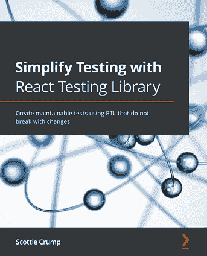
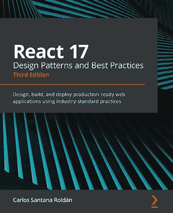

[Packt.com](http://Packt.com)

订阅我们的在线数字图书馆，全面访问超过 7,000 本书和视频，以及领先的行业工具，帮助您规划个人发展并推进职业生涯。有关更多信息，请访问我们的网站。

# 为什么订阅？

+   通过来自 4,000 多位行业专业人士的实用电子书和视频，节省学习时间，增加编码时间

+   通过为您量身定制的技能计划提高学习效果

+   每月免费获得一本电子书或视频

+   完全可搜索，便于快速访问关键信息

+   复制粘贴、打印和收藏内容

您知道 Packt 为每本书都提供电子书版本，并提供 PDF 和 ePub 文件吗？您可以在 [packt.com](http://packt.com) 升级到电子书版本，并且作为印刷书客户，您有权获得电子书副本的折扣。有关更多信息，请联系我们 `customercare@packtpub.com`。

在 [www.packt.com](http://www.packt.com)，您还可以阅读一系列免费的技术文章，订阅各种免费通讯，并享受 Packt 书籍和电子书的独家折扣和优惠。

# 您可能还会喜欢的其他书籍

如果您喜欢这本书，您可能还会对 Packt 的其他书籍感兴趣：

[(https://www.packtpub.com/product/simplify-testing-with-react-testing-library/9781800564459)]

**使用 React Testing Library 简化测试**

Scottie Crump

ISBN: 978-1-80056-445-9

+   探索 React Testing Library 及其应用场景

+   掌握 RTL 生态系统

+   将 jest-dom 应用于使用 RTL 增强您的测试

+   通过使用 RTL 获得创建不因更改而中断的测试所需的信心

+   将 Cucumber 和 Cypress 集成到您的测试套件中

+   使用 TDD 驱动编写测试的过程

+   将您现有的 React 知识应用于使用 RTL

[(https://www.packtpub.com/product/react-17-design-patterns-and-best-practices-third-edition/9781800560444)]

**React 17 设计模式与最佳实践**

Carlos Santana Roldán

ISBN: 978-1-80056-044-4

+   掌握样式化和优化 React 组件的技术

+   使用新的 React Hooks 创建组件

+   掌握新的 React Suspense 技术以及在项目中使用 GraphQL

+   使用服务器端渲染使应用程序加载更快

+   编写一套全面的测试以创建健壮且易于维护的代码

+   通过优化组件构建高性能应用程序

# Packt 正在寻找像您这样的作者

如果您有兴趣成为 Packt 的作者，请访问 [authors.packtpub.com](http://authors.packtpub.com) 并今天申请。我们已与成千上万的开发人员和科技专业人士合作，就像您一样，帮助他们将见解分享给全球科技社区。您可以提交一般申请，申请我们正在招募作者的特定热门话题，或提交您自己的想法。

嗨！

我是方锦，*正确设计 React Hooks*一书的作者。我真心希望你喜欢阅读这本书，并觉得它有助于提高你在 React 中的生产力和效率。

如果你能在亚马逊上留下评论，分享你对*正确设计 React Hooks*的看法，那将真正帮助到我（以及其他潜在读者）！

前往以下链接留下你的评论：[`packt.link/r/1803235950/`](https://packt.link/r/1803235950/)

你的评论将帮助我了解这本书中哪些内容做得好，哪些地方可以改进以供未来版本使用，所以这真的非常感谢。

祝好，

方锦

你可能还会喜欢以下书籍

你可能还会喜欢以下书籍

你可能还会喜欢以下书籍

你可能还会喜欢以下书籍
