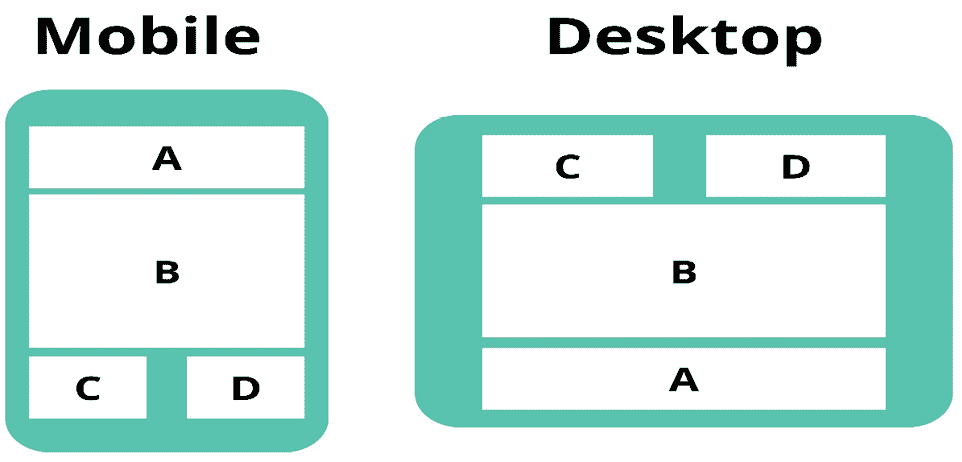

# 5

# 创建动态 Angular 组件

当我们创建组件时，组件的灵活性和可重用性应该是首要考虑的。你不想在组件内部有不必要的依赖，并确保组件可以在尽可能多的场景下提供服务，而不会变得过于复杂。

本章将教你如何使用内容投影、模板引用和模板出口创建真正动态的 UI 组件。我们将学习如何使用组件出口指令和视图容器引用动态渲染组件。

在本章结束时，你将了解何时以及如何将内容投影到 UI 组件中，有效地在你的组件内部使用模板，并根据某些条件在不同的地方输出代码。你还将能够动态加载和渲染组件，从而提高应用程序的灵活性和性能。

本章将涵盖以下主要主题：

+   深入探讨 Angular 内容投影

+   使用模板引用和变量

+   动态渲染组件

# 深入探讨 Angular 内容投影

通常，在创建一个组件时，你需要在其中显示各种内容。一些好的例子包括模态组件、卡片组件或标签页组件。

让我们考虑一下**模态组件**；你希望该组件具有可见和隐藏状态、背景以及一些共享样式，以便所有模态都具有相同的视觉和感觉。然而，模态组件每个实例中的内容将大相径庭。有时，你希望在模态中显示一个表单，而其他时候，你希望用它来显示文本或向用户提供操作或配置。很可能，你应用程序中的每个模态都将包含不同的内容。

因此，一个问题出现了：我们如何满足这种需求并创建一个可以在其 HTML 模板中容纳任何所需内容的组件？

你可以硬编码所有选项并使用输入来配置组件，但这很快就会变得难以维护！使用**内容投影**是创建需要在模板内部显示各种内容的组件的正确方式。Angular 内容投影允许你在组件的 HTML 模板中定义占位符。你可以通过从声明动态组件的父组件 HTML 模板中投影占位符内的内容来填充这些占位符。我们将通过创建模态组件来探索和使用内容投影。

## 使用内容投影创建模态组件

让我们从在*Nx monorepo*的`common-components`库中创建一个模态组件开始。在`component`类中，添加一个用于模态显示状态的输入和一个用于关闭事件的输出。还要添加一个用于模态标题的输入：

```js
@Input({ required: true }) title = '';
@Input({ required: true }) shown: boolean;
@Output() shownChange = new EventEmitter<boolean>();
```

现在，让我们为模态组件创建 HTML 模板。从`ng-container`元素开始。在`ng-container`元素内部放置模态容器和背景。我们还需要在`ng-container`元素上放置一个带有显示状态的`*ngIf`指令：

```js
<ng-container *ngIf="shown">
  <div class=»modal-container»>
  </div>
  <div class=»backdrop»></div>
</ng-container>
```

接下来，您可以在模态容器内部添加模态标题和模态内容区域。模态标题将包含标题和一个“X”按钮来关闭模态：

```js
<div class="modal-header">
  <h1>{{title}}</h1>
  <span (click)=»shown = false; shownChange.emit()">X
  </span>
</div>
```

最后，您必须添加模态内容区域。这是我们创建内容投影占位符的地方：

```js
<div class="modal-content">
  <ng-content></ng-content>
</div>
```

您可以在本书的 GitHub 仓库中找到模态组件的 CSS：[`github.com/PacktPublishing/Effective-Angular/tree/feature/chapter-five/dynamic-components`](https://github.com/PacktPublishing/Effective-Angular/tree/feature/chapter-five/dynamic-components)。

如您所见，在模态内容区域内，我们定义了一个`ng-content`元素：

```js
<ng-content></ng-content>
```

此`ng-content`元素是投影内容的占位符。`ng-content`元素将显示我们从父组件投影到模态组件中的所有内容。

您通过在组件的打开和关闭选择器标签之间放置内容，从父组件将内容投影到模态组件中。为了测试模态的内容投影，请在`expenses-overview`组件内部导入模态组件，并添加一个布尔属性`addExpenseShown`。然后，将模态组件添加到 HTML 模板中，并在模态组件内部投影我们在上一章中创建的`addExpenseForm`，如下所示：

```js
<bt-libs-modal [(shown)]="addExpenseShown" [title]="'Add expense'">
  <bt-libs-ui-add-expense-form (addExpense)="addExpense($event)" />
</bt-libs-modal>
```

现在，当模式显示时，它显示我们投影到组件中的添加费用表单。模态的 HTML 模板中的`ng-content`元素将被我们投影到模态组件中的添加费用表单所替换。

如您所见，`ng-content`插槽为您提供了模态组件所需的灵活性，并允许您轻松地将任何内容投影到模态中。与投影内容相关的任何逻辑都在父组件中处理，而不是在模态组件内部，从而实现了关注点的良好分离。

在我们投影的表单的情况下，如果您想处理表单组件的`addExpense`输出事件，您需要在`expenses-overview`组件内部处理该事件。对于投影内容的样式也是如此。如果您想对投影内容进行样式设置，您必须在您投影内容的组件的 CSS 文件中进行。在我们的例子中，这将是在`add-expense.component.scss`文件中。

您现在知道如何将内容投影到单个`ng-content`插槽中。接下来，您将通过使用多个`ng-content`插槽来学习如何处理更复杂的投影场景。

## 探索使用 ng-content 选择的多插槽内容投影

使用单个`ng-content`插槽提供了很多灵活性，但有时您需要多个位置来投影内容。

假设在一些模态设计中，标题和关闭按钮之间有自定义内容。为了覆盖这种情况，您需要两个地方来投影内容：一个在内容区域，一个在标题区域。当在组件中使用多个 `ng-content` 元素时，您需要在元素上使用具有定义 `select` 属性的 `ng-content`：

```js
<div class="modal-header">
  <h1>{{title}}</h1>
  <ng-content select=»[header-content]»></ng-content>
  <span (click)=»shown = false; shownChange.emit()">X</span>
</div>
```

在这里，我们在模态标题内添加了额外的 `ng-content` 元素，并分配了值为 `header-content` 的选择属性。如果我们添加第二个 `ng-content` 元素而没有定义选择属性，所有投影的内容都将最终出现在模态的 HTML 模板中的最后一个 `ng-content` 元素内。

为了使投影内容最终出现在特定的 `ng-content` 元素中，投影内容需要匹配 `ng-content` 的选择属性值。对于标题的 `ng-content` 元素，这意味着您需要将 `header-content` 属性添加到您想要投影到标题槽中的 HTML 中：

```js
<bt-libs-modal [shown]="addExpenseShown" [title]="'Add expenses'">
  <bt-libs-ui-add-expense-form (addExpense)="addExpense($event)" />
  <div header-content>special header content</div>
</bt-libs-modal>
```

您可以将尽可能多的 HTML 投影到特定的 `ng-content` 元素中。当 Angular 确定内容将被投影的位置时，有三种场景。让我们逐一探索这些场景：

+   如果投影的内容与模板中 `ng-content` 元素的选择属性值匹配，则内容将被投影到具有匹配选择值的 `ng-content`。

+   如果内容匹配多个 `ng-content` 选择器，内容将被投影到第一个具有匹配选择值的 `ng-content` 元素中。

+   如果投影的 HTML 不匹配任何 `ng-content` 选择值，内容将被投影到后备 `ng-content` 元素上——即没有分配 `select` 属性的 `ng-content`：

    ```js
    <ng-content></ng-content>
    ```

在我们的模态组件中，后备槽定义在模态的内容区域内。如果所有内容槽都定义了选择属性，则没有后备槽。当没有后备 `ng-content` 元素时，任何不与至少一个 `select` 属性值匹配的投影内容将不会被投影和渲染。

`ng-content` 标签的 `select` 属性允许您创建强大的选择器，可以匹配各种内容。您可以根据我们在模态组件中做的那样匹配 HTML 属性，但您也可以匹配 HTML 标签。

例如，假设我们想要将所有的 `div` HTML 标签投影到标题槽中。我们可以调整选择器如下：

```js
<ng-content header-content attribute from the projected content, and it will still be projected to the header slot because it’s a div HTML tag:

```

<div>特殊的标题内容</div>

```js

 If you change the `select` attribute value to match a span HTML element, our `div` will end up in the fallback `ng-content` slot inside our content area of the modal component. You can also match on multiple values; for example, if you want to match all `div` and `p` tags, you can create a selector like this:

```

<ng-content select="div, p"></ng-content>

```js

 You can also match HTML elements on CSS classes, IDs, or specific attribute values. Here is an example of each:

```

<ng-content select=".header"></ng-content>

<ng-content select="#header"></ng-content>

<ng-content select="[type='text']"></ng-content>

```js

 Using good `select` values for your `ng-content` tags can significantly improve the developer’s experience within your team by preventing you and your teammates from looking up the correct selector for the slots each time they have to project content into the component.
Having multiple `ng-content` slots and making good use of the select attribute on `ng-content` tags allows for even more flexible components with more control over the projected content. But even with multiple `ng-content` elements, you might need more flexibility to cover all your component design needs. Sometimes, you need to output your projected content numerous times inside your UI component or conditionally display the content in different places of the HTML template.
Displaying projected content multiple times or conditionally
When you need to display the projected content multiple times or conditionally in the HTML template, your first instinct might be to add `ng-content` inside a `div` element and apply the `*ngFor`, `*ngIf`, or `*ngSwitch` directive (or the control flow syntax versions – that is, `@for`, `@if`, and `@switch`) to the `div` tag:

```

<div *ngFor="let item of [1,2,3]">

<ng-content></ng-content>

</div>

```js

 If you try this, you will find that your content will be projected differently than expected. When using `*ngFor`, your content will only be projected once, and when using `*ngIf` or `*ngSwitch` combined with an `ng-content` element, only the first rendered `ng-content` element is displayed. So, the three directives (or control flow syntax) will not work in combination with the `ng-content` tag.
You can use control flow or the `*ngFor`, `*ngIf`, and `*ngSwitch` directives inside the parent component where you project the content:

```

<bt-libs-modal [shown]="addExpenseShown" [title]="'Add expenses'">

<div *ngFor="let header of headers" header-content>{{header}}</div>

</bt-libs-modal>

```js

 Using these directives or control flow in the parent component is good enough for many scenarios, but sometimes, you must use the directives inside the component where the `ng-content` elements reside. You might need to use the directives inside the component receiving the projected content because of the design needs of the component or to create a better architecture with a good separation of concerns.
For scenarios where you need to use the `*ngFor`, `*ngIf`, or `*ngSwitch` directives or control flow in the component that’s receiving the projected content, you don’t use `ng-content` as the projection slot; instead, you need to use the `ng-template` element.
In this section, you learned how to project content using the `ng-content` element and where you can run into the limits of what you can do with the projected content when using `ng-content`. You also learned how to effectively use the `select` attribute and project content into multiple slots using `ng-content`.
In the next section, we will learn about `ng-template`, template variables, and template references.
Using template references and variables
In the previous section, we projected content using the `ng-content` element. Yet, we ran into a limitation that didn’t allow you to use control flow or the `*ngFor`, `*ngIf`, or `*ngSwitch` directives in combination with the `ng-content` element. We will start by demonstrating how to resolve this using the `ng-template` element and how you can create and use template variables within HTML templates.
We will create a `ng-template` element and use directives on the project content. The `display-scales` component is just a simple example to demonstrate the concept of content projection combined with structural directives such as `*ngFor`.
Start using the *Nx generator* to create the `display-scales` component next to the `modal` component. The `display-scales` component will receive an array of scale sizes as input and display the projected content in these different scale sizes using a `*``ngFor` directive.
When the `display-scales` component is created, add a `scales-projection.directive.ts` file to the `display-scales` folder. Inside the `scales-projection.directive.ts` file, you can add the following content:

```

@Directive({

selector: ‹[btLibsScalesProjection]',

standalone: true,

})

export class ScalesProjectionDirective {

`constructor(public templateRef: TemplateRef<unknown>) { }`

`}`

```js

 The scales projection directive only injects the `display-scales` component uses the directive to access the projected content. Inside the `display-scales` component class, you need to add the input for receiving the scale sizes and a `@ContentChild()` decorator to access the projected content:

```

`@Input({ required: true }) scaleSizes!: number[];`

`@ContentChild(ScalesProjectionDirective) content!: ScalesProjectionDirective;`

```js

 As you can see, we used `ScalesProjectionDirective` as a value for the `@ContentChild` decorator. The `@ContentChild` decorator will get the projected `ng-template` element from the HTML template and hold a reference to the projected content so that we can use the content within the `display-scales` component. Inside the HTML template of the `display-scales` component, you can add this:

```

`<div *ngFor="let size of scaleSizes; let i = index" [style.transform]="'scale(' + size + ')'">`

`<ng-container [ngTemplateOutlet]=»content.templateRef»></ng-container>`

`</div>`

```js

 Here, we created a `div` element that will be rendered for each size inside the `scaleSizes` array the component receives as input. Inside the `div` element, we declared a `ng-container` element with the **ngTemplateOutlet** directive declared on the element.
This `ng-container` with the `ngTemplateOutlet` directive will display the projected content, similar to the `ng-content` element we used in the previous section. The `ngTemplateOutlet` directive needs to receive a `TemplateRef` property; this is why we use the `ng-template` element and the directive that injected `TemplateRef`.
We bind the `TemplateRef` property of the `@ContentChild` decorator value to the `ngTemplateOutlet` directive using `content.templateRef`. When using `ng-template` to project your content, you can use `*ngFor` and other structural directives in combination with the projected content. We couldn’t do this when using the `ng-content` element.
Next, you need to project a `TemplateRef` property into the component using `ScalesProjectionDirective`. By doing so, the `@ContentChild` decorator can access the `TemplateRef` property, and we can assign the projected template reference to the `ngTemplateOutlet` directive.
You can project a `TemplateRef` property by using the `ng-template` element. The `ng-template` element is the HTML representation of the `TemplateRef` class. The projected content needs to match the `@ContentChild` decorator, so we need to add the `ScalesProjectionDirective` decorator to the `ng-template` element we are about to project. Don’t forget to import the `display-scales` component and `ScalesProjectionDirective` into the standalone component where you are using the scales component and directive:

```

`<bt-libs-display-scales [scaleSizes]="[0.8, 1, 1.2, 1.4]">`

`<ng-template btLibsScalesProjection>I scale!</ng-template>`

`<bt-libs-display-scales>`

```js

 After adding the preceding HTML into an HTML template (for example, in the `expenses-overview.component.html` file), you will display the scales component with the `I scale!` content projected.
When you try to project an additional `ng-template` element, you will notice that only one `ng-template` element is projected and used inside the `display-scales` component. Only the first `ng-template` element is used because we use the `@ContentChild` decorator inside the `display-scales` component.
If you want to project multiple `ng-template` elements with the same projection directive (in our case, `ScalesProjectionDirective`), you need to use the `@ContentChildren` decorator instead of the `@ContentChild` decorator. The `@ContentChildren` decorator creates a `QueryList` property of template references instead of a single template reference:

```

`@QueryList`，你需要遍历 QueryList 并为列表中的每个节点创建一个`ng-container`元素。你可以通过将 QueryList 转换为数组并使用`*ngFor`指令输出列表中的每个项来实现这一点：

```js
<div *ngFor="let item of content.toArray()">
  <ng-container [ngTemplateOutlet]="item.templateRef"></ng-container>
</div>
```

如果你想要将内容投影到不同的槽位，就像我们使用`ng-content`标签和`select`属性所做的那样，你需要创建多个投影指令，如`ScalesProjectionDirective`，并使用多个`@ContentChild`装饰器来分离项目的`ng-template`元素：

```js
@ContentChild(ScalesProjectionDirective) content!: ScalesProjectionDirective;
@ContentChild(@ContentChild elements with different ng-container elements, as follows:

```

`<ng-container [ngTemplateOutlet]="content.templateRef"></ng-container>`

`<ng-container [ngTemplateOutlet]="ng-template elements and use the *ngFor, *ngIf, and *ngSwitch directives or control flow syntax in combination with projected content.``

现在，让我们探索我们还可以用`ng-template`元素做什么，模板变量是什么，以及我们如何在组件中有效地使用它们。我们将从了解模板变量开始。

`有效地使用模板变量`

在构建组件时，我们经常需要在一个 HTML 模板的一部分中使用另一个 HTML 模板的一部分。你可以使用如`@ViewChild`或`@ContentChild`之类的装饰器从你的 HTML 模板中访问元素，但你也可以使用**模板变量**。使用模板变量可以帮助简化你的代码，因为你可以处理在 HTML 模板的另一个地方需要模板的一部分的情况，所有这些都在你的 HTML 中；不需要在你的组件类中创建一个属性并在你的 HTML 模板中使用这个变量。

一个模板变量可以引用五个不同的元素：

+   HTML 模板中的 DOM 元素

+   在 HTML 模板中使用的指令

+   在 HTML 模板中使用的组件

+   `从 HTML 模板中使用的`ng-template`元素的`TemplateRef`

+   一个 Web 组件

模板变量是通过使用井号（`#`）符号与变量名结合来创建的。例如，如果你想从模板中的`div`元素创建一个模板变量，你可以使用以下语法：

```js
<div #exampleVar is the template variable, and the variable holds a reference to the DOM element it’s placed on; in this example, the DOM element is the div element. You can now use the exampleVar template variable within your HTML template. When you assign the template variable with a DOM element, you can access all properties of the DOM element, similar to when you access it from within your component class:

```

`<div>模板变量说：{{exampleVar.innerText}}</div>`

```js

 You can use the template variable with interpolation or anywhere else that you can use component properties inside your template:

```

`<input #name placeholder="Enter your name" />`

`<button (click)="submitName(name.value)">提交</button>`

```js

 If you want to assign a template variable to a component, you can use the same syntax but only on the selector of a custom component:

```

`<bt-libs-modal #modal [(shown)]="addExpenseShown"> ……</bt-libs-modal>`

`<bt-libs-modal>`

```js

 When you use a template variable on a component, you can access all the public properties and methods of the component. Sometimes, it can be useful to access the properties of the child component in this manner, but you should avoid calling public methods like so.
It’s not advised to call methods and potentially mutate the data of child components using template variables as it’s a bit of an anti-pattern. It would be best if you tried to do all parent-child component communication through inputs and outputs unless there is no other way. Yet it’s good to know you can access the properties through template variables so that you can recognize when someone else uses it or when you have a situation where you want or need to use it.
Another common and more accepted use case of template variables is assigning a directive to a template variable. We did this in *Chapter 4* when we created template-driven forms. The syntax for assigning a directive to a template variable differs slightly from assigning a DOM element or component to a template variable. When assigning a directive to a template variable, we must create the variable as normal and assign the directive using the is sign (`=`):

```

`<form #expenseForm="ngForm">……</form>`

`<div *ngIf="!expenseForm.form.valid">`

`<p>无效的表单</p>`

`</div>`

```js

 In the preceding example, we assigned the `ngForm` directive to the `expenseForm` template variable. We can now access the `ngForm` directive and all its properties through the template variable. Using the template variable makes it easy to use all kinds of form values and statuses such as `pristine`, `dirty`, `valid`, and `invalid`. There’s no need to create a variable within your component class; you can handle everything from within your HTML template.
You can also use template variables to access `TemplateRef` instances created with `ng-template` elements. Accessing a `TemplateRef` instance through a template variable works similarly to assigning a template variable to a component or DOM element; you just add the template variable to the `ng-template` element:

```

在下一节中，我们将探讨如何使用 ng-template 元素（带有或没有模板变量）或使用组件类中的 TemplateRef 来显示 `TemplateRef` 元素。

有效使用 TemplateRef 元素

模板引用可以在您的 HTML 模板中使用 `ng-template` 元素定义。您可以在组件和指令类中使用 `TemplateRef` 类访问 `TemplateRef` 元素。`TemplateRef` 类和 `ng-template` 元素在形式上不同，但本质上是同一事物。

`TemplateRef` 元素可以用于许多用例。正如本章开头 *使用模板引用和变量* 部分的示例所示，当需要将投影内容与结构指令（如 `*ngFor`、`*ngIf` 或 `*ngSwitch`）结合时，可以使用 `TemplateRef` 进行内容投影。

`TemplateRef` 另一个被使用的地方是在自定义结构指令中。结构指令根据某些逻辑向视图容器添加或删除 `TemplateRef` 元素。当我们创建自定义结构指令时，我们在 *第三章* 中添加和删除了模板引用到视图容器。

一个 `TemplateRef` 元素也可以与模板上下文结合，构建真正动态的组件，可以使用不同的数据源显示不同的模板。您还可以使用 `TemplateRef` 在页面的不同位置显示内容——例如，当您在移动和桌面设计中将相同的内容放置在页面的不同位置时。

`ng-template` 元素在需要根据 `*ngIf` 指令的结果条件性地渲染内容时也表现出色。让我们继续探讨 `TemplateRef` 的用例，并创建一些示例。

将 ng-template 与 *ngIf 结合

您可以根据 `*ngIf` 语句的结果显示 `ng-template` 元素。在 Angular 应用的 HTML 模板中，您经常会看到类似的东西：

```js
<div *ngIf="expenses"> ……… </div>
<div *ngIf="!expenses">Loading...</div>
```

您可以使用 `ng-template` 元素做同样的事情，并定义一个在 `*ngIf` 语句不满足时显示的模板：

```js
<div *ngIf="expenses else loading"> ……… </div>
<ng-template #loading>
  <div>Loading...</div>
</ng-template>
```

我们没有在两个 `div` 元素上声明 `*ngIf` 指令，而是使用了 `*ngIf` `else` 语法。我们引用了放置在 `ng-template` 元素上的模板变量，用于 `else` 语句。现在，当没有支出时，将显示加载模板。这只是一个简单的例子，但如果您需要显示条件性大模板，使用模板有助于分离 HTML。此外，当您的 `*ngIf` 语句使用 `async` 管道时，这通常是情况，您不能使用第一种方法：

```js
<div *ngIf="!expensesVm$ | async">Loading...</div>
```

当你在 `*ngIf` 指令内部使用 `async` 管道时，你无法在模板中使用逻辑非运算符（`!`）。你可以在组件类中使用 RxJS 管道运算符在你的可观察值中设置一个值。然而，使用 `*ngIf` `else` 语句和一个 `ng-template` 元素会更简单、更干净，如下所示：

```js
<div *ngIf="expensesVm$ | async as expense; else loading">……</div>
<ng-template #loading>
  <div>Loading...</div>
</ng-template>
```

使用前面提到的语法，你可以使用 `async` 管道来处理你的可观察值并显示一个替代模板，只要可观察值没有解析出任何值，或者可观察值的结果被映射到假、空或未定义的值。

你甚至可以更进一步，将所有的 HTML 分割成单独的模板，使用 `*ngIf` `then-else` 语法结合 `ng-template` 元素来实现。使用 `if-then-else` 语法在你的 HTML 中实现清晰的分离，并在你有大模板且需要条件性地显示多个内容块时，有助于提高可维护性：

```js
<ng-container *ngIf="expensesVm$ | async; then expenses; else loading"></ng-container>
<ng-template #expenses> <div>……</div> </ng-template>
<ng-template #loading> <div>Loading...</div> </ng-template>
```

你使用什么解决方案主要取决于你的偏好和团队的偏好。没有真正的约定或最佳实践。当与 `async` 管道一起工作时，我喜欢使用 `ng-template` 语法，而不是在我的可观察值上使用管道运算符来分配组件属性，这可以用于带有逻辑非运算符的 `*ngIf` 语句。

对于简单的同步值场景，我通常使用 `*ngIf` 和带有逻辑非运算符的 `*ngIf` 来显示正确的 HTML 内容 - 除非有两个大块 HTML 内容，在这种情况下，我更喜欢使用模板。

现在你已经知道了如何使用 `ng-template` 元素结合 `*ngIf` 指令来条件性地显示模板，让我们来探讨如何使用 `ng-template` 在同一页面的不同位置显示模板。

使用 ng-template 在正确的位置显示内容

通常，你的设计是这样的，同一块内容在移动端和桌面端视图中被放置在页面的不同位置：



图 5.1：移动端和桌面端视图的内容放置

如 *图 5.1* 所示，在移动端，内容块 *C* 和 *D* 显示在元素 *B* 下方；在桌面端视图，相同的内容显示在元素 *B* 之上。对于块 *A*，情况相反。你不想重复 HTML 以块 *A*、*C* 和 *D* 为例，一次放在块 *B* 之上，一次放在块 *B* 之下。重复 HTML 会破坏 **不要重复自己** （**DRY**）原则，并导致更难以维护和阅读的 HTML 模板。

在这种情况下，`ng-template` 元素可以提供帮助，让你可以在页面的不同位置显示相同的模板，而无需重复 HTML：

```js
<ng-container *ngIf="isMobile" [ngTemplateOutlet]="A"></ng-container>
<ng-container *ngIf="!isMobile" [ngTemplateOutlet]="CD"></ng-container>
<div>Block B</div>
<ng-container *ngIf="!isMobile" [ngTemplateOutlet]="A"></ng-container>
<ng-container *ngIf="isMobile" [ngTemplateOutlet]="CD"></ng-container>
<ng-template #A>
  <div> …… </div>
</ng-template>
<ng-template #CD>
  <div> …… </div>
</ng-template>
```

如前述 HTML 片段所示，我们使用了一个 `ng-template` 元素来定义 `A` 块的 HTML，以及一个 `ng-template` 元素来定义 `C` 和 `D` 块的 HTML。我们使用带有 `ngTemplateOutlet` 指令的 `ng-container` 元素显示模板，该指令引用在 `ng-template` 元素上声明的模板变量。

在这个例子中，我们使用了一个 `isMobile` 布尔值来隐藏或显示正确的 `ng-container` 元素，但你也可以将它们包裹在一个 `div` 元素中，并通过 CSS 隐藏它们。使用 `ng-template` 元素和 `ng-container` 元素结合，我们只需创建一次 `A`、`C` 和 `D` 块的 HTML，从而得到一个更干净、更易于维护的 HTML 模板。

你还可以进一步清理 HTML，并在你的组件类中分配 `aboveB` 和 `belowB` 模板。我不喜欢在我的组件类中添加额外的逻辑，但这只是我的个人偏好。

这里是一个如何在你的组件类中处理这个例子。首先，调整你的 HTML 如下：

```js
<ng-container [ngTemplateOutlet]="aboveB"></ng-container>
<div>Block B</div>
<ng-container [ngTemplateOutlet]="belowB"></ng-container>
```

现在，在你的组件类中，通过使用 `@ViewChild()` 装饰器获取 `A` 和 `CD` 模板引用，并为 `aboveB` 和 `belowB` `TemplateRef` 元素创建一个变量：

```js
@ViewChild('A') templateA!: TemplateRef<unknown>;
@ViewChild('CD') templateCD!: TemplateRef<unknown>;
aboveB!: TemplateRef<unknown>;
belowB!: TemplateRef<unknown>;
```

在 `ngAfterViewInit` 生命周期钩子中，你可以使用正确的模板分配变量：

```js
this.aboveB = this.isMobile ? this.templateA : this.templateCD;
this.belowB = this.isMobile ? this.templateCD : this.templateA;
```

如果你的组件设置为 *OnPush* 变更检测策略，你需要手动触发变更检测以更新和显示模板。如果你不使用 *OnPush* 变更检测策略，你的视图将自动更新。

当你有一个包含多个模态的页面时，也可以做类似的事情。而不是定义多个模态组件并将正确的内容投影到每个模态中，你可以创建一个包含 `ng-container` 元素和 `ngTemplateOutlet` 指令的模态，并在模态打开时设置正确的模板：

```js
showModal = false;
modalTitle = '';
modalContent!: TemplateRef<unknown>;
openModal(title: string, content: TemplateRef<unknown>) {
  this.modalTitle = title;
  this.modalContent = content;
  this.showModal = true;
}
```

在前述代码片段中，我们创建了一个 `openModel` 函数，该函数将在需要打开其中一个模态组件时从 HTML 模板中被调用。我们将传递模态的标题和内容 `TemplateRef` 元素：

```js
<button (click)="openModal('Title A', modalA)">Open modal A</button>
<button (click)="openModal('Title B', modalB)">Open modal B</button>
<bt-libs-modal [(shown)]="showModal" [title]="modalTitle">
  <ng-container [ngTemplateOutlet]="modalContent"></ng-container>
</bt-libs-modal>
<ng-template #modalA>
  <div>A...</div>
</ng-template>
<ng-template #modalB>
  <div>B...</div>
</ng-template>
```

在 HTML 中，我们现在只显示一个模态，并在其中显示 `TemplateRef` 元素，该元素在组件类的 `openModal` 方法中设置。当相应的按钮被点击时，我们将 HTML 模板中的 `TemplateRef` 元素发送到我们的 `openModal` 函数。

正如你可能注意到的，`ng-template` 元素和 `ngTemplateOutlet` 可以给你的组件带来很多灵活性，并让你轻松地在不同的位置显示不同的模板。但通过添加上下文和使用 `TemplateRef` 作为输入，`ng-template` 可以提供更多的灵活性。

使用模板和上下文创建动态组件

“我们已经看到了如何结合内容投影和 `ng-template` 元素。在本节中，我们将使用 `TemplateRef` 作为组件输入，并为 `TemplateRef` 提供额外的上下文，使其更加动态。展示带有上下文的 `ng-template` 的一个好例子是创建一个动态选择组件，因此请创建一个选择组件，位于 `common-components` 库中，紧挨着 `modal` 和 `display-scales` 组件。”

“一旦创建了 `select` 组件，首先添加一个用于选择选项的输入和一个 `TemplateRef` 元素。此外，添加一个用于默认 `selectedIndex` 选项的输入和一个输出，当选择发生变化时。最后，添加一个在做出选择时设置选定索引的函数，并使用输出发射选定值：”

```js
@Input({ required: true }) options!: unknown[];
@Input() optionTemplate?: TemplateRef<unknown>;
@Input() selectedIndex?: number;
@Input() labelKey?: string;
@Output() selectedChange = new EventEmitter<unknown>();
onOptionChange(index: any) {
  this.selectedIndex = index.target.value;
  this.selectedChange.emit(this.options[index.target.value]);
}
```

“接下来，我们将添加动态选择组件的 HTML。首先创建一个选择元素和一个当没有选定值时的选项。接下来，添加一个带有 `*ngFor` 指令的 `ng-container` 元素，该指令遍历在选项输入中接收到的每个选项。我们还将跟踪 `for` 循环的索引，因为我们将在选项值中使用该索引。在 `*ngFor` 元素内部，我们将定义一个选项元素和一个另一个 `ng-container` 元素，该元素定义了 `ngTemplateOutlet` 指令，用于显示默认模板或作为输入接收到的模板。当选择选项没有特殊显示需求时，可以使用默认模板。在所有其他情况下，可以通过 `optionTemplate` 输入提供模板：”

```js
<select (change)="onOptionChange($event)">
  <option [value]=»null» [selected]=»!selectedIndex">Make selection</option>
  <ng-container *ngFor="let option of options; index as i">
    <option [value]=»i" [selected]="i === selectedIndex">
      <ng-container [ngTemplateOutlet]=»optionTemplate || defaultTemplate»
        [ngTemplateOutletContext]="{ $implicit: option}">
      </ng-container>
    </option>
  </ng-container>
</select>
<ng-template #defaultTemplate let-option>
  {{ labelKey ? option[labelKey] : option }}
</ng-template>
```

“如您所见，我们还在 `ng-container` 元素中添加了 `ngTemplateOutletContext` 指令，它将显示模板。`ngTemplateOutletContext` 指令被分配给一个包含 `$implicit` 属性的对象。分配给 `ngTemplateOutletContext` 指令的对象可以在 `ng-template` 元素中使用，就像我们在前面的代码片段中所做的那样。您可以在 `ng-template` 元素中使用前面代码示例中的 `$implicit` 值。要使用 `$implicit` 值，您必须使用 `let-propertyName` 语法，如下所示：”

```js
<ng-template ngTemplateOutletContext directive. When you have other context properties besides the $implicit property, you must use a slightly different syntax to use the additional property. Let’s say you have a shown property inside the ngTemplateOutletContext directive:

```

`[显示属性，以便可以使用此语法在 ng-template 元素中使用：`

```js
ng-template element; the right-hand side needs to match the property you declared in the ngTemplateOutletContext directive. For example, you can replace let-shown with let-shownValue or anything else you desire, so long as it starts with let-:

```

`<ng-template let-shownValue="shown">`

`<div>{{shownValue}}</div>`

`</ng-template>`

```js

 Now that you know how to use the context inside `ng-template` elements, let’s test the `select` component and see how we can provide a custom template for the `select` component.
If you’re using the `select` component in another standalone component, you must import the `select` component before you can declare it in the HTML template. Once you’ve imported the `select` component, you can use it in the template like this:

```

`<bt-libs-select (selectedChange)="onOptionChange($event)" [options]="['Test', 'Test 2']">`

`</bt-libs-select>`

```js

 In a real-world scenario, you should define the input for the options inside the component class, but I’ve added it directly in the HTML for demonstration purposes. The default `ng-template` element will be used because we didn’t provide a `TemplateRef` element for the `optionTemplate` input of the `select` component.
Now, let’s create a custom template to provide to the `select` component. Let’s say you have an array of expenses that looks like this:

```

`[{expense: 'Food',amount: 10},{expense: 'Gas',amount: 20}]`

```js

 Now, we can create a template to display the expense and amount inside the `select` component:

```

`<ng-template #expenseSelect let-expense>`

`<span>产品: {{ expense.expense }}, 金额: {{ expense.amount }}</span>`

`</ng-template>`

```js

 When the template is created, you need to assign the template to the `optionTemplate` input of the `select` component, like this:

```

`<bt-libs-select (selectedChange)="onOptionChange($event)" [optionTemplate]="expenseSelect" [options]="expenses">`

`</bt-libs-select>`

```js

 After providing the custom template to the `optionSelect` input, the select component will use the `expenseSelect` template instead of the default template. The `expenseSelect` template receives the expense object that’s used inside the template through the `ngTemplateOutletContext` directive. By using the `ng-template` element and the `ngTemplateOutletContext` directive, you can display any content you want inside the `select` component and use any array of objects that’s necessary to provide the data for the template, giving you all the flexibility you need for a truly dynamic component.
We covered a lot in this section. First, you learned about `TemplateRef` and how to use it inside the component class or HTML. Using the `ng-template` and `ng-content` elements, you learned how to use structural directives combined with projected content. You also learned how to provide context to `ng-template` elements using the `ngTemplateOutletContext` directive to build truly dynamic components. Finally, you learned about template variables and how to use them to access values inside your templates or display content conditionally.
In the next and last section of this chapter, you will learn about rendering components dynamically.
Rendering components dynamically
In some scenarios, you might want to load and render components dynamically. You might want to load and render components dynamically because you don’t know the layout or exact components of the page upfront or because you have data and resource-intensive components that you only want to load and render if the user needs them in the view.
Here are some common examples of when dynamically loading components is useful:

*   When building a website builder where customers can build up web pages based on a set of components you provide. With a website builder, you don’t know how the user will create the page’s layout and what components will be used. You want to load components dynamically whenever the user adds them to the page.
*   When you have a multi-step wizard where the content of the next steps differs based on the users’ choices during each step of the wizard.
*   Tabs, modals, and popups with resource-intensive components or where different components can be displayed based on the user interaction. You only want to load and render the components if the user requests them.
*   When you allow users to configure a list of widgets in your application. You don’t know what widgets the user will activate, and in what order they want them displayed, so it would make little sense to load and render them before the user configures them.
*   An ad banner component with different ads cycling through the ad banner component. When different teams frequently add new ad components for the banner, a static component structure would make little sense.

When you need to load and render components dynamically, there are three approaches: the `ngComponentOutlet` directive, the `ViewContainerRef` class, and, since Angular 17, the defer control flow. First, we’ll use `ngComponentOutlet` as this is the most straightforward solution that works for any Angular version. Next, we will show you how to render and load components dynamically with the defer control flow that was introduced in Angular 17.
Rendering components dynamically using ngComponentOutlet
To demonstrate dynamic component rendering using the `ngComponentOutlet` directive, we will create a widget component that can render different widgets with their own custom functionality and design. Let’s say the widget container can receive widget data as input and render the widget it receives as input; this way, you can display a different widget for each page if needed.
Start by generating a `widget-container` component inside the `common-components` library. This `widget-container` component will dynamically render widget components using the `ngComponentOutlet` directive.
Next, create two more components: a weather widget and a clock widget component. For demonstration purposes, we will leave the weather and clock widget templates as Nx generated them by default.
Now, in the widget container component, define an `ng-container` element in the template and add the `ngComponentOutlet` directive to the `ng-container` element:

```

`<ng-container *ngComponentOutlet="widget.component" />`

```js

 As you can see, we assign the `ngComponentOutlet` directive with `widget.component`. So, let’s create an interface for the widget and add the widget property to the component class:

```

`export interface widget { component: Type<any> | null };`

```js

 Make the widget property an input so that the widget container can receive this widget property from the parent where you declare the widget container component:

```

`@Input() widget: widget = {component: null};`

```js

 As a simple example, this is all you need to render a component dynamically. We will extend this example quite a bit, but to showcase the dynamically rendered component, you can now use the widget container by adding the following to the HTML template of one of your components:

```

`<bt-libs-widget-container *ngIf="activeWidget" [widget]="activeWidget"></bt-libs-widget-container>`

```js

 In the component class, you need to add the active widget property that’s used for the input of the widget container:

```

activeWidget!: widget;

```js

 Let’s say we want to alternate between the clock and the weather widget every 5 seconds. We can use `setInterval` for this and assign the `activeWidget` property with the clock or weather widget:

```

protected readonly cd = inject(ChangeDetectorRef);

showWeather = true;

ngOnInit() {

setInterval(() => {

this.activeWidget = { component: this.showWeather ? WeatherWidgetComponent : ClockWidgetComponent };

this.showWeather = !this.showWeather;

this.cd.detectChanges();

}, 5000)

}

```js

 When you open your component in the browser, you will see that after 5 seconds, the weather widget is shown, and the widget will alternate with the clock widget every 5 seconds after that. This is, of course, just a simple example and can be improved upon a lot, but it shows how to render the widgets dynamically quite well.
Let’s continue and see how we can improve the widget container and add additional flexibility. In some scenarios, your widget components might need data or access to a service to function properly. When the widget needs to do this, you can add an injector to the `ngComponentOutlet` directive.
Using an injector with ngComponentOutlet
You can provide additional data to your dynamically loaded components using the `injector` property of the `ngComponentOutlet` directive.
Let’s start by adding the `injector` property to the `ngComponentOutlet` directive inside the HTML template of the widget container component:

```

<ng-container *ngComponentOutlet="widget.component; 注入属性：

```js
export interface widget { component: Type<any> | null; injector property, you must adjust the widget and the input the widget container component receives. First, we will adjust the widget. As an example, we will adjust the weather widget so that it can receive a city and a message that we will display in the HTML template.
Create a new file called `widget-tokens.ts` and add an interface for the weather widget data and an injection token, like this:

```

export interface WeatherWidgetData {city: string; message: string;}

export const WEATHERWIDGET = new InjectionToken<WeatherWidgetData>('weather widgets');

```js

 Inside the weather widget component class, you need to inject the `WEATHERWIDGET` injection token:

```

widgetData = inject(WEATHERWIDGET);

```js

 Now, adjust the HTML template of the weather widget component so that it uses the values of the `WeatherWidgetData` interface:

```

<p>{{widgetData.city}}: {{widgetData.message}}</p>

```js

 That is everything you need to do inside the weather widget component itself. So, to reiterate, you created an interface and injection tokens, you injected the injection token, and you will receive the injector from the widget container’s `ngComponentOutlet` injector property. To close the circle and make everything work, you need to provide the correct input to the widget container and include the injector that will provide the city and message data.
Before you added the injector, you provided the following as input to the widget container to display the weather widget:

```

{ component: WeatherWidgetComponent }

```js

 To provide the city and message data for the weather widget, you need to add the `injector` property to the input so that the widget container can include it in the `ngComponentOutlet` directive.
You can create the `injector` property by using the `create()` method on the `Injector` class:

```

Injector.create()

```js

 Inside this `create` method, there’s a `providers` object. This is similar to the provider objects you added inside the `providers` array to a component, module, or your application configuration object in your `app.config.ts` file:

```

{ providers: [{ provide: WEATHERWIDGET, useValue: { city: 'Amsterdam', message: 'Sunny' } }] }

```js

 For the `provide` property, use the injection token you created inside the weather widget component file. For our example, you’ll use the `useValue` property and assign it to the city and message value you want to use. You can create any valid provider object here, so you can also provide services or factory classes instead of the `useValue` property. The entire `Injector.create()` method looks like this:

```

Injector.create({ providers: [{ provide: WEATHERWIDGET, useValue: { city: 'Amsterdam', message: 'Sunny' } }] })

```js

 The entire input object for the widget container looks like this:

```

{ component: WeatherWidgetComponent, injector: Injector.create({ providers: [{ provide: WEATHERWIDGET, useValue: { city: 'Amsterdam', message: 'Sunny' } }] }) }

```js

 Now, when the weather widget is displayed through the widget container, the `injector` property is passed along, and the city and message values are used within the HTML template of the weather widget. Cool stuff!
Using the `inject` property of the `ngComponentOutlet` directive allows you to provide any service, factory method, or static data to the dynamically rendered components, making that dynamically rendered component as flexible as any other component.
Since Angular version 16.2.0-next.4, you can simplify providing (simple) values to dynamic components a bit by using the inputs property on the `ngComponentOutlet` directive instead of the injector property. To use the inputs property on `ngComponentOutlet`, you need to add `@Input()` properties to the widget. In our example, we can add `city` and `message` `@Input()` properties to the weather widget:

```

@Input() city: string;

@Input() message: string;

```js

 Once you’ve added the `@Input()` properties to the widget, you can provide the `@Input()` properties with values through the `ngComponentOutlet` `inputs` property, like this:

```

<ng-container *ngComponentOutlet="widget.component; 输入属性 ngComponentOutlet 指令的 inputs 属性需要接收一个对象；在我们的例子中，我们把这个对象命名为 widgetInputs。这个对象有一个键对应于组件的每个输入属性和相应的值。所以，在我们的例子中，widgetInputs 对象看起来是这样的：

```js
widgetInputs = {
  'city': 'Amsterdam',
  'message': 'Sunny',
}
```

使用 `inputs` 属性要容易得多，但它只能提供具有简单值的对象。使用 `injector` 属性提供了更多的灵活性，因为它可以提供简单值，也可以提供类、服务以及你可以在 Angular 应用程序中注入的任何其他内容。

我们的小部件系统已经可以动态渲染组件并提供注入器给动态创建的组件。但是，动态渲染的组件仍然会预先加载，所以我们还需要稍作改进，以确保我们只在需要渲染时加载小部件组件。

懒加载动态组件

为了进一步改进，我们可以懒加载我们的动态组件。目前，当你加载页面时，所有小部件都会预先加载。如果我们只在需要时加载小部件组件，或者换句话说，懒加载组件，那就更好了。我们需要更改我们的小部件容器组件，以便它懒加载我们的动态渲染组件。

让我们从创建一个名为 `widget-loaders.ts` 的新文件开始。`widget-loaders.ts` 文件将列出一些类型和一个带有懒加载小部件导入语句的对象，有点像使用路由懒加载组件：

```js
const widgetKeys = ['weatherWidget', 'clockWidget'] as const;
type WidgetKey = typeof widgetKeys[number];
export type WidgetLoader = { [key in WidgetKey]: () => Promise<any> };
export const widgetLoaders: WidgetLoader = {
  weatherWidget: () => import('../weather-widget/weather-widget.component'),
  clockWidget: () => import('../clock-widget/clock-widget.component'),
};
export type WidgetOption = WidgetLoader[keyof WidgetLoader];
```

我们首先创建了一个 `widgetKeys` 常量；在这里，你定义了可以在 `widgetLoaders` 对象内部使用的所有键。接下来，我们创建了一个 `widgetKeys` 常量的类型，以创建一个类型安全的 `WidgetLoader` 类型。`WidgetLoader` 类型定义了一个键值对，其中键只能是 `widgetKeys` 常量中声明的值。

接下来，我们创建了 `widgetLoaders` 对象，它使用 `WidgetLoader` 类型。`widgetLoaders` 对象将包含键值对，其中键是来自 `widgetKeys` 常量的值，值是懒加载小部件的导入语句。

最后，我们创建了一个 `WidgetOption` 类型，它允许你从 `widgetLoaders` 对象中获取单个值，而无需其他任何东西。现在，我们已经创建了一种类型安全的方式来定义和选择小部件加载器，我们可以开始调整小部件容器组件。

首先，我们必须移除我们已有的小部件输入，并用一个常规输入属性替换它。然后，我们可以添加一个 `injector` 属性的输入和一个来自 `widgetLoaders` 对象的 `WidgetOption` 属性的输入：

```js
@Input() injector!: Injector;
@Input({ required: true }) widgetLoader!: WidgetOption;
widget: widget = { component: null, injector: null };
```

你还需要注入 `ChangeDetectorRef`，因为我们必须手动触发变更检测：

```js
protected readonly cd = inject(ChangeDetectorRef);
```

接下来，你必须添加带有 `async` 关键字的 `ngOnChanges` 生命周期钩子，因为我们将会使用异步 `await` 来加载动态组件：

```js
async ngOnChanges(changes: SimpleChanges) {}
```

在 `ngOnChanges` 生命周期钩子内部，我们将获取 `widgetLoader` 输入的当前值：

```js
const widgetLoader: WidgetOption = changes['widgetLoader'].currentValue;
```

接下来，我们将使用 `widgetLoader` 值来懒加载小部件组件。当小部件组件加载完成后，我们将使用懒加载的组件和 `injector` 属性分配小部件属性。最后，我们需要触发变更检测以反映 UI 中的更改：

```js
const widget = await widgetLoader();
this.widget = { component: widget[Object.keys(widget)[0]], injector: this.injector };
this.cd.detectChanges();
```

在将前面的更改添加到小部件容器组件后，一切就绪，你可以动态地懒加载和渲染小部件组件。为了测试这一点，我们需要在另一个组件中使用小部件容器组件，并给它一个小部件加载器和注入器作为输入：

```js
<bt-libs-widget-container [widgetLoader]="widget" [injector]="injector"></bt-libs-widget-container>
```

例如，如果你想交替显示时钟和天气小部件，你可以在模板中添加小部件容器的组件类中添加以下代码：

```js
widget: WidgetOption = widgetLoaders.weatherWidget;
injector: Injector | null = Injector.create({ providers: [{ provide: WEATHERWIDGET, useValue: { city: 'Amsterdam', message: 'Sunny' } }] });
protected readonly cd = inject(ChangeDetectorRef);
ngOnInit() {
  setInterval(() => {
    this.widget = this.widget === widgetLoaders.clockWidget ? widgetLoaders.weatherWidget : widgetLoaders.clockWidget;
    this.injector = this.widget === widgetLoaders.clockWidget ? null : Injector.create({ providers: [{ provide: WEATHERWIDGET, useValue: { city: 'Amsterdam', message: 'Sunny' } }] });
    this.cd.detectChanges();
  }, 5000)
}
```

当你检查浏览器开发者工具的 **网络** 选项卡时，你会看到当它们第一次进入视图时，天气和时钟小部件组件正在被加载。当小部件再次显示，并且组件已经加载时，浏览器不会再次加载它们，因为浏览器已经为你缓存了它们。现在，你有一个真正动态的小部件系统，你可以按需懒加载和渲染小部件。

使用延迟控制流动态渲染组件

在 Angular 17 中，`defer-widget`。

这个 `DeferWidgetComponent` 将具有与我们的 `widget-container` 组件相同的功能，只是它将使用延迟控制流而不是 `ngComponentOutlet` 指令。你可以从创建一个名为 `defer-widget` 的组件开始，紧挨着 `widget-container` 组件。一旦你创建了组件，就在新创建的 `defer-widget` 文件夹中创建一个 `widgets.enum.ts` 文件。在 `widgets.enum.ts` 文件中添加以下 `enum`：

```js
export enum Widgets {
  Clock,
  Weather
}
```

接下来，您需要为活动小部件添加一个输入，即小部件数据，并在`DeferWidgetComponent`内部添加一个引用`Widgets`枚举的属性：

```js
@Input() activeWidget!: Widgets;
@Input() activeData!: any;
widgets = Widgets;
```

在`DeferWidgetComponent`的 HTML 模板内部，您需要在延迟块内添加您的组件。延迟块接收一个触发器作为参数。当延迟触发器被触发时，延迟块将加载并渲染延迟块内的内容。对于您的小部件组件，您需要使用`when`触发器。`when`触发器在提供的条件解析为`true`时加载并渲染内容。

我们还希望当条件再次为`false`时，内容能够再次隐藏。要隐藏当条件为`false`时的内容，您还需要添加一个`*ngIf`指令或使用`if`控制流。我将使用`*ngIf`指令：

```js
@defer (when activeWidget === widgets.Clock) {
  <bt-libs-clock-widget *ngIf="activeWidget === widgets.Clock" />
}
@defer (when activeWidget === widgets.Weather) {
  <bt-libs-weather-widget *ngIf="activeWidget === widgets.Weather" [widgetData]="widgetData" />
}
```

如果没有`*ngIf`指令或控制流语法，当条件返回`false`时，小部件将不会消失。`defer`语法的`when`语句在解析为`true`后不会再次评估条件。

上述代码是您需要用于懒加载和渲染小部件的所有内容。如您所见，这比使用`ngComponentOutlet`指令要简单得多。

由于我们已经在某些地方放置了一些代码，我们仍然需要对天气小部件进行一些更改，以便我们的新延迟解决方案能够正常工作。在天气小部件组件内部，您有一个`widgetData`属性。您可以将它放在`comment`下，并用一个`@Input()`属性替换，如下所示：

```js
// widgetData: WeatherWidgetData = inject(WEATHERWIDGET);
@Input() widgetData!: WeatherWidgetData | null;
```

我们之前注释掉的`widgetData`属性用于`ngComponentOutlet`指令方法。对于我们的新延迟方法，我们将使用常规组件，`@Input()`。您还可以更新天气组件的 HTML 模板，并且只有在接收到`widgetData`属性时才渲染城市和消息：

```js
<p *ngIf="widgetData">{{widgetData.city}}: {{widgetData.message}}</p>
```

现在，一切应该都能正常工作！为了测试`DeferWidgetComponent`，我们可以在`expensesOverviewComponent`中使用它，我们现在使用`widgetContainerComponent`。在 HTML 模板中，您可以替换旧的容器小部件为新延迟小部件：

```js
<bt-libs-defer-widget [activeWidget]="widget" [widgetData]="widgetData" />
```

现在，我们只需要在`expensesOverviewComponent`内部设置`widget`和`widgetData`属性。您可以取消注释我们之前用于小部件容器的旧`widget`和`injector`属性，并添加这两个属性：

```js
widget!: Widgets;
widgetData: any = null;
```

最后，我们必须更改`setInterval`内部的逻辑。再次，您可以取消注释我们之前用于交替小部件容器中天气和时钟小部件的旧代码，并用此代码替换：

```js
this.widget = this.widget === Widgets.Clock ? Widgets.Weather : Widgets.Clock;
this.widgetData = this.widget === Widgets.Clock ? null : { city: 'Amsterdam', message: 'Sunny' };
this.cd.detectChanges();
```

现在，当您保存一切时，新的延迟小部件组件应该与容器小部件组件工作得完全一样。5 秒后，时钟小部件将被懒加载并渲染，再过 5 秒，天气小部件将被懒加载并渲染。这两个小部件将每 5 秒交替一次。

通过这样，你已经使用`ngComponentOutlet`指令和延迟控制流语法创建了一个带有懒加载小部件的组件。使用`ngComponentOutlet`指令，你可以提供注入器，而且不需要使用`*ngIf`指令来移除小部件，但总体来说，延迟控制流语法感觉要干净和容易得多。

摘要

在本章中，我们学到了很多！首先，你学习了如何使用内容投影使组件更加灵活。我们创建了一个模态组件，并展示了使用单个插槽和多个插槽的内容投影。我们还了解到，你无法在投影内容上组合结构指令。

接下来，我们深入探讨了模板变量和模板引用。你学习了如何使用`ng-template`创建灵活和动态的组件，如何使用模板变量访问组件值和输入属性，以及如何根据特定条件显示不同的模板。你还学习了如何为`ng-template`元素提供上下文，以构建真正动态的组件，这些组件可以满足你对组件的所有设计需求。

最后，你学习了关于动态组件渲染和加载的内容。你学习了何时应该使用动态渲染或加载的组件，以及如何使用`ngComponentOutlet`和`@defer`语法在运行时动态渲染和懒加载组件。

在下一章中，我们将开始学习 Angular 中的约定和设计模式，以便我们可以改进代码的设置和实现。

```js

```

```js

```

```js

```

```js

```

```js

```

```js

```
