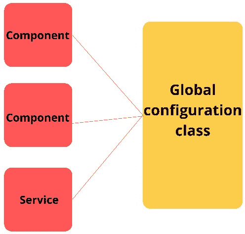
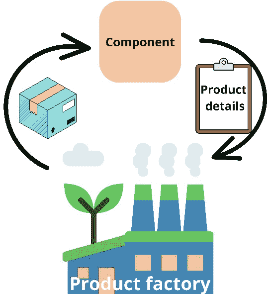
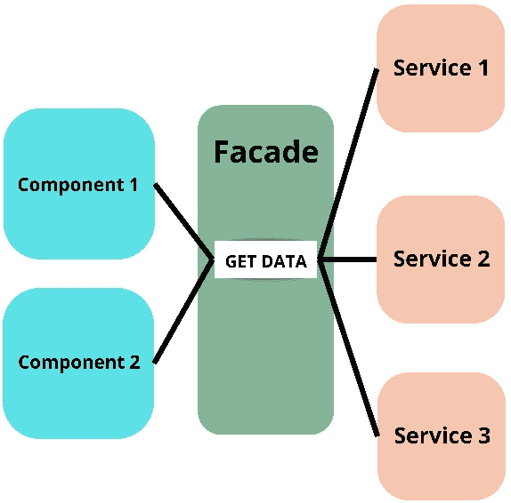

# 6

# 在 Angular 中应用代码规范和设计模式

在本章中，我们将探讨 Angular 应用程序中常用的代码规范、最佳实践和设计模式。你还将创建一个通用的 HTTP 服务，并使用 HTTP 拦截器模拟 API 响应。

遵循良好的代码规范可以使你编写出一致的代码。无论你是单独编写代码还是在团队中，规范都能确保你使用相似的语法来处理常见情况，并遵循最佳实践。使用良好的设计模式可以帮助你编写出扩展性好且经过实战检验的代码实现。

代码规范和最佳实践更多地关注过程和与风格相关的方面，例如使用 CLI、命名、使用类型或防止嵌套可观察对象。另一方面，设计模式关注的是你如何在代码库中设置、处理和实现常见情况、问题和流程。

在本章结束时，你将了解 Angular 应用程序中所有关于代码规范、最佳实践和常用设计模式的内容。在本章中，你将学习到的某些模式和原则包括继承、外观服务、可观察对象、响应式编程和反模式。本章将为后续章节提供一个良好的基础，在这些章节中，我们将深入探讨响应式编程和状态管理。本章将帮助你理解良好设计模式和代码规范的好处。

本章将涵盖以下主要内容：

+   探索 Angular 应用程序中常用的代码规范和最佳实践

+   探索 Angular 应用程序中常用的设计模式

+   构建包含模型适配器的通用 HTTP 服务

# 探索 Angular 应用程序中常用的代码规范和最佳实践

在本章的第一部分，你将了解 Angular 应用程序中的**代码规范**和最佳实践。使用代码规范确保所有参与你项目的人使用相似的变量、文件和文件夹命名。良好的代码规范还能使代码更易于阅读，并允许你快速识别某些特性、实现或数据类型。此外，代码规范使你的代码更加一致，更容易调试、重构和理解。为你的项目设置良好的代码规范可以促进最佳实践的使用。代码规范还使新开发者更容易融入代码库，因为他们有一套规则可以遵循，这使他们能够以与其他代码库工作者相似的方式编写代码。

个人认为，创建一个包含你在项目中采用的所有代码规范和最佳实践的文档是一个好习惯。这样，新来的人除了在代码中看到的内容外，还有其他可以参考的东西。你公司采用的代码规范完全取决于编写和维护代码库的人。然而，Angular 社区中存在一些常用的规范和最佳实践。

首先，Angular 有一个 *风格指南*，其中声明了它认为的所有良好实践及其原因。你可以在官方 Angular 网站上找到该风格指南：[`angular.io/guide/styleguide`](https://angular.io/guide/styleguide)。

接下来，我们将学习 Angular 应用程序中常见的规范和最佳实践。我们将从命名和结构规范开始，然后继续介绍最佳实践。

## 命名规范

命名是规范的主要焦点。**命名规范**对于确保可维护性和可读性至关重要。良好的命名规范使你能够轻松地导航代码库并快速找到内容。命名规范适用于代码的多个方面，因此我们将它们分开，从文件夹和文件开始。

### 命名文件夹和文件

文件和文件夹名称应清楚地描述文件夹或文件的目的。这样，即使项目增长，你也能快速找到所需的文件和文件夹。对于文件夹，你应该使用单词，但如果确实使用了多个单词，你可以用破折号（`-`）将它们分开。对于文件名，你可以使用 `feature.type.ts` 的格式。

该功能描述了文件包含的内容，而类型则指代诸如组件、服务、指令、管道等事物（一些例子包括 `expenses-list.component.ts`、`expenses.service.ts` 和 `unit.directive.ts`）。请使用传统的文件类型名称（`.component`、`.directive`、`.service`、`.pipe`、`.module`、`.directive`、`.store`、`.actions`、`.stories`）。对于单元测试，请使用 `.spec` 作为类型。最后，避免重复的文件夹或文件名是明智之举。随着你的单一代码库的增长，避免重复的文件或文件夹名称可能并不总是可能的，但尽可能长时间地避免它。

除了文件和文件夹的命名规范外，遵守代码中的命名规范同样至关重要。最好保持你的类、属性、函数、选择器和其他代码方面的命名一致性。代码中的良好命名规范帮助你快速识别代码的不同部分，提高可读性，并使重构和维护代码变得更加容易。

### 代码中的命名规范

Angular 主要是一个基于类的框架，所以让我们从命名类开始。所有类都应该使用大驼峰式命名法。大驼峰式命名法是指每个单词都以大写字母开头。类名应该等于文件功能与文件类型的组合。因此，`expenses-list.component.ts`变为`ExpensesListComponent`，而`expenses.service.ts`变为`ExpensesService`。

Angular 应用程序的另一个重要部分是组件、指令和管道的选择器。对于组件和指令，有一个约定是使用前缀。使选择器前缀独特，以便你可以将其与可能使用的任何第三方库的选择器区分开来。

组件选择器全部使用小写字母，单词之间用连字符分隔。对于指令选择器，你使用常规的驼峰式命名法。在常规驼峰式命名法中，第一个单词以小写字母开头，所有后续单词以大写字母开头。对于管道选择器，你应该使用一个单词，全部小写，不带前缀。如果必须使用多个单词作为管道选择器，则使用常规驼峰式命名法。

在查看类（或函数文件）内的代码时，也有一些常见的约定：

+   首先，我们使用驼峰式命名法来声明属性、函数和方法。为你的属性、函数和方法使用描述性名称也很重要。当你用函数处理事件或组件输出时，你应该在这些函数前加上`on`前缀（如`onClick`、`onAddExpense`、`onHover`）：

    ```js
    <div (click)="on:

    ```

    @Output() saved = new EventEmitter<boolean>();   // Good

    @Output() $):

    ```js
    import { interval } from 'rxjs'
    numbers$ = interval(1000);
    ```

    ```js

    ```

现在你已经了解了文件命名规范和代码命名规范，让我们来看看一些关于文件和项目结构的约定。

## 结构性约定

除了命名规范外，你还可以为你的文件和项目结构制定规范。像好的命名一样，在你的文件和项目中拥有可预测和良好的结构有助于可读性和可维护性。有了良好的文件结构，你可以轻松识别和找到所需的代码部分。

首先，使用**单一规则**是一个好的约定。每个文件应该只服务于单一目的。每个文件只有一个目的会使它们更容易阅读和维护，并保持文件大小适中。每个文件只有一个目的也使得定位错误变得容易。最好尝试将文件限制在最多 400 行。当一个文件超过 400 行代码时，这是一个很好的迹象，表明你可能需要将其拆分，并将一些方法移动到单独的文件中。

你应该关注你的文件大小以及函数的大小。理想情况下，函数不应超过 50 行，最好控制在 25 行以下。可能会有一些例外，但当函数变得更大时，将它们拆分成单独的函数会更好。当函数变得过大时，它们就变得难以阅读、测试和调试。

在 Angular 中，你可以在一个文件中编写模板、CSS 和逻辑，但将模板和 CSS 提取到它们自己的文件中是推荐的。使用单独的文件来存储模板和 CSS 促进了单一用途原则，即每个文件只有一个目的，这也有助于可读性和可维护性。如果你的模板只包含一个或两个 HTML 标签而没有额外的样式，你可以例外，将所有内容放在一个文件中。然而，我仍然会分离模板和组件类。除了将你的文件分离到专门的 HTML、CSS 和 TypeScript 文件中之外，良好的文件夹结构也有助于保持清晰的概述，因此让我们来看看我们的文件夹结构的一些约定。

尽可能长时间保持扁平的文件夹结构。拥有大量的嵌套文件夹可以更容易地找到所需的文件夹和文件，并可以使你对文件夹和文件结构的概述更加清晰。为你的项目中的每个领域创建一个文件夹，或者更好的是，创建一个库。你应该将这些库中的代码分割到`data-access`、`features`、`UI`和`utils`中。`data-access`、`features`、`UI`和`utils`库中的每个元素也应该是一个独立的库。

使用库可以促进 API 驱动的架构，并确保关注点的良好分离。通过采用 API 驱动的架构，你也将开始编写更多可重用的代码。在库的内部，你有一个`index.ts`文件来导出你需要在其他地方使用的内容。

接下来，建议使用**DRY 原则**。DRY 代表“不要重复自己”。当你的单一代码库变得更大时，有时你不可避免地会重复自己，但一般来说，你应该尽量只编写一次代码，并在需要的地方共享它。

最后，你需要一种方法来对你的文件中的代码进行排序。一个常见的排序方法是使用以下结构：

1.  `@Input()`装饰器

1.  `@Output()`装饰器

1.  公共属性和私有属性

1.  构造函数

1.  获取器和设置器

1.  生命周期钩子

1.  公共方法和私有方法

将属性和方法按字母顺序排序（在将它们分为公共属性和方法和私有属性和方法之后）。尽可能初始化`@Input()`指令，并在使用生命周期钩子时，也要实现该接口。

你可以将上述约定扩展，使你的项目更加健壮和统一。你应该提出并尝试使用的约定数量没有限制，但就目前而言，你有一个良好的起点，并了解你的约定应该是什么样子，以及应该关注什么。接下来，我们将讨论 Angular 应用中的一些最佳实践。

## 在 Angular 应用中使用最佳实践

使用最佳实践确保你正确地做事，并且你的代码保持健壮、可维护和可扩展。

第一项最佳实践是尽可能多地使用 Angular CLI（或在使用 Nx 时使用 Nx CLI）。使用 CLI 生成组件、服务、指令、项目、库和其他元素可以确保一致性。当使用 Nx CLI 时，你还可以确保所有依赖项和设置都配置正确。

尽可能多地使用新的独立组件、指令和管道。使用新的独立 API 可以更好地隔离你的逻辑，使得调试和测试你的组件、管道和指令变得更容易。使用独立 API 还有助于减小你的包大小，从而实现更快的加载时间。你还应该使用新的 `inject` 函数代替构造函数注入进行依赖注入。`inject` 函数提供了更多的灵活性，并且在使用继承时不会造成阻碍。

总是在你的属性和方法上使用访问修饰符。在 Angular 中，我们有三种访问修饰符：`public`、`private` 和 `protected`。使用正确的访问修饰符可以轻松识别可以在哪里使用什么，并有助于防止错误和意外的行为。

### 与性能相关的最佳实践

与性能相关有许多最佳实践。首先，始终在 `*ngFor` 指令上使用 `trackBy` 函数。当你使用 Angular 17 中引入的新控制流语法时，你必须使用 `track` 函数。使用新的控制流语法是推荐的，因为它提高了可读性，并且你不需要导入公共模块来使用它们，因此可以稍微减小你的包大小。

接下来，你应该尽可能多地使用 *懒加载*，因为这可以确保你只下载用户请求的内容。使用新的独立组件，你可以轻松地懒加载每个路由，并且随着 Angular 17 中引入的新延迟块，你甚至可以懒加载 HTML 模板的不同部分。

你应该在组件内部尽可能多地使用 `OnPush` 变更检测策略。使用 `OnPush` 变更检测可以减少 Angular 渲染模板的次数。为了更好的变更检测和性能，你还应该尽可能多地利用 Angular 信号来管理应用程序中的同步状态（我们将在 *第七章* 中详细讨论信号）。

对于异步数据流，你应该尽可能多地使用 `async` 管道。当组件被销毁或属性被分配新的可观察对象时，`async` 管道会自动为你取消订阅；这可以防止内存泄漏并提高应用程序的性能。

不要在你的 HTML 模板中使用函数调用或获取器。在模板中调用函数或使用获取器会对应用程序的性能产生负面影响。使用 **CDK 虚拟滚动** 来显示大量列表。CDK 虚拟滚动只会渲染视图内部显示的元素，而不是整个列表。尽可能多地使用纯管道：

```js
<cdk-virtual-scroll-viewport itemSize="50" class="example-viewport">
  <div *cdkVirtualFor="let item of items" class="example-item">{{item}}</div>
</cdk-virtual-scroll-viewport>
```

例如，当使用 `ngOnChanges` 生命周期来根据新接收的输入值分配属性时，有很大可能性你可以使用管道来处理相同的情况。使用纯管道对性能更好，并促进了可重用性。不要在管道内的数组上使用 `filter`、`forEach`、`reduce` 或 `map`，因为这会负面影响性能。

最后，你应该尽可能长时间地缓存 API 请求，以及资源密集型方法也是如此。

### 使用最佳实践防止 bug

除了与性能相关的最佳实践外，还有一些最佳实践可以防止 bug 并提高可测试性和可维护性。避免在代码中使用 `any` 类型。将所有内容都进行强类型化可以防止 bug，提高建议，并使调试和测试更容易。

当组件类中存在未被模板内使用的可观察对象时，请使用 RxJS 的 `takeUntilDestroyed`、`takeUntil` 或 `take` 操作符。这三个操作符确保你的可观察对象订阅被正确取消。

此外，不要使用嵌套的可观察对象；相反，使用 RxJS 操作符如 `combineLatest` 和 `withLatestFrom` 来处理需要嵌套可观察对象的情况。嵌套的可观察对象可能导致内存泄漏和难以调试的 bug。嵌套的可观察对象也难以编写测试。

此外，在必须等待多个可观察对象以渲染 HTML 片段之前，避免使用多个带有 `async` 管道的 `ng-container` 元素。

不要这样做：

```js
<ng-container *ngIf="obs$ | async as observable">
  <ng-container *ngIf=»obs2$ | async as observable2»>
  </ng-container>
</ng-container>
```

相反，在你的组件类中将两个可观察对象映射到单个可观察对象中，并在模板中使用 `async` 管道来使用这个单个可观察对象：

```js
observables$ = combineLatest({a: of(123), b: of(456)}).pipe(map(({a, b}) => ({obs: a, obs2: b})));
```

合并可观察对象可以防止 bug，使你的模板更易读，并确保当可观察对象接收到新值时，一切都能正确更新。

现在你已经了解了一些防止 bug 的最佳实践，让我们来探讨关于设置和架构的最佳实践。

### 项目设置和架构的最佳实践

一个好的设置有助于提高整个代码库的可维护性和标准。我们已经在 *第一章* 中讨论了如何设置项目，但为了回顾，请使用智能和哑组件。

*智能组件* 与你的状态管理连接，而 *哑组件* 只通过输入和输出变化接收父组件的数据。这确保了你不会有不预期的依赖，并且你的组件专注于单一职责。尽可能在你的组件上使用 `export default` 以在懒加载时自动解包。使用默认导出和自动解包可以保持你的路由文件整洁易读。

使用 `canMatch` 路由守卫而不是 `canActivate` 和 `canLoad` 守卫。如果守卫返回 false，`canMatch` 守卫将不会下载代码。最后，你需要使用 lint 规则来强制执行你的约定和最佳实践。

你已经了解了命名和结构规范。你还学习了可以在你的 Angular 应用程序中使用的最佳实践。向前看，我会在我们前进的过程中提到其他最佳实践，但首先，我们将学习 Angular 应用程序中的常见设计模式。

# 探索 Angular 应用程序中常用的设计模式

设计模式帮助以预定义的方法解决常见的软件开发问题。设计模式就像构建应用程序的蓝图。设计模式告诉你代码应该如何表现，以及如何创建代码库的结构或分离代码库的各个部分。使用设计模式确保你拥有经过实战检验的解决方案，以良好的抽象级别解决常见问题，这样你的代码就可以扩展而不会变得混乱，不会到处纠缠着依赖，这通常被称为“意大利面代码”。

**抽象**在软件开发中意味着你将系统的细节和行为与实现逻辑分离。例如，如果你的 Angular 应用程序中有一个状态管理解决方案，你应该将你的状态管理实现与组件层分离。通过分离组件层和状态管理解决方案，你可以更改你的状态管理解决方案，而无需触及组件层。这提供了额外的灵活性，并且可以在你的应用程序增长和需求变化时，避免一些严重的重构。

以状态管理为例，一开始，你可能使用 RxJS 的`Subject`和`BehaviorSubject`以简单的方式管理状态，但随着应用程序的增长和状态的复杂性增加，你可能希望将其更改为像**NgRx**或**NgXs**这样的东西，因为它们提供了更安全、更健壮和更灵活的方法来处理复杂的应用程序状态。

假设你的组件层与状态管理纠缠在一起。在这种情况下，你必须重构整个应用程序以切换状态管理实现。相反，如果你在组件层和状态管理解决方案之间有良好的抽象级别，你可以更改状态管理实现而不触及组件。

设计模式是解决软件开发中常见问题的良好起点，但它们并不是神圣的圣杯或一刀切解决方案。你应该始终考虑什么对你的应用程序有用；不要过度使用设计模式，在没有需要的地方使用它们。当有必要严格遵循设计模式时，你可以这样做，但当不适用时，适应模式以适应你的特定需求。

现在，不再拖延，让我们探索 Angular 应用程序中一些常用的设计模式。

## Angular 中的创建型设计模式

**创建型设计模式**构成了我们在应用程序中创建类和对象的基础。在 Angular 应用程序中，创建型模式被框架用于创建组件、服务和其他应用程序的基本构建块。通过实现创建型模式，如工厂和单例模式，开发者可以确保代码模块化、可重用和可维护。

### 单例模式

**单例模式**用于创建一个对象或类的单个实例。使用单例模式确保所有与单例交互的代码都使用相同的实例。单例模式的另一个优点是良好的内存使用，因为您只需为对象或类分配一次内存。在*图 6.1*中，您可以看到单例模式的视觉表示：



图 6.1：单例模式

如您在*图 6.1*中可以看到，有一个类被不同的消费者使用。当您不使用单例模式时，全局配置类会有多个实例，每个消费者使用自己的实例。现在您已经知道了单例模式是什么，让我们来探讨在 Angular 环境中单例模式通常是如何被使用的。

在 Angular 的上下文中，单例模式通常与依赖注入结合使用。当您在 Angular 应用程序中创建服务或提供其他依赖项时，通常是以单例的形式进行的，这意味着只创建一个依赖项实例，并由应用程序中的所有消费者共享。因为只有一个实例，所以您可以使用单例服务和类在 Angular 应用程序中管理状态或处理其他逻辑，例如配置和缓存。

要将依赖项作为单例提供，您必须在应用程序的*根提供者数组*中提供它。在没有模块的 Angular 应用程序中工作，根提供者数组位于您提供给`bootstrapApplication`方法的`ApplicationConfig`对象中。如果您在 Angular 应用程序中使用`ngModules`，您可以通过在应用程序模块中提供依赖项来将其作为单例。您还可以在服务方面使用`providedIn`根配置对象：

```js
@Injectable({ providedIn: 'root'})
export class ExpensesService {}
```

通常情况下，您只能使用单例模式创建对象的单个实例。在 Angular 依赖项的情况下，单例是在提供依赖项的提供者数组上下文中创建的。我们已经在*第二章*中更详细地解释了提供者数组和依赖项的创建。

为了进一步阐明单例模式，让我们看看一些单例模式有用的实际例子：

+   **管理已登录用户**：如果你有一个用于管理已登录用户的类，你想要这个类只有一个实例，这样就有了一个单一的真实来源。如果有多个类的副本，用户数据、登录状态和其他属性可能在类的不同实例之间有所不同，从而导致意外的行为。

+   **状态管理**：当你有一个用于管理全局应用程序状态的类时，单例模式也是一个很好的选择。你想要确保所有需要全局应用程序状态的人都能收到相同的值，并且可以在同一源中更新它。如果有许多状态类的实例，这些实例可以持有不同的值，从而导致状态损坏。保持不同实例的同步可能是一项艰巨的任务，因此使用单一的真实来源是有意义的，并且使用更少的内存。

现在你已经了解了单例模式以及它在 Angular 应用程序中的使用情况，让我们来探索工厂模式。

### 工厂模式

**工厂模式**作为对象创建的灵活蓝图。在需要运行时确定所需对象的确切类型的情况下，工厂模式是有益的，它允许根据某些条件或参数进行动态实例化。通过封装对象创建，工厂模式防止客户端代码与特定类之间的紧密耦合，从而促进可维护性、可扩展性和更容易的修改。*图 6.2*展示了工厂模式的视觉表示：



图 6.2：工厂模式

正如你在*图 6.2*中可以看到的，我们向工厂提供一些信息（在图中，它是一系列产品详情的列表），然后工厂创建我们想要它创建的内容，并返回结果。在图中，工厂使用工厂创建并返回一个产品给组件。现在你对工厂模式有了更好的理解，让我们看看它在 Angular 应用程序的上下文中通常是如何使用的。

在 Angular 的上下文中，工厂模式也主要是与依赖注入结合使用的。你可以使用`useFactory`属性创建一个提供者，并为创建依赖值提供一个工厂方法。在提供者中使用`useFactory`属性在你想根据条件提供不同的类，或者你想在运行时向创建的类提供只能访问的值时非常有用：

```js
providers: [
  { provide: LoggerService, useFactory: env.prod ? ProdLogger : DevLogger }
]
```

在 Angular 应用程序中，你通常还会在服务中使用工厂方法。很多时候，服务被用来创建特定的对象；这可以通过工厂方法来完成，这样你就有一种简洁的方式来创建对象。

```js
createProduct(name: string, props: ProductProps): Product {
  return new Product(name, props);
}
```

现在你已经知道了工厂模式是用来以可预测的方式创建对象和类的。接下来，我们将讨论依赖注入模式。

### 依赖注入模式

**依赖注入**（DI）是 Angular 框架的核心。严格来说，DI 属于**控制反转**（IoC）原则的范畴。IoC 本质上将程序某些方面的控制权委托给外部框架或容器，允许它管理组件之间的流动和连接。但由于 DI 负责在 Angular 应用程序中创建和分配依赖项，我们可以将其归类为创建型设计模式。

依赖注入（DI）通过解耦组件和服务，促进了模块化，使得它们在应用程序中更具可重用性。通过简化依赖关系的管理，DI 使得通过添加或修改功能来扩展应用程序变得更加容易，而无需进行重大的代码更改。

Angular 的 DI 系统有助于识别和防止循环依赖，这可能导致运行时错误和难以调试的问题。依赖注入还强制执行类型安全，减少了与注入错误数据类型相关的错误风险。

我们已经在*第二章*中详细讨论了 Angular DI，因此现在我们将继续讨论结构型设计模式。

## Angular 中的结构型设计模式

**结构型设计模式**是塑造 Angular 应用程序架构的基础。结构型设计模式有助于组织组件、服务和模块，定义它们在应用程序中的交互和协作方式。Angular 利用这些模式来建立清晰的结构，促进可扩展、模块化和可维护应用程序的开发。

例如，组件化架构和模块结构等模式是 Angular 应用程序固有的。装饰器模式在 Angular 中也被广泛使用（例如，`@Component`，`@Injectable`）。外观模式在 Angular 应用程序中常用于在服务层和组件层之间提供抽象。

总体而言，在 Angular 中使用结构型设计模式通过定义组件、服务和模块在框架架构中的相互连接和协作方式，指导开发者创建组织良好、可扩展和适应性强应用程序。

### 组件化架构

**组件化架构**（CBA）是一种设计模式，其中我们通过组合单个、自包含和可重用的组件来构建应用程序。在 Angular 应用程序中，CBA 的应用显而易见。在构建组件时，保持它们尽可能的自包含和可重用非常重要。因为我们希望构建可重用的组件，所以在 Angular 组件中使用智能/愚笨原则（smart/dumb principle）非常重要。

我们已经在*第一章*和*第二章*中讨论了智能组件和哑组件，但为了重申，智能组件主要是页面或大型功能组件，并且与你的业务逻辑和状态管理（或外观服务）有关。

哑组件是用于构建智能组件的 UI 元素。哑组件通过输入接收数据，并通过输出通知其他组件的变化。使用这种智能/哑方法强制执行良好的架构和组件的可重用性。

现在我们已经简要回顾了 CBA 模式，让我们继续学习装饰器模式。

### 装饰器模式

**装饰器模式**是一种结构型设计模式，它允许你在不改变对象本身的情况下修改类、函数和属性的行为。在 Angular 框架中最常用的装饰器如下：

+   `@Component`: 这个装饰器将一个类装饰为 Angular 组件，为 Angular 编译器提供元数据。它包括有关组件模板、样式以及其他配置的信息，如独立标志、导入、组件选择器和指令分解。

+   `@Injectable`: 这个装饰器将一个类装饰为可注入的服务，允许它通过 Angular 的 DI 系统注入到其他组件或服务中。

+   `@NgModule`: 这个装饰器将一个类装饰为 Angular 模块，提供定义模块依赖项、组件、指令、服务等的元数据。

+   `@Input`和`@Output`: 这些是用于组件属性的装饰器，用于定义组件之间的输入和输出通信。

+   `@HostListener`: 这个装饰器用于装饰一个类方法，以声明一个 DOM 事件监听器。它用于指令中监听宿主元素上的事件。

+   `@HostBinding`: 这个装饰器用于装饰一个类属性，将其绑定到指令内的宿主元素属性。

+   `@ViewChild`和`@ViewChildren`: 这些是用于在父组件或指令中查询和获取子组件或 DOM 元素引用的装饰器。

你也可以创建自己的自定义装饰器。例如，我们可以创建一个自定义装饰器，当函数被调用时记录下来，并在日志中包含提供的函数参数。首先，你需要在`tsconfig.json`中将`experimentalDecorators`设置为`true`：

```js
{
  "compilerOptions": { "experimentalDecorators": true}
}
```

在 Angular 的情况下，`experimentalDecorators`属性默认设置为`true`，因为 Angular 已经在框架内部使用了装饰器。要创建一个装饰器，你需要创建一个接受三个参数的函数：`target`（类原型），`propertyKey`（方法名称），和`descriptor`（方法属性描述符）。在装饰器内部，你通过将原始逻辑包装在一个新函数中来修改被装饰方法的行怍。这个新函数在调用原始方法之前记录一条消息：

```js
export function LogMethod(target: unknown, propertyKey: string, descriptor: PropertyDescriptor) {
  const originalMethod = descriptor.value;
  descriptor.value = function (...args: unknown[]) {
    console.log(`Method ${propertyKey} is called with args: ${JSON.stringify(args)}`);
    return originalMethod.apply(this, args);
  };
  return descriptor;
}
```

现在，要使用装饰器，您只需将其添加到方法之上，如下所示：

```js
@LogMethod
test(a: number, b: number) {
  return a + b;
}
```

如果您现在调用`test`方法，装饰器确保它被记录，包括`a`和`b`参数：

```js
this.test(1, 2);
Logs: Method test is called with args: [1,2]
```

您可以将自定义装饰器放置在共享域中的新`custom-decorators`库中，该库的类型为 util。我在`custom-decorators`库内部创建了一个`func-logger.decorator.ts`文件，并将装饰器的逻辑放在该文件中。

您现在知道 Angular 在哪里使用装饰器模式，以及您如何自己使用它来扩展或修改对象、函数和类的行为，而不修改对象本身。接下来，您将了解外观模式。

### 外观模式

我们在这本书中多次提到了**外观模式**。现在，是时候解释外观模式是什么了。外观模式是一种结构型设计模式，它为更大的、更复杂的类、子系统或 API 系统提供了一个简化的接口。在 Angular 应用程序的上下文中，外观模式通常用于创建组件层和实现状态管理解决方案和业务逻辑的服务之间的简单接口和抽象层。在**图 6.3**中，您将找到外观模式的视觉表示：



图 6.3：外观模式

在**图 6.3**中，为了获取组件所需的数据，需要调用三个不同的服务。如果您必须为所有组件执行此操作，您将创建大量的依赖关系，并在组件内部创建大量的逻辑。我们不是直接从组件中调用服务，而是在组件和服务之间放置一个外观。外观提供了一个简单的`获取数据`方法来检索组件内部所需的数据。外观没有组件内部的依赖关系，而是拥有所有对服务的依赖关系。通过使用外观，您可以保持组件简单且干净，没有依赖关系。此外，您创建了一个抽象层，因此您可以更改数据检索方式而不更改组件层；您只需更改外观获取数据的方式，组件仍然调用外观服务的`获取数据`方法。在大多数情况下，您在外观的右侧管理状态，在左侧放置组件。

在大型应用程序和单一代码库中，状态管理层可能会变得庞大且复杂，难以处理。对于像在大型单一代码库中的商业工具应用程序中获取所有费用这样简单的事情，你可能会发现自己需要访问多个状态文件（通常称为存储）和这些存储的选择器。因为状态的不同部分可能存在于不同的文件或甚至不同的库中，所以创建一个结合状态内部各部分的功能的函数并不像想象中那么简单。你需要另一个地方，那就是界面服务。同样，对于更新操作，在大系统中，这可能涉及到更新多个存储和处理多个回调或效果。

假设你创建了一个费用界面。在这个界面中，你创建了简单易调用的方法，并为你提供了访问组件层中所需一切的功能。例如，获取所有费用、获取筛选后的费用、更新单个费用或批量更新费用。这个界面有助于保持组件层中的简单性，并确保你只需调用一个函数就能获取或完成你需要使组件工作并相应更新状态的操作。

界面使得访问和更新你的状态变得简单，并提供了一个额外的抽象层，将你的状态管理实现与组件层解耦。这个抽象层允许你在不触及组件层的情况下更改你的状态管理解决方案。你只需更改状态管理并更新界面，你的组件层就会像没有变化一样继续工作。

如果你没有在组件层和状态管理之间添加界面，你需要进入每个使用状态的组件，并独立地更新它们，这会导致更多的工作，并且你遗漏某事的可能性更高。所以，即使你有一个简单的状态，你可以使用单个方法访问和更新大多数事物，但在组件层和状态管理之间添加一个界面仍然是明智的。

以下是一个界面服务可能看起来很简单的示例：

```js
@Injectable({ providedIn: 'root' })
export class ExpenseFacadeService {
  protected readonly expenses: inject(ExpensesStore);
  protected readonly approvedExpenses: inject(ApprovedExpensesStore);
  getAllExpenses(): Expense[] {
    return [...this.expenses.getAll(), ...this.approvedExpenses.getAll()];
  }
  addExpense(expense: Expense): void {
    this.expenses.addExpense(new Expense(expense));
  }
  updateExpense(expense: Expense): void {
    if (expense.isApproved) {
      this.approvedExpenses.addExpense(expense);
    } else {
      this.expenses.addExpense(expense);
    }
  }
}
```

在前面的例子中，我们创建了一个界面服务，它公开了两种方法：一种用于获取所有费用，另一种用于更新费用。如果状态管理中的实现现在发生了变化，你只需在界面中更改它，而不是在组件中获取或更新费用的每个地方都进行更改。前面的代码只是一个示例；你不需要在单一代码库中添加这个功能。在*第八章*中，我们将在我们的单一代码库中创建一个界面。现在，你只需要知道界面模式是什么以及为什么它有用。

接下来，我们将探讨继承模式。

### 模型适配器模式

**模型适配器模式**是适配器模式的一种实现。模型适配器模式通常用于将 API 接收到的对象映射到前端（不是特指视图层中使用的模型）使用的模型表示。你可能会问自己，这有什么用？

假设你从 API 接收到一个具有`title`属性的对象：

```js
{
  title: "My Title",
  ……
}
```

假设你在应用程序的 100 个不同地方使用了这个`title`属性。如果出于某种原因，后端必须将属性名从`title`更改为`subject`，你需要进入应用程序中的所有 100 个地方来将它们从`title`更改为`subject`。如果你有一个模型适配器，你可以在一个地方更改它们，并将新的`subject`属性映射到前端模型的`title`属性。

### 继承模式

**继承模式**是面向对象编程的基础概念，它建立了类之间的层次关系，使得一个类（子类或派生类）能够从另一个类（超类或基类）继承属性、方法和行为。在 Angular 应用程序中，服务和组件可以利用继承来形成层次关系，并共享通用功能和属性。基类通过子类公开共享的功能和属性。

继承是一种强大且有用的设计模式，但应该适度使用，尤其是在你的 Angular 应用程序的组件层中。过度使用继承会在基组件和子组件之间创建紧密耦合。基组件的变化可能会意外地影响多个派生组件，使系统脆弱且难以维护。具有多个继承级别的深层层次结构可能会引入复杂性，使代码库更难以理解和维护。通过创建过于复杂的继承结构进行过度设计可能会阻碍而不是帮助开发。

此外，在组件层的情况下，你通常可以创建管道和指令来共享常用功能。例如，你可以有一个基类，在其中添加处理禁用状态、处理一些常用的组件样式，如`primary`、`alert`和`danger`，以及添加在点击或双击时更改这种样式的选项。

这可能看起来像是一个有效的解决方案，但在某些情况下你可能只需要一个或两个选项。一些组件可能具有不同的样式类型，但不应能够根据点击来更改样式类型，而其他组件则不应能够被禁用。将不适用于组件的行为暴露给组件通常是一种不好的做法。因此，在这种情况下，创建三个处理禁用、样式和样式更改行为的指令，并使用指令组合来应用它们会更好。

因此，继承可以用来共享公共功能，但请确保它是解决问题的正确方案，这样你就不会创建大量暴露给子类而子类不会使用的功能和行为的基础类。我喜欢使用继承模式的一种方式是创建一个通用的 HTTP 服务。我们将在下一节创建一个带有模型适配器的通用 HTTP 服务。

现在你已经了解了 Angular 应用中最常用的结构设计模式，我们将开始学习 Angular 应用中的常见行为设计模式。

## Angular 中的行为设计模式

**行为设计模式**关注对象和类之间如何通信和委托责任。使用行为模式确保你的代码保持灵活、模块化和可维护。

在 Angular 应用中最常见的行为模式是观察者模式，但其他模式，如拦截器、Redux 和策略模式，也经常被使用。让我们从最常用的开始：观察者模式。

### 观察者模式

如果你曾经使用过 Angular，你知道该框架严重依赖于**可观察对象**。Angular 框架集成了 RxJS 来管理可观察对象并有效地以响应式方式处理异步数据流。RxJS 是一个专注于处理可观察数据流的库。**观察者模式**允许你创建一对多关系，以便当一个对象发生变化时，你代码中所有相关的元素都会被通知并自动更新。

在观察者模式中，你有**可观察对象**和**观察者**，它们更常被称为订阅者。我喜欢用杂志订阅的类比来解释观察者模式。

假设有一家杂志每周发布一期新杂志。杂志是可观察对象，订阅杂志的人是观察者或订阅者。每次杂志发布新期号时，所有订阅者都会收到通知，并自动在他们的邮箱中收到新期号。只要订阅者订阅杂志，就会收到杂志，当他们取消订阅时，就不再收到杂志。

所有希望接收该杂志的人都可以订阅该杂志。有一个杂志期号和许多读者，因此存在一对多关系，正如我们在观察者模式中所见。同样，也存在观察者和可观察对象，就像在观察者模式中一样。

可观察对象有两种类型，热可观察对象和冷可观察对象，在 Angular 应用和 RxJS 的上下文中，你可以设置可观察对象的方式有几种；我们将在*第七章*中深入探讨可观察对象类型、RxJS 以及处理可观察流。

### 拦截器模式

**拦截器模式**允许你拦截通信并在传输的数据上执行一些逻辑，然后停止或继续被拦截的通信。

在 Angular 应用程序的上下文中，你通常在两个不同的地方看到拦截器模式：

+   **路由守卫**拦截路由变化并根据某些逻辑允许或阻止路由变化。

+   **HTTP 拦截器**拦截 HTTP 请求和响应。HTTP 拦截器通常用于向 HTTP 请求添加授权头并处理重试逻辑或日志记录。

我们将在*第九章*中创建一个路由守卫。现在，我们只创建一个 HTTP 拦截器。

创建 HTTP 拦截器可以通过类方法或函数方法完成。我们将使用函数方法，因为这是较新的方法，需要更少的样板代码。

要创建一个 HTTP 拦截器，你首先需要对你的`ApplicationConfig`对象做一些调整。首先，在你的`providers`数组中添加`provideHttpClient`函数：

```js
providers: provideHttpClient function, add the withInterceptors function and provide it with an array:

```

provideHttpClient(withInterceptors function, 你将注册你的 HTTP 拦截器。你通过创建一个实现 HttpInterceptorFn 接口的函数来创建一个拦截器。该函数接受 HttpRequest 和 HttpHandlerFn 作为函数参数。HttpRequest 让你访问请求，HttpHandlerFn 在执行你的逻辑后调用以继续请求：

```js
export const AuthInterceptor: HttpInterceptorFn = (
  req: HttpRequest<unknown>, next: HttpHandlerFn) =>  next(req.clone({ setHeaders: { Authorization: 'auth_token' } }));
```

上述代码只是一个简单的示例；我们添加一个字符串作为我们的授权令牌。实际上，你应该将令牌存储在安全的地方，例如环境变量中，并从中检索它。你还可以在拦截器中添加更多逻辑；这只是一个简单的示例，用于说明如何创建拦截器。要激活拦截器，你需要将其添加到`withInterceptors`函数的数组中：

```js
provideHttpClient(withInterceptors([auth_token will be added to all your HTTP requests. Now that you know what the interceptor pattern is and how you can create functional HTTP interceptors, let’s move on to the Redux pattern.
Redux pattern
The **Redux pattern** is another commonly used design pattern within Angular applications. When you think about the Redux pattern, you might think of the Redux library, commonly used within the React framework, but the Redux pattern and the Redux library are two different things. The Redux pattern is a design pattern implemented by multiple state management libraries. Within Angular, the Redux pattern is commonly implemented by using the *NgRx* or *NgXs* state management libraries.
The Redux pattern focuses on predictable state management where the entire application state is stored in a single immutable state tree. The core principles of Redux involve defining actions that describe state changes and reducers that specify how those actions modify the state. The Redux pattern enforces a unidirectional data flow, allowing data changes to flow in a single direction, from actions to reducers to updating the application state. Changes to the state are made with pure functions called reducers (pure functions are functions that have the same output given the same input without performing any side effects). Retrieving the state is done by using pure functions named selectors.
In Angular applications, we create reactive code using observable streams. Because Angular uses observable streams, the libraries implementing the Redux pattern for Angular combine it with RxJS so that we can use the Redux Pattern in a reactive manner. This means actions are dispatched asynchronously, and you can use RxJS pipe operators in combination with the selectors for your state.
The Redux pattern is a bit too complex to explain in a couple of paragraphs, so we will come back to this topic in [*Chapter 8*. For now, you just need to know that the Redux pattern focuses on handling state in an immutable and unidirectional way and has four key elements:

*   **Actions**: It describes unique events to modify the state.
*   **Reducers**: It has pure function implementations to modify the state based on the described actions.
*   **Selectors**: It has a pure function to retrieve pieces of the state.
*   **Store**: It has a class defining the state.

You now know about creational, structural, and behavioral design patterns within Angular applications. You learned about patterns such as the singleton, factory, decorator, facade, observer, and Redux patterns. You learned when these patterns are used by the framework and how you can use them to improve your code.
Building a generic HTTP service containing a model adapter
To build your generic HTTP service with a model adapter, start by creating a new library named `generic-http of type data-access` in the domain shared. In this library, create a file named `generic-http.service.ts` and a file named `model-adapter.interface.ts`.
Inside the `model-adapter` interface file, add this interface:

```

export interface ModelAdapter<T, S> {

fromDto(dto: T): S;

toDto(model: S): T;

}

```js

 We use generic types so we can make our model adapter type-safe. The `T` and `S` are placeholders for the **data transfer object** (**DTO**) and frontend model we will provide to the adapter. After creating the interface, start with the generic HTTP service.
The generic HTTP service will need a property for the API URL and the default HTTP headers, and the service needs to inject the HTTP client.

```

@Injectable({

providedIn: 'root'

})

export abstract class GenericHttpService<T, S> {

protected url;

defaultHeaders = new HttpHeaders();

protected readonly httpClient = inject(HttpClient);

}

```js

 As you can see, we also use generic types in the model adapter so we can maintain a type-safe generic HTTP service. For the HTTP service, we will also use the `T` and `S` as placeholders for the generic types. Next, we add the `constructor` so we can pass an API endpoint, base URL, and model adapter to the generic HTTP service:

```

constructor(

private endpoint: string,

private baseUrl: string,

private adapter: ModelAdapter<T, S>

) {

this.url = this.baseUrl + '/api' + this.endpoint;

}

```js

 Inside the `constructor` function brackets, we will construct the API URL from the base URL and the endpoint we receive from the constructor parameters. Now, you need to implement the API requests. The generic HTTP service will be used for common API requests: `get`, `get by id`, `post`, `put`, `patch`, and `delete`. Each request will use the URL we constructed, so this approach will only work if your API shares the same API route for these requests. Otherwise, you need to add an additional parameter to your constructor for the API routes (this can be done with a `Record` class, for example).
The API requests will include the request headers, and there will be an option to append additional headers if needed. Each request will also implement the model adapter so the objects received from the API will automatically be adapted to the frontend models. Here is an example of the `get` and `post` request:

```

public get(extraHttpRequestParams?: Partial<HttpHeaders>): Observable<S[]> {

return this.httpClient.get<T[]>(`${this.url}`, this.prepareRequestOptions(extraHttpRequestParams)).pipe(

map((data: T[]) => data.map(item => this.adapter.fromDto(item) as S)));

}

public post(body: S, extraHttpRequestParams?: Partial<HttpHeaders>): Observable<S> {

return this.httpClient.post(`${this.url}`, this.adapter.toDto(body), this.prepareRequestOptions(extraHttpRequestParams)).pipe(map(data => this.adapter.fromDto(data as T) as S)) as Observable<S>;

}

```js

 You can implement the other requests by yourself or take them from the GitHub repository from this book.
As you can see, the requests implement a function `prepareRequestOptions`. This `prepare` **RequestOptions** function is used to append additional API headers if needed. The implementation for this function looks as follows:

```

public prepareRequestOptions(extraHttpRequestParams = {}) {

return {

headers: Object.assign(this.defaultHeaders, extraHttpRequestParams)

};

}

```js

 Now you can add additional HTTP headers if needed. Now that you’ve created a generic HTTP service, let’s explore how you can use the service.
Using the generic HTTP service
Using the generic HTTP service is done with inheritance when you create other HTTP services. For example, we need an HTTP service in our finance `data-access` library to get, update, and delete our expenses. Suppose you’re not using the generic HTTP service with a model adapter. In that case, you will create an HTTP file in the finance `data-access` library that would look similar to the generic HTTP file, only with predefined types API URLs and models.
Because all these HTTP services commonly look more or less the same, with the exception of the API URL and the models, we created the generic HTTP service so we don’t have to rewrite the same every time. Instead, we can inherit the generic HTTP service and share the common functionality.
Let’s implement the generic HTTP service and start by creating a new folder named `HTTP` inside the finance `data-access` library in your *Nx monorepo*. Inside this new `HTTP` folder, create a file named `expenses.http.ts`. In the `expenses.http.ts` file, you have to create an `ExpensesHttpService` like this:

```

@Injectable({ providedIn: 'root' })

在金融数据访问库的 lib 文件夹中创建了一个名为`models`的新文件夹，并在`models`文件夹中添加了一个`expenses.interfaces.ts`文件。在这个`expenses.interfaces.ts`文件中，我将创建费用模型和 DTO 接口：

```js
export interface ExpenseDto {
  id: number | null;
  title: string;
  amount: number;
  vatPercentage: number;   date: string;
  tags?: string[];
}
export interface ExpenseModel {
  id: number | null;
  description: string;
  amount: {
    amountExclVat: number;
    vatPercentage: number;
  };
  date: string;
  tags?: string[];
}
```

接下来，你可以创建一个名为`adapters`的新文件夹。`adapters`文件夹位于`models`和`HTTP`文件夹相同的目录下。在`adapters`文件夹内，创建一个`expense.adapter.ts`文件，它将包含费用 DTO 和模型的模型适配器：

```js
export class ExpensesModelAdapter implements ModelAdapter<ExpenseDto, ExpenseModel> {
  fromDto(dto: ExpenseDto): ExpenseModel {
    return {
      description: dto.title,
      amount: {
        amountExclVat: dto.amount,
        vatPercentage: dto.vatPercentage
      },
      date: dto.date,
      tags: dto.tags,
      id: dto.id
    };
  }
  toDto(model: ExpenseModel): ExpenseDto {
    return {
      id: model.id ? model.id : null,
      title: model.description,
      amount: model.amount.amountExclVat,
      vatPercentage: model.amount.vatPercentage,
      date: model.date,
      tags: model.tags ? model.tags : []
    };
  }
}
```

如你所见，模型适配器将费用 DTO 映射到费用模型，并将费用模型映射到费用 DTO。我们将把这个模型适配器提供给泛型 HTTP 服务的构造函数，这样我们的模型在从 API 接收或发送时将自动映射。最后一步是在你的费用 HTTP 服务中继承泛型 HTTP 服务。你通过使用`extends`关键字并添加泛型 HTTP 服务的类名来继承：

```js
@Injectable({
  providedIn: 'root'
})
export class ExpensesHttpService extends GenericHttpService<ExpenseDto, ExpenseModel> {
  constructor() {
    super(
      ‹/expenses',
      ‹›,
      new ExpensesModelAdapter()
    );
  }
}
```

如你所见，我们还调用了一个`super()`方法，并给它提供了一些参数。`super()`方法用于调用继承类的`constructor`方法——在我们的例子中是`GenericHttpService`。你向`super()`方法提供`GenericHttpService`构造函数期望接收的属性，即`endpoint`、`baseUrl`和模型适配器。

你可能也会注意到我们在`GenericHttpService`之后使用了`箭头`语法，并在其中提供了`ExpenseDto`和`ExpenseModel`：

```js
GenericHttpService<ExpenseDto, ExpenseModel>
```

使用前面提到的语法，为`GenericHttpService`类中添加的泛型类型提供了泛型 HTTP 服务：

```js
GenericHttpService<T, S>
```

通过使用泛型类型，我们确保泛型 HTTP 服务保持类型安全，当我们使用 HTTP 服务的各种方法时，我们会收到类型化的对象。在继承费用 HTTP 服务内部的泛型 HTTP 服务后，你就可以开始使用费用 HTTP 服务了。所有的方法，如`get`、`get by id`、`post`、`delete`等，都是继承自泛型 HTTP 服务，无需再次实现。

如果你想要使用费用 HTTP 服务，你可以像使用任何其他 HTTP 服务或依赖项一样`注入`它：

```js
protected readonly expensesApi = inject(ExpensesHttpService);
```

在注入 HTTP 服务后，你可以调用服务公开的任何方法：

```js
this.expensesApi.get()
  .pipe(takeUntilDestroyed(this.destroyRef))
  .subscribe((data) => { console.log(‹data ==>›, data); });
```

当我们发起`get`请求时，你可能会注意到请求失败；这是因为我们没有实际运行的 API，对`/api/expenses`的请求返回了一个`404 not found`错误代码。让我们解决这个问题，并在发起 API 请求时提供一些模拟数据。

为我们的 API 请求提供模拟数据

提供模拟数据的方法有很多；我们将使用 HTTP 拦截器从资源文件夹中获取我们的模拟数据。这只是一个简单的实现，它有一些缺陷，但出于演示目的，它工作得非常好，并且设置起来并不费力。

我们首先在 Nx monorepo 中的`generic-http`库内创建一个包含`mock.interceptor.ts`文件的`interceptors`文件夹。在`mock.interceptor.ts`文件中，我们将创建一个拦截器，如果不在开发模式，则返回未修改的 HTTP 请求。

如果我们处于开发模式，拦截器将调整请求 URL 和请求方法，使得所有请求都是`GET`请求，并且它会尝试从我们的应用程序的`assets`文件夹（在我们的例子中，是*费用登记应用程序*）中获取一个 JSON 文件。

我们还将拦截 HTTP 响应，如果我们没有发出`GET`请求，我们将返回请求体而不是来自项目`assets`文件夹中的 JSON 文件的数据。

```js
export const MockInterceptor: HttpInterceptorFn = (
  req: HttpRequest<unknown>,
  next: HttpHandlerFn,
) => {
  if (!isDevMode()) return next(req);
  const clonedRequest = req.clone({
    url: `assets${req.url}.json`,
    method: ‹GET›,
  });
  return next(clonedRequest).pipe(
    map((event: HttpEvent<unknown>) => {
      if (event instanceof HttpResponse && req.method !== 'GET') {
        // Modify the response body here
        return event.clone({ body: req.body });
      }
      return event;
    }));
};
```

如您所见，我们首先检查我们是否不在开发模式，如果是这样，我们就直接返回请求。如果我们处于开发模式，我们将克隆请求并调整请求 URL 和方法。方法被设置为`GET`，无论我们尝试发出什么请求。URL 以`assets`为前缀，因此我们针对应用程序的`assets`文件夹，并以`.json`结尾，因为我们将从`assets`文件夹中获取一个 JSON 文件。

以这种方式调整 URL 确保对以下 API URL `/api/expenses` 的请求将被转换为 `/assets/api/expenses.json`。接下来，我们使用 RxJS 管道和 map 操作符来监听 HTTP 响应，如果原始请求方法不是`GET`请求，则简单地返回请求体。

接下来，您必须在*费用登记应用程序*的`assets`文件夹内创建一个`api`文件夹，并在该`api`文件夹中创建一个包含您的模拟数据的`expenses.json`文件：

```js
[
  {
    "id": 1,
    "title": "Office Supplies",
    "amount": 50.0,
    "vatPercentage": 20,
    "date": "2019-01-04",
    "tags": [
       "printer"
    ]
  },
  ………
]
```

最后，您需要在您的`ApplicationConfig`对象中注册拦截器：

```js
provideHttpClient(withInterceptors([ApplicationConfig, your API request will return with your mock data for GET requests and the request body for all other types of requests.
If you make API requests to other API endpoints, you need to add additional JSON files in the `assets` folder to mock the response for these requests. That was it for the generic HTTP service and model adapter. In the next chapter, we will start implementing RxJS and signals and use the observer pattern in practice.
Summary
In this chapter, you learned about Angular code conventions and best practices. You learned about naming conventions for your folders and files and naming conventions for properties, functions, and classes within your Angular applications. You also learned about best practices to improve performance and prevent bugs and hard-to-debug code.
Besides conventions and best practices, we looked at some of the most commonly used design patterns within Angular applications. You learned when the Angular framework uses specific patterns and how you can write cleaner and more scalable code using design patterns such as the facade, decorator, and inheritance patterns.
We finished the chapter by creating a generic HTTP service using the inheritance pattern. The HTTP service can easily be used to construct HTTP services for all your data access libraries. The generic HTTP service also has a model adapter to transform DTOs into your frontend models automatically. Lastly, because we don’t have an API, we made an HTTP interceptor to intercept our HTTP requests and provide mock data.
In the next chapter, we will learn about reactive programming and implement RxJS and signals within our expenses application.

```

```js

```

```js

```
