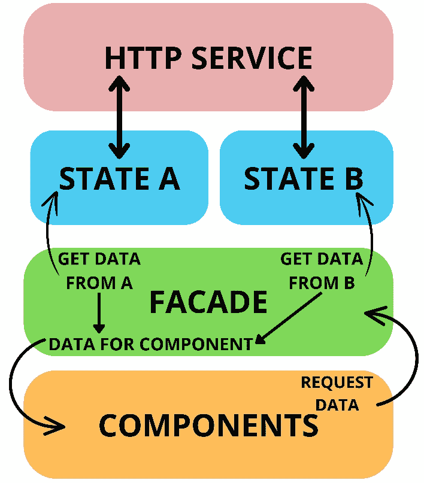

# 第八章：以优雅的方式处理应用状态

在本章中，你将了解应用状态。理解和处理应用状态是前端开发中最基本的部分之一。如果应用的状态变得混乱、纠缠且难以理解，你的开发过程和应用的品质都将受到影响。

为了帮助你更好地管理应用状态，我们将讨论你将在应用中找到的不同状态层级。你将学习如何划分和分割你的状态以实现最大效率。你还将创建一个使用 RxJS 和 Signals 的状态管理解决方案，并构建一个外观服务以从组件层访问状态。

接下来，你将学习如何使用 NgRx 库处理更复杂的状态。NgRx 是 Angular 社区中最常用的状态管理库，它使用 Redux 模式来管理状态。自从 Angular Signals 引入以来，NgRx 也提供了不同的方法来使用 Signals，同时使用我们喜爱的 NgRx 工具。

到本章结束时，你将使用不同的方法实现了状态管理解决方案。你将了解到在使用外观服务时更改状态管理解决方案是多么容易，并看到 Angular Signals 如何改变了我们在 Angular 应用中处理状态的方式。

本章将涵盖以下主题：

+   理解应用状态

+   使用 RxJS 处理全局应用状态

+   使用 Signals 处理全局应用状态

+   使用 NgRx 处理全局应用状态

# 理解应用状态

简而言之，**应用状态**是在特定时间点你的数据、配置和视图当前条件（或状态）的快照。应用状态是从浏览器加载应用的那一刻起，在应用中执行的所有动作的总和。状态是一个动态的景观，它影响着应用视图、用户交互、数据流和整体功能。

在你的应用中拥有良好的状态管理至关重要，这样所有组件都能向最终用户显示正确的数据，你也能在应用代码中有准确的数据进行操作。良好的状态管理可以防止意外的数据更改，从而避免在应用代码中执行你未打算执行的不正确视图和操作。

既然你已经了解了应用状态是什么以及为什么你需要它，那么让我们更深入地探讨，从应用状态的不同层级开始。

## 应用状态的层级

在前端开发的领域，我们可以区分两个层面的状态：全局状态和局部状态。在本节中，我们将深入探讨 Angular 上下文中全局和局部应用状态之间的细微差别，阐明它们在构建健壮和可维护的前端应用中的作用。

正如它们的名称所暗示的，**局部状态**是局部化到文件、组件或应用程序中的元素，而**全局状态**是通过整个应用程序共享的。全局应用程序状态作为共享信息在各个组件之间的中央存储库，确保应用程序行为的一致性和同步性。另一方面，局部应用程序状态封装了特定于单个 Angular 组件和服务的内部数据和配置。

通过理解全局和局部状态的二重性，你的 Angular 应用程序可以在可重用性、封装性和共享数据完整性之间达到和谐的平衡。让我们先深入了解一下 Angular 应用程序中的局部应用程序状态。

### 局部应用程序状态

当我们提到局部状态时，我们指的是那些被局部化到组件或服务中的属性，这些属性决定了该组件或服务如何行为以及如何向应用程序的用户展示数据。

一个局部状态的简单例子是一个具有`count`状态的`Counter`组件：

```js
export class Counter {
  count = signal(0);
  add() { this.count.update((count) => count + 1) }
  subtract() { this.count.update((count) => count - 1) }
}
```

`count`属性用于向用户显示当前计数。`count`属性的声明和更新行为在当前组件内部处理。

在组件内部，你可以将状态视为局部状态，当状态属性不是在多个智能组件之间共享，并且在你从一个页面导航到另一个页面时不需要持久化时。

在服务内部，当状态涉及一个不与外界共享的私有属性，并且该属性不需要比服务文件的生命周期更长的时间来持久化时，可以将其视为局部状态。如果属性不符合这些标准，你可能需要将其定位在全局应用程序状态中的某个位置。

这里有一些 Angular 应用程序中局部状态的常见例子：

+   禁用按钮状态

+   形式有效性状态

+   模态可见性

+   排序和过滤

+   手风琴状态

+   选定的标签页状态

你现在对局部状态有了很好的理解。你知道什么是局部状态，如何识别它，以及处理 Angular 应用程序中局部状态的首选工具是什么。你还了解了一些局部状态的常见例子。接下来，你将学习关于全局应用程序状态的内容。

### 全局应用程序状态

与局部状态相对，全局应用程序状态指的是在 Angular 应用程序中跨多个组件和服务共享的数据和配置。你可以将你的全局应用程序状态视为一个数据集中式存储库。这个信息集中式存储库对于确保应用程序各个部分之间的一致性、同步性和高效通信至关重要。

与局限于特定组件或服务的局部状态不同，全局应用状态在整个应用程序中持续存在，这使得它在需要在不同组件和服务之间共享和同步数据，以及在整个用户会话期间特别有用。

在 Angular 应用程序中，全局状态通常在服务中处理。通过创建一个专门用于管理全局状态的服务，开发者可以确保组件有一个集中的访问点来获取关键信息。包含全局应用状态的服务通常被称为*存储*。例如，您可以使用名为`UserStore`的类调用服务来存储全局用户状态`user.store.ts`。

在较小的 Angular 应用程序中，状态通常使用`Subjects`进行管理。更具体地说，`BehaviorSubject`存储和分发状态属性，而常规的`Subject`分发全局事件。随着 Signals 的引入，一些`BehaviorSubject`类可以被 Signals 替换。我们将在开始构建全局状态管理时，在*使用 RxJS 处理全局应用状态*部分详细看到这一点。

对于较大的 Angular 应用程序，NgRx、NgXs、Akita 和 Angular Query 等库是处理全局状态的首选方法。这些库增强了您优雅地管理状态的能力，并实现了结构化和经过实战检验的设计模式，以可预测和可扩展的方式管理和更新全局状态。

理解何时利用全局应用状态至关重要。如果需要将状态属性在多个智能组件之间共享或超出单个组件的生命周期，则全局状态可能更为合适。现在您已经了解了局部和全局状态是什么，何时使用哪一个，以及有哪些工具可以优雅地管理它们，让我们来学习一些状态管理中的重要概念。

## 状态管理中的基本概念

要在您的 Angular 应用程序中构建一个健壮的状态管理系统，您需要了解状态管理的基本概念。您需要知道这些概念，为什么它们是必要的，以及不使用它们的危险。

在本节中，我们将学习单向数据流、不可变性和副作用。状态管理的一些其他重要基础包括响应性和设计模式，如 Redux 模式，但我们已经在第六章和第七章中讨论过，所以我们将不会深入探讨这一点。

### 单向数据流

**单向数据流**是我们将要讨论的第一个状态管理概念。正如其名称所暗示的，这个概念表明数据应该在整个应用程序中单向流动。数据的变化通过定义良好的动作或事件发生，确保信息流清晰且可预测。单向数据流简化了调试，使代码更可预测，并提高了可维护性。它通过强制应用程序中的数据清晰流动来防止意外的副作用。

没有单向数据流，追踪状态变化的原因会变得具有挑战性，导致调试困难以及数据一致性的潜在问题。不受控制的数据流可能导致不可预测的行为，尤其是在大型和复杂的应用程序中。

单向数据流的概念在整个应用程序中都很重要，无论是局部还是全局应用程序状态。对于全局应用程序状态，我建议始终使用单向数据流。在局部组件状态中，有时你可以通过使用 Angular 双向数据绑定来做出例外。

为了帮助你理解单向数据流在 Angular 应用程序中的样子，这里有一个流示例：

1.  状态从存储传递到外观服务。

1.  状态从外观服务传递到智能组件。

1.  智能组件将数据传递给（无状态的）子组件。

1.  视图根据智能组件及其子组件的状态进行渲染。

1.  视图中可以触发一个动作。

1.  动作的事件和相关信息从（无状态的）子组件向上移动到智能组件。

1.  智能组件或外观向存储派发一个动作。

1.  存储根据派发的动作更新状态。

1.  状态从存储传递到外观。

正如你所见，数据从存储开始，单向流动直到视图可以被渲染。当用户在视图中触发一个动作时，数据会以单向和可预测的方式流回存储，直到形成一个完整的循环。现在你已经了解了单向数据流是什么以及为什么它在状态管理中很重要，让我们来学习不可变性的概念。

### 不可变性

**不可变性**涉及不直接修改现有数据结构的实践。相反，会创建带有所需更改的新副本，以保持原始数据的完整性。不可变性通过提供一个单一的位置来修改你的状态，简化了状态管理。它有助于防止意外的状态更改和副作用，在跟踪和管理 Angular 应用程序中的复杂状态时尤其有价值。

通过不可变性，你可能发现跟踪状态变化和保持状态同步更容易。直接修改状态对象可能导致错误和意外的行为。不可变性主要在全局状态管理中使用，但随着 Signals 的引入，现在它也应用于 Angular 应用程序的本地状态。

### 副作用

**副作用**指的是当你的状态中的某个特定部分发生变化时，你执行的操作或更改。副作用可能包括以下内容：

+   获取数据

+   更新本地存储

+   分发额外的动作

+   设置局部变量

通过隔离副作用，你可以在你的应用程序中保持关注点的清晰分离。核心应用程序逻辑（reducers、actions 和 selectors）专注于状态变化，而副作用则单独处理。副作用在 Angular 框架的 Signals API 中自然引入，并在像 NgRx 和 NgXs 这样的流行状态管理库中使用。

因此，总结一下，在你的应用程序中存在本地和全局状态。本地状态局限于组件或服务，而全局状态影响整个应用程序。状态管理的一些基本概念包括单向数据流、不可变性和副作用。你了解了这些概念的优势以及为什么它们对于状态管理解决方案很重要。你还了解了状态管理是什么以及为什么你需要在应用程序中使用它。

在下一节中，你将开始构建一个全局状态管理解决方案，并创建一个门面服务以从你的智能组件内部访问状态。

# 使用 RxJS 处理全局应用程序状态

在本节中，你将创建一个简单的状态管理解决方案，使用 RxJS。这个状态管理解决方案的核心是 RxJS 的`BehaviorSubject`类。你还将创建一个门面服务以与状态管理解决方案交互。

门面将负责与状态管理解决方案和智能组件的所有通信。这使我们的智能组件与状态管理解决方案解耦，便于在需要时轻松交换我们的状态管理实现。

一旦我们创建了 RxJS 状态管理解决方案并将其与应用程序的组件层连接起来，我们就可以将状态管理和门面更改为在可能且合理的地方使用 Signals。

通过将状态管理解决方案从 RxJS 转换为 Signals，你将能够理解这两个概念并了解它们之间的区别。构建这两种方法也将为你提供最佳服务，以便你在加入的项目中遇到它们时能够识别并与之合作。让我们从构建 RxJS 状态管理解决方案开始。

## 使用 RxJS 构建状态管理解决方案

要开始构建状态管理解决方案，在财务域的`data-access`库中创建一个名为`stores`的文件夹。`stores`文件夹应位于`lib`文件夹内部，与`adapters`、`HTTP`、`models`和`services`文件夹处于同一级别。

### 创建一个服务

首先，你可以通过在新建的`stores`文件夹中使用*Nx 生成器*来创建一个服务。将新服务命名为`expenses.store`。因为我们使用的是 Nx 生成器，它将创建一个名为`expenses.store.service.ts`的文件；你可以手动删除`.service`部分，并对`spec`文件做同样的处理。

接下来，将类名从`ExpensesStore`改为`ExpensesStoreService`并移除`constructor`；当你准备好时，这应该在你的文件中：

```js
@Injectable({ providedIn: 'root' })
export class ExpensesStore {}
```

接下来，你需要一个可以保存你支出列表状态的东西。我们将使用一个`BehaviorSubject`类，该类将发出一个`ExpenseModel`数组。`BehaviorSubject`类将是一个私有属性，因此你无法直接从我们的`ExpensesStore`类外部修改状态。

只有`ExpenseStore`类应该能够直接修改状态；应用程序的其他部分应该通过`ExpenseStore`以及更精确地说，通过外观（facade），来修改状态。允许应用程序的其他部分直接修改状态可能导致意外的状态修改，破坏你的应用程序。

由于`BehaviorSubject`类是私有的，你还需要一个公共属性，该属性将`BehaviorSubject`类暴露给外部世界作为一个可观察对象（Observable）：

```js
private expenses = new BehaviorSubject<ExpenseModel[]>([]);
expenses$ = this.expenses.asObservable();
```

如你所见，我们首先定义了`expenses` `BehaviorSubject`类，并通过在`BehaviorSubject`类上调用`asObservable()`方法创建了公共的`expenses$`可观察对象（Observable）。我们给`expenses` `BehaviorSubject`类提供了一个空数组作为其默认值。接下来，让我们添加一些逻辑来获取和分发我们的数据。

### 在我们的存储中获取和分发数据

接下来，我们将添加一些逻辑来执行 API 请求以检索支出，并通过`BehaviorSubject`类发出接收到的支出。为了实现这一点，首先注入我们在*第六章*中创建的`ExpensesHttpService`类：

```js
protected expensesApi = inject(ExpensesHttpService);
```

接下来，你需要创建一个方法来执行 API 请求并更新`BehaviorSubject`类：

```js
fetchExpenses(): void {
  this.expensesApi.get().subscribe({
    next: (expenses) => { this.expenses.next(expenses) },
    error: (err) => { console.log(‹err ==>›, err) }
  });
}
```

如你所见，我们创建了一个名为`fetchExpenses`的方法，并在该方法内部使用`expensesApi`来执行`get`请求。我们订阅了`get`请求并处理了订阅的`next`和`error`事件。当`get`请求的订阅收到响应时，处理`next`事件；当`get`请求失败并返回错误状态时，处理`error`事件。

如果 API 请求成功响应，我们在`expenses` `BehaviorSubject`类上调用`next()`方法，并给它传递接收到的`expenses`作为参数。如果 API 返回错误，我们简单地记录错误。在生产应用程序中，你应该更好地处理这种情况，并使用托盘消息或类似的方式提醒用户。

### 添加额外的费用方法

接下来，你将想要添加通过 ID 获取费用、更新、删除和添加费用的方法。在创建这些方法之前，必须调整`MockInterceptor`以处理`delete`和`getByID`请求。你可以自己修改拦截器，或者从本书的 GitHub 仓库中获取调整后的`MockInterceptor`：[`github.com/PacktPublishing/Effective-Angular`](https://github.com/PacktPublishing/Effective-Angular)。

在调整`MockInterceptor`后，你可以在我们的费用存储中实现`add`、`delete`、`update`和`getByID`方法。在这些方法内部，我们需要访问当前的费用列表。你可以通过`expenses` `BehaviorSubject`类的`value`属性访问当前的费用列表。让我们创建一个获取器，从我们的状态中检索当前的费用：

```js
private get currentExpenses() {return this.expenses.value}
```

现在，我们可以开始添加方法。

#### 添加费用

让我们先创建一个添加费用的方法：

```js
addExpense(expense: ExpenseModel): void {
  this.expensesApi.post(expense).subscribe({
    next: (addedExpense) => {
      addedExpense.id = !addedExpense.id ? this.currentExpenses.length + 1 : addedExpense.id;
      this.expenses.next([...this.currentExpenses, addedExpense]);
    },
    error: (err) => { console.log(‹err ==>›, err) }
  })
}
```

如你所见，`addExpense`代码将`expense`作为函数参数。这个`expense`参数用于在`expenseApi`上调用`POST`请求。

当 API 返回响应时，我们更新`ID`属性（我们只更新`ID`属性，因为我们没有实际的后端。通常，`ID`会由后端填充）。更新`ID`属性后，我们将新创建的`expense`添加到`expenses`状态中。

#### 删除费用

在创建`addExpense`方法后，你可以创建一个删除费用的方法：

```js
deleteExpense(id: number): void {
  this.expensesApi.delete(id).subscribe({
    next: () => {
      this.expenses.next(this.currentExpenses.filter(expense => expense.id !== id));
    },
    error: (err) => { console.log(‹err ==>›, err) }
  })
}
```

`delete`方法相当直接。我们发起 API 请求，当 API 响应时，我们通过调用`next()`方法更新`expenses`状态，以获取新的费用列表。作为`next()`方法的参数，我们使用当前的`expenses`列表并使用`filter`过滤掉已删除的费用。如果 API 返回错误，我们记录错误，同样在生产应用程序中，我们向用户显示某种消息。

#### 获取、获取和选择费用

在添加`delete`方法后，我们将添加`getExpense`、`selectExpense`和`fetchExpenseById`方法。`getExpense`和`selectExpense`方法将是公共方法，而`fetchExpenseById`将是私有方法。我们还将创建一个`expense` `Subject`类和一个`selectedExpense`状态，使用`BehaviorSubject`类。

让我们先添加`Subject`类和`selectedExpense`状态：

```js
private expense: Subject<ExpenseModel> = new Subject();
expense$: Observable<ExpenseModel> = this.expense.asObservable();
private selectedExpense: BehaviorSubject<ExpenseModel | null> = new BehaviorSubject<ExpenseModel | null>(null);
selectedExpense$ = this.selectedExpense.asObservable();
```

`expense` `Subject` 类和 `selectedExpense` 状态可以用来响应式地检索选定的费用。当您需要将选择持久化到全局应用程序状态时，使用 `selectedExpense` 状态。相比之下，`expense Subject` 类可以用来发出一个事件，该事件只被在事件发出时订阅的观察者接收。在添加了 `expense Subject` 类和 `selectedExpense` 状态之后，我们将继续使用私有的 `fetchExpenseById` 方法：

```js
private fetchExpenseById(id: number, select = false) {
  this.expensesApi.getById(id).subscribe({
    next: (expense) => { select ? this.selectedExpense.next(expense) : this.expense.next(expense) },
    error: (err) => { console.log(‹err ==>›, err) }
  })
}
```

`fetchExpenseById` 方法有 `id` 和 `select` 参数。`id` 参数是必需的，而 `select` 属性是可选的，默认值为 `false`。该方法首先通过 API 调用来通过 ID 获取费用。当 API 响应费用时，我们将使用 `expense Subject` 发出一个新值，或者使用 `BehaviorSubject` 类发出一个值并设置 `selectedExpense` 状态。根据您应用程序的需求，您还可以将获取的费用添加到 `expenses` 状态中，但对我们这个演示应用程序来说，这不是必需的。

现在，为了完成通过 `id` 获取费用的逻辑，我们需要实现公共的 `getExpense` 和 `selectExpense` 方法：

```js
getExpense(id: number): void {
  const expense = this.currentExpenses.find(expense => expense.id === id);
  expense ? this.expense.next(expense) : this.fetchExpenseById(id);
}
selectExpense(id: number): void {
  const expense = this.currentExpenses.find(expense => expense.id === id);
  expense ? this.selectedExpense.next(expense) : this.fetchExpenseById(id, true);
}
```

如您所见，`getExpense` 和 `selectExpense` 方法非常相似。两种方法都接收 `id` 作为参数，并检查提供的 `id` 参数是否可以在当前的 `expenses` 状态中找到。

当在当前状态中找到费用时，会在 `expense Subject` 类或 `selectedExpense` `BehaviorSubject` 类上调用 `next()` 方法。当在当前的 `expenses` 状态中没有找到费用时，会调用 `fetchExpenseById` 方法从后端获取费用；在这种情况下，`fetchExpenseById` 方法将调用 `expense Subject` 或 `selectedExpense BehaviorSubject` 类。既然我们已经添加了获取或选择费用的响应式方法，让我们添加 `updateExpense` 方法。

#### 更新费用

`update` 方法将接收 `expense` 作为函数参数。接下来，它将使用 `expensesApi` 发起 `PUT` 请求来更新后端中的请求。在 API 成功响应后，该方法将更新 `expenses` 状态：

```js
updateExpense(expense: ExpenseModel): void {
  this.expensesApi.put(expense).subscribe({
    next: (expense) => {
      this.expenses.next(this.currentExpenses.map(exp => exp.id === expense.id ? expense : exp));
    },
    error: (err) => { console.log(‹err ==>›, err) }})
}
```

如您所见，我们发起 API 请求并在 `expenses BehaviorSubject` 上使用 `next()` 方法来更新 `expenses` 状态。作为 `next()` 方法的参数，我们使用 `currentExpenses` 获取器并使用 `map()` 函数来替换更新的费用。

现在我们已经添加了添加、更新、删除和获取费用的方法，让我们通过添加一些额外的状态和重置状态的方法来完成这个存储。

### 扩展 ExpensesStore

我们将首先添加一个额外的状态来管理是否显示价格，包括或排除增值税。我们可以通过创建一个新的 `BehaviorSubject` 类和一个调整 `BehaviorSubject` 类值的方法来实现这一点：

```js
private inclVat = new BehaviorSubject<boolean>(false);
inclVat$ = this.inclVat.asObservable();
adjustVat(): void {
  this.inclVat.next(!this.inclVat.value);
}
```

如您所见，增值税状态只是一个简单的布尔值，表示我们是否显示包含或不含增值税的价格。

最后，我们需要一些逻辑来重置我们的应用程序状态并清除所选产品状态。我们将为`resetState`创建两个不同的方法来将所有状态重置为默认值。我们将使用`clearExpenseSelection`方法来清除`selectedExpense`状态：

```js
clearExpenseSelection(): void {
  this.selectedExpense.next(null);
}
resetState(): void {
  this.expenses.next([]);
  this.selectedExpense.next(null);
  this.inclVat.next(false);
}
```

这是我们费用存储的最后一部分。您创建了一个简单而有效的状态管理解决方案来处理费用的全局应用程序状态。您这样做使用了 RxJS 的`Subject`和`BehaviorSubject`类。现在，`ExpensesStore`可以成为您应用程序中所有费用数据的单一事实来源。

如果一个组件需要某些费用数据的当前状态，它将来自这个`ExpensesStore`。当您的应用程序增长，并且您有除了费用之外的其他实体具有状态，例如用户、报告或设置时，每个实体都将有一个存储文件来管理该实体的状态。

现在您已经使用 RxJS 创建了一个状态管理解决方案，我们将开始构建门面服务，并通过门面将视图层与存储连接起来。

## 使用门面服务连接您的状态管理和视图层

现在您已经有一个状态管理解决方案，是时候将其连接到您应用程序的视图层了。正如本书中多次提到的，最佳方法是为此创建一个门面服务。这个门面提供了一层额外的抽象，为您的视图层提供了一个简单的接口来与应用程序状态交互。*图 8.1*展示了门面服务以及数据如何从您的状态通过门面流入组件：



图 8.1：使用门面、组件和状态的数据流

如您所见，您的组件向门面服务发出一个简单的请求，门面将从您的不同状态服务中收集数据，并以组件所需格式将其发送回组件。这确保了您的组件只有一个依赖项，而门面将托管所有其他必要的依赖项以检索您组件所需的数据。

### 创建门面服务

首先，在您的`expenses` `data-access`库的`lib`文件夹内创建一个`facades`文件夹。新的`facades`文件夹将位于与`store`文件夹相同的文件夹中。

在新的`facades`文件夹内，您必须创建一个名为`expenses.facade.ts`的文件，并包含一个名为`ExpensesFacade`的可注入类。您可以使用 Nx 生成器创建一个服务并重命名它，或者手动创建门面。此外，在`index.ts`文件中添加一个导出，以便您可以在库外部使用门面。

当您完成时，您应该在`expenses.facade.ts`文件中有以下内容：

```js
@Injectable({ providedIn: 'root' })
export class ExpensesFacade {}
```

### 创建外观接口

接下来，在 `expenses.facade.ts` 文件旁边创建一个名为 `expensesFacade.interface.ts` 的文件。在这个接口中，我们将声明外观的蓝图。只要你的外观实现了这个接口，你就可以在不接触组件层的情况下切换状态实现。如果你更改了接口，你也需要调整组件层。

在接口文件中，声明以下接口：

```js
export interface IExpensesFacade {
  expenseSelector$: Observable<ExpenseModel>;
  selectedExpenseSelector$: Observable<ExpenseModel>;
  inclVatSelector$: Observable<boolean>;
  addExpense(expense: ExpenseModel): void;
  adjustVat(): void;
  clearExpenseSelection(): void;
  deleteExpense(id: number): void;
  fetchExpenses(): void;
  getExpense(id: number): void;
  getExpenses(id: number): Observable<ExpensesViewModel>;
  resetExpenseState(): void;
  selectExpense(id: number): void;
  updateExpense(expense: ExpenseModel): void;
}
```

在定义了接口之后，我们可以开始实现外观服务。首先实现接口：

```js
export class ExpensesFacade implements IExpensesFacade {…}
```

现在，你想要在外观服务内部注入 `ExpensesStore`：

```js
protected readonly expensesStore = inject(ExpensesStore);
```

现在我们已经注入了存储库，我们将添加一个获取费用的方法。

### 将外观与存储库连接

让我们在外观中添加一个简单的方法，该方法简单地调用存储库中的 `fetch` 方法：

```js
fetchExpenses() {
  this.expensesStore.fetchExpenses();
}
```

接下来，我们将创建一个获取已获取费用的方法。但在我们这样做之前，我们将创建一个新的接口，称为 `ExpensesViewModel`：

```js
export interface ExpensesViewModel {
  total: number;
  inclVat: boolean;
  expenses: ExpenseModel[];
}
```

你也可以稍微调整 `ExpenseModel` 并将 `amountExclVat` 属性重命名为 `value`。如果你使用 VS Code，你可以选择属性并按 *F2* 键来重命名它。当你使用 *F2* 键重命名时，属性将在每个实例中重命名（除了 HTML 模板之外）。

现在你已经创建了 `ExpensesViewModel` 并调整了 `ExpenseModel`，让我们在外观内部创建 `getExpenses` 方法：

```js
getExpenses(): Observable<ExpensesViewModel> {
  return combineLatest([this.expensesStore.expenses$, this.expensesStore.inclVat$]).pipe(
    distinctUntilChanged(),
    map(([expenses, inclVat]) => ({
      expenses: structuredClone(expenses).map(expense => {
        expense.amount.value = inclVat ? expense.amount.value * (1 + expense.amount.vatPercentage / 100) : expense.amount.value;
        return expense;
      }),
      inclVat,
      total: expenses.reduce((acc, expense) => {
        return acc + (inclVat ? (expense.amount.value * (1 + expense.amount.vatPercentage / 100)) : expense.amount.value);
      }, 0),
    }))
  );
}
```

如你所见，这个方法中有很多事情在进行。这是使用外观服务有益的原因之一。

在大型应用程序中，你需要在多个组件中使用这个 `ExpensesViewModel` 的可能性很高。你不需要在多个组件类中定义这块逻辑，你可以在外观内部定义它，在组件层内部，你可以使用简单的函数调用，保持你的组件简单和干净。此外，当你需要调整逻辑时，你只需要在这个单一位置进行调整，而不是在多个组件类中。现在，为了更好地理解我们在函数内部做了什么，让我们逐行分解：

1.  我们首先命名了方法为 `getExpenses` 并指定它将返回一个 `ExpensesViewModel` 可观察对象。

1.  在 `getExpenses()` 方法内部，我们使用 `combineLatest()` 方法返回了一个可观察对象。

1.  在 `combineLatest()` 内部，我们将存储库中的 `expenses$` 和 `inclVat$` 可观察对象组合起来，并应用了 RxJS 的 `pipe()` 函数到 `combineLatest()`。

1.  在 `pipe()` 函数内部，我们应用了两个操作符，从 `distinctUntilChanged()` 操作符开始，这样我们只有在值发生变化时才发出新的值。

1.  接下来，我们使用了 `map()` 操作符将两个可观察对象流映射到 `ExpensesViewModel`。

1.  根据 `inclVat$` 可观察对象的状态，我们返回费用值属性和总属性，包括或排除增值税。

现在你已经在外观内部创建了 `fetch-` 和 `getExpenses` 方法，让我们调整费用概览页面。

### 调整支出概览页面

在页面组件内部，首先注入外观服务：

```js
protected readonly expensesFacade = inject(ExpensesFacade);
```

在注入外观后，你可以在页面组件的`ngOnInit()`方法中获取支出：

```js
ngOnInit() { this.expensesFacade.fetchExpenses() }
```

接下来，你可以清理组件。在*第七章*中，我们使用模拟数据为`expenses`创建了一个信号；在本节中，我们将使用外观内部`getExpenses`方法接收到的支出。首先，像这样重新分配`expenses`属性：

```js
expenses = this.expensesFacade.getExpenses();
```

在重新分配`expenses`属性后，由于你不再拥有`expenses`信号，你将在支出概览页面的组件和模板文件中遇到一些错误。继续移除`totalInclVat`计算信号；你还可以移除组件中的信号效果，并在`onAddExpense`方法内部清除逻辑。

接下来，我们需要对 HTML 模板做一些调整。

首先在 HTML 表格周围添加一个`if-else`块：

```js
@if(expenses | async; as expensesVm) {……} @else {Loading… }
```

在`if`块内部，你将使用带有`async`管道的`expenses`属性，以便从外观中检索`expenses`并使用这些值在模板中。

在添加`if`块后，你需要调整 HTML 模板内部的`for`块，并将`expenses`信号切换为你从外观中检索到的`expenses`属性：

```js
@for (expense of expensesVm.expenses; track expense.id){…}
```

调整`for`块后，你需要调整表格行以正确反映新的模型结构并改进 UI。通过将值四舍五入到两位小数，然后添加`currency`管道和百分比（`%`）符号来完成此操作：

```js
<td>{{ expense.amount.value.toFixed(2) | currency }}</td>
<td>{{ expense.amount.vatPercentage }}%</td>
```

最后，你需要将模板中使用的`totalInclVat`计算信号切换为`expensesVm`上的`total`属性：

```js
<td>Total: {{expensesVm.total}}</td>
```

在这里，我们将文本调整为`total`，因为我们现在显示包括或排除增值税的总金额。在做出这些调整后，你应该再次在表格中看到总金额和支出，但现在使用 RxJS 和全局状态而不是带有模拟`expenses`的信号。

接下来，你想要一个可以切换增值税的选项，以便在增值税状态改变时自动更新显示的支出和总金额。

首先在组件服务内部添加一个新方法：

```js
adjustVat() { this.expensesStore.adjustVat() }
```

如你所见，这只是一个调用存储中`adjustVat`方法的简单方法调用。这将改变存储中`inclVat` `BehaviorSubject`类。这反过来将触发我们在外观内部的`getExpenses`方法中使用的`combineLatest()`方法。

因此，当你更改增值税状态时，通过`getExpenses`方法检索到的`ExpensesViewModel`将自动更新并显示总金额和支出金额，包括或排除增值税，具体取决于状态。

一旦你添加了调整增值税的方法，你还需要在组件内部检索`inclVat`状态。你可以简单地创建一个属性并使用存储中的`inclVat$`可观察对象来分配它：

```js
inclVatSelector$ = this.expensesStore.inclVat$;
```

在添加了调整和检索增值税状态的方法和属性后，让我们在费用概述页面的 HTML 模板中添加一个切换来调整增值税状态：

```js
<div class="vatToggle">
  <span>Incl. VAT:</span>
  <label class=»switch»>
    <input (click)=»expensesFacade.adjustVat()" type="checkbox"
      [checked]=»expensesFacade.inclVatSelector$ | async">
    <span class=»slider round»></span>
  </label>
</div>
```

我在`inclVatSelector$`旁边添加了增值税切换，并结合了`async`管道来设置增值税切换的`checked`属性。

我们还向切换按钮的`input`值添加了一个`click`事件，以便在门面中调用`adjustVat`方法。如果你点击切换按钮，你将看到表格中的费用金额和表格摘要中的总金额根据增值税状态的变化而包含或排除增值税金额。

如您可能已经注意到的，这是一个非常响应式的方法，因为所有内容都会在状态变化时自动做出反应。代码也非常高效，因为更新是以非阻塞方式执行的，允许所有代码继续运行。

现在我们已经实现了`getExpenses`方法和增值税状态，让我们完成门面服务的开发。

### 完成门面服务的开发

对于存储公开的所有其他方法，你可以在门面服务中添加简单的方法来调用它们，类似于我们处理`fetchExpenses`和`adjustVat`方法的方式。

对于存储中的`selectedExpense`和`expense`属性，你需要在门面服务中添加一个选择器属性。因为我们还将映射由`selectedExpense`和`expense`发出的费用，所以我们将映射行为抽象到一个新的函数中，以便我们可以重用它：

```js
private mapExpense(expense: ExpenseModel, inclVat: boolean) {
  const expenseClone = structuredClone(expense) as ExpenseModel;
  expenseClone.amount.value = inclVat ? expenseClone.amount.value * (1 + expenseClone.amount.vatPercentage / 100) : expenseClone.amount.value;
  return expenseClone;
}
```

接下来，你可以像这样调整`getExpenses`方法内部的费用映射：

```js
expenses: expenses.map(expense => this.mapExpense(expense, inclVat)),
```

最后，我们将为`selectedExpense`和`expense`添加选择器属性，从`expenseSelector$`开始：

```js
expenseSelector$ = this.expensesStore.expense$.pipe(withLatestFrom(this.expensesStore.inclVat$), map(([expense, inclVat]) => this.mapExpense(expense, inclVat)));
```

如您所见，对于`expenseSelector$`，我们使用了`withLatestFrom()`运算符而没有使用`combineLatest()`。我们这样做是因为`expenseSelector$`将只使用`Subject`类而不是`BehaviorSubject`作为事件发出值。这里没有状态，我们不希望选择器在增值税切换变化时发出新值。我们只想在`expense` `Subject`类发出值时做出反应，并且当这种情况发生时，使用当前`inclVat$` Observable 的值来映射费用。

`selectedExpense`的选择器属性将使用`combineLatest()`函数将`selectedExpense$` Observable 和`inclVat$` Observable 结合起来，如下所示：

```js
selectedExpenseSelector$ = combineLatest([this.expensesStore.selectedExpense$, this.expensesStore.inclVat$]).pipe(filter(([expense]) => !!expense), map(([expense, inclVat]) => this.mapExpense(expense as ExpenseModel, inclVat)));
```

对于`selectedExpenseSelector$`，我们使用了`combineLatest()`函数，因为选定的费用是状态性的，并且持续存在于我们的存储中。当我们可以更改增值税时，我们可以在视图中使用选定的费用，因此我们希望它在增值税状态变化时做出反应，并更新视图中的金额。因为我们希望`selectedExpense`对增值税状态也是响应式的，所以我们使用了`combineLatest()`运算符，它在组合的任何一个 Observables 发出新值时都会触发。

这就是使用 RxJS 实现状态管理解决方案的最后一部分。这种状态管理方法通常用于较小的 Angular 应用程序中，其中状态在许多不同的组件和服务中不被使用。该解决方案提供了良好的响应性，并且易于构建和理解。

现在，让我们学习如何将这个状态管理解决方案转换为使用信号（Signals）而不是 RxJS。使用信号将简化你的外观服务（facade service）和组件层。它还允许 Angular 进行更好的变更检测。如果你需要组合许多数据流并应用定制逻辑，RxJS 方法将更适合你的应用程序。

话虽如此，对于简单的状态和数据流，使用信号（Signals）要简单得多。即使你需要组合一些数据流而不需要过多控制这个过程，信号方法也将最适合你。如果你发现自己只使用`combineLatest()`和`withLatestFrom()`以及一些基本操作符，如`map()`和`filter()`，那么信号将是你的状态管理方式。

# 使用信号处理全局应用程序状态

为了将你的状态管理解决方案转换为使用信号而不是 RxJS，你必须将`ExpensesStore`中的`BehaviorSubject`类更改为信号。你仍然想要确保状态仅在存储库中设置时才发出新值；你不想能够在存储库外部设置状态。

为了实现这一点，我们将创建一个私有的`WritableSignal`和一个公共的只读`Signal`。你可以使用以下语法将所有`BehaviorSubject`类更改为信号：

```js
private expensesState = signal<ExpenseModel[]>([]);
expenses = this.expensesState as Signal<ExpenseModel[]>;
```

在这里，我们使用`signal()`函数声明了一个私有信号（Signal）。以这种方式声明信号将创建`WritableSignal`。在下一行，我们创建了一个公共属性，并将其分配给`WritableSignal`，但使用`as`关键字将其转换为`Signal`类型；这里的`Signal`类型是只读的。在调整所有`BehaviorSubject`类之后，你需要更改在存储库内部对它们的引用。

首先移除`currentExpenses`获取器，并将所有`this.current` **Expenses**实例更改为以下内容：

```js
this.expenses()
```

接下来，在`adjustVat()`函数内部，将`!this.incluVat.value`更改为以下内容：

```js
!this.inclVat()
```

最后，你需要调整所有使用`next()`方法在某个`BehaviorSubject`类上的实例。

下面是一个如何转换`resetState()`函数的示例：

```js
resetState(): void {
  this.expensesState.set([]);
  this.selectedExpenseState.set(null);
  this.inclVatState.set(false);
}
```

现在，将所有其他`next()`方法实例更改为`Subject`类和`set()`方法。这就是我们为`ExpensesStore`需要做的所有事情；你现在拥有使用信号而不是 RxJS `BehaviorSubject`类的状态管理。在调整状态后，我们需要调整`ExpensesFacade`，使其能够与信号而不是观察者（Observables）一起工作。

通常来说，外观服务的一个优点是它是一个抽象层，在改变状态管理解决方案时我们不需要触及组件层。但在这个情况下，我们需要调整外观服务和组件层；这是因为我们将要改变外观服务的接口。

理论上，我们可以保持接口不变，并在服务中将信号转换回可观察对象，这样就可以不触及组件层。然而，我们想要充分利用这些信号的力量，并在我们的组件中实现它们，以便 Angular 可以执行更好的变更检测，我们也可以使我们的模板同步。为了实现这一点，我们需要从我们的外观服务返回信号而不是可观察对象，改变外观服务的接口。

我们将通过改变接口来开始改变外观。将接口内部的 `getExpenses` 方法替换为 `expenses` 属性，并像这样调整 `selectedExpenseSelector$` 和 `inclVatSelector$` 属性：

```js
selectedExpense: Signal<ExpenseModel | null>;
inclVat: Signal<boolean>;
expenses: Signal<ExpensesViewModel>
```

在接口中做出上述调整后，你就可以开始在外观服务内部实现接口。为了在接口中实现更改，删除 `getExpenses` 方法。而不是 `getExpenses` 方法，你必须创建一个计算信号，它返回与 `getExpenses` 方法相同的价值：

```js
expenses = computed<ExpensesViewModel>(() => {
  const inclVat = this.expensesStore.inclVat();
  return {
    expenses: this.expensesStore.expenses().map(expense => this.mapExpense(expense, inclVat)),
    inclVat,
    total: this.expensesStore.expenses().reduce((acc, expense) => {
      return acc + (inclVat ? (expense.amount.value * (1 + expense.amount.vatPercentage / 100)) : expense.amount.value);
    }, 0),
  }
});
```

如你所见，计算信号与 `getExpenses` 方法非常相似。主要区别是我们不再需要 `combineLatest()` 和 `map()` 操作符。现在我们可以在计算信号中使用 `inclVat` 和 `expenses` 信号。

当两个信号中的任何一个接收到新值时，计算信号将自动计算一个新的值。计算信号可以看作是信号领域的 `combineLatest()`。`withLatestFrom()` 的等价物将是在计算信号中使用信号并使用 `untracked()` 函数包装信号，正如我们在 *第七章* 中讨论的那样。

在添加了计算信号之后，我们需要在外观服务内部实现 `inclVat` 和 `selectedExpense` 信号。这很简单——你只需定义属性，并用从 `ExpensesStore` 获取的信号分配给它：

```js
inclVat = this.expensesStore.inclVat;
selectedExpense = this.expensesStore.selectedExpense;
```

在这里，我们通过从存储中获取的信号来分配属性；我们不是通过添加函数括号 `()` 来调用信号。我们不添加这些函数括号是因为我们想在组件层中使用实际的信号，而不是 `Signal` 值。如果你在这里调用信号并检索组件层内的值，更新行为将不会按预期工作，并且当你的状态改变时视图不会更新。

最后要做的事情是调整 `ExpensesOverviewPageComponent` 及其模板。在组件类内部，你可以调整 `expenses` 属性，并用外观服务中的 `expenses Subject` 类代替 `getExpenses()` 函数分配给它：

```js
expenses = this. expensesFacade.expenses;
```

现在，在 HTML 模板内部，你需要将 `inclVatSelector$` 改为 `inclVat()`，移除 `async` 管道，并将带有 `async` 管道的 `expenses` 改为不带 `async` 管道的 `expenses()`：

```js
[checked]="expensesFacade.inclVat()"
@if(expenses(); as expensesVm) { …… }
```

在前面的更改中，你已经调整了组件类和 HTML 模板以使用 Signals 而不是 Observables。正如你所见，使用 Signal 方法稍微简单一些，并且需要更少的代码行。它还使你的 HTML 模板同步，并帮助 Angular 进行更好的变更检测，从而提高性能。

另一方面，你对数据流的控制较少，在数据流到达你的应用程序逻辑之前修改流并不容易。与 RxJS 相比，当你想要组合不同的数据流时，Signals 也提供了较少的控制，因此根据你的需求，你可以决定是否使用 Signals 或 RxJS。

你还可以创建一个混合解决方案，将 Observables 转换为 Signals，这样你就可以兼得两者之优。在这种情况下，你可以使用你需要的 RxJS 操作符，并且仍然可以在组件类和 HTML 模板中将值作为 Signals 消费。

通过这样，你已经学会了如何使用 RxJS 和 Signals 创建状态管理解决方案。你创建了一个外观服务作为额外的抽象层，并学习了在与外观服务一起工作时，何时需要更改组件层，何时只需要更改状态管理层。

我们创建的两个状态管理解决方案对于具有相对简单全局状态的小型应用程序都表现良好。RxJS 方法得到了广泛实现，随着 Signals 的普及，我想 Signal 方法也将得到广泛实现。但是，当你有一个较大的应用程序，其中状态在许多组件和服务中使用时，你将遇到我们当前实现的问题。在下一节中，你将了解这些问题以及如何解决它们。

# 使用 RxJS 或 Signals 进行全局状态管理的问题

虽然我们当前的状态管理解决方案被用于许多应用程序并且对我们的当前应用程序表现良好，但存在一个巨大的问题：我们当前的全局状态管理解决方案不是不可变的。

你不能从存储外部修改你的 `BehaviorSubject` 类或 Signals，因此从这个意义上说，它是不可变的。此外，当使用原始值作为状态时，状态本身也是不可变的。然而，当你使用引用对象作为 `BehaviorSubject` 类或 Signals 的值时，状态本身并不是不可变的。

当你使用数组或对象作为你的状态，并通过 `BehaviorSubject` 或 `Signal` 检索状态时，你可能会无意中修改状态值。当你在一个组件或服务类中调整检索到的状态对象时，`BehaviorSubject` 或 `Signal` 的值也会被修改！

这也是我们在 `mapExpenses()` 函数内部使用 `structuredClone()` 函数的原因。如果你移除 `structuredClone()` 并在视图中切换增值税几次，你会注意到金额持续增加，而不是添加和移除增值税。这是因为我们每次在门面服务内部调整对象时，都会在 `Signal` 或 `BehaviorSubject` 内部修改对象。

下次我们检索状态时，它仍然具有调整后的值，而不是我们期望的真实状态。依赖开发者始终在修改对象时进行克隆是危险的，这不是你想要的方式。

允许你的状态在商店外部被修改，且没有在 `BehaviorSubject` 或 `Signal` 上调用 `next()` 或 `set()` 方法，这为意外的状态变化打开了大门，导致状态损坏。当你的状态不是你所期望的那样时，你可能会向用户显示错误的数据，并在你的代码中执行非预期的操作。

对于那些状态在多处不常被使用的小型应用来说，这可能是一个可管理的问题，但当你的应用增长，状态在多个地方被使用，并且经常在本地修改检索到的状态时，问题会迅速显现。

要有一个真正不可变、响应式且可以处理任何应用状态（无论它变得多大）的状态管理系统，你的最佳选择是选择一个专注于状态管理的优秀库。Angular 社区中的一些流行选择如下：

+   NgRx

+   NgXs

+   RxAngular

+   狗

+   Angular Query

所有这些库都有它们的优缺点。我个人的最爱是 RxAngular、NgXs 和 NgRx。NgRx 是社区中最常用的状态管理解决方案，它提供了基于 Observable 和 Signal 的状态管理支持。RxAngular 正在获得越来越多的关注，它以非常直观的方式管理状态，几乎不需要样板代码；它还允许你放弃 ZoneJS，提高你应用的性能。

在下一节中，我们将把我们的状态管理解决方案转换为 NgRx 状态管理解决方案。我选择 NgRx 是因为它是最常用的解决方案，但我建议你调查一些其他解决方案。

# 使用 NgRx 处理全局应用状态

当您在开发企业软件或具有广泛或复杂状态管理的应用程序时，您应该使用经过实战检验的状态管理解决方案，该解决方案提供真正的不可变性、单向数据流以及良好的工具来执行副作用并安全地修改状态。最佳做法是使用专注于状态管理的经过实战检验的库。

在 Angular 社区中，最常用的状态管理库是 **NgRx**；它拥有庞大的社区和您可能需要的所有工具来处理最复杂的状态。NgRx 实现了 Redux 模式，并包含四个主要构建块：actions、reducers、selectors 和 effects。

在本节中，我们将修改我们自定义的状态管理解决方案，使其使用 NgRx。我们将保留上一节中创建的存储文件作为参考，并在新文件中构建 NgRx 状态管理。

在生产环境中，您应该删除旧的未使用存储文件。在门面服务中，我们将简单地用 NgRx 实现替换当前实现，这次我们不会调整 `IExpensesFacade` 接口，这意味着我们不需要更改我们的组件层。让我们回顾一下实现 NgRx 状态管理的逐步过程。

## 安装 @ngrx/store 和 @ngrx/effects 包

要开始实现 NgRx 状态管理，您需要通过在您的 *Nx monorepo* 根目录中运行以下 `npm` 命令来安装一些包：

```js
npm install @ngrx/store --save
npm i @ngrx/effects
```

在安装了 `@ngrx/store` 和 `@ngrx/effects` 包之后，您需要创建一些文件夹和文件。有一个 Nx 生成器可以为您创建 NgRx 存储的初始设置，但我们将手动设置一切，以便您更好地理解一切是如何工作的，以及在使用 NgRx 时需要什么。

首先，在 expenses 数据访问库的 `lib` 文件夹内创建一个名为 `state` 的文件夹（位于 `stores` 文件夹旁边）。在新建的 `state` 文件夹内，创建另一个名为 `expenses` 的文件夹。现在，在新建的 `expenses` 文件夹内，创建以下五个文件：

+   `expenses.actions.ts`

+   `expenses.reducers.ts`

+   `expenses.selectors.ts`

+   `expenses.effects.ts`

+   `index.ts`

当您完成文件夹和文件的创建后，您可以在 `expenses.actions.ts` 文件内添加一些动作。

## 定义您的第一个 NgRx 动作

`createAction()` 函数，这是 `@ngrx/store` 包向您暴露的。

您必须向 `createAction()` 函数提供动作的描述，并且可选地提供一个 `props()` 函数来定义您必须提供给动作以执行动作的属性。

或者，您可以使用 `createActionGroup()` 函数来创建多个事件并将它们组合成一个单独的常量。我们不会使用 `createActionGroup()` 函数，但您始终可以在官方 NgRx 文档中阅读有关它的信息：[`ngrx.io/docs`](https://ngrx.io/docs)。

我们将从一项简单的任务开始：定义一个从 API 获取费用的动作。你不需要提供任何参数来获取费用，因此该动作将只包含一个描述。NgRx 动作的描述通常使用以下命名约定：

```js
[Unique State Name] Description of the action
```

在 `expenses.actions.ts` 文件内，定义获取费用的动作，如下所示：

```js
export const fetchExpenses = createAction(`[Expenses] Fetch Expenses`);
```

通常，当定义包含 API 请求的 NgRx 动作时，你也会定义一个成功和失败的动作。所以，继续定义一个在获取费用成功或失败时的动作：

```js
export const fetchExpensesSuccess = createAction(`[Expenses] Fetch Expenses Success`, props<{ expenses: ExpenseModel[] }>());
export const fetchExpensesFailed = createAction(`[Expenses] Fetch Expenses Failed`);
```

在这里，我们声明了两个动作；它们都接收了一个描述，而 `fetchExpensesSuccess` 动作还接收了 `props()` 函数。在箭头括号内，我们定义了 `props()` 函数的类型——在这种情况下，一个包含 `expenses` 属性的 `ExpenseModel` 数组的对象。`fetchExpensesSuccess` 动作需要 `expenses` 作为 `props()`，因为我们将使用 `fetchExpensesSuccess` 动作来更新状态，以包含从 API 请求中检索到的费用。

现在你已经添加了 `fetchExpenses`、`fetchExpensesSuccess` 和 `fetch ExpensesFailed` 动作，让我们更新 `state/expenses` 文件夹内的 `index.ts` 文件，通过定义我们的费用动作的导出：

```js
export * as ExpenseActions from './expenses.actions';
```

在将导出添加到 `index.ts` 文件后，我们可以继续下一个难题。下一步是创建一个 NgRx 效果，该效果将向 API 发送请求以获取费用，并相应地分发成功或失败的动作。

## 创建你的第一个 NgRx 效果

你将创建你的 `expenses.effects.ts` 文件。效果允许你在动作分发时执行副作用。效果通常用于执行数据获取、分发其他事件或更新本地存储等任务。副作用将一些逻辑从组件中隔离出来，使组件类尽可能简单。

你将创建的第一个效果是 `fetchExpeses$` 效果。每当 `fetchExpenses` 动作被分发时，此效果将会运行。然后，该效果将向 API 发送请求以获取费用，并将 API 调用的结果映射到一个新分发的动作——`fetchExpensesSuccess` 或 `fetchExpensesFailed` 动作。

要开始，在 `expenses.effects.ts` 文件内创建一个名为 `ExpensesEffects` 的可注入类：

```js
@Injectable({ providedIn: 'root' })
export class ExpensesEffects {}
```

在创建 `ExpensesEffects` 类之后，你需要在 `ExpensesEffects` 类中注入来自 `@ngrx/effects` 的 `Actions` 类和 `ExpensesHttpService`：

```js
private readonly actions = inject(Actions);
private readonly expensesApi = inject(ExpensesHttpService);
```

接下来，使用 `@ngrx/effects` 提供的 `createEffect()` 函数创建你的第一个效果：

```js
fetchExpeses$ = createEffect(() =>
  this.actions.pipe(
    ofType(ExpenseActions.fetchExpenses.type),
    switchMap(() => this.expensesApi.get().pipe(
      map((expenses: ExpenseModel[]) => ExpenseActions.fetchExpensesSuccess({ expenses })),
      catchError(() => of(ExpenseActions.fetchExpensesFailed()))
    ))
  )
);
```

在前面的代码片段中，你创建了第一个名为 `fetchExpenses$` 的效果。正如你所见，那里有很多事情在进行，所以让我们逐行分析。

我们首先定义了一个名为 `fetchExpenses$` 的属性，并将其分配给 `createEffect()` 函数。在 `createEffect()` 函数中，我们定义了一个返回 `this.actions.pipe()` 方法的 `callback` 函数。`this.actions` 实例指的是我们在前面的代码块中注入的 `Actions` 类。`Actions` 类发出我们派发的动作，并扩展了 Observable 类，这意味着你可以在类上使用 RxJS 的 `pipe()` 函数。

在 `pipe()` 函数的链式动作中，我们定义了一些操作符，从 `ofType()` 操作符开始。`ofType()` 操作符是一个过滤器操作符，它通过动作类型过滤动作。在 `ofType()` 操作符的函数括号内，你定义了动作的类型。在我们的例子中，我们向它提供了 `fetchExpenses` 动作的类型。在这里，`ExpenseAction` 用于导出和导入我们的动作，`fetchExpenses` 是我们赋予动作的属性名，而 `type` 是一个属性，它暴露在我们使用 `createAction()` 函数创建的所有动作上。

每当派发 `fetchExpenses` 动作时，我们将继续在效果函数的 `pipe()` 函数中的下一个操作符。下一个操作符是 `switchMap()` 操作符，它用于平铺由 HTTP 请求获取费用所创建的附加 Observable 流。

在 `switchMap()` 操作符的回调中，我们进行了 HTTP 请求，并将一个额外的 `pipe()` 函数添加到 HTTP 请求中。在 HTTP 请求的 `pipe()` 函数中，我们使用了 `map()` 操作符将成功的 HTTP 响应映射到 `fetchExpensesSuccess` 动作，并将从 API 响应中检索到的费用提供给 `fetchExpensesSuccess` 动作。如果 API 请求失败，我们使用 `catchError` 操作符将其映射到 `fetchExpensesFailed` 动作。

`createEffect()` 函数将自动派发返回的动作；这就是为什么我们不需要显式调用 `dispatch()` 函数，只需返回一个包含我们想要派发动作的 Observable 即可。在我们的例子中，这是 `fetchExpensesSuccess` 或 `fetchExpensesFailed` 动作。

最后，你需要将 `index.ts` 文件中的效果导出，该文件位于 `state/expenses` 文件夹内：

```js
export * from './expenses.effects';
```

现在我们已经定义了动作并创建了一个处理 `fetchExpenses` 动作并派发 `fetchExpensesSuccess` 和 `fetchExpensesFailed` 动作的效果，让我们通过创建我们的状态和还原函数来覆盖我们 NgRx 状态的下一个构建块。

## 创建你的初始状态和第一个还原函数

现在你已经创建了一些动作和第一个效果，你需要一个状态来执行这些动作，并在 `expenses.reducer.ts` 文件中，你将定义你的初始状态对象和还原器，以便在派发动作时调整状态。

首先，在 `expenses.interface.ts` 文件中为你的状态对象创建一个新的接口：

```js
export interface ExpensesState {
  expenses: ExpenseModel[];
  selectedExpense: ExpenseModel | null;
  isLoading: boolean;
  inclVat: boolean;
  error: string | null;
}
```

在创建接口之后，你可以在`expenses.reducer.ts`文件中创建你的初始状态对象：

```js
export const initialExpensesState: Readonly<ExpensesState> = {
  expenses: [],
  selectedExpense: null,
  isLoading: false,
  inclVat: false,
  error: null
};
```

在定义了接口和初始状态对象之后，你可以使用`createReducer()`函数创建 reducer。`createReducer()`函数接受你的初始状态作为参数，并根据分发动作来减少你的状态。

首先，我们需要定义 reducer 函数并给它提供初始状态：

```js
export const expensesReducer = createReducer<ExpensesState>(initialExpensesState);
```

在前面的代码片段中，我们创建了一个名为`expensesReducer`的属性，并将其分配给`createReducer()`函数。在箭头括号内，我们提供了 reducer 将修改的类型；在我们的例子中，这是`ExpensesState`接口。在函数括号内，我们提供了初始状态对象，`initialExpensesState`。

接下来，你需要在`createReducer()`函数内部添加函数，以便在分发动作时更新状态，从`fetchExpenses`动作开始。为了更新状态，你必须定义一个`on()`函数，并给`on()`函数提供它需要响应的动作的引用，以及一个`callback`函数来修改状态：

```js
createReducer<ExpensesState>(
  initialExpensesState,
  on(ExpenseActions.fetchExpenses, (state) => ({
    ...state,
    isLoading: true
  }))
)
```

在这里，我们在`createReducer()`函数内部初始状态对象下面添加了一个`on()`函数。我们给`on()`函数提供了`ExpenseActions.fetchExpenses`，以便在分发`fetchExpenses`动作时做出反应。

在动作引用之后，我们声明了一个`callback`函数来修改状态。在`callback`函数的函数括号内，你可以定义一个参数，它将填充当前状态对象供你使用；按照惯例，将此参数命名为`state`。

最后，我们通过将当前状态扩展到对象中并设置我们想要更改的状态属性来返回一个新的状态对象。在`fetchExpenses`动作的情况下，我们只想将`isLoading`状态属性设置为`true`。

接下来，我们可以在`fetchExpenses`动作的`reducer`函数下面添加`fetchExpensesSuccess`和`fetch ExpensesFailed`动作的 reducer 函数：

```js
on(ExpenseActions.fetchExpensesSuccess, (state, { expenses }) => ({
  ...state,
  isLoading: false,
  expenses,
  error: null
})),
on(ExpenseActions.fetchExpensesFailed, (state) => ({
  ...state,
  isLoading: false,
  error: ‹Failed to fetch expenses!›
})),
```

在这里，我们声明了两个额外的`on()`函数，并给它们提供了`fetchExpensesSuccess`和`fetchExpensesFailed`动作。在`fetchExpensesSuccess`动作 reducer 的`callback`函数的函数括号内，我们使用了解构来从分发动作中提取`expenses`对象。你可能还记得，你定义了`fetchExpensesSuccess`动作，以便将 API 请求获取的支出作为参数。

接下来，在`callback`函数内部，我们更新了状态中的`expenses`属性，将`isLoading`设置为`false`，并将`error`设置为`null`。如果我们成功获取`expenses`属性，将不会向用户显示任何错误。

对于`fetchExpensesFailed`，我们在分发动作时没有提供参数，所以我们只提供状态对象到回调中，就像我们在`fetchExpenses`动作 reducer 中所做的那样。在`fetchExpensesFailed`reducer 的回调中，我们将`isLoading`设置为`false`并设置一个错误消息。

这样，您已经创建了初始状态，并为您定义的每个动作创建了一个`reducer`函数。当`fetchExpenses`动作被分发时，您使用`reducer`函数将`isLoading`状态设置为`true`。当您完成获取后，并且`fetchExpensesSuccess`或`fetchExpensesFailed`动作被分发时，您使用`reducer`函数将`isLoading`状态设置为`false`，并相应地更新`expenses`或`error`状态。您可以使用`isLoading`状态来显示加载指示器，使用`error`状态来显示错误消息，以及使用`expenses`来显示您的费用列表。

现在，在`expensesReducer`下面，您需要为`expenses`状态定义一个唯一的键：

```js
export const expensesFeatureKey = 'expenses';
```

作为最后一步，您需要在`index.ts`文件内添加 reducer 文件：

```js
export * from './expenses.reducer';
```

在导出`index.ts`文件内部之后，您的 reducer 文件就准备好了。在继续到 NgRx 状态管理的最后一个构建块——选择器之前，我们将我们的 reducer 添加到`expenses-registration`应用的`ApplicationConfig`对象中。在`app.config.ts`文件中，在`providers`数组内添加以下内容：

```js
provideStore(),
provideState({ name: expensesFeatureKey, reducer: expensesReducer }),
```

在前面的代码中，我们在`providers`数组内添加了`provideStore()`函数和`provideState()`函数。在`provideState()`函数内部，我们添加了一个包含名称和`reducer`属性的对象。名称接收我们在 reducer 文件内部提供的唯一键，而`reducer`属性接收`expensesReducer`函数。

现在您已经创建了 reducer 并在`ApplicationConfig`对象中添加了配置，现在是时候继续我们的 NgRx 状态的最后部分：选择器。

## 定义 NgRx 选择器

`expenses`状态：

```js
export const selectExpensesState = createFeatureSelector<ExpensesState>(expensesFeatureKey);
```

在这里，我们使用了一个`createFeatureSelector()`函数，并向它提供了我们在`expenses.reducer.ts`文件内部声明的键。接下来，我们可以使用`createSelector()`函数定义额外的选择器，以检索`expenses`状态的具体部分：

```js
export const selectExpenses = createSelector(selectExpensesState, (state) => state.expenses);
export const selectError = createSelector(selectExpensesState, (state) => state.error);
export const selectIsLoading = createSelector(selectExpensesState, (state) => state.isLoading);
```

在前面的代码片段中，我们声明了三个额外的选择器——一个用于检索`expenses`状态，一个用于检索`error`状态，还有一个用于检索`isLoading`状态。为了完成选择器，让我们在`index.ts`文件内部导出文件：

```js
export * as ExpenseSelectors from './expenses.selectors';
```

在添加此`export`之后，还需要从您的`state`文件夹中导出`index.ts`文件；这个文件可以在`data-access`库的`index.ts`文件中找到：

```js
export * from './lib/state/expenses/index';
```

现在我们已经将 NgRx 状态管理系统的所有部分都设置好了，是时候调整外观服务了。

## 调整外观服务以使用 NgRx 状态管理

我们将调整门面服务中的`fetchExpenses`方法和`expenses`信号。我们尚未为所有其他属性创建动作、效果、还原器和选择器。为了转换门面服务，我们需要首先注入`Store`类，该类由`@ngrx/store`包暴露给你：

```js
protected readonly store = inject(Store);
```

在注入`Store`类后，我们可以调整门面服务中的`fetchExpenses`函数。只需在`fetchExpenses`函数内部移除`this.expensesStore.fetchExpenses()`并分发`fetchExpenses`动作：

```js
this.store.dispatch(ExpenseActions.fetchExpenses());
```

这里，你使用了`Store`类，并在其上调用`dispatch()`函数来分发一个动作。调整`fetchExpenses()`方法后，是时候调整`expenses`计算信号了。

在这个计算信号内部，我们使用来自存储的`expenses` `Subject`类。我们需要将其更改为基于你的 NgRx 状态的`expenses`信号。

为了调整`expenses`计算信号，你需要创建一个新的属性来从 NgRx 状态中检索`expenses`状态并将其转换为信号。

我们可以通过在`Store`类上使用`selectExpenses`选择器并调用`select()`方法来从 NgRx 状态中检索`expenses`。使用`Store`类上的`select()`方法和我们的选择器将返回`expenses`状态作为 Observable，因此我们需要使用`toSignal()`函数将其转换为信号：

```js
expensesSignal = toSignal(this.store.select(ExpenseSelectors.selectExpenses), { initialValue: [] });
```

现在我们已经从 NgRx 状态中获取了`expenses`状态，并在门面服务中作为一个信号，我们可以调整`expenses`计算信号，使其使用 NgRx 状态的`expenses`而不是存储中的`expenses`。只需将计算信号内部的`this.expensesStore.expenses()`实例替换为`this.expensesSignal()`即可。

通过这样，你已经更改了所有需要更改的内容，并且通过 NgRx 动作和状态来获取和检索`expenses`状态。在继续之前，让我们添加一个额外的 NgRx 状态，以便你可以理解 NgRx 状态管理中正在发生的一切。

## 添加额外的动作、效果、还原器和选择器

为了更好地掌握我们构建的 NgRx 状态管理，让我们通过添加额外的动作、效果、还原器和选择器来扩展它。

我们将首先添加一个动作来调整`inclVat`状态，就像我们之前做的那样，通过添加一个动作。因为`inclVat`状态只涉及状态变化而没有 HTTP 请求，所以你只需要一个动作来调整`inclVat`状态，不需要成功和失败的动作，因为你没有进行可能成功或失败的 HTTP 请求。调整`inclVat`状态的动作也不需要参数，因为我们只是将状态更改为它当前不是的状态。

你可以简单地创建一个动作并为其提供一个描述：

```js
export const adjustVat = createAction(`[Expenses] Adjust incl vat`);
```

对于`inclVat`状态更改不需要效果，因为你没有执行 HTTP 请求或需要分发额外的动作。然而，你确实需要在`expensesReducer`内部添加一个新的还原器函数来调整状态对象。

在`expensesReducer`的`createReducer()`函数内部，添加一个额外的`on()`函数来改变`inclVat`状态，当`adjustVat`动作被分发时：

```js
on(ExpenseActions.adjustVat, (state) => ({
  ...state,
  inclVat: !state.inclVat
})),
```

如你所见，在分发`adjustVat`动作后，我们将`inclVat`状态更改为它目前不是的状态。在添加`reducer`函数之后，你需要添加一个选择器来从状态对象中检索`inclVat`属性：

```js
export const selectInclVat = createSelector(selectExpensesState, (state) => state.inclVat);
```

现在，唯一剩下要做的事情是调整外观服务，并使用 NgRx 状态中的`inclVat`属性而不是`expenses.store.ts`中的信号。

要调整外观服务，首先添加一个`inclVat`属性，并使用`toSignal()`函数将`selectInclVat`选择器转换为信号：

```js
inclVat = toSignal(this.store.select(ExpenseSelectors.selectInclVat), { initialValue: false });
```

在添加了`inclVat`属性之后，你只需在`expenses`计算信号内部将`this.expensesStore.inclVat()`更改为`this.inclVat()`即可。

最后，你需要调整外观服务中的`adjustVat()`函数。移除函数中的当前内容，并用分发`adjustVat`动作来替换它：

```js
this.store.dispatch(ExpenseActions.adjustVat());
```

在添加了前面的代码之后，你已经做出了所有必要的更改，现在你正在使用 NgRx 状态中的`inclVat`属性而不是`expenses.store.ts`中的信号。现在，你只需要添加剩余的动作、效果、还原器和选择器，这样你就可以完全从外观服务中移除存储，并使用 NgRx 状态来做所有事情。

作为练习，你可以尝试根据我们为费用列表所做的工作，自己添加额外的动作、效果、还原器和选择器。在添加了额外的动作、效果、还原器和选择器之后，你应该能够完全调整费用外观，并完全移除存储实现。如果你遇到了困难或者只是想复制代码，你可以从本书的 GitHub 仓库中获取：[`github.com/PacktPublishing/Effective-Angular`](https://github.com/PacktPublishing/Effective-Angular)。

在本节中，你探索了 NgRx，并学习了如何使用它来管理你应用程序的状态。我们讨论了默认的 NgRx 实现来管理状态。请注意，该库还有更多解决方案和包可以提供，但这超出了本书的范围。

NgRx 提供的一些其他功能包括`signalStore`和`signalState`，这两个解决方案你可以使用它们来管理你的状态，使用 NgRx 和信号而不必使用`toSignal()`转换 Observables，这是我们在这个部分所做的工作。NgRx 库中有有用的 RxJS 操作符。我们只使用了`ofType()`操作符，但 NgRx 还提供了更多实用操作符，例如`concatLatestFrom()`和`tapResponse()`。

NgRx 还提供了管理组件状态和在路由变更时分发访问状态动作的解决方案。我强烈建议你自己探索 NgRx 和其他状态管理库。

# 摘要

在本章中，你学到了很多，并将我们在 *第七章* 中学到的所有内容结合起来。你学习了状态管理是什么以及为什么你需要一个好的状态管理解决方案。你还了解了不可变性、单向数据流和副作用。在理论学习之后，你开始使用 RxJS 的 `BehaviorSubject` 和 `Subject` 类构建状态管理解决方案。

当你使用 RxJS 构建完状态管理解决方案后，你创建了一个门面服务，该服务将你的组件层连接到应用程序的数据访问和状态管理层。为了结束你的自定义状态管理解决方案，你将 RxJS 的状态实现转换为 Signals 实现，进一步简化了你的组件层和门面服务。

最后，你了解了使用 RxJS 和 Signals 作为你的状态管理解决方案的不足，并用 NgRx 实现替换了它们，该实现使用动作、效果、还原器和选择器。

在下一章中，你将学习如何提高你的 Angular 应用程序的性能和安全性。

# 第三部分：使用自动化测试、性能、安全性和可访问性为生产做准备

在最后一部分，你将学习如何提高你的 Angular 应用程序的性能，并使它们对每个人来说更加安全和易于访问。从性能开始，你将深入了解 Angular 的变更检测机制，学习 Angular 如何检测变更以及你可以采取哪些行动来减少变更检测周期数。当你详细了解变更检测的工作原理后，你将学习如何防止其他因素影响你的 Angular 应用程序的性能。然后，你将探讨在开发 Angular 应用程序时的一些常见安全风险以及如何减轻它们。此外，你将深入研究可访问性，使用 Transloco 使你的应用程序内容可翻译，并学习如何开发适用于来自不同地区和能力的用户的可访问应用程序。此外，你将学习如何使用 Jest 编写和运行单元测试，以及使用 Cypress 进行端到端测试，这让你在部署更改时更有信心，而不会破坏任何东西。最后，你将进行一些最后的改进，学习如何分析和优化你的包大小，并自动化你的部署流程。

本部分包括以下章节：

+   *第九章*，*增强 Angular 应用程序的性能和安全性*

+   *第十章*，*Angular 应用程序的国际化和本地化以及可访问性*

+   *第十一章*，*测试 Angular 应用程序*

+   *第十二章*, *部署 Angular 应用程序*
