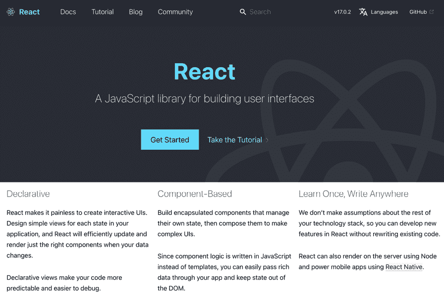
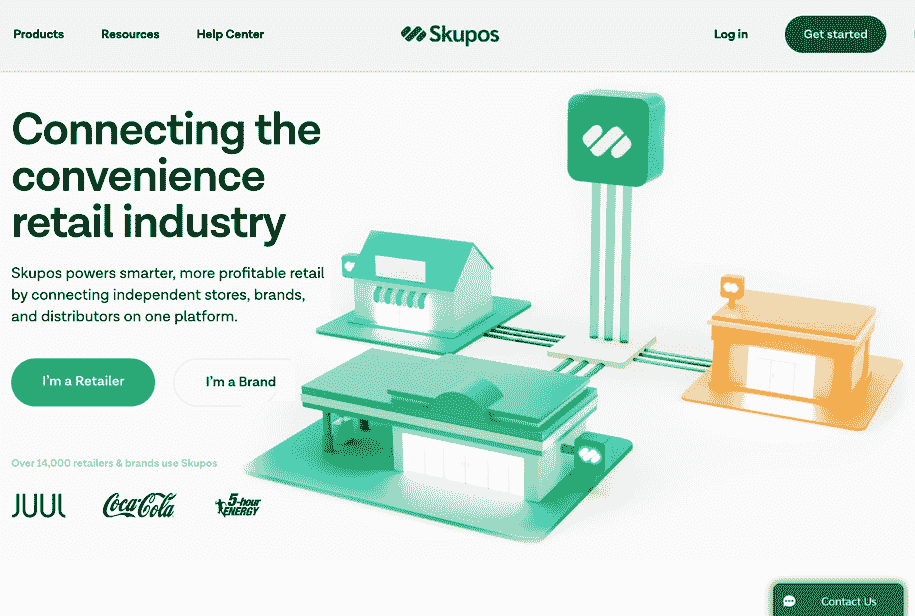
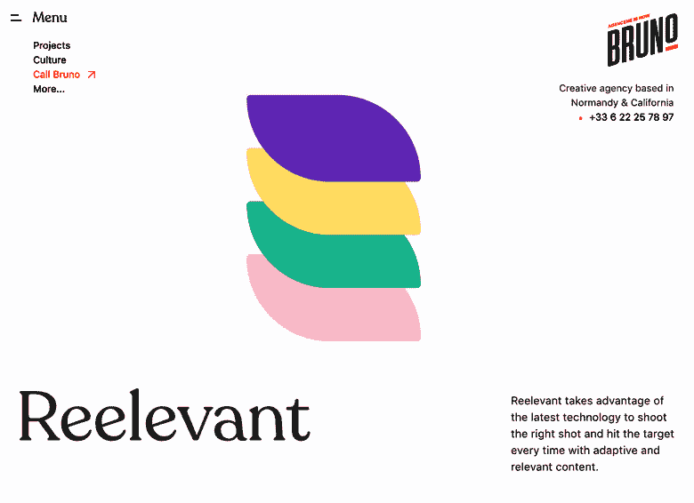
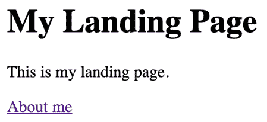

# 第一章：*第一章*：Gatsby.js 入门概述

在这本书中，我们将利用你现有的 React 知识，并补充 Gatsby.js（从现在起我们将称之为 Gatsby）的知识，以创建性能优异且易于访问的静态网站。我希望给你提供使用 Gatsby 创建更好网站的工具，并让你加入静态网站革命。所以，*祝你好运*！

本章将从静态网页的简要历史和 Gatsby 的创建原因开始。然后，我们将思考 Gatsby 是什么以及它是如何建立在 React 之上的。接下来，我们将探讨 Gatsby 的一些用例，并确定 Gatsby 的竞争对手。最后，我们将设置一个基本的 Gatsby 项目，创建了我们的一些页面。

在本章中，我们将涵盖以下主题：

+   静态网页的简要历史

+   Gatsby 是什么？

+   Gatsby 用例

+   Gatsby 的竞争对手

+   设置项目

# 技术要求

本章中的代码可以在[`github.com/PacktPublishing/Elevating-React-Web-Development-with-Gatsby-4/tree/main/Chapter01`](https://github.com/PacktPublishing/Elevating-React-Web-Development-with-Gatsby-4/tree/main/Chapter01)找到。

# 静态网页的简要历史

静态网站几乎与互联网本身一样历史悠久。它们是任何网站的原始蓝图——**超文本标记语言**（**HTML**）、**层叠样式表**（**CSS**）和**JavaScript**（**JS**）。在 20 世纪 90 年代，HTML 是互联网上唯一的发布机制。要将内容发布到互联网上，你必须创建一个静态 HTML 文件，并通过服务器将其暴露给互联网。如果你想修改你的网页之一，你需要直接更改其相应的 HTML 文件。

虽然如今学习 HTML 是基础教育的一部分，但在 20 世纪 90 年代，理解和编写这种语言是一项新颖的技能。创建或编辑内容成本高昂，因为每次修改都需要具备这种技能的人。幸运的是，**内容管理系统**（**CMS**）（WordPress、Drupal 等）很快出现，允许非技术用户控制网页的设计和内容。它还使用户能够通过用户界面存储和管理文件。CMS 今天仍然被广泛使用，并且越来越受欢迎。在过去十年中，使用 CMS 的网站数量从 23.6%增长到 63%。今天，超过 7500 万个网站使用 WordPress——这占到了整个网络的 30%！

前端框架和库几乎以相同的速度获得了知名度。构建单页应用变得司空见惯。如今，在 JS 世界中最为流行的 UI 库是 Facebook 的 React.js，这是一个功能有限的库，但包含了一些重大理念——虚拟 DOM、**JavaScript 语法扩展**（**JSX**）和组件化。无法否认 React 对 Web 开发产生了多大的影响。在 2020 年，80%的 JS 开发者使用过它，70%的 JS 开发者表示他们还会再次使用它。

前端框架已经彻底改变了开发者对待 Web 开发的方式，使他们能够专注于功能而非内容，并极大地加快了他们的工作流程。但你的速度取决于最慢的团队成员。当开发者开始使用这些框架并将它们与 CMS 集成时，CMS 平台的笨拙性质暴露无遗。传统的 CMS 工作流程使用了前端框架从等式中移除的数据库和环境。结合 CMS 的安全性和瓶颈问题，导致了静态网站的复兴。

Gatsby 的创始人 Kyle Mathews 是这一趋势的催化剂。他注意到对网站可访问性和性能的期望急剧增加。他观察到应用程序投入数百万美元用于用户体验。不可否认，2005 年和 2015 年网站之间的差异是显著的。在像网络这样的竞争环境中，你必须有一个能够脱颖而出的产品。Mathews 退后一步，识别了现有工具中的差距，并思考理想的产品可能是什么。这项研究引导他创建了 Gatsby。

我们几乎回到了起点，重新回到了静态内容，这在速度和性能方面是无与伦比的。

# 什么是 Gatsby？

Gatsby 是一个免费的开源静态站点生成器，它利用 React。静态站点生成器是创建静态页面并从源中补充内容的软件应用程序。静态站点生成器是传统数据库驱动的 CMS（如 WordPress）的替代品。在这些传统系统中，内容在数据库中管理和存储。当服务器接收到特定的 URL 请求时，服务器从数据库检索数据，将其与模板文件混合，并生成一个 HTML 页面作为响应。按需生成 HTML 可能是一个耗时的过程，可能会让用户无所事事，或者更糟糕的是，离开你的网站。对于加载时间少于 3 秒的网站，跳出率（在特定网站上查看过一页后离开的访问者的百分比）低于 10%，但对于加载时间为 4 秒的网站，跳出率跃升至 24%，对于加载时间为 5 秒的网站，跳出率高达 38%。

另一方面，像 Gatsby 这样的静态网站生成器在构建过程中生成页面。在这个过程中，Gatsby 将数据引入其 GraphQL 层，在那里可以在页面和模板中进行查询。请求的数据随后以 JSON 格式存储，并由构建的页面访问，这些页面由 HTML、JS 和 CSS 文件组成。用户可以将这些生成的页面部署到服务器。当它收到请求时，服务器会以预定的、静态的、渲染的 HTML 响应。由于这些静态页面是在构建时生成的，因此它们消除了数据库会引入的延迟。你甚至可以完全放弃使用网络服务器，并通过指向存储介质（如 AWS **简单存储服务**（**S3**）存储桶的 CDN 来提供你的网站。这种差异是显著的；使用 Gatsby 构建的网站体验非常快，因为没有什么比发送静态内容更快了。

重要提示

一个静态网站可以包含动态和令人兴奋的体验！一个常见的误解是“静态”意味着网站是静止的。这离事实相差甚远。单词“静态”仅指客户端检索文件的方式。

虽然 Gatsby 以静态网站生成而闻名，但最新版本也包括了服务器端和延迟静态生成，为当静态生成不足时提供了渲染功能。

除了创建一个飞快的用户体验外，Gatsby 还注重开发者体验。随着我们学习和构建，我相信你们会开始认识到使用它的简便性。它实现这一点的步骤可以分解为四个步骤。

## 社区

Gatsby 拥有一个极其支持性的社区。在撰写本文时，已有超过 3,600 人为 Gatsby 仓库做出了贡献。这还通过围绕 Gatsby 的插件生态系统得到了进一步的放大；社区已经创建了 2,000 多个插件，这些插件抽象了其他开发者可能在他们的项目中希望使用的复杂功能。这些插件作为存储在 JS 仓库（如 **NPM**）上的包进行分发，可以在几行代码内添加到你的项目中。它们可以通过获取内容、转换数据、创建页面或为主题化应用程序来扩展你的网站。

## 从任何地方获取内容

每天我们需要组合的数据量以创建体验正在增加。在传统的 React 应用程序中，管理多个数据源可能会变得是一场噩梦。存储、处理、合并和查询数据都需要复杂的解决方案，而这些解决方案难以扩展。

Gatsby 以不同的方式做到这一点。无论你是从内容管理系统（CMS）、实时数据库，还是甚至自定义**应用程序编程接口**（**API**）中获取数据，你都可以将这些数据合并到一个统一的数据层中。Gatsby 社区不断贡献源插件，让你能够轻松地从你喜欢的来源获取数据。十有八九，你不需要写一行代码来获取你的数据，但在你需要的时候，我们将在*第十章*，*创建 Gatsby 插件*中介绍插件创建。

一旦数据被整合到这个数据层中，我们就可以在一个统一的数据层中探索和查询我们所有的数据源。利用 GraphQL 的力量，无论数据的来源如何，我们都可以以相同的方式查询数据来渲染页面。GraphQL 层是临时的，在应用程序构建完成后就不存在了，因此不会影响你生产网站的尺寸。如果你对 GraphQL 还不太熟悉，不要担心——我将在*第三章*，*数据来源与查询（来自任何地方！）*中解释它是如何工作的。

## 构建你已知的工具

通常当我们接触新技术时，我们会面临一个陡峭的学习曲线，因为我们需要理解新的语法和思维方式。在 Gatsby 中，我们基于你现有的 React 知识来构建，而不是从头开始。支撑我们所有代码的是许多你已经熟悉的相同的 React 组件模型。你应该从一开始就感到相当自信，因为代码看起来应该是熟悉的，如果你不熟悉，Gatsby 也可以帮助你通过更“内容驱动”的方法来学习 React。

## 提升网页性能

作为网页开发者，我们可以花费相当多的时间调整网站，以榨取它们的性能。有时，这可能会花费与构建设计一样多的时间，甚至更长。此外，性能的提升有时可能会因为超出你控制之外的网站设计变化而瞬间消失。正因为如此，一些大型组织有专门的团队来提高网站性能。但不必非得这样！当我们开始一起构建时，你会发现加载时间从秒级变为毫秒级，你的网站将比传统的 React 应用感觉更加响应。Gatsby 有很多提高性能的技巧，其中一些我们将在本章末尾涉及。它还可以用几行代码将你的网站转变为**渐进式 Web 应用**（**PWA**）——如果这还不够酷，我不知道还有什么更酷的！

重要提示

Gatsby 与 React 之间一个基本的区别是，Gatsby 是一个“框架”，而不是一个“库”。当使用库时，您控制应用程序的流程；您在需要时调用它。然而，当使用框架时，控制权发生了反转。框架要求您遵循它们定义的特定流程和布局。在框架内工作通常被视为一种优势，因为熟悉该框架的任何开发者都知道在哪里找到相关的文件和代码。

我希望您已经开始看到一些 Gatsby 之所以如此强大的原因。现在让我们看看它的实际应用。

# Gatsby 用例

您可能开始意识到 Gatsby 可以应用于许多不同类型的网站。自 2017 年 Gatsby v1 版本发布以来，这个框架已经被大小公司以多种不同的方式使用。在这里，我想强调一些 Gatsby 表现优异的用例，并建议为什么公司可能选择 Gatsby 来构建这些网站。

小贴士

虽然在这里阅读这些示例网站很好，但我强烈建议您通过自己的设备访问它们。Gatsby 的最好特性之一是它创建的网站速度，亲自体验这一点对于理解其优势至关重要。

## 文档网站

文档网站是 Gatsby 的完美用例，因为它们的内容主要是静态的，如果不是全部的话。它们的内容也不经常变动，页面需要不频繁的更新。它们的静态性质意味着我们可以在构建过程中生成所有页面路由并将它们加载到 CDN 上，这意味着当请求页面时，请求几乎是瞬时的。这就是为什么您会看到像官方 React 文档([`reactjs.org`](https://reactjs.org))这样的网站是用 Gatsby 制作的：



图 1.1 – React 文档网站

由于文档页面的更新频率较低，您可以在文档更新时自动构建和部署您的网站。通过 GitHub 集成或 webhooks，您可以让您的文档网站在每次对主分支或每日进行更改时重新部署。我们将在*第九章*，“部署和托管”中探讨如何创建这类流程。

## 在线课程

在线课程通常具有独特的结构——它们的大部分内容都在静态学习模块中，但它们也需要少量经过身份验证的路由，以提供登录用户的体验。

网站如 *DesignCode.io* ([`designcode.io/courses`](https://designcode.io/courses)) 使用 Gatsby 来处理他们的静态内容，这意味着他们的静态页面性能极优，并且它们在客户端渲染认证路由。虽然这确实会增加包的大小，因为它们需要发送更多的 JavaScript，但快速静态页面的好处远远超过了更重的认证页面的成本：


图 1.2 – DesignCode.io 网站

Gatsby 最受欢迎的数据来源之一是 MDX。MDX 是一种强大的格式，允许你在 Markdown 中编写 JSX。为什么它很棒？因为你可以毫无困难地将 React 组件与文档一起包含。React 组件可以比文本更加互动和动态，因此，它是一种创建在线课程的强大格式，因为你可以创建对用户更具吸引力的内容。也许一个更具互动性的课程更容易让人记住？我们将在 *第三章*，*从任何地方获取和查询数据* 中详细探讨 MDX。

## SaaS 产品

当在线销售 **软件即服务** (**SaaS**) 时，你网站的性能可以被视为你产品性能的反映。因此，拥有一个笨拙的网站可能是你的产品成功与否的关键。正如之前提到的，这是一个你可以深入挖掘以改善网站性能的例子。例如，*Skupos* ([`www.skupos.com/`](https://www.skupos.com/)) 使用 Gatsby 免费获得更多性能优势。Gatsby 对 **搜索引擎优化** (**SEO**) 也大有裨益。由于页面是预渲染的，你的所有页面内容都对网络爬虫（如 Googlebot）可用，以便导航到你的网站。速度和 SEO 的改进有助于他们的产品网站脱颖而出，并使用户对他们在技术方面的能力充满信心：



图 1.3 – Skupos 网站

*Skupos* 还通过元数据和 alt-text 补充了他们的网站页面，这进一步帮助网络爬虫理解网站内容。网络爬虫越了解你的网站内容，你的搜索引擎排名就会越好。

## 设计机构和图片密集型网站

在你的工作更注重视觉的情况下，你的网站通常需要使用大量的高分辨率图像。我们都访问过网站，等待大图像文件加载时感觉像是回到了拨号上网的时代。这种常见的错误往往在加载图像时发生的累积布局变化中被进一步放大。优雅地处理图像的加载状态以避免这种情况可能会很头疼。

Gatsby 在其应用程序中对图像进行了魔法般的处理。它底层使用`sharp`库([`github.com/lovell/sharp`](https://github.com/lovell/sharp))将你的大图像转换为更小的、适合网页的大小。当你的网站加载时，它将首先加载一个较小的分辨率版本，然后模糊到所需的最高分辨率。这导致没有布局偏移，为网站访客提供了远比“跳跃”体验更少的“跳跃”感。一个很好的例子是在使用 Gatsby 开发的*Call Bruno Creative Agency*([`www.callbruno.com/en/reelevant`](https://www.callbruno.com/en/reelevant))网站上：



图 1.4 – Call Bruno Creative Agency 网站

他们在其项目页面中使用了大量的图像，但图像加载并不会让你从体验中脱离出来。我们将在*第五章*，*与图像一起工作*中详细介绍处理图像的方法。

通过探索这些网站，我们可以看到 Gatsby 在各个行业中帮助公司超越竞争对手的例子。

# Gatsby 的竞争对手

虽然这本书主要关注 Gatsby，但理解它不是市场上唯一的 React 静态站点生成器是至关重要的。最常被提及的竞争对手是 Next.js。

直到最近，Next.js 和 Gatsby 之间的关键区别在于服务器端渲染。与 Gatsby 一样，Next.js 应用程序可以以静态方式托管，但它曾经能够服务器端渲染页面，而 Gatsby 则不能。不是部署静态构建，而是部署一个服务器来处理请求。当请求一个页面时，服务器构建该页面并在发送给用户之前将其缓存。这意味着对资源的后续请求比第一次调用更快。截至版本 4，Gatsby 可以预先构建所有页面为静态，或者它可以创建混合构建——静态和服务器端渲染内容的混合。我们将在*第九章*，*部署和托管*中进一步讨论这一点。

Next.js 的一个主要缺点是其数据安全性。当构建 Gatsby 站点为静态构建时，数据仅在构建时从源获取，由于内容是静态的，因此它是安全的。Next.js 将数据存储在服务器上，因此更容易被利用。如果你希望通过服务器或使用数据库来设置 Next.js，通常需要更多的初始化。这也意味着在 Next.js 应用程序中需要更多的维护。Next.js 和 Gatsby 都有额外的实用工具来帮助处理图像。然而，Gatsby 可以使静态渲染页面上的图像性能更优，而 Next.js 则不能。

好消息是，所有静态站点生成器都遵循类似的过程。*在这本书中学到的技能和心态可以轻松转移到未来的不同生成器中，如果你决定要切换的话。*

现在我们已经了解了 Gatsby 的优势所在，让我们开始创建我们的第一个 Gatsby 项目。

# 设置项目

为了帮助您将所学知识付诸实践，我们将一起构建一个项目。在整个本书中，我们将致力于构建一个个人作品集，这是每个开发者都需要的东西，因此我认为它对大多数读者都将是相关的。这个作品集将包含博客页面，以帮助您在公众面前学习，项目页面以展示您的工作，一个展示您网站上有趣指标的统计页面，以及许多其他有助于您的作品集脱颖而出的功能。

在整个本书中，您将面临选择。我们将讨论为您的网站提供不同实现方案，以及您可能想要实施的数据源。这应该会为您提供灵活性，以与您当前的知识相匹配。或者，您可以跳入深水区——选择权在您手中。在每一个选择的地方，如果您无法决定，我还会提供我的个人建议，以供参考。

要查看我们将要构建的作品集的完成版本，请访问此链接：

[`elevating-react-with-gatsby.sld.codes/`](https://elevating-react-with-gatsby.sld.codes/)

小贴士

如果您在某个环节遇到困难，请参考本书附带的代码仓库([`github.com/PacktPublishing/Elevating-React-Web-Development-with-Gatsby-4`](https://github.com/PacktPublishing/Elevating-React-Web-Development-with-Gatsby-4))。它包含了每个章节后项目应有的副本。

要开始使用 Gatsby，我们需要确保在我们的机器上设置了一些先决工具。如果您是 React 开发者，那么这些先决条件很可能已经存在于您的设备上，尽管我仍然鼓励您阅读此列表，因为您的某些工具可能需要更新。

## Node.js 版本 14.15.0+

截至 4.0 版本，Gatsby 支持所有大于 14.15.0 的 Node.js 版本。您可以通过打开终端窗口并输入以下命令来快速检查您是否已安装 Node.js：

```js
 node -v
```

如果您已安装 Node.js，它应该会打印出一个版本号。然而，如果您收到错误，您可以通过访问 Node.js 网站([`nodejs.org`](https://nodejs.org))下载 Node.js。Node.js 附带`npm`，这是一个包仓库、包管理器和命令行工具，我们将使用它来安装 Gatsby。

小贴士

您很可能已经在使用 Node.js，并且您的一些现有项目可能需要与这里指定的要求不同的版本。如果您需要在同一设备上管理多个 Node.js 版本，您应该查看**Node.js 版本管理器**（**NVM**）([`github.com/nvm-sh/nvm`](https://github.com/nvm-sh/nvm))。它为您提供了宝贵的命令，包括安装新版本和在不同版本之间切换。

## Gatsby 命令行界面

Gatsby **命令行界面** (**CLI**) 是由 Gatsby 核心团队构建的工具；它允许你执行标准功能，例如创建新的 Gatsby 项目、设置本地开发服务器以及构建你的生产网站。虽然你可以按项目使用它，但更常见的是全局安装 CLI，这样你就可以在多个 Gatsby 项目中使用其功能，而无需在每个项目中将其作为包安装 – 这样可以节省硬盘空间！

要全局安装 CLI，使用带有全局标志的 `npm install`：

```js
npm i -g gatsby-cli
```

要验证其安装，打开一个终端窗口并输入以下内容：

```js
gatsby --help
```

如果运行此命令提供命令列表且没有出错，那么你就准备好了。

重要提示

在这本书的整个过程中，我使用 `npm` 作为我的包管理器。如果你更喜欢 Yarn，你可以使用 Yarn 的等效命令。

## 目录和包设置

在这里，我们将开始创建我们需要启动项目所需的文件和文件夹，以及安装必要的依赖项，如 React 和 Gatsby。

首先，创建一个文件夹来存放我们的项目。你可以称它为任何你喜欢的名字。在这本书的整个过程中，我将把这个文件夹称为应用程序的 `root` 文件夹。打开终端并导航到你的 `root` 文件夹。通过运行以下命令在这个文件夹中初始化一个新的包：

```js
npm init -y
```

现在包已经初始化，让我们安装 React 和 Gatsby：

```js
npm i gatsby react react-dom
```

在你最喜欢的编辑器中打开你的 `root` 文件夹中的 `package.json`、`package-lock.json` 和 `node-modules` 文件夹。打开你的 `package.json`，你应该会看到以下内容：

```js
{
  "name": "gatsby-site",
  "version": "1.0.0",
  "description": "",
  "main": "index.js",
  "scripts": {
    "test": "echo \"Error: no test specified\" && exit 1"
  },
  "keywords": [],
  "author": "",
  "license": "ISC",
  "dependencies": {
    "gatsby": "⁴.4.0",
 "react": "¹⁷.0.2",
 "react-dom": "¹⁷.0.2"
  }
}
```

在前面的示例中，你可以看到这个文件现在包含了对我们刚刚安装的依赖项的引用。

### 开发脚本

让我们先修改 `package.json`，使其包含一些有用的脚本，这将加快我们的开发过程：

```js
{
  "name": "gatsby-site",
  "version": "1.0.0",
  "description": "",
  "main": "index.js",
 "scripts": {
 "build": "gatsby build",
 "develop": "gatsby develop",
 "start": "npm run develop",
 "serve": "gatsby serve",
 "clean": "gatsby clean"
 },
  "keywords": [],
  "author": "",
  "license": "ISC",
  "dependencies": {
    "gatsby": "⁴.4.0",
    "react": "¹⁷.0.2",
    "react-dom": "¹⁷.0.2"
  }
}
```

让我们分解这些脚本：

+   `build`: 运行 Gatsby CLI 的 `build` 命令。这将创建一个编译好的、生产就绪的网站构建版本。我们将在 *第九章*，*部署和托管* 中了解更多关于这一点。

+   `develop`: 运行 Gatsby CLI 的 `develop` 命令。我们将在下一节 *创建你的第一个页面* 中详细审查它。

+   `start`: `start` 脚本重定向到 `develop` 脚本。这是常见的，因为通常使用 `start` 脚本来启动包。

+   `serve`: 运行 Gatsby CLI 的 `serve` 命令以提供 Gatsby `build` 文件夹。这是一种有用的方式来审查生产构建。

+   `clean`: `clean` 脚本使用 Gatsby CLI 的 `clean` 命令。这将删除本地 Gatsby 缓存和任何构建数据。它将在下一个 `develop` 或 `build` 命令中重建。

所有这些脚本都可以通过以下命令在 `root` 文件夹中运行：

```js
npm run script-name
```

只需将 `script-name` 替换为你想要运行的脚本的名称。

你会注意到缺少一个测试脚本。不用担心——我们将在*第七章*中介绍如何测试 Gatsby 应用程序，*测试和审计您的网站*。

## 框架文件和文件夹

如前所述，Gatsby 是一个框架。框架需要存在某些文件才能工作。让我们使用 Gatsby 期望找到它们的文件和文件夹来设置我们的项目。

在您的`root`目录中创建一个`gatsby-config.js`文件，并添加以下内容：

```js
module.exports = {
  plugins: [],
};
```

如其名称可能暗示的那样，`gatsby-config.js`文件是 Gatsby 的核心配置文件。随着我们构建项目，我们将经常回到这个文件。当我们完成时，它将充满插件、元数据、样式，甚至离线支持。

在您的`root`目录中创建`gatsby-browser.js`和`gatsby-node.js`文件。这两个文件现在都可以留空。`gatsby-browser.js`文件包含我们希望在客户端浏览器上运行的任何代码。在下一章中，我们将使用此文件为我们的网站添加样式。`gatsby-node.js`文件包含我们希望在构建网站过程中运行的代码。

最后，在您的`root`目录中创建一个`src`文件夹。这个文件夹将包含我们大部分的开发工作，就像在传统的 React 应用程序中一样。我们创建的页面和定义的组件都将包含在这个文件夹中。

在我们继续之前，让我们确保我们的版本控制正在跟踪正确的文件。

### 使用版本控制

我怀疑你们中的许多人希望在构建 Gatsby 网站的同时使用版本控制。为了确保 Git 只跟踪重要的文件，创建一个`.gitignore`文件并添加以下内容：

```js
node_modules/
.cache/
public
```

这些行阻止了依赖项、Gatsby 构建和缓存文件夹被跟踪。

## 创建您的第一个几个页面

我们现在已经设置了所有必要的底层代码，以便我们可以开始创建页面。在本节中，我们将使用 Gatsby 创建一个包含三个页面的网站。重要的是要注意，这是一个基本示例，纯粹是为了在我们担心样式和附加功能之前巩固你对 Gatsby 工作原理的理解。

导航到您的`src`目录，并创建一个名为`pages`的新文件夹。我们在`pages`文件夹中创建的任何 JS 文件都将被 Gatsby 视为一个路由。这也适用于`pages`文件夹内的子文件夹。然而，有一个例外——名为`index.js`的文件被视为其目录的根。让我们通过几个示例来理解这一点：

+   `src/pages/index.js`将映射到[你的网站.com](https://yourwebsite.com)。

+   `src/pages/about.js`将映射到[你的网站.com/about](https://yourwebsite.com/about)。

+   `src/pages/blog/my-first-post.js` 将映射到 [yourwebsite.com/docs/my-first-post](https://yourwebsite.com/docs/my-first-post)。虽然我们现在不会在这个 URL 上设置页面，但我们将开始使用此类路由，例如在 *第三章*，*从任何地方获取和查询数据*。

+   `src/pages/404.js` 将映射到 [yourwebsite.com](https://yourwebsite.com) 上的任何页面。

    重要提示

    你放置在 `pages` 文件夹中的任何 React 组件都将成为你网站上的可导航路由。因此，最好将你的组件与你的页面分开。一个常见的模式是在 `src` 目录中创建一个与 `pages` 文件夹相邻的 `components` 文件夹，并导入你想要在页面中使用组件。

### 首页

在你的 `pages` 文件夹中创建一个 `index.js` 文件。作为 `pages` 文件夹的索引，这将成为你网站的首页。现在我们可以用以下代码填充此文件：

```js
import React from "react"
const Index = () => {
    return (
        <div>
            <h1>My Landing Page</h1>
            <p>This is my landing page.</p>
        </div>
    )
}
export default Index
```

此文件的 内容应该看起来很熟悉；它只是一个简单的无状态 ReactJS 组件。

我们也可以将其定义为：

```js
import React from "react"
export default function Index(){
    return (
        <div>
            <h1>My Landing Page</h1>
            <p>This is my landing page.</p>
        </div>
    )
}
```

这两个示例将输出完全相同的结果，所以这只是个人喜好。

### 关于页面

以类似的方式，我们可以创建一个 `about` 页面。在这里，你有选择权——你可以在 `src/pages/about.js` 或 `src/pages/about/index.js` 中创建这个页面。我在决定选择哪个选项时总是问自己，这个页面是否会有子页面。在 `about` 页面的情况下，我认为它不太可能包含任何子页面，所以我将选择 `src/pages/about.js`：

```js
import React from "react"
export default function About(){
    return (
        <div>
            <h1>My About Page</h1>
            <p>This is a sentence about me.</p>
        </div>
    )
}
```

在这里，我们定义了另一个包含标题和段落的简单 React 组件，以创建我们的 `about` 页面。

### 404 页面

Gatsby 期望在 `pages` 目录中找到一个 `404.js` 文件。这个页面是特殊的。它包含当 Gatsby 找不到请求的页面时将显示的页面。我相信你之前一定遇到过“页面未找到”的页面。如果没有这个页面，在请求一个不存在的路由时，浏览器将找不到任何资源并向用户显示浏览器错误。虽然 `404` 页面是显示相同错误的一种另一种形式，但通过创建这个页面，我们可以自己管理错误。我们可以链接到我们网站上的工作页面，甚至建议他们可能试图访问的页面（更多内容请参阅 *第三章*，*从任何地方获取和查询数据*）。

现在让我们在 `src/pages/404.js` 中创建我们的 `404` 页面：

```js
import React from "react"
export default function NotFound(){
    return (
        <div>
            <h1>Oh no!</h1>
            <p>The page you were looking for does not
               exist.</p>
        </div>
    )
}
```

你应该开始看到一种模式。创建页面就像定义 React 组件一样简单——这应该是你已经熟悉的。

#### 尝试运行 develop 命令

到目前为止，你实际上已经创建了一个完全工作的网站。恭喜！为了测试它，在你的 `root` 目录中打开一个终端，并运行以下命令：

```js
npm run start
```

如您从我们的 `package.json` 中回忆的那样，这将运行 `gatsby develop` 命令。这可能需要几秒钟的时间来运行，但您应该会看到一些类似以下内容的终端输出：

```js
You can now view gatsby-site in the browser.
  http://localhost:8000/
```

您现在可以打开您选择的浏览器并导航到 `http://localhost:8000/`，您应该会看到类似以下内容：



图 1.5 – 着陆页预览

这是我们的 `index.js` 页面组件的渲染版本。您可以在浏览器中修改 URL 到 `http://localhost:8000/about` 以查看您的 `about` 页面，以及到 `http://localhost:8000/404` 以查看您的 `404` 页面。您还可以通过导航到任何无效路由并按下**预览自定义 404 页面**按钮在开发中查看您的 `404` 页面。

提示

如果您不想手动导航到浏览器并输入 URL，您可以通过将 `-o` 选项附加到 `gatsby develop` 命令来修改我们的脚本。这会指示 Gatsby 在您运行 `develop` 命令时自动打开默认浏览器并导航到网站。

#### Gatsby 详细开发

运行 `gatsby develop` 启动 Gatsby 开发服务器。这可能有点令人困惑，因为我们之前提到 Gatsby 网站作为静态内容交付，但实际上它是为了加快您的开发过程。

想象一下，如果您的网站包含 10,000 页面；每次对一页进行小改动时，都需要构建整个网站，这将花费很长时间。为了在开发中解决这个问题，Gatsby 使用 Node.js 服务器按需构建您所需的内容。由于它是按需构建的，可能会对页面的性能产生负面影响，*因此您绝对不应该因为这种原因在开发中对页面的性能进行测试*。

一旦服务器启动，您就可以继续编辑您的代码，而无需重新运行命令。开发服务器支持热重载，这是一个您应该熟悉的概念。

`develop` 命令具有许多内置选项，允许您对其进行自定义：

+   `-H, --host`: 允许您修改主机

+   `-p, --port`: 允许您修改 Gatsby 运行的端口

+   `-o, --open`: 在浏览器中打开您的项目

+   `-S, --https`: 启用 HTTPS

您可以使用主机选项在连接到同一网络的任何设备上查看您的网站。这可能在您想比较您的网站在移动浏览器上的行为与桌面体验时很有用。要实现这一点，请运行以下命令：

```js
gatsby develop -H 0.0.0.0
```

如果命令成功执行，您将在输出中看到一些细微的差异：

```js
You can now view gatsby-site in the browser.
  Local:            http://localhost:8000/
  On Your Network:  http://192.168.1.14:8000/
```

`develop` 命令为您的网络测试添加了一个 URL。在连接到同一网络的任何设备的浏览器中输入此 URL，将渲染您的网站。

### 连接您的页面

现在您有多个页面，您可能想要在它们之间进行导航。有两种不同的方法可以实现这一点——使用 Gatsby Link 组件或通过编程式导航。对于一些人来说，这些组件和函数可能听起来很熟悉；这是因为 Gatsby 对 `reach-router` ([`reach.tech/router`](https://reach.tech/router)) 库进行了封装。对于那些之前没有使用过 `reach-router` 的人来说，该库内置了服务器端渲染和路由无障碍功能的支持。Gatsby 在此基础上进行了增强，以满足其对用户无障碍的高标准，确保无论您是谁，都能获得良好的网站体验。

#### Gatsby Link 组件

在您链接到内部页面时，使用 Gatsby 的 `<Link/>` 组件替换 `<a/>` 标签是很重要的。`<Link/>` 组件的工作方式与 `<a/>` 标签类似，但有一个重要的区别——它支持预取。预取是指在需要之前加载资源的行为。这意味着当请求资源时，等待该资源的时间会减少。通过预取您页面上的链接，您的下一次点击将导航到已经加载的内容，因此实际上几乎是瞬间的。这在网络条件较差的移动设备上尤为明显，通常在加载页面时会有延迟。

您可以在 `404` 页面添加 `Link` 组件的第一个地方。这些页面通常有一个按钮，上面写着“带我回家”之类的文字，当点击时，会导航到主页：

```js
import React from "react"
import {Link} from "gatsby"
export default function NotFound(){
    return (
        <div>
            <h1>Oh no!</h1>
            <p>The page you were looking for does not
               exist.</p>
            <Link to="/">Take me home</Link>
        </div>
    )
}
```

如您在前面的代码块中所见，`Link` 组件有一个名为 `to` 的属性；这需要传递到您想要导航到的相对于您网站根目录的页面。通过传递 `"/"` 属性，Gatsby 将导航到您网站的根目录。

您还可以从 `index` 页面添加到 `about` 页面的链接：

```js
import React from "react"
import {Link} from "gatsby"
export default function Index() => {
    return (
        <div>
            <h1>My Landing Page</h1>
            <p>This is my landing page.</p>
            <Link to="/about">About Me</Link>
        </div>
    )
}
```

您可以看到，我们在这里将 `"/about"` 传递给 `<Link/>` 组件中的 `to` 属性；这将导航到我们之前创建的 `about` 页面。

#### 编程式导航

有时，您可能需要用除了点击之外的方式触发导航。也许您需要根据 `fetch` 请求或当用户提交表单时进行导航。您可以通过使用 Gatsby 的 `navigate` 函数来实现这种行为：

```js
import React from "react"
import {navigate} from "gatsby"
export default function SomePage() => {
 const triggerNavigation = () => {
 navigate('/about')
 }
    return (
        <div>
            <p>Triggering page navigation via onClick.</p>
            <button onClick={()=> triggerNavigation()}>
                About Me
            </button>
        </div>
    )
}
```

与 `<Link/>` 组件一样，`navigate` 函数也仅适用于导航到内部页面。

我们现在已经设置了一个基本的 Gatsby 网站，具有在页面之间导航的能力。

# 摘要

我很欣赏本章的大部分内容都是理论性的，但理解“为什么”同样重要，就像理解“如何”一样。在本章中，我们巩固了盖茨比是什么以及我们在后续章节中构建网站时将使用的指导原则的基础知识。我们看到了盖茨比被使用的例子以及它能带来的好处。我们讨论了你需要的依赖项以及如何初始化盖茨比项目。我们还设置了一个完整的盖茨比基本项目，并创建了我们的网站的前几页。然后，我们使用了内置的盖茨比组件和函数来链接我们的页面。

我们将在整本书中引用本章概述的理论，但就目前而言，让我们将注意力转向美化我们的 Web 应用程序。在下一章中，我们将确定不同的样式化方法，并为你选择一个适合你项目的明智选择。
