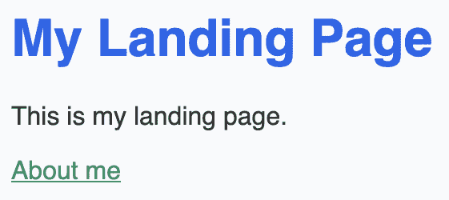

# *第二章*: 样式选择和创建可复用布局

Gatsby 站点可以通过多种方式进行样式化。在本章中，我们将向您介绍大量样式化技术，以帮助您做出明智的选择，决定您希望如何样式化您的站点。一旦您确定了样式化方法，我们将在*第一章*，*Gatsby.js 入门概述*中实现的页面上实施它，然后再创建将在所有我们的站点页面上使用的**可复用组件**。

在本章中，我们将涵盖以下主题：

+   Gatsby 中的样式化

+   使用 CSS 进行样式化

+   使用 Sass 进行样式化

+   使用 Tailwind.css 进行样式化

+   使用 Styled 组件进行样式化

+   创建一个可复用布局

# 技术要求

为了导航本章，您需要完成 Gatsby 的设置并创建了*第一章*，*Gatsby.js 入门概述*中的页面。

在本章中，我们将开始将我们的第一个可复用组件添加到我们的页面中。由于这些组件不是独立的页面，我们需要一个新的地方来存储它们。在您的`src`文件夹内创建一个名为`components`的子文件夹，我们可以使用它。

本章中出现的代码可以在[`github.com/PacktPublishing/Elevating-React-Web-Development-with-Gatsby-4/tree/main/Chapter02`](https://github.com/PacktPublishing/Elevating-React-Web-Development-with-Gatsby-4/tree/main/Chapter02)找到。

# Gatsby 中的样式化

本章全部关于样式化您的 Gatsby 站点，但样式化指的是什么？虽然我们的 React 代码定义了我们的网络文档的结构，但我们将使用样式化通过页面布局、颜色和字体来定义文档的外观和感觉。您可以使用大量工具来样式化任何 Gatsby 项目。在这本书中，我将向您介绍四种不同的方法——**纯 CSS**、**Sass**、**Tailwind.css**和**CSS in JS**。在决定使用哪种方法之前，让我们更详细地探讨每一种。

## 纯 CSS

当您的浏览器导航到站点时，它会加载站点的 HTML。它将此 HTML 转换为**文档对象模型**（**DOM**）。在此之后，浏览器将开始获取 HTML 中引用的资源。这包括图片、视频，更重要的是，现在的 CSS。浏览器读取 CSS，并按元素、类和标识符对选择器进行排序。然后它遍历 DOM，并使用选择器将样式附加到所需的元素上，创建一个渲染树。然后，利用这个渲染树，将可视页面显示在屏幕上。CSS 已经经受住了时间的考验，因为我们已经以这种方式将 CSS 与 HTML 一起使用了 25 年。但使用纯 CSS 有一些优点和缺点。

使用纯 CSS 的优点如下：

+   **其年龄**：由于 CSS 在撰写本书时已经存在了 25 年，因此有关 CSS 的内容非常丰富。由于其年龄，有人已经解决了您遇到的任何问题的可能性也非常高。这两个原因都使纯 CSS 成为初学者的一个很好的选择。

+   **可理解的语法**：构成 CSS 的语法非常少使用缩写。对于初学者来说，阅读 CSS 的每一行所做的工作，比本章中其他样式实现要容易得多。

使用纯 CSS 的缺点如下：

+   **长样式表**：在传统的网站上，您经常看到它们只包含一个 CSS 文件。这使得维护和组织样式变得非常困难，因为文件可能会变得非常长。这可能导致一种模式，即懒惰的开发者找不到他们想要的样式，可能会直接将它们附加到文件的底部（也称为**只读样式表**）。如果他们这样做，而文件已经存在，那么他们只是在增加文件大小而没有其他作用。

+   **类重用混淆**：重用样式有时可能会带来比其价值更大的麻烦。假设您已经在应用程序的各个元素中使用了某个特定的类。您可能更新这个类以使其适应一个实例，结果却破坏了所有其他实例。如果您陷入这种循环多次，这可能会真正减慢您的开发速度。通过一点前瞻性思维可以避免这种情况——与其重用类，不如创建可重用的组件。另一个选择是创建不太可能改变的“实用类”；如果您不想自己创建这些类，您应该阅读关于 Tailwind CSS 的部分。

+   **继承的痛点**：通过使用继承，我们最终将 CSS 紧密耦合到 HTML 的结构中。如果您破坏了这个结构，CSS 可能就不再起作用了。虽然继承有时是不可避免的，但我们应尽量将其保持在最低限度。

CSS 经受了时间的考验，至今仍是一个可靠的选择。您可能会问，为什么我列出了绕过/避免所有这些方法的方式，这些缺点仍然是缺点。这些缺点都可以通过本章中其他实现方式中的任何一种来修复。

## Sass

Sass 是一种预处理器脚本语言，它编译成 CSS。它为开发者提供了工具，使他们能够创建更高效的 CSS。

使用 Sass 的优点如下：

+   **大型工具集**：Sass 包含了一组强大的工具，您在纯 CSS 中无法使用。虽然我们不会详细讨论这些工具，但它们包括混入、循环、函数和导入等工具，可以用来为您的应用程序创建更强大和高效的 CSS。这对于 Sass 来说是一个巨大的优点。

+   `.scss` 文件用于分解文件。然后您可以根据需要将它们相互导入。这极大地帮助提高了您代码的组织性。

+   **自由度**：Sass 强制执行一种编写方式——你可以选择。这意味着你可以选择一种适合你团队的风格。

使用 Sass 的缺点如下：

+   **跳过基础**：对于刚开始学习样式的开发者来说，自由度也可能是一个缺点。如果你之前没有使用过 Sass，你可能会创建出工作但过于复杂的代码。这可能会导致未来的开发者难以理解代码。具体的 CSS 指南可以帮助避免这种误用。

+   **命名规范**：为每个你设计的元素创建类名是一个繁琐的过程。有方法可以帮助你创建有意义的类名；然而，这仍然需要很长时间。

+   **两个事实来源**：当你编写 HTML 时，你可能会也为你元素添加类名以进行样式化。然后你跳转到 Sass 文件来添加这些类名，但可能会忘记它们的名称。在 HTML 和 Sass 之间跳转可能会是一个烦人的上下文切换。你可能会认为将样式从你的标记中抽象出来是一个好主意，但当标记和样式如此紧密相连时，这可能会是一个不便。

尽管 Sass 是一个强大的工具，但增加的力量也意味着增加的复杂性。虽然对于初学者来说学习曲线可能更高，但掌握它将给你带来极大的自由度。

## Tailwind（以实用类为首要的 CSS 框架）

Tailwind CSS 是一个以实用类为首要的 CSS 框架。这种“以实用类为首要”的方法是为了对抗我们之前讨论的 CSS 和 Sass 的缺点。在这个方法中，我们使用小的实用类来构建组件的样式，而不是定义我们自己的类名。这可能会感觉有点像编写内联样式，因为你的元素将添加一串实用类，但好处是如果你不想写，你不需要写一行自己的 CSS。

使用 Tailwind 的优点如下：

+   **单一事实来源**：当使用 CSS 或 Sass 时，你必须在这两个文件之间切换：你的标记和你的样式表。Tailwind 消除了这个概念，并允许你直接在你的标记中嵌入样式。

+   **命名规范**：Tailwind 消除了你需要创建自己类名的需求。它有一套非常细粒度的类名，称为“实用类”。你使用这些类来构建元素的样式，而无需担心为每个组件创建唯一的类名。

+   **更小的 CSS**：Tailwind 为你提供了一套完整的实用类，你很少需要用你自己的样式来补充。因此，你的 CSS 不再增加；事实上，它变得更小了。当你准备好生产构建你的应用程序时，你可以使用 Tailwind 内置的清除功能来删除未使用的类。

+   **无副作用**：因为我们是在我们的标记中添加样式而不是操作底层类名，所以在我们的应用程序的其他地方永远不会出现任何意外的副作用。

使用 Tailwind 的缺点如下：

+   **标记可读性**：由于你的标记包含从实用工具构建的样式，元素的类名可能会变得非常长。当你考虑到这些类名可能需要在悬停或断点时改变，你的行长度可能会变得非常长。

+   **学习曲线**：实用工具优先需要你学习许多类名来了解你必须使用哪些工具来构建样式。这种学习可能需要一些时间，并在开始时减慢你的速度，但我相信一旦你掌握了这些，你的开发速度将会大大提高。

Tailwind 在抽象和灵活性之间达到了很好的平衡。这是列表中最新的实现，也是我个人最喜欢的。

## CSS in JS

CSS in JS 允许你在组件内编写纯 CSS，同时避免了与类名发生命名的冲突。为了探索这个选项，我将审查最受欢迎的解决方案——样式组件（[`styled-components.com`](https://styled-components.com)）。然而，值得一提的是，有许多不同的 CSS in JS 解决方案，包括 Emotion ([`emotion.sh`](https://emotion.sh)) 和 JSS ([`cssinjs.org`](https://cssinjs.org))。

使用样式组件的优点如下：

+   **单一的真实来源**：与 Tailwind 一样，样式组件也消除了上下文切换，因为你的 CSS 代码存储在与使用它的组件相同的文件中。

+   **样式与组件绑定**：样式是为使用特定组件而创建的，并且位于实现它们的标记旁边。因此，你知道哪些样式被使用，更重要的是，你知道编辑这些样式只会影响与它们一起定位的标记。

+   **JS 在 CSS 中**：我们可以在 CSS 中使用 JS 来确定样式。这使得在样式内处理条件变得更容易，因为我们不需要创建两个不同的类名并使用三元运算符。

+   **扩展**：通常情况下，你可能想使用一个组件样式，但为了不同的用例微妙地修改它。而不是再次复制样式并从头开始创建一个新的组件，我们可以创建一个继承另一个组件样式的组件。

使用样式组件的缺点如下：

+   `index.html`。在所有页面中使用的样式会在每个页面上被拉入，而且没有简单的方法来轻松地将它们分开。即使缓存样式也很困难，因为类名是动态生成的，因此可能在构建之间发生变化。

如果你喜欢单一的真实来源，当将所有内容合并到一个文件中时，样式组件可以提高你的标记的可读性。虽然性能被列为缺点，但这是样式组件背后的社区正在努力改进的事情。

## 选择样式工具

当涉及到样式化你的 Gatsby 网站，没有正确或错误的方式。这完全取决于你现有的技能集，你希望你的样式和 JS 多么紧密耦合，以及你个人的偏好。我想以查看一些常见场景及其对应的样式实现方式来结束本节：

+   *我的样式经验有限*：如果你是样式应用的初学者，我建议使用纯 CSS。你通过这种实现方式学到的基本知识是其他所有实现方式的基础。通过学习基础知识，你将能够在未来更容易地选择另一种实现方式。

+   *我不想花太多时间在样式上*：如果你在寻找最少设置的选项，那么 Tailwind 就是你的不二选择。使用实用类可以节省你大量时间，因为你不需要创建自己的类。

+   *我不喜欢切换上下文*：在这种情况下，我会倾向于使用 Styled Components 或 Tailwind，因为在两种实现中，你的样式都位于你的标记旁边——一个文件和一个单一的事实来源。

+   *我已经使用过 CSS，并想在此基础上构建*：使用 Sass 将是一个很好的选择，因为你可以编写你熟悉和喜爱的 CSS，同时也可以通过 Sass 工具集来增强它。

到目前为止，你应该已经准备好做出明智的选择，决定哪种样式工具适合你。我强烈建议你*只实现本章中概述的样式选择之一*，而不是尝试混合搭配。如果你添加了多个样式实现，你的网站样式可能会显得不一致。这是因为一个实现可以覆盖另一个。通过坚持一种方法，你将获得额外的优势，即保持网站风格的一致性，这对于强化品牌非常重要。

既然你已经做出了决定，让我们开始查看实现方式。

# 使用 CSS 进行样式化

在本节中，我们将学习如何将 CSS 样式应用到我们的 Gatsby 项目中。

向我们的 Gatsby 网站添加全局 CSS 样式有两种不同的方法——创建包装组件或使用 `gatsby-browser.js`。

## 创建包装组件

包装组件背后的想法是将我们的页面组件包裹在另一个组件中，这个组件将常见的样式带到页面上：

1.  在你的 `components` 文件夹中创建 `StyleWrapper.css`：

    ```js
    html {
      background-color: #f9fafb;
      font-family: -apple-system, "Segoe UI", Roboto,
        Helvetica, Arial, sans-serif,
        "Apple Color Emoji", "Segoe UI Emoji", "Segoe UI
        Symbol";
    }
    ```

    在前面的代码中，我们正在定义一个背景颜色和字体家族，所有 HTML 标签的子元素都可以继承。

1.  现在我们来添加一些 `h1` 样式到这个文件中：

    ```js
    h1 {
      color: #2563eb;
      size: 6rem;
      font-weight: 800;
    }
    ```

    在这里，我们正在添加最大 `heading` 标签的颜色、大小和权重。

1.  同样，我们也可以为 `p` 和 `a` 标签添加一些样式：

    ```js
    p {
      color: #333333;
    }
    a {
      color: #059669;
      text-decoration: underline;
    }
    ```

    在这里，我们为每个标签添加颜色，在 `a` 标签的情况下，添加下划线以使其更加突出。

1.  在你的 `components` 文件夹中创建 `StyleWrapper.js`：

    ```js
    import React from "react"
    import "./StyleWrapper.css"
    const StyleWrapper = ({children}) => (
        <React.Fragment>{children}</ React.Fragment>
    )
    export default StyleWrapper
    ```

    如其名称所示，我们将使用此组件来包裹我们的页面，以应用我们在第二行导入的样式。

1.  为了使用`StyleWrapper.js`，我们需要将其导入到我们的页面中；让我们以`pages/index.js`为例：

    ```js
    import React from "react"
    import {Link} from "gatsby"
    div wrapping with our new layout component. The contained h1, p, and Link elements will be passed into the StyleWrapper component as children. 
    ```

## 使用`gatsby-browser.js`

如果你希望相同的样式应用于每个页面，你可能会觉得在所有页面实例上导入`StyleWrapper`并不符合**不要重复自己**（DRY）原则。在确定样式确实需要在每个页面上使用的情况下，我们可以使用 Gatsby 浏览器将它们添加到我们的应用程序中：

1.  在你的`src`目录中创建一个`styles`文件夹。由于这些样式是全局使用的，并且与特定组件无关，因此将它们存储在`component`目录中是没有意义的，正如我们在实现`StyleWrapper.js`时所做的。 

1.  在你的`styles`文件夹中创建一个`global.css`文件，并添加以下内容：

    ```js
    html {
      background-color: #f9fafb;
      font-family: -apple-system, "Segoe UI", Roboto,
        Helvetica, Arial, sans-serif,
        "Apple Color Emoji", "Segoe UI Emoji", "Segoe UI
        Symbol";
    }
    h1 {
      color: #2563eb;
      size: 6rem;
      font-weight: 800;
    }
    p {
      color: #333333;
    }
    a {
      color: #059669;
      text-decoration: underline;
    }
    ```

    在这里，我们添加了与替代 CSS 实现中完全相同的样式，因此我不会在这里再次解释它们。关键区别在于接下来的步骤。

1.  导航到`gatsby-browser.js`并添加以下内容：

    ```js
    import "./src/styles/global.css"
    ```

    通过在`gatsby-browser.js`中导入我们的 CSS，Gatsby 将为每个页面包裹这个 CSS。

## 验证我们的实现

无论你选择了哪种方法，如果一切按计划进行，你应该会看到一个样式化的网站，看起来像这样：



图 2.1 – 带样式的索引页开发

你应该能够在这个页面上找到你的 CSS 添加内容。

你现在已经在你的 Gatsby 网站上实现了 CSS 作为样式工具。你可以忽略后续的其他样式实现，并继续到*创建可重用布局*部分。

# 使用 Sass 进行样式化

在本节中，我们将学习如何在我们的 Gatsby 项目中实现 Sass 样式：

1.  要开始使用 Sass，我们需要安装它以及一些其他依赖项。在你的项目根目录中打开一个终端，并运行以下命令：

    ```js
    npm install sass gatsby-plugin-sass
    ```

    在这里，我们正在安装核心 Sass 依赖项以及与之集成的 Gatsby 插件。

1.  使用以下内容修改你的`gatsby-config.js`文件：

    ```js
    module.exports = {
      plugins: [
        'gatsby-plugin-sass'
      ],
    };
    ```

    在这里，我们正在更新我们的 Gatsby 配置，让 Gatsby 知道要使用`gatsby-plugin-sass`插件。现在，在你的`src`目录中创建一个`styles`文件夹。

1.  在你的`styles`文件夹中创建一个`global.scss`文件，并添加以下内容：

    ```js
    html {
      background-color: #f9fafb;
      font-family: -apple-system, "Segoe UI", Roboto,
        Helvetica, Arial, sans-serif,
        "Apple Color Emoji", "Segoe UI Emoji", "Segoe UI
        Symbol";
    }
    ```

    我很少在`global.scss`文件中添加超过 HTML 样式。相反，我更喜欢将其他`.scss`文件导入到这个文件中。这有助于保持样式有序，并使文件保持小而可读。例如，让我们创建`typography.scss`来存储一些排版样式：

    ```js
    h1 {
      color: #2563eb;
      size: 6rem;
      font-weight: 800;
    }
    p {
      color: #333333;
    }
    a {
      color: #059669;
      text-decoration: underline;
    }
    ```

1.  在这里，我们为每个元素添加了颜色，对于`a`标签，我们还添加了下划线以使其更加突出。现在我们可以将此文件导入到我们的`global.scss`文件中：

    ```js
    @import './typography;
    html {
      background-color: #f9fafb;
      font-family: -apple-system, "Segoe UI", Roboto,
       Helvetica, Arial, sans-serif,
       "Apple Color Emoji", "Segoe UI Emoji", "Segoe UI
        Symbol";
    ```

1.  导航到你的`gatsby-browser.js`文件并添加以下内容：

    ```js
    import "./src/styles/global.scss";
    ```

    这告诉我们的 Gatsby 应用程序在客户端包含这个样式表，使我们能够在应用程序中使用它。

你现在已经在你的 Gatsby 网站上实现了 Sass 作为样式工具。你可以忽略后续的其他样式实现，并继续到*创建可重用布局*部分。

# 使用 Tailwind.css 进行样式设计

在本节中，我们将学习如何在我们的 Gatsby 项目中实现 Tailwind 样式：

1.  要开始使用 Tailwind，我们需要安装它以及一些其他依赖项。在你的项目根目录下打开一个终端并运行以下命令：

    ```js
    npm install postcss gatsby-plugin-postcss tailwindcss
    ```

    在这里，我们正在安装 PostCSS、其关联的 Gatsby 插件以及`tailwindcss`。PostCSS 是一个使用 JS 插件转换样式的工具。这些插件可以检查 CSS 的语法、支持变量和混入、转译未来的 CSS 语法、内联图片等等。在 Tailwind 的情况下，有一个特定的 Tailwind 插件用于 PostCSS，我们将要实现它。

1.  使用以下内容修改你的`gatsby-config.js`：

    ```js
    module.exports = {
      plugins: [
        'gatsby-plugin-postcss'
      ],
    };
    ```

    在这里，我们正在更新我们的 Gatsby 配置，让它知道要使用 Gatsby PostCSS 插件。

1.  为了使用 PostCSS，它需要在项目根目录下存在`postcss.config.js`文件。现在就创建这个文件并添加以下内容：

    ```js
    module.exports = () => ({
      plugins: [require("tailwindcss")],
    });
    ```

    在这个文件中，我们告诉 PostCSS 使用我们新安装的`tailwindcss`包。

1.  与 PostCSS 类似，Tailwind 也需要一个配置文件。Tailwind 有一个内置的脚本用于创建默认配置。打开一个终端并运行以下命令：

    ```js
    npx tailwindcss init
    ```

    如果这个命令成功执行，你应该会注意到在项目根目录下创建了一个新的`tailwind.config.js`文件。这个文件内的默认配置将正常工作，所以目前我们不需要编辑它。

1.  在你的`src`目录内创建一个`styles`文件夹。

1.  在你的`styles`文件夹内创建一个`global.css`文件并添加以下内容：

    ```js
    @tailwind base;
    @tailwind components;
    @tailwind utilities;
    ```

1.  将以下内容添加到`gatsby-browser.js`文件中：

    ```js
    import "./src/styles/global.css";
    ```

    这告诉我们的 Gatsby 应用程序在客户端包含这个样式表，使我们能够使用 Tailwind 类。

完成这些步骤后，我们现在已经为在应用程序中使用 Tailwind 做好了准备。为了使用 Tailwind 的实用类，我们可以在组件中使用 React 的`className`属性；例如，在`pages/index.js`中，我们可以添加以下内容：

```js
import React from "react"
import {Link} from "gatsby"
export default function Index(){
    return (
        <div>
            <h1 className="text-3xl font-bold text-blue-
 600">My Landing Page</h1>
            <p>This is my landing page.</p>
            <Link to="/about">About me</Link>
        </div>
    )
}
```

在前面的代码中，我们使用以下实用类修改了标题的样式：

+   `text-3xl`：将文本设置为第三大额外大号，相当于 1.875 rem。

+   `font-bold`：将文本设置为粗体字体重量。

+   `text-blue-600`：将文本颜色设置为蓝色。

你可以另外将样式追加到我们创建的`global.css`文件中，以便它们被包含：

```js
@tailwind base;
@tailwind components;
@tailwind utilities;
h1 {
 @apply text-3xl font-bold text-blue-600;
}
```

这里，你会看到完全相同的样式，只是定义在全局。两者都将等同于`h1`标签上的相同样式；决定使用哪种变体完全取决于频率。如果你打算多次使用这个`h1`样式，你应该将其合并到你的 CSS 中，以避免重复编写相同的样式。

让我们再补充一些样式：

```js
@tailwind base;
@tailwind components;
@tailwind utilities;
h1 {
    @apply text-3xl font-bold text-blue-600;
}
p {
 @apply text-gray-800;
}
a {
 @apply text-green-600 underline;
}
```

在这里，我们为每个元素添加一个颜色，对于`a`标签，添加下划线以使其更加突出。

你现在已经在你的 Gatsby 网站上实现了 Tailwind 作为样式工具。你可以忽略接下来的其他样式实现，并继续到*创建一个可重用的布局*部分。

# 使用 styled-components 进行样式化

在本节中，我们将学习如何在我们的 Gatsby 项目中实现 Styled Components 作为样式工具：

1.  在你的项目根目录打开终端并运行以下命令来安装你的依赖项：

    ```js
    npm install gatsby-plugin-styled-components styled-
    components babel-plugin-styled-components
    ```

    这些是依赖项的详细信息：

    1.  `styled-components`：Styled Components 库

    1.  `gatsby-plugin-styled-components`：Styled Components 的官方 Gatsby 插件

    1.  `babel-plugin-styled-components`：在构建之间提供一致的哈希类名

1.  使用以下内容更新你的`gatsby-config.js`：

    ```js
    module.exports = {
      plugins: ['gatsby-plugin-styled-components'],
    }
    ```

    这指示 Gatsby 使用我们刚刚安装的 Styled Components 插件。

    我们可以拥有所有必要的组件来在页面/组件级别和全局级别创建样式。

1.  为了演示如何使用它们，导航到你的`pages/index.js`文件并添加以下内容：

    ```js
    import React from "react"
    import {Link} from "gatsby"
    div tag. We can see that it also has styles for any h1 or p tag that are children. 
    ```

1.  有时，你可能想要全局创建样式；为了演示这一点，请导航到你的`gatsby-browser.js`文件并添加以下内容：

    ```js
    import React from "react"
    import { createGlobalStyle } from "styled-components"
    const GlobalStyle = createGlobalStyle'
      body {
        background-color: ${props => (props.theme === 
        "blue" ? "blue" : "white")};
      }
    '
    export const wrapPageElement = ({ element }) => (
        <>
          <GlobalStyle theme="blue"/>
          {element}
        </>
      )
    ```

    我们使用`styled-components`的`createGlobalStyle`辅助函数来创建全局样式。这阻止了 Styled Components 被限制在本地 CSS 类中。

    通过使用`wrapPageElement`方法，我们告诉 Gatsby 将每个页面包裹在组件中。我们可以利用这一点来将每个页面包裹在我们的全局样式中。

无论你的实现选择如何，你现在都应该有了开始构建一个完全样式化的网站的基本知识。现在让我们开始创建一个可重用的布局，我们将在整个网站上使用它。

# 创建一个可重用的布局

大多数网站都有头部和页脚，这些在所有页面上都存在。根据我们对页面工作原理的了解，你可能会想将头部组件导入到每个页面组件中。但是等等——当你突然需要向该组件传递一个新属性时会发生什么？这类情况正是为什么减少页面之间的任何重复是一个好主意的原因。相反，创建一个包含头部和页脚的布局组件，然后我们可以将其包裹在我们的页面中，这会是一个更好的选择。

为了使我们的`components`文件夹结构良好，创建子文件夹来存放网站的各个部分是有用的。在`components`文件夹中创建一个`layout`文件夹来存放与布局相关的组件。我们将使用这些布局组件跨越所有页面文件。现在，让我们用标题、页脚和布局组件来填充这个文件夹。

重要提示

在本节中的代码示例中，您会注意到我正在使用`Tailwind.css`来为我的组件添加样式。在配套的 GitHub 仓库([`github.com/PacktPublishing/Elevating-React-Web-Development-with-Gatsby-4/tree/main`](https://github.com/PacktPublishing/Elevating-React-Web-Development-with-Gatsby-4/tree/main))中，您可以找到使用本章中涵盖的所有样式实现这些组件的实现。在未来的章节中，我将坚持使用 Tailwind。

## 网站页眉

页眉组件作为我们网站的锚点。在所有页面上包含您的网站页眉是很常见的，这样访客就会记得他们是在您的网站上。

要开始，让我们在我们的`components`文件夹中创建一个`Header.js`组件：

```js
import React from "react"
const Header = () => (
    <header>
        <p>Site Header</p>
    </header>
)
export default Header
```

在前面的代码中，我们创建了最基本的标题示例。请注意，我们正在使用 HTML 的`header`标签。正如我们将在*第六章*中学习到的，*提高网站搜索引擎优化*，在创建内容时使用正确的标签非常重要，因为它有助于网络爬虫和辅助工具理解您的网站。

## 网站页脚

在您的网站上添加页脚可以是一个强大的工具。我喜欢将其视为在用户完成页面后保持用户参与度的一种方式。我们可以用它提供快速链接到我们的社交媒体，以便他们能够联系到我们，我们可以建议他们可能喜欢的其他有趣内容，我们甚至可以告诉他们当前页面有多少次浏览。

让我们从基本实现开始。在`components`文件夹中创建一个`Footer.js`组件：

```js
import React from "react"
const Footer = () => (
    <footer>
        <p>Site Footer</p>
    </footer>
)
export default Footer
```

就像我们的`Header`一样，使用正确的 HTML `footer`标签是很重要的。

## 布局组件

我们可以直接将我们的页眉和页脚导入到我们创建的每个页面中，但如果我们这样做，会导致大量的重复。一种常见的解决方法是创建一个`Layout`组件。我们将每个构建的页面都包裹在这个组件中。这不仅是一个引入我们的页眉和页脚的简单方法，而且还可以让我们以最小的努力为每个页面的主要内容进行样式设计：

```js
import React from "react"
import Footer from "./Footer"
import Header from "./Header"
const Layout = ({children}) => (
    <div>
        <Header/>
        <main>
            {children}
        </main>
        <Footer/>
    </div>
)
export default Layout
```

在这里，您可以看到我正在导入我们新创建的`Header`和`Footer`组件。我正在使用`children`属性并在`main`块内渲染子内容。

为了演示使用`Layout`组件，让我们将我们的索引页面包裹在这个组件中。修改页面中的`index.js`，如下所示：

```js
import React from "react"
import {Link} from "gatsby"
import Layout from "../components/layout/Layout"
export default function Index(){
    return (
        <Layout>
            <h1>My Landing Page</h1>
            <p>This is my landing page.</p>
            <Link to="/about">About me</Link>
        </Layout>
    )
}
```

你可以看到我已经将着陆页包裹在我们的新`Layout`组件中，该组件已在第三行导入。如果你此时启动`gatsby develop`，你应该会看到你的页面内容，在其前面有一个页眉，在其后面有一个页脚。你现在可以继续将其他页面包裹在你的`layout`组件中。在继续之前，让我们暂时退后一步，看看我们如何组织为我们的页面创建的组件。

小贴士

之前讨论的一些样式实现使用了样式包装器。如果你的实现使用了样式包装器，请将其导入到你的`layout`组件中，并用此组件包裹内容。这样，你只需在一个组件中包裹你的页面，而不是`layout`和`style wrapper`组件。

## 使用原子设计进行组织

随着你的网站扩展，尝试保持你的`components`文件夹的结构是很重要的。一种常用的方法是使用**原子设计**原则。原子设计是通过将网站元素分解为原子、分子、生物体、模板和页面来创建有效的界面设计系统的过程：

+   **原子**：这些是我们网站可能包含的最小组件，例如按钮、排版组件或文本输入。在保持其功能的同时，原子不能逻辑上分解成子组件。

+   **分子**：由两个或更多原子组成，分子是协同工作以提供某些功能的小组元素。一个由文本输入和按钮组成的搜索框可以被视为一个分子。

+   **生物体**：由一组分子和原子组成，这些形成界面的大块区域，例如网站的英雄部分。

+   **模板**：这些将生物体包裹在布局中，并提供页面内容和骨骼结构。

+   **页面**：一个具有实际内容的模板实例。

在构建组件时使用原子设计允许你将组件分解成更小的自包含单元。这些单元可以在导入到应用程序之前单独测试和开发，这既允许更严格的开发过程，也减少了在执行前端开发时对后端逻辑的依赖。

一旦我们定义了我们的原子设计模式，我们在处理样式时就可以更加灵活。更改原子的样式也将更新任何分子和生物体所使用的样式。

根据你的样式实现方式，抽象常用标记，如品牌颜色、间距规则和字体族，也是一个好主意。与在应用程序的各个地方粘贴十六进制值来修改品牌颜色相比，维护一个单一的真实来源的项目要容易得多。

使用原子设计来组织你的`components`文件夹，当规模扩大时，这真的很有帮助，所以请记住在未来的章节中，随着你的应用程序的扩展。

# 摘要

在本章中，你学习了如何以多种方式样式化 Gatsby 网站。这应该有助于你做出明智的选择，决定你将如何继续样式化你的应用程序。我们看到了如何使用 CSS、Sass、Tailwind.css 和 Styled Components 来样式化你的 Gatsby 网站。你应该已经决定使用其中之一并实施它。在未来的章节中，我将使用 Tailwind.css 来样式化应用程序，但这只是个人偏好。你应该使用你认为最适合你的网站和现有知识的方法。

我们还开始创建将构成我们网站骨架的第一个可重用组件。虽然我们的 `layout` 组件现在可能看起来很原始，但我们将在下一章将其与内容集成，并添加图像以进一步在 *第五章*，*与图像一起工作* 中使其生动起来。

在继续到下一章之前，我鼓励你花时间基于这里概述的样式进行构建，直到你的现有页面看起来是你想要的样子。虽然我认为定义你自己的样式是最好的，但你可以在代码仓库中的 Tailwind.css 中找到一个完全样式化的网站示例。

在下一章中，我们将开始从本地文件、CMS 和 API 中获取内容。我们将使用这些数据在 Gatsby 网站上程序化地创建页面。
