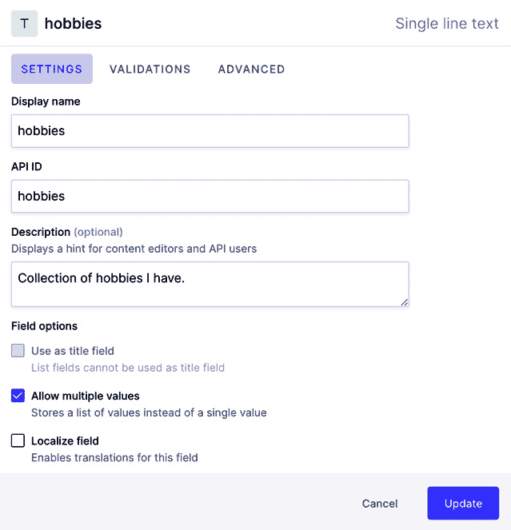
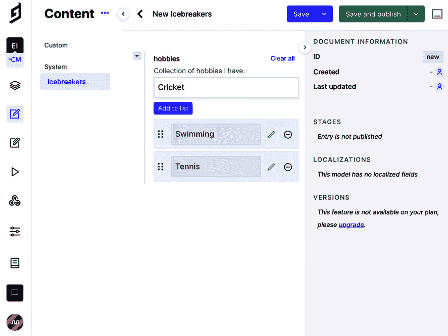
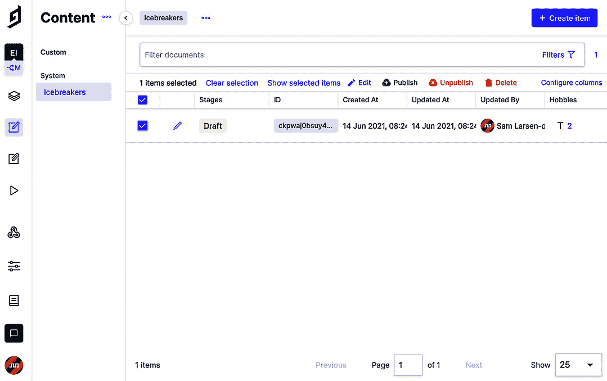
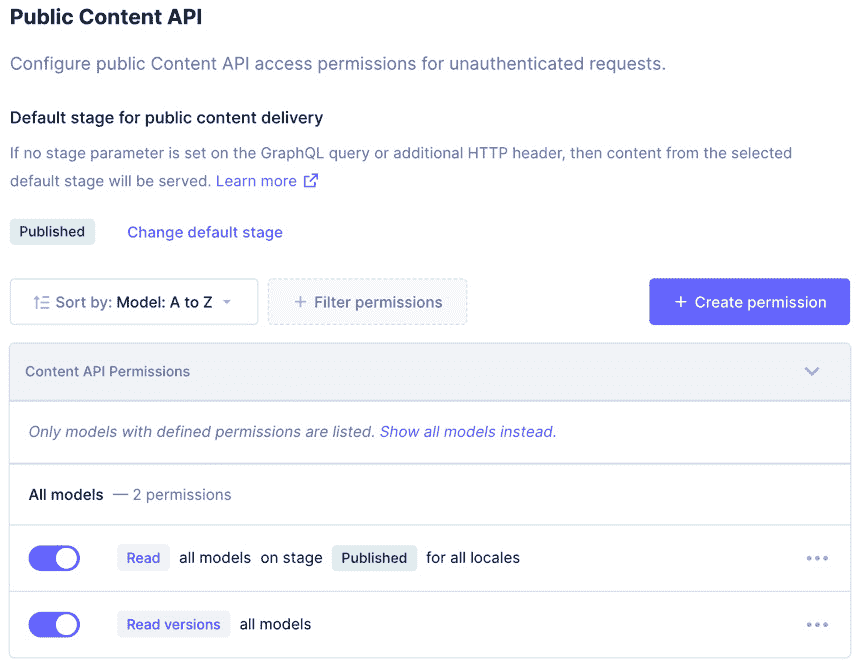
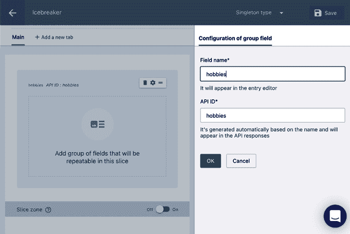

# *第三章*：获取和查询数据（来自任何地方！）

在本章中，你将了解 Gatsby 的数据层。你将从理解 Gatsby 上下文中的数据含义开始，然后学习**GraphQL**的基础知识。一旦你有了这个理解，你将学习如何从本地文件中获取和查询数据。然后我们将探讨从几个无头 CMS 中获取数据。

在本章中，我们将涵盖以下主题：

+   Gatsby 中的数据

+   介绍 GraphQL

+   从本地文件获取和查询数据

+   从无头 CMS 获取和查询数据

# 技术要求

要完成本章，你需要完成 *第二章*，*样式选择和创建可重用布局*。

本章的代码可以在[`github.com/PacktPublishing/Elevating-React-Web-Development-with-Gatsby-4/tree/main/Chapter03`](https://github.com/PacktPublishing/Elevating-React-Web-Development-with-Gatsby-4/tree/main/Chapter03)找到。

# Gatsby 中的数据

在深入之前，我认为明确我们在这本书中提到的“数据”的含义很重要。当我们提到数据时，我们指的是任何静态内容的媒介，而不是 React 代码。到目前为止，我们一直在 React 组件中直接添加文本。对于开发者来说，这可能是一种完全可接受的方式来构建小型网站，但随着规模的扩大，将内容混合到标记中会使开发变得更加困难。这也使得没有 React 经验的同事无法更新或添加网站的新内容。

将数据存储在页面和组件之外，并在需要时将其拉入，这是一种更常见的做法。我们可以以两种方式存储此类数据：

+   **本地**：存储在与我们的源代码相同的仓库中的文件，例如 JSON、CSV、Markdown 或 MDX 文件。

+   **远程**：存储在另一个位置的文件，我们将其作为构建过程的一部分摄取，例如来自无头 CMS、数据库或 API 的内容。

    重要提示

    你可能已经注意到，在谈论数据时没有引用图像，可能会想知道如何处理它们。由于它们的复杂性，本书中专门有一章介绍图像 – *第五章*，*处理图像*。

现在我们已经了解了 Gatsby 中的数据含义，让我们学习如何在我们的应用程序中查询它，以便我们可以在网站页面上使用它。

# 介绍 GraphQL

**GraphQL** 是一个查询数据的规范——关于如何高效查询数据的通用指南。这个规范是在 2012 年由 Facebook 的工程师在开发他们的移动应用程序的**REST**服务时开发的。他们希望在他们的移动平台上使用现有的 REST 服务，但这将需要在他们的 API 的各个区域进行大量的修改和特定的逻辑。工程师们还注意到，他们的 API 请求的响应中有许多数据点他们并没有使用。这意味着那些网络带宽较低的人正在加载他们甚至没有使用的数据。

因此，Facebook 的团队开始着手开发 GraphQL 来解决这些问题，并重新思考他们为设备获取数据的方式。GraphQL 将重点从后端工程师指定由什么请求返回什么数据，转移到了前端开发者指定他们需要什么。

## Gatsby 的 GraphQL

当你想要从 Gatsby 内部获取数据时，Gatsby 总是使用 GraphQL。这是一个很棒的功能，因为我们有一个高效的方式来获取数据，无论它的类型如何。如果你已经设置了一个 GraphQL 服务器，Gatsby 可以直接调用 GraphQL API。然而，我们在网上需要使用的大量数据并不是已经以 GraphQL 格式存在的。

幸运的是，Gatsby 的插件架构允许你将非 GraphQL 数据引入 Gatsby，然后在你拥有这些数据后使用 GraphQL 来查询它。无论你的数据是本地还是远程，或者它是什么格式，你都可以使用 Gatsby 的一个插件来拉取数据。然后，你可以使用 GraphQL 规范在我们的页面上查询这些数据。

这是一个非常适合我们所有内容的优秀架构，无论它来自哪里。当它进入 Gatsby 时，我们总是以相同的方式查询和检索数据。

让我们看看一个 GraphQL 查询包含的高级示例：

```js
query SampleQuery {
  content {
    edges {
      node {
        property
      }
    }
  }
}
```

在这里，你可以看到我们使用了`query`这个词，后面跟着查询的名称，在我们的例子中是`SampleQuery`。然后，在大括号内，我们指定了我们想要获取的内容类型——在这里你看到`content`，这会改变成你想要的内容来源。`edges`指的是内容源中具有作为数组返回的关系的连接项集合。然后，当我们深入一层，我们有`node`，它指的是单个项。在这里，你可以看到我们正在查询一个单个属性。

GraphQL 的其中一个优点是你可以非常具体地说明你需要的数据，并且只获取那些具体的内容。正如前一个示例所示，我们只查询了节点的单个属性，但如果它包含了一百个属性呢？通过只提取我们需要的，我们可以创建一个非常具体的查询，只获取我们需要的。

现在，让我们看看一个针对 Gatsby 的特定 GraphQL 查询：

```js
query MySitePages {
  allSitePage {
    edges {
      node {
        path
      }
    }
  }
}
```

在这里，我们可以看到我们正在将查询命名为 `MySitePages`。我们正在检索的内容来自 `allSitePage` 源，这是一个默认集合，包含在 Gatsby 项目中创建的所有页面。`edges` 指的是所有页面，而 `node` 指的是我们想要的特定页面。在每一页中，我们正在查询该页面的 `path` 参数。

当在 Gatsby 中运行此查询时，它将返回 JSON。如果您在我们的网站上运行前面的查询并记录结果，您将看到以下对象：

```js
{
  "data": {
    "allSitePage": {
      "edges": [
        {
          "node": {
            "path": "/404/"
          }
        },
        {
          "node": {
            "path": "/about/"
          }
        },
        {
          "node": {
            "path": "/"
          }
        }
      ]
    }
  }
}
```

如您所见，我们得到的是一个具有数据属性的对象。在其中，您可以看到我们的命名查询及其边缘。边缘包含每个节点及其相应的路径属性。在结果中，我们可以看到网站上存在的每个页面 – 我们有 `404` 页面、`about` 页面和 `home` 页面。

现在，让我们了解如何在 GraphQL 中过滤和排序数据。

### GraphQL 中的过滤

有时，返回的数据中的所有节点都不太有用。我们可能偶尔想根据特定字段过滤掉节点。让我们看看一个例子，其中我们正在从 `allSitePage` 源中过滤节点：

```js
query AllSitePagesExcept404 {
  allSitePage(filter: {path: {ne: "/404/"}}, limit: 1) {
    edges {
      node {
        path
      }
    }
  }
}
```

在这个例子中，我们得到一个路径不等于 (`ne` 为简称) `/404/` 的单个页面。随着我们开始为页面开发更复杂的查询，我们将更详细地研究过滤。现在，重要的是要认识到这是可能的。

在 Gatsby 中，可以单独获取一个节点，但更常见的是查询一个集合。例如，如果我们想检索一个单独的 `SitePage` 节点，我们可以使用以下查询：

```js
query ASingleSitePage {
  sitePage {
    path
  }
}
```

此查询将接收与请求匹配的第一个节点，并将其作为对象返回，而不是更大的数组。

现在我们已经了解了如何构建 GraphQL 查询，让我们看看我们如何使用 GraphiQL 来探索我们的数据。

## 使用 GraphiQL

当谈到学习 GraphQL 时，幸运的是 Gatsby 随附了一个名为 GraphiQL 的工具 ([`github.com/graphql/graphiql`](https://github.com/graphql/graphiql))。这是一个连接到 Gatsby 中所有 GraphQL 选项的 Web 接口，为我们提供了一个测试和在我们将查询嵌入到代码之前进行查询的好界面。

如我们所知，在开发我们的网站时，Gatsby 会打开 `http://localhost:8000` 来预览我们在构建网站时的网站。如果您导航到 `http://localhost:8000/___graphql`，您将打开一个连接到您的开发 Gatsby 网站的 GraphiQL 接口。当您打开这个页面时，您应该会看到一个类似下面的界面：

![图 3.1 – GraphiQL 用户界面]

![img/B15983_03_01.jpg]

图 3.1 – GraphiQL 用户界面

在最左侧，你会看到**探索器**，它显示了在 Gatsby 中使用 GraphQL 可以获取的所有可能的内容片段。你可以在**探索器**区域内检查属性，让 GraphiQL 自动为你构建查询。在中央左侧列中，我们可以看到我们需要使用的查询来检索我们想要的数据。当你点击查询上方的**播放**按钮时，你将在中央右侧列中看到该查询的结果，其中包含一个包含数据属性和我们的查询结果的 JSON 对象。在最右侧，你会看到**文档探索器**区域，你可以使用它作为探索你的数据并识别你拥有的不同类型数据的替代方式。

现在，让我们学习我们可以在应用程序内使用查询来检索数据的位置。

## 使用构建的 GraphQL 查询

在你的 Gatsby 项目中，你可以使用 GraphQL 查询的三个主要位置：

+   `Gatsby-node.js`：这个文件是我们可以基于动态数据程序化创建页面的地方之一。如果我们有一份 Markdown 格式的博客文章列表，并且想要为每篇文章创建一个页面，我们就会在这里使用查询来检索我们需要动态创建页面的文章数据。

+   **在页面内**：我们可以向单个实例页面添加查询，以便在该页面内提供数据。这就是我们将测试本章中获取的数据的方式。我们还可以在**页面模板**内进行查询，这是我们尚未讨论的内容，但它是我们将在*第四章*“创建可重用模板”中详细探讨的关键概念。页面模板可以基于 URL 中的 slug 运行查询，然后根据该 URL 确定要显示的页面。在单个实例页面和模板中，查询是在构建时运行的，因此创建的页面仍然是静态的。

+   **在任何其他组件内**：我们还可以在我们的任何 React 组件内检索 GraphQL 数据。在页面模板之外检索数据的方法不同，因为在外部页面模板之外，你不能使用变量获取动态内容。因此，这种方式的查询是静态的。我们将在*第五章*“与图像一起工作”中看到静态查询的示例。

现在你已经了解了 Gatsby 中 GraphQL 的基础知识，让我们开始将不同类型的数据导入到我们的 GraphQL 层中。

# 从本地文件中获取数据

在本节中，我们将学习如何从本地文件中获取和查询数据。正如我们之前提到的，当我们说本地文件时，我们指的是位于我们仓库代码旁边的文件。

## 网站元数据

在 `gatsby-config.js` 文件中存储小块可重用数据是一个很好的地方。Gatsby 将 `siteMetadata` 属性暴露给数据层，这样你就可以在整个应用程序中检索它。在我们的网站上下文中，我建议在这里存储你的网站地址、你的名字、你的角色和简短的传记。如果实施得一致，当任何这些信息发生变化时，你只需在 `siteMetadata` 中更改一次字段，就可以在整个网站上看到更改。

提示

`gatsby-config.js` 是一个文件，随着你扩展 Gatsby 项目，你经常会发现它变得相当大。为了尽量保持有序，尽量为你的 `siteMetadata` 保留少量小字符串。如果你考虑在这里添加大块文本，可能更好的做法是将它作为一个 Markdown 文件添加。

让我们在主页上创建一些网站元数据并将其导入：

1.  首先，使用以下代码更新 `gatsby-config.js`：

    ```js
    module.exports = {
      siteMetadata key sits next to the plugins we have defined. Here, you can see we have defined the key values I suggested earlier. Keep in mind that these key values are just a suggestion and that if you want to add or remove keys, feel free to do so.
    ```

1.  使用 GraphiQL 界面构建 GraphQL 查询以检索数据。它应该看起来像这样：

    ```js
    query BasicInfo {
      site {
        siteMetadata {
          name
          role
        }
      }
    }
    ```

    你的网站元数据在 `site` 源中可用。在前面的查询中，我们只检索了 `name` 和 `role`。

1.  在你的主页上嵌入构建的查询：

    ```js
    import React from "react";
    import { Link, graphql from Gatsby. We are then appending our query from *Step 2* to the end of the file, below our page component. The export name isn't important as Gatsby looks for any GraphQL string within your pages, but here, you can see I am calling it query. When Gatsby builds this page, this query is pulled out of our source code, parsed, and run, and the resultant data is passed into our page component via the data prop you can see on line 5\. We can then use the data contained within the query (in our case, `name` and `role` from `siteMetadata`) to populate our site hero.Important NoteYou can only export one query per component. If you ever need more data on the page, instead of exporting another query, extend your existing query.
    ```

现在，让我们了解如何从 Gatsby 默认不包含的数据源中获取数据——从 Markdown 开始。

## Markdown

Markdown 语法是在 Gatsby 网站上编写内容的一种流行方式。如果你之前使用过 GitHub 或 Bitbucket，那么你很可能已经遇到过这种格式，因为它们都在 `README` 文件中使用它。Markdown 是在你的网站上编写较长的写作内容的一个很好的格式——文档、博客文章，甚至是一个长的传记。

要开始在 Gatsby 中使用 Markdown，你只需要创建文本文件——不需要额外的基础设施来实现它。Gatsby 还提供了一个 **核心插件**（由 Gatsby 团队拥有和维护），用于将 Markdown 转换为可以由我们的组件使用的内联内容。使用核心插件，不需要编写代码即可实现 Markdown 并进行设置。

让我们在 Markdown 中创建一个简短的传记并将其添加到我们的关于页面：

1.  在你的项目根目录下创建一个名为 `MD` 的文件夹来存储我们的 Markdown。

    将这个文件夹放在你的 `src` 目录之外是一个好习惯，因为它不包含任何源代码，而是文本内容。这使得没有 React 经验的开发者修改网站内容变得更加容易。

1.  在 `/MD` 目录下创建一个名为 `bio` 的文件夹来存储你的传记。随着我们添加更多提供不同类型内容的 Markdown 文件，将它们分开存储是有帮助的。

1.  在我们新创建的 `bio` 文件夹内创建一个 `bio.md` 文件，并添加以下代码：

    ```js
    ---
    type: bio
    ---
    ```

    这是文件的第一部分，包含 `type`。这个 `type` 将帮助我们通过 GraphQL 查询查询到这个特定的文件。

1.  使用 Markdown 语法创建你的传记正文：

    ```js
    ---
    type: bio
    ---
    # A short biography about me
    This is a very short biography about ***me***. But it could be as long as I want it to be. 
    ```

    你可以使用任何有效的 Markdown 语法在这里；我通过只包括一个标题和一段段落来使这个例子简短，但请随意添加你想要的任何内容。

1.  安装 `gatsby-source-filesystem`：

    ```js
    npm install gatsby-source-filesystem
    ```

    如其名所示，这个插件允许 Gatsby 读取本地文件。

1.  安装 `gatsby-transformer-remark`：

    ```js
    npm install gatsby-transformer-remark
    ```

    我们可以使用这个插件来识别 Markdown 文件并读取它们的内容。这个插件将读取语法并将其转换为我们可以嵌入到组件中的 HTML。

1.  接下来，让我们在 `gatsby-config.js` 中配置我们的新依赖项：

    ```js
    module.exports = {
      siteMetadata: {
        siteUrl: 'https://your.website',
        name: 'Your Name',
        role: 'Developer at Company',
        bio: 'My short bio that I will use to introduce
              myself.',
      },
      plugins: [
        gatsby-source-filesystem to tell Gatsby to read files from the Markdown folder we created previously.We also added `gatsby-transformer-remark` so that Gatsby can read Markdown files into its GraphQL layer.
    ```

1.  启动你的开发服务器并导航到你的 GraphiQL 接口。构建并运行查询以检索 `bio` 信息：

    ```js
    query Biography {
      markdownRemark(frontmatter: {type: {eq: "bio"}}) {
        html
      }
    }
    ```

    在这里，我们构建了一个查询，其中我们从 `markdownRemark` 中检索 HTML。我们过滤 Markdown，其中 frontmatter 类型等于 `bio`，由于只有一个这样的文件，我们将始终检索正确的文件。通过在 GraphiQL 接口中运行此查询，你应该会看到类似以下的内容：

    ```js
    {
      "data": {
        "markdownRemark": {
          "html": "<h1>A short biography about
            me</h1>\n<p>This is a very short biography
            about <em><strong>me</strong></em>. But it
            could be as long as I want it to be.</p>"
        }
      },
      "extensions": {}
    }
    ```

    在这里，你可以看到我们编写的 Markdown 已经被转换成了 HTML，我们现在可以在我们的页面中使用它。

1.  在你的 `about` 页面中嵌入这个查询：

    ```js
    import React from "react";
    import { graphql } from "gatsby";
    import Layout from "../components/layout/Layout";
    export default function About({ data prop. I'd like to draw your attention to the div with the dangerouslySetInnerHTML prop. dangerouslySetInnerHTML is React's replacement for using innerHTML in the browser's DOM. It's considered *dangerous* because if the content can be edited by a user, this can expose users to a **cross-site scripting attack**. A cross-site scripting attack injects malicious code into a vulnerable web application. In our case, however, the content is always static and always defined by us, so we have nothing to worry about.
    ```

如果你想要写长篇的文章，Markdown 可以是一个很好的选择，但如果你想要让你的文章更加互动呢？也许你想要在文章中间加入一个投票或者在一个段落之间让用户注册你的电子邮件？有许多这样的场景在 Markdown 中无法优雅地实现。对于这些功能，MDX 就是答案。

## MDX

MDX 是一种格式，它允许你使用 JSX 来增强你的 Markdown。你可以在 Markdown 中导入组件并将它们嵌入到你的内容中。

让我们在关于页面中使用 MDX 创建一个包含你的工作历史的增强型个人简介：

1.  在你的项目根目录下创建一个名为 `MDX` 的文件夹来存储我们的 Markdown（就像 Markdown 一样，出于相同的原因），良好的做法是将这个文件夹放在 `src` 之外，即使它可以包含 React 组件。

1.  在 `/MDX` 目录下创建一个名为 `bio` 的文件夹来存储你的个人资料（就像我们处理 Markdown 一样）。

1.  在你的 `/MDX` 文件夹中创建一个名为 `components` 的文件夹来存储专门用于我们的 MDX 文件中的 React 组件。

1.  在 `components` 文件夹中创建一个 `EmploymentHistory` 组件，以便我们可以在我们的 MDX 文件中嵌入：

    ```js
    import React from "react";
    const employment = [
      {
        company: "Company One",
        role: "UX Engineer",
      },
      {
        company: "Company Two",
        role: "Gatsby Developer",
      },
    ];
    const EmploymentHistory = () => (
      <div className="text-left max-w-xl mx-auto">
        <div className="grid grid-cols-2 gap-2 mt-5">
          {employment.map(({ role, company }) => (
            <>
              <div className="flex justify-end font-
                bold"><p>{role}</p></div>
              <p>{company}</p>
            </>
          ))}
        </div>
      </div>
    );
    export default EmploymentHistory;
    ```

    我在这里以工作历史为例，但这也可以是任何有效的 React 组件。在这个例子中，我们定义了一个包含对象的就业经验小数组，每个对象都有一个公司和角色。在 `EmploymentHistory` 中，我们遍历这些角色并将它们布局成网格。然后我们像平常一样导出这个组件。

1.  在 `/MDX/bio` 目录下创建 `bio.mdx` 文件：

    ```js
    ---
    type: bio
    ---
    type as bio. Just below that, you will see we have introduced an import statement pointing to our newly created component. We can then use the imported component wherever we like within the body of our content, much like I have on the last line in the preceding example.
    ```

1.  安装必要的 `mdx` 依赖项：

    ```js
    npm install gatsby-plugin-mdx @mdx-js/mdx @mdx-
    js/react
    ```

1.  配置 `gatsby-config.js` 以包含 `gatsby-plugin-mdx` 插件：

    ```js
    module.exports = {
      siteMetadata: {
        siteUrl: 'https://your.website',
        name: 'Your Name',
        role: 'Developer at Company',
        bio: 'My short bio that I will use to introduce
              myself.',
      },
      plugins: [
        {
          resolve: 'gatsby-source-filesystem',
          options: {
            name: 'mdx-bio',
            gatsby-source-filesystem to tell Gatsby to read files from the MDX folder we created previously. We have also added gatsby-plugin-mdx so that Gatsby can read MDX files into its GraphQL layer.
    ```

1.  启动你的开发服务器并导航到你的 GraphiQL 界面。构建并运行查询以检索更新的 MDX bio：

    ```js
    query Biography {
        mdx(frontmatter: { type: { eq: "bio" } }) {
          body
        }
    }
    ```

    在这里，我们构建了一个查询，其中我们从`mdx`源检索`mdx`主体的内容，其中前缀类型等于`bio`。

1.  在你的关于页面中嵌入查询：

    ```js
    import React from "react";
    import { graphql } from "gatsby";
    import Layout from "../components/layout/Layout";
    data prop. We then used MDXRenderer from gatsby-plugin-mdx to render the MDX body's content.Important NoteUsing `MDXRenderer` does increase your bundle size and the time it takes for your JavaScript to be parsed. This is because instead of rendering all the HTML at build time, any pages containing MDX are now being rendered to HTML on the frontend. This is important to keep in mind as it will negatively impact your site's performance.
    ```

现在我们已经了解了如何摄取本地数据，让我们来看看从远程来源获取数据——一个**内容管理系统（CMS）**！

# 从 Headless CMS 获取数据

Headless CMS 是一种只关注内容本身而不关心其呈现方式的 CMS。传统的 CMS 将内容存储在数据库中，然后使用一系列 HTML 模板来控制内容如何呈现给观众。然而，在 Headless CMS 中，我们不是返回 HTML，而是通过 API 返回结构化数据。

内容创作者仍然可以通过用户界面添加和编辑数据，但前端完全独立存储。这对于你的内容创作者不是开发者，或者当你在外出时想在手机上写一篇帖子而不需要启动笔记本电脑时非常完美。

由于 Gatsby 拥有庞大的插件生态系统，你的网站可以轻松支持许多不同的 Headless CMS。你可以写一本书来介绍如何将它们中的每一个都集成到你的项目中，所以，让我们专注于两个——GraphCMS 和 Prismic。

重要提示

*仅在此章节中概述的 Headless CMS 选择中实现一个*。拥有两个相同类型数据的来源不仅会令人困惑，而且还会导致网站构建时间更长，因为需要从两个来源而不是一个来源检索数据。

## GraphCMS

GraphCMS 是一个全托管 SaaS 平台，被全球超过 30,000 个不同规模的团队使用。他们的查询在全球 190 个边缘 CDN 节点上缓存，这意味着无论你身处何地，将数据从 GraphCMS 拉入你的 Gatsby 项目应该非常快。让我们通过在工具中创建一个我们可以在应用程序中摄取的兴趣爱好列表来介绍如何使用 GraphCMS：

1.  导航到 GraphCMS 网站([graphcms.com](https://graphcms.com))并登录。

1.  创建一个新的空白项目并选择你想要托管数据所在的区域。

1.  导航到你的项目的`模型`将打开以下对话框：![图 3.2 – 在 GraphCMS 中创建模型]

    ![img/B15983_03_02.jpg]

    图 3.2 – 在 GraphCMS 中创建模型

    在这里，你可以看到我正在创建一个名为**Icebreakers**的模型。你会注意到你需要提供一个**API ID**及其复数形式，以便在查询单个项目与整个集合之间更容易区分。点击**更新模型**后，你应该能看到**Icebreakers**已经被添加到左侧侧边栏的模型中。

1.  我们现在可以通过添加字段来定义 Icebreakers 模型中包含的数据类型。点击 Icebreakers 模型后，您将在右侧看到许多字段选项。我们可以使用这些选项来告诉 GraphCMS 我们的数据将采用什么格式。在我们的例子中，一个爱好由一到三个单词组成，因此使用**单行文本**字段选项是合适的。选择此选项将打开以下对话框：

    图 3.3 – 在 GraphCMS 中创建字段

    输入一个合适的显示名称和 API ID，例如**hobbies**。将描述写为**我拥有的爱好集合**。我还勾选了**允许多个值**，这样我们就可以存储一个爱好列表而不是单个爱好。点击**更新**以保存此配置。

1.  导航到网站的“内容”部分。在页面右上角点击**创建项目**。这将打开以下窗口：

    图 3.4 – 在 GraphCMS 中填充内容

    我们现在可以开始填写我们的爱好，在添加时将它们添加到列表中。一旦完成，请点击页面右上角的**保存**。

1.  返回到内容窗口，您会看到您创建的 Icebreaker 处于**草稿**模式。这意味着我们还不满意内容，而且我们还不能从 API 中检索它：

    图 3.5 – GraphCMS 内容和其草稿状态

1.  要使内容生效，我们需要通过选择项目然后点击**发布**按钮来发布它。

1.  接下来，我们需要修改端点设置以允许公共 API 访问。默认情况下，您的 GraphCMS API 无法从其平台外部访问。您可以更改公共 API 访问的设置或创建具有访问权限的永久性认证令牌。通常，我倾向于保持我的数据公开，因为即使不知道 API 的 URL，它仍然可以检索。由于默认情况下无法编辑，所以所有内容仍然会在我网站上公开显示。

    导航到**设置**，然后是**API 访问**，并修改您的公共 API 权限如下：

    

    图 3.6 – GraphCMS 公共 API 设置

    您会看到我已经勾选了**从已发布阶段获取内容**。通过这样做，我们现在可以检索通过 API 的**访问**页面顶部 URL 端点发布的所有数据。

1.  滚动到页面顶部并注意您的 master URL 端点。现在我们将转到我们的 Gatsby 项目，并使用此 URL 开始摄取数据。

1.  在项目的根目录下打开一个终端，并安装必要的依赖项、官方 GraphCMS 源插件和`dot-env`：

    ```js
    npm install gatsby-source-graphcms gatsby-plugin-image
    dotenv
    ```

    `gatsby-source-graphcms`将允许我们在应用程序中从 GraphCMS 获取数据，而`dotenv`是一个零依赖模块，它从`.env`文件中加载环境变量。我们将以`.env`格式存储我们的 API 端点。此插件还要求在内部使用`gatsby-plugin-image`，所以请确保安装它。我们将在*第五章*，*与图像一起工作*中更多地讨论`gatsby-plugin-image`。

1.  在你的项目根目录创建一个`.env`文件，并将 GraphCMS 的主 URL 端点作为变量添加：

    ```js
    GRAPHCMS_ENDPOINT=.env file is used to house environment variables. Be sure to replace the highlight with your master URL endpoint from *Step 6*. This file should not be committed to source control and, as such, should be added to your .gitignore.
    ```

1.  修改你的`gatsby-config.js`文件，使其包含`gatsby-plugin-image`和`gatsby-source-graphcms`：

    ```js
    dotenv to load in our create .env file, and then we use that variable within the plugin configuration of gatsby-source-graphcms.
    ```

1.  现在我们可以启动我们的开发服务器。你会注意到，当开发服务器启动时，会创建一个名为`graphcms-fragments`的新文件夹。这个文件夹由插件维护，包含解释我们数据结构的片段，以供 GraphQL 数据层使用。

1.  到目前为止，我们可以像查询任何其他来源的数据一样查询我们的数据。首先，我们必须构建一个查询：

    ```js
    query Hobbies {
      graphCmsIcebreaker {
        hobbies
      }
    }
    ```

    在这里，我创建了一个查询，从自动生成的`graphCmsIcebreaker`源中提取我们的爱好数组。

1.  我们现在可以将此查询嵌入到我们的`about`页面中：

    ```js
    import React from "react";
    import { graphql } from "gatsby";
    import Layout from "../components/layout/Layout";
    import { MDXRenderer } from "gatsby-plugin-mdx";
    export default function About({ data }) {
      const {
        mdx: { body },
     graphCmsIcebreaker: { hobbies },
      } = data;
      return (
        <Layout>
          <div className="max-w-5xl mx-auto py-16 lg:py-24
            text-center">
            <MDXRenderer>{body}</MDXRenderer>
            <div>
     <h2>Hobbies</h2>
     {hobbies.join(", ")}
            </div>
          </div>
        </Layout>
      );
    }
    export const query = graphql'
      {
        mdx(frontmatter: { type: { eq: "bio" } }) {
          body
        }
        graphCmsIcebreaker {
     hobbies
     }
      }
    ';
    ```

    你会注意到我只是将新的查询附加到现有的页面查询中，捆绑到同一个 GraphQL 字符串中。Gatsby 期望每个页面只有一个查询。然后我解构了数据属性以检索爱好数组。

现在我们已经了解了 GraphCMS 的工作原理，让我们转向如何实现 GraphCMS 的一个竞争对手，Prismic。

## Prismic

Prismic 比 GraphCMS 小，大约有 5,000 个付费客户。使其脱颖而出的一个特性是他们提供**动态多会话预览**，允许你在 Gatsby 中共享多个同时动态预览（带有可分享的链接）。当你与客户一起工作时，这可以提高你的工作流程，因为你需要来回发送客户的网站内容。让我们通过在 UI 中添加一个爱好列表来学习如何集成 Prismic，这样我们就可以在我们的 Gatsby 网站上摄取它们：

1.  在`/src`目录下创建一个名为`schemas`的文件夹。与 GraphCMS 不同，Prismic 不会自动为我们创建模式；相反，我们将使用 Prismic UI 在创建它们时检索它们。

1.  导航到 Prismic 的网站([prismic.io](https://prismic.io))并登录。使用免费计划创建一个新的存储库（如果你需要，你总是可以稍后扩展）。

1.  点击**创建第一个自定义类型**按钮，选择**单选**类型。将你的类型命名为**Icebreaker**并提交。

1.  在右侧构建模式侧边栏的底部滚动，并将一个组拖到中央页面：

    图 3.7 – Prismic 组字段选项

1.  将你的字段命名为**hobbies**；相应的 API ID 将自动填充。点击**确定**以确认这一点。

1.  将一个富文本字段拖动到这个组中：![图 3.8 – Prismic 文本字段配置

    ![img/B15983_03_08.jpg]

    图 3.8 – Prismic 文本字段配置

    这将打开前面截图左侧显示的侧面板。我们将使用富文本字段作为单个爱好的类型。首先，让我们给它起个名字——**爱好**似乎很合适。确保**API ID**与分配的名称匹配。取消勾选**允许多个段落**框，然后确保只有段落对象被突出显示。通过这样做，我们可以确保我们的爱好总是单行，只包含段落。使用**确定**按钮提交。

1.  保存文档。

1.  现在我们已经定义了我们的类型，导航到 JSON 编辑器并复制其内容。

1.  在您的`schemas`文件夹内创建一个名为`icebreaker.json`的新文件，并将复制的 JSON 粘贴进去。

1.  返回首页并点击**文档**。然后点击**铅笔图标**按钮创建你的 Icebreaker 类型的新实例：![图 3.9 – Prismic 集合界面

    ![img/B15983_03_09.jpg]

    图 3.9 – Prismic 集合界面

    你现在可以使用你的爱好类型来创建你的数据。一旦你对你的爱好列表满意，你可以点击**保存**，然后点击**发布**。

1.  返回首页，导航到**设置**，然后点击**API 和安全**。确保您的仓库安全设置为**仅对主分支的公共 API**：![图 3.10 – 仓库安全

    ![img/B15983_03_10.jpg]

    图 3.10 – 仓库安全

    这意味着任何拥有您 API URL 的人都可以访问当前正在直播的内容，但不能预览未来的发布。请记下您的 API 入口点，它应该位于本页面的顶部。现在，让我们看看我们的 Gatsby 项目，并开始使用该 URL 获取数据。

1.  安装 Gatsby Prismic 源插件：

    ```js
    npm install gatsby-source-prismic gatsby-plugin-image
    ```

1.  修改你的`gatsby-config.js`文件：

    ```js
    module.exports = {
      ...
      plugins: 
       ...
        'gatsby-plugin-image',
        gatsby-plugin-image, so make sure it has been added to your configuration.
    ```

1.  我们现在可以启动我们的开发服务器，并像往常一样查询我们的数据。在打开 GraphiQL 后，你应该会看到一个新来源`prismicIcebreaker`，我们可以用它来查询我们的爱好：

    ```js
    query Hobbies {
      prismicIcebreaker {
        data {
          hobbies {
            hobby {
              text
            }
          }
        }
      }
    }
    ```

    在这里，我们正在检索`hobbies`对象中每个爱好的文本值。

1.  我们现在可以将这个查询嵌入到我们的`about`页面中：

    ```js
    import React from "react";
    import { graphql } from "gatsby";
    import Layout from "../components/layout/Layout";
    import { MDXRenderer } from "gatsby-plugin-mdx";
    export default function About({ data }) {
      const {
        mdx: { body },
    data prop and is available for us to use in whatever way we wish.
    ```

你应该开始看到使用 GraphQL 在 Gatsby 中的强大功能。一旦我们摄入了数据，我们就可以使用相同的格式来查询它。以这两个为例，你应该能够使用源插件从另一个 CMS 中获取数据。

# 摘要

在本章中，你学习了如何使用 Gatsby 的数据层。你了解了如何通过 GraphiQL 探索你的 GraphQL 数据层的基础知识，现在你应该能够从多种不同的来源（`siteMetadata`、Markdown、MDX 和 CMS 使用其插件）轻松地获取和摄入数据到你的 Gatsby 项目中。如果你对如何创建源插件以及如何创建自己的插件感兴趣，请查看[*第十章*，*创建 Gatsby 插件*。

在下一章中，我们将创建并使用可重复使用的模板来处理那些出现多次的页面，例如博客页面。这对于当你想要使用相同布局同时利用多份数据时非常有用。
