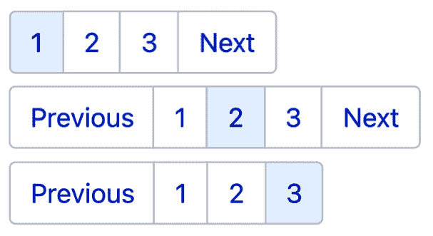

# 第四章：*第四章*：创建可重用模板

本章是您真正开始看到 Gatsby 为大型网站带来的强大功能的地方。您将了解我们如何使用可重用模板和通过 GraphQL 获取的数据编程创建页面。到本章结束时，您将创建博客帖子列表、博客页面和标签页面。您还将了解如何将分页和搜索功能引入您的网站。

到目前为止，我们创建的所有页面都是单个实例，这意味着网站上只有一个该页面的副本（例如，我们的索引页面，永远只有一个副本）。但是，当我们考虑像博客页面这样的页面时会发生什么呢？为每篇帖子创建单个实例页面将是一个非常费力的过程。因此，我们可以使用**模板**。模板是页面组件的多实例，它映射到数据。对于 GraphQL 查询中的每个节点，我们都可以使用这个模板创建一个页面，并用该节点的数据填充它。

现在我们已经了解了在 Gatsby 中我们所说的模板是什么，让我们创建我们的第一个几个模板，然后**编程**地使用它们创建页面。

在本章中，我们将介绍以下主题：

+   定义模板

+   创建模板和程序化页面生成

+   搜索功能

# 技术要求

要完成本章，您需要完成*第三章*，*从任何地方获取和查询数据*。如果您有一系列博客帖子，我们可以用来构建我们的页面，并已导入 Gatsby，您将充分利用本章。源代码不重要——如果您能在您的 GraphQL 数据层中看到它们，您就可以开始本章了。如果您没有可用的帖子，您可以在以下位置找到一些占位符 Markdown 文件，您可以将它们导入 Gatsby：[`github.com/PacktPublishing/Elevating-React-Web-Development-with-Gatsby-4/tree/main/Chapter04/placeholder-markdown`](https://github.com/PacktPublishing/Elevating-React-Web-Development-with-Gatsby-4/tree/main/Chapter04/placeholder-markdown)。

本章的代码可以在[`github.com/PacktPublishing/Elevating-React-Web-Development-with-Gatsby-4/tree/main/Chapter04`](https://github.com/PacktPublishing/Elevating-React-Web-Development-with-Gatsby-4/tree/main/Chapter04)找到。

重要提示

为了保持代码片段的大小可管理，本章中的许多示例都省略了样式，并带有指向我们已编写的代码的注释。要查看这些组件的完整样式版本，请导航到本书的代码仓库。

# 创建模板和程序化页面生成

在本节中，我们将使用模板编程生成页面。我们将创建博客页面、博客列表预览页面和标签页面。为了确保所有这些都能正确工作，重要的是要确保您要填充博客页面的每个数据节点都包含以下内容：

+   **标题**: 博客文章的标题。

+   **描述**: 对博客文章内容的单行描述。

+   **日期**: 文章应该发布的日期。

+   **标签**: 与博客文章相关联的标签列表。

+   **正文**: 文章的主要内容。

如果你从同一来源获取多种类型的内容，最好也包含一个**类型**字段。这将允许你过滤掉不属于此类型的节点。

添加这些内容到节点的方法将根据来源而变化。然而，在 Markdown 的情况下，你可以按照以下格式创建你的文章：

```js
---
type: Blog
title: My First Hackathon Experience
desc: This post is all about my learnings from my first
  hackathon experience in London.
date: 2020-06-20
tags: [hackathon, webdev, ux]
---
# Body Content
```

在这里，我们将`title`、`desc`、`date`和`tags`添加到`frontmatter`中。正文内容将是`frontmatter`之后的所有内容。

重要提示

我将在本章中查询本地 Markdown 文件中的数据。如果你从其他类型的本地或远程来源获取内容，你仍然可以使用所有代码，除了查询和节点字段操作，你必须修改以与你的来源一起工作。如果你在构建查询时遇到困难，请参考*第三章*，*从任何地方获取和查询数据*。

无论你的来源是什么，你应该确保你的内容填充了相同的字段，以确保与博客相关数据的 GraphQL 查询始终一致。

现在我们已经建立了必要的博客节点数据字段，让我们使用我们的数据来创建博客文章页面。

## 博客文章模板

在本节中，我们将为每个博客文章创建页面。我们将通过以下步骤创建和使用我们的第一个模板来完成这项工作：

1.  修改你的`gatsby-node.js`文件，使其包含以下代码：

    ```js
    const { createFilePath } = require('gatsby-source-
     filesystem');
    exports.onCreateNode = ({ node, getNode, actions }) => {
      const { createNodeField } = actions;
      if (node.internal.type === 'MarkdownRemark') {
        const slug = createFilePath({ node, getNode,
        basePath: 'pages' });
        createNodeField({
          node,
          name: 'slug',
          value: slug,
        });
      }
    };
    ```

    `onCreateNode`函数在创建新节点时被调用。使用此函数，我们可以通过添加、删除或操作它们的字段来转换节点。在这种情况下，如果节点是`MarkdownRemark`类型，我们将添加一个`slug`字段。`slug`是我们网站上特定页面的地址，因此在我们的博客页面中，我们希望每个博客文章都有一个独特的`slug`，它将在网站上渲染。从文件名创建 slug 可能很复杂，因为你需要处理会破坏 URL 格式的字符。幸运的是，`gatsby-source-filesystem`插件提供了一个名为`createFilePath`的函数来创建它们。

1.  通过运行你的开发服务器并使用 GraphiQL 来探索你的节点，验证每个博客页面都有一个`slug`。如果你使用 Markdown，你应该在`MarkdownRemark`节点的`fields`对象中找到它。

1.  在`src`目录内创建一个名为`templates`的新文件夹来存放我们的页面模板。

1.  在`templates`目录内创建一个名为`blog-page.js`的新文件。这是我们创建博客页面模板的文件。

1.  将以下代码添加到`blog-page.js`文件中：

    ```js
    import React from "react";
    import Layout from "../components/layout/Layout";
    import TagList from "../components/blog-posts/TagList"
    export default function BlogPage() {
      return (
        <Layout>
          <div className="max-w-5xl space-y-4 mx-auto 
           py-6 md:py-12 overflow-x-hidden lg:overflow-x-
           visible">
            <h1 className="text-4xl font-bold">Blog
              Title</h1>
            <div className="flex items-center space-x-2">
              <p className="text-lg opacity-50">Date</p>
              <TagList tags={["ux"]} />
            </div>
            <div>
               Article Body
            </div>
          </div>
        </Layout>
      );
    }
    ```

    在这里，我们正在创建一个包含静态数据的博客文章模板，稍后我们将用实际内容替换它。您可以看到我们有一个包含博客文章标题的标题。然后我们跟随博客的`日期`和`TagList`组件，我们将在稍后创建它。最后，我们有主要的`文章正文`。

1.  在`src/components`目录内创建一个名为`blog-posts`的文件夹，我们将在此存储任何与博客相关的组件。

1.  在`src/components/blog-posts`文件中创建一个`TagList`组件。我们将在需要将屏幕上的`tag`徽章列表渲染时使用此组件：

    ```js
    import React, { Fragment } from "react";
    const TagList = ({ tags }) => {
      return (
        <Fragment>
          {tags.map((tag) => (
            <div
              key={tag}
              className="rounded-full px-2 py-1 uppercase
                text-xs bg-blue-600 text-white"
            >
              <p>{tag}</p>
            </div>
          ))}
        </Fragment>
      );
    };
    export default TagList
    ```

    此组件接受一个`tags`数组作为属性，遍历它们，并返回一个包含该`tag`的样式`div`。所有这些都包裹在一个`Fragment`组件中。通过使用`Fragment`，我们可以避免强制执行我们的`tags`的排序和定位，而可以允许父元素来决定。

    现在我们已经创建了一个模板文件及其组件，我们可以在`gatsby-node.js`文件中使用它。

1.  将以下代码添加到您的`gatsby-node.js`文件顶部：

    ```js
    const path = require('path');
    const { createFilePath } = require('gatsby-source-
      filesystem');
    exports.createPages = async ({ actions, graphql,
     reporter }) => {
     const { createPage } = actions;
     const BlogPostTemplate =
     path.resolve('./src/templates/blog-page.js');
     const BlogPostQuery = await graphql('
     {
     allMarkdownRemark(filter: { frontmatter: { type:
     { eq: "Blog" } } }) {
     nodes {
     fields {
     slug
     }
     }
     }
     }
     ');
     if (BlogPostQuery.errors) {
     reporter.panicOnBuild('Error while running GraphQL
     query.');
     return;
     }
     BlogPostQuery.data.allMarkdownRemark.nodes.forEach(({ 
     fields: { slug } }) => {
     createPage({
     path: 'blog${slug}',
     component: BlogPostTemplate,
     context: {
     slug: slug,
     },
     });
     });
    };
    ```

1.  在这里，我们正在使用`createPages`函数，它允许我们动态地创建页面。为了确保您可以查询所有数据，此函数仅在所有数据都已获取后运行一次。在这个函数内部，我们首先解构`actions`对象以检索`createPage`函数。然后，我们告诉 Gatsby 在哪里可以找到我们的博客文章模板。有了这两部分，我们现在可以查询我们的数据了。您应该会看到一个熟悉的 GraphQL 查询，用于从所有类型为*Blog*的 Markdown 中选择`slug`。然后我们有一个小的`if`语句来捕获错误，但假设它是成功的，我们就有创建页面所需的所有数据。我们可以遍历我们的数据结果，遍历每个数据节点，通过指定路径（使用`slug`）和我们的模板为每个节点创建一个页面。您还会注意到我们在这里定义了一些`context`。在`context`中定义的数据可以作为 GraphQL 变量在页面查询中使用，这将使在以下步骤中将正确的 Markdown 内容映射到正确的页面变得容易。重新启动您的开发服务器，并通过导航到端口的任何非存在路由来打开开发 404 页面。这将显示您网站上包括我们刚刚创建的页面的页面列表。点击其中一个应该会渲染我们在创建模板时定义的静态内容。现在，这些页面已成功创建，让我们回到模板并修改它以检索正确的内容而不是静态内容。

1.  使用以下代码修改`src/templates/blog-post.js`文件：

    ```js
    import React from "react";
    slug property we defined in the gatsby-node.js file comes in handy. We can use that slug to find the blog post where slug matches in the node's fields. We query for all the data that we need to populate this page with and retrieve date, title, tags, and the Markdown HTML. This is then passed into the template via the data prop, exactly like in our single instance pages. We can then use this content to swap out the static placeholder content we had previously.
    ```

1.  通过重新启动您的开发服务器并再次导航到您的某个博客页面，您现在应该会看到它用其节点数据填充了。您已成功创建了第一个程序化页面！

    由于我们只有少数几篇博客文章，创建所有这些页面不会花费太多时间。然而，如果您需要创建数千个页面，会发生什么？您不必等待所有网站页面构建完成，可以指示 Gatsby 延迟生成一些页面。您可以通过在`gatsby-node.js`中的`createPage`函数传递`defer:true`来实现这一点，如下所示：

    ```js
      createPage({
          path: 'blog${slug}',
          component: BlogPostTemplate,
          defer: true,
          context: {
            slug: slug,
          },
        });
    ```

    通过这次改动，任何以这种方式创建的页面将在第一次请求该页面时构建，而不是在构建时构建。这个特性将构建类型从静态构建改为混合构建。有关这种差异的更多信息，请参阅*第九章*，*部署和托管*。

现在我们已经创建了博客文章页面，我们必须有一种方法从我们的其他页面链接到它们。让我们创建一个博客预览模板页面，在那里我们可以列出我们的博客文章预览和链接到我们刚刚创建的页面。

## 博客预览模板

虽然我们可以创建一个博客文章的单个列表并渲染它，但使用**分页**来分割网站上的博客文章列表、文章和产品列表是一个标准模式。在您的网站上使用分页有三个主要好处：

+   **更好的页面性能**：如果每篇文章的预览中都包含一张图片，那么随着每个项目的添加，我们需要传输到客户端的数据量将显著增加。通过引入分页，客户端在浏览一组项目时只会下载小部分数据。这导致页面加载时间更快，这在带宽较低的地区尤为重要。

+   **改进的用户体验**：在单个页面上显示所有内容可能会让用户感到不知所措，因此，我们必须将内容分解成小而可管理的块。

+   **更便捷的导航**：如果我们在一个连续的列表中渲染数百个产品，用户在滚动时将无法知道有多少产品。通过将内容拆分为多个页面，每个页面有固定数量的产品，用户可以更好地理解您的内容规模。

考虑到所有这些，让我们使用模板创建一个分页的博客预览页面：

1.  在`src/components/blog-posts`文件中创建一个`Pagination`组件：

    ```js
    import React from "react";
    import { Link } from "gatsby";
    const Pagination = ({ numPages, currentPage }) => {
     var pageArray = [];
     for (var i = 1; i <= numPages; i++) pageArray[i] = i;
      return (
        <div>
          <ul>
            {currentPage !== 1 && (
              <li>
                <Link to={currentPage === 2 ? '/blog' :
                  '/blog/${currentPage - 1}'}>
                  Previous
                </Link>
              </li>
            )}
            {pageArray.map((pageNum) => (
              <li key={'pageNum_${pageNum}'} >
                <Link to={pageNum === 1 ? '/blog' :
                  '/blog/${pageNum}'}>
                  {pageNum}
                </Link>
              </li>
            ))}
            {currentPage !== numPages && (
              <li>
                <Link to={'/blog/${currentPage +
                  1}'}>Next</Link>
              </li>
            )}
          </ul>
        </div>
      );
    };
    export default Pagination;
    ```

    在这里，我们创建了一个组件，它将允许我们访问分页的博客预览页面。该组件包含页数和当前页作为属性。使用这两条信息，我们可以确定用户是否可以从当前页面导航到下一页或上一页。这个组件的工作原理最好通过查看它的渲染方式来解释：

    

    图 4.1 – 分页组件状态

    在第一种情况下，当前页面是**1**，因此不需要渲染**上一页**按钮。相反，我们只显示前一页和**下一页**按钮。在第二种情况下，我们处于第**2**页，用户可以前后导航，因此我们可以渲染**上一页**和**下一页**按钮。在最后一种情况下，我们处于最后一页，因此不需要渲染**下一页**按钮。

1.  在`src/templates/`中创建一个新的模板，命名为`blog-preview.js`，并添加以下页面查询：

    ```js
    /*
         Space for page component
    */
    export const pageQuery = graphql'
      query($skip: Int!, $limit: Int!) {
        blogposts: allMarkdownRemark(
          limit: $limit
          skip: $skip
          filter: { frontmatter: { type: { eq: "Blog" } } }
          sort: { fields: frontmatter___date, order: DESC }
        ) {
          nodes {
            frontmatter {
              date
              title
              tags
              desc
            }
            fields {
              slug
            }
          }
        }
      }
    ';
    ```

    文件中的查询从`allMarkdownRemark`（我在此查询中命名为`blogposts`）获取数据。`blogposts`查询检索所有`frontmatter`类型等于`Blog`的 Markdown。它按降序对帖子集合进行排序。这里事情变得有趣 - 我们还向查询提供了`skip`和`limit`。`skip`告诉查询跳过集合中的多少个文档，而`limit`告诉查询限制结果的数量。我们将在`gatsby-config.js`文件中提供`skip`和`limit`，以及`numPages`和`currentPage`。

1.  在`blog-preview.js`文件中，在查询之前创建页面组件：

    ```js
    import React from "react";
    import { graphql, Link } from "gatsby";
    import Layout from "../components/layout/Layout";
    import Pagination from "../components/blog-
      posts/Pagination";
    import TagList from "../components/blog-posts/TagList"
    export default function BlogPreview({ pageContext,
      data }) {
      const {
        numPages,
        currentPage
      } = pageContext
      const {
        blogposts: { nodes },
      } = data;
      // return statement
    }
    ```

    就像我们的其他查询一样，当文件末尾的查询运行时，它将通过`data`属性为我们的页面提供`data`。在这里，我们正在解构`pageContext`以访问`numPages`和`currentPage`。我们也在使用解构`data`来获取`blogposts`查询中的`nodes`。我们将在下一步的`return`语句中添加我们的渲染。

1.  在同一文件中创建`return`语句：

    ```js
      return (
        <Layout>
          <div className="max-w-5xl mx-auto space-y-8 py-6
            md:py-12">
            {nodes.map(
              ({ frontmatter: { date, tags, title, desc },
                 fields: { slug } }) => (
                <div>
                  <Link to={'/blog${slug}'}>
                    <h2 className="text-2xl font-
                      medium">{title}</h2>
                    <div className="flex items-center
                      space-x-2">
                      <p className="text-lg opacity-
                        50">{date.split("T")[0]}</p>
                      <TagList tags={tags}/>
                    </div>
                    <p>{desc}</p>
                  </Link>
                </div>
              )
            )}
            <Pagination numPages={numPages}
             currentPage={currentPage} />
          </div>
        </Layout>
      );
    ```

    我们使用两个来源的`nodes`来遍历帖子，渲染每个帖子的预览（利用`TagList`组件），以及渲染我们的`Pagination`组件。现在我们已经创建了模板，我们可以将其导入到我们的`gatsby-config.js`文件中。

1.  修改你的`gatsby-config.js`文件的`createPages`函数，使用以下代码：

    ```js
    exports.createPages = async ({ actions, graphql,
      reporter }) => {
      const { createPage } = actions;
      const BlogPostTemplate =
       path.resolve('./src/templates/blog-page.js');
      BlogPreviewTemplate, then we run our Markdown query as normal. As we will be now using BlogPostQuery.data.allMarkdownRemark.nodes in two places (blog previews and blog post page creation), we can assign it to a constant. We will also assign two more constants – the number of posts per page (postsPerPage) and the number of pages (numPages) that we will need for pagination. postsPerPage specifies how many posts we want on each of our paginated blog post previews. numPages calculates how many preview pages are needed by dividing the total number of posts by postsPerPage and then rounding up to the nearest whole integer using the Math.ceil function. We then create an Array with a length equal to the number of pages and loop through it using the forEach function. For each index (i), we use the createPage action. We provide this action with the path to where the page should be located, which is /blog if i is 0 and /blog/i+1 for anything higher. We also provide BlogPreviewTemplate and context, which contain limit and skip, which we utilize on the page.
    ```

1.  你现在可以开始启动你的开发服务器以验证分页是否正常工作。你应该在`/blog`位置看到按降序排列的帖子。如果你有比`postsPerPage`值更多的帖子，你应该也会看到你的`Pagination`组件，这表明有额外的页面，并允许你导航到那里。

现在我们已经实现了博客预览页面，让我们利用所学知识创建另一个页面集合 - 标签页面。

## 标签页面模板

作为用户，看到我的帖子按日期排序并不总是足够的 - 我可能希望能够找到与单个主题相关的帖子组。标签页面是在点击博客帖子中的一个标签时导航到的页面。导航到这些页面之一，你会看到一个与该标签相关的帖子列表。

让我们程序化地为文章中存在的每个标签创建标签页面：

1.  安装`lodash`：

    ```js
    npm i lodash
    ```

    `lodash` 是一个 JavaScript 工具库，我们将使用它来使标签 URL 友好。因为一个标签可能由多个单词组成，我们需要一种方法来删除空格。虽然你可以自己创建一个函数来做这件事，但 `lodash` 有一个 `.kebabCase()` 函数非常适合这个用例。

1.  修改 `TagList` 组件，将我们的 `tag` 徽章转换为 `Link` 组件：

    ```js
    import React, { Fragment } from "react";
    import { Link } from "gatsby";
    import { kebabCase } from "lodash"
    const TagList = ({ tags }) => {
      return (
        <Fragment>
          {tags.map((tag) => (
            <Link key={tag}
               to={'/tags/${kebabCase(tag)}'}>
            <div
              key={tag}
              className="rounded-full px-2 py-1 uppercase
                text-xs bg-blue-600 text-white"
            >
              <p>{tag}</p>
            </div>
            </Link>
          ))}
        </Fragment>
      );
    };
    export default TagList
    ```

    作为 `Link` 组件，它们需要一个 `to` 属性。这个属性应该指向你的 `tag` 页面将被创建的位置——在我们的例子中，`/tags/tag-name` 是位置。我们可以使用 `lodash` 中的 `kebabCase` 函数来确保标签中的任何空格都被转换为连字符。

1.  在 `src/templates` 文件夹中创建一个 `tags.js` 文件：

    ```js
    /*
         Space for page component
    */
    export const pageQuery = graphql'
      query($tag: String) {
        blogposts: allMarkdownRemark(
          sort: { fields: [frontmatter___date], order:
            DESC }
          filter: { frontmatter: { tags: { in: [$tag] },
            type: { eq: "Blog" } } }
        ) {
          totalCount
          nodes {
            frontmatter {
              date
              title
              tags
              desc
            }
            fields {
              slug
            }
          }
        }
      }
    ';
    ```

1.  此组件将非常类似于我们在“博客预览模板”部分之前构建的 `blog-preview.js` 文件，除了对查询进行了一些小的修改。在这个查询中，我们仍然获取我们的 Markdown 内容，但这次我们过滤掉了不包含页面标签的帖子。

1.  在 `tags.js` 文件中的查询之前创建页面组件：

    ```js
    import React from "react";
    import { graphql, Link } from "gatsby";
    import Layout from "../components/layout/Layout";
    import TagList from "../components/blog-
      posts/TagList";
    export default function Tags({ pageContext, data }) {
      const { tag } = pageContext;
      const {
        blogposts: { nodes },
      } = data;
      return (
        <Layout>
          <div>
            <p>Posts tagged with "{tag}"</p>
            {nodes.map(
              ({ frontmatter: { date, tags, title, desc },
                 fields: { slug } }) => (
                <div>
                  <Link to={'/blog${slug}'}>
                    <h2>{title}</h2>
                    <div>
                      <p>{date.split("T")[0]}</p>
                      <TagList tags={tags} />
                    </div>
                    <p>{desc}</p>
                  </Link>
                </div>
              )
            )}
          </div>
        </Layout>
      );
    }
    ```

    页面随后渲染一个包含你当前过滤帖子所用的标签的段落，后面跟着过滤后的帖子列表。每个帖子预览都以其 `title`、`date`、描述（`desc`）和 `tags` 进行渲染，就像在 `blog-preview.js` 文件中一样。

    重要提示

    如果你打算在 `blog-preview.js` 和 `tags.js` 文件中的列表中渲染相同的条目，那么你可能应该将条目预览组件抽象成一个单独的组件。为了保持这些示例的独立性，我这里不会这样做。

1.  将 `lodash` 导入到 `gatsby-config.js` 文件的顶部，靠近其他导入：

    ```js
    const _ = require("lodash");
    ```

    我们还需要在这个文件中使用 lodash 的 `kebabCase`。

1.  将你的标签模板和查询添加到 `gatsby-config.js` 文件中的 `createPages` 函数：

    ```js
    exports.createPages = async ({ actions, graphql,
       reporter }) => {
    // actions destructure & other templates
    TagsTemplate. Then, we append our query with a new query to our Markdown source. This group (which we've named tagsGroup) retrieves an array containing every unique tag that is within frontmatter of our posts. We can then use this new data to loop through every `tag` and create a `tag` page for each one. We pass a `path` to each `createPages` function, pointing to `tags/`, followed by the `tag` name that's parsed through the `kebabCase` function. We pass the `component` property we want it to build the page with, which in our case is `TagsTemplate`, at the beginning of this file. You will also notice that we are also passing `tag` to the page's `context` so that the page knows which `tag` it relates to.
    ```

1.  你现在可以开始启动你的开发服务器以验证标签页面是否正常工作。导航到开发 404 页面；你应该看到每个标签都有一个以 `tags/` 开头的页面。点击其中一个，你应该会看到我们的标签页面模板和与该标签相关的博客帖子列表。

    进一步练习

    我们已经学会了如何分页博客列表，以及创建标签页面。为什么不更进一步，对标签页面进行分页呢？

通过这样，我们已经学会了如何以编程方式为博客文章、博客列表和标签创建页面。现在，让我们关注我们如何创建一个网站搜索，以便随着网站的扩展，找到我们的博客内容变得更加容易。

# 搜索功能

集成网站搜索的方法有很多种。许多选项既可以是托管也可以是本地。对于像我们正在创建的这样的小型项目，通常选择本地索引解决方案会更好，因为你搜索的页面数量永远不会很大。这也意味着你的网站搜索将在离线场景中工作，这可以是一个真正的加分项。

`elasticlunr` Gatsby 插件，内容被索引然后通过 GraphQL 供 `elasticlunr` 索引使用。然后可以对此索引进行搜索查询以检索页面信息。

让我们使用 `elasticlunr` 集成站点搜索：

1.  安装 `elasticlunr` Gatsby 插件：

    ```js
    npm install @gatsby-contrib/gatsby-plugin-elasticlunr-
    search
    ```

1.  将 `elasticlunr` 插件添加到你的 `gatsby-config.js` 插件数组中：

    ```js
    {
          resolve: '@gatsby-contrib/gatsby-plugin-
            elasticlunr-search',
          options: {
            fields: ['title', 'tags', 'desc'],
            resolvers: {
              MarkdownRemark: {
                title: node => node.frontmatter.title,
                tags: node => node.frontmatter.tags,
                desc: node => node.frontmatter.desc,
                path: node => '/blog'+node.fields.slug,
              },
            },
            filter: (node, getNode) =>
            node.frontmatter.type === "Blog",
          },
        },
    ```

    作为 `options` 的一部分，我们向插件提供了一个我们希望索引的 `fields` 列表。然后，我们给它一个 `resolvers` 对象，该对象解释了如何解析源中的 `fields`。在我们的博客文章中，我们可以从 `frontmatter` 中检索 `title`、`tags` 和 `desc`。我们可以使用特定的内容和数据的 `slug` 来构造 `path`。最后，我们还传递了一个 `filter`。这个 `filter` 告诉插件只使用 `frontmatter` 类型为 `Blog` 的节点，因为我们只想在这个时候让我们的博客页面可搜索。

1.  在 `src/layout` 文件夹中创建一个 `Search.js` 组件：

    ```js
    import React, { useState, useEffect } from "react";
    import { Link } from "gatsby";
    import { Index } from "elasticlunr";
    const Search = ({ searchIndex }) => {
      const [query, setQuery] = useState("");
      let [index, setIndex] = useState();
      let [results, setResults] = useState([]);
      useEffect(() => {
        setIndex(Index.load(searchIndex));
      }, [searchIndex]);
    };
    export default Search
    ```

    `Search` 组件接收 `searchIndex` 作为属性。你首先会注意到一个 `useEffect` 钩子，它会将索引加载到状态钩子中。一旦我们加载了索引，我们就可以查询它。

1.  在 `useEffect` 下方创建一个 `search` 函数：

    ```js
    const search = (evt) => {
        const query = evt.target.value;
        setQuery(query);
        setResults(
          index
            .search(query, { expand: query.length > 2 })
            .map(({ ref }) =>
         index.documentStore.getDoc(ref))
        );
      };  
    ```

    你会看到每当调用 `search` 函数时，我们都会使用我们的 `query` 字符串来搜索索引。你会注意到我们向 `search` 函数传递了 `expand: query.length > 2` 作为选项。这告诉 `elasticlunr` 允许输入超过两个字符时的部分匹配。如果你为更少的字符允许部分匹配，你经常会发现你得到了大量与用户所查找内容不相关的结果。一旦我们搜索了索引，我们就可以在 `index` 中的 `documentStore` 上进行 `map` 操作，并返回文档结果，这些结果随后通过 `useState` 钩子传递到状态中。

1.  创建 `search` 结果渲染函数：

    ```js
    const searchResultSize = 3;
    return (
        <div className="relative w-64 text-gray-600">
          <input
            type="search"
            name="search"
            placeholder="Search"
            autoComplete="off"
            aria-label="Search"
            onChange={search}
            value={query}
          />
          {results.length > 0 && (
            <div>
              {results
                .slice(0, searchResultSize)
                .map(({ title, description, path }) => (
                  <Link key={path} to={path}>
                    <p>{title}</p>
                    <p className="text-
                     xs">{description}</p>
                  </Link>
                ))}
              {results.length > searchResultSize && (
                <Link to={'/search?q=${query}'}>
                  <p>+ {results.length - searchResultSize}
                    more</p>
                </Link>
              )}
            </div>
          )}
        </div>
      );
    ```

    我们使用 `useState` 钩子的 `results` 值在状态的结果上 `map`，并在渲染函数中将结果渲染到屏幕上。为了获得更好的用户体验，通常一个好的做法是包含一个 `searchResultSize` 常量。此值决定了要显示的最大结果数。这阻止了你有数百个结果时页面覆盖的情况。相反，如果有更多结果，我们只需向用户指示还有多少个结果。

1.  修改你的 `Header.js` 文件以检索站点索引并将其传递给你的 `Search` 组件：

    ```js
    import React from "react";
    import { Link, Header.js is not a page component, we cannot append the graphql query to the end of the page as Gatsby is not looking for it. However, we can still locate data with the component by using StaticQuery. Static queries differ from page queries as they cannot accept variables like our pages can via page context. In this scenario, that's not a constraint as the search index is always static.`StaticQuery` has two important props – `query` and `render`. `query` accepts a `graphql` query, while `render` tells the component what to render with the data from that query. In this particular instance, we are querying for the elasticlunr `index`, and then rendering our `Search` component using that `data`, passing `index` as a prop.
    ```

1.  现在我们已经完成了搜索功能，重新启动你的开发服务器。你应该会看到我们网站的页眉现在包含了我们的 `Search` 组件。尝试输入几个字符并点击其中一个结果。你应该会被导航到相应的页面。

通过调整解析器和使用这里概述的方法和工具，我们可以将不同类型的页面添加到结果中，以创建真正的全站搜索。

# 摘要

在本章中，你学习了如何使用可重用的模板编程创建页面。你应该有信心现在可以使用任何 GraphQL 数据源创建页面。我们已经实现了一个带有分页的博客文章列表、博客页面、标签页面，并为博客文章创建了一个即使在离线状态下也能工作的网站搜索功能。

在下一章中，我们将掌握将图片添加到我们的 Gatsby 网站中的艺术。首先，我们将了解为什么导入图片并不那么简单，然后再创建那些渐进式加载且性能良好的图片。
