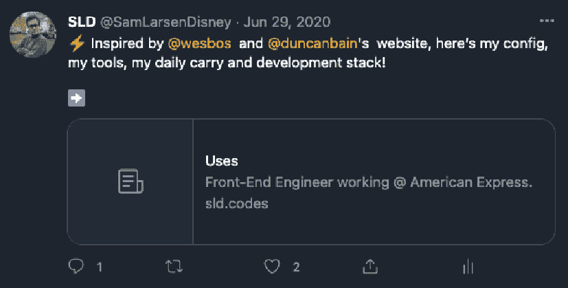

# 第六章：*第六章*：提升你的网站搜索引擎优化

在本章中，你将了解搜索引擎优化（**SEO**）是如何工作的，搜索引擎在你的网站页面中寻找什么，以及如何提高你的网站在网上的存在感。我们还将深入了解其他元数据的使用，以制作视觉吸引人的社交分享预览。到本章结束时，你将创建一个可重复使用的 SEO 组件，为每个页面提供元信息。我们还将创建一个站点地图，以便搜索引擎更容易理解我们的网站。最后，我们还将学习如何阻止你的网站在搜索引擎中显示，如果你不希望它公开可见。

在本章中，我们将涵盖以下主题：

+   介绍 SEO

+   创建 SEO 组件

+   探索元预览

+   了解 XML 站点地图

+   隐藏你的网站不被搜索引擎收录

# 技术要求

为了完成本章，你需要已经完成了*第五章*，*与图像一起工作*。

本章的代码可以在[`github.com/PacktPublishing/Elevating-React-Web-Development-with-Gatsby-4/tree/main/Chapter06`](https://github.com/PacktPublishing/Elevating-React-Web-Development-with-Gatsby-4/tree/main/Chapter06)找到。

# 介绍 SEO

SEO 是提高搜索引擎如 Google、Bing 和 Yahoo 推荐你的网站内容作为给定查询或问题的最佳结果的实践。

重要提示

在本章中，你将了解什么是 SEO，为什么它很重要，以及如何实现包含提升 SEO 排名组件的页面。SEO 是一个庞大的主题，本书无法全面涵盖。因此，我们鼓励你将本章学到的知识通过研究来进一步拓展。

Google 将是本章关注的搜索引擎。Google 在全球搜索引擎市场占有 92%的份额。与其他所有搜索引擎合并，市场份额不到 10%，毫无疑问，Google 正在主导这个领域。正因为如此，将本章内容针对 Google 是合乎逻辑的。

如果你希望搜索引擎推荐你的内容，有三个任务需要协同工作：

+   确保你的内容可以被搜索引擎的网络爬虫发现。

+   向搜索引擎展示你是一个值得信赖的信息来源。

+   通过优秀的 UX、内容层次结构和多媒体，使你的内容对用户友好且吸引人。

通过投入时间实施和改进这三件事，搜索引擎将给你最宝贵的流量形式——**有机流量**。最好的部分？它是免费的！当 Google 将你的网站作为结果页面的一部分展示时，你不需要为其排名或点击付费。

那么，这对搜索引擎有什么好处呢？广告和赞助商。每当搜索用户在谷歌上搜索时，你也会看到来自付费赞助商的结果，偶尔还有个性化广告。这就是搜索引擎赚钱的方式，为了保持收入流的稳定，他们需要你不断回来。为了做到这一点，他们需要确保为你提供最佳的内容，以便你在下一次搜索时再次使用他们。

现在我们已经了解了搜索引擎在寻找什么，让我们来了解一下我们可以提供给搜索引擎的重要页面信号，以帮助他们对我们网站进行排名。

## 页面搜索引擎优化

**页面信号**是搜索引擎可以从网站页面获取的信号。由于你的网站页面在你的控制之下，提高页面信号是最容易做对的事情，也是影响网站排名的最简单方式。因此，我们将在本章中花费大部分时间来提高这些信号。

页面信号可以分为两组——技术信号和内容信号。

### 技术信号

技术信号是与你的网站代码相关的那些信号：

+   **速度**：搜索引擎希望用户能够快速收到他们的结果，因此快速加载的页面在排名上会有提升。

+   **移动响应性**：如今，大多数网络内容都是通过移动设备消费的，因此拥有良好的移动用户体验非常重要。搜索引擎越来越重视这一点，现在谷歌的索引已经以移动优先为原则。

+   **安全性**：确保你的网站安全可以提高你网站的信誉。例如，**HTTPS** 网站比 **HTTP** 网站有优势。

### 内容信号

内容信号是与你网站页面上的副本和链接相关的那些信号：

+   **内容层次结构**：标题、内容标题和页面层次结构非常重要。

+   **页面内容**：谷歌一直在寻找高质量和准确的内容，这些内容最终能够回答用户的查询。当你创建页面并填充它们时，请记住这一点。你的内容需要为你的网站访客提供真正的目的。

+   **丰富内容**：如今，谷歌不仅仅关注原始文本。网络充满了多媒体内容。谷歌正在寻找包含图片和视频而不是原始文本的内容。多媒体内容允许用户更好地与你的内容互动，因此更受青睐。

+   **最近更新**：如果你的页面内容有一段时间没有更改，谷歌可能会将其内容视为过时。谷歌正在积极检查你的页面内容是否最近创建的。通过确保你的内容“新鲜”，谷歌可以确信你的内容是最近的。

+   **外部链接**：通过引用外部内容，这告诉谷歌信息是准确的，因为它类似于多个网站上的内容。

通过查看这些信号，你可能已经开始意识到，你可以将这些因素投入大量的时间。这取决于你决定搜索引擎排名和社交媒体分享对你网站的价值，这将反过来决定你应该花多少时间来实施本章中提到的内容。

现在我们已经了解了什么是 SEO，让我们将注意力转向如何通过 SEO 组件来提高我们的页面 SEO 排名。

# 创建一个 SEO 组件

网上的每个网站都有元标签。元标签是提供网页摘要的文本和图像内容的片段。当有人分享你的网站或它出现在搜索引擎中时，这些数据会在浏览器中渲染。让我们创建一个 SEO 组件，以便我们可以拥有丰富的预览，吸引用户访问我们的网站：

1.  安装必要的依赖项：

    ```js
    npm i react-helmet-async gatsby-plugin-react-helmet-
    async
    ```

    `react-helmet-async`是一个依赖项，它管理对文档头所做的所有更改。

1.  在你的`gatsby-config.js`文件中包含`gatsby-plugin-react-helmet-async`插件：

    ```js
    module.exports = {
      // rest of config
      plugins: [
        gatsby-browser.js file so that it wraps the root element in HelmetProvider, like this (*you do not need to do this step yourself*):

    ```

    import React from "react";

    当需要时，在 React 组件和页面中使用`head`。

    ```js

    ```

1.  在`src/components`内部创建一个名为`SEO.js`的新文件。这是我们将在其中创建我们的 SEO 组件的文件。

1.  打开新创建的文件并添加以下代码：

    ```js
    import React from "react";
    import { Helmet } from "react-helmet-async";
    import { useStaticQuery, graphql } from "gatsby";
    export default function SEO({ description, lang =
     "en", title }) {
      return (
        <Helmet
          htmlAttributes={{
            lang,
          }}
          title={title}
          titleTemplate={`%s · My Site`}
          meta={[
            {
              name: `description`,
              content: description,
            },
          ]}
        />
      );
    }
    ```

    在这里，我们添加了语言作为 HTML 属性。我们还添加了`title`标签、标题模板和`description`作为元数据。如果想要有一个一致的格式，标题模板就很有用。让我们假设我们传递的标题是`Home`。在这种情况下，模板的最终页面标题将是`Home · My Site`。

你现在可以在你的页面上使用你的 SEO 组件了，让我们试试吧！我们将使用`src/pages/index.js`文件作为示例：

```js
import React from "react";
import { Link, graphql } from "gatsby";
import { StaticImage } from "gatsby-plugin-image";
import Layout from "../components/layout/Layout";
import SEO from "../components/layout/SEO";
export default function Index({ data }) {
  const {
    site: {
      siteMetadata: { name, role },
    },
  } = data;
  return (
    <Layout>
      <SEO 
 title="Home" 
 description="The landing page of my website" 
 />
      {/* REST OF FILE */}    
    </Layout>
  );
}
```

在这里，你可以看到组件嵌入在我们的首页中。我们添加了`title`和`description`属性，以确保这些可以填充 SEO 组件中包含的`<title>`和`<description>`标签。如果你现在运行`gatsby develop`，你应该看到标签页的标题改变以匹配你的新标题。

我们还可以使用我们的 GraphQL 数据提供`title`和`description`。在我们的博客页面模板文件（`src/templates/blog-page.js`）中，我们可以使用博客文章的`frontmatter`来填充 SEO 组件：

```js
export default function BlogPage({ data }) {
  const {
    blogpost: {
      frontmatter: { date, tags, title, hero, desc },
      html,
    },
  } = data;
  return (
    <Layout>
      <SEO title={title} description={desc} />
      {/* Rest of render */}
    </Layout>
)}
```

在这里，我们将`title`和`desc`从 Markdown 文章的`frontmatter`传递给 SEO 组件，以便它可以使用这些信息来生成标签。

现在我们已经设置了基础知识，我们如何增强我们的网站预览，使其在社交媒体中更具吸引力？让我们来看看。

# 探索元预览

如果你曾经通过 Twitter、Slack 或任何其他即时通讯服务与朋友分享过网站，你可能看到过一张漂亮的预览图片、标题和描述出现在卡片中，以使用户了解你将他们发送到何处。这是通过元标签实现的。

我们已经在我们的搜索组件中包含了一些这些（`title`和`description`元标签），但在这里，我们将实现两种其他常见类型 – **OpenGraph**和 Twitter 元数据。然后我们将学习如何合并和验证这些标签。

## Open Graph 元数据

**Open Graph**是一个由 Facebook 最初设计和创建的互联网协议，其单一目的是统一和标准化网页内的元数据，以获得更好的页面内容表示。该协议通过向您的网站标题中添加特定的元标签来实现这一点。这些标签提供了有关您网站页面内容的信息。这可能包括从页面标题这样基本的信息到页面上的视频时长这样更复杂的信息。通过填充适当的字段，我们可以创建一个关于我们的网站页面外观的捆绑摘要。

我们可以通过向`Helmet`组件的`meta`属性添加 Open Graph 元标签，通过我们现有的`SEO`组件添加 Open Graph 元标签：

```js
<Helmet
      meta={[
          {
          property: `og:title`,
          content: title,
        },
        {
          property: `og:description`,
          content: description,
        },
        {
          property: `og:type`,
          content: `website`,
        },
        {
          property: `og:image`,
          content: `your-image-url.com`,
        }
]} />
```

在这里，我们正在为内容的`title`、`description`、`type`和`image`实现 Open Graph 标签。正如您所看到的，所有 Open Graph 标签都有`og`前缀。这些只是通过协议可用的元标签中的一小部分。

要查看所有可用类型的完整列表，请访问 Open Graph 协议网站([`ogp.me`](https://ogp.me))。

## Twitter 元数据

与 Facebook 一样，Twitter 也决定创建自己的元标签，如 Open Graph。所有 Twitter 标签都使用`twitter`前缀而不是`og`。与 Open Graph 标签区分开来的一点是，Twitter 在其平台上还有一个用于内容显示格式的标签。第一种类型是`summary`：



图 6.1 – Twitter 摘要卡片

`summary`显示网站页面的简短摘要预览。如果您正在寻找带有图像预览的更大内容，可以使用`summary_large_image`类型代替：


图 6.2 – 带有大型图像的 Twitter 摘要卡片

如您所见，这种类型显示了一个更大的图像，对用户来说更具吸引力。

我们可以通过向`Helmet`组件的`meta`属性添加 Twitter 元标签，通过我们现有的`SEO`组件添加 Twitter 元标签：

```js
<Helmet
      meta={[
        {
          name: `twitter:card`,
          content: `summary_large_image`,
        },
        {
          name: `twitter:creator`,
          content: twitter,
        },
        {
          name: `twitter:title`,
          content: title,
        },
        {
          name: `twitter:description`,
          content: description,
        },
        {
          name: `twitter:image`,
          content: `your-image-url.com`,
        }
]} />
```

虽然许多标签都是不言自明的，但值得指出的是`twitter:creator`标签。如果您将您的 Twitter 用户名作为此属性的值，Twitter 将能够识别您为网站的创建者。

现在我们已经实现了 Open Graph 和 Twitter 元标签，让我们将它们合并和合并。

## 合并标签

您可能已经注意到，我们在通过 Twitter 标签和 Open Graph 标签提供的数据之间存在一些重复。例如，在两种情况下，我们都在提供标题（`twitter:title`和`og:title`）。包含这些重复内容并没有什么害处。包含这种冗余只会为您的页面增加几个字节。

但如果您希望保持整洁，减少标签数量是可能的。Twitter 会抓取您的网站页面——如果它找不到它正在寻找的 Twitter 标签，并且如果存在，它将回退到 Open Graph 标签。这对于标题和描述等重复项来说很好，但仍然重要的是要包含那些特定的 Twitter 标签，例如卡片类型。

现在，让我们将我们在前两个部分中找到的 Open Graph 标签和 Twitter 标签合并，以创建一个既服务于这两种格式又没有冗余的子集：

```js
<Helmet
      meta={[
        // Twitter MetaData
        {
          name: `twitter:card`,
          content: `summary_large_image`,
        },
        {
          name: `twitter:creator`,
          content: twitter,
        },
        // Open Graph MetaData
        {
          property: `og:title`,
          content: title,
        },
        {
          property: `og:description`,
          content: description,
        },
        {
          property: `og:type`,
          content: `website`,
        },
        {
          property: `og:image`,
          content: `your-image-url.com`,
        },
      ]}
    />
```

在这里，我们可以看到我们已经完全省略了 `title`、`description` 和 `image` 的 Twitter 标签，因为它们将回退到 Open Graph 标签。然而，我们保留了 `creator` 和 `card` 的 Twitter 标签，因为它们不通过 Open Graph 提供。

现在我们已经了解了如何使我们的网站在分享时看起来很棒，那么当它被搜索引擎分享时呢？我们如何突出我们希望它关注的信息？

## 验证标签

无论您是否实现了 Open Graph 标签、Twitter 标签或两者都实现，您在将网站页面在线分享之前都希望确保您的标签能够正确工作。Facebook 和 Twitter 都创建了应用程序来预览在它们平台上分享的链接将如何显示：

+   Twitter 卡片验证器: [`cards-dev.twitter.com/validator`](https://cards-dev.twitter.com/validator)

+   Facebook 分享调试器: [`developers.facebook.com/tools/debug`](https://developers.facebook.com/tools/debug)

这些工具执行非常相似的功能——它们会抓取输入的网页上的任何相关元标签，您已经定义了这些标签。然后，它们使用这些标签在其平台上显示网站预览的样子。还有一些第三方服务可以同时验证这两个平台，例如 MetaTags.io ([`metatags.io`](https://metatags.io))。

小贴士

这里提到的验证器仅适用于托管在公共服务器上的网站。您必须首先部署您的网站，才能使用这些工具测试您的元标签。您将在 *第九章* 中了解更多关于如何部署您的网站的信息，*部署和托管*。

到目前为止，你应该已经熟悉了创建和测试元标签。现在，让我们关注如何使我们的网站更容易被网络爬虫解释。

# 了解 XML 站点地图

站点地图是一个特殊的文件，它提供了关于您网站上网页和文件的信息，以及它们之间的关系。创建此文件允许网络爬虫在无需手动爬取网站的情况下收集有关您网站的信息。它帮助我们向搜索引擎突出显示我们特别希望他们查看的页面。让我们为我们的网站创建一个站点地图：

1.  安装 `gatsby-plugin-sitemap` 依赖项：

    ```js
    npm install gatsby-plugin-sitemap
    ```

1.  更新您的 `gatsby-config.js` 文件：

    ```js
    module.exports = {
      siteMetadata: {
        siteUrl: `https://your.website.com`,
      },
      plugins: [
        `gatsby-plugin-sitemap`,
      // other plugins
      ]
    }
    ```

    通过包含这个插件，Gatsby 将在构建网站时自动创建一个网站地图。重要的是要记住，这个插件仅在运行在生产环境中时生成输出。当你使用`gatsby develop`时，你将看不到你的网站地图文件被创建。只有当运行`gatsby build`命令时，才会创建网站地图文件。

现在我们已经遵循了那些步骤，让我们验证我们的实现。运行`gatsby build && gatsby serve`，然后导航到你的网站上的`/sitemap/sitemap-index.xml`。这个页面应该会显示一些类似以下的**XML**数据：

```js
<sitemapindex
  xmlns="http://www.sitemaps.org/schemas/sitemap/0.9">
<sitemap>
<loc>https://your.website.com/sitemap/sitemap-0.xml</loc>
</sitemap>
</sitemapindex>
```

这个页面是你的网站地图的索引，告诉搜索引擎在哪里找到你的网站数据。在你的情况下，你可能会看到一个单独的条目，类似于前面代码块中显示的。如果你遵循`<loc>`标签中的路径（`/sitemap/sitemap-0.xml`），你会找到类似以下的内容：

```js
<urlset>
<url>
<loc>https://your.website.com/blog</loc>
<changefreq>daily</changefreq>
<priority>0.7</priority>
</url>
<url>
<loc>  Post/</loc>
<changefreq>daily</changefreq>
<priority>0.7</priority>
</url>
…
</urlset>
```

在这个列表中，你应该会看到网站上每个页面的条目，包括`changefreq`和`priority`。如果网站页面出现在这个列表中，那么谷歌可以找到关于你页面的信息，而无需手动爬取你的网站。恭喜你！

重要提示

你的网站的 404 页面及其开发变体始终被排除在网站地图之外，所以你不必担心过滤掉这些页面。

谷歌已经为验证你的网站地图以及其他搜索分析构建了一个很好的工具——谷歌搜索控制台。你可以用它来检查你网站的索引状态，并根据哪些查询驱动流量到你的网站来优化你网站的可见性。你可以通过访问[`search.google.com/search-console/about`](https://search.google.com/search-console/about)来尝试它。

我们现在已经了解了如何让谷歌轻松找到并显示我们的网站，但如果我们想做的相反，让我们的网站不在搜索引擎中显示呢？我们将在下一节中探讨这个问题。

# 隐藏你的网站不被搜索引擎发现

为了防止你的页面出现在谷歌和其他搜索引擎中，你必须更新页面的`<head>`属性，使其包含以下元标签：

```js
<meta name="robots" content="noindex">
```

通过包含一个`noindex`元标签，爬虫在爬取该页面并看到该标签时，会将其从搜索结果中删除。这无论网站是否被链接到互联网上的其他网站都会发生。

就像我们的`SEO`组件一样，我们可以在组件中添加这个功能，以便在需要时跨页面重用：

1.  在`src/components/layout`目录下创建一个名为`NoRobots.js`的新文件。

1.  打开新创建的文件，并添加以下代码到其中：

    ```js
    import React from "react";
    import { Helmet } from "react-helmet-async";
    export default function NoRobots() {
      return (
        <Helmet
          meta={[
            {
              name: `robots`,
              content: "noindex",
            },
          ]}
        />
      );
    }
    ```

    这个组件在包含在任何页面上时，会在`head`中添加`noindex`元数据。以这种方式使用这个组件，我们可以在隐藏一些页面同时仍然允许其他页面被索引的情况下，获得灵活性。

要隐藏您网站中的静态资源，如图片，以避免被搜索引擎索引，我们需要包含一个`robots.txt`文件。这个文件被搜索引擎爬虫用来确定它可以访问您网站的哪些部分。有一个名为`gatsby-plugin-robots-txt`的插件已经设置好了，使得创建这个文件变得简单易行。现在让我们来实现这个插件：

1.  安装`gatsby-plugin-robots-txt`依赖项：

    ```js
    npm install gatsby-plugin-robots-txt
    ```

1.  使用以下代码更新您的`gatsby-config.js`文件：

    ```js
    module.exports = {
      siteMetadata: {
        siteUrl: `https://your.website.com`,
      },
      plugins: [
        /static folder. The /static folder is where site images are stored. Adding this disallow policy will stop your images from appearing in a Google image search. They will only be found within your site pages.
    ```

我们现在清楚地了解了如何从搜索引擎中排除页面和资源。

# 摘要

在本章中，我们学习了 SEO 是什么以及搜索引擎用来识别优质内容的信号。我们创建了一个`SEO`组件，我们可以用它来为我们的网站页面添加元信息。然后，我们通过添加 Open Graph 和 Twitter 元标签来增强它，以便在社交媒体平台上获得更好的网站预览。我们还实现了一个网站地图，以帮助搜索引擎有效地索引我们的网站。最后，我们学习了如何使我们的网站从搜索引擎中隐藏。

在下一章中，我们将学习如何测试和审计我们的网站。我们还将探索如何审计我们网站页面的 SEO。通过学习如何审计我们的网站页面，我们可以找到提高页面速度的方法，这也会提升我们的 SEO 排名。
