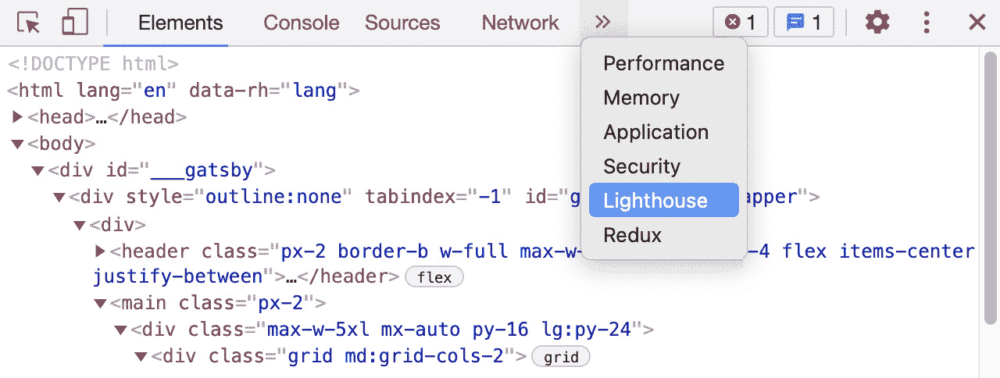
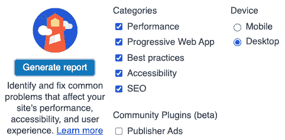
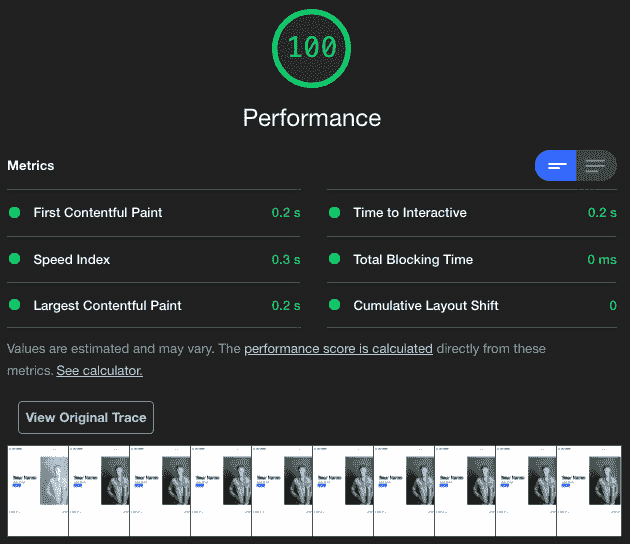
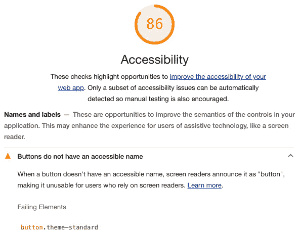

# 第七章：*第七章*: 测试和审计您的网站

在本章中，我们将了解单元测试是什么，为什么它有用，以及如何开始对您的 Gatsby 网站进行单元测试。然后我们将学习如何使用 Git 钩子在运行常见的 Git 命令时触发单元测试和其他命令。接着，我们将研究如何测量核心 Web 指标，以了解我们的 Gatsby 网站页面体验在实验室和现场环境中的表现情况。到本章结束时，您应该能够舒适地分析 Gatsby 网站在本地运行得如何，通过使用单元测试并在网站上查看 Web 指标。

在本章中，我们将涵盖以下主题：

+   探索单元测试

+   为测试添加 Git 钩子

+   审计核心 Web 指标

# 技术要求

要完成本章，您需要完成*第六章*，*提高您的网站搜索引擎优化*。您还需要安装 Google Chrome。

本章的代码可以在[`github.com/PacktPublishing/Elevating-React-Web-Development-with-Gatsby-4/tree/main/Chapter07`](https://github.com/PacktPublishing/Elevating-React-Web-Development-with-Gatsby-4/tree/main/Chapter07)找到。

# 探索单元测试

单元测试是一种测试您在应用程序中逻辑上定义的最小代码片段的方法。在单元测试期间，我们将一小部分代码隔离出来，并验证它是否独立于代码库的其余部分按预期行为。我们实例化这段代码，调用它，然后观察其行为。如果观察到的行为与我们预期的相符，那么我们知道我们的代码正在做它应该做的事情。通过设置大量的这些测试，我们可以更好地了解在编辑代码库的大部分内容时，哪里出了问题。

在 React 和 Gatsby 中，有多个不同的方式可以设置单元测试。在这里，我们将关注最受欢迎的组合之一——**Jest**和**React Testing Library**。让我们在我们的仓库中创建一个结构，以便我们可以使用这些工具测试我们的网站：

1.  安装必要的依赖项：

    ```js
    npm install -D jest babel-jest @testing-library/jest-
    dom @testing-library/react babel-preset-gatsby
    identity-obj-proxy
    ```

1.  创建一个 `jest.config.js` 文件：

    ```js
    module.exports = {
      transform: {
        "^.+\\.jsx?$": '<rootDir>/jest-preprocess.js',
      },
      moduleNameMapper: {
        ".+\\.(css|styl|less|sass|scss)$": 'identity-obj-
          proxy',
        ".+\\.(jpg|jpeg|png|gif|eot|otf|webp
          |svg|ttf|woff|woff2|mp4|webm|wav|mp3|m4a|aac
          |oga)$": '<rootDir>/__mocks__/file-mock.js',
      },
      testPathIgnorePatterns: ['node_modules', '.cache'],
      transformIgnorePatterns:
        ['node_modules/(?!(gatsby)/)'],
        testEnvironment: "jsdom",
        globals: {__PATH_PREFIX__: '',
      },
      setupFiles: ['<rootDir>/loadershim.js'],
      setupFilesAfterEnv: ['<rootDir>/jest.setup.js']
    };
    ```

    Gatsby 和 Jest 都在底层使用 Babel。然而，与 Gatsby 不同，Jest 不处理自己的 Babel 配置。我们使用`jest.config.js`文件手动设置 Jest 与 Babel，以及配置我们的测试。

    让我们分解这个文件的内容，以便我们了解每个部分的作用：

    a. `transform`：这告诉 Jest，所有以`.js`或`.jsx`结尾的文件都需要用`jest-preprocess.js`文件处理，我们将在下一步创建这个文件。

    b. `moduleNameMapper`: 在测试时，测试静态资产（如图像）是不常见的。因此，Jest 不关心它们。但是，它仍然很重要，因为它需要知道如何处理它们，因为它们可能嵌入到您的代码中。在这里，我们为 Jest 提供了一个处理样式的模拟，该模拟使用我们在第一步中安装的 `identity-obj-proxy` 包，以及另一个处理常见图像、视频和音频文件的模拟。我们将在本节稍后创建第二个模拟。

    c. `testPathIgnorePatterns`: 这告诉 Jest 忽略在 `node_modules` 中找到的任何测试，因为我们不希望引入在我们的包和 `.cache` 目录中找到的测试。

    d. `transformIgnorePatterns`: 在这里，我们告诉 Jest 在转换代码时忽略 Gatsby，因为 Gatsby 包含未转换的 ES6 代码。

    e. `globals`: 在这里，我们定义了一个名为 `__PATH_PREFIX__` 的全局变量，Gatsby 在幕后使用它。我们还需要在这里定义它，因为一些 Gatsby 组件如果没有它将无法正常工作。

    f. `setupFiles`: 在这里，我们列出我们想要用于配置测试环境的配置文件。它对每个测试运行一次。在这里，我们告诉它运行我们将在本节稍后创建的 `loadershim.js`。

    g. `setupFilesAfterEnv`: 在这里，我们指定我们想要用于设置测试的配置文件。关键的是，这些文件在测试环境设置之后运行。

1.  在您的根目录中创建一个 `jest-preprocess.js` 文件：

    ```js
    const babelOptions = {
      presets: ["babel-preset-gatsby"],
    };
    module.exports = require("babel-
      jest").default.createTransformer(babelOptions);
    ```

    这是我们定义我们的 Babel 配置的地方。由于我们使用 Gatsby，我们使用 `babel-preset-gatsby` 预设。根据需要，您可以扩展此预设列表。

1.  在您的根目录中创建一个 `loadershim.js` 文件：

    ```js
    global.___loader = {
        enqueue: jest.fn(),
     }
    ```

    我们使用此文件使用 Jest 模拟函数模拟全局 `loader.enqueue` 函数。

1.  在您的根目录中创建一个新的文件夹，命名为 `__mocks__`。

1.  在 `__mocks__` 文件夹中创建一个 `file-mock.js` 文件：

    ```js
    module.exports = "test-file-mock"
    ```

    如我们在 *步骤 2* 中提到的，此文件模拟了静态资产文件类型。

1.  在 `__mocks__` 文件夹中创建一个 `gatsby.js` 文件：

    ```js
    const React = require("react")
    const gatsby = jest.requireActual("gatsby")
    module.exports = {
      ...gatsby,
      graphql: jest.fn(),
      Link: jest.fn().mockImplementation(
        ({
          activeClassName,
          activeStyle,
          getProps,
          innerRef,
          partiallyActive,
          ref,
          replace,
          to,
          ...rest
        }) =>
          React.createElement("a", {
            ...rest,
            href: to,
          })
      ),
      StaticQuery: () => React.createElement("div", {
        id: "StaticQuery",
      }),
      useStaticQuery: jest.fn(),
    }
    ```

    在这里，我们模拟了我们从 `gatsby` 包中使用的任何组件或函数。我们从 `Link` 组件中移除属性，并返回一个 `<a/>` 标签。我们用 `div` 替代 `StaticQuery` 组件。最后，我们还使用 Jest 模拟函数模拟了 `useStaticQuery` 函数。

1.  在 `__mocks__` 文件夹中创建一个 `gatsby-plugin-image.js` 文件：

    ```js
    const React = require("react")
    const gatsbyPluginImage = jest.requireActual("gatsby-
      plugin-image")
    module.exports = {
      ...gatsbyPluginImage,
      StaticImage: () => React.createElement("div", {
        id: "StaticImage",
      }),
    }
    ```

    在这里，我们模拟了我们从 `gatsby-plugin-image` 包中使用的任何组件或函数。我们用 `div` 替代 `StaticImage` 组件。

1.  在您的根目录中创建一个 `jest.setup.js` 文件：

    ```js
    require('@testing-library/jest-dom/extend-expect');
    const { useStaticQuery } = require("gatsby");
    beforeAll(() => {
      useStaticQuery.mockReturnValue({
        site: {
          siteMetadata: {
            siteUrl: "test.url.com",
            social: { twitter: "@slarsendisney" },
          },
        },
      });
    });
    ```

    在每个测试之前，我们需要为 `useStaticQuery` 模拟一个返回值。任何使用 SEO 组件的页面组件将失败，除非它们可以从该函数检索此数据。

1.  在您的 `src` 目录中创建一个 `test-utils.js` 文件：

    ```js
    import React from 'react'
    import {render} from '@testing-library/react'
    import { HelmetProvider } from "react-helmet-async";
    const Wrapper = ({children}) => {
      return (
        <HelmetProvider>
            {children}
        </HelmetProvider>
      )
    }
    const customRender = (ui, options) =>
      render(ui, {wrapper: Wrapper, ...options})
    export {customRender as render}
    ```

    此文件不是必需的，但很有帮助。你的应用程序可能很大一部分会使用一个提供者，我们通常会在 `gatsby-browser.js` 中将其包装在根元素中。在 Jest 中我们无法这样做。因此，我们不是在每次测试中都定义 `wrapper`，而是更倾向于创建一个自定义的 `render` 函数，该函数将任何内容包装在所需的提供者中。然后，在需要时，我们调用这个 `render` 而不是从 `@testing-library/react` 导出的那个。

1.  在你的 `package.json` 文件中创建一个测试脚本：

    ```js
    "scripts": {
        "build": "gatsby build",
        "develop": "gatsby develop",
        "start": "npm run develop",
        "serve": "gatsby serve",
        "clean": "gatsby clean",
        npm run test command, it will start Jest and begin testing.
    ```

现在我们已经准备好开始测试了！这本书没有足够的空间来提供一个完整的单元测试指南。然而，让我们为几种不同的组件类型创建一些示例测试，例如简单组件、SEO 组件和我们的 Gatsby 页面组件。

## 测试简单组件

测试简单组件可以像在任何标准的 React 项目中做的那样进行。让我们以测试我们的头部组件为例来看看。

在你的头部组件旁边创建一个 `Header.test.js` 文件，使用以下代码：

```js
import React from "react";
import {render, screen} from '@testing-library/react'
import '@testing-library/jest-dom'
import Header from "./Header";
test("Renders header", async () => {
  render(<Header />);
  expect(screen.getByText('Site Header'))
});
```

在这里，我们将 `Header` 组件渲染到屏幕上。然后我们测试屏幕是否包含一些显示 `Site Header` 的文本，以确保 `Header` 组件已被渲染。我们通过使用 `screen.getByText` 函数来完成这项测试。

现在我们已经了解了如何测试简单的组件，让我们来看一个更复杂的例子——你网站的 SEO 组件。

## 测试 SEO 组件

在 Gatsby 页面中一个常见的组件，重要的是要测试的是 SEO 组件。确保我们使用该组件添加的元标签被正确地应用到文档的头部，这样我们就可以知道当页面被分享时，它将具有我们在 *第六章*，*提高你的网站搜索引擎优化* 中设置的丰富预览。让我们看看我们如何进行这项测试。

在你的 SEO 组件旁边创建一个 `SEO.test.js` 文件，使用以下代码：

```js
import React from "react";
import { render } from "@testing-library/react";
import "@testing-library/jest-dom";
import { HelmetProvider } from "react-helmet-async";
import SEO from "../SEO";
HelmetProvider.canUseDOM = false;
test("Correctly Adds Meta Tags to Header", async () => {
  const mockTitle = "Elevating React with Gatsby";
  const mockDescription = "A starter blog demonstrating
    what Gatsby can do.";
  const context = {};
  render(
   <HelmetProvider context={context}>
    <SEO title={mockTitle} description={mockDescription} />
   </HelmetProvider>
  );
  const head = context.helmet;
  expect(head.meta.toString()).toMatchSnapshot();
});
```

首先，我们通知 `react-helmet-async` 从 `HelmetProvider` 中它不能使用 `SEO` 组件。渲染后，我们检查上下文中的 helmet 对象是否包含 meta，如果包含，我们确保它与快照匹配。

现在，让我们了解如何测试整个网站页面。

## 测试 Gatsby 页面组件

如果你想要测试页面，你可以使用我们在 *探索单元测试* 部分的 *第 10 步* 中设置的定制 `render` 函数。让我们以测试我们网站的首页为例来看看。

与我们的组件测试不同，最好避免将页面测试放在与页面文件相同的目录中。这是因为 Gatsby 会自动尝试在 `pages` 目录中为每个导出的 React 组件创建页面。相反，在 `pages` 目录旁边创建一个名为 `pages-lib` 的文件夹，专门用于 Gatsby 页面测试。

在 `pages-lib` 目录中创建一个 `index.test.js` 文件，使用以下代码：

```js
import React from "react";
import { screen } from "@testing-library/react";
import {render} from "../../test-utils"
import "@testing-library/jest-dom";
import Index from "../pages/index";
test("Renders Index Page with correct name", async () => {
 const data = {
 site: {
 siteMetadata: { name: "My Name", role: "My Role" },
 },
 };
  render(<Index data={data} />);
  expect(screen.getByText(data.site.siteMetadata.name));
});
```

在这种情况下，我们正在使用在`test-utils.js`文件中设置的定制渲染函数。这是因为页面组件通常还包含一个`SEO`组件，它使用`Helmet`组件，因此需要包裹在`HelmetProvider`中。同时，也很重要将页面通常通过 GraphQL 检索的任何数据传递给`data`属性，因为页面上的 GraphQL 查询将不会运行。

现在我们已经了解了如何编写测试，让我们了解如何通过 Git 钩子触发它们。

# 添加测试的 Git 钩子

`push`我们的代码，如果它们失败，我们可以停止推送。通过实现这个功能，被推送的代码不太可能破坏我们测试的任何功能。

让我们通过创建一个由`git push`触发的 Git 钩子来实现这个功能。这将确保在允许`push`命令运行之前，我们的单元测试已经通过。我们将使用`husky`包来完成这项工作，因为它易于设置和维护：

1.  安装必要的依赖项：

    ```js
    npm install husky --save-dev
    ```

1.  在你的`package.json`文件中创建一个`postinstall`脚本，使用以下命令：

    ```js
    npm set-script postinstall "husky install"
    ```

    此命令将在我们的`package.json`文件中添加一个新的脚本，称为`postinstall`，这将导致安装`husky`。

1.  运行这个新脚本：

    ```js
    npm run postinstall
    ```

    由于我们第一次设置此功能，我们需要通过命令行手动触发`postinstall`脚本来手动安装`husky`。后续的每个开发者将永远不需要手动运行此操作。

1.  添加一个钩子：

    ```js
    npx husky add .husky/pre-push "npm run test"
    ```

    这添加了一个`pre-push`钩子，它会运行我们的 npm `test`脚本。运行此命令后，后续的每次推送都会运行`test`脚本，并且只有在成功的情况下才会进行推送。

    重要提示

    在推送时运行测试并不总是最好的测试方式。我们可能在本地的未提交代码中存在导致测试通过，但未包含在推送中的代码。这可能导致在**持续集成/持续部署**（**CI/CD**）环境中相同的测试失败。

现在我们已经了解了如何通过 Git 钩子触发单元测试，让我们将注意力转向另一种类型的测试——审计核心 Web vitals。

# 审计核心 Web vitals

Web vitals ([`web.dev/vitals`](https://web.dev/vitals))是谷歌发起的一项倡议，旨在为提供统一指导的质量信号提供指导，这些信号对于在网络上提供良好的用户体验至关重要。这些信号直接关联到*第六章*中讨论的信号，即*提高网站搜索引擎优化*。

核心 Web vitals 是谷歌 Web vitals 中的一小部分，专注于三个支柱——页面加载速度有多快，你有多快可以与页面交互，以及页面在加载期间和用户交互期间有多稳定。这三个支柱包含在以下三个指标中：

+   **最大内容渲染时间**：表示加载时间的指标。它是从您开始导航到页面时，浏览器将页面的大部分内容变为可见所需的时间的度量。这是用户感知网站加载完成的时刻。

+   **首次输入延迟**：衡量交互响应时间。首次输入延迟是浏览器从导航到一个可以与页面上的任何元素（如表单或按钮）交互的点所需的时间。

+   **累积布局偏移**：衡量页面在加载过程中稳定性的指标。在页面加载时，您的元素在页面上的移动越少，您的得分就越高。

现在我们已经了解了这些核心 Web 核心指标，我们如何衡量它们？我们可以使用两种不同的方法来检索这些指标。如下所示：

+   **实验室测试数据**：您根据需求生成用于测试的数据。由于它基于用户数据的近似值，因此准确性较低。但在开发过程中，它通常非常有用，因为我们可以用它来迭代地开发我们的网站，而无需部署它。

+   **字段数据**：从查看您网站的用户那里收集的数据。这是数据最准确的数据源，因为它直接对应于您的用户如何感知您的网站。

让我们看看如何使用灯塔工具检索实验室测试数据，以及使用`web-vitals`包检索字段数据。

## 使用 Chrome 的灯塔工具

灯塔工具将分析您的网站的性能、可访问性、搜索引擎优化和渐进式 Web 应用功能。它不仅在每个类别中给出分数，还会告诉您如何改进网站以提高这些分数。最好的部分？它是内置在 Google Chrome 中的 - 不需要其他下载或工具安装。

现在，让我们使用此工具为我们网站生成一个灯塔报告：

1.  使用`gatsby build`命令构建您的网站。正如我们在*第一章*中看到的，“Gatsby.js 入门概述”，这将创建您网站的生成版本。我们审核网站的生成版本而不是开发版本至关重要，因为 Gatsby 添加到构建中的开发工具会极大地增加您网站的包大小。

1.  使用`gatsby serve`命令提供您的构建。默认设置下，您的网站应该已活化为 http://localhost:9000/。

1.  在隐身模式下打开 Google Chrome 并导航到 http://localhost:9000/。您应该看到您网站的索引页面。通过在隐身模式下加载此页面，我们确保您安装的任何 Chrome 扩展都不会干扰测试。

1.  在页面的任何位置右键单击并点击**检查**。这将打开窗口右侧的**开发者工具**。

1.  点击顶部栏中央的箭头并选择**灯塔工具**：

    图 7.1 – 灯塔在开发者工具中的位置

1.  这将显示灯塔报告生成器窗口，其外观如下：

    图 7.2 – 灯塔报告生成器

    选择你想要审计的类别，所有这些类别默认都是开启的。所有这些类别都很重要，除非你特别想提高单个指标并希望报告生成得更快，否则建议保持所有类别开启。

    你还必须选择一个**设备**类型。默认情况下，此设置设置为**移动设备**。灯塔将尝试模拟一个移动设备尝试访问页面，这包括使用较小的视口和限制网络连接。运行多个报告——每个设备类型一个——是个好主意，因为它确保你的网站在每种设备上都有良好的体验。请注意，出于 SEO 目的，谷歌在其网站排名中使用移动指标。

1.  点击**生成报告**将启动灯塔工具。在这个过程中，你可能看到页面闪烁几次。这没有什么好担心的。恭喜你——你已经运行了你的第一个灯塔报告！

一旦灯塔运行完成，你将看到报告生成器窗口已被包含每个类别的报告所取代。让我们看看**性能**类别：



图 7.3 – 灯塔性能报告

你可能会在这些指标中注意到一些熟悉的项目。灯塔将其审计作为其审计的一部分，对三个核心网络指标进行了审计。每个指标都将用颜色编码，以指示你需要集中精力改进的地方。绿色表示良好，橙色表示需要改进，而红色表示该指标的得分被认为很差。在得分不理想的情况下，灯塔将提出你可以对网站进行的更改，以改善得分。让我们看看一个例子：



图 7.4 – 带有建议改进的灯塔可访问性报告

在前面的屏幕截图中，我们可以看到我们的按钮目前不可访问，因为它们没有可访问的名称。将鼠标悬停在失败的元素上将在网站中突出显示它，这样我们就可以快速纠正它。

现在我们已经了解了如何检索实验室测试数据，让我们来探讨如何使用`web-vitals` JavaScript 包检索现场数据。

## 使用`web-vitals` JavaScript 包

`web-vitals`包是由谷歌 Chrome 团队开发的一个 1KB 大小的包。此包监控网络核心指标，包括当真实用户访问你的网站时的核心网络指标。它旨在以与其他谷歌报告工具极其相似的方式测量它们。

重要提示

`web-vitals` 包利用了并非所有浏览器都支持的浏览器 API。该包仅保证在 Google Chrome 中提供完整支持。如果您正在使用此工具收集指标，请考虑结果只能在受支持的浏览器中检索。如果您正在汇总这些指标，请记住，它们并不一定代表您网站的所有访客。

为了了解如何在我们的应用程序中使用 `web-vitals`，让我们创建一个基本的示例，其中我们简单地记录用户导航到我们的网站时的核心指标：

1.  安装 `web-vitals` 包：

    ```js
    npm install web-vitals
    ```

1.  创建一个利用 `web-vitals` 包的函数：

    ```js
    import { getCLS, getFID, getLCP } from "web-vitals";
    export default async function webVitals() {
      try {
        getFID((metric) => console.log(metric));
        getLCP((metric) => console.log(metric));
        getCLS((metric) => console.log(metric));
      } catch (err) {
        console.log(err);
      }
    }
    ```

    在这个例子中，我们检索指标，然后简单地记录到控制台。将它们包裹在 `try catch` 块中非常重要，以避免在 API 不受支持时崩溃页面。这也允许您相应地处理错误。

1.  在您的 `gatsby-browser.js` 文件中使用以下代码：

    ```js
    import "./src/styles/global.css"
    import webVitals from "./src/utils/web-vitals"
    webVitals()
    ```

    通过在此文件中调用函数，当用户从外部来源首次导航到我们的网站时，它将运行一次，但不会在网站内的每次页面导航时运行。

启动您的开发服务器并通过 Google Chrome 导航到您的网站，您应该在控制台中看到记录的指标。在这个例子中，我们只是简单地显示它们，但我们可以将它们发送到我们的分析平台。我们将在第八章*“网络分析和性能监控”*中更详细地探讨这一点。

我们现在对如何在现场和开发过程中测量网站核心指标有了很好的理解。

# 摘要

在本章中，我们学习了单元测试——它是什么以及为什么它很重要。然后，我们将单元测试集成到我们的 Gatsby 网站中。我们还查看了一些不同的单元测试配方，我们可以使用它们来测试不同类型的 React 组件。然后，我们学习了 Git 钩子，并实现了一个使用 `husky` 运行单元测试的 Git 钩子。最后，我们调查了网站核心指标。我们使用网站核心指标在本地使用 Lighthouse 以及在现场使用 `web-vitals` 包来测试我们的页面体验。通过您所学的知识，您现在应该感觉到您可以在本地测试一个网站，一旦它上线，还可以审计其性能、可访问性和 SEO。

在下一章中，我们将探讨如何将分析功能添加到我们的网站中，包括如何跟踪 `web-vitals` 字段数据。
