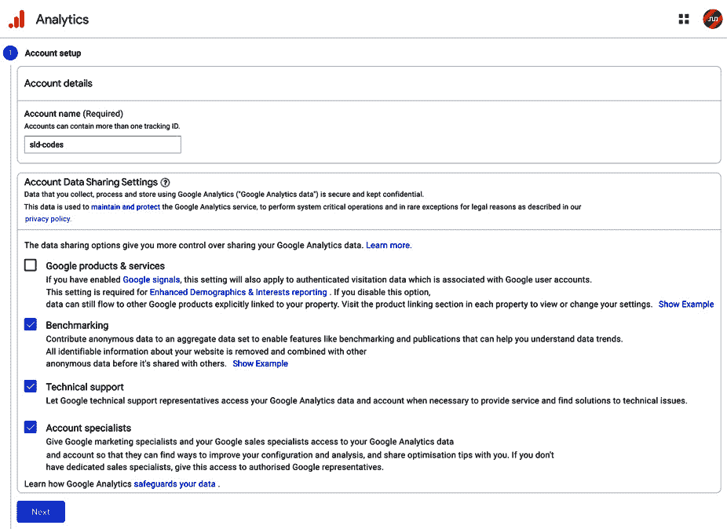
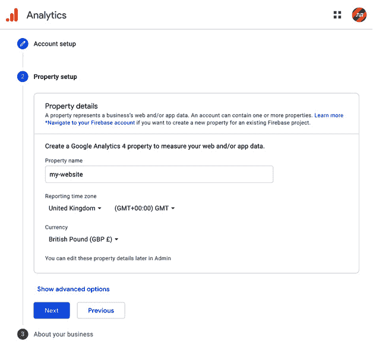
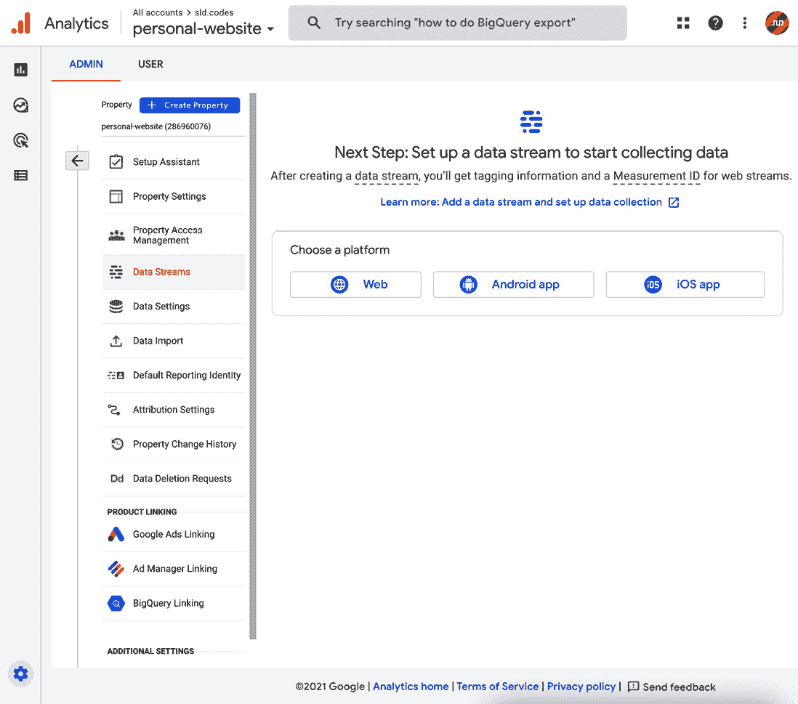
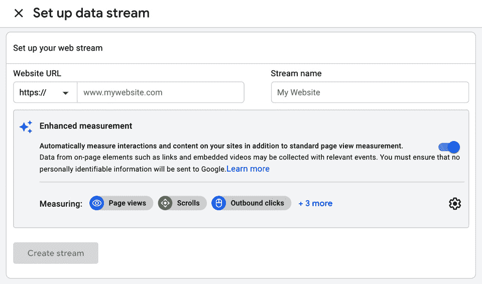
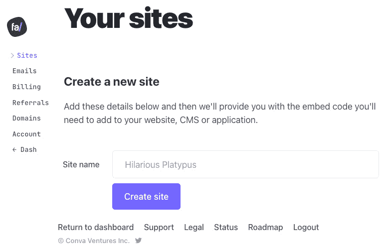
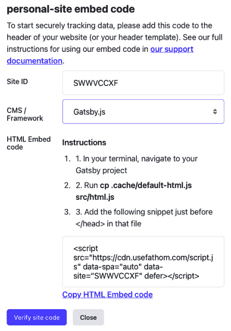
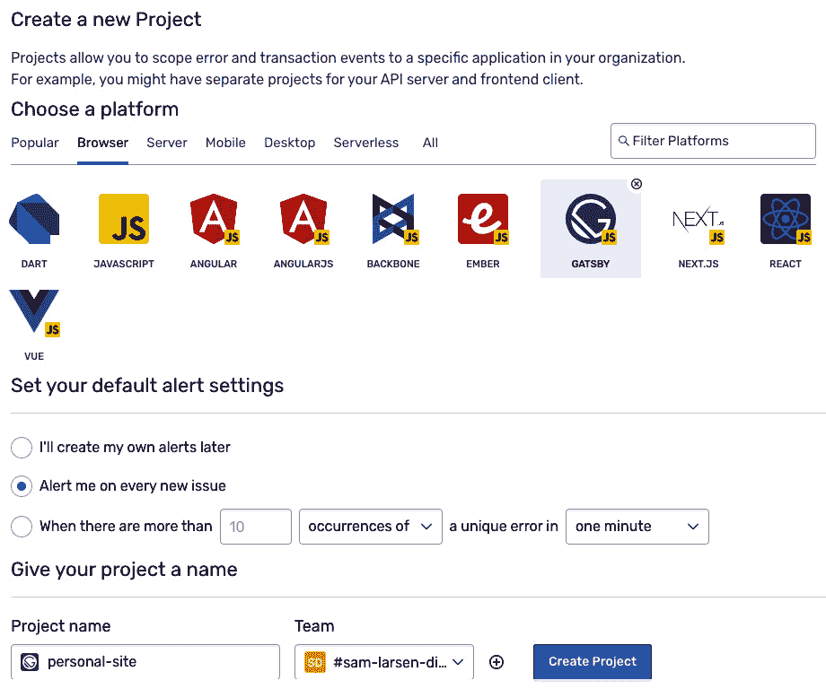

# 第八章：*第八章*：网站分析和性能监控

在本章中，我们将探讨我们可以监控我们应用程序和访问它的用户行为的方法。我们将学习页面分析如何成为帮助创造更好用户体验的有价值工具。我们将学习如何使用两种不同的工具来收集这些页面洞察，具体取决于我们的需求。我们将学习在使用这些工具时我们在法律上需要做什么。我们还将实现插件，使我们能够调试用户在使用我们的网站时遇到的错误。

到本章结束时，你应该有信心能够收集不同类型的分析，并使用它们来了解自己（或网站所有者）关于代码更改如何影响用户体验的信息。

在本章中，我们将涵盖以下主题：

+   介绍网站分析

+   实现页面分析

+   监控您网站的性能

# 技术要求

要完成本章，您需要完成*第七章*，*测试和审计您的网站*。

本章的代码可以在[`github.com/PacktPublishing/Elevating-React-Web-Development-with-Gatsby-4/tree/main/Chapter08`](https://github.com/PacktPublishing/Elevating-React-Web-Development-with-Gatsby-4/tree/main/Chapter08)找到。

# 介绍网站分析

网站分析是收集、汇总、分析和报告网站数据的行为。让我们将网站分析分为两个类别：

+   **页面分析**：我们收集的有关用户如何与我们的网站互动的分析。例如，这可能包括页面浏览量、点击率或跳出率。

+   **性能监控**：我们收集的关于我们的代码如何为用户表现的分析。这主要用于记录用户遇到的 JavaScript 错误。

无论类别如何，它们都以类似的方式工作。首先，插入的`script`标签将一小部分 JavaScript 加载到页面中。这段代码在访问网站的任何人的网络浏览器中运行。在大多数情况下，代码会在用户的浏览器上留下一个包含少量数据的文本文件，这些数据被称为 cookies。这些数据用于识别用户会话。这些数据连同请求信息一起发送回分析工具，以识别用户和正在跟踪的事件。

您已经收集了所有这些数据——接下来是什么？通过查看汇总的用户数据，我们可以深入了解用户的行为。当您试图改善用户体验时，这些信息是您最强大的盟友。您可以使用这些报告来识别用户喜欢的内容类型趋势或用户最常离开您的应用程序的页面等。

现在，让我们花点时间来谈谈收集用户数据时的隐私问题。

## 隐私

无论你打算收集什么数据，考虑用户的隐私总是很重要的。如果你打算存储、转移或处理用户的个人信息，公开并可供公众访问的隐私政策是一项法律要求。同样，流行的分析服务提供商，包括 *Google Analytics*，在其服务条款中规定，如果你使用他们的服务，你必须发布隐私政策。如果不这样做，你就违反了与他们的合同，并且非法使用工具。

除了隐私政策之外，如果你的网站有来自欧洲的访客，拥有一个 cookie 政策也是一个好主意。截至 2018 年，欧盟规定你必须从用户那里获得“明确、知情”的同意才能使用 cookie。这通常以横幅的形式出现，你在用户首次访问你的网站时向他们展示。

既然我们已经了解了网站分析是什么，让我们转向如何实现它们的第一种类型——页面分析。

# 实现页面分析

你可以使用许多工具来执行页面分析。在这本书中，我们将探讨以下两个：

+   Google Analytics

+   Fathom Analytics

**Google Analytics** 是页面分析的世界领导者。超过一半的网站都在使用这个工具。其受欢迎的原因之一是其历史，它自 2005 年以来一直存在。当它推出时，分析领域几乎没有竞争。另一个原因是它是免费的。重要的是要记住，如果你使用的是免费工具或网站，你的数据往往是产品。如果你对你的隐私以及网站访客的隐私感到担忧，那么 Fathom Analytics 可能是一个更好的选择。

与 Google 不同，**Fathom Analytics** 不跟踪个人数据。例如，当页面访问被记录时，它只会告诉你有人访问了，但不会告诉你具体是谁。Fathom 的脚本不使用 cookie，这意味着你不需要 cookie 政策或 cookie 同意横幅。由于 Fathom 致力于尽可能少地收集个人信息，你的隐私政策也可以相对简短。

重要提示

只需实现本节中提到的页面分析工具之一。拥有多个执行相同任务的脚本只会使你的页面更重。

我们将在以下章节中讨论如何实现两种页面分析工具。让我们从 Google Analytics 开始。

## 添加 Google Analytics

要开始跟踪我们 Gatsby 网站内的数据，我们需要从 Google Analytics 获取一个测量 ID。让我们按照以下步骤进行：

1.  从你的浏览器导航到 [`analytics.google.com/analytics/web/?authuser=0#/provision/create`](https://analytics.google.com/analytics/web/?authuser=0#/provision/create)。

1.  为您的账户提供一个 **账户名称** 并输入您的 **账户数据共享设置** 偏好：

    图 8.1 – Google Analytics 账户设置

    名称是特定于项目的，所以给它取一个相关的名字。注意数据共享选项 – 只分享你感到舒适分享给 Google 的信息。

1.  通过输入 **属性名称**、**报告时区**（区域）和 **货币** 来设置一个属性：

    图 8.2 – Google Analytics 属性设置

    此属性特定于你的网站或应用程序。在我们的例子中，这将用于引用 Gatsby 网站的分析，所以像 **personal-website** 或 **my-website** 这样的名字是合适的。

1.  填写 Google 所需的商业信息并提交表格。然后，你将看到以下屏幕：

    图 8.3 – Google Analytics 仪表板

    这是您第一次看到 Google Analytics 仪表板。在我们能够开始利用其功能之前，我们需要设置我们的第一个数据流。

1.  在 **选择平台** 下选择 **Web**。这将打开以下屏幕：

    图 8.4 – Google Analytics 网站流设置

    在 **URL** 下输入你的网站地址，并为你的网站流 **命名**。最后，通过点击 **创建流** 提交表格。这将显示我们新创建的流的详细信息。

1.  记录流量的测量 ID。

现在我们已经获得了测量 ID，让我们将注意力转向我们的 Gatsby 网站仓库，并使用它开始收集网站统计信息：

1.  安装必要的依赖项：

    ```js
    npm install gatsby-plugin-google-gtag
    ```

1.  在你的 `gatsby-config.js` 文件中包含 `gatsby-plugin-google-gtag` 插件：

    ```js
    {
          resolve: `gatsby-plugin-google-gtag`,
          options: {
            trackingIds: [
              "GA-TRACKING_ID", // Your Measurement ID 
            ],
            gtagConfig: {
              anonymize_ip: true
            },
          },
        },
    ```

    通过在你的配置中包含此插件，Gatsby 将将所需的 Google Analytics 脚本附加到你的应用程序的主体中。该插件提供了许多选项，所有这些选项都可以在这里找到：[`www.npmjs.com/package/gatsby-plugin-google-gtag`](https://www.npmjs.com/package/gatsby-plugin-google-gtag)。

    重要的是要注意 `anonymize_ip` gtag 配置选项。在某些国家，如德国，匿名化 IP 是法律要求。在不进行任何额外配置的情况下，插件将自动发送页面浏览事件，每当你的网站路由发生变化时。

这是一个很好的开始，但你很可能会还想跟踪你网站上其他的事件。让我们看看我们如何跟踪自定义事件和外部链接。

### 自定义事件

除了页面浏览量之外，还有许多其他方式可以跟踪用户参与度。今天的网站越来越互动，因此能够跟踪交互非常有用。我们可以通过使用自定义事件在 Google Analytics 中实现这一点。让我们看看使用按钮点击的例子。

假设我们有一个简单的按钮组件：

```js
import React from "react"
const Button = () => {
    return (
        <button>Click Me</button>
    )
}
export default Button
```

要跟踪这个按钮的点击，我们可以利用 `gtag` 函数，该函数通过插件暴露在窗口中：

```js
import React from "react"
const Button = () => {
    const track = (e) => {
        typeof window !== "undefined" &&
         window.gtag("event", "click", { /* Meta Data */ })
    }
    return (
        <button onClick={track}>Click Me</button>
    )
}
export default Button
```

在前面的代码块中，您可以看到在 `onClick` 中，我们调用了一个 `track` 函数。这个函数有条件地调用 `window.gtag` 函数，如果 `window` 被定义。我们需要执行这个检查，因为这个函数在服务器端渲染时不起作用。

重要提示

此插件仅用于生产使用。这意味着在您在开发项目中工作时发生的任何事件都不会被跟踪。为了测试插件是否正常工作，您需要构建并托管网站。

现在我们已经了解了自定义事件是如何工作的，让我们看看我们如何跟踪通过外部链接离开我们网站的人。

### 外部链接

了解用户何时以及从哪里离开您的网站可能很有用。也许您在博客文章中引用了另一位开发者的网站，用户离开去访问那个网站？为了跟踪这种外部流量，`gatsby-plugin-google-gtag` 插件包含一个现成的组件 – `OutboundLink`。让我们看看我们如何使用它：

```js
import React from "react"
import { OutboundLink } from "gatsby-plugin-google-gtag"
const MyLink = () => {
    return (
        <OutboundLink href="https://sld.codes">Visit
 sld.codes.</OutboundLink>
    )
}
export default MyLink
```

正如您在这个示例中应该能看到的那样，我们可以使用 `OutboundLink` 组件作为 `a` 标签的直接替换。正如其名称所暗示的，您应该只为此组件使用外部链接。如果链接是内部链接，您应该使用 Gatsby 的 `Link` 组件。

Google Analytics 是跟踪您网站页面分析的一个很好的方式，但还有许多其他工具您可以用来实现这个目的。让我们看看一个替代方案 – Fathom Analytics。

## 使用 Fathom 分析

Fathom Analytics 被宣传为 Google 的隐私关注替代品。当用户浏览您的网站时，Google Analytics 会收集大量数据，但 Fathom 建议获得的信息太多。Fathom 只收集他们创建单页统计仪表板所需的信息。与 Google 不同，Fathom 不是免费的，起价为每月 $14。为了在我们的 Gatsby 网站中开始跟踪数据，我们需要从 Fathom Analytics 获得一个网站 ID。让我们现在按照以下步骤进行：

1.  使用浏览器导航到 [`usefathom.com`](https://usefathom.com) 并创建一个账户。您需要使用信用卡注册，但您将获得 7 天的免费试用。

1.  在创建账户后，您应该会被提示创建一个新的网站：

    Figure 8.5 – Fathom 仪表板

    给您的网站起一个合适的名字。例如，**personal-website** 就是一个合适的选择。点击 **创建网站**。

1.  提交后，您将获得您的 **网站 ID** 和适用于多种框架的嵌入代码，包括 Gatsby：




图 8.6 – Fathom 嵌入代码

我建议您 **不要** 遵循他们为 Gatsby 提供的说明。为什么？因为他们的说明建议修改 Gatsby 用于服务器端渲染 `head` 和其他 HTML 部分的组件，而 Gatsby 无法保证在不同版本之间保持此文件的一致性，因此干预可能会在以后升级时造成困难。相反，只需记下您的 **网站 ID**。然后，最小化浏览器。

现在我们已经检索到我们的 **网站 ID**，让我们将注意力转向我们的 Gatsby 网站存储库，并开始用统计数据填充 Fathom 仪表板：

1.  安装必要的依赖项：

    ```js
    npm install gatsby-plugin-fathom
    ```

1.  在您的 `gatsby-config.js` 文件中包含 `gatsby-plugin-fathom` 插件：

    ```js
    {
          resolve: 'gatsby-plugin-fathom',
          options: {
            siteId: 'FATHOM_SITE_ID'
          }
     }
    ```

1.  将 `FATHOM_SITE_ID` 替换为您通过 Fathom 网站检索到的 **网站 ID** 属性。

1.  构建并托管您的 Gatsby 网站。`gatsby-plugin-fathom` 仅用于生产环境，因此我们需要创建并托管一个生产版本以验证其是否正常工作。

1.  当您的网站加载完成后，导航到它。一旦渲染完成，返回 Fathom 并点击 **验证网站代码**。它应该会通知您 fathom 已经全部连接好了！

现在，让我们调查如何跟踪比页面视图更多的内容。

### 自定义事件（目标）

与 Google Analytics 类似，Fathom 也允许您跟踪自定义事件。Fathom 将这些事件称为“目标”。要了解我们如何跟踪一个目标，让我们看看使用按钮点击的示例。

首先，我们需要通过 Fathom 创建一个事件：

1.  导航到您的 Fathom 分析仪表板。在 **事件** 部分下，点击 **添加事件**。

1.  给您的活动起一个名字，然后点击 **创建事件**。注意您的事件代码。

现在我们有了事件代码，让我们来使用它！假设我们有一个简单的按钮组件：

```js
import React from "react"
const Button = () => {
    return (
        <button>Click Me</button>
    )
}
export default Button
```

要跟踪此按钮的点击，我们可以利用通过插件公开的 `useGoal` 函数：

```js
import React from "react"
import { useGoal } from "gatsby-plugin-fathom"
const Button = () => {
    const handleGoal = useGoal("YOUR_EVENT_CODE")
    return (
        <button onClick={() => handleGoal(100)}>Click
          Me</button>
    )
}
export default Button
```

`useGoal` 钩子公开了一个接受单个参数的函数，该参数是您目标的价值。也许这是一个购买按钮，您希望在仪表板上记录您的收入。如果您的目标没有价值，将此参数设置为 `0`。

现在我们已经了解了如何跟踪页面分析，让我们看看如何通过应用程序监控在生产中监控我们的应用程序的错误。

# 监控您网站的性能

在生产环境中调试最困难的事情之一是您似乎无法在您的机器上复制的用户错误。没有日志，这可能是一项不可能的任务。幸运的是，有些工具专门用于监控应用程序中的错误，并在事情出错时提醒您。用于此目的最受欢迎的工具之一是 Sentry.io。

## 使用 Sentry.io 分析

Sentry.io 是一个全栈错误跟踪系统，支持各种桌面、浏览器和服务器应用程序——包括 GatsbyJS！Sentry 通过直接集成到我们网站的日志基础设施来工作。让我们学习如何实现 Sentry，以便我们可以监控生产中的错误：

1.  通过浏览器导航到 [`sentry.io/signup/`](https://sentry.io/signup/) 并创建一个账户。

1.  登录后，通过导航到**项目**并点击**创建项目**来创建一个新项目。

1.  填写新项目用户界面，如下所示：



图 8.7 – Sentry 初始化

选择 Gatsby 作为您的平台。由于您的网站在发布时可能规模较小，我建议将默认警报设置设置为**在每一个新问题上提醒我**。最后，为您的项目命名。然后，点击**创建项目**。

然后，Sentry 会为您提供一个很好的分步指南，说明如何在 Gatsby 项目中设置 Sentry。让我们在这里重申这些步骤：

1.  安装必要的依赖项：

    ```js
    npm install --save @sentry/gatsby
    ```

1.  在您的 `gatsby-config.js` 文件中包含 `@sentry/gatsby` 插件：

    ```js
    {
          resolve: "@sentry/gatsby",
          options: {
            dsn: "YOUR_DSN_NUMBER",
            sampleRate: 0.7
          },
    },
    ```

    `sampleRate` 是发送错误事件的速率。Sentry 建议使用 `0.7` 作为默认值，这意味着 70% 的错误事件将被发送。

    完整的插件选项列表可以在此处找到：[`docs.sentry.io/platforms/javascript/guides/gatsby/configuration/options/`](https://docs.sentry.io/platforms/javascript/guides/gatsby/configuration/options/)。

这几行代码就足以让 Sentry 开始跟踪生产中网站的错误和性能。您可以放心，如果您的网站访客遇到错误，您将立即知道。

# 摘要

在本章中，我们学习了网站分析以及它们如何有助于使我们的应用程序发挥最佳性能。我们学习了我们可以收集的不同类型的数据以及我们在收集用户数据时应遵守的法规。我们以两种不同的方式实现了页面分析——一种是通过提供大量数据，另一种是采取更注重隐私的立场。最后，我们还使用 Sentry.io 实现了应用程序监控。现在，您应该有信心收集网站分析。

在下一章中，我们将最终将我们在前八章中学到的所有内容结合起来，并部署我们的网站。
