# *第九章*：部署和托管

在本章中，我们将最终将我们一直在工作的项目部署出去，让全世界都能看到！我们将深入了解 Gatsby 创建的不同类型的构建，并了解如何调试常见的构建错误。在此之后，我们将继续学习如何使用各种不同的平台来部署它们。此外，我们还将发现如何通过将其作为 Express 服务器的一部分来提供服务，以锁定对网站的访问。

在本章中，我们将涵盖以下主题：

+   理解构建类型

+   常见构建错误

+   部署前的检查清单

+   用于部署混合构建的平台

+   用于部署静态构建的平台

+   使用限制用户访问权限的 Gatsby 网站提供服务

# 技术要求

要导航本章内容，您需要完成*第八章*，*网络分析和性能监控*。

本章中展示的代码可以在[`github.com/PacktPublishing/Elevating-React-Web-Development-with-Gatsby-4/tree/main/Chapter09`](https://github.com/PacktPublishing/Elevating-React-Web-Development-with-Gatsby-4/tree/main/Chapter09)找到。

# 理解构建类型

Gatsby 版本 4 引入了两种不同的网站构建方式：

+   作为**静态构建**：这将在构建时使用 Node.js 创建所有页面。生成的文件都是静态的 HTML、JavaScript 和 CSS，可以完全静态地提供服务。

+   作为**混合构建**：这是一种静态构建与服务器端渲染的页面或通过延迟静态生成创建的页面的混合。

当运行 `gatsby build` 时，Gatsby 将检查您网站的内容，并在可能的情况下创建一个静态构建。然而，如果您的网站包含需要服务器端渲染的页面或通过延迟静态生成创建的页面，它将创建一个需要运行在 Node.js 服务器或通过无服务器函数上的服务器端代码的构建。这两种类型的构建都可以使用 `gatsby serve` 命令在本地进行测试。

在部署构建之前，确保本地一切正常运行是值得的。现在，让我们花点时间看看常见的构建错误，并学习如何避免它们。

# 常见构建错误

在我们的项目开发过程中，我们主要以开发模式运行项目。这是一个很好的主意，确保通过运行 `gatsby build` 命令，网站也能与生产构建一起工作。

有时，您可能会发现构建过程中出现错误。那么，让我们谈谈最常见的问题以及我们如何修复它们：

+   您最常遇到的问题是浏览器中找到的 `window` 和 `document` 变量。因此，在您的网站构建过程中，它无法访问它们。您可以通过几种方式解决这个问题。您可以执行一个检查以确认变量已定义（例如，`typeof window !== undefined && yourFunction()`），或者如果适当，您可以将代码移动到 `useEffect` 钩子中。

+   确保您的所有组件、页面以及 `gatsby-browser.js` 和 `gatsby-ssr.js` 文件不要混合使用 **ES5** 和 **ES6** 语法，因为这可能导致构建崩溃。

+   请特别注意确保您 `pages` 目录中找到的所有 JavaScript 文件都是具有默认导出的 React 组件。Gatsby 将此文件夹中的所有 JavaScript 文件视为页面。如果您在此目录中有组件或其他实用函数，您将收到一个错误，表明**页面组件必须导出一个 React 组件才能有效**。如果您看到这个错误，只需将相关文件移出文件夹即可。

现在我们可以在没有问题的前提下构建我们的网站，让我们检查在部署我们的网站之前我们应该运行的实际检查清单。

# 部署前的检查清单

无论您打算如何部署您的网站，您都应该在本地机器上遵循一些步骤，以确保您的首次部署能够顺利运行：

1.  *确保所需的任何部署平台插件都已安装.* 我们将要查看的一些平台有专门用于其产品的 Gatsby 插件。通过将它们添加到您的 Gatsby 网站中，平台能够更好地理解您的项目，因此可以更快地构建您的网站。

1.  *确保您的 Gatsby 网站构建时没有错误.* 一旦构建成功通过，尝试运行 `gatsby serve` 以确保您可以在没有问题的前提下使用该网站。

1.  *确保所有测试都通过.* 确保您已经使用 `npm run test` 运行了我们设置在 *第七章* 的单元测试，即 *测试和审计您的网站*，并确保它们都通过了。

1.  *注意您的 Node.js 版本.* 截至 Gatsby 版本 4，您的 Node.js 版本应该是 14 或更高。您需要确保 Node.js 版本与您的部署平台相匹配，以避免兼容性问题。您可以在终端中运行 `node -v` 来检查这一点。

现在我们已经完成了我们的检查清单，让我们看看我们可以使用各种平台部署我们的网站，从支持混合网站的平台开始。

重要提示

建议您只在单一部署平台上部署您的网站，而不是多个平台。当您可以用一个平台完成工作时，管理多个平台对您来说更容易维护。尝试尝试所有选项，以找到最适合您项目的最佳选择。

# 部署混合构建的平台

由于混合站点需要一个 Node.js 服务器，我们需要使用能够提供这些服务的平台。混合站点在 Gatsby 生态系统中也非常新。在撰写本文时，托管混合构建的唯一稳定选项是 Gatsby Cloud Hosting，因此让我们看看这个平台。

## 部署到 Gatsby Cloud Hosting

**Gatsby Cloud** 是由 Gatsby 组织专门设计和构建的云平台，专为 Gatsby 框架设计。因为他们专注于这个框架，所以他们擅长构建使您的构建尽可能快的科技。这包括以下内容：

+   **增量构建**：Gatsby Cloud 会观察 GraphQL 数据层并识别页面依赖关系。当您推送代码更改时，它会识别数据层更改，并且只重新构建依赖于该数据的页面。这可以大幅加快重复构建的速度——Gatsby 表示增量构建可以比传统构建快 1,000 倍。

+   **智能缓存**：当请求您的站点时，浏览器会收到特殊的缓存头。这些用于确保浏览器不会重新下载在构建之间没有更改的内容。

应该注意的是，平台免费层不支持增量构建。如果您想从中受益，您需要升级。

现在我们已经了解了使用该平台的好处，让我们看看如何将我们的站点部署到该平台。

快速笔记

在 Gatsby 平台上部署混合站点和静态站点的流程是相同的，因此这些说明在两种情况下都适用。

执行以下步骤将您的站点部署到 Gatsby Cloud 平台：

1.  安装 Gatsby Cloud 插件：

    ```js
    npm install --save gatsby-plugin-gatsby-cloud
    ```

    在这里，我们正在安装 Gatsby Cloud 插件。这为 Gatsby Cloud 平台在构建过程中添加了基本的安全头。

1.  在您的 `gatsby-config.js` 文件中包含 `gatsby-plugin-gatsby-cloud` 插件：

    ```js
    module.exports = {
      // rest of config
      plugins: [
        `gatsby-plugin-gatsby-cloud`,
       // other plugins
      ]
    }
    ```

1.  将所有更改提交并推送到您选择的 Git 仓库。

1.  打开浏览器并导航到 [`www.gatsbyjs.com/products/cloud`](https://www.gatsbyjs.com/products/cloud)。点击**开始使用**。

1.  通过填写您的姓名、电子邮件和居住国家/地区来注册平台：![图 9.1 – 注册 Gatsby Cloud

    ![img/Figure_9.01_B15983.jpg]

    图 9.1 – 注册 Gatsby Cloud

1.  选择您的**版本控制系统（VCS**）提供商，登录，并批准 Gatsby Cloud 平台为了与其集成所请求的权限：![图 9.2 – Gatsby Cloud VCS 提供商授权步骤

    ![img/Figure_9.02_B15983.jpg]

    图 9.2 – Gatsby Cloud VCS 提供商授权步骤

1.  当您被重定向到 Gatsby Cloud 时，您将被询问是否想要试用 14 天升级。这取决于您。

1.  然后，您将被导航到您的仪表板，它将是空的，因为我们还没有设置任何站点。现在让我们通过点击**添加站点**来添加我们的站点。

1.  选择 **从 Git 仓库导入**，然后点击 **下一步**。

1.  从列表中选择您的 Git 提供商，然后选择组织和存储库名称。如果由于某种原因，此列表尚未填充，请确保您已授予 Gatsby 从您的 Git 存储库读取的相关权限。

1.  接下来，您需要提供网站详情，包括基础分支和基础目录。您的基础目录应指向存储库中 Gatsby 项目的根目录——这很可能是根目录或 `/`。点击 **下一步**。

1.  然后，您将看到为您的网站提供的可选集成。这些集成可以帮助您的 CMS 与 Gatsby Cloud 通信。当您对 CMS 进行更改时，您可以通过 Gatsby Cloud 预览该内容的外观。如果您想这样做，您可以点击您所使用的 CMS 平台旁边的 **连接** 并按照步骤操作；否则，您可以点击 **跳过此步骤**。

1.  最后，您将被要求添加网站构建所需的任何环境变量。Gatsby 会扫描您网站的综合和插件，以帮助填写它认为您需要的环境变量。务必与您本地的 `.env` 文件进行交叉检查，以确保您拥有所需的一切。

1.  点击 **创建网站**。这将提示 Gatsby 首次开始构建您的网站：

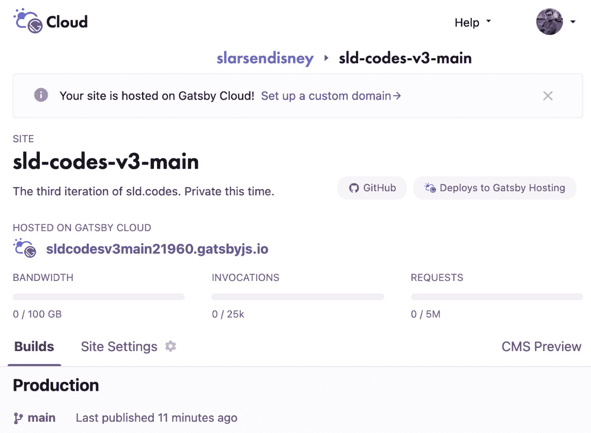

图 9.3 – Gatsby Cloud 网站仪表板

一旦构建完成，您可以通过在先前的截图下 **HOSTED ON GATSBY CLOUD** 标题下的紫色超链接中查看已部署的网站。

每次对基础分支的后续推送，Gatsby Cloud 都会自动构建和部署更改。

现在我们已经了解了如何部署混合构建，让我们看看我们有哪些选项可以用于部署静态构建。

# 静态构建的部署平台

由于静态构建是一个更常见且可预测的格式，因此有更多选项可以托管它们。我们已经了解了 Gatsby Cloud，它可以像混合构建一样部署静态网站。现在，让我们看看另外三个平台——Netlify、Render 和 Firebase。

## 部署到 Netlify

Netlify 是超过 500,000 个网站使用的部署平台。它因其易用性而受到开发者的喜爱。它还提供免费的 **安全套接字层** (**SSL**)。让我们学习如何使用 Netlify 部署我们的网站：

1.  安装 Netlify 插件：

    ```js
    npm install --save gatsby-plugin-netlify
    ```

    在这里，我们正在安装 Netlify 插件，该插件在构建过程中为 Netlify 平台添加基本的安全头。

1.  在您的 `gatsby-config.js` 文件中包含 `gatsby-plugin-netlify` 插件：

    ```js
    module.exports = {
      // rest of config
      plugins: [
        `gatsby-plugin-netlify`,
       // other plugins
      ]
    }
    ```

1.  将所有更改提交并推送到 Git 仓库。

1.  在您的浏览器中导航到 [`app.netlify.com/signup`](https://app.netlify.com/signup)。

1.  使用您的 VCS 提供的第三方登录详情进行注册，并批准 Netlify 平台为与其集成所需的请求权限。

1.  从您的仪表板点击**创建新站点**：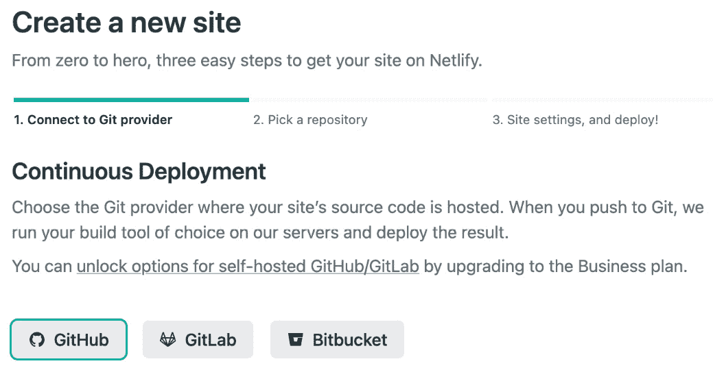

    图 9.4 – Netlify 新站点页面

    选择存储您的仓库的 Git 提供商。然后，选择您想要构建的仓库。

1.  您可以保留**所有者**选项的默认设置。但是，请确保部署分支与您的站点的主要生产分支匹配：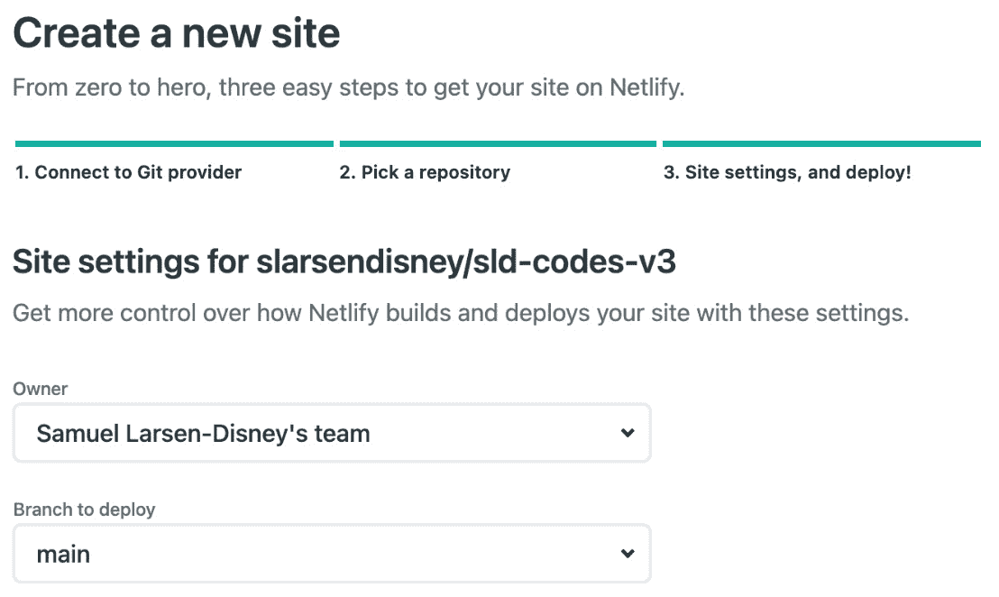

    图 9.5 – Netlify 站点创建设置

1.  最后，分别提供`npm run build`和`public`：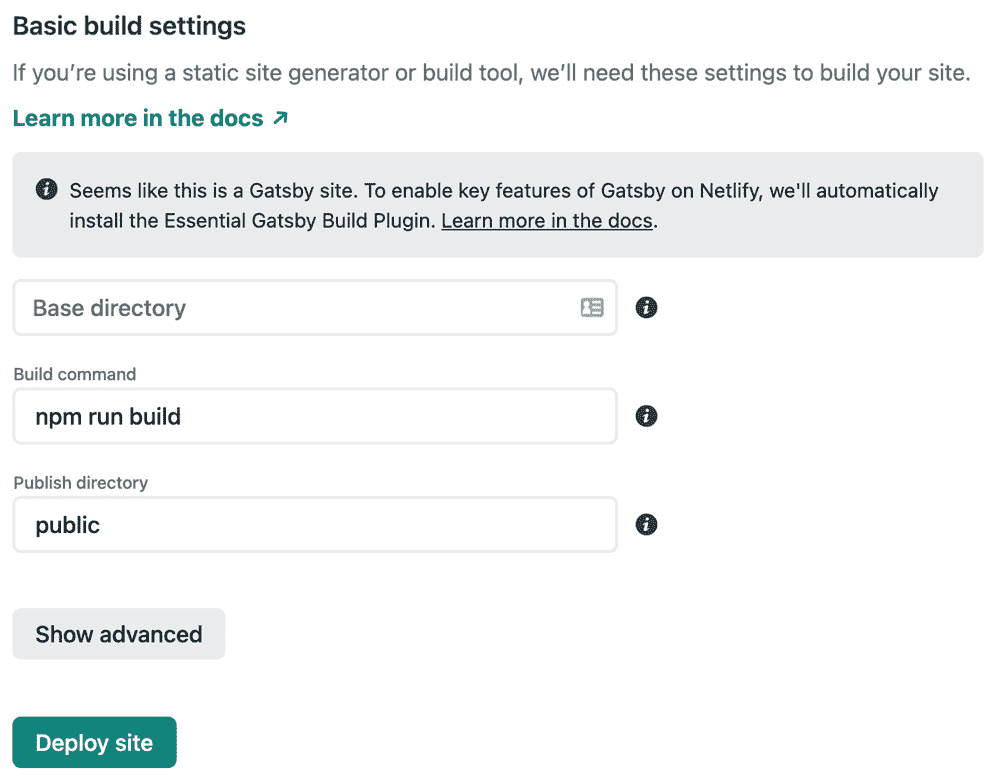

    图 9.6 – Netlify 站点创建构建设置

1.  点击**部署站点**将启动构建过程。

1.  当您的站点正在构建时，注意仪表板顶部的蓝色 URL。这就是您的站点将被部署的地方：

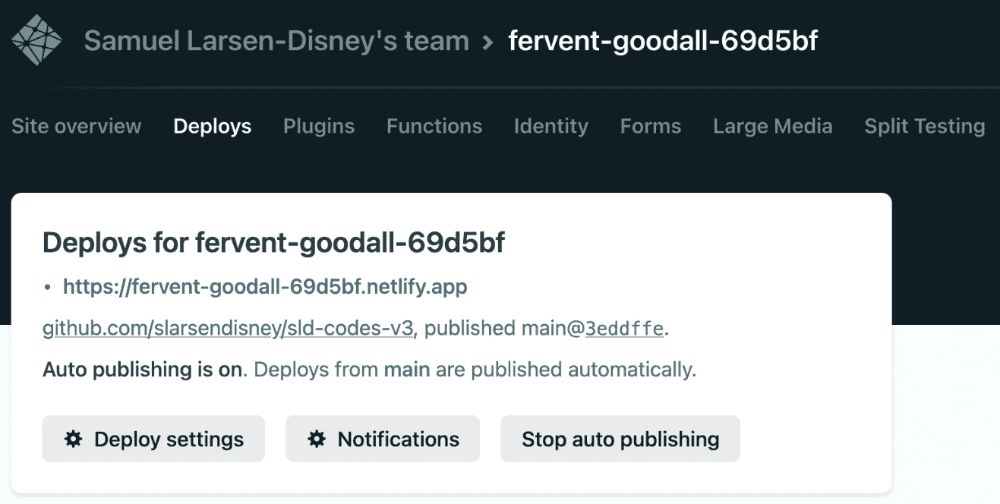

图 9.7 – Netlify 站点仪表板

如果一切顺利，您的站点应在几分钟内部署。随着对基础分支的每次后续推送，Netlify 将自动构建和部署更改。

现在我们已经了解了如何使用 Netlify 进行部署，让我们看看另一个替代方案——Render。

## 部署到 Render

Render 是一个云平台，可以免费 SSL 和全球 CDN 构建和运行 Gatsby 网站。让我们学习如何使用 Render 部署我们的站点：

1.  将所有更改提交并推送到 Git 仓库。

1.  导航到[`dashboard.render.com/register`](https://dashboard.render.com/register)，然后创建一个账户。

1.  从仪表板中，点击**新建**：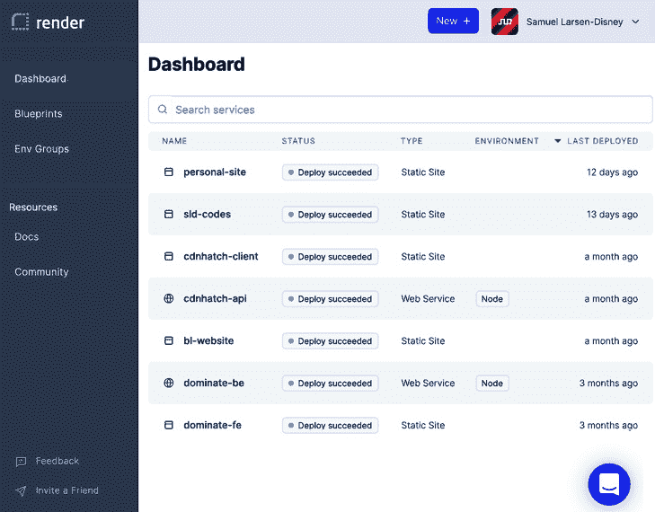

    图 9.8 – 渲染站点仪表板

1.  选择**静态站点**。

1.  在这一点上，您将被要求提供一个仓库。但是，由于您尚未将 Render 连接到您的 VCS，列表将是空的。点击您的 VCS 的超链接，然后按照该第三方提供的 UI 旅程连接 Render 到该系统。在 GitHub 的情况下，它看起来可能像这样：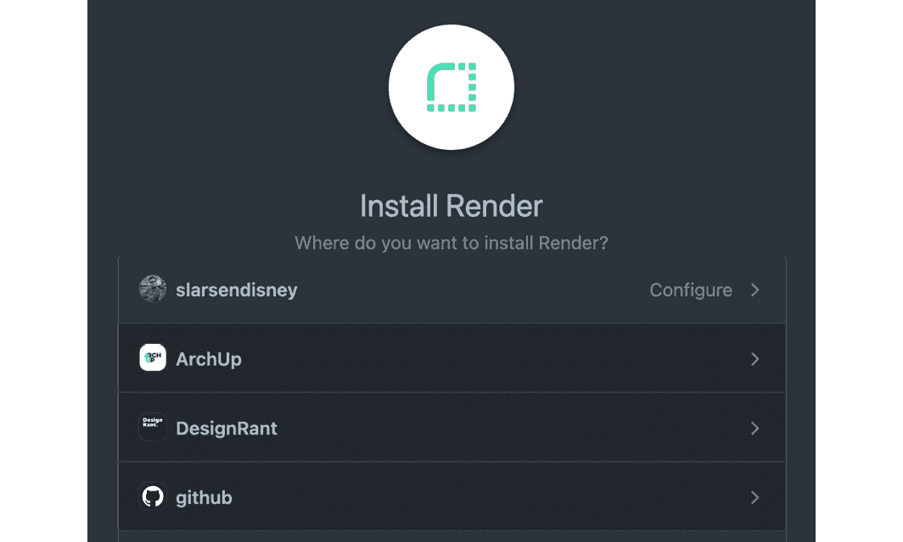

    图 9.9 – GitHub 的第三方安装

1.  列表现在应该已经填充了您的仓库。选择包含您的 Gatsby 站点的那个。

1.  接下来，配置您的站点设置：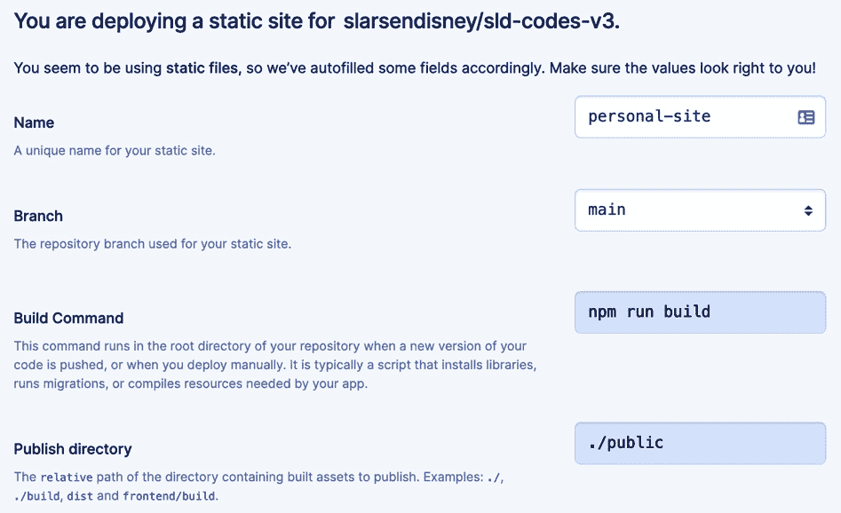

    图 9.10 – Render 站点设置

    `npm run build`和`./public`。

1.  点击**创建静态站点**。

1.  当您的站点正在构建时，注意仪表板顶部的蓝色 URL。这就是您的站点将被部署的地方：

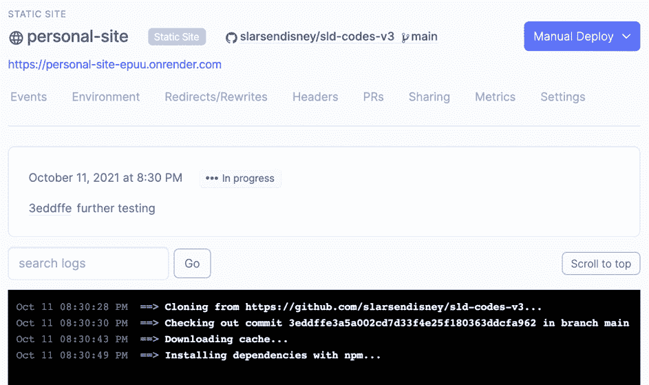

图 9.11 – Render 网站仪表板

如果一切顺利，您的网站应在几分钟内部署。检查 URL 以确保无误。每次将更改推送到基础分支时，Render 都会自动构建和部署更改。

现在我们已经了解了如何使用 Render 进行部署，让我们看看另一种选择——Firebase。

## 部署到 Firebase

Firebase 是谷歌的移动开发应用程序。它允许您通过无代码/低代码开发 UI 管理后端基础设施，从而让您专注于应用程序的前端。Firebase 拥有大量功能，包括实时数据库、机器学习、Cloud Functions 身份验证，以及我们将要关注的特性——托管。让我们学习如何使用 Firebase 部署我们的网站：

1.  导航到[`console.firebase.google.com`](https://console.firebase.google.com)，并使用谷歌账户登录。

1.  登录后，您将被引导到 Firebase 控制台。从那里，点击**添加项目**。

1.  您将被提示为您的项目命名。输入后，注意您的项目 ID，然后点击**继续**：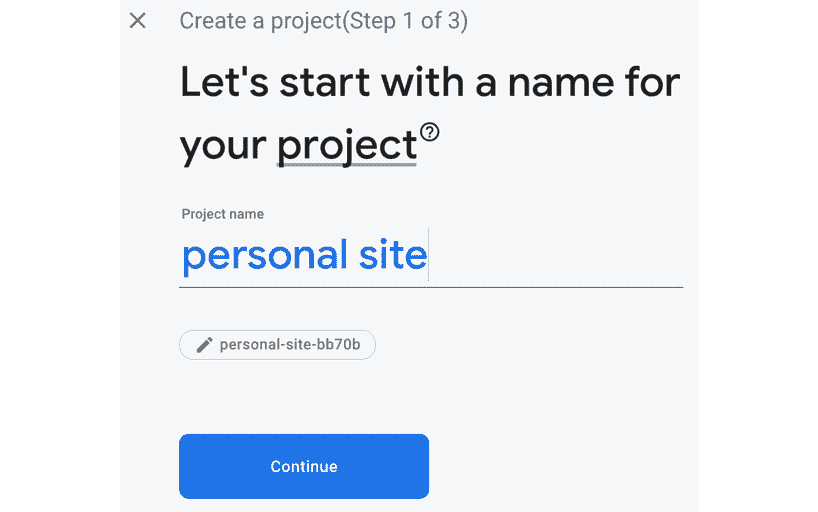

    图 9.12 – Firebase 项目命名

1.  在此阶段，您可以可选地为您项目设置 Google Analytics。如果您在*第八章*“网络分析和性能监控”中将 Google Analytics 添加到您的网站，则在此处不要再次设置：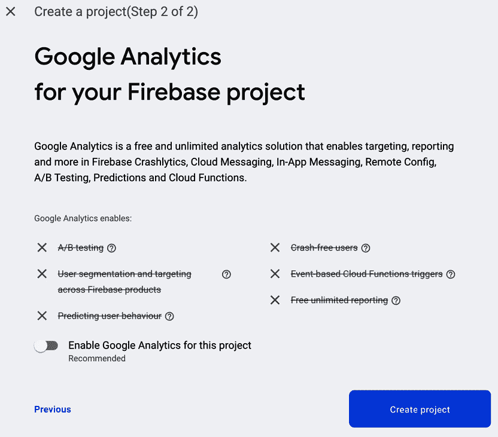

    图 9.13 – 设置 Firebase 项目分析

1.  点击**创建项目**——这将为您项目提供所需的 Google Cloud 服务。现在我们已经在 Firebase 平台上设置了所需的所有内容，可以返回代码。

1.  安装 Firebase CLI：

    ```js
    npm install -g firebase-tools
    ```

    此软件包允许我们将本地项目与 Firebase 平台集成。我们可以使用`-g`命令全局安装它。

1.  运行`firebase login`命令：

    ```js
    firebase login
    ```

    这将打开一个浏览器窗口，提示您使用谷歌账户登录。使用您注册 Firebase 时使用的谷歌账户登录。

1.  完成后，返回您的 Gatsby 项目根目录并运行以下命令：

    ```js
    firebase init
    ```

    这将在我们的 Gatsby 项目中触发 Firebase 初始化 UI，并显示以下内容：

    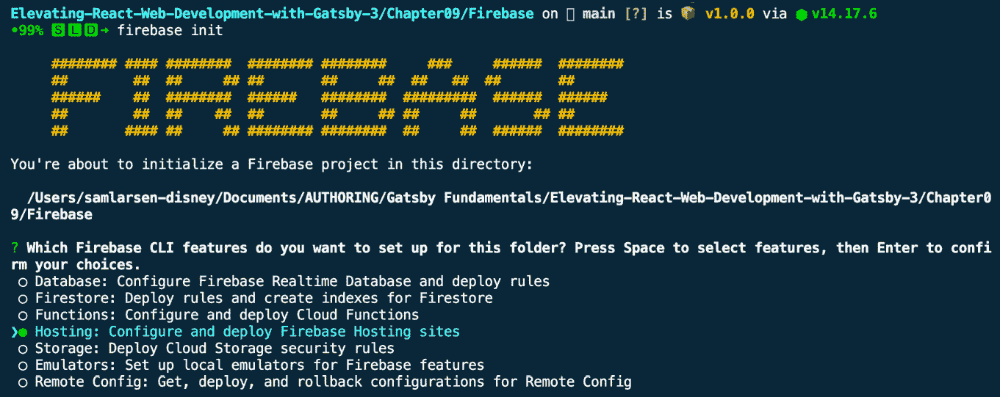

    图 9.14 – Firebase CLI 项目初始化

    在此项目中，我们只使用托管，所以按向下箭头键直到**托管**被选中。然后，按空格键选择它，再按*Enter*键确认您的选择。

1.  Firebase 将询问您要将哪个 Firebase 项目与该目录关联：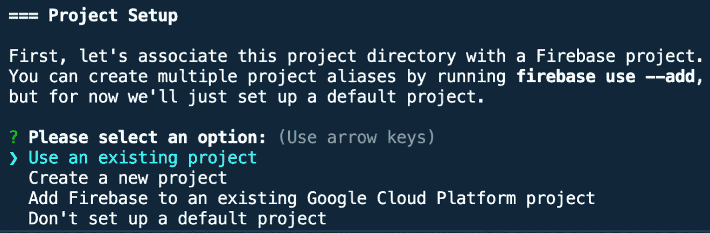

    图 9.15 – 设置 Firebase CLI 项目

    我们已经创建了一个 Firebase 项目，所以请确保选择 **使用现有项目** 并按 *Enter*。

1.  使用上下箭头键选择我们在 *步骤 3* 中创建的项目 ID（项目名称应显示在 ID 旁边的括号中）。然后，按 *Enter*。

1.  在主机设置期间告诉 Firebase 静态构建的位置：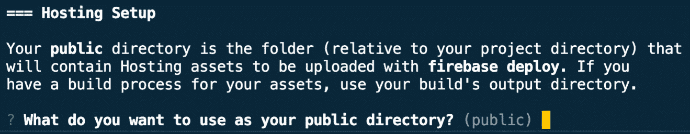

    图 9.16 – 设置 Firebase CLI 主机

    默认情况下，Firebase 使用 `public` 目录，因此我们可以按 *Enter* 而不更改此设置。

1.  然后，它将询问您是否希望将其配置为单页应用程序。输入 `n` 并按 *Enter*。

1.  最后，它将询问您是否想设置与 GitHub 的自动部署。输入 `n` 并按 *Enter*。如果需要，您可以在将来更改此设置，但现在我们将专注于手动部署。

1.  我们现在已经准备好了一切，可以部署到 Firebase。运行以下命令：

    ```js
    gatsby build && firebase deploy
    ```

    如我们所知，`gatsby build` 将创建一个适合生产的网站构建。然后，`firebase deploy` 命令将我们的构建上传到 Firebase 平台，准备好供网站访客访问：

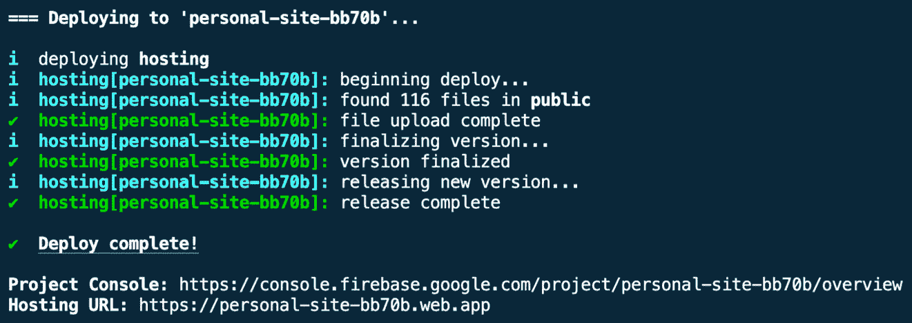

图 9.17 – 部署 Firebase CLI

Firebase 部署完成后，它将在终端中记录一个 **主机 URL**。在浏览器中导航到这个链接，查看您部署的应用程序。

快速提示

如您从这些说明中注意到的，Firebase 是这个列表中唯一一个不需要您将代码推送到版本控制系统的平台。如果您有一个不想使用 VCS 的项目，这是一个很好的选择。需要注意的是，与其他平台不同，Firebase 不会自动部署您的项目，除非它已被设置为部署管道的一部分。

我们已经探讨了将我们的网站部署到互联网上的多种不同方法。如果您完成了前几节中讨论的任何实现，您应该能够将网站 URL 发送给朋友，他们应该能够看到它。然而，如果你不希望网站对所有人可见，而只想对少数人可见怎么办？接下来，让我们看看我们如何可以在需要时降低网站的访问级别。

# 为具有减少用户访问权限的 Gatsby 网站提供服务

您可能会问自己，为什么您会想要减少对网站的访问。一个词 – 安全性。在我们迄今为止看到的所有示例中，我们的网站是公开的，在互联网上供所有人查看，但如果你正在构建一个仅针对选定群体的应用程序呢？也许是你想将作品集锁定在密码后面，或者是一个仅对特定公司的同事可用的入职应用程序。我们可以使用大多数后端 Web 应用程序实现这些功能。

重要提示

这种类型的认证不要与*第十一章*中的认证相混淆，*创建认证体验*。在这里，我们限制了对整个网站的访问，除非你已被批准。在*第十一章*中，*创建认证体验*，访问仅部分受限，因为我们允许用户在不登录的情况下访问应用程序的某些部分。

例如，让我们探索如何使用 Express 在我们的网站上引入密码登录：

1.  安装依赖项：

    ```js
    npm i express express-basic-auth
    ```

    我们将使用 Express 作为后端，并使用`express-basic-auth`实现 HTTP 基本认证作为中间件。

1.  在你的 Gatsby 项目根目录下创建一个`server.js`文件，内容如下：

    ```js
    const express = require("express");
    const app = express();
    const basicAuth = require("express-basic-auth");
    const port = 3000;
    app.use(
      basicAuth({
        challenge: true,
        users: { admin: "testing" },
      })
    );
    app.use(express.static(`${__dirname}/public`));
    app.listen(port, () => {
      console.log(`Example app listening at
        http://localhost:${port}`);
    });
    ```

    首先，我们创建一个`express`应用。然后，我们指导它使用`express-basic-auth`中间件。你会看到我们传递了一个对象，指示中间件对用户进行挑战。当用户导航到网站时，在看到任何内容之前，他们将会看到一个以下对话框：

    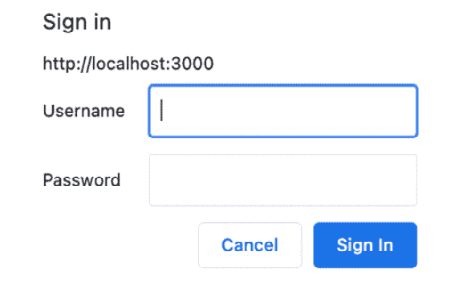

    Figure 9.18 – Basic auth challenge dialog box

    只有当提供的凭据与传递给`basicAuth`的`users`对象中的凭据匹配时，他们才被允许进入网站。

    假设他们成功通过了这个中间件的检查，我们然后允许他们使用`express.static()`方法查看我们网站的静态内容。

1.  修改`package.json`中的脚本以包括一个`start:server`脚本：

    ```js
    "scripts": {
        ...
        "start:server": "node server.js"
      },
    ```

    此脚本将使用 Node.js 运行我们的`server.js`文件。

1.  现在我们已经准备好尝试我们的服务器：

    ```js
    gatsby build && npm run start:server
    ```

    这将构建你的 Gatsby 项目，然后运行你的服务器代码，这将提供你的 Gatsby 构建内容。如果一切顺利，你应该能够访问`localhost:3000`并看到这个实现正在工作。在输入服务器上指定的用户名和密码后，你应该能够看到你的 Gatsby 应用程序。

本章中我们探讨的所有其他静态部署方法都假设 Gatsby 项目是在其自己的专用服务器上托管，但有时，你并不总是有多个服务器的奢侈。这个例子也是一个很好的演示，说明你如何在单个服务器上结合后端和前端代码。你可以使用类似的方法来锁定你的网站到特定的 IP 范围。例如，我们可以扩展这个 Express 服务器，在同一个存储库中为我们的 Gatsby 项目提供 API 端点。

快速提示

你可能想知道如何使用此功能部署网站——Express 服务器的部署超出了本书的范围，但支持此功能的平台包括 Heroku、Render 和 Google Cloud。

现在，让我们花点时间总结一下我们在本章中学到的内容。

# 摘要

在本章中，我们探讨了 Gatsby 项目可以创建的构建类型及其之间的区别。我们研究了在构建过程中出现的常见错误以及如何调试它们。我们学习了如何使用 Gatsby Cloud 部署混合构建，以及如何使用 Netlify、Render 和 Firebase 部署静态构建。此外，我们还发现了如何通过将其作为 Express 服务器的一部分来提供服务，以锁定对网站的访问。现在，你应该对将网站上线的过程感到舒适。

在下一章中，我们将开始探讨更高级的概念。我们将从学习 Gatsby 插件创建开始。
