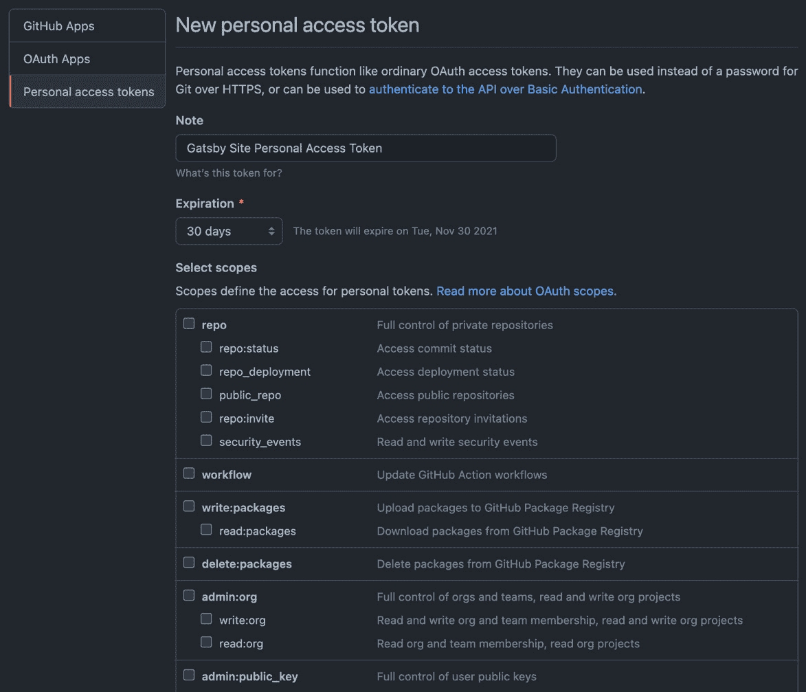
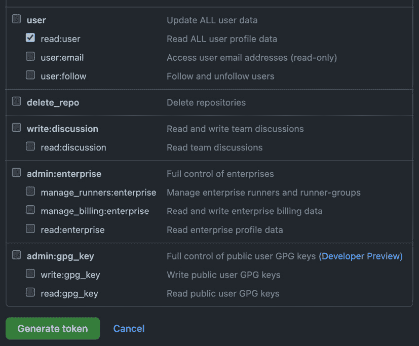
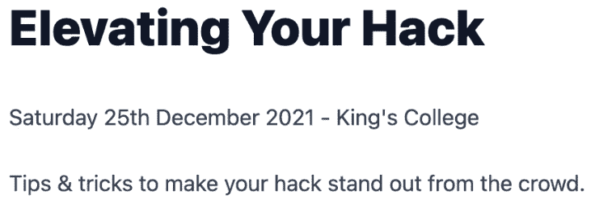

# 第十章：*第十章*：创建 Gatsby 插件

在本章中，我们将探讨 Gatsby 的插件生态系统。我们将从学习如何使我们的 Gatsby 网站在增长过程中变得更加模块化开始。然后，我们将创建我们的第一个源插件，从 GitHub 获取数据。我们还将创建我们的第一个主题插件，为我们的网站创建活动页面。最后，我们将学习如何通过 Gatsby 的插件生态系统将我们的插件与世界分享。

在本章中，我们将涵盖以下主题：

+   理解 Gatsby 插件

+   介绍本地插件开发

+   创建源插件

+   创建主题插件

+   贡献插件生态系统

# 技术要求

要完成本章，你需要完成 *第九章*，*部署和托管*。你还需要一个 GitHub 账户。

本章的代码可以在 [`github.com/PacktPublishing/Elevating-React-Web-Development-with-Gatsby-4/tree/main/Chapter10`](https://github.com/PacktPublishing/Elevating-React-Web-Development-with-Gatsby-4/tree/main/Chapter10) 找到。

# 理解 Gatsby 插件

到这本书的这一阶段，你应该已经拥有了将 Gatsby 网站投入生产所需的所有工具。在本章中，我们将更进一步，讨论如何使用所谓的 **Gatsby 插件** 在多个 Gatsby 网站之间实现可重用性。Gatsby 插件是抽象化利用 Gatsby API 的常见网站功能的节点包。通过将功能打包到插件中，你只需几行代码就可以获取数据、创建页面、实施 SEO 以及更多操作。Gatsby 插件还充当了一种将大型网站模块化为更易管理的功能块的方式。

最常见的两种插件类型如下：

+   `gatsby-node.js` 文件，以及在你的页面中。

+   **Gatsby 主题插件**：主题插件更多地关注应用程序的用户界面。通常，主题插件包含创建网站页面的代码，例如常见问题解答部分。它们将你的 Gatsby 网站分割成更小的、更易管理的项目，当有多个团队在同一网站上工作时，这非常有用。

这两种类型可以通过插件名称来识别，它将分别以 `gatsby-source` 或 `gatsby-theme` 开头。虽然这两种类型是最常见的，但它们并不是唯一的类型。封装其他任何功能的插件，其插件名称将以 `gatsby-plugin` 开头。

在我们深入探讨并开始创建插件之前，让我们先了解本地插件开发，这样我们可以避免常见的陷阱。

# 介绍本地插件开发

本地插件开发从名为`plugins`的新文件夹开始，您需要在您的根目录中创建此文件夹。这是我们将存放我们创建的插件的文件夹。当您将插件添加到 Gatsby 配置中时，Gatsby 首先会在您的`node_modules`文件夹内查找。如果在那里找不到插件，它将检查这个本地的`plugins`文件夹。如果在这个文件夹中找到了具有相同名称的插件，并且其`package.json`文件中也有相同的插件，它将使用它。

如您通过提及`package.json`文件所猜测的那样，插件以 npm 包的形式存在。npm 包负责处理它们的依赖项，因此当您为插件安装包时，您需要确保在插件的文件夹内而不是根目录中打开终端。否则，您网站和插件的依赖项可能不准确。

快速提示

如果您没有打算分享您创建的插件，您可以选择在根目录中安装插件所需的依赖项。如果您更喜欢有一个依赖项的单一来源，这可能更容易管理。但请注意 - *如果您认为插件可能在任何时刻被分享，请不要这样做*，因为您将不得不手动整理您的依赖项并找到插件所需的那些。

在创建本地插件时，您可能会发现您的代码并不像您的其他项目那样表现。让我们看看我们如何调试常见的问题。

## 调试本地插件

Gatsby 不会将本地插件文件夹与其他代码库同等对待。对页面、模板和配置的更改在热重载时可能不会必然出现。这里有一些小贴士可以让您的生活更加轻松：

+   如果您做了更改，即使在重启服务器后也没有看到反映，请尝试使用`gatsby clean`清除缓存。Gatsby 在`.cache`文件夹中缓存插件数据。为了使自身更快，Gatsby 使用这个缓存。

+   如果您不确定您的插件是否正在运行，请尝试将以下命令添加到您的插件的`gatsby-node.js`文件中：

    ```js
    exports.onPreInit = () => console.log("Plugin
    Started!")
    ```

    此命令将在 Gatsby 执行期间首先运行。如果 Gatsby 知道您的插件，您将在控制台看到**Plugin Started!**的日志。

现在我们知道了何时创建插件是个好主意，让我们学习如何创建它们。

# 创建源插件

正如在*理解 Gatsby 插件*部分中提到的，源插件是那些允许我们从新的数据源中摄入数据到我们的 GraphQL 层中的插件。通过创建源插件，我们将获取这些数据的逻辑从我们的网站中抽象出来，这样我们就可以在想要的情况下跨多个 Gatsby 项目重用它。为了理解源插件是如何工作的，让我们一起来构建一个。让我们从 GitHub 获取我们的总贡献量，以便我们可以在我们的**关于**页面上显示它们：

1.  我们需要能够从 GitHub 拉取数据的第一件事是使用访问令牌。导航到 [`github.com/settings/tokens/new`](https://github.com/settings/tokens/new)。

1.  写一个 **备注** 帮助您稍后识别您的访问令牌：

    图 10.1 – GitHub 个人访问令牌生成

1.  将 **过期** 属性更改为您希望的时间长度。一旦选择了时间长度，令牌将被删除并且不再工作。如果您希望它不失效，可以从此列表中选择 **无过期**。

1.  滚动列表并检查 **read:user**：

    图 10.2 – GitHub 个人访问令牌生成（继续）

1.  点击 **生成令牌**。

1.  在下一屏，您将看到您的访问令牌 – 立即记下这个令牌，因为您将无法再次看到它。

    重要备注

    如果您丢失了访问令牌，您将无法再次看到它。GitHub 这样做是为了防止您的密钥被他人用于恶意目的。如果您丢失了密钥，您将不得不创建一个新的，具有相同的权限，并在使用的地方替换令牌。

1.  在您的根目录中创建一个 `.env` 文件并添加以下行：

    ```js
    GITHUB_PROFILE_BEARER_TOKEN=your-token-here
    ```

    在这个阶段，您可能已经在项目中有一个 `.env` 文件。如果是这种情况，只需将前面的代码块行追加到该文件中。

1.  确保在您的项目根目录中安装了 `dotenv` 作为依赖项。如果没有，请运行以下命令：

    ```js
    npm i dotenv
    ```

1.  在您的 `plugins` 文件夹中创建一个名为 `gatsby-source-github-profile` 的新文件夹。

1.  在 `gatsby-source-github-profile` 文件夹中打开终端并运行以下命令：

    ```js
    npm init -y
    ```

    这初始化了我们插件的 npm 包。

1.  安装 `node-fetch` 包：

    ```js
    npm i node-fetch@2.6.5
    ```

    `node-fetch` 包将 `fetch` 浏览器 API 带到 `node`。我在这个例子中使用它，因为我怀疑你们大多数人都会熟悉 `fetch`，因为这本书的目标是针对 React 开发者。

    重要备注

    Node Fetch 从版本 3.0 开始仅支持 ESM。这意味着它不会很好地与我们在 Gatsby 配置文件中使用的 ES5 格式兼容。维护者建议在我们的情况下使用版本 2.6.5。

1.  在 `gatsby-source-github-profile` 文件夹中创建一个 `gatsby-node.js` 文件，并将以下代码添加到其中：

    ```js
    const fetch = require("node-fetch");
    const crypto = require("crypto");
    /* 
      Code added here in the next step
    */
    ```

    在这里，我们正在将我们的最新安装的 `node-fetch` 和 `crypto` 库（随 node 一起提供）导入到我们的项目中。`crypto` 提供了加密功能，我们将在本文件的稍后部分使用它。

1.  在您的导入中，添加以下代码：

    ```js
    exports.sourceNodes = async ({ actions },
     configOptions) => {
      const { createNode } = actions;
      /* 
        Code added here in the next step
      */
    };
    ```

    在这里，我们正在使用`sourceNodes` Gatsby 节点 API。正如其名所示，我们将在此处添加代码以获取我们的数据，然后使用`createNode`操作创建节点。你可能也注意到了，我们正在将`configOptions`作为参数传递。此对象使我们能够访问我们在`gatsby-config.js`文件中使用插件时提供的任何选项。我们将传递我们的访问令牌和用户名作为选项。

    快速提示

    为了提高此文件的可理解性，它已经被分解为其各个部分。如果你觉得难以理解，你可以在本章*技术要求*部分的仓库中查看整个文件。

1.  在`sourceNodes`内部创建一个如下的`POST`请求，用于 GitHub API：

    ```js
      const headers = {
        Authorization: 'bearer ${configOptions.token}',
      };
      const body = {
        query: 'query {
                  user(login: "${configOptions.username}") {
                    contributionsCollection {
                      contributionCalendar {
                          totalContributions
                      }
                    }
                  }
                }',
      };
      const response = await
      fetch("https://api.github.com/graphql", {
        method: "POST",
        body: JSON.stringify(body),
        headers: headers,
      });
      const data = await response.json();
      /* 
        Code added here in the next step
      */
    ```

    我们使用`node-fetch`向 GitHub API 发送`POST`请求。我们在请求头中提供令牌身份验证。在这里，你可以看到我们正在使用`configOptions`中提供的令牌。与 Gatsby 一样，GitHub API 使用 GraphQL。与任何 GraphQL API 一样，为了从 GitHub 选择我们想要的数据，我们必须将查询传递到请求体中。定义在`body`中的查询检索给定用户名（在这种情况下，是你的！）的总贡献。我们从`configOptions`中传递我们的用户名。

1.  在你的请求后添加以下代码：

    ```js
    const { contributionsCollection } = data.data.user;
      const totalContributions =
        contributionsCollection.contributionCalendar.totalCont
     ributions;
      createNode({
        totalContributions: Number(totalContributions),
        id: "Github-Contributions",
        internal: {
          type: 'GitHubContributions',
          contentDigest: crypto
            .createHash('md5')
            .update(
              JSON.stringify({
                totalContributions,
              })
            )
            .digest('hex'),
          description: 'Github Contributions Information',
        },
      });
    ```

    在这里，我们分解我们的请求以接收总贡献数据。然后，我们使用`createNode`函数将此数据添加到我们的 GraphQL 数据层。让我们分解我传递给函数的对象：

    a. `totalContributions`: 对象中的第一个键值是总贡献值。这是我们稍后尝试在我们的页面上检索此信息时将查询的变量。

    b. `id`: 每个节点都必须有一个全局唯一的 ID。因为此节点类型只有一个实例，我们可以直接使用`"Github-Contributions"`字符串。

    c. `internal.type`: 一个全局唯一的类型，我们可以用它来识别此数据源。

    d. `internal.contentDigest`: 此字段帮助 Gatsby 在节点未更改时避免重新生成节点。在创建节点时，如果此字段保持不变，则不会重新生成。因此，我们需要确保如果我们的总贡献发生变化，那么这个`contentDigest`也会变化。为此，我正在使用`crypto`库创建我们总贡献的`md5`哈希。在这个特定的例子中，这可能会显得有些过度，但如果节点上的数据量超过一个键值对，那么它工作得很好，你只需将它们添加到传递给`JSON.stringify`的对象中即可。

    e. `internal.description`: 此字段允许我们描述源类型，如果我们对任何时刻的此源感到困惑，这将很有帮助。此字段不是必需的，但拥有它很好。我们的插件现在已准备好使用 – 从这一点开始的过程与通过 npm 安装的插件相同。

1.  导航到您项目根目录下的`gatsby-config.js`文件并添加以下代码：

    ```js
    require("dotenv").config({
      path: '.env',
    });
    module.exports = {
      // rest of config
      plugins: [
       {
          resolve: 'gatsby-source-github-profile',
          options: {
            token:
             process.env.GITHUB_PROFILE_BEARER_TOKEN,
             username: "your-github-username-here",
          },
        },
       // other plugins
      ]
    }
    ```

    注意，我们正在将选项传递给插件，这些选项在插件的`gatsby-node.js`文件中使用。我们从`.env`文件中获取令牌。你可以将 GitHub 用户名作为纯文本传递，因为这属于公开信息。

    快速提示

    你可能会想在这里添加别人的用户名而不是自己的，但这会导致获取请求失败，因为你的访问令牌没有权限检索其他用户的数据。

1.  启动您的开发服务器。导航到`http://localhost:8000/_graphql` – 你应该可以使用以下查询查询你的总贡献：

    ```js
    query Contributions {
      gitHubContributions {
        totalContributions
      }
    }
    ```

1.  让我们将这个新的数据源添加到我们的`about`页面：

    ```js
    export default function About({ data }) {
      const {
        markdownRemark: { html },
        data prop and render it to the screen, as shown in the highlighted section of code.
    ```

恭喜你 – 你刚刚构建了你的第一个本地插件。你可以复制这里概述的方法从另一个 API 获取数据。所以，到目前为止，我们可以轻松创建源插件，但关于主题插件呢？

# 创建主题插件

正如我们所发现的，主题插件都是关于为我们的 Gatsby 网站添加视觉元素。主题插件独特之处在于它们必须包含一个`gatsby-config.js`文件。为了更好地理解主题插件，让我们看看最简单的例子。让我们使用一个插件来为我们的网站添加一个简单的示例页面：

1.  在您的`plugins`文件夹中创建一个名为`gatsby-theme-sample-page`的新文件夹。

1.  在`gatsby-theme-sample-page`文件夹中打开一个终端并运行以下命令：

    ```js
    npm init -y
    ```

1.  在`/gatsby-theme-sample-page`中创建一个`src`文件夹。

1.  在您的`src`文件夹中创建一个`pages`文件夹。

1.  在您新的`pages`文件夹内创建一个`sample.js`文件并添加以下代码：

    ```js
    import React from "react";
    const Sample = () => {
      return (
        <div>
          <h1>Sample page</h1>
        </div>
      );
    };
    export default Sample;
    ```

    这个页面非常基础，只是在页面上渲染一个标题。

1.  导航到您项目根目录下的`gatsby-config.js`文件并添加以下代码：

    ```js
    module.exports = {
      // rest of config
      plugins: [
        'gatsby-theme-sample-page',
       // other plugins
      ]
    }
    ```

1.  启动您的 Gatsby 开发服务器并导航到`/sample`；你应该能看到你的示例页面。

你可能已经注意到，插件与你的 Gatsby 网站由相同的构建块组成。这也是在 Gatsby 中创建插件如此简单的原因之一。通过使用这个工具构建网站，你也继承了创建插件的能力。

现在我们已经看到了一个基本示例，让我们尝试构建一个更有用、更复杂的示例。让我们创建一个插件，它从一个事件文件夹（JSON 格式）中获取事件并为每个事件创建一个页面：

1.  首先，我们需要在我们的插件中获取一些事件。假设每个事件都将包含一个`标题`、`描述`、`地点`和`日期`。在您的根目录下创建一个名为`events`的文件夹。在这个文件夹内添加一些符合以下格式的 JSON 文件：

    ```js
    {
        "title": "Elevating Your Hack",
        "description": "Tips & tricks to make your hack
          stand out from the crowd.",
        "location": "King's College",
        "date": "2021-12-25"
      }
    ```

    确保 JSON 是有效的，因为错误会导致插件崩溃。

1.  在您的`plugins`文件夹中创建一个名为`gatsby-theme-events-section`的新文件夹。

1.  在`gatsby-theme-events-section`文件夹中打开一个终端并运行以下命令：

    ```js
    npm init -y
    ```

1.  在 `/gatsby-theme-events-section` 中创建一个 `src` 文件夹。

1.  在 `gatsby-theme-events-section` 文件夹中打开一个终端并运行以下命令：

    ```js
    npm i gatsby-transformer-json
    ```

    如其名所示，这安装了用于处理 JSON 的转换器插件。

1.  在 `gatsby-config.js` 文件中添加以下代码：

    ```js
    module.exports = {
      plugins: [
        'gatsby-transformer-json',
        {
          resolve: 'gatsby-source-filesystem',
          options: {
            path: './events',
          },
        },
      ],
    };
    ```

    在这里，我们添加了我们新安装的插件，并将插件指向 `events` 目录中存在的文件系统中的源文件。这些插件将一起工作，为事件目录中的每个 JSON 文件创建一个新的节点。

1.  在 `/gatsby-theme-events-section/src/templates` 中创建一个 `gatsby-node.js` 文件并添加以下代码：

    ```js
    const { createFilePath } = require('gatsby-source-
      filesystem');
    exports.onCreateNode = ({ node, getNode, actions }) => {
      const { createNodeField } = actions;
      if (node.internal.type === 'EventsJson') {
        const slug = createFilePath({ node, getNode });
        createNodeField({
          node,
          name: 'slug',
          value: slug,
        });
      }
    };
    ```

    每当创建一个新节点时，都会调用 `onCreateNode` 函数。使用此函数，我们可以通过添加、删除或操作它们的字段来转换节点。在这个特定的情况下，如果我们创建的节点是 `EventsJson` 类型，我们会添加一个 `slug` 字段。`slug` 是我们网站上特定页面的地址，因此在我们的活动页面中，我们希望每个活动都有一个唯一的 `slug`，它将在网站上渲染。

1.  在 `gatsby-node.js` 文件前面添加以下代码：

    ```js
    exports.createPages = async ({ actions, graphql,
     reporter }) => {
      const { createPage } = actions;
      const EventTemplate =
        require.resolve('./src/templates/event');
      const EventsQuery = await graphql('
      {
        allEventsJson {
          nodes {
            fields {
              slug
            }
          }
        }
      }
      ');
      if (EventsQuery.errors) {
        reporter.panicOnBuild('Error while running GraphQL
          query.');
        return;
      }
      const events = EventsQuery.data.allEventsJson.nodes;
      events.forEach(({ fields: { slug } }) => {
        createPage({
          path: 'event${slug}',
          component: EventTemplate,
          context: {
            slug: slug,
          },
        });
      });
    };
    ```

    这段代码看起来非常熟悉，因为它与我们之前在 *第四章* 的 *创建模板和程序化页面生成* 部分中看到的代码非常相似，即 *创建可重用模板*。在这里，我们正在使用 `createPage` 函数，它允许我们动态地创建页面。在这个函数内部，我们解构 `actions` 对象以检索 `createPage` 函数。然后，我们告诉 Gatsby 在哪里可以找到我们的活动模板。有了这两部分，我们现在可以查询我们的数据了。当你从所有活动中选择 `slug` 属性时，你应该会看到一个熟悉的 GraphQL 查询。之后，我们可以遍历活动并为每个活动创建一个页面，提供 `slug` 属性作为上下文。

1.  在 `/gatsby-theme-events-section/src` 中创建一个 `templates` 文件夹。

1.  在 `/gatsby-theme-events-section/src/templates` 中创建一个 `event.js` 文件并添加以下代码：

    ```js
    import React from "react";
    import { graphql } from "gatsby";
    export default function Event({ data }){
      const {
        event: { description, title, location, date },
      } = data;
      return (
        <div className="prose max-w-5xl">
          <h1>{title}</h1>
          <p>
            {date} - {location}
          </p>
          <p>{description}</p>
        </div>
      );
    }
    ```

    在这里，我们取 `title`、`location`、`description` 和 `date`，这些将在页面查询中检索，并在屏幕上渲染。

1.  将 `events.js` 文件附加以下代码：

    ```js
    export const pageQuery = graphql'
      query($slug: String!) {
        event: eventsJson(fields: { slug: { eq: $slug } }) {
          description
          title
          location
          date(formatString: "dddd Do MMMM yyyy")
        }
      }
    ';
    ```

    在这里，我们使用上下文中的 `slug` 来查找与节点字段中的 `slug` 匹配的活动。我们通过检索 `title`、`location`、`description` 和 `date`（这些已经被格式化）来查询所有我们需要填充此页面的数据。然后，通过 `data` 属性将这些传递到模板中。

1.  现在，让我们创建一个列出所有活动的页面。在 `/gatsby-theme-events-section/src` 中创建一个 `pages` 文件夹。

1.  在 `/gatsby-theme-events-section/src/pages` 中创建一个 `events.js` 文件并添加以下代码：

    ```js
    import React from "react";
    import { graphql, Link } from "gatsby";
    const Events = ({ data }) => {
      const events = data.allEventsJson.nodes;
      return (
        <div className="prose max-w-5xl">
          <h1>Upcoming Events:</h1>
          {events.map(({ title, location, date, fields: {
           slug } }) => (
            <Link to={'/event${slug}'}>
              <h2>{title}</h2>
              <p>
                {date} - {location}
              </p>
            </Link>
          ))}
        </div>
      );
    };
    export default Events
    ```

    在这里，我们正在遍历我们的活动并为每个活动创建一个带有 `title`、`data` 和 `location` 的 `Link`。

1.  将以下代码附加到 `events.js`：

    ```js
    export const query = graphql'
      {
        allEventsJson {
          nodes {
            location
            title
            date
            fields {
              slug
            }
          }
        }
      }
    ';
    ```

    此查询将检索所有事件并将它们返回到节点数组中，这些可以通过页面的 `data` 属性检索。

1.  您已完成所有操作 – 运行您的开发服务器并导航到 `localhost:8000/events`。您应该看到以下输出：


图 10.3 – 事件页面预览

点击事件应带您进入其专属页面：



图 10.4 – 事件页面预览

您刚刚制作了您的第一个本地主题插件。将事件添加到 `events` 文件夹中，它将被附加到列表中，并获得一个专属页面。如果我们发布这个插件，我们就可以在多个 Gatsby 网站中使用它，只需创建一个 `events` 文件夹并填充它。不需要额外的配置！

快速提示

您会注意到本章中提供的示例中缺少样式。本章重点介绍正在使用的 Gatsby API，而不是样式。到目前为止，您应该有足够的信心为这些页面创建样式。

现在我们已经了解了如何创建这两种类型的插件，让我们学习如何发布它们并将它们贡献给社区。

# 贡献插件生态系统

因此，您已经构建了一个插件，现在您想在单独的 Gatsby 项目中使用它？或者也许您认为这个插件可以帮助其他开发者？在任一情况下，您都需要发布您的插件。通过使用 npm 发布您的插件，您的插件将自动在 Gatsby 的网站插件页面上可见（[`www.gatsbyjs.com/plugins`](https://www.gatsbyjs.com/plugins)）。让我们从查看一个发布前清单开始这段旅程。

## 发布前清单

在我们发布插件之前，确保我们已经准备好这样做。以下是一个建议的发布前清单：

+   确保您的插件名称解释了它做什么。这可能看起来有点微不足道，但以使插件名称清晰表明其功能的方式命名插件将使其更容易在网上找到。

+   确保您的插件名称是唯一的。两个 npm 包不能有相同的名称，因此您不能尝试部署一个已经使用的名称的包。要检查您的名称是否已被使用，请访问 [`www.npmjs.com/`](https://www.npmjs.com/) 并搜索您的插件名称。

+   确保您的插件遵循在 *理解 Gatsby 插件* 部分中概述的命名约定。这是 Gatsby 确定哪些 npm 包是 Gatsby 插件并添加到其网站的方式。

+   确保您的插件有一个全面的 `README.md` 文件。此文件将被 Gatsby 捕获并包含在插件生态系统中，因此 `README.md` 文件解释您的插件做什么以及如何使用它至关重要。您应包括可能需要的特定配置选项。

+   检查 React 和 Gatsby 是否是同伴依赖项。

+   确保您的代码已经经过适当的测试。单元测试非常重要，但如果您即将将代码传递给他人，那么这一点尤为重要。争取达到 100% 的测试代码覆盖率。

    重要提示

    如果您更改了插件的名称，请确保这个新名称在 `package.json` 文件以及文件夹名称中都有体现。如果您在以后使用/搜索插件时发现旧名称，可能会造成混淆。

现在我们已经完成了检查清单，让我们学习如何发布一个插件。

## 发布一个插件

发布 Gatsby 插件遵循与发布任何 npm 包相同的流程。让我们学习如何做这件事：

1.  确保您有一个 npm 账户。如果您没有，您可以在 [`www.npmjs.com/signup`](https://www.npmjs.com/signup) 创建一个。

1.  通过在终端运行以下命令从 npm CLI 登录：

    ```js
    npm login
    ```

    CLI 将在登录过程中要求您输入姓名、电子邮件和密码。

1.  将您的终端导航到 Gatsby 插件的目录。*这一点至关重要*。如果您在这些步骤中继续在根目录下操作，您可能会意外地将整个网站作为一个包发布出去，所以请确保您已经导航到插件目录。

1.  最后，运行 `publish` 命令：

    ```js
    package.json file and retry.Quick TipAfter your first publish, you will most likely find things you want to change. If you follow these instructions again, be sure to bump the version number in your `package.json` file as npm will reject a publish with the same version number. 
    ```

现在您的插件已经发布，它应该在 24 小时内出现在 Gatsby 网站插件页面上。

# 摘要

在本章中，我们学习了什么是 Gatsby 插件以及有哪些类型。我们了解了本地插件开发以及如何创建源和主题插件。我们创建了源和主题插件，并在本地通过在我们的网站上包含它们来测试它们。然后我们学习了如何在网络上共享插件。我们讨论了在部署插件之前应该考虑的事项，然后学习了如何通过在 npm 上发布来共享插件。通过完成本章，您现在应该有信心轻松地创建和共享源和主题插件。这只是一个关于巨大主题的简要介绍，我希望您能在此基础上构建知识，为任何用例创建插件。

在下一章中，我们将探讨另一个高级概念——身份验证。我们将学习如何在您的网站上创建登录体验。
