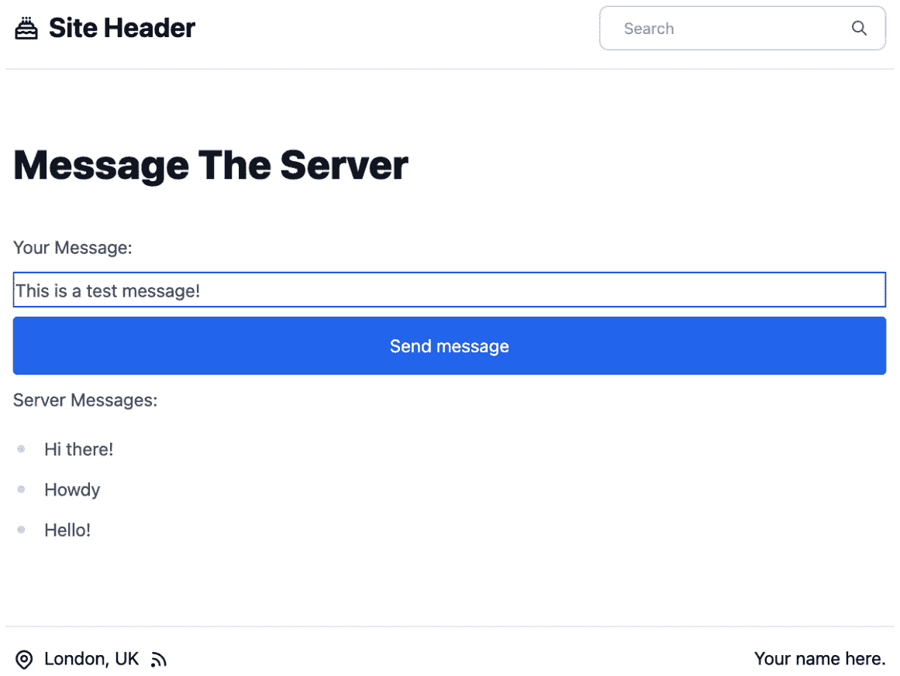

# 第十二章：使用实时数据

您是否曾经点过餐，并看着它向您所在的位置靠近，而无需刷新页面？您可能也见过包裹递送或打车应用中的这种情况。所有这些都使用了**实时数据**。这是一种在获取后立即呈现的数据形式。因此，在这些例子中，一旦您所使用的服务有了食物、包裹或汽车的位置，它就会将此信息传达给您。便利网站和消息应用使实时数据成为可能的最常见方式是使用**WebSocket**。

在本章中，我们将涵盖以下主题：

+   WebSocket 简介

+   Socket.io 实战

+   实时网站访问者计数

+   通过房间获取更多见解

# 技术要求

要完成本章，您需要完成*第十一章*，*创建认证体验*。

本章的代码可以在[`github.com/PacktPublishing/Elevating-React-Web-Development-with-Gatsby-4/tree/main/Chapter12`](https://github.com/PacktPublishing/Elevating-React-Web-Development-with-Gatsby-4/tree/main/Chapter12)找到。

# WebSocket 简介

WebSocket 是客户端和服务器之间的双向通信通道。与**REST**请求不同，WebSocket 连接的通道在客户端和服务器需要时始终开启，以便相互推送消息，而不是在收到响应时关闭。这种通信通常与低延迟相关联，这意味着它可以以最小的延迟处理大量数据。

那么，它是如何工作的呢？首先，客户端向服务器发送一个 HTTP 请求，请求它打开一个连接。如果服务器同意，它将发送一个状态为 101 的响应，表示它将切换协议。此时，握手完成，一个**TCP/IP**连接保持开启状态，允许两个设备之间来回传递消息。此连接将保持开启，直到其中一个设备断开连接或失去连接。

在 JavaScript 世界中，最受欢迎的 socket 实现之一是*socket.io*，它由两部分组成——一个 Node.js 服务器和一个 JavaScript 客户端库。我们将在下一节通过创建一个最小示例来查看 socket.io 的实战。

快速提示

注意，还有其他几种语言实现的*socket.io*服务器和客户端库可用。如果您想将 socket 服务器（我们将在本章创建）与 Gatsby 网站以外的其他内容结合使用，这可能很有帮助。

# Socket.io 实战

在这个演示中，我们将创建一个接受 socket 连接的服务器。当它从客户端收到消息时，它将将其记录到控制台。让我们先创建服务器，然后再转到客户端：

1.  在您的根目录下创建一个名为 `server` 的文件夹。

1.  在`server`文件夹中打开一个终端，并运行以下命令：

    ```js
    npm init -y
    ```

    这将在文件夹中设置一个空的 npm 包。

1.  在同一终端中，运行以下命令：

    ```js
    express dependency for creating our server and the socket.io library.
    ```

1.  在`server`文件夹中创建一个`app.js`文件，并添加以下代码：

    ```js
    const PORT = 3000
    const express = require("express");
    const server = express()
      .listen(PORT, () => console.log('Listening on
        ${PORT}'));
    ```

    这创建了一个最小化的 Express 服务器，它监听端口`3000`上的请求。正如我们已经学到的，这个套接字连接是通过 HTTP 请求建立的，并且需要一个 HTTP 服务器来完成这个操作。

1.  通过在`server`文件夹内打开一个终端并运行以下命令来验证服务器是否正常工作：

    ```js
    Listening on 3000 printed to the console.
    ```

1.  使用以下代码更新`app.js`文件：

    ```js
    const PORT = 3000
    const express = require("express");
    const server = express()
      .listen(PORT, () => console.log('Listening on
        ${PORT}'));
    socket.io for the client-server handshake. We then tell our socket server how to handle events from clients. In this instance, if a client socket sends an event of the message type, we log it to the console.
    ```

1.  在继续之前，我们必须添加一个`server`文件夹并运行以下命令：

    ```js
    cors library, which acts as middleware within our Express application to enable CORS.
    ```

1.  现在，使用以下代码更新你的`app.js`文件：

    ```js
    const PORT = 3000;
    const express = require("express");
    allowlist of origins that are allowed to access the server. The middleware checks the origin of any request to ensure that the origin is present in this list and is therefore allowed. If a request comes from an origin that is not on the list, the cross-origin request will be blocked. In this case, we have added localhost:8000, which is the default development port for Gatsby. If this changes or you are hosting the application, this list will need to be updated.
    ```

1.  现在我们已经设置了套接字服务器，让我们通过使用 Gatsby 作为套接字客户端与它交互。返回到你的 Gatsby 网站根目录。在这里打开一个终端并运行以下命令：

    ```js
    npm i socket.io-client
    ```

    如库的名称所暗示的，这安装了我们将用于与我们的 WebSocket 服务器通信的 socket.io 客户端库。

1.  在你的`pages`文件夹中创建一个新文件，命名为`socket.js`，并将以下代码添加到该文件中：

    ```js
    import React from "react";
    socket.io-client package. Inside a useEffect, we create the socket connection by using the default export from socket.io-client with the server URL string as an argument. In our case, the server port was defined as 3000, so we added http://localhost:3000. This one line of code abstracts all the logic around the client-server handshake, so all you need to focus on is firing the messages you want to send. We then set the socket in our useState so that we can use it within the page. It's best to create the socket connection in useEffect as we only want this connection to be established once. If the page re-renders, we do not want the socket to reconnect as this would be perceived as a new connection by the server. The return statement in our useEffect ensures that the socket connection is closed when the component dismounts.
    ```

1.  继续编辑`socket.js`并添加以下代码：

    ```js
      const sendMessage = () => {
        socket && socket.emit("message", value);
      };  
      return (
        <Layout>
          <div className="max-w-5xl mx-auto py-16 lg:py-24
            flex flex-col prose space-y-2 ">
            <h1>Message The Server</h1>
            <label htmlFor="message">Your Message:</label>
            <input
              id="message"
              className="border-blue-700 border-2"
              onChange={(e) => setValue(e.target.value)}
            />
            <button onClick={sendMessage function is called, which uses socket.emit (if there is a socket available in the state), which emits a message from this client to the server. The first argument is the message type, while the second argument is the body of the message. In this case, we are just sending a string, but you could also send an object with multiple key-value pairs. If you were to send an object, there is no need to JSON.stringify it as the library handles all that for you.
    ```

1.  启动你的 Gatsby 开发服务器，并确保你的套接字服务器也在运行。导航到`localhost:8000/socket`，输入一条消息，然后点击**发送消息**。如果有幸，你的消息内容现在应该已经记录在你的服务器终端中。恭喜你 – 你刚刚通过套接字发送了第一条消息！

现在，让我们扩展这个演示，以便客户端可以接收来自服务器的通信。作为一个例子，让我们让服务器在收到消息时返回三个随机问候语中的一个：

1.  首先，我们需要修改服务器处理消息的方式。使用以下代码修改套接字服务器的连接配置：

    ```js
    io.on("connection", (socket) => {
      socket.on("message", (msg) => {
        console.log("message: " + msg);
     socket.emit(
     "message",
     ["Hi there!", "Hello!",
     "Howdy"][Math.floor(Math.random() * 3)]
     );
      });
    });
    ```

    现在，除了记录从客户端接收到的消息外，我们还会向同一客户端发送一些信息。在这种情况下，我们选择发送一个随机的问候语。

1.  使用我们的 Gatsby 页面，我们需要告诉它期待并处理特定类型的消息。这就像事件监听器一样，所以这应该对你来说很熟悉：

    ```js
    export default function SocketDemo() {
      const [socket, setSocket] = React.useState(null);
      const [value, setValue] = React.useState("");
      useState hook to store the server messages. As we may receive more than one, we set this to an empty array that we can push elements to. Then, we defined a second useEffect. If the socket connection has been established, this function listens for messages from the server of the message type. If it receives one, it adds the body of the message to the server message list.
    ```

1.  更新`page`组件的渲染：

    ```js
      return (
        <Layout>
          <div className="max-w-5xl mx-auto py-16 
           lg:py-24 flex flex-col prose space-y-2 ">
            <h1>Message The Server</h1>
            <label htmlFor="message">Your Message:</label>
            <input
              id="message"
              className="border-blue-700 border-2"
              onChange={(e) => setValue(e.target.value)}
            />
            <button onClick={sendMessage} className="btn">
              Send message
            </button>
     <label>Server Messages:</label>
     <ul>
     {serverMessages.map((message, index) => (
     <li key={index}>{message}</li>
     ))}
            </ul>
          </div>
        </Layout>
      );
    }
    ```

    在渲染中，我们可以遍历服务器消息并将它们以项目符号列表的形式渲染到屏幕上。

1.  启动你的 Gatsby 开发服务器，并确保你的套接字服务器也在运行。导航到`localhost:8000/socket`，输入一条消息，然后点击**发送消息**：



图 12.1 – 套接字演示页面

你的消息应该在服务器的终端中记录，但此外，服务器还应该发送一条消息回来。它应该显示在 **发送消息** 按钮下方。这个过程发生的速度可能会感觉非常快。而且当连接良好时，几乎感觉就像服务器的消息是由你的按钮点击触发的。

我们现在对套接字连接的工作原理有了清晰的理解，并且我们已经成功地在客户端和服务器之间发送了消息。现在，让我们应用所学知识，用这项技术为我们的 Gatsby 网站构建一些有用的功能——在我们的网站页脚中实现实时访客计数。

# 实时网站访客计数

由于在 *Socket.io in action* 部分中，套接字连接被隔离在单个页面上，因此这个设置的配置需要与之前的例子略有不同。然而，我们的网站页脚不在单个页面上，而是在每个页面上！一个能够很好地实现这一点的方案是将网站包裹在某个上下文中。通过这样做，如果我们需要的话，我们就可以在其他应用程序的部分访问计数。让我们一起来尝试这种方法：

1.  使用以下代码修改套接字服务器的连接配置：

    ```js
    io.on("connection", (socket) => {
      io.emit("count", io.engine.clientsCount);
      socket.on("disconnect", function () {
        io.emit("count", io.engine.clientsCount);
      });
    }); 
    ```

    我们对这个配置做了相当大的改动，所以让我们来分解一下。当一个新套接字连接到服务器时，我们使用 `io.emit`。这个函数向所有已连接的客户端发送消息，而不是单个套接字。套接字类型是 `count`，正文包含 `io.engine.clientsCount`，这是已连接客户端的数量。如果你在每次新客户端连接时使用这个，每个人都会知道计数已经改变。然后，我们必须确保在客户端断开连接时也更新计数。为此，当服务器看到客户端掉线时，我们触发相同的 `io.emit`。

1.  如果你还没有创建，请在 `src` 中创建一个名为 `context` 的新文件夹。

1.  创建一个名为 `stats-context.js` 的新文件，并添加以下代码：

    ```js
    import React, { useState, useContext } from "react";
    import openSocket from "socket.io-client";
    const socket = openSocket("http://localhost:3000");
    const StatsContext = React.createContext();
    export const StatsProvider = ({ ...props }) => {
      {/* Code continued in next step */}
    };
    export const useStats = () =>
      useContext(StatsContext);  
    export default StatsContext;
    ```

    在这里，我们正在设置我们统计上下文的模板。我们创建一个 `useStats` 钩子来访问我们将在下一步定义的上下文值。

1.  在 `StatsProvider` 中添加以下代码：

    ```js
    const [socket, setSocket] = React.useState(null);
      const [liveVisitorCount, setLiveVisitorCount] =
        useState(0);
      React.useEffect(() => {
        const newSocket =
          openSocket("http://localhost:3000");
        setSocket(newSocket);
        return () => newSocket.close();
      }, [setSocket]);
      React.useEffect(() => {
        if (socket) {
          socket.on("count", (count) => {
            setLiveVisitorCount(count);
          });
        }
      }, [socket, setLiveVisitorCount]);
      return (
        <StatsContext.Provider
          value={{
            liveVisitorCount,
            connected: socket && socket.connected,
          }}
          {...props}
        />
      ); 
    ```

    在页面级别的演示中，我们使用 `useEffect` 设置套接字。我们在这里做同样的事情，以确保它只发生一次。然后，我们创建第二个 `useEffect`，当连接到服务器时，将监听 `count` 类型的消息。如果收到这样的消息，它将更新状态中的计数，然后通过 `useStats` 钩子在整个应用程序中可用。

1.  更新你的 `gatsby-browser.js` 和 `gatbsy-ssr.js` 文件，添加以下代码：

    ```js
    import React from "react";
    import { StatsProvider } from "./src/context/stats-
      context";
    export const wrapPageElement = ({ element }) => {
      return <StatsProvider>{element}</StatsProvider>;
    };
    ```

    我们希望确保计数的上下文在整个应用程序中可用。通过将此文件添加到 `gatsby-browser.js` 和 `gatsby-ssr.js` 文件中，我们可以确保它在任何地方都可以访问。

1.  在 `src/components/layout` 中创建一个名为 `VisitorCountBadge.js` 的文件，并添加以下代码到其中：

    ```js
    import React from "react";
    import { useStats } from "../../context/stats-
      context";
    const VisitorCountBadge = () => {
      const { liveVisitorCount, connected } = useStats();
      return (
        <p className={'${connected? "bg-blue-200" :"bg-
         red-200"} px-2 py-1 inline-block rounded'}>
         Visitors: {liveVisitorCount}
        </p>
      );
    };
    export default VisitorCountBadge;
    ```

    在这里，我们使用 `useStats` 钩子来检索 `liveVistorCount` 和连接状态。徽章的颜色取决于连接状态——如果是蓝色，则表示我们已连接到服务器；如果不是，它将是红色。然后，我们在徽章中渲染 `liveVistorCount`，以便用户可以看到。

    重要提示

    在这里，我们仅用颜色作为示例来表示应用程序状态。在生产环境中，单独使用颜色来表示应用程序状态是不应该的，因为它可能会使色盲用户无法访问你的应用程序。更好的做法是将颜色与另一个视觉指示器结合使用，例如文本，或者至少是一个 `aria-label`。

1.  使用以下代码更新你的 `Footer` 组件文件：

    ```js
    import React from "react";
    Footer component, it will be visible on every page that utilizes our Layout component.
    ```

1.  启动你的 Gatsby 开发服务器，并确保你的 socket 服务器也在运行。导航到 `localhost:8000`，你应该能看到访问者计数。如果你复制浏览器标签页，访问者计数会上升，而如果你关闭一个标签页，计数会下降。最后，如果你关闭运行 socket 服务器的终端，你应该看到徽章变为红色，表示它已与服务器断开连接。

我们现在已经实现了一个工作状态下的当前访问者计数。让我们通过使用房间来扩展这个功能。

# 通过房间获得更深入的见解

我们还没有讨论过 socket.io 事件中的一个元素，但在我们的应用程序中可能会有很大的好处——`join` 和 `leave`。服务器可以向房间发出消息，向连接到服务器的客户端子集广播事件。

为了演示房间的概念，我们将把我们的访问者计数分解成更细粒度的统计数据。我们不仅会向用户显示网站上总用户数，还会提供他们当前页面上有多少人的详细信息。让我们开始吧：

1.  更新你的 `server/app.js` 文件的 socket 代码，使其包括一个新的事件：

    ```js
    // defined at top of file
    const pathToRoom = (path) => 'Page-${path}';
    // defined in socket configuration
    socket.on("page-update", ({ currentPage, previousPage
       }) => {
        if (previousPage) {
          const previousRoom = pathToRoom(previousPage);
          socket.leave(previousRoom);
          io.to(previousRoom).emit(
            "page-count",
            io.sockets.adapter.rooms.get(previousRoom)?.size
          );
        }
        const roomToJoin = pathToRoom(currentPage);
        socket.join(roomToJoin);
        io.to(roomToJoin).emit(
          "page-count",
          io.sockets.adapter.rooms.get(roomToJoin).size
        );
      });
    ```

    现在，我们期望客户端发送给我们一个新的 `page-update` 类型的事件。正文包含一个 `currentPage` 和一个可选的 `previousPage`。我们将使用这两条信息让他们加入当前页面的房间，并从他们之前页面的房间中移除。

    我们定义了一个名为 `pathToRoom` 的函数，我们用它来获取用户所在路径并将其转换为可以用来作为房间标识符的字符串。如果客户端已经发送了前一页，我们知道这不是他们访问该网站的第一个页面，因此他们需要从 `previousPage` 房间中移除。为此，我们可以使用带有房间标识符作为参数的 `socket.leave` 函数。然后，我们可以使用 `io.to(previousRoom).emit` 向仍然在该页面的用户发出新的减少计数。之后，我们可以使用 `currentPage` 来确定用户应该加入的新房间，并向该房间（包括新用户）的用户发出新的计数。

    快速提示

    `socket.leave` 和 `socket.join` 仅在服务器端。套接字不能在客户端离开和加入房间。

1.  使用以下代码更新 `disconnect` 事件：

    ```js
    socket.on("disconnect", function () {
        io.emit("count", io.engine.clientsCount);
        for(room of io.sockets.adapter.rooms){
          io.to(room[0]).emit(
            "page-count",
            io.sockets.adapter.rooms.get(room[0])?.size
          );
        };
      });
    ```

    当套接字断开连接时，我们遍历所有打开的房间，并将新的客户端数量发送给它们。

1.  使用以下代码更新你的 `gatsby-browser.js` 和 `gatbsy-ssr.js` 文件：

    ```js
    import React from "react";
    import { StatsProvider } from "./src/context/stats-
      context";
    export const wrapPageElement = ({ element, props }) => {
      return <StatsProvider
      location object that Gatsby provides via props to StatsProvider. The location object contains a pathname variable, which will tell us what path the user is currently at.
    ```

1.  导航到你的 `stats-context.js` 文件并更新 `StatsProvider` 参数：

    ```js
    export const StatsProvider = ({ location, ...props })
     => {
    // Code continued in next step
    }
    ```

    我们将需要使用我们现在传递的位置，所以让我们用 props 解构它。

1.  在 `StatsProvider` 的顶部添加两个新的 React 钩子：

    ```js
    useState hook. We will also need to keep a record of the previous location, which we can do using a useRef React hook.
    ```

1.  更新与 `StatsProvider` 中传入的套接字事件相关的 `useEffect`：

    ```js
      React.useEffect(() => {
        if (socket) {
          socket.on("count", (count) => {
            setLiveVisitorCount(count);
          });
          page-count event, we update the pageVisitorCount value in the state using the setPageVisitorCount function.
    ```

1.  在 `StatsProvider` 中创建一个新的 `useEffect`：

    ```js
    React.useEffect(() => {
        if (socket && previousLocation.current !==
          location.pathname) {
          socket.emit("page-update", {
            currentPage: location.pathname,
            previousPage: previousLocation.current,
          });
          previousLocation.current = location.pathname;
        }
      }, [location, socket]);
    ```

    这里是代码中最关键的部分之一。我们将位置添加到 `useEffect` 依赖数组中，这样每当用户在页面之间导航时，这段代码就会运行。在 `useEffect` 中，我们检查套接字是否在状态中可用，并且位置更新不匹配当前位置。如果这两个条件都满足，我们就向服务器发出 `page-update`，告诉它我们移动到了哪里，以便它可以跟踪位置。

1.  更新 `StatsProvider.js` 文件的渲染：

    ```js
      return (
        <StatsContext.Provider
          value={{
            liveVisitorCount,
            pageVisitorCount in the provider's value prop, we can access it via the useStats hook in our components.
    ```

1.  使用以下代码更新 `components/VistorCountBadge.js`：

    ```js
    const VisitorCountBadge = () => {
      const { liveVisitorCount, pageVisitorCount,
       connected } = useStats();
      return (
        <p className={'${connected? "bg-blue-200" :"bg-
         red-200"} px-2 py-1 inline-block rounded'}>
         {pageVisitorCount} of {liveVisitorCount} visitors
         on this page
        </p>
      );
    };
    ```

    在这里，我们正在从 `useStats` 钩子中检索 `pageVisitorCount` 并将其渲染到屏幕上，以便用户可以在徽章中看到该值。

1.  启动你的 Gatsby 开发服务器并确保你的套接字服务器也在运行。导航到 `localhost:8000`；你应该能看到访问者和页面计数。如果你复制浏览器标签页，这两个数字都应该增加，如果你将其中一个标签页导航到网站上的另一个页面，你应该看到两个标签页的页面访问者计数更新。

现在我们已经使用套接字实现了一个完整的功能，让我们总结一下我们学到了什么。

# 摘要

在本章中，我们学习了有关网络套接字的所有知识，以及我们如何使用它们在我们的 Gatsby 应用程序中利用实时数据。然后，我们实现了一个显示当前页面以及整个网站人数的工作访问者计数器。访问者计数器统计是个人网站中网络套接字可能应用的一大类中的一种。也许你可以将在这里学到的知识尝试应用于实现文章反应、投票甚至聊天应用程序？

在下一章中，我们将学习我们的最后一个高级概念——本地化。我们将学习如何使我们的 Gatsby 网站支持多语言以适应国际受众。
