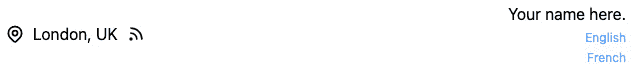

# 第十三章：*第十三章*：国际化与本地化

本章全部关于向国际受众开放您的网站。我们将讨论您可以使用以使网站翻译在扩展时变得简单的模式！以英语创建您的网站使其对世界上说英语的 13 亿人可访问。然而，如果我们为用户提供本地化选项，我们可以将网站翻译成任何语言，因此使我们的网站对所有用户可访问。

在本章中，我们将涵盖以下主题：

+   理解本地化和国际化

+   实施国际化路由

+   程序化页面的页面翻译

+   为单实例页面提供区域翻译

# 技术要求

为了导航本章，您需要完成*第十二章**，使用实时数据*。

本章中提供的代码可以在[`github.com/PacktPublishing/Elevating-React-Web-Development-with-Gatsby-3/tree/main/Chapter13`](https://github.com/PacktPublishing/Elevating-React-Web-Development-with-Gatsby-3/tree/main/Chapter13)找到。

# 理解本地化和国际化

尽管本章的最终目标是设置本地化，但我们可以通过首先实施国际化来简化事情。本地化和国际化的术语经常被混淆，所以让我们正确地定义这些术语：

+   **国际化**：确保您的网站以支持不同语言、区域和文化的这种方式创建的过程。国际化完全是关于在您网站的设计和开发中采取主动，以确保您在将其引入新市场时不必完全重新设计它。例如，这可能包括允许文本从右到左以及从左到右显示。

+   **本地化**：通常在国际化之后进行，本地化是将您的网站适应以满足新的区域要求的过程。这可能包括添加语言或文化要求。

通过在项目初期投入时间确保国际化正确，当您稍后需要添加新的区域设置时，您可以节省大量时间。现在让我们看看我们如何通过国际化策略修改我们的项目。

# 实施国际化路由

大型网站为了适应本地化，通常会在所有路径前加上语言代码。以我们的关于页面为例——英文（默认）语言的页面位于`/about`，但法语的页面可能位于`/fr/about`，德语的页面可能位于`/de/about`。

现在我们为我们的默认语言英语实现此模式，并添加法语作为次要语言。我们可以借助`gatsby-theme-i18n`轻松实现这一点：

1.  安装新的依赖项：

    ```js
    npm install gatsby-theme-i18n gatsby-plugin-react-
    helmet react-helmet
    ```

    在这里，我们正在安装 `gatsby-theme-i18n` 包及其依赖项。此包会自动为我们创建路由前缀。它还会向文档头部添加 `language` 和 `alternate` 标签。这有助于 Google 识别两个页面包含相同内容的不同语言。

    重要提示

    此主题使用 `react-helmet`，这可能与我们在其他章节中使用的 `react-helmet-async` 包冲突。确保在使用两者时，你的文档头部设置如预期，如果遇到问题，请坚持使用单个包。

1.  在你的 `gatsby-config.js` 文件中包含 `gatsby-theme-i18n` 插件：

    ```js
    {
          resolve: 'gatsby-theme-i18n',
          options: {
            defaultLang: 'en',
            configPath:
              require.resolve('./i18n/config.json'),
          },
        },
    ```

    作为此配置的一部分，我们添加了一些选项。`defaultLang` 指的是网站上将使用的默认语言——在这种情况下，这是英语，所以我们使用语言代码 `en`。`configPath` 是我们将设置 `i18n` 的配置路径。这通常是在其自己的文件夹中，我们将在下一步创建该文件夹。

1.  在你的根目录中创建一个名为 `i18n` 的文件夹。

1.  在 `i18n` 文件夹中创建一个名为 `config.json` 的新文件，并添加以下内容：

    ```js
    [
        {
          "code": "en",
          "hrefLang": "en-US",
          "name": "English",
          "localName": "English",
          "langDir": "ltr",
          "dateFormat": "MM/DD/YYYY"
        },
        {
          "code": "fr",
          "hrefLang": "fr-FR",
          "name": "French",
          "localName": "Francais",
          "langDir": "ltr",
          "dateFormat": "DD/MM/YYYY"
        }
      ]
    ```

    在这里，我们为我们要支持的每个区域设置定义一个配置非常重要。每个配置对象必须包含以下内容：

    a. `code`：这指的是你将用于访问此区域设置的语言的代码。虽然你可以为每种语言设置任何你想要的代码，但最好保持它们易于识别，例如，`fr` 用于法语，`en` 用于英语。

    b. `hrefLang`：这是用于 HTML 头部 `hrefLang` 标签属性的值。它用于告诉 Google 你在特定页面上使用的是哪种语言。

    c. `name`：开发者母语中该语言的名字。

    d. `localName`：这是母语使用者拼写该语言名字的方式。

    e. `langDir`：这是给定区域设置中文字的阅读方向。这可能是 `ltr`（从左到右）或 `rtl`（从右到左）。

    f. `dateFormat`：这是区域设置中使用的日期格式。

    快速提示

    在稍后添加区域设置时，这是唯一需要更新的文件，以创建所需的路由来支持该区域设置。

1.  最后，将你网站上 Gatsby `Link` 组件的实例替换为来自 `gatbsy-theme-i18n` 的 `LocalizedLink` 组件：

    ```js
    LocalizedLink is a component that extends the Link component with a language prop. By specifying a language's code (from the i18n/config.json file), we route the user to the corresponding page in that specific language. If no language is specified, it will keep the user in their currently active locale. In the preceding example code, we have modified the footer to include links to the index page for both English and French visitors. This will allow site visitors to switch between the locales on any page.
    ```

1.  让我们验证之前的步骤。首先，启动你的 Gatsby 开发服务器 GraphQL 层（通常位于 `http://localhost:8000/_graphql`）并运行以下查询：

    ```js
    query MyQuery {
      allSitePage {
        nodes {
          path
        }
      }
    }
    ```

    在返回的数据对象中，你应该能够看到所有区域设置的路径节点：

    ```js
    {
      "data": {
        "allSitePage": {
          "nodes": [
            {
              "path": "/"
            },
            {
              "path": "/fr/ "
            },
            {
              "path": "/blog"
            },
            {
              "path": "/fr/blog"
            },
            // Continued list
          ]
        }
      },
      "extensions": {}
    }
    ```

1.  最后，导航到你的 Gatsby 开发站点。现在你的页脚应该包含指向两种语言的链接：



图 13.1 – 带有语言切换功能的站点页脚

点击 `/fr/` 和点击 `/`。

现在我们已经为不同的地区设置了页面，让我们确保在这些页面上显示与语言适当的内容。让我们首先查看由程序生成的页面。

# 程序性页面的页面翻译

为了能够提供翻译成两种语言的页面，如文章和博客文章，我们需要提供两种语言的内容。让我们看看我们如何构建我们的项目，以便不同语言的帖子可供网站访客访问。

`gatsby-theme-i18n` 内置了对处理 `gatsby-plugin-mdx` 插件的支持，如果插件配置选项中添加了扩展名，则将 `.md` 文件视为 `.mdx`：

```js
   {
      resolve: 'gatsby-plugin-mdx',
      options: {
        extensions: ['.mdx', '.md'],
      },
    }
```

我将使用此演示中的本地文件帖子，但一旦内容被摄入到 Gatsby 的数据层，相同的步骤也适用于 CMS 内容：

1.  首先，我们需要以使我们能够轻松识别不同语言中的重复内容的方式重新组织我们的博客文章文件夹。而不是使用文件名，使用文件夹名来分组它们。在 `/blog-posts` 中为每篇文章创建一个文件夹。这些文件夹的好名称格式可能是 `YYYY-mm-DD-Post-Title`。这使得文件夹可以按日期排序，同时也告诉你文件夹的内容，而无需打开文件夹。

1.  在此文件夹中，放置相应的默认语言博客文章并将其重命名为 `index.mdx`。确保 MDX 文件在前端包含一个 `slug`。一个例子可能如下所示：

    ```js
    ---
    type: Blog
    title: My First Hackathon Experience
    desc: This post is all about my learnings from my
      first hackathon experience in London.
    date: 2020-06-20
    hero: ../../../assets/images/cover-1.jpeg
    tags: [hackathon, webdev, ux]
    slug: /my-first-post/
    ---
    My First Hackathon Experience was great!
    Rest of content...
    ```

1.  为你希望添加的每个博客文章重复 *步骤 2*。

1.  在此文件夹中创建第二个文件，命名为 `index.fr.mdx`。此文件名在文件名和扩展名之间添加了地区代码。在本例中，我们使用的是法国（法语），因此地区代码是 `fr`。通过将所有文本值翻译成法语来复制 `index.mdx` 文件的 frontmatter。`slug`、`type`、`hero`、`date` 和 `tags` 必须在这两个文件中保持相同。示例中从 *步骤 2* 开始生成的结果文件如下所示：

    ```js
    ---
    type: Blog
    title: Ma première expérience de hackathon
    desc: Ce post est tout sur mes apprentissages de ma
      première expérience de hackathon à Londres.
    date: 2020-06-20
    hero: ../../../assets/images/cover-1.jpeg
    tags: [hackathon, webdev, ux]
    slug: /my-first-post/
    ---
    Ma première expérience de hackathon était super !
    Rest of content...
    ```

1.  为你希望支持的任何其他语言和地区重复 *步骤 4*。

1.  使用以下配置更新你的 `gatsby-node.js` 文件中的博客文章页面创建配置：

    ```js
    exports.createPages = async ({ actions, graphql,
     reporter }) => {
      const { createPage } = actions;
      const BlogPostTemplate =
        path.resolve('./src/templates/blog-page.js');
      const BlogPostQuery = await graphql('
        {
          allMdx(filter: { frontmatter: { type: { eq:
            "Blog" } } }) {
            nodes {
              slug from the frontmatter of the MDX files. We then use this to create the page with the createPage function, ensuring that we also provide the slug to the component as context. atsby-theme-i18n listens for page creation and will additionally create the same page for each locale without any additional configuration! It will also add two fields to the MDX nodes in our GraphQL data layer – locale and isDefault, which tell you what locale the MDX is and whether the MDX is the default locale, respectively.
    ```

1.  现在我们需要告诉 Gatsby 在正确的地区路径上使用正确的 MDX 文件。如果不执行此步骤，你的网站在创建博客文章时将找到第一个匹配 `slug` 的 MDX 文件。这可能与地区不匹配，因为我们有多个具有相同 `slug` 的文件，可能会导致我们在翻译中迷失方向。首先，更新博客页面模板（位于 `src/templates/blog-page.js`）查询，如下所示：

    ```js
    export const pageQuery = graphql'
      query(gatsby-theme-i18n plugin and use it to filter the MDX blog posts to those that match the specified locale. This will ensure that we render the blog post in the correct language on any blog page.
    ```

1.  在 `src/templates/blog-preview.js` 文件中执行完全相同的步骤：

    ```js
    export const pageQuery = graphql'
      query($locale: String!,$skip: Int!, $limit: Int!) {
        blogposts: allMdx(
          limit: $limit
          skip: $skip
          filter: {frontmatter: {type: {eq: "Blog"}},
        fields: {locale: { eq: $locale }}}
          sort: { fields: frontmatter___date, order: DESC }
        ) {
          nodes {
            frontmatter {
              date
              title
              tags
              desc
              slug
              hero {
                childImageSharp {
                  gatsbyImageData(width: 240, height: 160,
                    placeholder: BLURRED)
                }
              }
            }
          }
        }
      }
    ';
    ```

1.  让我们验证之前的步骤。首先，启动你的 Gatsby 开发服务器 GraphQL 层（通常位于 `http://localhost:8000/_graphql`）并运行以下查询：

    ```js
    query MyQuery {
      blogposts: allMdx(filter: {frontmatter: {type: {eq:
        "Blog"}}}) {
        nodes {
          fields {
            locale
            isDefault
          }
          frontmatter {
            slug
          }
        }
      }
    }
    ```

    在这里，我们正在查询所有类型为 `Blog` 的 MDX，并检索地区信息，无论该地区是否为默认地区，以及 `slug`。结果应如下所示：

    ```js
    {
      "data": {
        "blogposts": {
          "nodes": [
            {
              "fields": {
                "locale": "en",
                "isDefault": true
              },
              "frontmatter": {
                "slug": "/my-first-post/"
              }
            },
            {
              "fields": {
                "locale": "fr",
                "isDefault": false
              },
              "frontmatter": {
                "slug": "/my-first-post/"
              }
            }
          ]
        }
      }
    }
    ```

    对于任何给定的 `slug`，每个区域都应该有一个结果。假设情况是这样，您可以在 Gatsby 开发站点的 `/blog` 上导航。您应该看到您默认语言的博客内容：

![Figure 13.2 – 英语博客页面

![img/Figure_13.02_B15983.jpg]

图 13.2 – 英语博客页面

导航到 `/fr/blog`，您应该看到法语的内容：

![Figure 13.3 – 法语博客页面

![img/Figure_13.03_B15983.jpg]

图 13.3 – 法语博客页面

快速提示

如果您在点击博客文章时总是收到默认区域版本的版本，最可能的原因是您在导航到页面时使用的是 `Link` 而不是 `LocalizedLink`。请参阅本章 *实现国际化路由* 部分的 *步骤 5*。

我们可以使用这种策略轻松地为我们的程序生成页面提供翻译。现在让我们学习如何为单个实例页面设置翻译。

# 为单个实例页面提供区域翻译

对于静态页面，我们需要采取不同的方法来提供翻译。对于任何需要翻译的字符串，我们不能再将其值放在我们的 JSX 中。一个非常常见的方法是使用 `react-i18next`，它有一个名为 `useTranslation` 的优秀钩子，允许您根据区域切换字符串。现在让我们使用这个钩子来为网站访客翻译首页上的内容：

1.  在您的根目录中打开终端并添加以下新依赖项：

    ```js
    npm install gatsby-theme-i18n-react-i18next react-
    i18next i18next
    ```

    在这里，我们正在安装 `gatsby-theme-i18n-react-i18next` 包及其依赖项。此包是一个 Gatsby 主题插件，通过将我们的站点包裹在 `react-i18next` 的上下文提供者中来为我们提供区域支持。在底层，此包使用 `wrapPageElement` 在 `gatsby-browser.js` 中包裹站点，就像我们在 *第十二章**，*使用实时数据* 中所做的那样。

1.  在您的 `gatsby-config.js` 文件中包含 `gatsby-theme-i18n-react-i18next` 插件：

    ```js
        {
          resolve: 'gatsby-theme-i18n-react-i18next',
          options: {
            locales: './i18n/locales',
            i18nextOptions: {
              ns: ["globals"],
            },
          },
        },
    ```

    作为此配置的一部分，我们添加了一些选项。`locales` 指的是我们将存储翻译的位置。`i18nextOptions` 接受 `i18next` 接受的任何配置选项（完整列表可在 [`www.i18next.com/overview/configuration-options`](https://www.i18next.com/overview/configuration-options) 找到）。在这里，我们传递了 `ns` 选项，它是一个要使用的命名空间数组。对于这个例子，我们只将创建一个名为 `globals` 的单个命名空间，但随着您站点的增长，您可能希望添加更多。

    重要提示

    `gatsby-theme-i18n-react-18next` 是一个附加包，它只能与 `gatsby-theme-i18n` 一起使用。确保按照 *实现国际化路由* 部分的步骤安装此包。

1.  在 `i18n` 中创建一个名为 `locales` 的新文件夹。

1.  在 `locales` 中，为您的站点支持的每个区域创建一个新的文件夹，例如，`en` 和 `fr`。

1.  对于每个命名空间，在 `locale` 文件夹中创建一个 JSON 文件。在我们的例子中，我们需要在每个文件夹中为我们的 `globals` 命名空间创建一个名为 `globals.json` 的单个文件。该文件应包含您需要的任何翻译，可以通过在所有文件中保持一致的键来检索。您的英语文件（应位于 `i18n/locales/en/globals.json`）应包含以下内容：

    ```js
    {
        "header": "Site Header",
        "yourName": "Your Name",
        "aboutMe": "About Me",
        "location": "London, UK",
        "bio": "A short biography about me"
      }
    ```

    您的法语文件（应位于 `i18n/locales/fr/globals.json`）应包含以下内容：

    ```js
    {
        "header": "En-tête du site",
        "yourName": "Votre nom",
        "aboutMe": "À propos de moi",
        "location": "France, Paris",
        "bio": "Une courte biographie sur moi."
      }
    ```

1.  要在 Gatsby 页面组件中使用翻译，我们可以使用来自 `react-i18next` 的 `useTranslation` 钩子。以索引页面上的“关于我”链接（位于 `src/pages/index.js`）为例：

    ```js
    import React from "react";
    useTranslation from reacti18next. Then within the page component, we invoke the hook specifying the namespace we wish to use. In our case, this is the globals namespace we have created. The t function can be used to retrieve the translation from the namespace by passing in a valid key from the globals.json objects created in *Step 5*. t("aboutMe") will return *About me* when on the en locale and *À propos de moi* when on the fr locale.
    ```

1.  我们也可以在任何一个其他组件中使用完全相同的流程，例如我们的页眉，例如：

    ```js
    import React from "react";
    import { useTranslation } from "react-i18next";
    import { LocalizedLink } from "gatsby-theme-i18n"
    const Header = () => {
      const { t } = useTranslation("globals");
      return(
      <header className="px-2 border-b w-full max-w-7xl
        mx-auto py-4 flex items-center justify-between">
        <LocalizedLink to="/">
          <div className="flex items-center space-x-2
            hover:text-blue-600">
            <p className="font-bold text-
              2xl">{t("header")}</p>
          </div>
        </LocalizedLink>
      </header>
      )
      };
    export default Header;
    ```

    如果需要，您甚至可以在 MDX 内容中使用的 React 组件内部使用此功能！

1.  通过导航到您的 Gatsby 开发站点的索引页面来验证您的实现。通过修改路径或使用 `Footer` 组件来切换区域设置，您应该会看到任何使用 `useTranslation` 的副本更新。

我们只是刚刚触及了 `i18next` 提供的功能的表面。访问他们的文档[`www.i18next.com/`](https://www.i18next.com/)以了解更多他们提供的强大功能。使用这种策略和前面的章节，您现在应该对翻译您网站的任何方面都感到自信。现在让我们总结一下我们学到了什么。

# 摘要

在这一章的最后，我们学习了如何使我们的网站对全球受众可访问。我们首先确定了国际化与本地化的区别。然后我们使用 `gatsby-theme-i18n` 插件为我们的区域创建路由。我们创建了不同语言的程序性博客文章，并确保在访问区域时可以看到正确的翻译。最后，我们还使用 `gatsby-theme-i18n-react-i18next` 插件翻译了我们的静态页面。在这两个插件之间，您现在可以翻译您网站上的任何内容。

嗨！

我是塞缪尔·拉尔森-迪士尼，著有《提升 React Web 开发与 Gatsby》。我真心希望您喜欢阅读这本书，并发现它对提高您在 Gatsby 中的生产力和效率很有用。

如果您能在亚马逊上分享您对《提升 React Web 开发与 Gatsby》的看法并留下评论，这将对我（以及其他潜在读者！）真的非常有帮助。

点击以下链接或扫描二维码留下您的评论：

[`packt.link/r/1800209096`](https://packt.link/r/1800209096)


您的评论将帮助我了解这本书中哪些地方做得好，以及未来版本中哪些地方可以改进，所以这真的非常感谢。

祝好运，


塞缪尔·拉尔森-迪士尼
